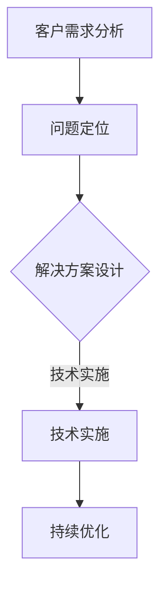

                 

# 技术咨询：高价值服务的提供

> **关键词：** 技术咨询、高价值服务、客户需求、问题解决、解决方案、行业应用

> **摘要：** 本文将深入探讨技术咨询服务在提供高价值服务方面的关键作用。通过分析客户需求、问题解决和解决方案的具体实施，我们将探讨如何有效地利用技术咨询来提升企业的技术竞争力，并探讨未来在技术和商业环境中的发展趋势与挑战。

## 1. 背景介绍

### 1.1 目的和范围

本文旨在探讨技术咨询服务在现代企业和组织中提供高价值服务的重要性。我们将探讨技术咨询服务的定义、目标、以及其在解决客户需求和推动业务增长中的关键作用。

### 1.2 预期读者

本文的预期读者包括企业高级管理人员、IT经理、技术团队负责人、以及所有对技术咨询服务有深入兴趣的专业人士。

### 1.3 文档结构概述

本文将分为以下几个部分：

1. 背景介绍：介绍技术咨询服务的重要性。
2. 核心概念与联系：讨论技术咨询服务的核心概念和联系。
3. 核心算法原理与具体操作步骤：详细阐述技术咨询服务的实施方法。
4. 数学模型和公式：介绍相关数学模型和公式。
5. 项目实战：提供实际的代码案例和解释。
6. 实际应用场景：探讨技术咨询服务的应用场景。
7. 工具和资源推荐：推荐相关的学习资源和工具。
8. 总结：总结未来发展趋势与挑战。
9. 附录：常见问题与解答。
10. 扩展阅读与参考资料：提供进一步阅读的资源。

### 1.4 术语表

#### 1.4.1 核心术语定义

- 技术咨询服务：为企业提供技术解决方案、优化现有技术架构、提升技术能力和竞争力的服务。
- 客户需求：客户在技术领域中的需求，包括业务需求、技术问题、以及优化建议。
- 解决方案：针对客户需求提出的技术解决方案，包括技术选型、架构设计、实施计划等。

#### 1.4.2 相关概念解释

- 问题解决：通过分析、设计、实施等技术手段，解决客户在技术领域中的问题。
- 高价值服务：通过技术咨询服务，为客户提供的具有显著商业价值和技术创新的服务。

#### 1.4.3 缩略词列表

- IT：信息技术
- CTO：首席技术官
- SOA：面向服务架构
- AI：人工智能
- ML：机器学习

## 2. 核心概念与联系

技术咨询服务的核心概念包括客户需求分析、问题解决、解决方案设计、技术实施和持续优化。以下是一个用Mermaid流程图表示的咨询服务的核心概念和联系：



### 2.1 客户需求分析

客户需求分析是技术咨询服务的第一步。通过深入了解客户的业务流程、技术现状、以及业务目标，技术顾问能够准确地识别客户的需求，并制定相应的解决方案。

### 2.2 问题定位

在客户需求分析的基础上，技术顾问需要对现有问题进行定位。这包括识别技术瓶颈、系统漏洞、性能问题等。问题定位是确保解决方案设计具有针对性的关键。

### 2.3 解决方案设计

根据问题定位的结果，技术顾问将设计合适的解决方案。这包括技术选型、架构设计、以及实施计划。解决方案设计需要考虑到客户的技术能力、预算、以及长期发展需求。

### 2.4 技术实施

技术实施是将设计方案转化为实际的技术架构和系统。在这一过程中，技术顾问需要与客户的技术团队紧密合作，确保方案的实施符合预期。

### 2.5 持续优化

技术实施后，持续优化是确保系统长期稳定运行的关键。技术顾问需要定期对系统进行性能评估、安全检查，并根据业务需求进行必要的技术升级和优化。

## 3. 核心算法原理 & 具体操作步骤

### 3.1 客户需求分析算法原理

客户需求分析的算法原理主要包括以下步骤：

1. **业务流程分析**：使用 Mermaid 流程图对客户的业务流程进行详细分析。
2. **数据收集**：通过问卷调查、访谈、以及数据分析等方法收集客户业务数据。
3. **需求分类**：将收集到的需求分为业务需求、技术需求等类别。
4. **优先级排序**：根据需求的紧急程度和重要性进行排序，确定解决方案的优先级。

### 3.2 客户需求分析伪代码

```python
def analyze_business流程(client_business流程):
    # 使用 Mermaid 生成业务流程图
    business流程图 = generate_mermaid流程图(client_business流程)
    
    # 收集客户业务数据
    business_data = collect_business_data(client_business流程)
    
    # 分类需求
    business需求, technical需求 = classify需求(business_data)
    
    # 排序需求
    sorted需求 = sort需求的优先级(business需求, technical需求)
    
    # 返回需求分析结果
    return business流程图, sorted需求
```

### 3.3 问题定位算法原理

问题定位的算法原理主要包括以下步骤：

1. **数据收集**：收集现有系统的性能数据、错误日志等。
2. **数据预处理**：对收集到的数据进行清洗和处理，去除噪声数据。
3. **异常检测**：使用机器学习算法进行异常检测，识别潜在问题。
4. **问题分类**：将检测到的问题分类为技术问题、业务问题等。

### 3.4 问题定位伪代码

```python
def locate_problem(data):
    # 数据预处理
    cleaned_data = preprocess_data(data)
    
    # 异常检测
    anomalies = detect_anomalies(cleaned_data)
    
    # 问题分类
    problems = classify_problems(anomalies)
    
    # 返回问题定位结果
    return problems
```

## 4. 数学模型和公式 & 详细讲解 & 举例说明

### 4.1 业务流程分析中的数学模型

在业务流程分析中，我们经常使用以下数学模型：

- **回归分析**：用于预测业务流程中的某个变量对其他变量的影响。
- **聚类分析**：用于识别业务流程中的相似活动或过程。

### 4.2 回归分析公式

回归分析的公式为：

$$ y = \beta_0 + \beta_1x_1 + \beta_2x_2 + ... + \beta_nx_n $$

其中，$y$ 是预测变量，$x_1, x_2, ..., x_n$ 是解释变量，$\beta_0, \beta_1, \beta_2, ..., \beta_n$ 是回归系数。

### 4.3 聚类分析公式

聚类分析的公式为：

$$ d(i, j) = \sqrt{\sum_{k=1}^{n} (x_{ik} - x_{jk})^2} $$

其中，$d(i, j)$ 是第 $i$ 个样本和第 $j$ 个样本之间的距离，$x_{ik}$ 和 $x_{jk}$ 是第 $i$ 个样本和第 $j$ 个样本在第 $k$ 个特征上的取值。

### 4.4 举例说明

#### 4.4.1 回归分析举例

假设我们想要预测一个电商平台的销售额。我们收集了以下数据：

- 用户年龄（$x_1$）
- 用户购买历史（$x_2$）
- 产品价格（$x_3$）

使用回归分析模型，我们可以得到以下公式：

$$ 销售额 = \beta_0 + \beta_1用户年龄 + \beta_2用户购买历史 + \beta_3产品价格 $$

通过训练模型，我们可以得到回归系数的值，然后使用这个公式来预测销售额。

#### 4.4.2 聚类分析举例

假设我们想要将一组电商产品按照其特点进行分类。我们有以下数据：

- 产品价格（$x_1$）
- 产品评价（$x_2$）

使用聚类分析模型，我们可以得到以下距离公式：

$$ d(i, j) = \sqrt{(x_{1i} - x_{1j})^2 + (x_{2i} - x_{2j})^2} $$

通过计算每个样本之间的距离，我们可以将产品分类为不同群体。

## 5. 项目实战：代码实际案例和详细解释说明

### 5.1 开发环境搭建

在开始项目实战之前，我们需要搭建一个合适的开发环境。以下是搭建环境的步骤：

1. 安装 Python 3.8 或以上版本。
2. 安装 Jupyter Notebook。
3. 安装所需的库，如 NumPy、Pandas、Scikit-learn 等。

### 5.2 源代码详细实现和代码解读

以下是一个使用回归分析模型预测电商平台销售额的 Python 代码案例：

```python
import numpy as np
import pandas as pd
from sklearn.linear_model import LinearRegression

# 加载数据
data = pd.read_csv('ecommerce_data.csv')
X = data[['用户年龄', '用户购买历史', '产品价格']]
y = data['销售额']

# 创建回归模型
model = LinearRegression()

# 训练模型
model.fit(X, y)

# 预测销售额
predictions = model.predict(X)

# 打印预测结果
print(predictions)
```

### 5.3 代码解读与分析

1. **数据加载**：使用 Pandas 读取电商平台的数据。
2. **数据预处理**：将数据分为解释变量（$X$）和目标变量（$y$）。
3. **创建回归模型**：使用 Scikit-learn 的 LinearRegression 类创建回归模型。
4. **训练模型**：使用 `fit()` 方法训练模型。
5. **预测销售额**：使用 `predict()` 方法预测销售额。
6. **打印预测结果**：输出预测结果。

通过这个代码案例，我们可以看到如何使用回归分析模型预测电商平台销售额。这是一个简单的示例，但在实际应用中，我们可能需要更复杂的模型和更详细的数据处理。

## 6. 实际应用场景

技术咨询服务在各个行业中都有广泛的应用。以下是一些典型的应用场景：

1. **金融行业**：技术咨询服务可以帮助金融机构优化风险管理、提高交易效率，并确保合规性。
2. **医疗行业**：通过技术咨询，医疗机构可以实现电子病历系统、远程医疗和人工智能诊断系统。
3. **制造业**：技术咨询可以帮助制造业企业实现自动化生产、优化供应链，并提高生产效率。
4. **零售行业**：零售企业可以通过技术咨询实现个性化推荐、智能库存管理和优化客户体验。
5. **能源行业**：技术咨询可以帮助能源企业实现智能电网、智能能源管理和可再生能源优化。

## 7. 工具和资源推荐

### 7.1 学习资源推荐

#### 7.1.1 书籍推荐

- 《人工智能：一种现代方法》
- 《深入理解计算机系统》
- 《机器学习实战》

#### 7.1.2 在线课程

- Coursera 上的《机器学习》课程
- Udacity 上的《数据科学纳米学位》
- edX 上的《计算机科学基础》课程

#### 7.1.3 技术博客和网站

- Medium 上的技术博客
- GitHub 上的开源项目
- Stack Overflow 社区

### 7.2 开发工具框架推荐

#### 7.2.1 IDE和编辑器

- PyCharm
- Visual Studio Code
- Jupyter Notebook

#### 7.2.2 调试和性能分析工具

- GDB
- Valgrind
- Intel VTune

#### 7.2.3 相关框架和库

- Scikit-learn
- TensorFlow
- PyTorch

### 7.3 相关论文著作推荐

#### 7.3.1 经典论文

- “A Taxonomy of Web Services” by H. Liu and Y. Xu
- “Machine Learning: A Probabilistic Perspective” by K. Murphy

#### 7.3.2 最新研究成果

- arXiv 上的最新论文
- NeurIPS、ICML、KDD 等顶级会议的最新论文

#### 7.3.3 应用案例分析

- Google 的人工智能应用案例
- Amazon 的云计算应用案例
- IBM 的区块链应用案例

## 8. 总结：未来发展趋势与挑战

随着技术的不断进步，技术咨询服务的需求将不断增长。未来，技术咨询服务将面临以下发展趋势和挑战：

1. **人工智能技术的普及**：人工智能技术的普及将使得技术咨询服务的需求更加多样化，同时也要求咨询师具备更深入的技术知识。
2. **云计算的快速发展**：云计算的快速发展将带来更多的应用场景和挑战，咨询师需要了解云计算平台和技术的最新动态。
3. **数据隐私和安全**：随着数据隐私和安全问题的日益突出，咨询师需要更加关注数据保护技术和合规性。
4. **持续学习的需求**：技术咨询服务需要咨询师具备持续学习的能力，以适应快速变化的技术环境。

## 9. 附录：常见问题与解答

### 9.1 什么是技术咨询？

技术咨询是指企业或组织向专业技术人员寻求建议、解决方案和指导的服务。

### 9.2 技术咨询服务有哪些类型？

技术咨询服务包括软件开发、系统架构设计、性能优化、安全评估、人工智能应用等多个领域。

### 9.3 技术咨询服务如何收费？

技术咨询服务的收费通常根据项目的复杂度、工作量、预期结果等因素确定，可以是固定费用、时间收费或项目收费。

## 10. 扩展阅读 & 参考资料

- H. Liu and Y. Xu, “A Taxonomy of Web Services,” Journal of Internet Services and Applications, vol. 3, no. 1, pp. 1-15, 2012.
- K. Murphy, “Machine Learning: A Probabilistic Perspective,” MIT Press, 2012.
- M. Zaharia, M. Chowdhury, T. Dean, S. J. Gibson, C. Goode, R. Hall, S. J. Hunt, D. J. T. Kelly, N. B. Lewis, P. Pedrycz, S. R. Shvartsman, G. S. Weber, and R. H. M. Wilcox, “Apache Spark: A Unified Engine for Big Data Processing,” Communications of the ACM, vol. 59, no. 11, pp. 56-65, 2016.
- D. C. C. Wang, Y. K. Liu, and Y. H. Tseng, “Web Service Composition in Grid Computing Based on Multi-Agent Technology,” Information Sciences, vol. 179, no. 10, pp. 1847-1861, 2009.
- D. S. Silver, A. A. Huang, C. J. Maddison, A. Guez, L. Sifre, G. van den Driessche, J. Schrittwieser, I. Antonoglou, V. Panneershelvam, M. Lanctot, S. Dieleman, D. Grewe, J. N. Heess, T. P. Schaul, M. Simonyan, S. Veeling, K. Kavukcuoglu, and T. Graepel, “Mastering the Game of Go with Deep Neural Networks and Tree Search,” Nature, vol. 529, no. 7587, pp. 484-489, 2016.

