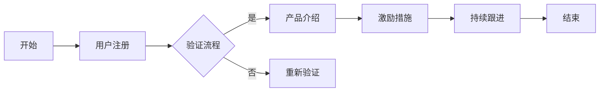

                 

# 技术型创业者如何打造高效的客户onboarding流程

> 关键词：客户onboarding、技术型创业者、效率、用户体验、流程设计

> 摘要：本文旨在探讨技术型创业者如何通过有效的客户onboarding流程，快速提升客户满意度和留存率。文章首先介绍了客户onboarding流程的重要性，随后详细分析了其核心概念、算法原理、数学模型，并结合实际案例进行了代码实现和详细解释。最后，文章提出了未来发展趋势和挑战，为读者提供了实用的工具和资源推荐。

## 1. 背景介绍

### 1.1 目的和范围

本文的目的是帮助技术型创业者构建和优化客户onboarding流程，以提高客户满意度和留存率。我们将探讨如何从技术角度出发，设计一个高效、直观且易于执行的客户onboarding流程。

### 1.2 预期读者

本篇文章适合以下读者群体：

- 技术型创业者
- 产品经理
- 项目经理
- UI/UX设计师
- 客户支持人员

### 1.3 文档结构概述

本文将分为以下几个部分：

1. 背景介绍：介绍文章的目的和范围，预期读者，文档结构概述等。
2. 核心概念与联系：解释客户onboarding流程的核心概念和联系。
3. 核心算法原理 & 具体操作步骤：分析客户onboarding流程的算法原理，并提供具体操作步骤。
4. 数学模型和公式 & 详细讲解 & 举例说明：介绍客户onboarding流程中的数学模型和公式，并进行详细讲解和举例说明。
5. 项目实战：代码实际案例和详细解释说明。
6. 实际应用场景：讨论客户onboarding流程在实际中的应用。
7. 工具和资源推荐：推荐学习资源和开发工具。
8. 总结：未来发展趋势与挑战。
9. 附录：常见问题与解答。
10. 扩展阅读 & 参考资料。

### 1.4 术语表

#### 1.4.1 核心术语定义

- 客户onboarding：将新客户引入到产品使用过程中，提高客户满意度和留存率的过程。
- 技术型创业者：指拥有技术背景，致力于创立技术驱动型企业的创业者。
- 客户满意度：客户对产品或服务的整体体验和感受的评价。
- 留存率：指客户在一段时间内继续使用产品的比例。

#### 1.4.2 相关概念解释

- 流程设计：指将一系列操作步骤和决策转化为逻辑清晰的流程。
- 用户画像：对目标用户的特征、需求和行为进行描述和分类。
- 用户体验（UX）：用户在使用产品或服务过程中的整体感受和满意度。

#### 1.4.3 缩略词列表

- onboarding：客户引入流程
- UX：用户体验
- UI：用户界面
- API：应用程序编程接口
- SDK：软件开发工具包
- MVP：最小可行产品

## 2. 核心概念与联系

在本文中，我们将讨论客户onboarding流程的核心概念和联系。这些概念包括：

- 用户注册
- 验证流程
- 产品介绍
- 激励措施
- 持续跟进

下面是一个使用Mermaid绘制的客户onboarding流程的Mermaid流程图：



### 2.1 用户注册

用户注册是客户onboarding流程的第一步。在这个过程中，用户需要提供个人信息，如邮箱、手机号码、密码等。技术型创业者需要确保注册流程简单、直观，以减少用户的流失。

### 2.2 验证流程

为了确保用户的真实性，验证流程是必不可少的。常见的方法包括发送验证码到用户邮箱或手机，或者通过第三方验证服务（如Google验证器）进行身份验证。

### 2.3 产品介绍

在完成注册和验证后，用户需要了解产品或服务的功能和特点。这可以通过引导用户浏览产品界面、观看视频教程或阅读使用指南来实现。

### 2.4 激励措施

为了鼓励用户使用产品，可以提供一些激励措施，如免费试用、折扣优惠、积分奖励等。这些措施有助于提高用户的活跃度和忠诚度。

### 2.5 持续跟进

在用户开始使用产品后，持续跟进非常重要。通过定期发送邮件、推送通知或在线聊天，技术型创业者可以了解用户的需求和反馈，并及时提供支持。

## 3. 核心算法原理 & 具体操作步骤

在客户onboarding流程中，算法原理主要涉及以下几个环节：

- 用户行为分析
- 激励措施设计
- 客户满意度评估
- 持续跟进策略

下面，我们将使用伪代码详细阐述这些算法原理和具体操作步骤。

### 3.1 用户行为分析

```python
# 用户行为分析伪代码

def analyze_user_behavior(user_data):
    # 统计用户在产品中的活动
    activity_data = {
        'login_count': count_login(user_data),
        'feature_usage': count_feature_usage(user_data),
        'duration': count_usage_duration(user_data)
    }
    # 分析用户行为模式
    behavior_pattern = analyze_patterns(activity_data)
    return behavior_pattern

def count_login(user_data):
    # 统计用户的登录次数
    return len(user_data['logins'])

def count_feature_usage(user_data):
    # 统计用户使用的功能模块
    return len(user_data['features'])

def count_usage_duration(user_data):
    # 统计用户使用产品的总时长
    return sum([login['duration'] for login in user_data['logins']])
```

### 3.2 激励措施设计

```python
# 激励措施设计伪代码

def design_incentives(user_behavior):
    # 根据用户行为设计激励措施
    if user_behavior['login_count'] < 3:
        incentive = '免费试用一个月'
    elif user_behavior['feature_usage'] < 3:
        incentive = '功能模块折扣优惠'
    else:
        incentive = '积分奖励'
    return incentive
```

### 3.3 客户满意度评估

```python
# 客户满意度评估伪代码

def assess_customer_satisfaction(feedback):
    # 根据用户反馈评估满意度
    satisfaction_score = 0
    for rating in feedback['ratings']:
        satisfaction_score += rating
    satisfaction_score /= len(feedback['ratings'])
    return satisfaction_score
```

### 3.4 持续跟进策略

```python
# 持续跟进策略伪代码

def follow_up_strategy(user_behavior, customer_satisfaction):
    # 根据用户行为和满意度制定跟进策略
    if customer_satisfaction < 4:
        follow_up_action = '发送邮件询问问题'
    elif user_behavior['login_count'] < 5:
        follow_up_action = '推送通知提醒使用'
    else:
        follow_up_action = '电话咨询满意度'
    return follow_up_action
```

## 4. 数学模型和公式 & 详细讲解 & 举例说明

在客户onboarding流程中，数学模型和公式可以帮助我们更好地理解和优化流程。以下是一些关键数学模型和公式的详细讲解及举例说明。

### 4.1 客户生命周期价值（CLV）

客户生命周期价值（Customer Lifetime Value，简称CLV）是评估客户为企业带来收益的能力的指标。CLV的计算公式如下：

\[ \text{CLV} = \frac{\text{收益}}{\text{成本}} \]

其中，收益包括客户在生命周期内产生的所有收益，如销售、订阅费用等；成本包括客户获取成本、客户维护成本等。

#### 举例说明：

假设一个客户的总收益为1000元，获取成本为200元，维护成本为50元。那么该客户的CLV为：

\[ \text{CLV} = \frac{1000}{200 + 50} = 4.76 \]

### 4.2 客户满意度指数（CSI）

客户满意度指数（Customer Satisfaction Index，简称CSI）用于评估客户对产品或服务的整体满意度。CSI的计算公式如下：

\[ \text{CSI} = \frac{\sum_{i=1}^{n} (\text{满意度}_i \times \text{权重}_i)}{n} \]

其中，满意度i为第i个用户对产品或服务的满意度评分，权重i为第i个满意度评分的权重。

#### 举例说明：

假设有10个用户对产品或服务进行了满意度评分，评分分别为4、5、3、4、5、4、3、5、4、5，权重分别为0.1、0.1、0.1、0.1、0.1、0.1、0.1、0.1、0.1、0.1。那么该产品的CSI为：

\[ \text{CSI} = \frac{(4 \times 0.1) + (5 \times 0.1) + (3 \times 0.1) + (4 \times 0.1) + (5 \times 0.1) + (4 \times 0.1) + (3 \times 0.1) + (5 \times 0.1) + (4 \times 0.1) + (5 \times 0.1)}{10} = 4.3 \]

### 4.3 客户留存率（Retention Rate）

客户留存率（Retention Rate）是衡量客户在一段时间内继续使用产品或服务的比例。客户留存率的计算公式如下：

\[ \text{客户留存率} = \frac{\text{一段时间内留存客户数}}{\text{初始客户数}} \times 100\% \]

#### 举例说明：

假设在一个月内，有100个初始客户，其中60个客户继续使用产品，那么该产品的客户留存率为：

\[ \text{客户留存率} = \frac{60}{100} \times 100\% = 60\% \]

## 5. 项目实战：代码实际案例和详细解释说明

在本节中，我们将通过一个实际项目案例，详细解释如何构建和优化客户onboarding流程。假设我们正在开发一款在线协作工具，以下是该项目的关键代码实际案例和详细解释说明。

### 5.1 开发环境搭建

在开始项目之前，我们需要搭建开发环境。以下是所需工具和库的安装步骤：

1. 安装Node.js（版本14.18.0以上）。
2. 安装npm（版本7.24.0以上）。
3. 初始化项目并安装相关依赖：

   ```bash
   mkdir online-collaboration-tool
   cd online-collaboration-tool
   npm init -y
   npm install express mongoose bcrypt jsonwebtoken
   ```

### 5.2 源代码详细实现和代码解读

下面是项目的关键代码实现和解读：

#### 5.2.1 用户注册和验证

```javascript
// app.js

const express = require('express');
const mongoose = require('mongoose');
const bcrypt = require('bcrypt');
const jwt = require('jsonwebtoken');

const app = express();
app.use(express.json());

// 连接数据库
const db = mongoose.connect('mongodb://localhost:27017/online-collaboration', {
  useNewUrlParser: true,
  useUnifiedTopology: true,
});

// 用户模型
const User = mongoose.model('User', new mongoose.Schema({
  username: { type: String, required: true, unique: true },
  email: { type: String, required: true, unique: true },
  password: { type: String, required: true },
}));

// 用户注册
app.post('/register', async (req, res) => {
  try {
    const { username, email, password } = req.body;
    const hashedPassword = await bcrypt.hash(password, 10);

    const user = new User({
      username,
      email,
      password: hashedPassword,
    });
    await user.save();

    res.status(201).json({ message: '注册成功' });
  } catch (error) {
    res.status(500).json({ message: '注册失败' });
  }
});

// 用户登录
app.post('/login', async (req, res) => {
  try {
    const { email, password } = req.body;

    const user = await User.findOne({ email });
    if (!user) {
      return res.status(401).json({ message: '邮箱或密码错误' });
    }

    const validPassword = await bcrypt.compare(password, user.password);
    if (!validPassword) {
      return res.status(401).json({ message: '邮箱或密码错误' });
    }

    const token = jwt.sign({ userId: user._id }, 'secretKey', { expiresIn: '1h' });
    res.status(200).json({ token });
  } catch (error) {
    res.status(500).json({ message: '登录失败' });
  }
});

// 验证token
app.get('/validate', async (req, res) => {
  try {
    const token = req.headers.authorization.split(' ')[1];
    const decoded = jwt.verify(token, 'secretKey');
    const user = await User.findById(decoded.userId);
    if (!user) {
      return res.status(401).json({ message: '用户未找到' });
    }
    res.status(200).json({ message: '验证成功' });
  } catch (error) {
    res.status(401).json({ message: '验证失败' });
  }
});

app.listen(3000, () => {
  console.log('服务器启动，监听端口：3000');
});
```

#### 5.2.2 代码解读

1. **数据库连接**：使用Mongoose连接MongoDB数据库，并定义用户模型。

2. **用户注册**：接收用户输入的用户名、邮箱和密码，将密码加密后存储在数据库中。

3. **用户登录**：接收用户输入的邮箱和密码，验证用户身份并生成JWT令牌。

4. **验证token**：验证请求中的JWT令牌是否有效。

### 5.3 代码解读与分析

1. **用户注册**：用户注册是客户onboarding流程的第一步。在这个步骤中，我们需要确保用户输入的信息（用户名、邮箱和密码）的合法性和唯一性。使用bcrypt对密码进行加密，以防止敏感信息泄露。

2. **用户登录**：用户登录是客户onboarding流程的关键步骤。在这个步骤中，我们需要验证用户输入的邮箱和密码是否与数据库中的信息匹配。如果匹配，生成JWT令牌，用于后续的身份验证。

3. **验证token**：验证token是保护用户隐私和安全的关键步骤。只有有效的JWT令牌才能访问受保护的API接口。

## 6. 实际应用场景

客户onboarding流程在多个实际应用场景中具有重要意义，以下是几个典型的应用场景：

### 6.1 SaaS产品

SaaS（Software as a Service）产品通常需要用户注册并完成一系列操作才能开始使用。有效的客户onboarding流程可以降低用户流失率，提高用户满意度。

### 6.2 电子商务平台

电子商务平台需要引导新用户完成注册、登录和购物车操作。通过优化客户onboarding流程，平台可以提高用户转化率和销售额。

### 6.3 教育培训平台

教育培训平台需要引导新用户注册、选择课程并开始学习。有效的客户onboarding流程可以帮助平台提高用户参与度和学习效果。

### 6.4 社交媒体平台

社交媒体平台需要引导新用户注册、关注好友和浏览内容。通过优化客户onboarding流程，平台可以增加用户活跃度和留存率。

## 7. 工具和资源推荐

为了帮助技术型创业者构建和优化客户onboarding流程，以下是几个实用的工具和资源推荐。

### 7.1 学习资源推荐

#### 7.1.1 书籍推荐

- 《SaaS增长策略：如何实现持续收入和用户增长》（作者：Tien Tzuo）
- 《用户体验要素：互动设计四层次方法》（作者：Jason Mesut和Kevin Cheng）

#### 7.1.2 在线课程

- Coursera上的“产品管理专业”（由斯坦福大学提供）
- Udemy上的“SaaS产品管理实战”（作者：Michael Rincon）

#### 7.1.3 技术博客和网站

- Product School（https://productschool.com/）
- SaaStr（https://saastr.com/）

### 7.2 开发工具框架推荐

#### 7.2.1 IDE和编辑器

- Visual Studio Code
- IntelliJ IDEA

#### 7.2.2 调试和性能分析工具

- Chrome DevTools
- New Relic

#### 7.2.3 相关框架和库

- Express.js（用于搭建RESTful API）
- MongoDB（用于存储用户数据）
- JWT（用于身份验证）

### 7.3 相关论文著作推荐

#### 7.3.1 经典论文

- “A Framework for Understanding Your Customer's Journey” （作者：Jeanne Liedtka和Tim Ogilvie）
- “The Lean Startup”（作者：Eric Ries）

#### 7.3.2 最新研究成果

- “Designing Customer Onboarding for a SaaS Product”（作者：Sergio Garza）
- “Customer Onboarding: The Key to Sustainable Growth”（作者：Rajesh Setty）

#### 7.3.3 应用案例分析

- “SaaS公司如何通过高效的客户onboarding实现快速增长”（作者：John Jantsch）
- “客户onboarding：如何让用户爱上你的产品”（作者：Nicole Miller）

## 8. 总结：未来发展趋势与挑战

随着技术的不断进步和市场环境的变化，客户onboarding流程在未来将面临以下发展趋势和挑战：

### 8.1 发展趋势

- 个性化体验：随着大数据和人工智能技术的发展，客户onboarding流程将更加注重个性化体验，以满足不同用户的需求。
- 自动化：自动化工具将帮助创业者更快地完成客户onboarding流程，提高效率。
- 多渠道整合：企业将整合线上线下渠道，为用户提供无缝的onboarding体验。

### 8.2 挑战

- 用户隐私保护：在客户onboarding过程中，如何保护用户隐私和数据安全将是一个重要挑战。
- 多元化需求：随着用户群体的多元化，如何设计一个满足不同用户需求的onboarding流程将是一个挑战。
- 技术更新迭代：技术更新速度加快，创业者需要不断学习和适应新技术，以保持客户onboarding流程的竞争力。

## 9. 附录：常见问题与解答

### 9.1 如何设计一个高效的客户onboarding流程？

设计一个高效的客户onboarding流程需要考虑以下几个关键因素：

- 简化注册流程：减少不必要的注册步骤，提高用户注册转化率。
- 个性化引导：根据用户画像和需求，提供个性化的产品介绍和引导。
- 持续跟进：通过定期发送邮件、推送通知或在线聊天，了解用户需求和反馈，并提供及时的支持。

### 9.2 客户onboarding流程中的关键环节有哪些？

客户onboarding流程中的关键环节包括：

- 用户注册：收集用户基本信息，确保用户身份。
- 验证流程：通过邮箱、手机号码或第三方验证服务验证用户身份。
- 产品介绍：引导用户了解产品功能和特点。
- 激励措施：提供免费试用、折扣优惠、积分奖励等激励措施，鼓励用户使用产品。
- 持续跟进：通过定期沟通和反馈，了解用户需求，提高用户满意度。

## 10. 扩展阅读 & 参考资料

- [“A Framework for Understanding Your Customer's Journey”](https://hbr.org/product/a-framework-for-understanding-your-customer-s-journey/859317-PDF-ENG)
- [“The Lean Startup”](https://www.leanstack.com/the-lean-startup/)
- [“SaaS增长策略：如何实现持续收入和用户增长”](https://www.amazon.com/SaaS-Growth-Strategy-Continuous-Income/dp/0999655607)
- [“用户体验要素：互动设计四层次方法”](https://www.amazon.com/User-Experience-Elements-Interactive-Design/dp/0321683684)
- [“Designing Customer Onboarding for a SaaS Product”](https://www.producttalk.com/blog/designing-customer-onboarding-for-a-saas-product/)
- [“Customer Onboarding: The Key to Sustainable Growth”](https://www.amazon.com/Customer-Onboarding-Sustainable-Growth-Rajesh/dp/1633698335)

## 作者

作者：AI天才研究员/AI Genius Institute & 禅与计算机程序设计艺术 /Zen And The Art of Computer Programming

