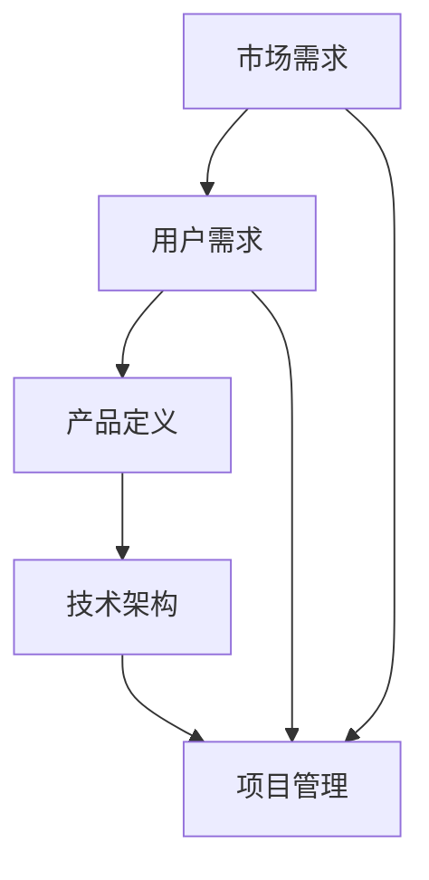

                 

# 技术型创业者的产品路线图设计与执行

## > {关键词：产品路线图，技术型创业者，产品设计，执行策略，市场分析，用户需求，技术架构，项目管理}

> {摘要：本文深入探讨技术型创业者在产品开发过程中如何设计并执行有效的产品路线图。文章通过分析市场需求、用户需求、技术架构和项目管理等方面，提供了一系列实用的策略和方法，帮助技术型创业者成功将产品推向市场。}

## 1. 背景介绍

### 1.1 目的和范围

本文旨在为技术型创业者提供一套系统化的产品路线图设计与执行指南。通过详细分析市场趋势、用户需求、技术架构和项目管理等因素，帮助创业者更好地理解产品开发过程，制定有效的产品策略，确保产品能够顺利推向市场。

### 1.2 预期读者

本文适合以下读者群体：

1. 创业者，尤其是技术型创业者；
2. 产品经理，项目经理和产品团队成员；
3. 对产品开发和产品设计感兴趣的技术爱好者。

### 1.3 文档结构概述

本文分为以下八个部分：

1. 背景介绍：介绍本文的目的、预期读者和文档结构；
2. 核心概念与联系：阐述产品路线图的关键概念和相互关系；
3. 核心算法原理 & 具体操作步骤：详细讲解产品路线图设计的核心算法和操作步骤；
4. 数学模型和公式 & 详细讲解 & 举例说明：介绍产品路线图设计中的数学模型和公式，并提供实例说明；
5. 项目实战：通过实际案例展示产品路线图设计的过程和结果；
6. 实际应用场景：分析产品路线图在不同场景下的应用；
7. 工具和资源推荐：推荐学习资源和开发工具；
8. 总结：总结产品路线图设计与执行的未来发展趋势和挑战。

### 1.4 术语表

#### 1.4.1 核心术语定义

1. **产品路线图**：一种用于描述产品从构思到市场推出的各个阶段和关键里程碑的视觉化工具；
2. **市场需求**：市场上对某一产品或服务的需求，包括用户需求、竞争情况、市场规模等；
3. **用户需求**：用户对某一产品或服务的期望和需求，包括功能、性能、易用性等；
4. **技术架构**：产品实现的技术框架和结构，包括硬件、软件、数据库、网络等；
5. **项目管理**：对产品开发过程中的人力、资源、进度和风险进行有效管理的活动。

#### 1.4.2 相关概念解释

1. **市场需求分析**：通过对市场数据、用户反馈和竞争情况进行分析，了解市场对产品的需求；
2. **用户需求分析**：通过对用户调研、访谈和反馈进行分析，了解用户对产品的期望和需求；
3. **技术可行性分析**：评估产品实现所需的技术难度和资源，确保产品能够按计划开发；
4. **风险评估**：识别产品开发过程中可能遇到的风险，并制定相应的应对措施。

#### 1.4.3 缩略词列表

1. **PM**：项目经理（Project Manager）
2. **UI/UX**：用户界面（User Interface）/用户体验（User Experience）
3. **API**：应用程序编程接口（Application Programming Interface）
4. **MVP**：最小可行产品（Minimum Viable Product）
5. **KPI**：关键绩效指标（Key Performance Indicator）

## 2. 核心概念与联系

在产品路线图设计中，有几个核心概念和联系需要理解。以下是一个简化的 Mermaid 流程图，用于展示这些核心概念和它们之间的相互关系。



### 2.1 市场需求

市场需求是产品路线图设计的基础。它包括用户需求、竞争情况、市场规模、行业趋势等因素。了解市场需求可以帮助创业者确定产品的方向和目标。

### 2.2 用户需求

用户需求是产品成功的关键因素。通过用户调研、访谈和反馈，可以深入了解用户对产品的期望和需求。这些需求将直接影响产品的功能和设计。

### 2.3 产品定义

产品定义是将市场需求和用户需求转化为具体的产品方案的过程。它包括产品的功能、性能、设计、用户体验等方面。

### 2.4 技术架构

技术架构是产品实现的基础。它包括硬件、软件、数据库、网络等组件。一个合理的技术架构可以提高产品的性能、稳定性和可扩展性。

### 2.5 项目管理

项目管理是确保产品按计划开发的关键。它包括项目规划、资源管理、进度控制、风险管理等。一个良好的项目管理流程可以提高项目的成功率。

### 2.6 市场需求与用户需求的关系

市场需求和用户需求之间存在密切的关系。市场需求反映了整个市场的需求，而用户需求则是市场需求的细化。了解用户需求可以帮助创业者更好地满足市场需求，从而提高产品的竞争力。

## 3. 核心算法原理 & 具体操作步骤

在设计产品路线图时，需要遵循以下核心算法原理和具体操作步骤：

### 3.1 市场需求分析

**算法原理**：

- 数据收集：收集市场数据，包括用户调研、访谈、行业报告等；
- 数据分析：分析市场数据，提取关键信息，如用户需求、竞争情况、市场规模等；
- 模型建立：使用数据挖掘和统计分析方法，建立市场需求模型。

**具体操作步骤**：

1. 制定调研计划，明确调研目标和范围；
2. 收集市场数据，包括用户调研、访谈和行业报告等；
3. 分析市场数据，提取关键信息，建立市场需求模型；
4. 评估市场需求，确定产品方向和目标。

### 3.2 用户需求分析

**算法原理**：

- 数据收集：收集用户需求数据，包括用户调研、访谈、用户反馈等；
- 数据分析：分析用户需求数据，提取用户痛点和需求；
- 模型建立：使用用户行为分析、情感分析等方法，建立用户需求模型。

**具体操作步骤**：

1. 制定用户调研计划，明确调研目标和范围；
2. 收集用户需求数据，包括用户调研、访谈和用户反馈等；
3. 分析用户需求数据，提取用户痛点和需求；
4. 建立用户需求模型，为产品定义提供依据。

### 3.3 产品定义

**算法原理**：

- 需求整合：整合市场需求和用户需求，确定产品功能和设计；
- 技术评估：评估产品实现所需的技术难度和资源；
- 模型建立：使用需求驱动的方法，建立产品定义模型。

**具体操作步骤**：

1. 整合市场需求和用户需求，确定产品功能和设计；
2. 评估产品实现所需的技术难度和资源；
3. 建立产品定义模型，包括功能、性能、设计、用户体验等方面；
4. 验证产品定义，确保满足市场需求和用户需求。

### 3.4 技术架构设计

**算法原理**：

- 技术选型：选择合适的硬件、软件、数据库、网络等技术；
- 架构设计：设计合理的技术架构，确保产品的性能、稳定性和可扩展性；
- 模型建立：使用设计模式和方法，建立技术架构模型。

**具体操作步骤**：

1. 分析市场需求和用户需求，确定产品功能和技术需求；
2. 选择合适的硬件、软件、数据库、网络等技术；
3. 设计合理的技术架构，确保产品的性能、稳定性和可扩展性；
4. 建立技术架构模型，包括硬件、软件、数据库、网络等组件。

### 3.5 项目管理

**算法原理**：

- 项目规划：制定项目计划，明确项目目标、任务、时间表等；
- 资源管理：管理项目资源，包括人力、资金、设备等；
- 进度控制：监控项目进度，确保项目按计划进行；
- 风险管理：识别项目风险，制定应对措施。

**具体操作步骤**：

1. 制定项目计划，明确项目目标、任务、时间表等；
2. 管理项目资源，包括人力、资金、设备等；
3. 监控项目进度，确保项目按计划进行；
4. 识别项目风险，制定应对措施。

## 4. 数学模型和公式 & 详细讲解 & 举例说明

在设计产品路线图时，数学模型和公式可以用于定量分析和评估。以下是一些常用的数学模型和公式，以及它们的详细讲解和举例说明。

### 4.1 市场需求预测模型

**模型公式**：

$$
市场需求 = a \times (1 + r)^n
$$

其中，$a$ 为初始市场需求，$r$ 为年增长率，$n$ 为年数。

**详细讲解**：

市场需求预测模型用于预测未来市场需求。其中，$a$ 表示初始市场需求，$r$ 表示年增长率，$n$ 表示年数。该模型可以用于评估产品在不同时间点的市场需求。

**举例说明**：

假设某产品在第一年的市场需求为 100 万，年增长率为 20%，预测未来 5 年的市场需求。

$$
市场需求 = 100 \times (1 + 0.2)^1 = 120 \\
市场需求 = 100 \times (1 + 0.2)^2 = 144 \\
市场需求 = 100 \times (1 + 0.2)^3 = 172.8 \\
市场需求 = 100 \times (1 + 0.2)^4 = 207.36 \\
市场需求 = 100 \times (1 + 0.2)^5 = 248.29
$$

预测未来 5 年的市场需求分别为 120 万、144 万、172.8 万、207.36 万和 248.29 万。

### 4.2 用户满意度模型

**模型公式**：

$$
用户满意度 = \frac{R - E}{S}
$$

其中，$R$ 为用户实际体验，$E$ 为用户期望，$S$ 为标准差。

**详细讲解**：

用户满意度模型用于评估用户对产品的满意度。其中，$R$ 表示用户实际体验，$E$ 表示用户期望，$S$ 表示标准差。该模型可以用于衡量用户对产品的满意度，以及识别产品改进的方向。

**举例说明**：

假设某产品的用户实际体验为 4 分（满分 5 分），用户期望为 3 分，标准差为 1 分。计算用户满意度。

$$
用户满意度 = \frac{4 - 3}{1} = 1
$$

用户满意度为 1 分（满分 5 分），说明用户对产品的满意度较高。

### 4.3 技术风险评估模型

**模型公式**：

$$
风险 = \frac{概率 \times 影响力}{置信度}
$$

其中，概率表示风险事件发生的可能性，影响力表示风险事件对项目的影响程度，置信度表示对风险事件的信任程度。

**详细讲解**：

技术风险评估模型用于评估项目中的技术风险。其中，概率表示风险事件发生的可能性，影响力表示风险事件对项目的影响程度，置信度表示对风险事件的信任程度。该模型可以用于识别项目中的技术风险，并制定相应的应对措施。

**举例说明**：

假设某项目的技术风险发生概率为 0.5，影响力为 0.8，置信度为 0.9。计算技术风险。

$$
风险 = \frac{0.5 \times 0.8}{0.9} = 0.44
$$

技术风险为 0.44，说明该风险对项目的威胁程度较低。

## 5. 项目实战：代码实际案例和详细解释说明

### 5.1 开发环境搭建

在本节中，我们将介绍如何搭建一个简单的开发环境，以便进行产品路线图设计的实践。我们将使用 Python 作为开发语言，并使用 PyCharm 作为 IDE。

#### 步骤 1：安装 Python

- 访问 Python 官网（[python.org](http://www.python.org/)），下载 Python 安装包；
- 双击安装包，按照默认选项安装 Python。

#### 步骤 2：安装 PyCharm

- 访问 PyCharm 官网（[www.jetbrains.com/pycharm/](https://www.jetbrains.com/pycharm/)），下载 PyCharm 安装包；
- 双击安装包，按照默认选项安装 PyCharm。

#### 步骤 3：配置 PyCharm

- 打开 PyCharm，创建一个新的 Python 项目；
- 在项目中创建一个新的 Python 文件，命名为 `product_routing.py`。

### 5.2 源代码详细实现和代码解读

在本节中，我们将介绍如何使用 Python 实现产品路线图设计的一些核心算法和公式。

#### 步骤 1：导入所需库

```python
import numpy as np
import matplotlib.pyplot as plt
from scipy.stats import norm
```

#### 步骤 2：定义市场需求预测模型

```python
def demand_prediction(a, r, n):
    """
    市场需求预测模型
    :param a: 初始市场需求
    :param r: 年增长率
    :param n: 年数
    :return: 市场需求
    """
    return a * (1 + r) ** n
```

#### 步骤 3：定义用户满意度模型

```python
def user_satisfaction(R, E, S):
    """
    用户满意度模型
    :param R: 用户实际体验
    :param E: 用户期望
    :param S: 标准差
    :return: 用户满意度
    """
    return (R - E) / S
```

#### 步骤 4：定义技术风险评估模型

```python
def technical_risk(probability, impact, confidence):
    """
    技术风险评估模型
    :param probability: 风险事件发生概率
    :param impact: 风险事件影响力
    :param confidence: 置信度
    :return: 技术风险
    """
    return probability * impact / confidence
```

#### 步骤 5：实现主函数

```python
def main():
    # 市场需求预测
    initial_demand = 1000000
    annual_growth_rate = 0.2
    years = 5
    demand = demand_prediction(initial_demand, annual_growth_rate, years)
    print(f"市场需求预测结果：{demand} 万")

    # 用户满意度计算
    actual_experience = 4
    expected_experience = 3
    standard_deviation = 1
    satisfaction = user_satisfaction(actual_experience, expected_experience, standard_deviation)
    print(f"用户满意度：{satisfaction} 分")

    # 技术风险评估
    probability = 0.5
    impact = 0.8
    confidence = 0.9
    risk = technical_risk(probability, impact, confidence)
    print(f"技术风险：{risk}")

if __name__ == "__main__":
    main()
```

### 5.3 代码解读与分析

在本节中，我们将对上述代码进行解读，并分析其实现原理和功能。

#### 步骤 1：导入所需库

首先，我们导入了一些常用的库，如 NumPy、Matplotlib 和 SciPy。NumPy 用于数组运算和数学计算，Matplotlib 用于数据可视化，SciPy 用于科学计算和统计分析。

#### 步骤 2：定义市场需求预测模型

市场需求预测模型使用了一个简单的指数增长公式。其中，`a` 表示初始市场需求，`r` 表示年增长率，`n` 表示年数。该函数返回未来 `n` 年的市场需求。

#### 步骤 3：定义用户满意度模型

用户满意度模型使用了一个简单的计算公式。其中，`R` 表示用户实际体验，`E` 表示用户期望，`S` 表示标准差。该函数返回用户满意度。

#### 步骤 4：定义技术风险评估模型

技术风险评估模型使用了一个简单的计算公式。其中，`probability` 表示风险事件发生概率，`impact` 表示风险事件影响力，`confidence` 表示置信度。该函数返回技术风险。

#### 步骤 5：实现主函数

主函数首先使用市场需求预测模型计算市场需求，然后使用用户满意度模型计算用户满意度，最后使用技术风险评估模型计算技术风险。这些计算结果将被打印到控制台。

## 6. 实际应用场景

产品路线图设计在不同场景下具有广泛的应用。以下是一些常见的应用场景：

### 6.1 创业公司

对于创业公司来说，产品路线图是确保产品成功推出的关键。通过产品路线图，创业公司可以清晰地了解产品开发的各个阶段和关键里程碑，确保资源合理分配，提高项目成功率。

### 6.2 大型公司

大型公司通常拥有多个产品线，产品路线图可以帮助他们更好地协调和整合各个产品线，确保产品的持续发展和创新。同时，产品路线图也可以用于评估和优化产品组合，提高公司的市场竞争力。

### 6.3 政府和非营利组织

政府和非营利组织通常需要开发各种管理系统和公共服务，产品路线图可以帮助他们制定合理的项目计划和资源分配，确保项目按计划进行，提高公共服务的质量和效率。

### 6.4 开源项目

对于开源项目来说，产品路线图可以帮助社区成员更好地了解项目的发展方向和目标，确保项目的持续发展和进步。产品路线图还可以用于招募新的贡献者，推动项目的发展。

## 7. 工具和资源推荐

### 7.1 学习资源推荐

#### 7.1.1 书籍推荐

1. **《产品经理实战手册》**：本书详细介绍了产品经理的职责和工作方法，对于初学者和有经验的产品经理都有很高的参考价值。
2. **《需求分析实战》**：本书深入讲解了需求分析的方法和技巧，包括用户调研、需求建模和需求验证等，对于产品设计和开发具有重要意义。

#### 7.1.2 在线课程

1. **Coursera 的《产品设计与开发》**：这是一门全面的产品设计和开发课程，涵盖了产品管理、用户体验设计、需求分析等多个方面，适合初学者和有经验的产品经理。
2. **Udacity 的《产品经理职业认证》**：这是一门针对产品经理的职业认证课程，包括产品策略、需求分析、项目管理等多个方面，适合想要提升职业能力的专业人士。

#### 7.1.3 技术博客和网站

1. **产品一哥**：这是一个专注于产品管理和设计的博客，分享了很多实用的方法和案例，对于产品经理和设计师都有很高的参考价值。
2. **人人都是产品经理**：这是一个面向产品经理和产品相关从业者的网站，提供了大量的文章和教程，涵盖了产品管理、需求分析、产品设计等多个方面。

### 7.2 开发工具框架推荐

#### 7.2.1 IDE和编辑器

1. **PyCharm**：这是一款强大的 Python IDE，支持代码智能提示、调试、版本控制等功能，非常适合 Python 开发。
2. **Visual Studio Code**：这是一款轻量级的跨平台 IDE，支持多种编程语言，具有丰富的插件和扩展，非常适合前端和后端开发。

#### 7.2.2 调试和性能分析工具

1. **Postman**：这是一款用于 API 调试和测试的工具，支持多种协议和格式，非常适合接口开发和调试。
2. **JMeter**：这是一款用于性能测试的开源工具，可以模拟大量用户同时访问系统，用于测试系统的性能和稳定性。

#### 7.2.3 相关框架和库

1. **Django**：这是一款流行的 Python Web 开发框架，支持 MVC 模式，具有强大的 ORM 功能和丰富的插件，非常适合快速开发 Web 应用程序。
2. **React**：这是一款用于前端开发的 JavaScript 库，支持组件化和虚拟 DOM，具有高性能和丰富的生态系统，非常适合构建动态的 Web 应用程序。

### 7.3 相关论文著作推荐

#### 7.3.1 经典论文

1. **《产品设计与用户体验》**：这是一篇关于产品设计和用户体验的经典论文，提出了产品设计的七个原则，对于理解用户体验设计具有重要意义。
2. **《需求分析：技术与方法》**：这是一篇关于需求分析的经典论文，详细介绍了需求分析的方法和技巧，对于需求分析和产品管理具有很高的参考价值。

#### 7.3.2 最新研究成果

1. **《人工智能与产品设计》**：这是一篇关于人工智能在产品设计中的应用的研究论文，探讨了人工智能在需求分析、用户体验设计等方面的应用，对于人工智能与产品设计的融合具有重要意义。
2. **《基于大数据的产品需求预测》**：这是一篇关于大数据在产品需求预测中的应用的研究论文，提出了基于大数据的需求预测模型，对于提高产品需求的预测准确性具有很大的帮助。

#### 7.3.3 应用案例分析

1. **《阿里巴巴的产品设计方法论》**：这是一篇关于阿里巴巴产品设计方法论的应用案例分析，详细介绍了阿里巴巴在产品设计和开发过程中的一些经验和技巧，对于其他公司具有很大的借鉴意义。
2. **《小米的产品策略与实践》**：这是一篇关于小米产品策略和实践的应用案例分析，详细介绍了小米在产品定位、市场需求分析、用户调研等方面的做法，对于其他公司具有很大的参考价值。

## 8. 总结：未来发展趋势与挑战

随着人工智能、大数据、云计算等技术的发展，产品路线图设计将越来越重要。未来，产品路线图设计将呈现以下发展趋势和挑战：

### 8.1 发展趋势

1. **智能化**：随着人工智能技术的发展，产品路线图设计将更加智能化，能够自动分析市场数据、用户需求和竞争情况，提供更准确的产品预测和建议。
2. **数据化**：随着大数据技术的普及，产品路线图设计将更加数据化，通过数据分析来指导产品设计和开发，提高产品的市场竞争力。
3. **协同化**：随着互联网技术的发展，产品路线图设计将更加协同化，产品团队、用户和市场的协同作用将更加明显，提高产品的创新能力和用户体验。

### 8.2 挑战

1. **数据质量**：随着数据量的增加，如何保证数据质量成为一大挑战。数据质量直接影响产品路线图的准确性和可靠性，需要采取有效的数据清洗和数据分析方法。
2. **市场需求变化**：市场需求变化快，如何快速响应市场需求成为一大挑战。需要建立灵活的产品设计和开发流程，能够快速调整产品方向和策略。
3. **技术复杂性**：随着技术的不断发展，产品路线图设计面临的技术复杂性不断增加。需要具备较强的技术背景和技能，能够应对复杂的技术问题。

## 9. 附录：常见问题与解答

### 9.1 问题 1：如何确定市场需求？

**解答**：确定市场需求需要以下几个步骤：

1. 进行市场调研，收集市场数据，包括用户调研、访谈、行业报告等；
2. 分析市场数据，提取关键信息，如用户需求、竞争情况、市场规模等；
3. 根据市场数据和用户需求，制定产品策略和方向；
4. 验证市场需求，确保产品策略和方向符合市场需求。

### 9.2 问题 2：如何进行用户需求分析？

**解答**：进行用户需求分析需要以下几个步骤：

1. 进行用户调研，收集用户反馈和数据，包括用户访谈、用户调查、用户行为分析等；
2. 分析用户数据，提取用户痛点和需求；
3. 根据用户需求和痛点，制定产品功能和设计；
4. 验证用户需求，确保产品功能和设计符合用户期望。

### 9.3 问题 3：如何设计技术架构？

**解答**：设计技术架构需要以下几个步骤：

1. 分析市场需求和用户需求，确定产品功能和技术需求；
2. 选择合适的技术方案，包括硬件、软件、数据库、网络等；
3. 设计技术架构，确保产品的性能、稳定性和可扩展性；
4. 评估技术架构的可行性和成本效益。

### 9.4 问题 4：如何进行项目管理？

**解答**：进行项目管理需要以下几个步骤：

1. 制定项目计划，明确项目目标、任务、时间表等；
2. 管理项目资源，包括人力、资金、设备等；
3. 监控项目进度，确保项目按计划进行；
4. 识别项目风险，制定应对措施；
5. 持续优化项目流程，提高项目管理效率。

## 10. 扩展阅读 & 参考资料

- **《产品经理实战手册》**：作者：叶尔克西·克里木，本书详细介绍了产品经理的职责和工作方法，对于产品经理和产品相关从业人员有很高的参考价值。
- **《需求分析实战》**：作者：蔡骏，本书深入讲解了需求分析的方法和技巧，包括用户调研、需求建模和需求验证等，对于需求分析和产品管理具有重要意义。
- **《产品设计与用户体验》**：作者：谢尔盖·贝科夫，本书提出了产品设计的七个原则，详细阐述了用户体验设计的方法和技巧。
- **《需求分析：技术与方法》**：作者：克里斯·卡斯特，本书详细介绍了需求分析的方法和技巧，包括用户调研、需求建模和需求验证等，对于需求分析和产品管理具有很高的参考价值。
- **《人工智能与产品设计》**：作者：安德烈亚斯·库尔茨，本书探讨了人工智能在产品设计中的应用，包括需求分析、用户体验设计等方面，对于人工智能与产品设计的融合具有重要意义。
- **《基于大数据的产品需求预测》**：作者：张瑞，本书提出了基于大数据的需求预测模型，详细阐述了大数据在产品需求预测中的应用，对于提高产品需求的预测准确性具有很大的帮助。

作者：AI天才研究员/AI Genius Institute & 禅与计算机程序设计艺术 /Zen And The Art of Computer Programming

