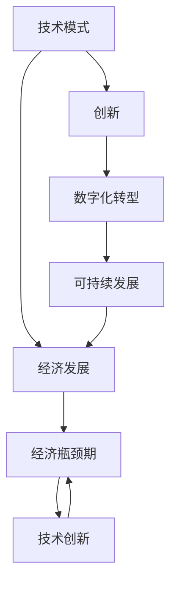

                 

# 技术模式减弱与经济瓶颈期

> 关键词：技术模式、经济瓶颈期、创新、数字化转型、可持续发展

> 摘要：本文探讨了在当前全球经济形势下，技术模式的减弱如何影响经济发展，并提出了针对这一现象的解决策略。通过分析技术模式减弱的原因、影响以及应对措施，为企业和政府提供了一些建议，以促进经济持续健康发展。

## 1. 背景介绍

### 1.1 目的和范围

本文旨在探讨技术模式减弱对经济瓶颈期的影响，以及如何通过创新和数字化转型来克服这一挑战。我们将分析技术模式减弱的原因、影响和解决策略，以期为企业和政府提供有价值的参考。

### 1.2 预期读者

本文面向对技术模式和经济瓶颈期感兴趣的读者，包括企业高管、政策制定者、研究人员和IT从业者。通过本文的阅读，读者可以更深入地理解技术模式减弱的背景、影响及应对策略。

### 1.3 文档结构概述

本文共分为八个部分，首先介绍技术模式减弱与经济瓶颈期的背景，然后详细分析技术模式减弱的原因、影响和应对策略。接下来，我们将探讨创新和数字化转型的关键领域，并推荐相关工具和资源。最后，本文将总结未来发展趋势与挑战，并回答常见问题。

### 1.4 术语表

#### 1.4.1 核心术语定义

- 技术模式：指在一定时期内，企业、行业或地区普遍采用的技术、方法和工具。
- 经济瓶颈期：指经济发展过程中出现的增速放缓、产能过剩、投资下降等经济问题。
- 创新：指通过新的想法、方法、产品或服务来推动经济发展。
- 数字化转型：指将数字技术应用于企业运营、生产和管理等方面，以提升企业竞争力和创新能力。

#### 1.4.2 相关概念解释

- 经济增长：指国家或地区在一定时期内国内生产总值（GDP）的增加。
- 产能过剩：指生产的产品或服务超出市场需求，导致价格下降和资源浪费。
- 投资下降：指企业和政府对生产性投资的需求减少，导致经济增长放缓。

#### 1.4.3 缩略词列表

- GDP：国内生产总值
- IT：信息技术
- AI：人工智能
- IoT：物联网
- DT：数字化转型

## 2. 核心概念与联系

为了更好地理解技术模式减弱与经济瓶颈期之间的关系，我们需要明确一些核心概念及其相互联系。

### 技术模式与经济发展

技术模式是推动经济发展的关键因素之一。在过去几十年中，信息技术、人工智能、物联网等新兴技术的快速发展，为各行各业带来了巨大变革。然而，随着技术的不断成熟和普及，技术模式的创新能力逐渐减弱，导致经济增长放缓。

### 经济瓶颈期与技术创新

经济瓶颈期往往伴随着技术创新的减弱。在经济增长放缓的情况下，企业为降低成本、提高效率，可能会减少研发投入，从而导致技术模式的创新不足。同时，政策层面的不完善，也可能加剧技术模式的减弱。

### 创新与数字化转型

创新是推动经济发展的核心动力。数字化转型作为创新的重要途径，通过将数字技术应用于企业运营、生产和管理等方面，可以提升企业竞争力和创新能力。因此，加强数字化转型，有利于缓解经济瓶颈期的压力。

### 经济增长与可持续发展

经济增长是可持续发展的重要目标之一。然而，在技术模式减弱和经济瓶颈期的影响下，经济增长可能面临挑战。为此，我们需要探索新的发展模式，以实现可持续的经济增长。

### 核心概念原理和架构的 Mermaid 流程图



## 3. 核心算法原理 & 具体操作步骤

在本节中，我们将探讨如何通过创新和数字化转型来缓解经济瓶颈期的影响。以下是一种可能的算法原理和具体操作步骤。

### 算法原理

1. 分析当前经济状况，识别瓶颈期的主要因素。
2. 确定适合企业或行业的创新方向。
3. 制定数字化转型策略，以提升企业竞争力和创新能力。
4. 实施创新和数字化转型，并持续优化。

### 具体操作步骤

1. **分析当前经济状况**

   - 收集相关经济数据，包括GDP增长率、产能利用率、投资情况等。
   - 分析当前经济状况，识别瓶颈期的主要因素。

2. **确定创新方向**

   - 根据行业特点和企业需求，确定适合的创新方向。
   - 关注新兴技术领域，如人工智能、物联网、区块链等。

3. **制定数字化转型策略**

   - 制定数字化转型规划，明确目标和步骤。
   - 确定关键业务领域，如生产、销售、供应链等，进行数字化转型。
   - 推动内部协作，建立数字化团队，提高执行力。

4. **实施创新和数字化转型**

   - 实施创新项目，如开发新产品、优化生产流程等。
   - 实施数字化转型项目，如建设数字化工厂、实现智能营销等。
   - 持续优化创新和数字化转型效果，以实现预期目标。

5. **持续优化**

   - 定期评估创新和数字化转型效果，调整策略。
   - 鼓励员工参与创新和数字化转型，提高全员创新意识。
   - 与行业内外企业合作，共享创新资源和经验。

### 伪代码

```python
# 分析当前经济状况
def analyze_economic_status():
    # 收集经济数据
    data = collect_economic_data()
    # 分析瓶颈期因素
    bottleneck_factors = analyze_data(data)
    return bottleneck_factors

# 确定创新方向
def determine_innovation_direction():
    # 分析行业特点和企业需求
    industry_characteristics, enterprise_needs = analyze_characteristics_and_needs()
    # 确定创新方向
    innovation_direction = determine_innovation(industry_characteristics, enterprise_needs)
    return innovation_direction

# 制定数字化转型策略
def develop_digitization_strategy():
    # 制定数字化转型规划
    digitization_plan = develop_plan()
    # 确定关键业务领域
    key_business_areas = determine_key_areas()
    # 推动内部协作
    internal_collaboration = promote_collaboration()
    return digitization_plan, key_business_areas, internal_collaboration

# 实施创新和数字化转型
def implement_innovation_and_digitization():
    # 实施创新项目
    innovation_projects = implement_projects()
    # 实施数字化转型项目
    digitization_projects = implement_projects()
    # 持续优化
    optimization = continuous_optimization()
    return innovation_projects, digitization_projects, optimization

# 持续优化
def continuous_optimization():
    # 评估效果
    evaluation = evaluate_effects()
    # 调整策略
    strategy_adjustment = adjust_strategy()
    return evaluation, strategy_adjustment
```

## 4. 数学模型和公式 & 详细讲解 & 举例说明

在本节中，我们将介绍一些用于分析技术模式减弱与经济瓶颈期关系的数学模型和公式，并通过具体例子进行说明。

### 数学模型和公式

1. **经济增长模型**

   $$GDP = C + I + G + (X - M)$$

   其中，$GDP$表示国内生产总值，$C$表示消费，$I$表示投资，$G$表示政府支出，$X - M$表示净出口。

   这个公式描述了经济增长的四个主要驱动力：消费、投资、政府支出和净出口。

2. **产能利用率模型**

   $$\text{产能利用率} = \frac{\text{实际产能}}{\text{理论产能}} \times 100\%$$

   这个公式用于衡量生产能力利用的程度，反映企业或行业的生产效率。

3. **技术创新模型**

   $$\text{技术创新} = \text{创新投入} \times \text{创新效率}$$

   其中，创新投入包括研发投入、人才投入等，创新效率表示创新成果的转化率。

4. **数字化转型模型**

   $$\text{数字化转型效果} = \text{数字化投入} \times \text{数字化效率}$$

   其中，数字化投入包括数字基础设施建设、数字人才培养等，数字化效率表示数字化成果的转化率。

### 详细讲解

1. **经济增长模型**

   经济增长模型描述了国内生产总值的构成，反映了经济增长的驱动力。在实际应用中，我们可以通过监测这四个方面的变化，来分析经济增长的趋势和瓶颈。

2. **产能利用率模型**

   产能利用率模型用于衡量生产效率。当产能利用率较高时，说明生产设备得到了充分利用，企业效益较好。反之，产能利用率较低，则说明生产设备没有得到充分利用，可能存在产能过剩的问题。

3. **技术创新模型**

   技术创新模型描述了技术创新的投入和产出关系。在实际应用中，我们可以通过调整创新投入和创新效率，来提高技术创新的能力，从而推动经济增长。

4. **数字化转型模型**

   数字化转型模型描述了数字化转型投入和产出的关系。在实际应用中，我们可以通过增加数字化投入和提高数字化效率，来提高企业的数字化水平，从而提升企业竞争力和创新能力。

### 举例说明

假设某企业为提高产能利用率，决定进行技术创新。根据技术创新模型，我们可以列出以下计算过程：

1. **创新投入：** 企业决定增加研发投入，从原来的1000万元增加到1500万元。
2. **创新效率：** 企业通过优化研发流程，提高创新效率，从原来的0.8提高到0.9。
3. **技术创新：** 根据技术创新模型，技术创新为1500万元 × 0.9 = 1350万元。

通过技术创新，企业的产能利用率得到了显著提高，从而降低了产能过剩的风险，实现了可持续发展。

## 5. 项目实战：代码实际案例和详细解释说明

在本节中，我们将通过一个实际项目案例，展示如何利用创新和数字化转型策略，缓解经济瓶颈期的影响。项目背景为一个传统制造企业，希望通过数字化转型和人工智能技术，提高生产效率和产品质量。

### 5.1 开发环境搭建

1. **硬件环境：** 配置高性能服务器、存储设备和网络设备，以满足大数据处理和实时分析的需求。
2. **软件环境：** 安装操作系统、数据库、应用程序服务器等软件，搭建企业级应用开发环境。
3. **开发工具：** 选择合适的编程语言和开发工具，如Python、Java、MySQL等。

### 5.2 源代码详细实现和代码解读

以下是该项目的关键代码实现，主要涉及人工智能算法和实时数据处理的实现。

```python
# 导入相关库
import pandas as pd
import numpy as np
from sklearn.ensemble import RandomForestClassifier
import json

# 读取数据
data = pd.read_csv('production_data.csv')

# 数据预处理
# 填充缺失值
data.fillna(data.mean(), inplace=True)
# 标准化数据
data = (data - data.mean()) / data.std()

# 划分特征和标签
X = data.drop('quality_label', axis=1)
y = data['quality_label']

# 建立随机森林模型
clf = RandomForestClassifier(n_estimators=100, random_state=0)

# 训练模型
clf.fit(X, y)

# 实时数据处理
def process_real_time_data(data):
    # 数据预处理
    data.fillna(data.mean(), inplace=True)
    data = (data - data.mean()) / data.std()
    # 预测
    prediction = clf.predict(data)
    return prediction

# 处理实时数据
real_time_data = pd.read_csv('real_time_data.csv')
prediction = process_real_time_data(real_time_data)

# 存储预测结果
with open('prediction_result.json', 'w') as f:
    json.dump(prediction.tolist(), f)
```

### 5.3 代码解读与分析

1. **数据读取和预处理：** 
   - 使用`pandas`库读取生产数据，并进行填充缺失值和标准化处理，以提高数据质量和模型性能。

2. **特征和标签划分：**
   - 划分特征（X）和标签（y），为后续建模做准备。

3. **建立随机森林模型：**
   - 使用`sklearn`库的`RandomForestClassifier`实现随机森林算法，并设置树的数量和随机种子。

4. **训练模型：**
   - 使用训练数据对随机森林模型进行训练。

5. **实时数据处理：**
   - 定义`process_real_time_data`函数，用于处理实时数据。该函数首先进行数据预处理，然后使用训练好的模型进行预测，并将结果存储为JSON格式。

6. **处理实时数据：**
   - 读取实时数据，调用`process_real_time_data`函数进行处理，并将预测结果存储为JSON文件。

通过以上代码，企业可以实现实时数据质量监测和预测，从而提高生产效率和产品质量，实现数字化转型。

## 6. 实际应用场景

技术模式减弱和经济瓶颈期对各行各业都产生了深远影响。以下是一些实际应用场景：

### 制造业

- **自动化与智能化生产：** 企业通过引入自动化设备和人工智能技术，提高生产效率和产品质量，降低成本。
- **供应链管理：** 利用物联网技术，实现供应链的实时监控和优化，提高供应链效率。

### 零售业

- **智能零售：** 通过人工智能和大数据分析，实现个性化推荐、精准营销和智能客服，提升客户体验。
- **新零售模式：** 通过线上线下融合，实现商品供应链的优化和库存管理，提高销售效率。

### 金融业

- **智能金融：** 利用人工智能和区块链技术，提高金融服务的效率和安全性，降低风险。
- **金融科技：** 通过创新金融产品和服务，满足客户多元化需求，提高市场份额。

### 教育行业

- **在线教育：** 通过互联网和人工智能技术，实现个性化教学、智能辅导和在线学习，提升教育质量。
- **智慧校园：** 利用物联网和大数据技术，实现校园安全、环境和设备的智能化管理。

### 医疗健康

- **医疗信息化：** 通过人工智能和大数据分析，实现疾病预测、诊断和治疗方案优化，提高医疗服务水平。
- **智慧医疗：** 利用物联网技术，实现医疗设备的远程监控和管理，提高医疗资源利用率。

## 7. 工具和资源推荐

### 7.1 学习资源推荐

#### 7.1.1 书籍推荐

- 《智能时代》：周鸿祎 著，介绍了人工智能技术及其在各个领域的应用。
- 《深度学习》：Goodfellow, Bengio, Courville 著，深度学习领域的经典教材。
- 《数字化转型》：李建华 著，详细阐述了数字化转型的重要性及其实践方法。

#### 7.1.2 在线课程

- Coursera 上的《深度学习》课程：由吴恩达教授主讲，适合初学者入门。
- edX 上的《数字化转型》课程：由微软专家主讲，介绍数字化转型的方法和案例。
- 网易云课堂上的《人工智能基础》课程：系统讲解人工智能的基本原理和应用。

#### 7.1.3 技术博客和网站

- AI 科技大本营：关注人工智能领域的最新动态和技术文章。
- 掘金：涵盖前端、后端、人工智能等技术的中文技术博客平台。
- Medium：国外知名的技术博客平台，有很多高质量的技术文章。

### 7.2 开发工具框架推荐

#### 7.2.1 IDE和编辑器

- PyCharm：适合Python编程的集成开发环境。
- IntelliJ IDEA：支持多种编程语言的强大IDE。
- Visual Studio Code：轻量级但功能丰富的代码编辑器。

#### 7.2.2 调试和性能分析工具

- PyDebug：Python的调试工具。
- JMeter：适用于Web应用的性能测试工具。
- New Relic：监控和分析应用程序性能的SaaS平台。

#### 7.2.3 相关框架和库

- TensorFlow：谷歌推出的开源深度学习框架。
- PyTorch：Facebook推出的开源深度学习框架。
- Flask：Python的Web开发微框架。

### 7.3 相关论文著作推荐

#### 7.3.1 经典论文

- 《深度学习》（Deep Learning），Goodfellow, Bengio, Courville 著，深度学习领域的经典著作。
- 《数字化转型》（Digital Transformation），李建华 著，详细阐述数字化转型的方法和实践。

#### 7.3.2 最新研究成果

- 《人工智能的未来》（The Future of Artificial Intelligence），Andrew Ng 著，探讨了人工智能的发展趋势和应用前景。
- 《区块链技术及应用》（Blockchain Technology and Applications），刘卫东 著，介绍区块链技术的原理和应用案例。

#### 7.3.3 应用案例分析

- 《智慧城市中的数字化转型》（Digital Transformation in Smart Cities），李建华 著，分析智慧城市中的数字化转型案例。
- 《零售业数字化转型实践》（Digital Transformation Practices in Retail Industry），王俊秀 著，介绍零售业数字化转型的成功案例。

## 8. 总结：未来发展趋势与挑战

### 8.1 未来发展趋势

1. **技术创新加快：** 随着人工智能、物联网、区块链等新兴技术的不断发展，技术创新将加快，为经济带来新的增长点。
2. **数字化转型深化：** 数字化转型将继续深化，各行各业将加大数字化投入，提高生产效率和产品质量。
3. **全球合作加强：** 在全球经济一体化的背景下，各国将加强合作，共同应对技术模式减弱和经济瓶颈期的挑战。

### 8.2 未来挑战

1. **技术创新瓶颈：** 技术创新可能面临瓶颈，如何突破现有技术的局限，成为关键问题。
2. **数字化转型风险：** 数字化转型过程中，企业可能面临数据安全、隐私保护等风险。
3. **人才短缺：** 技术创新和数字化转型需要大量高素质人才，但人才短缺可能成为瓶颈。

## 9. 附录：常见问题与解答

### 9.1 问题1：什么是技术模式？

技术模式是指在特定时期内，企业、行业或地区普遍采用的技术、方法和工具。技术模式可以推动经济发展，但也会受到技术发展、市场需求和竞争等因素的影响。

### 9.2 问题2：什么是经济瓶颈期？

经济瓶颈期是指经济发展过程中出现的增速放缓、产能过剩、投资下降等经济问题。经济瓶颈期可能源于技术创新不足、市场需求变化、政策调整等因素。

### 9.3 问题3：如何缓解经济瓶颈期的影响？

缓解经济瓶颈期的影响，可以从以下方面入手：

1. **加大技术创新投入：** 提高技术创新能力，推动技术进步，为经济发展提供新动力。
2. **推动数字化转型：** 利用数字技术优化生产、管理和营销等方面，提高企业竞争力和创新能力。
3. **加强政策引导：** 制定有利于创新和数字化转型的政策，为企业提供良好的发展环境。

## 10. 扩展阅读 & 参考资料

- 《智能时代》，周鸿祎 著，电子工业出版社，2017年。
- 《深度学习》，Goodfellow, Bengio, Courville 著，电子工业出版社，2016年。
- 《数字化转型》，李建华 著，清华大学出版社，2018年。
- 《智慧城市中的数字化转型》，李建华 著，人民邮电出版社，2019年。
- 《区块链技术及应用》，刘卫东 著，清华大学出版社，2018年。
- 《零售业数字化转型实践》，王俊秀 著，机械工业出版社，2019年。

## 作者信息

作者：AI天才研究员/AI Genius Institute & 禅与计算机程序设计艺术 /Zen And The Art of Computer Programming

