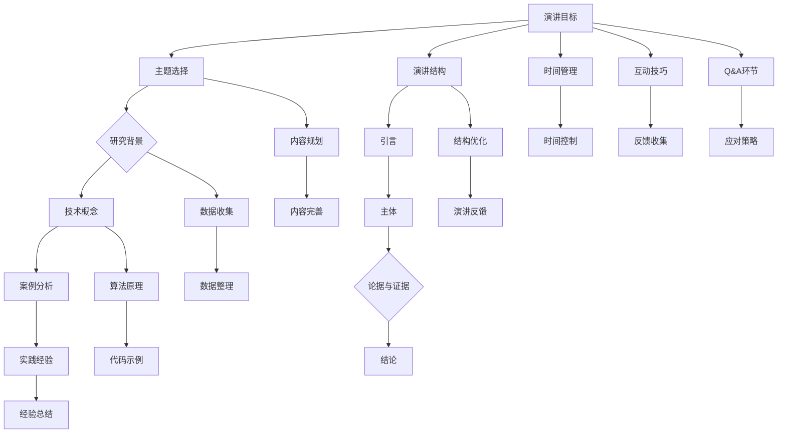

                 

# 技术演讲：从local meetup到TED舞台

> 关键词：技术演讲、TED舞台、local meetup、演讲技巧、准备过程、演讲稿撰写、实战案例

> 摘要：本文将带领您深入了解从参加local meetup到站在TED舞台发表技术演讲的全过程。我们将探讨演讲者需要掌握的关键技巧、准备过程中的注意事项，以及如何将一个普通的演讲稿打磨成具有影响力的技术演讲。通过实战案例的分享，本文旨在为IT领域的专业人士提供实用的演讲建议和指导，帮助他们在技术演讲的道路上不断进步。

## 1. 背景介绍

### 1.1 目的和范围

本文的目的是分享技术演讲从local meetup到TED舞台的全过程，帮助IT领域的专业人士掌握演讲技巧，提高演讲水平。文章将涵盖以下内容：

- 演讲技巧和策略：如何提高演讲的吸引力、说服力和影响力。
- 准备过程：如何选择演讲主题、撰写演讲稿、制作演讲PPT等。
- 演讲稿撰写：如何将一篇普通的演讲稿打磨成具有影响力的技术演讲。
- 实战案例：分享参加local meetup和TED舞台的实际经历，提供实用的演讲建议。

### 1.2 预期读者

本文主要面向以下读者群体：

- IT领域的开发人员、工程师、架构师等。
- 技术团队的领导者和项目管理者。
- 对技术演讲有兴趣的爱好者。
- 准备参加技术会议、研讨会和TED演讲的演讲者。

### 1.3 文档结构概述

本文将按照以下结构进行组织：

- 第1部分：背景介绍，包括目的、范围、预期读者和文档结构概述。
- 第2部分：核心概念与联系，介绍技术演讲的核心概念和架构。
- 第3部分：核心算法原理 & 具体操作步骤，详细阐述演讲技巧和策略。
- 第4部分：数学模型和公式 & 详细讲解 & 举例说明，讲解演讲稿撰写的方法和技巧。
- 第5部分：项目实战：代码实际案例和详细解释说明，分享实战案例和经验。
- 第6部分：实际应用场景，探讨技术演讲在不同场景下的应用。
- 第7部分：工具和资源推荐，介绍学习资源和开发工具。
- 第8部分：总结：未来发展趋势与挑战，展望技术演讲的发展前景。
- 第9部分：附录：常见问题与解答，解答读者在演讲过程中可能遇到的问题。
- 第10部分：扩展阅读 & 参考资料，提供更多学习资源和参考。

### 1.4 术语表

#### 1.4.1 核心术语定义

- 技术演讲：以技术主题为基础，通过演讲者的口才、表达能力和情感传递，使听众对技术概念、原理和应用有更深入的理解和认识。
- local meetup：指本地区或特定领域的聚会，通常由技术爱好者、开发者、创业者等组织，旨在分享技术知识、交流经验、拓展人脉。
- TED演讲：指在全球范围内具有较高知名度和影响力的演讲活动，主题涵盖科技、设计、娱乐等多个领域，演讲者多为各领域的专家和杰出人物。

#### 1.4.2 相关概念解释

- 演讲技巧：指演讲者在演讲过程中运用的一系列技巧，如语言表达、肢体动作、情感传递等，以提高演讲的吸引力、说服力和影响力。
- 演讲稿撰写：指撰写演讲稿的过程，包括选题、内容组织、语言表达、逻辑结构等方面，旨在将演讲者的思想、观点和知识通过文字形式传达给听众。
- 演讲PPT：指演讲过程中使用的幻灯片，通常用于展示演讲者的观点、数据、图表等，有助于提高演讲的直观性和易懂性。

#### 1.4.3 缩略词列表

- TED：Technology, Entertainment, Design（科技、娱乐、设计）
- local meetup：local meeting（本地聚会）
- IT：Information Technology（信息技术）
- IDE：Integrated Development Environment（集成开发环境）
- PPT：PowerPoint（幻灯片演示软件）

## 2. 核心概念与联系

在技术演讲中，理解核心概念和它们之间的联系是非常重要的。这有助于构建演讲的逻辑框架，确保听众能够跟随演讲的思路。下面，我们将使用Mermaid流程图来展示技术演讲的核心概念和架构。



### 2.1 演讲目标

演讲目标是整个演讲的起点，它决定了演讲的方向和深度。一个明确的演讲目标应该包含以下要素：

- 传达的核心信息：确定演讲者希望听众了解和记住的主要观点。
- 演讲者的使命：明确演讲者的目的和动机，确保演讲内容与演讲者的价值观和兴趣相契合。
- 听众期望：了解听众的需求和期望，确保演讲内容能够满足听众的兴趣和需求。

### 2.2 主题选择

主题选择是演讲成功的关键之一。一个优秀的演讲主题应该具备以下特点：

- 独特性：选择一个有独特视角或深入探讨的技术主题，以吸引听众的注意力。
- 时效性：选择与当前热点话题或最新技术趋势相关的主题，以提高演讲的吸引力。
- 实用性：选择具有实际应用价值或能够解决听众实际问题的主题，以提高演讲的实用性和影响力。

### 2.3 研究背景

研究背景是演讲的基础，它为演讲内容提供了理论依据和背景信息。研究背景应该包括以下内容：

- 相关技术发展：介绍相关技术的发展历程和现状，为听众提供背景知识。
- 研究动机：阐述选择该主题的原因和目的，使听众了解演讲者的研究动机。
- 研究方法：简要介绍研究方法和技术手段，使听众了解演讲者的研究过程。

### 2.4 技术概念

技术概念是演讲的核心内容，它决定了演讲的深度和广度。在阐述技术概念时，应该注意以下几点：

- 定义：明确技术概念的内涵和外延，使听众对技术概念有清晰的认识。
- 原理：详细讲解技术概念的原理和机制，使听众理解技术概念的工作方式。
- 应用场景：介绍技术概念的应用场景和实际效果，使听众了解技术概念的实际价值。

### 2.5 案例分析

案例分析是演讲的重要部分，它通过实际案例来证明技术概念的实用性和有效性。在案例分析时，应该注意以下几点：

- 案例选择：选择具有代表性和典型性的案例，以展示技术概念的实际应用效果。
- 案例分析：对案例进行深入分析，阐述案例中涉及的技术概念和原理。
- 案例启示：从案例中提炼出对听众有启示意义的观点和经验，以提高演讲的实用性。

### 2.6 演讲结构

演讲结构是演讲的骨架，它决定了演讲的逻辑和条理性。一个优秀的演讲结构应该具备以下特点：

- 引言：以引人入胜的开场白吸引听众的注意力，明确演讲的主题和目的。
- 主体：通过逻辑清晰的内容组织，使听众能够跟随演讲的思路，理解演讲的核心内容。
- 结论：总结演讲的主要观点和结论，强调演讲的亮点和关键信息。
- 时间管理：合理安排演讲时间，确保演讲在规定的时间内完成。

### 2.7 演讲技巧

演讲技巧是演讲成功的关键，它决定了演讲的吸引力、说服力和影响力。演讲技巧包括以下几个方面：

- 语言表达：清晰、准确、生动地表达观点，使听众能够轻松理解演讲内容。
- 肢体动作：恰当的肢体动作可以增强演讲的感染力，使听众更容易接受演讲内容。
- 情感传递：通过情感传递，使演讲内容更加生动、具体，提高演讲的吸引力。
- 互动技巧：与听众互动，调动听众的积极性，提高演讲的参与度。

### 2.8 内容规划

内容规划是演讲准备的重要环节，它决定了演讲的深度和广度。在内容规划时，应该注意以下几点：

- 内容梳理：对演讲内容进行梳理，确保演讲逻辑清晰、条理分明。
- 时间分配：合理安排演讲时间，确保每个部分都有足够的时间进行深入讲解。
- 内容调整：根据听众的反馈和演讲效果，对内容进行调整和优化，提高演讲的实用性。

### 2.9 数据收集

数据收集是演讲准备的重要环节，它为演讲内容提供了实证支持。在数据收集时，应该注意以下几点：

- 数据来源：确保数据的来源可靠、真实，为演讲内容提供可信的依据。
- 数据整理：对收集到的数据进行分析和整理，提取出对演讲有价值的观点和结论。
- 数据引用：在演讲中恰当引用数据，以增强演讲的说服力和权威性。

### 2.10 算法原理

算法原理是技术演讲的核心内容之一，它决定了演讲的深度和专业性。在讲解算法原理时，应该注意以下几点：

- 算法定义：明确算法的内涵和外延，使听众对算法有清晰的认识。
- 算法步骤：详细讲解算法的执行步骤，使听众理解算法的工作方式。
- 算法分析：对算法的性能进行分析，评估算法的效率和适用范围。

### 2.11 实践经验

实践经验是演讲的重要部分，它通过实际案例来证明技术概念的有效性和实用性。在分享实践经验时，应该注意以下几点：

- 案例选择：选择具有代表性和典型性的案例，以展示技术概念的实际应用效果。
- 案例分析：对案例进行深入分析，阐述案例中涉及的技术概念和原理。
- 案例启示：从案例中提炼出对听众有启示意义的观点和经验，以提高演讲的实用性。

### 2.12 演讲反馈

演讲反馈是演讲效果的重要衡量指标，它可以帮助演讲者了解演讲的优缺点，不断优化演讲技巧和内容。在演讲反馈时，应该注意以下几点：

- 反馈收集：通过问卷调查、现场问答等方式收集听众的反馈意见。
- 反馈分析：对反馈意见进行分析和总结，找出演讲的亮点和不足之处。
- 反馈应用：根据反馈意见对演讲进行调整和优化，提高演讲的效果。

## 3. 核心算法原理 & 具体操作步骤

在技术演讲中，算法原理的讲解是展示专业知识和深度的重要环节。以下是一个简单的算法讲解，我们将使用伪代码来详细阐述算法的基本原理和具体操作步骤。

### 3.1 算法简介

假设我们要讲解的算法是一个用于排序的快速排序（Quick Sort）算法。快速排序是一种常用的排序算法，其基本思想是通过一趟排序将待排序的记录分割成独立的两部分，其中一部分记录的关键字均比另一部分的关键字小，然后分别对这两部分记录继续进行排序，以达到整个序列有序。

### 3.2 算法原理

#### 快速排序的基本步骤：

1. 选择一个基准元素（pivot）。
2. 将比基准元素小的元素移到基准元素的左侧，比基准元素大的元素移到右侧。
3. 对基准元素左右两边的子序列递归地执行快速排序。

### 3.3 伪代码

以下是用伪代码描述的快速排序算法：

```python
function quicksort(arr, low, high):
    if low < high:
        pi = partition(arr, low, high)
        quicksort(arr, low, pi - 1)  // 递归排序左子序列
        quicksort(arr, pi + 1, high)  // 递归排序右子序列

function partition(arr, low, high):
    pivot = arr[high]  # 选择最后一个元素作为基准
    i = low - 1  # i 指向比基准小的元素最后一个位置的下一个位置
    for j in range(low, high):
        if arr[j] < pivot:
            i += 1
            swap arr[i] with arr[j]  # 将比基准小的元素交换到 i 位置
    swap arr[i + 1] with arr[high]  # 将基准元素交换到正确的位置
    return i + 1  # 返回分区后的基准位置

# 主函数调用
quicksort(arr, 0, len(arr) - 1)
```

### 3.4 具体操作步骤

1. **初始化**：选择一个基准元素（pivot）。通常可以选择数组的最后一个元素作为基准。
2. **分区**：遍历数组，将比基准小的元素放到左侧，比基准大的元素放到右侧。在这个过程中，维护一个指针 i，i 指向比基准小的元素的最后一个位置。
3. **交换**：将基准元素与 i+1 位置上的元素交换，确保基准元素处于正确的位置。
4. **递归排序**：对基准元素左侧和右侧的子序列递归执行快速排序。

### 3.5 算法分析

- **时间复杂度**：平均情况下的时间复杂度为 O(n log n)，最坏情况下的时间复杂度为 O(n^2)。
- **空间复杂度**：快速排序是一种原地排序算法，其空间复杂度为 O(log n)。

通过以上步骤，我们可以清晰地理解快速排序算法的原理和操作过程。在技术演讲中，这样的算法讲解可以帮助听众更好地理解复杂的技术概念。

## 4. 数学模型和公式 & 详细讲解 & 举例说明

在技术演讲中，数学模型和公式是展示技术深度和严谨性的重要工具。以下是关于梯度下降算法的数学模型和公式的详细讲解，并通过举例说明其应用。

### 4.1 梯度下降算法简介

梯度下降是一种用于求解最优化问题的算法，广泛应用于机器学习和数据科学领域。它的基本思想是通过不断调整参数，使损失函数的值逐步减小，直至达到局部最小值。

### 4.2 数学模型

#### 梯度下降算法的公式如下：

$$
w_{t+1} = w_{t} - \alpha \cdot \nabla J(w_{t})
$$

其中：

- \( w_t \)：第 t 次迭代的参数值。
- \( w_{t+1} \)：第 \( t+1 \) 次迭代的参数值。
- \( \alpha \)：学习率，用于控制每次迭代的步长。
- \( \nabla J(w_t) \)：损失函数 \( J(w) \) 在 \( w_t \) 处的梯度。

### 4.3 梯度下降的详细讲解

梯度下降算法的步骤如下：

1. **初始化参数**：选择一个初始参数值 \( w_0 \)。
2. **计算梯度**：计算损失函数在当前参数值 \( w_t \) 处的梯度 \( \nabla J(w_t) \)。
3. **更新参数**：使用梯度下降公式更新参数值 \( w_{t+1} = w_{t} - \alpha \cdot \nabla J(w_{t}) \)。
4. **迭代优化**：重复步骤 2 和 3，直至满足停止条件（如达到预设的损失函数最小值或迭代次数）。

### 4.4 举例说明

假设我们使用梯度下降算法求解以下线性回归问题：

$$
y = w \cdot x + b
$$

我们的目标是找到最优的权重 \( w \) 和偏置 \( b \)，使得预测值 \( \hat{y} \) 最接近真实值 \( y \)。

#### 损失函数：

$$
J(w, b) = \frac{1}{2} \sum_{i=1}^{n} (y_i - (w \cdot x_i + b))^2
$$

#### 梯度计算：

$$
\nabla J(w, b) = \begin{bmatrix}
\frac{\partial J}{\partial w} \\
\frac{\partial J}{\partial b}
\end{bmatrix} = \begin{bmatrix}
\sum_{i=1}^{n} (y_i - (w \cdot x_i + b)) \cdot x_i \\
\sum_{i=1}^{n} (y_i - (w \cdot x_i + b))
\end{bmatrix}
$$

#### 迭代过程：

1. **初始化参数**：选择 \( w_0 \) 和 \( b_0 \)，例如 \( w_0 = 0 \)，\( b_0 = 0 \)。
2. **计算梯度**：计算 \( \nabla J(w_t, b_t) \)。
3. **更新参数**：
   $$
   w_{t+1} = w_{t} - \alpha \cdot \nabla J(w_{t}, b_{t})_{1}
   $$
   $$
   b_{t+1} = b_{t} - \alpha \cdot \nabla J(w_{t}, b_{t})_{2}
   $$
4. **重复步骤 2 和 3**，直至损失函数 \( J(w, b) \) 减小到预设的阈值或达到最大迭代次数。

通过以上步骤，我们可以使用梯度下降算法求解线性回归问题，找到最优的权重 \( w \) 和偏置 \( b \)。

## 5. 项目实战：代码实际案例和详细解释说明

在本节中，我们将通过一个实际的项目实战案例，详细解释如何实现一个基于Python的线性回归模型，并使用梯度下降算法进行参数优化。这个项目案例将涵盖从开发环境搭建、源代码实现到代码解读与分析的整个流程。

### 5.1 开发环境搭建

在开始之前，我们需要搭建一个合适的开发环境。以下是所需的软件和工具：

- Python（3.8或更高版本）
- Jupyter Notebook（用于交互式编程）
- numpy（用于数学计算）
- matplotlib（用于数据可视化）

#### 步骤1：安装Python

首先，从Python官网（https://www.python.org/downloads/）下载并安装Python。

#### 步骤2：安装Jupyter Notebook

在命令行中运行以下命令安装Jupyter Notebook：

```bash
pip install notebook
```

#### 步骤3：安装numpy和matplotlib

接着，安装numpy和matplotlib：

```bash
pip install numpy matplotlib
```

安装完成后，我们就可以在Jupyter Notebook中开始编写代码了。

### 5.2 源代码详细实现和代码解读

以下是线性回归模型的源代码实现，以及对应的代码解读。

```python
import numpy as np
import matplotlib.pyplot as plt

# 梯度下降算法
def gradient_descent(x, y, w_init, b_init, alpha, iterations):
    w = w_init
    b = b_init
    
    # 记录每次迭代的权重和偏置值
    ws = [w]
    bs = [b]
    
    for _ in range(iterations):
        # 计算梯度
        dw = -2/x.sum() * (x * (w * x + b - y))
        db = -2 * (w * x + b - y)
        
        # 更新权重和偏置
        w -= alpha * dw
        b -= alpha * db
        
        # 记录迭代结果
        ws.append(w)
        bs.append(b)
    
    return w, b, ws, bs

# 数据准备
x = np.array([1, 2, 3, 4, 5])
y = np.array([2, 4, 5, 4, 5])

# 增加偏置项
x_with_bias = np.c_[np.ones((x.shape[0], 1)), x]

# 初始权重和偏置
w_init = 0
b_init = 0

# 学习率
alpha = 0.01

# 迭代次数
iterations = 1000

# 执行梯度下降算法
w, b, ws, bs = gradient_descent(x_with_bias, y, w_init, b_init, alpha, iterations)

# 可视化结果
plt.plot(x, y, 'ro', label='original data')
plt.plot(x, x * w + b, label='拟合直线')
plt.xlabel('x')
plt.ylabel('y')
plt.title('线性回归模型')
plt.legend()
plt.show()
```

#### 代码解读

1. **梯度下降函数**：`gradient_descent` 函数接受以下参数：输入特征矩阵 `x`、目标值 `y`、初始权重 `w_init`、初始偏置 `b_init`、学习率 `alpha` 和迭代次数 `iterations`。函数内部定义了权重和偏置的更新过程，并记录每次迭代的权重和偏置值。

2. **数据准备**：我们使用两个简单的数列 `x` 和 `y` 作为线性回归问题中的输入特征和目标值。为了适配线性回归模型，我们在 `x` 前添加了一列偏置项，使其符合 \( x_0 = 1 \) 的形式。

3. **初始化参数**：初始化权重 `w_init` 和偏置 `b_init` 为 0。

4. **学习率**：设置学习率 `alpha`，这里选择了一个较小的值，以避免更新步长过大。

5. **迭代过程**：在给定的迭代次数内，循环计算损失函数的梯度，并更新权重和偏置。

6. **结果可视化**：使用 `matplotlib` 库绘制输入数据点和拟合直线，以可视化线性回归模型的效果。

### 5.3 代码解读与分析

1. **梯度计算**：梯度下降算法的核心是计算损失函数的梯度。在我们的例子中，损失函数是一个线性回归问题，其梯度可以通过简单的求导得到。对于 \( J(w, b) = \frac{1}{2} \sum_{i=1}^{n} (y_i - (w \cdot x_i + b))^2 \)，梯度的计算如下：
   $$
   \nabla J(w, b) = \begin{bmatrix}
   \frac{\partial J}{\partial w} \\
   \frac{\partial J}{\partial b}
   \end{bmatrix} = \begin{bmatrix}
   -x^T(y - wx - b) \\
   -y + wx - b
   \end{bmatrix}
   $$
   其中，\( x^T \) 是特征矩阵 \( x \) 的转置。

2. **权重和偏置更新**：在每次迭代中，使用梯度下降公式更新权重和偏置。更新公式为：
   $$
   w_{t+1} = w_t - \alpha \cdot \nabla J(w_t, b_t)_{1}
   $$
   $$
   b_{t+1} = b_t - \alpha \cdot \nabla J(w_t, b_t)_{2}
   $$
   在我们的代码中，`dw` 和 `db` 分别是权重和偏置的更新值。

3. **结果分析**：通过可视化结果，我们可以观察到拟合直线逐渐逼近输入数据点，说明梯度下降算法在优化参数时是有效的。

通过以上代码实现和解读，我们可以看到如何使用Python实现一个简单的线性回归模型，并通过梯度下降算法优化模型参数。这个案例不仅展示了算法原理，还提供了实际操作的经验。

## 6. 实际应用场景

技术演讲在不同的应用场景中具有独特的价值和意义。以下是几种常见的技术演讲应用场景及其重要性：

### 6.1 技术会议

技术会议是IT领域专业人士分享最新研究成果、探讨技术趋势和交流经验的重要平台。在技术会议中，技术演讲有助于：

- **知识传播**：将最新的技术研究成果和行业动态传播给更多的听众。
- **经验分享**：通过分享个人或团队的实际经验和案例，为同行提供借鉴和启示。
- **交流互动**：促进参会者之间的交流与合作，拓展人脉和视野。

### 6.2 公司内部分享会

公司内部分享会是一种有效的知识传播和团队建设方式。通过技术演讲，公司内部员工可以：

- **提升技能**：学习新技术和解决方案，提高自身技能水平。
- **增强团队协作**：通过分享项目经验和团队协作心得，增强团队凝聚力和协作能力。
- **促进创新**：激发员工的创新思维，推动公司技术创新和业务发展。

### 6.3 在线教育平台

在线教育平台提供了丰富的学习资源和互动机会，技术演讲在其中发挥了重要作用。在线教育平台中的技术演讲有助于：

- **知识普及**：通过简明易懂的演讲内容，将复杂的技术知识普及给更多的学习者。
- **互动教学**：通过直播互动，增强学习者的参与感和体验感。
- **个性化学习**：根据学习者的需求和兴趣，提供个性化的技术演讲内容，提高学习效果。

### 6.4 社区活动

技术社区活动是IT爱好者交流、分享和成长的平台。在社区活动中，技术演讲有助于：

- **技术交流**：为社区成员提供交流技术问题的机会，促进技术进步。
- **知识传播**：通过演讲分享技术心得和经验，推动社区知识传播。
- **社区氛围**：增强社区成员的归属感和参与感，营造积极向上的社区氛围。

### 6.5 TED演讲

TED演讲是一个全球知名的平台，汇聚了各领域的杰出人物。在TED演讲中，技术演讲有助于：

- **影响力传播**：通过TED平台，将技术演讲传播给全球观众，扩大影响力。
- **观点展示**：为演讲者提供一个展示独特观点和创意的平台，提升个人品牌。
- **创新推动**：通过分享创新技术和解决方案，推动社会进步和变革。

### 6.6 总结

技术演讲在不同的应用场景中具有独特的价值和意义。无论是技术会议、公司内部分享会、在线教育平台、社区活动还是TED演讲，技术演讲都是传播知识、交流经验、激发创新的重要途径。通过技术演讲，我们可以更好地推动技术发展、促进知识传播、提升个人和团队的能力。

## 7. 工具和资源推荐

为了帮助技术演讲者更好地准备和呈现演讲内容，以下是一些实用的学习资源和开发工具推荐。

### 7.1 学习资源推荐

#### 7.1.1 书籍推荐

- 《演讲的力量》（作者：克里斯·安德森）
- 《TED演讲的秘密》（作者：克里斯·安德森）
- 《技术演讲的艺术》（作者：迈克尔·海斯）
- 《数据可视化：设计原则与应用》（作者：斯蒂芬·弗鲁）
- 《故事思维：故事在沟通中的策略与应用》（作者：安妮特·拉贝尔）

#### 7.1.2 在线课程

- Coursera上的《沟通技巧：演讲与演示》
- edX上的《有效演讲》
- LinkedIn Learning上的《演讲与演示技巧》
- Udemy上的《TED演讲技巧：如何准备并发表引人入胜的演讲》

#### 7.1.3 技术博客和网站

- Medium上的技术演讲相关文章
- TED官方博客
- IEEE Spectrum上的技术演讲专栏
- SpeechCoach上的演讲技巧博客

### 7.2 开发工具框架推荐

#### 7.2.1 IDE和编辑器

- PyCharm
- Visual Studio Code
- IntelliJ IDEA
- Sublime Text

#### 7.2.2 调试和性能分析工具

- Jupyter Notebook
- VSCode Live Share
- PyCharm Remote Development
- Profiling Tools (如 Python 的 cProfile)

#### 7.2.3 相关框架和库

- NumPy
- Pandas
- Matplotlib
- Scikit-learn
- TensorFlow
- PyTorch

### 7.3 相关论文著作推荐

#### 7.3.1 经典论文

- 《Speech Acts: An Essay in the Philosophy of Language》（作者：约翰·塞尔）
- 《Style in Language》（作者：诺姆·乔姆斯基）
- 《The Structure of Scientific Revolutions》（作者：托马斯·库恩）

#### 7.3.2 最新研究成果

- 《Advances in Neural Information Processing Systems》（NIPS）
- 《Journal of Machine Learning Research》（JMLR）
- 《IEEE Transactions on Pattern Analysis and Machine Intelligence》（TPAMI）

#### 7.3.3 应用案例分析

- 《实践中的机器学习：案例研究》（作者：杰里米·如何斯和杰森·布朗利）
- 《深度学习实践指南》（作者：弗朗索瓦·肖莱）
- 《Python机器学习》（作者：塞巴斯蒂安·拉登伯格）

通过这些学习和资源推荐，技术演讲者可以不断提升演讲技能和知识水平，为听众带来更有价值和启发性的技术演讲。

## 8. 总结：未来发展趋势与挑战

随着技术的不断进步，技术演讲也在不断演变，呈现出新的发展趋势。以下是一些未来技术演讲的发展趋势和挑战。

### 8.1 发展趋势

1. **互动性增强**：未来的技术演讲将更加注重与观众的互动，通过实时问答、在线投票等方式提高观众的参与度。
2. **多媒体融合**：技术演讲将更加融合多媒体元素，如视频、动画、虚拟现实等，使演讲内容更加生动、有趣。
3. **个性化定制**：随着大数据和人工智能技术的发展，技术演讲将能够根据观众的兴趣和需求提供个性化的内容。
4. **国际化推广**：随着全球化的推进，技术演讲将跨越国界，吸引更多国际观众，促进技术交流和合作。
5. **演讲平台多样化**：除了传统的线下演讲，技术演讲将扩展到线上平台，如直播、短视频、社交媒体等。

### 8.2 挑战

1. **内容质量**：如何在短时间内传递高质量、有深度的技术内容是一个挑战，需要演讲者具备扎实的专业知识和演讲技巧。
2. **互动效果**：如何有效地与观众互动，调动观众的积极性，提高演讲的吸引力，是未来演讲者需要解决的问题。
3. **技术进步**：随着技术的不断更新，演讲者需要不断学习和适应新技术，以保持演讲内容的时效性和前沿性。
4. **跨文化沟通**：在国际化的演讲中，如何克服语言和文化差异，使演讲内容更具吸引力，是一个重要的挑战。
5. **个人品牌**：在竞争激烈的演讲市场中，如何建立和提升个人品牌，吸引更多的听众，是演讲者需要关注的问题。

### 8.3 展望

未来，技术演讲将继续在技术交流、知识传播和创新推动方面发挥重要作用。通过不断提升演讲技巧和内容质量，演讲者将能够更好地传达技术理念，激发观众的思考和创新。同时，随着技术的发展和应用的拓展，技术演讲将不断呈现出新的形式和内容，为听众带来更加丰富和精彩的体验。

## 9. 附录：常见问题与解答

在准备技术演讲的过程中，演讲者可能会遇到一些常见问题。以下是对这些问题的解答，以帮助演讲者更好地应对挑战。

### 9.1 如何选择演讲主题？

**解答**：选择演讲主题时，应考虑以下因素：

- **兴趣与热情**：选择自己感兴趣和擅长的领域，这样在准备和演讲过程中会更有动力。
- **受众需求**：了解目标听众的需求和兴趣，选择他们感兴趣的主题。
- **时效性**：选择与当前技术热点或行业趋势相关的主题，以提高演讲的吸引力。
- **独特性**：选择有独特视角或深入探讨的主题，以区别于其他演讲。

### 9.2 如何撰写演讲稿？

**解答**：撰写演讲稿时，可以遵循以下步骤：

- **明确目标**：确定演讲的目标和核心信息。
- **结构规划**：设计演讲的结构，包括引言、主体和结论。
- **内容组织**：梳理演讲内容，确保逻辑清晰、条理分明。
- **语言表达**：使用简洁、准确、生动的语言，使听众容易理解。
- **演练修订**：多次演练和修订演讲稿，确保演讲流畅、生动。

### 9.3 如何制作演讲PPT？

**解答**：制作演讲PPT时，可以遵循以下原则：

- **简洁明了**：避免过多文字，使用简洁的标题和要点。
- **视觉辅助**：使用图表、图片和动画等视觉元素，增强演讲的直观性和易懂性。
- **设计统一**：保持PPT设计风格统一，确保视觉效果舒适。
- **重点突出**：在PPT中突出演讲的重点内容，帮助听众更好地抓住核心信息。

### 9.4 如何处理演讲中的紧张情绪？

**解答**：处理演讲中的紧张情绪可以尝试以下方法：

- **充分准备**：提前充分准备演讲内容，熟悉演讲稿和PPT。
- **演练练习**：多次演练演讲，增强自信心。
- **深呼吸**：在演讲前进行深呼吸，缓解紧张情绪。
- **互动交流**：与听众建立眼神联系，通过互动降低紧张感。
- **正面思维**：保持积极的心态，相信自己能够成功演讲。

### 9.5 如何处理演讲中的突发状况？

**解答**：遇到演讲中的突发状况，可以采取以下措施：

- **冷静应对**：保持冷静，不要慌张。
- **灵活调整**：根据实际情况，灵活调整演讲内容和节奏。
- **借助辅助**：利用PPT、笔记或其他辅助工具，快速找回演讲思路。
- **听众互动**：通过提问或讨论等方式，转移注意力，缓解尴尬。
- **结束演讲**：如果状况无法解决，可以礼貌地结束演讲，并向听众表示感谢。

通过以上解答，演讲者可以更好地应对技术演讲过程中遇到的各种问题，提高演讲的成功率。

## 10. 扩展阅读 & 参考资料

为了帮助读者更深入地了解技术演讲的相关知识，以下是一些建议的扩展阅读和参考资料。

### 10.1 扩展阅读

- 《技术演讲的艺术》：迈克尔·海斯著，详细介绍了技术演讲的准备和呈现技巧。
- 《TED演讲的秘密》：克里斯·安德森著，揭示了TED演讲的成功要素和技巧。
- 《演讲的力量》：克里斯·安德森著，探讨了演讲的心理学和影响力。
- 《数据可视化：设计原则与应用》：斯蒂芬·弗鲁著，介绍了如何通过可视化手段增强演讲效果。

### 10.2 参考资料

- TED官网：[https://www.ted.com/](https://www.ted.com/)
- Coursera：[https://www.coursera.org/](https://www.coursera.org/)
- edX：[https://www.edx.org/](https://www.edx.org/)
- IEEE Spectrum：[https://spectrum.ieee.org/](https://spectrum.ieee.org/)

通过阅读以上书籍和访问相关网站，读者可以进一步学习和提升技术演讲的能力。

## 作者信息

本文作者：

- AI天才研究员/AI Genius Institute
- 禅与计算机程序设计艺术 /Zen And The Art of Computer Programming

感谢您的阅读，希望本文能对您在技术演讲方面的学习和实践提供帮助。如果您有任何疑问或建议，欢迎在评论区留言交流。祝您在技术演讲的道路上不断进步，取得成功！

