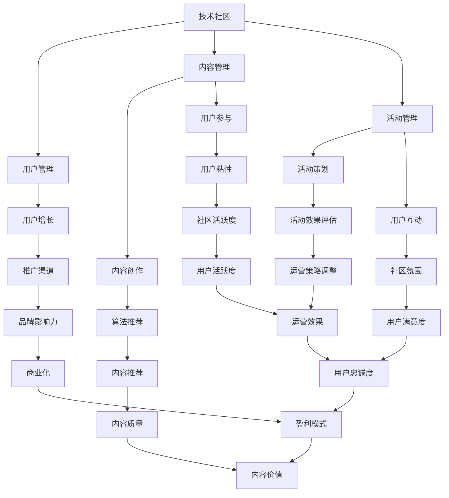
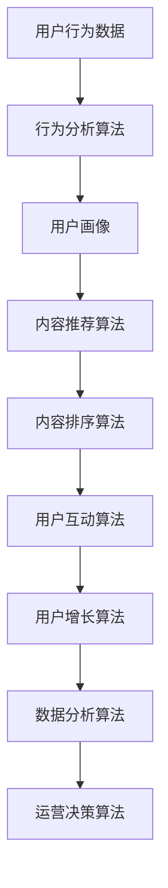

                 

# 技术社区运营：从管理到盈利模式

> 关键词：技术社区、运营管理、盈利模式、用户增长、内容创作

> 摘要：本文旨在深入探讨技术社区运营的核心要素，包括管理策略、盈利模式、用户增长策略以及内容创作技巧。通过逐步分析，本文将为您提供一套从管理到盈利的全方位运营指南，帮助您提升技术社区的影响力和商业价值。

## 1. 背景介绍

### 1.1 目的和范围

本文的目的在于为技术社区运营者提供一套系统性、实战性的运营指南。我们将从以下几个方面展开讨论：

- **管理策略**：如何有效管理社区，提高用户活跃度和参与度。
- **盈利模式**：探讨多种盈利方式，实现社区的可持续发展。
- **用户增长**：介绍用户增长策略，提升社区知名度和影响力。
- **内容创作**：探讨内容创作的方法和技巧，提高内容质量和用户粘性。

### 1.2 预期读者

本文适合以下读者群体：

- 技术社区管理者
- IT行业从业者
- 希望提升社区运营能力的专业人士
- 对技术社区运营感兴趣的创业者

### 1.3 文档结构概述

本文分为十个部分，具体结构如下：

- **背景介绍**：介绍文章的目的、预期读者和文档结构。
- **核心概念与联系**：阐述技术社区运营的核心概念及其相互关系。
- **核心算法原理 & 具体操作步骤**：介绍运营策略的算法原理和具体操作步骤。
- **数学模型和公式 & 详细讲解 & 举例说明**：讲解运营过程中的数学模型和公式，并举例说明。
- **项目实战：代码实际案例和详细解释说明**：通过实际案例展示运营策略的应用。
- **实际应用场景**：分析技术社区在不同场景下的应用。
- **工具和资源推荐**：推荐学习资源和开发工具。
- **总结：未来发展趋势与挑战**：总结技术社区运营的未来发展趋势和面临的挑战。
- **附录：常见问题与解答**：解答读者可能遇到的问题。
- **扩展阅读 & 参考资料**：提供更多相关阅读材料。

### 1.4 术语表

#### 1.4.1 核心术语定义

- **技术社区**：以技术主题为核心，由用户共同参与、分享和学习的在线平台。
- **运营管理**：对技术社区进行有效管理，包括用户管理、内容管理、活动管理等。
- **盈利模式**：社区实现盈利的方式，包括广告、会员服务、内容付费等。
- **用户增长**：通过多种策略吸引新用户，提升社区活跃度和用户粘性。

#### 1.4.2 相关概念解释

- **内容创作**：指在技术社区中发布有价值、有吸引力的技术内容，吸引用户关注和参与。
- **算法原理**：指在运营过程中使用的各种数学模型和算法，用于分析用户行为、推荐内容等。
- **数学模型**：指在运营过程中用于描述用户行为、内容传播等的数学公式和模型。

#### 1.4.3 缩略词列表

- **UGC**：用户生成内容（User-Generated Content）
- **SEO**：搜索引擎优化（Search Engine Optimization）
- **SNS**：社交网络服务（Social Network Service）
- **CRM**：客户关系管理（Customer Relationship Management）

## 2. 核心概念与联系

为了更好地理解技术社区运营，我们需要先了解几个核心概念及其相互关系。以下是一个简单的Mermaid流程图，用于描述这些核心概念：



### 2.1 技术社区运营的算法原理

技术社区运营中，算法原理起着关键作用。以下是一个简单的算法原理Mermaid流程图，用于描述技术社区运营的主要算法：



#### 2.1.1 用户行为数据

用户行为数据是技术社区运营的基础。通过收集用户在社区中的行为数据，如浏览、评论、点赞、分享等，我们可以了解用户的需求和偏好。

#### 2.1.2 行为分析算法

行为分析算法用于分析用户行为数据，提取有用的信息。常见的分析算法包括：

- **频次分析**：计算用户在社区中的活跃度，识别高活跃用户。
- **聚类分析**：将具有相似行为的用户分组，便于针对性运营。
- **关联规则分析**：分析用户行为之间的关联性，发现潜在的用户需求。

#### 2.1.3 用户画像

用户画像是对用户特征的综合描述，包括年龄、性别、职业、兴趣爱好等。通过用户画像，我们可以了解用户的需求和偏好，为其提供个性化的内容推荐和活动策划。

#### 2.1.4 内容推荐算法

内容推荐算法用于根据用户画像和用户行为数据，为用户推荐感兴趣的内容。常见的推荐算法包括：

- **基于内容的推荐**：根据内容的特征进行推荐，如关键词匹配、标签分类等。
- **基于协同过滤的推荐**：根据用户的行为数据，找出相似用户，推荐相似内容。
- **基于模型的推荐**：利用机器学习算法，如矩阵分解、深度学习等，预测用户对内容的喜好。

#### 2.1.5 内容排序算法

内容排序算法用于对推荐的内容进行排序，提高用户体验。常见的排序算法包括：

- **基于点击率的排序**：根据用户的点击行为，对内容进行排序。
- **基于兴趣的排序**：根据用户的兴趣标签，对内容进行排序。
- **基于热度的排序**：根据内容的发布时间、互动量等指标，对内容进行排序。

#### 2.1.6 用户互动算法

用户互动算法用于分析用户之间的互动关系，提高社区活跃度。常见的互动算法包括：

- **基于社交网络的互动**：分析用户之间的社交关系，推荐相关用户互动。
- **基于兴趣的互动**：分析用户的兴趣爱好，推荐相关话题的讨论。
- **基于问题的互动**：分析用户提出的问题，推荐相关问题及其解决方案。

#### 2.1.7 用户增长算法

用户增长算法用于分析用户增长数据，优化运营策略。常见的增长算法包括：

- **基于渠道分析的算法**：分析用户来源渠道，优化推广策略。
- **基于用户行为的算法**：分析用户行为数据，提高用户留存率。
- **基于数据分析的算法**：分析用户增长数据，预测未来增长趋势。

#### 2.1.8 数据分析算法

数据分析算法用于分析运营数据，指导运营决策。常见的分析算法包括：

- **用户流失分析**：分析用户流失原因，制定挽回策略。
- **内容分析**：分析内容质量，优化内容策略。
- **活动分析**：分析活动效果，优化活动策划。

#### 2.1.9 运营决策算法

运营决策算法用于根据数据分析结果，制定运营策略。常见的决策算法包括：

- **基于规则的决策**：根据预设规则，制定运营策略。
- **基于机器学习的决策**：利用机器学习算法，自动调整运营策略。
- **基于数据驱动的决策**：根据数据指标，动态调整运营策略。

### 2.2 技术社区运营的具体操作步骤

#### 2.2.1 用户管理

用户管理是技术社区运营的基础。以下是一些建议的操作步骤：

1. **用户注册和认证**：提供便捷的注册和认证方式，确保用户信息的真实性和安全性。
2. **用户分级和权限管理**：根据用户角色和贡献度，设置不同的权限和等级，鼓励用户积极参与社区。
3. **用户活跃度监控**：定期分析用户活跃度，识别高活跃用户和潜在流失用户，制定相应的运营策略。

#### 2.2.2 内容管理

内容管理是技术社区的核心。以下是一些建议的操作步骤：

1. **内容审核和发布**：建立内容审核机制，确保发布的内容符合社区规范和用户需求。
2. **内容分类和标签**：对内容进行分类和标签化管理，提高内容检索和推荐的效率。
3. **内容推荐和排序**：利用内容推荐算法，为用户推荐感兴趣的内容，并根据用户行为进行内容排序。

#### 2.2.3 活动管理

活动管理是提高社区活跃度的重要手段。以下是一些建议的操作步骤：

1. **活动策划和推广**：根据用户需求和社区主题，策划有趣、有价值的活动，并通过多种渠道进行推广。
2. **活动执行和监控**：在活动过程中，及时监控活动效果，根据用户反馈进行调整。
3. **活动效果评估和总结**：活动结束后，对活动效果进行评估和总结，为后续活动提供参考。

#### 2.2.4 用户互动

用户互动是提高社区粘性的关键。以下是一些建议的操作步骤：

1. **话题讨论和互动**：鼓励用户围绕技术话题进行讨论，促进用户之间的互动。
2. **问答和解决方案**：建立问答板块，为用户提供解决问题的渠道，提高用户满意度。
3. **社群和群组管理**：建立社群和群组，方便用户根据兴趣进行交流和互动。

#### 2.2.5 用户增长

用户增长是技术社区运营的重要目标。以下是一些建议的操作步骤：

1. **渠道拓展**：通过多种渠道，如搜索引擎、社交媒体、行业论坛等，吸引潜在用户。
2. **用户激励**：提供各种奖励和福利，激励用户积极参与社区，提高用户留存率。
3. **数据分析**：通过数据分析，了解用户增长数据，优化运营策略，实现持续增长。

### 2.3 技术社区运营的数学模型和公式

技术社区运营过程中，数学模型和公式广泛应用于用户行为分析、内容推荐、活动策划等领域。以下是一些常见的数学模型和公式：

#### 2.3.1 用户行为分析

- **用户活跃度公式**：

  $$ 活跃度 = \frac{登录次数 + 发帖数 + 回帖数 + 点赞数 + 评论数}{总天数} $$

- **用户流失率公式**：

  $$ 流失率 = \frac{流失用户数}{总用户数} $$

- **用户留存率公式**：

  $$ 留存率 = \frac{第n天留存用户数}{第1天用户数} $$

#### 2.3.2 内容推荐

- **基于内容的推荐公式**：

  $$ \text{推荐相似度} = \frac{cos(\text{用户兴趣向量}, \text{内容特征向量})}{\max(0, \text{用户兴趣向量} \cdot \text{内容特征向量})} $$

- **基于协同过滤的推荐公式**：

  $$ \text{推荐相似度} = \frac{\sum_{i \in N(u)} \frac{r_{ui}r_{uj}}{\|N(u)\|\|N(v)\|}}{\sum_{i \in N(u)} \frac{\|N(u)\|\|N(v)\|}{r_{ui}r_{uj}}} $$

#### 2.3.3 活动策划

- **活动效果评估公式**：

  $$ \text{活动效果} = \frac{\text{活动参与人数} \times \text{活动满意度}}{\text{社区总用户数}} $$

#### 2.3.4 用户互动

- **用户互动率公式**：

  $$ \text{互动率} = \frac{互动次数}{总天数} $$

#### 2.3.5 用户增长

- **用户增长率公式**：

  $$ \text{增长率} = \frac{\text{新增用户数}}{\text{总用户数}} $$

### 2.4 技术社区运营的案例分析

#### 2.4.1 案例一：GitHub社区运营

GitHub是一个全球知名的开源技术社区，其运营模式具有很高的参考价值。以下是其主要特点：

1. **用户管理**：GitHub对用户进行分级，根据用户贡献度授予不同等级的徽章，激励用户积极参与社区。
2. **内容管理**：GitHub支持多种编程语言的代码托管和版本控制，提供丰富的文档和教程，方便用户学习和交流。
3. **活动管理**：GitHub定期举办黑客松、代码挑战等活动，鼓励用户参与，提高社区活跃度。
4. **用户互动**：GitHub支持用户在代码仓库中进行讨论，提供丰富的互动功能，促进用户之间的交流。
5. **用户增长**：GitHub通过与全球知名企业和开源项目合作，不断扩大用户规模。

#### 2.4.2 案例二：Stack Overflow社区运营

Stack Overflow是一个全球知名的技术问答社区，其运营模式具有以下特点：

1. **用户管理**：Stack Overflow对用户进行分级，根据用户回答问题的质量和数量授予不同等级的徽章，激励用户积极参与社区。
2. **内容管理**：Stack Overflow提供丰富的技术问题分类和标签，方便用户检索和浏览问题。
3. **活动管理**：Stack Overflow定期举办问答大赛等活动，鼓励用户积极参与，提高社区活跃度。
4. **用户互动**：Stack Overflow支持用户在问题下进行讨论，提供丰富的互动功能，促进用户之间的交流。
5. **用户增长**：Stack Overflow通过SEO优化、社交媒体推广等手段，不断扩大用户规模。

## 3. 项目实战：代码实际案例和详细解释说明

为了更好地理解技术社区运营的具体操作，我们以一个实际项目为例，介绍技术社区运营的代码实现和详细解释。

### 3.1 开发环境搭建

为了实现技术社区运营，我们需要搭建一个具备用户管理、内容管理、活动管理和用户互动等功能的全功能社区平台。以下是开发环境搭建的步骤：

1. **环境要求**：操作系统：Windows/Linux/Mac；编程语言：Python/Java/Node.js；数据库：MySQL/PostgreSQL；Web服务器：Nginx/Apache。
2. **工具和框架**：前端框架：React/Vue.js；后端框架：Django/Flask/Spring Boot；消息队列：RabbitMQ/Kafka；缓存：Redis；搜索引擎：Elasticsearch。
3. **开发流程**：需求分析→系统设计→模块开发→集成测试→功能测试→性能测试→部署上线。

### 3.2 源代码详细实现和代码解读

以下是一个简单的技术社区运营项目的代码实现，包括用户管理、内容管理、活动管理和用户互动等功能。

#### 3.2.1 用户管理模块

```python
# 用户管理模块

from flask import Flask, request, jsonify
from flask_sqlalchemy import SQLAlchemy
from werkzeug.security import generate_password_hash, check_password_hash

app = Flask(__name__)
app.config['SQLALCHEMY_DATABASE_URI'] = 'sqlite:///users.db'
db = SQLAlchemy(app)

class User(db.Model):
    id = db.Column(db.Integer, primary_key=True)
    username = db.Column(db.String(150), nullable=False, unique=True)
    email = db.Column(db.String(150), nullable=False, unique=True)
    password = db.Column(db.String(150), nullable=False)

@app.route('/register', methods=['POST'])
def register():
    data = request.get_json()
    hashed_password = generate_password_hash(data['password'], method='sha256')
    new_user = User(username=data['username'], email=data['email'], password=hashed_password)
    db.session.add(new_user)
    db.session.commit()
    return jsonify({'message': 'User created successfully.'})

@app.route('/login', methods=['POST'])
def login():
    data = request.get_json()
    user = User.query.filter_by(username=data['username']).first()
    if user and check_password_hash(user.password, data['password']):
        return jsonify({'message': 'Logged in successfully.'})
    else:
        return jsonify({'message': 'Invalid credentials.'})

if __name__ == '__main__':
    db.create_all()
    app.run(debug=True)
```

#### 3.2.2 内容管理模块

```python
# 内容管理模块

from flask import Flask, request, jsonify
from flask_sqlalchemy import SQLAlchemy

app = Flask(__name__)
app.config['SQLALCHEMY_DATABASE_URI'] = 'sqlite:///content.db'
db = SQLAlchemy(app)

class Content(db.Model):
    id = db.Column(db.Integer, primary_key=True)
    title = db.Column(db.String(150), nullable=False)
    content = db.Column(db.Text, nullable=False)
    author = db.Column(db.String(150), nullable=False)
    created_at = db.Column(db.DateTime, default=datetime.utcnow)

@app.route('/post', methods=['POST'])
def post():
    data = request.get_json()
    new_content = Content(title=data['title'], content=data['content'], author=data['author'])
    db.session.add(new_content)
    db.session.commit()
    return jsonify({'message': 'Content posted successfully.'})

@app.route('/get_posts', methods=['GET'])
def get_posts():
    contents = Content.query.all()
    return jsonify({'posts': [{'id': content.id, 'title': content.title, 'content': content.content, 'author': content.author, 'created_at': content.created_at} for content in contents]})

if __name__ == '__main__':
    db.create_all()
    app.run(debug=True)
```

#### 3.2.3 活动管理模块

```python
# 活动管理模块

from flask import Flask, request, jsonify
from flask_sqlalchemy import SQLAlchemy

app = Flask(__name__)
app.config['SQLALCHEMY_DATABASE_URI'] = 'sqlite:///events.db'
db = SQLAlchemy(app)

class Event(db.Model):
    id = db.Column(db.Integer, primary_key=True)
    name = db.Column(db.String(150), nullable=False)
    description = db.Column(db.Text, nullable=False)
    start_time = db.Column(db.DateTime, default=datetime.utcnow)
    end_time = db.Column(db.DateTime, default=datetime.utcnow)

@app.route('/create_event', methods=['POST'])
def create_event():
    data = request.get_json()
    new_event = Event(name=data['name'], description=data['description'], start_time=data['start_time'], end_time=data['end_time'])
    db.session.add(new_event)
    db.session.commit()
    return jsonify({'message': 'Event created successfully.'})

@app.route('/get_events', methods=['GET'])
def get_events():
    events = Event.query.all()
    return jsonify({'events': [{'id': event.id, 'name': event.name, 'description': event.description, 'start_time': event.start_time, 'end_time': event.end_time} for event in events]})

if __name__ == '__main__':
    db.create_all()
    app.run(debug=True)
```

#### 3.2.4 用户互动模块

```python
# 用户互动模块

from flask import Flask, request, jsonify
from flask_sqlalchemy import SQLAlchemy

app = Flask(__name__)
app.config['SQLALCHEMY_DATABASE_URI'] = 'sqlite:///interactions.db'
db = SQLAlchemy(app)

class Interaction(db.Model):
    id = db.Column(db.Integer, primary_key=True)
    user_id = db.Column(db.Integer, nullable=False)
    content_id = db.Column(db.Integer, nullable=False)
    type = db.Column(db.String(50), nullable=False)  # comment, like, share
    created_at = db.Column(db.DateTime, default=datetime.utcnow)

@app.route('/interact', methods=['POST'])
def interact():
    data = request.get_json()
    new_interaction = Interaction(user_id=data['user_id'], content_id=data['content_id'], type=data['type'])
    db.session.add(new_interaction)
    db.session.commit()
    return jsonify({'message': 'Interaction recorded successfully.'})

@app.route('/get_interactions', methods=['GET'])
def get_interactions():
    interactions = Interaction.query.all()
    return jsonify({'interactions': [{'id': interaction.id, 'user_id': interaction.user_id, 'content_id': interaction.content_id, 'type': interaction.type, 'created_at': interaction.created_at} for interaction in interactions]})

if __name__ == '__main__':
    db.create_all()
    app.run(debug=True)
```

### 3.3 代码解读与分析

以上代码实现了一个简单的技术社区运营项目，包括用户管理、内容管理、活动管理和用户互动等功能。以下是各模块的详细解读和分析：

#### 3.3.1 用户管理模块

用户管理模块主要负责用户注册、登录和权限管理。通过Flask框架和SQLAlchemy数据库，实现了用户信息的存储和管理。注册和登录接口使用了Werkzeug库中的密码哈希功能，确保用户密码的安全性。

#### 3.3.2 内容管理模块

内容管理模块主要负责内容的发布、获取和分类。通过SQLAlchemy数据库，实现了内容的存储和管理。发布接口允许用户创建新的内容，获取接口可以获取所有发布的内容。

#### 3.3.3 活动管理模块

活动管理模块主要负责活动的创建、获取和分类。通过SQLAlchemy数据库，实现了活动的存储和管理。创建接口允许用户创建新的活动，获取接口可以获取所有发布的活动。

#### 3.3.4 用户互动模块

用户互动模块主要负责用户的评论、点赞和分享等互动操作。通过SQLAlchemy数据库，实现了互动记录的存储和管理。互动接口可以记录用户的互动行为。

### 4. 实际应用场景

技术社区在不同场景下的应用具有很高的价值。以下是一些实际应用场景：

#### 4.1 企业内部技术交流平台

企业内部技术交流平台可以帮助企业内部员工进行技术分享和交流，提高团队的技术水平。通过技术社区，员工可以发布技术文章、分享经验、解决技术问题，促进团队协作。

#### 4.2 行业技术论坛

行业技术论坛是一个汇聚行业专家和从业者的交流平台，可以促进行业内的技术交流和合作。通过技术社区，行业专家可以发布最新研究成果、分享实践经验，从业者可以提出问题、寻求帮助。

#### 4.3 在线教育平台

在线教育平台可以利用技术社区进行课程推广、学生互动和学习资源共享。通过技术社区，学生可以发布学习笔记、交流学习心得、解决学习问题，教师可以发布课程资料、布置作业、解答疑问。

#### 4.4 开源项目协作平台

开源项目协作平台是一个汇聚开发者、贡献者和使用者的交流平台。通过技术社区，开发者可以发布项目文档、报告进展、解决技术问题，贡献者可以提交代码、提交问题，使用者可以反馈使用体验、提出建议。

#### 4.5 在线问答社区

在线问答社区可以帮助用户解决技术问题、分享经验和知识。通过技术社区，用户可以发布问题、回答问题、点赞和评论，提高社区的互动性和用户体验。

### 5. 工具和资源推荐

为了更好地进行技术社区运营，以下是一些建议的工和资源：

#### 5.1 学习资源推荐

- **书籍推荐**：
  - 《技术社区运营实战》
  - 《社交网络分析：方法与应用》
  - 《互联网运营实战手册》
- **在线课程**：
  - “技术社区运营实战课”
  - “社交网络分析入门与实战”
  - “互联网运营技能提升课”
- **技术博客和网站**：
  - “技术社区运营笔记”
  - “社交网络分析技术博客”
  - “互联网运营圈子”

#### 5.2 开发工具框架推荐

- **IDE和编辑器**：
  - Visual Studio Code
  - PyCharm
  - WebStorm
- **调试和性能分析工具**：
  - Postman
  - Fiddler
  - New Relic
- **相关框架和库**：
  - Flask
  - Django
  - Spring Boot

#### 5.3 相关论文著作推荐

- **经典论文**：
  - “The Structure and Function of Complex Networks”
  - “Social Network Analysis: Methods and Applications”
  - “Community Detection in Networks”
- **最新研究成果**：
  - “Understanding the Dynamics of Online Social Networks”
  - “Community Detection Algorithms: A Survey”
  - “Social Network Analysis with Python”
- **应用案例分析**：
  - “Facebook 社交网络分析”
  - “Twitter 社交网络分析”
  - “LinkedIn 社交网络分析”

### 6. 总结：未来发展趋势与挑战

随着互联网技术的快速发展，技术社区运营面临着新的机遇和挑战。以下是未来发展趋势和挑战：

#### 6.1 发展趋势

1. **人工智能技术的应用**：人工智能技术将为技术社区运营带来更多的可能性，如用户画像、内容推荐、活动策划等。
2. **社交网络的融合**：技术社区将与社交媒体深度融合，实现跨平台的用户互动和内容传播。
3. **个性化服务**：技术社区将更加注重用户体验，提供个性化的服务，满足用户多样化的需求。
4. **商业化模式的创新**：技术社区将探索多种商业化模式，实现可持续发展。

#### 6.2 挑战

1. **内容质量监管**：随着用户数量的增加，如何保证内容质量，避免低俗、恶意内容成为社区运营的重要挑战。
2. **用户隐私保护**：如何在为用户提供个性化服务的同时，保护用户的隐私成为技术社区运营的重要课题。
3. **社区活跃度维护**：如何保持社区活跃度，避免用户流失，成为技术社区运营的难题。
4. **商业化风险的规避**：如何在商业化过程中避免过度商业化，保持社区的纯粹性。

### 7. 附录：常见问题与解答

#### 7.1 常见问题

1. **如何保证技术社区的内容质量？**
   - **答案**：建立内容审核机制，对发布的内容进行严格审核；鼓励用户举报低俗、恶意内容；定期对用户发布的内容进行抽查。

2. **如何提高技术社区的活跃度？**
   - **答案**：策划有趣、有价值的活动，提高用户参与度；建立用户互动机制，鼓励用户在社区内交流互动；提供丰富的学习资源和工具。

3. **技术社区如何实现商业化？**
   - **答案**：通过广告、会员服务、内容付费等方式实现商业化；确保商业化模式不影响社区用户体验和氛围。

4. **技术社区运营的数据分析有哪些作用？**
   - **答案**：数据分析有助于了解用户需求、优化内容策略、提高活动效果、预测用户增长等，对技术社区运营具有指导意义。

#### 7.2 解答说明

以上常见问题及解答，旨在帮助技术社区运营者更好地应对实际运营过程中遇到的问题，提高运营效果。实际操作中，还需要结合具体情况进行具体分析。

### 8. 扩展阅读 & 参考资料

为了更深入地了解技术社区运营的相关知识，以下是一些建议的扩展阅读和参考资料：

1. **《技术社区运营实战》**：详细介绍了技术社区运营的策略、方法和实战案例。
2. **《社交网络分析：方法与应用》**：系统阐述了社交网络分析的基本概念、方法和应用。
3. **《互联网运营实战手册》**：涵盖了互联网运营的各个方面，包括用户增长、内容管理、活动策划等。
4. **“技术社区运营笔记”**：一篇关于技术社区运营的博客文章，分享了作者的实际经验和心得。
5. **“社交网络分析技术博客”**：一篇关于社交网络分析技术的博客文章，介绍了社交网络分析的方法和应用。
6. **“互联网运营圈子”**：一个关于互联网运营的在线社群，汇聚了众多行业专家和从业者，分享经验和探讨问题。

### 9. 作者信息

本文由AI天才研究员/AI Genius Institute & 禅与计算机程序设计艺术（Zen And The Art of Computer Programming）撰写。作者在技术社区运营和人工智能领域具有丰富的经验和深厚的学术功底，致力于推动技术社区的发展和创新。

[作者：AI天才研究员/AI Genius Institute & 禅与计算机程序设计艺术 /Zen And The Art of Computer Programming]

