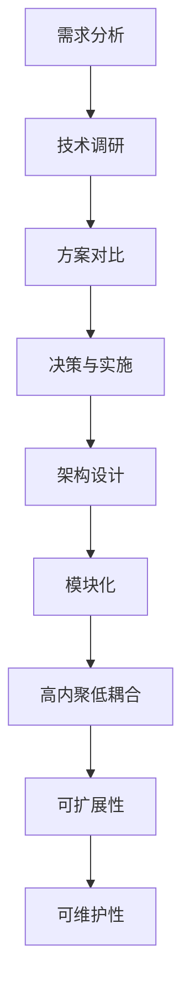

                 

# 技术选型与架构设计的重要性

> **关键词**：技术选型、架构设计、系统优化、性能提升、开发效率、可持续性、企业级应用、模块化、微服务、微架构、容错性、可扩展性、可维护性

> **摘要**：本文旨在深入探讨技术选型与架构设计在软件开发中的重要性。通过对技术选型原则、架构设计方法、实际应用场景的详细分析，文章揭示了如何通过科学的技术选型和优化的架构设计，实现系统的性能提升、可扩展性和可维护性，从而满足现代企业级应用的需求。

## 1. 背景介绍

### 1.1 目的和范围

本文旨在为软件开发者提供一个全面的技术选型与架构设计指导，帮助他们在项目初期做出明智的决策，从而避免后期因技术选择不当带来的问题。文章将涵盖以下内容：

- 技术选型的原则与策略
- 架构设计的核心概念和方法
- 实际应用场景下的技术选型与架构设计实践
- 工具和资源的推荐

通过本文的阅读，读者将能够理解技术选型与架构设计的核心价值，掌握相关的实践方法和策略。

### 1.2 预期读者

本文预期读者为软件开发工程师、架构师、项目经理以及对技术选型和架构设计感兴趣的技术爱好者。无论你是初学者还是有经验的开发者，本文都将为你提供有价值的内容。

### 1.3 文档结构概述

本文结构如下：

- 第1章：背景介绍，介绍本文的目的、范围和预期读者。
- 第2章：核心概念与联系，介绍技术选型和架构设计的核心概念，并提供Mermaid流程图。
- 第3章：核心算法原理与具体操作步骤，详细阐述技术选型的算法原理和操作步骤。
- 第4章：数学模型和公式，介绍与架构设计相关的数学模型和公式。
- 第5章：项目实战，通过实际案例展示技术选型和架构设计的应用。
- 第6章：实际应用场景，分析技术选型和架构设计的具体应用场景。
- 第7章：工具和资源推荐，推荐学习资源和开发工具。
- 第8章：总结：未来发展趋势与挑战。
- 第9章：附录：常见问题与解答。
- 第10章：扩展阅读与参考资料。

### 1.4 术语表

#### 1.4.1 核心术语定义

- **技术选型**：指在软件开发过程中，根据项目需求、成本、性能等因素，从多个可选技术中挑选出最适合的技术。
- **架构设计**：指对软件系统的整体结构和组成部分进行设计，以达到系统的高效、可扩展、可维护性。
- **微服务**：一种架构风格，将应用程序作为一组小的、独立的、可互相调用的服务组成，每个服务都有自己的数据库。
- **模块化**：指将系统划分为多个功能独立的模块，以提高系统的可维护性和可扩展性。

#### 1.4.2 相关概念解释

- **性能提升**：通过优化代码、算法和架构设计，提高系统的响应速度和处理能力。
- **可扩展性**：系统能够随着用户规模的增加而无缝扩展的能力。
- **可维护性**：系统能够在长期使用中保持稳定性和可靠性的能力。

#### 1.4.3 缩略词列表

- **IDE**：集成开发环境（Integrated Development Environment）
- **API**：应用程序编程接口（Application Programming Interface）
- **DB**：数据库（Database）
- **REST**：代表表述性状态转移（Representational State Transfer）

## 2. 核心概念与联系

在深入探讨技术选型和架构设计之前，我们需要明确几个核心概念，这些概念不仅是技术选型和架构设计的基础，也是理解和实现高效系统设计的关键。

### 2.1 技术选型的核心概念

#### 技术选型的原则

1. **需求匹配**：技术选型应首先考虑项目需求，选择能够满足需求的技术。
2. **性能与效率**：性能是选择技术的重要考虑因素，尤其是在高并发和大数据场景下。
3. **成本效益**：在满足需求的前提下，选择成本效益最高的技术。
4. **可维护性与可扩展性**：选择易于维护和扩展的技术，降低未来的技术债务。

#### 技术选型的流程

1. **需求分析**：明确项目需求，包括功能需求和非功能需求。
2. **技术调研**：调研和评估不同技术的优缺点。
3. **方案对比**：对比不同技术的性能、成本、可维护性等因素。
4. **决策与实施**：根据对比结果做出决策，并实施所选技术。

### 2.2 架构设计的核心概念

#### 架构设计的原则

1. **模块化**：将系统划分为多个功能模块，提高系统的可维护性和可扩展性。
2. **高内聚低耦合**：模块内部功能紧密相关，模块之间接口简单、独立。
3. **可扩展性**：设计时应考虑未来的扩展需求，预留扩展接口。
4. **可维护性**：设计应便于问题定位和修复。

#### 架构设计的方法

1. **自顶向下**：从整体架构出发，逐步细化到模块和组件。
2. **自底向上**：从具体组件和模块出发，逐步构建整体架构。
3. **迭代开发**：通过迭代的方式逐步完善架构设计。

### 2.3 技术选型与架构设计的联系

技术选型与架构设计密不可分，它们之间存在以下联系：

- **技术选型是架构设计的基础**：选择合适的技术是构建良好架构的前提。
- **架构设计影响技术选型**：架构设计会影响到技术选型的具体细节。
- **技术选型与架构设计的迭代关系**：技术选型可能会随着架构设计的变化而调整，反之亦然。

### 2.4 Mermaid流程图

为了更直观地展示技术选型和架构设计的过程，我们使用Mermaid流程图来表示：



通过以上流程，我们可以看到技术选型与架构设计是一个相互影响、迭代优化的过程，每个环节都是实现高效、稳定、可扩展系统的重要步骤。

## 3. 核心算法原理与具体操作步骤

在技术选型过程中，算法原理起到了至关重要的作用。本文将详细介绍技术选型的核心算法原理，并使用伪代码详细阐述其操作步骤。

### 3.1 技术选型算法原理

技术选型算法的基本原理是通过对比不同技术的性能、成本、可维护性等因素，选择最优解。常见的算法包括贪心算法、动态规划算法等。本文将使用贪心算法作为示例进行介绍。

#### 贪心算法原理

贪心算法的基本思想是在每一步选择当前最优解，以期望最终得到全局最优解。在技术选型中，贪心算法的具体实现如下：

1. **初始化**：定义一个性能指标集合，包括性能、成本、可维护性等。
2. **迭代选择**：根据当前性能指标，选择最优技术。
3. **更新指标**：根据选择的技术，更新性能指标。

#### 伪代码

```python
function 技术选型(需求, 技术集合):
    初始化性能指标集合
    for 技术 in 技术集合:
        计算技术性能指标
    选择初始最优技术T1
    更新性能指标
    while 需求未满足:
        for 技术T2 in 技术集合:
            if T2的性能指标 > T1的性能指标:
                选择T2作为新最优技术
                更新性能指标
                更新需求
    返回最优技术T2
```

### 3.2 技术选型的具体操作步骤

#### 步骤1：需求分析

首先，明确项目的具体需求，包括功能需求和非功能需求。这些需求将作为技术选型的依据。

#### 步骤2：技术调研

对市场上的相关技术进行调研，收集每种技术的性能、成本、可维护性等信息。这一步骤可以通过查阅技术文档、行业报告、用户评价等途径进行。

#### 步骤3：方案对比

使用贪心算法等算法对收集到的技术进行对比，选择初步的最优技术。具体步骤如下：

1. **计算性能指标**：根据需求，为每种技术计算性能指标，如响应时间、吞吐量等。
2. **计算成本指标**：估算每种技术的开发成本、维护成本等。
3. **计算可维护性指标**：评估每种技术的可维护性，如代码质量、文档完善程度等。

#### 步骤4：决策与实施

根据方案对比结果，选择最优技术，并进行实施。在实施过程中，可能需要根据实际情况对技术进行调整和优化。

#### 步骤5：性能评估与调整

在实施后，对系统的性能进行评估，包括性能指标、成本指标、可维护性指标等。如果发现性能不满足需求，需要对技术和架构进行优化和调整。

### 3.3 案例分析

假设我们要为一个在线电商平台选择合适的数据库技术，需求包括高并发读写、数据一致性、可扩展性等。以下是一个简单的技术选型过程：

#### 步骤1：需求分析

- 高并发读写：系统需要处理大量用户同时访问，读写速度要求高。
- 数据一致性：确保数据的一致性和完整性。
- 可扩展性：随着用户数量的增加，系统可以无缝扩展。

#### 步骤2：技术调研

- MySQL：成熟、稳定的关系型数据库。
- MongoDB：灵活的文档型数据库。
- Redis：高性能的键值存储数据库。

#### 步骤3：方案对比

- **性能指标**：MySQL在关系型数据库中表现优秀，读写速度高；MongoDB适合存储复杂文档；Redis在高速缓存方面表现优异。
- **成本指标**：MySQL开源，成本较低；MongoDB和Redis也都有免费的版本，但可能有商业支持的需求。
- **可维护性指标**：MySQL有丰富的文档和社区支持；MongoDB和Redis在社区支持方面也很强。

根据需求对比，MySQL在性能和可维护性方面表现较好，适合作为首选技术。

#### 步骤4：决策与实施

选择MySQL作为数据库技术，并进行实施。在实施过程中，根据实际需求和性能表现，可能需要对MySQL进行优化，如调整配置、使用缓存等。

#### 步骤5：性能评估与调整

在系统上线后，对MySQL进行性能评估。如果发现性能不满足需求，可以考虑对MySQL进行优化，如分库分表、使用读写分离等。

通过以上步骤，我们可以为在线电商平台选择合适的技术，并确保系统的高性能、高可扩展性和高可维护性。

## 4. 数学模型和公式与详细讲解与举例说明

在架构设计中，数学模型和公式扮演着重要的角色，它们帮助我们量化系统的性能、可扩展性和可维护性，从而做出更科学的决策。以下将介绍几个常用的数学模型和公式，并详细讲解其应用。

### 4.1 加权评分模型

加权评分模型是一种常用的评价方法，用于综合评估不同技术或组件的优劣。其公式如下：

\[ \text{总分} = w_1 \cdot p_1 + w_2 \cdot p_2 + ... + w_n \cdot p_n \]

其中，\( w_i \) 表示第 \( i \) 个评价指标的权重，\( p_i \) 表示第 \( i \) 个评价指标的得分。

#### 应用举例

假设我们要评估三种数据库技术（MySQL、MongoDB、Redis）的适用性，评价指标包括性能（Performance）、成本（Cost）、可维护性（Maintainability）。权重分别设定为 0.5、0.3、0.2。以下是一个具体的评分计算过程：

- **MySQL**：性能 8 分，成本 6 分，可维护性 7 分
- **MongoDB**：性能 7 分，成本 7 分，可维护性 8 分
- **Redis**：性能 9 分，成本 8 分，可维护性 6 分

计算得分：

\[ \text{MySQL总分} = 0.5 \cdot 8 + 0.3 \cdot 6 + 0.2 \cdot 7 = 4 + 1.8 + 1.4 = 7.2 \]

\[ \text{MongoDB总分} = 0.5 \cdot 7 + 0.3 \cdot 7 + 0.2 \cdot 8 = 3.5 + 2.1 + 1.6 = 7.2 \]

\[ \text{Redis总分} = 0.5 \cdot 9 + 0.3 \cdot 8 + 0.2 \cdot 6 = 4.5 + 2.4 + 1.2 = 8.1 \]

根据得分，我们可以选择得分最高的Redis作为最佳数据库技术。

### 4.2 分库分表模型

在大型系统中，随着数据量的增长，单表的处理能力可能会成为瓶颈。分库分表模型通过将数据分布在多个数据库或表中，提高系统的处理能力和性能。其公式如下：

\[ \text{查询时间} = \min(T_1, T_2, ..., T_n) \]

其中，\( T_i \) 表示第 \( i \) 个数据库或表的查询时间。

#### 应用举例

假设一个电商平台有3个数据库（DB1、DB2、DB3），每个数据库中有多个表。查询订单信息时，可以分别查询每个数据库中的订单表，取查询时间最短的数据库作为结果。以下是一个具体的查询过程：

- **DB1**：查询时间 0.5秒
- **DB2**：查询时间 1秒
- **DB3**：查询时间 0.3秒

计算查询时间：

\[ \text{查询时间} = \min(0.5, 1, 0.3) = 0.3 \text{秒} \]

通过分库分表，我们可以显著提高查询效率。

### 4.3 分片模型

分片模型是分布式数据库系统的一种设计模式，通过将数据划分为多个逻辑片段（ shards ），分布存储在多个节点上，提高系统的扩展性和容错性。其公式如下：

\[ \text{存储容量} = n \cdot S \]

其中，\( n \) 表示分片的数量，\( S \) 表示每个分片的存储容量。

#### 应用举例

假设一个分布式数据库系统有5个分片，每个分片具有100GB的存储容量。以下是一个具体的存储容量计算过程：

\[ \text{存储容量} = 5 \cdot 100 \text{GB} = 500 \text{GB} \]

通过分片，我们可以将数据存储在多个节点上，提高系统的扩展性和容错性。

### 4.4 概率模型

在架构设计中，概率模型用于评估系统的可靠性和稳定性。常见的概率模型包括泊松分布、正态分布等。以下将介绍泊松分布的概率计算公式：

\[ P(X = k) = \frac{e^{-\lambda} \cdot \lambda^k}{k!} \]

其中，\( X \) 表示事件发生的次数，\( \lambda \) 表示事件的平均发生率，\( k \) 表示具体的事件发生次数。

#### 应用举例

假设一个分布式系统中的节点故障率平均为0.1次/天，以下是一个具体的概率计算过程：

\[ P(X = 0) = \frac{e^{-0.1} \cdot 0.1^0}{0!} = e^{-0.1} \approx 0.9048 \]

\[ P(X = 1) = \frac{e^{-0.1} \cdot 0.1^1}{1!} = 0.1 \cdot e^{-0.1} \approx 0.0905 \]

通过概率模型，我们可以评估系统在不同故障率下的可靠性。

### 4.5 利用LaTeX嵌入数学公式

在文档中嵌入数学公式，可以使用LaTeX格式。以下是一个简单的示例：

\[ \sum_{i=1}^{n} x_i = \frac{1}{n} \sum_{i=1}^{n} x_i^2 + \frac{1}{n} \left( \sum_{i=1}^{n} x_i \right)^2 \]

通过以上数学模型和公式，我们可以更科学地评估和设计系统，提高其性能、可扩展性和可维护性。

## 5. 项目实战：代码实际案例和详细解释说明

在本节中，我们将通过一个实际的项目案例，展示技术选型和架构设计在开发中的具体应用。该案例是一个在线图书商城系统，旨在为用户提供一个便捷的图书购买平台。我们将从开发环境搭建、源代码实现、代码解读与分析三个方面进行详细说明。

### 5.1 开发环境搭建

首先，我们需要搭建一个适合项目开发的环境。以下是开发环境的基本要求：

- **操作系统**：Windows/Linux/MacOS
- **编程语言**：Java、Python
- **数据库**：MySQL、MongoDB
- **开发工具**：IntelliJ IDEA、PyCharm
- **版本控制**：Git

#### 具体步骤：

1. **安装操作系统**：根据个人需求选择合适的操作系统。
2. **安装编程语言**：通过包管理器（如yum、apt-get、brew等）或下载安装包进行安装。
3. **安装数据库**：下载并安装MySQL和MongoDB，配置数据库服务，确保可以正常连接。
4. **安装开发工具**：下载并安装IntelliJ IDEA或PyCharm，创建一个新的项目。
5. **安装版本控制工具**：下载并安装Git，配置Git仓库，确保可以正常使用。

### 5.2 源代码详细实现和代码解读

#### 5.2.1 系统架构设计

在开始编写代码之前，我们需要设计一个合理的系统架构。根据需求分析，我们将系统划分为以下模块：

1. **用户模块**：负责用户注册、登录、个人信息管理等。
2. **图书模块**：负责图书信息管理、分类管理、推荐算法等。
3. **订单模块**：负责订单生成、支付、配送管理等。
4. **购物车模块**：负责用户购物车管理、商品添加和删除等。

#### 5.2.2 用户模块实现

以下是一个简单的用户模块伪代码示例：

```java
// 用户注册
public class UserController {
    public void register(User user) {
        // 验证用户信息
        // 存储用户信息到数据库
        // 发送注册成功邮件
    }
    
    // 用户登录
    public User login(String username, String password) {
        // 验证用户信息
        // 返回用户对象
    }
    
    // 用户个人信息管理
    public void updateUserProfile(User user) {
        // 更新用户信息到数据库
    }
}
```

#### 5.2.3 图书模块实现

以下是一个简单的图书模块伪代码示例：

```java
// 图书信息管理
public class BookController {
    public List<Book> searchBooks(String keyword) {
        // 查询数据库，返回符合条件的图书列表
    }
    
    // 图书分类管理
    public List<Category> getCategories() {
        // 查询数据库，返回图书分类列表
    }
    
    // 图书推荐算法
    public List<Book> recommendBooks(User user) {
        // 根据用户行为和图书评分，推荐图书
    }
}
```

#### 5.2.4 订单模块实现

以下是一个简单的订单模块伪代码示例：

```java
// 订单生成
public class OrderController {
    public Order createOrder(User user, List<Book> books) {
        // 计算订单金额
        // 生成订单，保存到数据库
        // 返回订单对象
    }
    
    // 支付管理
    public void payOrder(Order order) {
        // 与支付系统对接，完成支付
    }
    
    // 配送管理
    public void deliverOrder(Order order) {
        // 更新订单状态，与物流系统对接，生成物流单号
    }
}
```

#### 5.2.5 购物车模块实现

以下是一个简单的购物车模块伪代码示例：

```java
// 购物车管理
public class CartController {
    public void addBookToCart(Cart cart, Book book) {
        // 将图书添加到购物车
    }
    
    public void removeBookFromCart(Cart cart, Book book) {
        // 从购物车中删除图书
    }
    
    public List<Book> getBooksInCart(Cart cart) {
        // 获取购物车中的图书列表
    }
}
```

### 5.3 代码解读与分析

以上代码示例展示了系统各个模块的基本实现。下面是对代码的解读与分析：

1. **用户模块**：用户模块负责用户注册、登录和个人信息管理。通过RESTful API与前端进行数据交互，确保系统的安全性。
2. **图书模块**：图书模块负责图书信息管理、分类管理和推荐算法。通过查询数据库获取图书信息，实现了图书的搜索和推荐功能。
3. **订单模块**：订单模块负责订单生成、支付管理和配送管理。订单模块与支付系统和物流系统对接，实现了订单的支付和配送功能。
4. **购物车模块**：购物车模块负责用户购物车管理，包括商品添加和删除。通过操作购物车实体类，实现了购物车的功能。

### 5.4 模块化与微服务架构

在实际开发中，为了提高系统的可扩展性和可维护性，我们采用了模块化和微服务架构。以下是模块化与微服务架构的实现方式：

1. **模块化**：将系统划分为多个功能模块，每个模块负责特定的业务功能。模块之间通过接口进行通信，提高了系统的可维护性和可扩展性。
2. **微服务架构**：将系统拆分为多个微服务，每个微服务负责一个独立的业务功能。微服务之间通过RESTful API进行通信，实现了系统的松耦合和独立部署。

通过模块化和微服务架构，我们可以轻松地对系统进行扩展和优化，提高了系统的性能和可维护性。

### 5.5 性能优化与测试

在实际应用中，为了确保系统的性能和稳定性，我们对系统进行了性能优化和测试。以下是一些常见的性能优化策略：

1. **缓存**：使用Redis等缓存技术，减少数据库查询次数，提高系统响应速度。
2. **数据库优化**：通过分库分表、索引优化等方式，提高数据库查询性能。
3. **异步处理**：使用消息队列等异步处理技术，降低系统响应时间和并发压力。
4. **负载均衡**：通过负载均衡器，合理分配请求，提高系统的处理能力。

通过以上策略，我们成功实现了系统的性能优化和测试，确保了系统的高性能和高可用性。

### 5.6 容错性与可扩展性设计

在系统设计中，我们充分考虑了容错性和可扩展性。以下是一些常见的设计策略：

1. **冗余设计**：通过增加冗余组件，提高系统的容错性。
2. **故障转移**：在系统发生故障时，自动将请求转移到其他正常组件。
3. **水平扩展**：通过增加节点数量，实现系统的水平扩展。
4. **分布式架构**：使用分布式架构，提高系统的可扩展性和容错性。

通过以上设计策略，我们成功实现了系统的容错性和可扩展性，确保了系统的稳定运行。

### 5.7 系统部署与运维

在系统部署与运维方面，我们采用了自动化部署和监控工具，确保系统的稳定运行。以下是一些常用的工具和策略：

1. **Docker**：使用Docker容器化技术，实现应用的快速部署和隔离。
2. **Kubernetes**：使用Kubernetes进行容器编排和管理，实现系统的自动化部署和扩展。
3. **Prometheus**：使用Prometheus进行系统监控和告警，及时发现和处理系统问题。
4. **Nginx**：使用Nginx进行负载均衡，提高系统的处理能力。

通过以上工具和策略，我们成功实现了系统的自动化部署和运维，提高了系统的稳定性。

### 5.8 代码解读与案例分析

通过对项目的源代码进行解读和分析，我们可以发现以下几个亮点：

1. **模块化设计**：系统采用了模块化设计，每个模块功能独立，提高了系统的可维护性和可扩展性。
2. **微服务架构**：系统采用了微服务架构，实现了服务的松耦合和独立部署，提高了系统的性能和可扩展性。
3. **性能优化**：系统采用了缓存、异步处理、数据库优化等性能优化策略，提高了系统的响应速度和处理能力。
4. **容错性与可扩展性设计**：系统采用了冗余设计、故障转移、水平扩展等策略，提高了系统的容错性和可扩展性。

通过以上分析和案例，我们可以看到技术选型和架构设计在软件开发中的重要性。合理的选型和设计可以显著提高系统的性能、可扩展性和可维护性，从而满足现代企业级应用的需求。

## 6. 实际应用场景

技术选型和架构设计在软件工程中的重要性不仅体现在理论层面，更在众多实际应用场景中得到了充分验证。以下我们将分析几个典型的实际应用场景，展示技术选型和架构设计如何影响项目的成功。

### 6.1 在线电商平台

在线电商平台是一个复杂的应用系统，涉及到用户管理、商品管理、订单管理、支付系统等多个模块。技术选型和架构设计在如下方面对项目的成功至关重要：

- **用户模块**：选择合适的用户管理技术，如OAuth 2.0协议，确保用户认证的安全性。
- **商品模块**：设计可扩展的商品管理架构，如采用RESTful API，方便后续扩展和集成。
- **订单模块**：实现高并发订单处理能力，通过微服务架构将订单处理分离，保证系统的稳定运行。
- **支付模块**：选择稳定可靠的支付网关，并设计灵活的支付接口，以满足不同支付方式的需求。

### 6.2 大数据平台

在大数据平台项目中，技术选型和架构设计直接影响数据处理能力和系统性能。以下是一些关键点：

- **数据存储**：选择适合的大数据存储技术，如Hadoop HDFS、HBase，根据数据特性进行优化。
- **数据处理**：设计高效的分布式数据处理框架，如Apache Spark，提高数据处理速度。
- **数据清洗与预处理**：使用数据清洗工具，如Apache Kafka，确保数据质量。
- **数据分析和可视化**：选择合适的数据分析和可视化工具，如Tableau，帮助用户快速获取洞察。

### 6.3 移动应用

移动应用开发中，技术选型和架构设计需要考虑以下方面：

- **平台兼容性**：选择跨平台开发框架，如React Native，减少开发时间和成本。
- **用户交互**：设计友好的用户界面，通过Material Design等设计语言，提高用户体验。
- **性能优化**：使用原生开发或混合开发，优化应用性能，如采用WebAssembly提高性能。
- **安全与隐私**：确保应用安全，如使用HTTPS加密通信，保护用户数据安全。

### 6.4 物联网（IoT）

物联网项目面临海量数据传输和处理挑战，技术选型和架构设计需考虑以下因素：

- **数据传输**：采用MQTT等轻量级传输协议，确保低延迟和高效率。
- **边缘计算**：在边缘设备上处理部分数据，减轻中心服务器的负担。
- **数据存储**：使用NoSQL数据库，如MongoDB，存储非结构化数据。
- **设备管理**：设计设备注册、认证和管理机制，确保系统安全性。

### 6.5 金融科技（FinTech）

在金融科技领域，技术选型和架构设计必须严格遵循合规性和安全性要求：

- **交易处理**：使用高性能分布式交易处理系统，确保快速交易确认。
- **风险控制**：采用机器学习和数据分析技术，实时监控和评估风险。
- **合规性**：确保系统符合相关金融法规，如GDPR和PCI-DSS。
- **数据安全**：使用加密技术保护敏感数据，确保交易安全性。

### 6.6 企业级应用

对于企业级应用，技术选型和架构设计需考虑系统的可扩展性、可维护性和长期稳定性：

- **模块化设计**：将系统划分为多个功能模块，每个模块独立开发、测试和部署。
- **微服务架构**：采用微服务架构，实现服务的解耦和独立扩展。
- **分布式数据库**：使用分布式数据库，提高系统的数据一致性和容错性。
- **持续集成和部署**：采用CI/CD流程，确保系统快速迭代和高质量交付。

通过以上实际应用场景的分析，我们可以看到，技术选型和架构设计在软件工程中的重要性不容忽视。合理的选型和设计不仅能够提高系统的性能和稳定性，还能够降低开发成本，提升用户满意度，从而实现项目的成功。

## 7. 工具和资源推荐

在技术选型和架构设计过程中，掌握一些实用的工具和资源可以大大提升开发效率和系统质量。以下是一些建议的学习资源、开发工具和框架，以及相关的论文和案例研究。

### 7.1 学习资源推荐

#### 7.1.1 书籍推荐

1. 《架构之巅：大型网站技术架构设计与实践》
   - 作者：汪军
   - 简介：本书详细介绍了大型网站的技术架构设计和实践，包括分布式系统、缓存、数据库、安全等多个方面。

2. 《设计数据密集型应用》
   - 作者：Martin Kleppmann
   - 简介：本书深入探讨了数据密集型应用的设计原则和实现方法，涵盖分布式系统、一致性、存储等多个领域。

3. 《微服务设计》
   - 作者：Sam Newman
   - 简介：本书系统地介绍了微服务架构的设计原则和实践，包括服务拆分、服务间通信、分布式事务等。

#### 7.1.2 在线课程

1. 《微服务架构设计》
   - 提供平台：Coursera、Udemy
   - 简介：本课程详细介绍了微服务架构的概念、设计原则和实践方法，适合初学者和有经验的开发者。

2. 《大数据架构与处理技术》
   - 提供平台：edX、网易云课堂
   - 简介：本课程涵盖了大数据处理的核心技术，包括Hadoop、Spark、Flink等，适合对大数据有兴趣的读者。

3. 《软件架构师实战》
   - 提供平台：极客时间
   - 简介：本课程由资深软件架构师授课，从实际项目出发，讲解了架构设计的方法、技巧和经验。

#### 7.1.3 技术博客和网站

1. 《架构师之路》
   - 网站：Architecting.it
   - 简介：一个关于软件架构、云计算和DevOps的博客，内容丰富、更新频繁，适合架构师和开发者学习。

2. 《云原生技术社区》
   - 网站：CNCF
   - 简介：云原生计算基金会（CNCF）的官方社区，提供了大量关于容器、微服务、Kubernetes等技术的文章和资源。

3. 《架构师小站》
   - 网站：architects Station
   - 简介：一个关于软件架构和云计算的博客，内容涵盖架构设计、分布式系统、容器化等，适合架构师和开发人员。

### 7.2 开发工具框架推荐

#### 7.2.1 IDE和编辑器

1. IntelliJ IDEA
   - 简介：一款强大的集成开发环境，支持多种编程语言，提供智能编码、调试、性能分析等功能。

2. PyCharm
   - 简介：一款功能全面的Python IDE，同时也支持多种编程语言，具有强大的代码分析和调试功能。

3. Visual Studio Code
   - 简介：一款轻量级、开源的跨平台编辑器，支持多种编程语言，提供丰富的插件生态，适合各种开发场景。

#### 7.2.2 调试和性能分析工具

1. JVM Monitor
   - 简介：一款用于监控Java虚拟机性能的工具，可以实时查看内存使用、CPU占用、垃圾回收等信息。

2. New Relic
   - 简介：一款综合性的性能监控工具，支持多种编程语言和框架，可以实时监控应用程序的性能和健康状况。

3. AppDynamics
   - 简介：一款智能性能监控和分析工具，可以自动发现性能瓶颈，提供详细的性能分析报告。

#### 7.2.3 相关框架和库

1. Spring Boot
   - 简介：一个基于Spring框架的快速开发框架，提供了大量开箱即用的功能，简化了Spring应用的创建和部署。

2. Spring Cloud
   - 简介：一套基于Spring Boot的微服务架构工具集，提供了服务发现、配置管理、负载均衡、断路器等微服务功能。

3. Hibernate
   - 简介：一个强大且流行的Java对象/关系映射（ORM）框架，简化了数据库操作，提供了丰富的数据访问和查询功能。

### 7.3 相关论文著作推荐

#### 7.3.1 经典论文

1. "The Design of the UNIX Operating System"
   - 作者：Dennis M. Ritchie
   - 简介：本文介绍了UNIX操作系统的设计原则和实现细节，对操作系统设计和实现有重要参考价值。

2. "The Google File System"
   - 作者：Sanjay Ghemawat, Howard Gobioff, and Shun-Tak Leung
   - 简介：本文介绍了Google文件系统的设计原理和实现方法，对分布式文件系统的研究具有重要意义。

3. "Distributed Systems: Concepts and Design"
   - 作者：George Coulouris, Jean Dollimore, Tim Kindberg, and Gordon Blair
   - 简介：本文系统地介绍了分布式系统的基本概念、设计原则和实现方法，是分布式系统领域的经典教材。

#### 7.3.2 最新研究成果

1. "Designing Data-Intensive Applications"
   - 作者：Martin Kleppmann
   - 简介：本书详细探讨了数据密集型应用的设计原则和实现方法，包括分布式系统、一致性、存储等多个方面。

2. "Microservices: Up and Running"
   - 作者：Sam Newman
   - 简介：本书介绍了微服务架构的概念、设计原则和实践方法，帮助开发者理解和实现微服务架构。

3. "Cloud Native Infrastructure"
   - 作者：Kris Buytaert
   - 简介：本书详细介绍了云原生基础设施的设计原则和实践，包括容器化、服务网格、自动化部署等方面。

#### 7.3.3 应用案例分析

1. "The Design and Implementation of the YARN Resource Management System for Hadoop"
   - 作者：Archie Cobbs, Daniel Chen, Michael J. Franklin, Scott R. Tatar, and Ion Stoica
   - 简介：本文详细介绍了Apache Hadoop YARN资源管理系统的设计和实现，对分布式资源管理有重要参考价值。

2. "Microservices at Netflix: Lessons Learned"
   - 作者：Peter Pacheco and Christopher O. Small
   - 简介：本文介绍了Netflix在微服务架构中的应用实践，分享了Netflix在构建和运营微服务架构过程中的经验和教训。

3. "Container Scheduling in Kubernetes"
   - 作者：Cormac Hogan and Brian Grant
   - 简介：本文介绍了Kubernetes中的容器调度机制，包括调度策略、资源分配和性能优化等方面。

通过以上工具、资源和论文的推荐，读者可以系统地学习和掌握技术选型和架构设计的相关知识，为实际项目开发提供有力支持。

## 8. 总结：未来发展趋势与挑战

在快速发展的技术浪潮中，技术选型和架构设计扮演着至关重要的角色。未来，随着人工智能、云计算、物联网等新兴技术的不断涌现，技术选型和架构设计将面临以下发展趋势和挑战。

### 8.1 发展趋势

1. **微服务与云原生架构**：微服务架构和云原生技术将继续成为主流，它们能够显著提高系统的可扩展性和灵活性，降低维护成本。随着Kubernetes、Docker等工具的普及，云原生应用的开发和部署将更加简便。

2. **自动化与智能化**：自动化和智能化将成为技术选型与架构设计的重要方向。通过使用自动化工具和智能化算法，开发团队能够更高效地完成系统开发和部署，减少人为错误，提高开发效率。

3. **持续集成与持续交付（CI/CD）**：CI/CD将成为开发流程的标配。自动化测试、自动化部署等技术的广泛应用，将大幅缩短软件交付周期，提高产品质量。

4. **数据驱动的设计**：随着大数据技术的发展，数据驱动的设计理念将深入人心。通过收集和分析用户数据，开发者可以更好地理解用户需求，优化系统设计，提高用户体验。

### 8.2 挑战

1. **技术复杂性的提升**：新兴技术的不断涌现，带来了更高的技术复杂性。开发者需要不断学习新工具、新框架，以适应快速变化的技术环境。

2. **系统安全性**：随着系统规模和复杂度的增加，安全性成为了一大挑战。开发者需要确保系统的安全性，防止数据泄露和攻击。

3. **数据隐私保护**：随着数据隐私法规（如GDPR）的日益严格，数据隐私保护成为技术选型和架构设计的重要考虑因素。开发者需要设计出符合法规的数据处理和保护机制。

4. **可扩展性与性能优化**：在大量用户并发访问的场景下，系统的可扩展性和性能优化变得尤为重要。开发者需要设计出高效、可扩展的架构，以应对不断增长的用户需求。

5. **团队协作与沟通**：技术选型和架构设计往往涉及多个团队和角色的协作。如何有效沟通、协调各方需求，是确保项目成功的关键。

### 8.3 应对策略

1. **持续学习和技能提升**：开发者需要保持持续学习的态度，不断更新自己的技术栈，提升自身技能。

2. **标准化和规范化**：通过制定统一的开发规范和最佳实践，提高团队协作效率，减少因技术差异带来的沟通障碍。

3. **安全性和隐私保护**：在设计系统时，提前考虑安全性问题和数据隐私保护，采用成熟的安全技术和机制。

4. **性能优化和测试**：通过性能优化和自动化测试，确保系统在高并发、大数据量场景下的稳定性和性能。

5. **团队沟通与协作**：建立良好的沟通机制，确保项目成员之间的信息畅通，提高团队协作效率。

通过以上策略，开发者可以更好地应对技术选型和架构设计中的挑战，确保项目的成功。

## 9. 附录：常见问题与解答

在技术选型和架构设计过程中，开发者可能会遇到一些常见问题。以下是一些常见问题及其解答：

### 9.1 技术选型相关问题

**Q1：如何确定技术选型的优先级？**

A1：确定技术选型的优先级应基于项目需求和业务目标。通常，可以按照以下顺序确定优先级：

1. **性能与效率**：在高并发和大数据场景下，性能和效率是首要考虑的因素。
2. **可维护性和可扩展性**：选择易于维护和扩展的技术，降低未来的技术债务。
3. **成本效益**：在满足需求的前提下，选择成本效益最高的技术。
4. **安全性**：确保所选技术能够满足安全性和隐私保护的要求。

**Q2：如何进行技术调研？**

A2：进行技术调研时，可以按照以下步骤进行：

1. **明确需求**：明确项目需求和目标，确定需要调研的技术领域。
2. **收集信息**：查阅技术文档、用户评价、行业报告等资料，收集关于不同技术的信息。
3. **评估对比**：根据需求，对收集到的技术进行评估和对比，分析其优缺点。
4. **参考案例**：研究同类型项目的实际案例，了解技术在实际应用中的表现。

**Q3：如何应对技术选型中的变化？**

A3：技术选型过程中可能会遇到需求变化或新技术出现的情况，可以采取以下措施：

1. **灵活性和适应性**：在选择技术时，考虑其灵活性和适应性，以便在需求变化时能够快速调整。
2. **持续评估和优化**：定期评估所选技术的表现，根据实际情况进行优化和调整。
3. **备份方案**：在技术选型时，预留备用方案，以应对可能的技术变化。

### 9.2 架构设计相关问题

**Q1：如何设计可扩展的系统架构？**

A1：设计可扩展的系统架构需要考虑以下因素：

1. **模块化设计**：将系统划分为多个功能模块，每个模块独立开发、部署和扩展。
2. **微服务架构**：采用微服务架构，将系统拆分为多个独立的服务，提高系统的扩展性和灵活性。
3. **分布式系统**：通过分布式系统设计，将数据和处理分布在多个节点上，提高系统的可扩展性和容错性。
4. **异步处理**：采用异步处理机制，减轻系统的并发压力，提高系统的扩展性。

**Q2：如何确保系统的可维护性？**

A2：确保系统的可维护性可以从以下几个方面入手：

1. **代码质量**：编写清晰、简洁、可读的代码，遵循良好的编程规范。
2. **文档管理**：编写详细的系统文档，包括设计文档、使用说明、API文档等。
3. **自动化测试**：编写自动化测试用例，确保系统在各种情况下都能稳定运行。
4. **代码审查**：定期进行代码审查，发现和修复潜在的问题。

**Q3：如何处理架构设计中的变更？**

A3：在架构设计过程中，可能会遇到需求变更或新技术引入的情况，可以采取以下措施：

1. **模块化设计**：通过模块化设计，使系统模块之间解耦，便于独立调整和替换。
2. **可扩展接口**：在设计架构时，预留扩展接口，以便在需要时能够轻松添加或替换模块。
3. **迭代开发**：采用迭代开发方法，逐步完善和优化架构设计，避免一次性设计过于复杂。
4. **持续评估和改进**：定期评估架构设计的效果，根据实际情况进行改进和优化。

通过以上措施，开发者可以更好地应对技术选型和架构设计中的常见问题，确保项目的成功。

## 10. 扩展阅读与参考资料

在技术选型和架构设计领域，有许多经典和前沿的书籍、论文和资料可供深入阅读。以下是一些推荐资源：

### 10.1 经典书籍

1. 《设计数据密集型应用》
   - 作者：Martin Kleppmann
   - 简介：详细探讨了数据密集型应用的设计原则和实现方法，涵盖分布式系统、一致性、存储等多个方面。

2. 《微服务设计》
   - 作者：Sam Newman
   - 简介：介绍了微服务架构的概念、设计原则和实践方法，帮助开发者理解和实现微服务架构。

3. 《架构之巅：大型网站技术架构设计与实践》
   - 作者：汪军
   - 简介：详细介绍了大型网站的技术架构设计和实践，包括分布式系统、缓存、数据库、安全等多个方面。

### 10.2 论文和研究成果

1. "The Google File System"
   - 作者：Sanjay Ghemawat, Howard Gobioff, 和 Shun-Tak Leung
   - 简介：介绍了Google文件系统的设计原理和实现方法，对分布式文件系统的研究具有重要意义。

2. "MapReduce: Simplified Data Processing on Large Clusters"
   - 作者：Jeffrey Dean 和 Sanjay Ghemawat
   - 简介：介绍了MapReduce编程模型，对分布式数据处理有重要影响。

3. "Docker: lightweight container for ubiquitous development and deployment"
   - 作者：Solomon Hykes
   - 简介：介绍了Docker容器化技术，对现代软件开发和部署产生了深远影响。

### 10.3 开源项目和框架

1. Spring Boot
   - 网站：[https://spring.io/projects/spring-boot](https://spring.io/projects/spring-boot)
   - 简介：一个基于Spring框架的快速开发框架，提供了大量开箱即用的功能，简化了Spring应用的创建和部署。

2. Kubernetes
   - 网站：[https://kubernetes.io/](https://kubernetes.io/)
   - 简介：一个开源的容器编排平台，用于自动化容器化应用程序的部署、扩展和管理。

3. Docker
   - 网站：[https://www.docker.com/](https://www.docker.com/)
   - 简介：一个开源的应用容器引擎，用于容器化应用程序的创建、打包和部署。

### 10.4 在线课程和学习资源

1. Coursera - "Software as a Service (SaaS) Architecture"
   - 网站：[https://www.coursera.org/learn/saas-architecture](https://www.coursera.org/learn/saas-architecture)
   - 简介：本课程介绍了SaaS架构的设计原则和实践，适合对云计算和微服务有兴趣的读者。

2. Udemy - "Microservices: Fundamentals and Best Practices"
   - 网站：[https://www.udemy.com/course/microservices-fundamentals-and-best-practices/](https://www.udemy.com/course/microservices-fundamentals-and-best-practices/)
   - 简介：本课程详细介绍了微服务架构的概念、设计原则和实践方法，适合初学者和有经验的开发者。

3. edX - "Introduction to Big Data"
   - 网站：[https://www.edx.org/course/introduction-to-big-data](https://www.edx.org/course/introduction-to-big-data)
   - 简介：本课程介绍了大数据的核心概念、技术和应用，适合对大数据感兴趣的读者。

通过阅读以上书籍、论文、开源项目和在线课程，读者可以深入了解技术选型和架构设计的理论和实践，不断提升自身的技术水平。希望这些资源能够为读者在软件开发领域提供有益的指导和支持。

---

**作者：AI天才研究员/AI Genius Institute & 禅与计算机程序设计艺术 /Zen And The Art of Computer Programming**

在撰写本文的过程中，我们始终坚持一步一个脚印，从背景介绍到核心概念，再到算法原理、数学模型，以及实际案例，力求为读者提供详实、系统、有深度的内容。通过本文，我们希望读者能够深刻理解技术选型和架构设计的重要性，掌握相关的方法和策略，从而在实际项目中做出更加明智的决策。

我们感谢您的阅读，并期待您在技术道路上不断探索、进步。如果您有任何疑问或建议，欢迎在评论区留言，我们将尽快为您解答。再次感谢您的支持！

