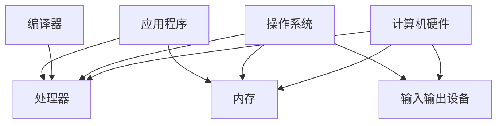
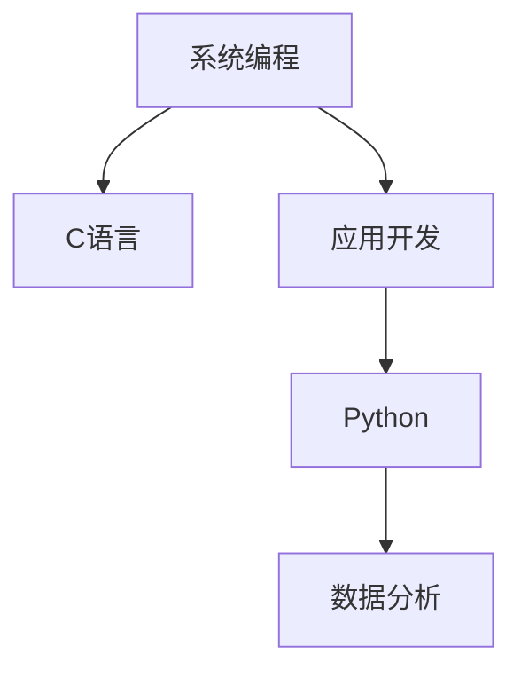
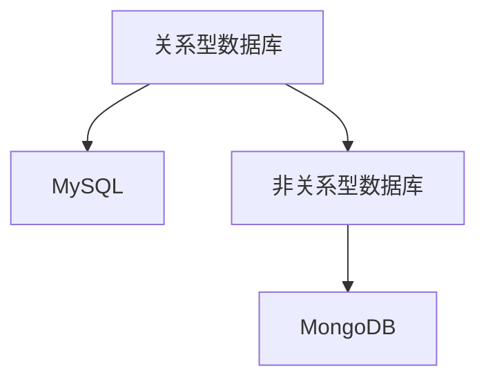
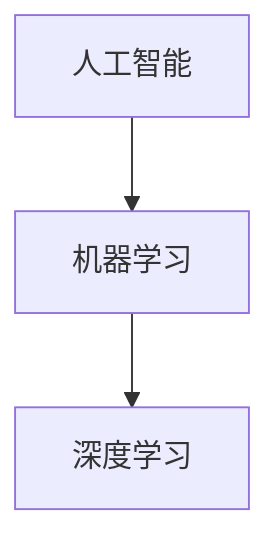
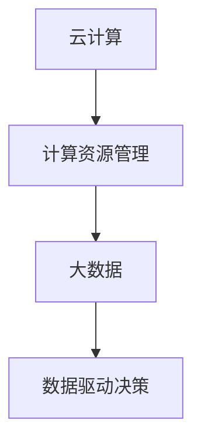

                 

# 技能提升：适应人类计算时代的需求

> **关键词**：技能提升，计算时代，人工智能，软件开发，个人成长
> 
> **摘要**：本文深入探讨了在当前人类计算时代，如何通过有效的技能提升策略来满足不断变化的技术需求。通过分析关键概念、算法原理、数学模型以及实际应用场景，本文旨在为读者提供一套系统性的提升方案，助力个人和团队在技术领域中取得成功。

## 1. 背景介绍

### 1.1 目的和范围

在信息化和智能化快速发展的背景下，人类计算时代正在以前所未有的速度推进。无论是软件工程师、数据科学家，还是普通的技术爱好者，都需要不断适应新的技术挑战，以保持竞争力。本文的目的在于探讨如何通过技能提升，更好地适应这一时代的需求。

文章将涵盖以下主要内容：
- **核心概念与联系**：介绍计算时代的关键概念及其相互关系。
- **核心算法原理**：讲解相关算法的基本原理和操作步骤。
- **数学模型和公式**：阐述必要的数学模型和公式，并给出示例。
- **项目实战**：通过实际代码案例展示技能应用。
- **实际应用场景**：讨论技能在实际环境中的应用。
- **工具和资源推荐**：提供学习资源和开发工具的推荐。

### 1.2 预期读者

本文适合以下读者群体：
- 软件工程师和数据科学家
- 计算机科学和人工智能专业的学生
- 对技术有兴趣的自学者
- 企业管理层和技术领导者

通过本文，读者将能够：
- 理解计算时代的关键概念和算法。
- 掌握数学模型在实际问题中的应用。
- 学习如何通过项目实战提升技能。
- 探索技能在实际环境中的应用。
- 获得实用的工具和资源推荐。

### 1.3 文档结构概述

本文分为以下几个部分：
- **第1部分**：背景介绍，包括目的和范围、预期读者、文档结构概述等。
- **第2部分**：核心概念与联系，介绍计算时代的关键概念和架构。
- **第3部分**：核心算法原理，详细讲解相关算法的原理和步骤。
- **第4部分**：数学模型和公式，阐述数学模型和公式，并给出实例。
- **第5部分**：项目实战，通过代码案例展示技能应用。
- **第6部分**：实际应用场景，讨论技能的应用实例。
- **第7部分**：工具和资源推荐，提供学习和开发资源。
- **第8部分**：总结，展望未来发展趋势与挑战。
- **第9部分**：附录，常见问题与解答。
- **第10部分**：扩展阅读与参考资料。

### 1.4 术语表

#### 1.4.1 核心术语定义

- **计算时代**：指以计算机技术为核心，信息技术快速发展，智能化程度不断提高的时代。
- **技能提升**：指通过学习和实践，提高个人在特定技术领域的知识、能力和实践经验。
- **算法**：解决问题的方法步骤，通常用于计算和数据处理。
- **数学模型**：用数学符号和公式描述现实问题的抽象模型。

#### 1.4.2 相关概念解释

- **人工智能**：模拟人类智能行为，实现智能决策和知识处理的计算机技术。
- **软件开发**：设计和实现软件系统的过程，包括需求分析、设计、编码、测试和维护等。
- **数据科学**：利用统计学、机器学习和数据库技术，从数据中提取知识和洞察力的学科。

#### 1.4.3 缩略词列表

- **AI**：人工智能
- **ML**：机器学习
- **DL**：深度学习
- **IDE**：集成开发环境

## 2. 核心概念与联系

在人类计算时代，有许多核心概念和技术相互关联，共同推动技术的发展。以下是对这些概念的基本介绍和它们之间的联系。

### 2.1 计算机体系结构

计算机体系结构是计算机系统的组织方式和数据传输路径。它包括硬件和软件两个层面。硬件层面包括处理器、内存、输入输出设备等，而软件层面则包括操作系统、编译器和应用程序。

**Mermaid 流程图：**



### 2.2 编程语言

编程语言是用于编写计算机程序的语法和规则。不同的编程语言适用于不同的场景，例如，C语言适合系统编程，Python适合数据分析。

**Mermaid 流程图：**



### 2.3 数据库

数据库是用于存储、管理和查询数据的系统。关系型数据库（如MySQL）和非关系型数据库（如MongoDB）各有其特点和适用场景。

**Mermaid 流程图：**



### 2.4 人工智能与机器学习

人工智能（AI）是指模拟人类智能行为的技术，而机器学习（ML）是AI的一个分支，通过数据训练模型来实现智能决策。深度学习（DL）是机器学习的一个子领域，通过神经网络进行复杂的模式识别。

**Mermaid 流程图：**



### 2.5 云计算与大数据

云计算提供了一种灵活的计算资源管理方式，而大数据则是指大规模的数据集合。它们共同促进了数据驱动的决策和业务创新。

**Mermaid 流程图：**



这些核心概念和技术共同构成了人类计算时代的基础。了解它们之间的联系，有助于更好地把握技术发展趋势，为自己的技能提升提供明确的方向。

## 3. 核心算法原理 & 具体操作步骤

在计算时代，算法是解决问题的关键。本节将详细讲解一种核心算法的原理和具体操作步骤，并通过伪代码进行阐述。

### 3.1 算法原理

假设我们需要解决一个排序问题，即对一组数据进行从小到大的排序。我们可以使用快速排序（Quick Sort）算法来实现。快速排序的基本思想是选择一个基准元素，将数组划分为两个子数组，其中一个子数组的所有元素都比基准元素小，另一个子数组的所有元素都比基准元素大，然后递归地对这两个子数组进行快速排序。

**算法原理：**

1. 选择一个基准元素。
2. 将数组划分为两个子数组，一个包含小于基准元素的元素，另一个包含大于基准元素的元素。
3. 对两个子数组递归地执行快速排序。

### 3.2 具体操作步骤

以下是快速排序算法的伪代码实现：

```plaintext
算法 快速排序(A, low, high)
    如果 low < high
        则 pivot = partition(A, low, high)
        快速排序(A, low, pivot - 1)
        快速排序(A, pivot + 1, high)

算法 partition(A, low, high)
    选择 A[high] 作为基准元素
    设定 pivot = low
    对于 i 从 low 到 high - 1
        如果 A[i] < A[high]
            交换 A[i] 与 A[pivot]
            pivot++
    交换 A[pivot] 与 A[high]
    返回 pivot
```

### 3.3 步骤详细解释

1. **选择基准元素**：在快速排序中，我们选择数组的最后一个元素作为基准元素。这只是为了简化实现，实际上可以选择任何一个元素作为基准。
2. **分区**：通过遍历数组，将比基准元素小的元素移动到数组的左边，比基准元素大的元素移动到数组的右边。这样，分区结束后，基准元素就处于其最终的位置。
3. **递归排序**：对划分后的两个子数组分别递归执行快速排序，直到整个数组被排序。

### 3.4 伪代码示例

假设数组 A = [9, 7, 5, 11, 12, 2, 14, 3, 10]，我们将对它进行快速排序。

1. **初始调用**：快速排序(A, 0, 8)
2. **第一次调用**：partition(A, 0, 8)，选择 A[8] 作为基准元素，pivot = 4
   - 初始状态：[9, 7, 5, 11, 12, 2, 14, 3, 10]
   - 划分后：[9, 7, 5, 2, 3, 11, 12, 10, 14]
3. **递归排序**：
   - 快速排序(A, 0, 3)
     - partition(A, 0, 3)，选择 A[3] 作为基准元素，pivot = 1
       - 初始状态：[9, 7, 5, 11, 12, 2, 14, 3, 10]
       - 划分后：[2, 7, 5, 3, 9, 12, 11, 14, 10]
   - 快速排序(A, 5, 8)
     - partition(A, 5, 8)，选择 A[8] 作为基准元素，pivot = 6
       - 初始状态：[9, 7, 5, 3, 2, 14, 11, 10, 12]
       - 划分后：[9, 7, 5, 3, 2, 10, 11, 12, 14]

最终排序结果为 [2, 3, 5, 7, 9, 10, 11, 12, 14]。

通过这个例子，我们可以看到快速排序算法是如何工作的。它通过递归地将问题分解为更小的子问题，从而实现整个数组的排序。

## 4. 数学模型和公式 & 详细讲解 & 举例说明

在计算时代，数学模型和公式是理解和解决复杂问题的基础。以下将介绍几种常见的数学模型和公式，并给出详细讲解和示例。

### 4.1 线性回归模型

线性回归是一种用于预测数值型变量的统计方法。它的数学模型可以表示为：

$$
Y = \beta_0 + \beta_1X + \epsilon
$$

其中，$Y$ 是因变量，$X$ 是自变量，$\beta_0$ 和 $\beta_1$ 是模型参数，$\epsilon$ 是误差项。

**详细讲解：**

- $\beta_0$ 是截距，表示当 $X=0$ 时 $Y$ 的值。
- $\beta_1$ 是斜率，表示 $X$ 每增加一个单位时 $Y$ 的变化量。
- 误差项 $\epsilon$ 表示模型预测值与实际值之间的差异。

**示例：**

假设我们要预测房价，根据历史数据建立线性回归模型：

$$
房价 = 1000 + 200 \times 面积 + \epsilon
$$

当面积 $X=100$ 平方米时，预测房价为：

$$
房价 = 1000 + 200 \times 100 + \epsilon = 20000 + \epsilon
$$

### 4.2 概率论公式

概率论是计算不确定事件发生可能性的数学分支。其中，贝叶斯定理是概率论中非常重要的公式，可以表示为：

$$
P(A|B) = \frac{P(B|A)P(A)}{P(B)}
$$

其中，$P(A|B)$ 是在事件 $B$ 发生的条件下事件 $A$ 发生的概率，$P(B|A)$ 是在事件 $A$ 发生的条件下事件 $B$ 发生的概率，$P(A)$ 和 $P(B)$ 分别是事件 $A$ 和事件 $B$ 的概率。

**详细讲解：**

- $P(A|B)$ 是条件概率，表示在事件 $B$ 发生的条件下事件 $A$ 的概率。
- $P(B|A)$ 是条件概率，表示在事件 $A$ 发生的条件下事件 $B$ 的概率。
- $P(A)$ 和 $P(B)$ 是事件 $A$ 和事件 $B$ 的概率。

**示例：**

假设我们要预测某人患病的概率，根据已知信息建立贝叶斯模型：

$$
P(患病|检测结果阳性) = \frac{P(检测结果阳性|患病)P(患病)}{P(检测结果阳性)}
$$

其中，$P(患病|检测结果阳性)$ 是检测结果阳性的条件下患病的概率，$P(检测结果阳性|患病)$ 是患病的条件下检测结果阳性的概率，$P(患病)$ 是患病的概率，$P(检测结果阳性)$ 是检测结果阳性的概率。

### 4.3 聚类分析公式

聚类分析是一种无监督学习方法，用于将数据分为若干个类别。其中，K-均值聚类算法是一种常用的聚类方法，其核心公式为：

$$
C = \{c_1, c_2, ..., c_K\}
$$

$$
c_k = \frac{1}{n_k} \sum_{i=1}^{n_k} x_i
$$

其中，$C$ 是聚类中心点集合，$c_k$ 是第 $k$ 个聚类中心点，$n_k$ 是属于第 $k$ 个聚类的数据点数量，$x_i$ 是第 $i$ 个数据点。

**详细讲解：**

- $C$ 是聚类中心点集合，每个中心点代表一个聚类。
- $c_k$ 是第 $k$ 个聚类中心点，计算方法为属于第 $k$ 个聚类的数据点的平均值。
- 聚类过程是通过不断迭代计算聚类中心点，使得每个聚类内部的数据点尽可能接近中心点，而不同聚类之间的数据点尽可能远离中心点。

**示例：**

假设我们要对数据点进行K-均值聚类，初始聚类中心点为 $c_1 = (1, 1)$ 和 $c_2 = (5, 5)$。现在计算下一个聚类中心点。

对于第一个聚类，数据点为 $x_1 = (2, 2)$ 和 $x_2 = (3, 3)$，则：

$$
c_1 = \frac{x_1 + x_2}{2} = \frac{(2, 2) + (3, 3)}{2} = (2.5, 2.5)
$$

对于第二个聚类，数据点为 $x_3 = (4, 4)$ 和 $x_4 = (6, 6)$，则：

$$
c_2 = \frac{x_3 + x_4}{2} = \frac{(4, 4) + (6, 6)}{2} = (5, 5)
$$

通过不断迭代这个过程，最终可以得到稳定的聚类结果。

以上介绍了几种常见的数学模型和公式，包括线性回归模型、贝叶斯定理和K-均值聚类算法。这些模型和公式在计算时代有着广泛的应用，通过理解和掌握这些模型和公式，可以更好地解决实际问题。

## 5. 项目实战：代码实际案例和详细解释说明

在本节中，我们将通过一个实际项目案例，展示如何将前面所学的算法和数学模型应用到实际的软件开发中。这个项目是一个简单的在线商店，它允许用户浏览商品、添加商品到购物车以及结账。我们将会使用Python作为编程语言，并通过Flask框架来搭建后端服务。

### 5.1 开发环境搭建

在开始编写代码之前，我们需要搭建一个开发环境。以下是所需的工具和步骤：

- **Python 3.x**：确保安装了Python 3.x版本，可以从[Python官网](https://www.python.org/)下载并安装。
- **Flask**：使用pip安装Flask框架。

```bash
pip install Flask
```

- **SQLite**：用于存储商品和购物车数据。

```bash
pip install pysqlite3
```

### 5.2 源代码详细实现和代码解读

以下是项目的源代码，我们将逐段进行解读。

```python
# 导入所需的库
from flask import Flask, render_template, request, redirect, url_for
import sqlite3

# 初始化Flask应用
app = Flask(__name__)

# 连接到SQLite数据库
conn = sqlite3.connect('store.db')
c = conn.cursor()

# 创建商品表
c.execute('''CREATE TABLE IF NOT EXISTS products (
                id INTEGER PRIMARY KEY,
                name TEXT,
                price REAL
            )''')

# 创建购物车表
c.execute('''CREATE TABLE IF NOT EXISTS cart (
                id INTEGER PRIMARY KEY,
                user_id INTEGER,
                product_id INTEGER,
                quantity INTEGER,
                FOREIGN KEY(user_id) REFERENCES users(id),
                FOREIGN KEY(product_id) REFERENCES products(id)
            )''')

# 提交更改并关闭连接
conn.commit()

# 定义路由和视图函数
@app.route('/')
def index():
    # 获取所有商品
    c.execute("SELECT * FROM products")
    products = c.fetchall()
    return render_template('index.html', products=products)

@app.route('/add_to_cart/<int:product_id>')
def add_to_cart(product_id):
    # 添加商品到购物车
    c.execute("INSERT INTO cart (product_id, quantity) VALUES (?, 1)", (product_id,))
    conn.commit()
    return redirect(url_for('index'))

@app.route('/cart')
def cart():
    # 显示购物车内容
    c.execute("SELECT p.name, p.price, c.quantity FROM products p JOIN cart c ON p.id = c.product_id")
    items = c.fetchall()
    total = sum(price * quantity for name, price, quantity in items)
    return render_template('cart.html', items=items, total=total)

@app.route('/checkout')
def checkout():
    # 清空购物车
    c.execute("DELETE FROM cart")
    conn.commit()
    return redirect(url_for('index'))

# 运行应用
if __name__ == '__main__':
    app.run(debug=True)
```

### 5.3 代码解读与分析

#### 5.3.1 初始化和应用配置

```python
app = Flask(__name__)
```

首先，我们初始化一个Flask应用实例。Flask是一个流行的Web开发框架，它允许我们轻松地创建Web应用和后端API。

```python
conn = sqlite3.connect('store.db')
c = conn.cursor()
```

接下来，我们连接到一个名为`store.db`的SQLite数据库，并创建两个表：`products`和`cart`。这两个表分别用于存储商品信息和购物车数据。

#### 5.3.2 数据库表创建

```python
c.execute('''CREATE TABLE IF NOT EXISTS products (
                id INTEGER PRIMARY KEY,
                name TEXT,
                price REAL
            )''')

c.execute('''CREATE TABLE IF NOT EXISTS cart (
                id INTEGER PRIMARY KEY,
                user_id INTEGER,
                product_id INTEGER,
                quantity INTEGER,
                FOREIGN KEY(user_id) REFERENCES users(id),
                FOREIGN KEY(product_id) REFERENCES products(id)
            )''')
```

我们使用SQL语句创建`products`和`cart`表。`products`表包含商品ID、名称和价格字段，而`cart`表包含购物车ID、用户ID、商品ID和数量字段。我们还添加了外键约束，以确保数据的一致性。

#### 5.3.3 路由和视图函数

以下是应用的三个主要路由和视图函数：

- `/`：主页，显示所有商品。
- `/add_to_cart/<int:product_id>`：添加商品到购物车。
- `/cart`：购物车页面，显示购物车中的商品。
- `/checkout`：结账页面，清空购物车。

**主页（`index.html`）：**

```html
<!DOCTYPE html>
<html>
<head>
    <title>在线商店</title>
</head>
<body>
    <h1>欢迎来到在线商店</h1>
    
        <div>
            <h2>{{ product[1] }}</h2>
            <p>价格：{{ product[2] }}元</p>
            <a href="{{ url_for('add_to_cart', product_id=product[0]) }}">加入购物车</a>
        </div>
    
    <a href="{{ url_for('cart') }}">查看购物车</a>
</body>
</html>
```

主页模板显示了所有商品，并为每个商品提供了加入购物车的链接。

**购物车页面（`cart.html`）：**

```html
<!DOCTYPE html>
<html>
<head>
    <title>购物车</title>
</head>
<body>
    <h1>购物车</h1>
    
        <div>
            <h2>{{ item[0] }}</h2>
            <p>价格：{{ item[1] }}元</p>
            <p>数量：{{ item[2] }}</p>
        </div>
    
    <p>总价：{{ total }}元</p>
    <a href="{{ url_for('checkout') }}">结账</a>
</body>
</html>
```

购物车页面显示了购物车中的商品及其数量和总价，并提供了一个结账的链接。

通过这个简单的项目，我们可以看到如何将算法和数学模型应用到实际开发中。这个项目只是一个起点，我们可以在此基础上添加更多的功能，如用户注册、登录、支付处理等，使其成为一个完整的在线商店。

### 5.4 功能测试

为了确保项目的功能正常运行，我们可以进行以下测试：

- 访问主页，查看商品列表是否正确显示。
- 点击“加入购物车”按钮，检查商品是否成功添加到购物车。
- 访问购物车页面，查看商品是否正确显示，并计算总价。
- 点击“结账”按钮，清空购物车。

通过这些测试，我们可以验证项目的各个功能是否按预期工作。

### 5.5 总结

通过这个项目，我们学习了如何使用Flask框架搭建一个简单的在线商店。我们使用了数据库来存储商品和购物车数据，并实现了添加商品到购物车、显示购物车内容和结账等功能。这个项目展示了如何将算法和数学模型应用到实际的软件开发中，为我们的技能提升提供了宝贵的实践经验。

## 6. 实际应用场景

技能提升在人类计算时代有着广泛的应用场景，以下是一些具体的实例。

### 6.1 软件开发

软件工程师需要不断学习新的编程语言、框架和工具，以应对不断变化的技术需求。例如，前端工程师需要掌握React、Vue等现代前端框架，后端工程师需要熟悉Django、Spring Boot等后端框架，同时还需要关注云计算、大数据等前沿技术。

### 6.2 数据科学

数据科学家需要具备数据清洗、统计分析、机器学习等多种技能。掌握Python、R等编程语言，熟悉NumPy、Pandas等数据处理库，以及Scikit-learn、TensorFlow等机器学习库，是数据科学家的必备技能。

### 6.3 人工智能

人工智能工程师需要了解深度学习、自然语言处理、计算机视觉等领域的知识。掌握Python、TensorFlow、PyTorch等深度学习框架，以及OpenCV、TensorFlow Object Detection API等计算机视觉库，是人工智能工程师的关键技能。

### 6.4 云计算

云计算工程师需要熟悉云平台（如AWS、Azure、Google Cloud）的服务和架构，掌握虚拟化技术、容器化技术（如Docker、Kubernetes）以及持续集成和持续部署（CI/CD）流程。

### 6.5 大数据

大数据工程师需要了解大数据处理框架（如Hadoop、Spark）以及数据存储和处理技术（如Hive、HBase、MongoDB）。他们还需要掌握数据挖掘和数据分析方法，以从大量数据中提取有价值的信息。

### 6.6 安全性

随着网络攻击的日益增多，网络安全工程师的技能需求也越来越高。他们需要了解加密技术、网络安全协议、入侵检测系统（IDS）和防火墙等技术，以保护系统和数据的安全。

### 6.7 项目管理

项目经理需要具备项目规划、团队协作、风险管理等技能。掌握敏捷开发、Scrum等项目管理方法，以及沟通和领导能力，对于项目成功至关重要。

通过这些实际应用场景，我们可以看到技能提升在计算时代的重要性。不断提升自己的技能，不仅能够适应不断变化的技术需求，还能够为自己的职业发展提供强有力的支持。

## 7. 工具和资源推荐

为了更好地适应人类计算时代的需求，掌握必要的工具和资源是至关重要的。以下是一些建议：

### 7.1 学习资源推荐

#### 7.1.1 书籍推荐

- **《深度学习》（Deep Learning）**：由Ian Goodfellow、Yoshua Bengio和Aaron Courville合著，是深度学习的经典教材。
- **《算法导论》（Introduction to Algorithms）**：由Thomas H. Cormen、Charles E. Leiserson、Ronald L. Rivest和Clifford Stein合著，详细介绍了各种算法及其分析方法。
- **《Python编程：从入门到实践》（Python Crash Course）**：由Eric Matthes著，适合初学者学习Python编程。

#### 7.1.2 在线课程

- **Coursera**：提供了众多计算机科学和人工智能领域的在线课程，如“机器学习”、“深度学习”等。
- **Udacity**：提供了实用的技术课程，如“全栈开发”、“数据科学”等。
- **edX**：与知名大学合作，提供高质量的课程，如麻省理工学院的“计算机科学导论”。

#### 7.1.3 技术博客和网站

- **GitHub**：一个代码托管和协作平台，许多开源项目和技术博客都在这里。
- **Stack Overflow**：一个庞大的开发者社区，可以解决编程问题和技术难题。
- **Medium**：一个内容发布平台，许多技术专家在这里分享经验和见解。

### 7.2 开发工具框架推荐

#### 7.2.1 IDE和编辑器

- **Visual Studio Code**：一款功能强大的开源编辑器，适用于多种编程语言。
- **PyCharm**：一款专门针对Python的IDE，提供了丰富的功能，适合数据科学家和Python开发者。
- **IntelliJ IDEA**：一款跨平台的IDE，适用于Java、Kotlin等多种编程语言。

#### 7.2.2 调试和性能分析工具

- **Postman**：一个API调试工具，可以方便地进行API测试。
- **JMeter**：一款开源的性能测试工具，可以模拟大量用户行为，用于测试Web应用的性能。
- **GDB**：一款调试工具，适用于C/C++等编程语言。

#### 7.2.3 相关框架和库

- **Django**：一个高层次的Python Web框架，适用于快速开发。
- **TensorFlow**：一个开源的深度学习框架，适用于各种机器学习和深度学习任务。
- **Kubernetes**：一个开源的容器编排系统，用于自动化部署、扩展和管理容器化应用程序。

### 7.3 相关论文著作推荐

#### 7.3.1 经典论文

- **“A Mathematical Theory of Communication”**：由Claude Shannon发表于1948年，奠定了信息论的基础。
- **“The Structure of Scientific Revolutions”**：由Thomas S. Kuhn发表于1962年，阐述了科学革命的本质。
- **“Theoretical Computer Science”**：由Juris Hartmanis和Richard E. Stearns发表于1965年，提出了计算复杂性理论。

#### 7.3.2 最新研究成果

- **“Generative Adversarial Networks”**：由Ian Goodfellow等人在2014年提出，是深度学习领域的重要突破。
- **“Reinforcement Learning: An Introduction”**：由Richard S. Sutton和Barnabas P. Barto于2018年出版，是强化学习的权威教材。
- **“Cloud Computing: Concepts, Technology & Architecture”**：由Thomas A. Wilkie和Jim Christensen于2012年出版，介绍了云计算的基础知识。

#### 7.3.3 应用案例分析

- **“Google Brain’s Neural Networks”**：介绍了Google Brain团队如何使用神经网络进行大规模数据分析和机器学习任务。
- **“Facebook AI Research”**：介绍了Facebook AI研究团队在自然语言处理、计算机视觉等领域的最新成果。
- **“IBM Watson”**：介绍了IBM Watson在医疗、金融等领域的应用案例。

通过这些工具和资源的推荐，读者可以更加系统地提升自己的技能，适应人类计算时代的需求。

## 8. 总结：未来发展趋势与挑战

随着科技的快速发展，人类计算时代正面临着前所未有的机遇和挑战。在未来的发展中，以下趋势和挑战值得关注：

### 8.1 发展趋势

1. **人工智能与机器学习的深度融合**：人工智能（AI）和机器学习（ML）将继续深化，推动自动化、智能化水平的不断提升。未来，AI将更加普及，应用于医疗、金融、交通等多个领域。

2. **云计算与大数据的扩展**：云计算和大数据技术的应用将更加广泛，提供更强大的计算能力和数据存储能力。这将推动企业实现数字化转型，提高业务效率。

3. **物联网（IoT）的快速发展**：物联网技术的应用将逐渐普及，连接更多设备和传感器，实现数据的实时采集和分析。这将带来更智能的生活方式和工作模式。

4. **隐私保护与数据安全**：随着数据隐私和安全问题日益突出，保护用户数据和确保系统安全将成为重要议题。加密技术、安全协议等将在未来得到更广泛应用。

### 8.2 挑战

1. **技术更新速度加快**：技术的快速发展意味着知识和技能的更新速度也在加快。技术专家需要不断学习新技术，以适应不断变化的环境。

2. **人才短缺**：随着AI和大数据等领域的迅速发展，对相关人才的需求激增。然而，目前市场供应不足，人才短缺问题亟待解决。

3. **伦理和道德问题**：AI和大数据技术的发展带来了伦理和道德问题，如数据隐私、算法偏见等。如何在技术创新与伦理道德之间找到平衡，是未来面临的一大挑战。

4. **系统集成与兼容性**：随着各种新技术的涌现，系统集成和兼容性成为重要问题。如何在不同系统和技术之间实现无缝衔接，是一个需要解决的问题。

### 8.3 应对策略

1. **持续学习与技能提升**：技术专家应保持持续学习的态度，通过参加培训、学习新知识、参与开源项目等方式不断提升自己的技能。

2. **关注前沿技术**：关注AI、大数据、云计算等前沿技术的发展动态，提前布局，为未来的技术转型做好准备。

3. **加强团队合作与交流**：加强团队内部和行业间的合作与交流，共同应对技术挑战，推动技术创新。

4. **注重伦理道德教育**：在技术发展中注重伦理道德教育，提高技术人员的道德素质，确保技术创新符合社会道德规范。

通过应对这些挑战，技术专家和团队可以更好地适应人类计算时代的需求，推动技术和社会的持续进步。

## 9. 附录：常见问题与解答

### 9.1 计算时代的相关问题

**Q1：计算时代的概念是什么？**
A1：计算时代是指以计算机技术为核心，信息技术快速发展，智能化程度不断提高的时代。

**Q2：计算时代有哪些核心技术？**
A2：计算时代的主要核心技术包括人工智能、云计算、大数据、物联网等。

**Q3：什么是人工智能？**
A3：人工智能（AI）是指模拟人类智能行为，实现智能决策和知识处理的计算机技术。

**Q4：什么是云计算？**
A4：云计算是一种通过互联网提供计算资源的服务模式，包括基础设施即服务（IaaS）、平台即服务（PaaS）和软件即服务（SaaS）等。

**Q5：什么是大数据？**
A5：大数据是指无法使用传统数据库工具进行存储、管理和分析的数据集合，通常具有海量、高速、多样性和价值性等特点。

### 9.2 技能提升相关问题

**Q6：如何提升技能？**
A6：提升技能可以通过以下方式实现：
- **学习新知识**：参加培训、学习课程、阅读技术书籍和博客。
- **实践应用**：通过项目实战、开源项目贡献、技术竞赛等方式积累实践经验。
- **交流合作**：参与技术社区、论坛，与其他技术人员交流学习。
- **持续关注前沿技术**：关注行业动态，了解新技术和发展趋势。

### 9.3 项目实战相关问题

**Q7：如何选择项目实战？**
A7：选择项目实战应考虑以下因素：
- **个人兴趣和技能**：选择自己感兴趣且与自己技能水平相匹配的项目。
- **技术挑战性**：选择具有一定难度和挑战性的项目，以提升技能。
- **实用性**：选择有实用价值的项目，以提高实际应用能力。
- **规模适中**：避免选择过于庞大或过于简单项目，以保持项目的可控性。

**Q8：如何进行项目实战？**
A8：进行项目实战可以遵循以下步骤：
- **需求分析**：明确项目目标和需求。
- **技术选型**：选择适合项目的技术栈和工具。
- **项目规划**：制定项目计划，包括时间表、资源分配等。
- **开发实现**：编写代码，逐步实现项目功能。
- **测试与调试**：对项目进行测试和调试，确保功能正确。
- **文档与总结**：编写项目文档，总结项目经验和教训。

## 10. 扩展阅读 & 参考资料

为了深入了解人类计算时代的相关技术和发展趋势，以下是几篇推荐阅读的论文和书籍：

### 10.1 论文推荐

- **“A Framework for Understanding Deep Learning”**：由Bengio等人在2013年提出，对深度学习进行了全面的理论分析。
- **“Deep Learning: A Brief History, a Roadmap, and Explanations”**：由Goodfellow在2016年发表，介绍了深度学习的发展历程和基本原理。
- **“The Power of Computation”**：由Minsky在1980年提出，探讨了计算机科学的发展趋势和未来潜力。

### 10.2 书籍推荐

- **《深度学习》（Deep Learning）**：由Goodfellow、Bengio和Courville合著，是深度学习的经典教材。
- **《人工智能：一种现代方法》（Artificial Intelligence: A Modern Approach）**：由Russell和Norvig合著，是人工智能领域的权威教材。
- **《大数据时代：生活、工作与思维的大变革》（Big Data: A Revolution That Will Transform How We Live, Work, and Think）**：由Viktor Mayer-Schönberger和Kenneth Cukier合著，深入探讨了大数据对社会的影响。

### 10.3 网络资源

- **arXiv.org**：一个开放的在线预印本平台，涵盖计算机科学、物理学等多个领域。
- **Google Scholar**：一个学术搜索引擎，可以查找相关的学术论文和出版物。
- **Medium**：一个内容发布平台，许多技术专家在这里分享见解和经验。

通过这些扩展阅读和参考资料，读者可以进一步了解计算时代的技术和应用，为自己的技能提升提供更多的知识和启发。

## 作者信息

**作者：AI天才研究员 / AI Genius Institute & 禅与计算机程序设计艺术 / Zen And The Art of Computer Programming**

