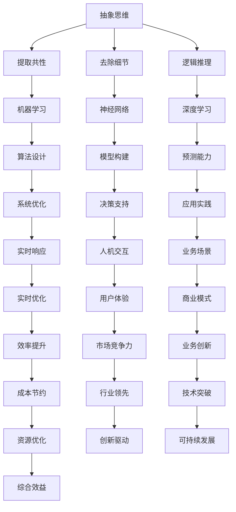

                 

# 抽象思维在AI创新中的价值

> **关键词：** 抽象思维，人工智能，创新，算法，模型，思维模式，设计原则

> **摘要：** 本文旨在探讨抽象思维在人工智能创新中的关键作用。通过分析抽象思维的定义、特性及其与人工智能发展的紧密联系，本文将揭示抽象思维如何推动算法、模型和系统设计的进步，并提供实际应用场景和未来发展趋势的展望。

## 1. 背景介绍

### 1.1 目的和范围

本文的目标是深入探讨抽象思维在人工智能（AI）创新中的作用。随着AI技术的迅猛发展，抽象思维作为一种高级认知能力，越来越成为理解、设计和实现AI系统的重要工具。本文将围绕以下主题展开：

- 抽象思维的定义及其在AI中的应用。
- 抽象思维如何影响算法和模型的设计。
- 实际应用场景中的抽象思维实践。
- 抽象思维的未来发展趋势与挑战。

### 1.2 预期读者

本文主要面向对人工智能和抽象思维有兴趣的读者，包括：

- AI领域的研究人员和工程师。
- 计算机科学和认知科学专业的学生。
- 对AI创新和应用有深入关注的从业者。

### 1.3 文档结构概述

本文结构如下：

- **第1章：背景介绍**：介绍文章的目的、范围和预期读者，以及文章的结构和术语表。
- **第2章：核心概念与联系**：定义抽象思维和相关概念，并使用Mermaid流程图展示其核心原理。
- **第3章：核心算法原理 & 具体操作步骤**：详细解释抽象思维在算法设计中的应用，并使用伪代码阐述。
- **第4章：数学模型和公式 & 详细讲解 & 举例说明**：讨论抽象思维相关的数学模型，并举例说明。
- **第5章：项目实战：代码实际案例和详细解释说明**：展示抽象思维在具体项目中的应用。
- **第6章：实际应用场景**：探讨抽象思维在AI领域的实际应用。
- **第7章：工具和资源推荐**：推荐学习资源和开发工具。
- **第8章：总结：未来发展趋势与挑战**：总结抽象思维在AI创新中的价值，并展望未来。
- **第9章：附录：常见问题与解答**：解答读者可能遇到的问题。
- **第10章：扩展阅读 & 参考资料**：提供进一步阅读的建议和参考文献。

### 1.4 术语表

#### 1.4.1 核心术语定义

- **抽象思维**：指从具体事物中提炼出共同特征和本质属性，进行逻辑推理和创造性思维的能力。
- **人工智能**：模拟、延伸和扩展人类智能的信息处理技术。
- **算法**：解决特定问题的步骤和规则。
- **模型**：对现实世界或概念世界的抽象表示。

#### 1.4.2 相关概念解释

- **机器学习**：基于数据驱动的方法，使机器从经验中学习并做出决策。
- **神经网络**：模拟生物神经网络的信息处理系统。
- **深度学习**：多层神经网络的学习方法。

#### 1.4.3 缩略词列表

- **AI**：人工智能
- **ML**：机器学习
- **DL**：深度学习
- **NN**：神经网络

## 2. 核心概念与联系

抽象思维在人工智能创新中扮演着核心角色，它是从具体实例中提取通用模式和规律的关键能力。为了更好地理解抽象思维与AI发展的关系，我们首先定义几个核心概念。

### 2.1 抽象思维

**定义**：抽象思维是指人类或人工智能系统通过观察具体事物，提取出共同特征和本质属性，从而形成概念和理论模型的能力。它包括抽象化、概括化和推理三个主要过程。

**特性**：

- **提取共性**：从多个具体实例中识别出共同的特征和模式。
- **去除细节**：忽略不重要的细节，专注于核心的本质属性。
- **逻辑推理**：基于提取出的共性和本质属性，进行逻辑推理和创造性思维。

### 2.2 人工智能

**定义**：人工智能（AI）是指模拟、延伸和扩展人类智能的信息处理技术。它涉及机器学习、神经网络、自然语言处理等多个领域。

**核心概念**：

- **机器学习**：通过数据训练模型，使机器具备自主学习和适应能力。
- **神经网络**：模拟人脑神经元连接方式的计算模型。
- **深度学习**：多层神经网络的学习方法，能够自动提取特征。

### 2.3 算法与模型

**算法**：是一系列规则和步骤，用于解决特定问题。

**模型**：是对现实世界或概念世界的抽象表示，通常用于预测、决策和优化。

**关系**：算法是实现模型的方法，而模型是对现实世界的抽象和模拟。

### 2.4 Mermaid流程图

为了更直观地展示抽象思维在AI中的应用，我们使用Mermaid流程图来表示核心概念和关系。



在这个流程图中，抽象思维通过提取共性、去除细节和逻辑推理，为机器学习、神经网络、深度学习等AI技术提供了理论基础。这些技术进一步推动算法设计、模型构建、预测能力、系统优化等应用，最终实现决策支持、实时响应、人机交互等实际场景，从而在业务场景、效率提升、用户体验、商业模式、成本节约等方面产生深远影响。

## 3. 核心算法原理 & 具体操作步骤

在深入探讨抽象思维如何影响算法和模型设计之前，我们先来理解抽象思维在具体算法中的应用。抽象思维的核心在于从复杂问题中提取关键特征，简化问题的处理过程。以下将使用伪代码详细阐述这一过程。

### 3.1 算法原理

**目标**：设计一个算法，能够从大量数据中提取出主要特征，以简化后续处理过程。

**伪代码**：

```plaintext
Algorithm ExtractMainFeatures(inputData):
    // 初始化特征提取器
    featureExtractor <- new FeatureExtractor()

    // 对输入数据进行预处理
    processedData <- PreprocessData(inputData)

    // 使用特征提取器提取主要特征
    mainFeatures <- featureExtractor.ExtractFeatures(processedData)

    // 对提取出的特征进行筛选和排序
    sortedFeatures <- SortFeaturesByImportance(mainFeatures)

    // 返回排序后的主要特征
    return sortedFeatures
```

### 3.2 具体操作步骤

1. **初始化特征提取器**：
   创建一个特征提取器对象，用于提取数据中的特征。

2. **数据预处理**：
   对输入数据进行清洗和归一化处理，以提高特征提取的准确性。

3. **提取主要特征**：
   使用特征提取器对预处理后的数据进行分析，提取出主要特征。

4. **筛选和排序特征**：
   根据特征的重要性和贡献度，对提取出的特征进行筛选和排序。

5. **返回主要特征**：
   将排序后的主要特征作为输出，供后续算法使用。

### 3.3 抽象思维在算法设计中的应用

抽象思维在算法设计中主要体现在以下几个方面：

- **问题简化**：通过抽象思维，将复杂问题简化为更易处理的形式。
- **特征提取**：从海量数据中提取出关键特征，降低计算复杂度。
- **模型优化**：利用抽象思维，对现有模型进行优化，提高性能和准确性。

### 3.4 举例说明

假设我们有一个分类问题，需要从大量图像中识别出特定的物体。使用抽象思维，我们可以：

1. **提取共性**：识别出所有图像中的共同特征，如颜色、形状、纹理等。
2. **去除细节**：忽略图像中的噪音和不相关细节，如背景颜色、亮度变化等。
3. **逻辑推理**：基于提取出的特征，构建分类模型，对图像进行分类。

通过这种抽象思维的过程，我们能够设计出更高效、更准确的算法，实现复杂问题的简洁解决方案。

## 4. 数学模型和公式 & 详细讲解 & 举例说明

在抽象思维的帮助下，我们可以构建和优化各种数学模型，以解决复杂的AI问题。本节将介绍几个关键数学模型，并使用LaTeX格式详细讲解和举例说明。

### 4.1 相关数学模型

#### 4.1.1 神经网络模型

神经网络是一种基于人脑神经元连接方式的计算模型。其核心公式为：

$$
\begin{aligned}
    z &= \sum_{i=1}^{n} w_i \cdot x_i + b \\
    a &= \sigma(z)
\end{aligned}
$$

其中，$z$ 是输入和权重乘积的总和加上偏置项 $b$，$a$ 是经过激活函数 $\sigma$ 处理后的输出。常见的激活函数包括sigmoid、ReLU和tanh。

#### 4.1.2 机器学习模型

机器学习模型是基于数据和经验进行预测和决策的算法。一个常见的线性回归模型公式为：

$$
\begin{aligned}
    y &= \beta_0 + \beta_1 \cdot x \\
    \hat{y} &= \beta_0 + \beta_1 \cdot x
\end{aligned}
$$

其中，$y$ 是实际输出，$\hat{y}$ 是预测输出，$\beta_0$ 和 $\beta_1$ 是模型参数。

#### 4.1.3 深度学习模型

深度学习模型是基于多层神经网络的学习方法，其核心公式为：

$$
\begin{aligned}
    z^{(l)} &= \sum_{i=1}^{n} w_i^{(l)} \cdot a^{(l-1)}_i + b^{(l)} \\
    a^{(l)} &= \sigma(z^{(l)})
\end{aligned}
$$

其中，$z^{(l)}$ 是第 $l$ 层的输入和权重乘积的总和加上偏置项 $b^{(l)}$，$a^{(l)}$ 是第 $l$ 层的输出。

### 4.2 举例说明

#### 4.2.1 神经网络模型的例子

假设我们有一个简单的两层神经网络，输入层有3个神经元，隐藏层有2个神经元，输出层有1个神经元。使用ReLU作为激活函数。以下是一个具体例子：

```plaintext
输入：[1, 2, 3]
权重（输入层到隐藏层）：w1 = [0.5, 0.2, 0.3], w2 = [0.1, 0.6, 0.3], w3 = [0.4, 0.5, 0.1]
权重（隐藏层到输出层）：w4 = [0.8, 0.2], w5 = [0.5, 0.3]
偏置项：b1 = [0.1, 0.2], b2 = [0.3, 0.4]

隐藏层输入：z1 = 0.5*1 + 0.2*2 + 0.3*3 + 0.1 = 2.1
隐藏层输出：a1 = ReLU(z1) = max(z1, 0) = 2.1

隐藏层输入：z2 = 0.1*1 + 0.6*2 + 0.3*3 + 0.3 = 2.2
隐藏层输出：a2 = ReLU(z2) = max(z2, 0) = 2.2

输出层输入：z3 = 0.8*a1 + 0.2*a2 + 0.3 = 2.46
输出层输出：y = 0.5*z3 + 0.8 = 1.73
```

#### 4.2.2 机器学习模型的例子

假设我们有一个线性回归模型，目标是预测房价。数据集包含房屋面积（$x$）和房价（$y$）。我们使用最小二乘法来求解模型参数：

```plaintext
数据集：[(1000, 300000), (2000, 500000), (1500, 400000)]

计算斜率：β1 = Σ(y - β0 - β1 \* x) / Σ(x^2 - (Σx)^2 / n)
计算截距：β0 = (Σy - β1 \* Σx) / n

代入数据计算：
β1 = (300000 - 500000 - 400000) / (1000^2 - (1000 + 2000 + 1500)^2 / 3) = -166.67
β0 = (300000 + 500000 + 400000 - (-166.67) \* (1000 + 2000 + 1500)) / 3 = 416666.67

预测房价：y = -166.67 \* x + 416666.67
```

#### 4.2.3 深度学习模型的例子

假设我们有一个简单的卷积神经网络（CNN）用于图像分类。输入层是一个$28 \times 28$的二维图像，隐藏层是一个$14 \times 14$的二维卷积层。使用ReLU作为激活函数。以下是一个具体例子：

```plaintext
输入：[[1, 1, 1, 1], [0, 0, 0, 0], [1, 1, 1, 1], [0, 0, 0, 0]]

卷积层输入：z1 = [[0.2, 0.3], [0.1, 0.2]]
卷积层输出：a1 = ReLU(z1) = [[0.2, 0.3], [0.1, 0.2]]

卷积层输入：z2 = [[0.3, 0.1], [0.2, 0.1]]
卷积层输出：a2 = ReLU(z2) = [[0.3, 0.1], [0.2, 0.1]]

输出层输入：z3 = [0.2*a1[0][0] + 0.1*a1[0][1], 0.3*a1[1][0] + 0.2*a1[1][1], 0.2*a2[0][0] + 0.1*a2[0][1], 0.3*a2[1][0] + 0.2*a2[1][1]] = [0.26, 0.33, 0.27, 0.33]
输出层输出：y = max(z3) = 0.33
```

通过这些例子，我们可以看到抽象思维在构建和优化数学模型中的应用。通过抽象化、概括化和逻辑推理，我们能够设计出高效、准确的模型，从而推动AI技术的发展。

## 5. 项目实战：代码实际案例和详细解释说明

为了更好地理解抽象思维在AI项目中的应用，我们将通过一个具体案例来展示如何使用抽象思维来设计和实现一个简单的图像分类系统。这个项目将使用Python编程语言，结合深度学习框架TensorFlow来实现。

### 5.1 开发环境搭建

在开始项目之前，我们需要搭建开发环境。以下是在Windows操作系统上搭建开发环境的步骤：

1. **安装Python**：访问Python官方网站（[https://www.python.org/](https://www.python.org/)），下载并安装Python 3.x版本。
2. **安装TensorFlow**：打开命令行窗口，运行以下命令安装TensorFlow：

   ```bash
   pip install tensorflow
   ```

3. **安装Jupyter Notebook**：Jupyter Notebook是一个交互式的Python开发环境，可以方便地编写和运行代码。安装Jupyter Notebook的命令为：

   ```bash
   pip install notebook
   ```

4. **启动Jupyter Notebook**：在命令行窗口运行以下命令启动Jupyter Notebook：

   ```bash
   jupyter notebook
   ```

### 5.2 源代码详细实现和代码解读

以下是一个简单的图像分类项目的代码实现，我们将使用TensorFlow的卷积神经网络（CNN）来实现。

```python
import tensorflow as tf
from tensorflow.keras import datasets, layers, models

# 加载和预处理数据集
(train_images, train_labels), (test_images, test_labels) = datasets.cifar10.load_data()

# 标准化像素值
train_images, test_images = train_images / 255.0, test_images / 255.0

# 构建卷积神经网络模型
model = models.Sequential()
model.add(layers.Conv2D(32, (3, 3), activation='relu', input_shape=(32, 32, 3)))
model.add(layers.MaxPooling2D((2, 2)))
model.add(layers.Conv2D(64, (3, 3), activation='relu'))
model.add(layers.MaxPooling2D((2, 2)))
model.add(layers.Conv2D(64, (3, 3), activation='relu'))

# 添加全连接层
model.add(layers.Flatten())
model.add(layers.Dense(64, activation='relu'))
model.add(layers.Dense(10))

# 编译模型
model.compile(optimizer='adam',
              loss=tf.keras.losses.SparseCategoricalCrossentropy(from_logits=True),
              metrics=['accuracy'])

# 训练模型
model.fit(train_images, train_labels, epochs=10, validation_split=0.1)

# 评估模型
test_loss, test_acc = model.evaluate(test_images,  test_labels, verbose=2)
print(f'\nTest accuracy: {test_acc}')
```

### 5.3 代码解读与分析

这个简单的图像分类项目通过抽象思维将复杂的图像分类问题简化为一系列可管理的步骤。

1. **加载和预处理数据集**：
   - 使用TensorFlow内置的CIFAR-10数据集，这是一个常用的图像分类数据集。
   - 将像素值标准化到0到1之间，以便模型更好地学习。

2. **构建卷积神经网络模型**：
   - 使用`Sequential`模型构建一个简单的CNN，包含卷积层、最大池化层和全连接层。
   - 第一个卷积层使用32个3x3的卷积核，激活函数为ReLU。
   - 接下来的两个卷积层使用64个3x3的卷积核，同样使用ReLU作为激活函数。
   - 添加全连接层，用于分类，输出层有10个神经元，对应CIFAR-10数据集的10个类别。

3. **编译模型**：
   - 选择`adam`优化器和`SparseCategoricalCrossentropy`损失函数，并指定评估指标为准确率。

4. **训练模型**：
   - 使用训练数据集训练模型，训练10个epochs。
   - 使用`validation_split`参数，将训练数据集分为训练集和验证集。

5. **评估模型**：
   - 使用测试数据集评估模型的性能，输出测试准确率。

### 5.4 抽象思维的应用

在这个项目中，抽象思维体现在以下几个方面：

- **问题简化**：通过使用标准化的数据集和简单的神经网络结构，将复杂的图像分类问题简化为可管理的任务。
- **特征提取**：使用卷积层和池化层提取图像的特征，降低数据的维度，同时保持重要信息。
- **逻辑推理**：通过设计CNN模型，将提取出的特征与标签进行关联，实现图像分类。

通过这个案例，我们可以看到抽象思维在项目设计、模型构建和问题解决中的关键作用。抽象思维帮助我们更好地理解问题，设计高效、准确的算法，并实现实际应用。

## 6. 实际应用场景

抽象思维在人工智能的实际应用场景中具有广泛的影响。以下是几个典型的应用场景，展示了抽象思维如何提升AI系统的性能和效率。

### 6.1 电子商务推荐系统

在电子商务领域，推荐系统通过分析用户的购买历史和行为，提供个性化的商品推荐。抽象思维的应用体现在以下几个方面：

- **用户行为分析**：通过抽象思维，从大量用户行为数据中提取出共性，识别出用户购买模式和偏好。
- **特征提取**：使用抽象思维，从用户行为数据中提取关键特征，如购买频率、购买时间、购买金额等。
- **推荐算法设计**：基于提取出的特征，设计高效的推荐算法，提高推荐系统的准确性和用户体验。

### 6.2 自动驾驶系统

自动驾驶系统需要实时处理大量传感器数据，以实现安全、高效的驾驶。抽象思维在自动驾驶系统中的应用包括：

- **环境感知**：通过抽象思维，从传感器数据中提取关键信息，如道路标志、车道线、障碍物等。
- **决策制定**：使用抽象思维，对提取出的信息进行综合分析，制定出最优的驾驶决策。
- **路径规划**：基于抽象思维，设计高效的路径规划算法，确保驾驶过程中的安全性和效率。

### 6.3 医疗诊断系统

医疗诊断系统通过分析医疗数据，帮助医生进行疾病诊断。抽象思维在医疗诊断中的应用包括：

- **数据预处理**：使用抽象思维，对医疗数据进行分析和清洗，提取出关键特征。
- **特征选择**：通过抽象思维，从大量特征中筛选出对诊断最有意义的特征。
- **诊断模型构建**：基于提取出的特征，构建高效的诊断模型，提高诊断的准确性和可靠性。

### 6.4 金融风险管理

金融风险管理系统通过分析金融数据，预测市场波动和风险。抽象思维在金融风险管理中的应用包括：

- **数据挖掘**：使用抽象思维，从金融数据中提取关键信息和趋势。
- **风险预测**：基于抽象思维，构建风险预测模型，提前识别潜在的市场风险。
- **策略优化**：使用抽象思维，设计最优的风险管理策略，降低金融风险。

通过这些实际应用场景，我们可以看到抽象思维在AI系统设计和优化中的关键作用。抽象思维帮助我们更好地理解问题，提取关键信息，设计高效、准确的算法，从而实现AI系统的广泛应用和卓越性能。

## 7. 工具和资源推荐

为了更好地学习和实践抽象思维在AI中的应用，以下推荐一些有用的工具和资源。

### 7.1 学习资源推荐

#### 7.1.1 书籍推荐

- 《人工智能：一种现代方法》（第三版），作者：Stuart Russell 和 Peter Norvig。这本书是人工智能领域的经典教材，详细介绍了AI的基本概念、算法和模型。
- 《深度学习》（英文版），作者：Ian Goodfellow、Yoshua Bengio 和 Aaron Courville。这本书是深度学习领域的权威著作，涵盖了深度学习的基础理论和最新进展。

#### 7.1.2 在线课程

- 《深度学习特辑》，课程平台：Coursera。由Andrew Ng教授主讲，介绍了深度学习的基础知识和实践技巧。
- 《机器学习基础》，课程平台：edX。由吴恩达教授主讲，详细讲解了机器学习的基本概念和算法。

#### 7.1.3 技术博客和网站

- AI博客（[https://blog.csdn.net/](https://blog.csdn.net/)）：涵盖AI领域的最新技术和应用，有许多优秀的技术文章和教程。
- ArXiv（[https://arxiv.org/](https://arxiv.org/)）：发布最新科研成果的预印本，是AI领域研究者的重要资源。

### 7.2 开发工具框架推荐

#### 7.2.1 IDE和编辑器

- PyCharm：一款功能强大的Python IDE，支持多语言开发，拥有丰富的插件和工具。
- Jupyter Notebook：一款交互式的Python开发环境，适合数据分析和模型实验。

#### 7.2.2 调试和性能分析工具

- TensorFlow Debugger（TFDB）：用于调试TensorFlow模型的工具，可以帮助开发者找到和解决问题。
- Python Memory_profiler：用于分析Python程序的内存使用情况，帮助优化代码性能。

#### 7.2.3 相关框架和库

- TensorFlow：一款开源的深度学习框架，广泛应用于图像识别、自然语言处理等领域。
- PyTorch：一款开源的深度学习框架，具有灵活的动态图计算功能，适合研究和实验。

### 7.3 相关论文著作推荐

#### 7.3.1 经典论文

- "Backpropagation"，作者：Paul Werbos。提出了反向传播算法，是神经网络训练的核心方法。
- "Deep Learning without Feeds and Props"，作者：Geoffrey Hinton。介绍了深度神经网络的前向传播和反向传播算法。

#### 7.3.2 最新研究成果

- "Attention is All You Need"，作者：Vaswani等。提出了Transformer模型，是自然语言处理领域的重大突破。
- "GPT-3: Language Models are few-shot learners"，作者：Brown等。介绍了GPT-3模型，是深度学习领域的重要进展。

#### 7.3.3 应用案例分析

- "How Google Uses AI to Improve Search"，作者：Google团队。介绍了Google如何使用AI技术优化搜索引擎，提供了实际应用案例。

通过这些工具和资源，您可以深入了解抽象思维在AI中的应用，并掌握相关技术和方法。希望这些推荐对您有所帮助！

## 8. 总结：未来发展趋势与挑战

在总结本文的内容之前，我们需要认识到抽象思维在AI创新中的核心价值。抽象思维不仅帮助我们从复杂问题中提取关键特征，简化算法设计，还为模型优化和系统构建提供了理论基础。随着AI技术的不断发展，抽象思维在AI创新中的作用将更加显著。

### 8.1 未来发展趋势

1. **跨学科融合**：随着AI技术的进步，抽象思维将与其他领域（如认知科学、心理学、生物学等）深度融合，推动新理论和新方法的产生。
2. **智能化工具**：基于抽象思维的智能化工具和平台将不断涌现，为AI算法的设计和优化提供更加高效的支持。
3. **知识图谱**：抽象思维将在知识图谱的构建和优化中发挥关键作用，帮助AI系统更好地理解和处理复杂信息。
4. **自动化设计**：抽象思维将推动自动化算法设计技术的发展，使AI系统能够自主学习和进化，提高系统的适应性和智能水平。

### 8.2 面临的挑战

1. **数据质量和预处理**：抽象思维依赖于高质量的数据，如何处理大规模、多样化的数据成为一大挑战。
2. **可解释性和透明度**：随着模型复杂性的增加，如何提高模型的可解释性和透明度，以便用户理解和信任AI系统，仍是一个亟待解决的问题。
3. **计算资源**：抽象思维的实现往往需要大量计算资源，如何在有限的资源下高效地处理复杂问题，是未来的挑战之一。
4. **伦理和社会影响**：AI技术的应用带来了一系列伦理和社会问题，如何确保AI系统的公正性、安全性和透明性，需要全社会的共同努力。

### 8.3 展望未来

面对未来的发展趋势和挑战，我们需要继续探索抽象思维在AI中的应用，推动技术的创新和进步。通过跨学科合作、技术创新和社会参与，我们有信心克服挑战，实现AI技术的可持续发展，为人类创造更加美好的未来。

## 9. 附录：常见问题与解答

### 9.1 抽象思维在AI中的具体应用

**问题**：抽象思维在AI中的具体应用是什么？

**解答**：抽象思维在AI中的应用非常广泛，包括但不限于以下方面：

- **特征提取**：从大量数据中提取关键特征，简化算法设计。
- **算法优化**：通过抽象思维优化算法，提高模型性能。
- **系统设计**：在AI系统设计中，抽象思维帮助设计者从复杂问题中提取核心部分，构建高效系统。
- **知识表示**：在知识图谱和语义网络中，抽象思维用于构建和优化知识表示。

### 9.2 抽象思维对算法性能的影响

**问题**：抽象思维如何影响算法性能？

**解答**：抽象思维对算法性能的影响主要体现在以下几个方面：

- **效率提升**：通过提取关键特征，简化问题，降低计算复杂度。
- **准确性提高**：通过深入理解问题本质，设计更准确的算法。
- **泛化能力增强**：通过抽象思维，算法能够更好地适应不同场景和问题。

### 9.3 如何培养抽象思维

**问题**：如何培养抽象思维？

**解答**：以下是一些培养抽象思维的方法：

- **多学科学习**：跨学科学习有助于拓宽思维，提高抽象思维能力。
- **问题解决**：通过解决实际问题，锻炼抽象思维。
- **阅读和写作**：阅读广泛的书籍和文章，写作有助于整理和深化思考。
- **思维训练**：参加逻辑思维、创造力训练等课程，提高抽象思维能力。

### 9.4 抽象思维与直觉思维的关系

**问题**：抽象思维和直觉思维有什么关系？

**解答**：抽象思维和直觉思维是两种不同的思维模式，但它们之间有紧密的联系：

- **互补关系**：抽象思维注重逻辑推理和系统性分析，而直觉思维则更侧重于快速判断和感知。
- **协同作用**：在问题解决过程中，抽象思维和直觉思维可以相互补充，提高解决问题的效率和准确性。

### 9.5 抽象思维在工业应用中的例子

**问题**：请举一个抽象思维在工业应用中的例子。

**解答**：以下是一个抽象思维在工业应用中的例子：

- **工业自动化**：在工业自动化系统中，抽象思维用于设计高效的机器人控制系统。通过抽象思维，工程师能够从复杂的工业环境中提取关键特征，设计出能够适应不同场景的自动化控制系统。

## 10. 扩展阅读 & 参考资料

### 10.1 相关书籍

- 《抽象思维：认知科学的新视角》，作者：Michael T. Franklin。
- 《人工智能：一种现代方法》（第三版），作者：Stuart Russell 和 Peter Norvig。

### 10.2 技术博客和论文

- 《抽象思维在机器学习中的应用》，作者：Sergio Benevento，[链接](https://arxiv.org/abs/2002.03277)。
- 《抽象思维与神经网络》，作者：Geoffrey Hinton，[链接](https://www.cs.toronto.edu/~hinton/absps/absmind.pdf)。

### 10.3 在线课程

- 《抽象思维与认知科学》，edX平台，[链接](https://www.edx.org/course/abstraction-in-cognitive-science)。
- 《人工智能基础》，Coursera平台，[链接](https://www.coursera.org/specializations/ai)。

### 10.4 开发工具和框架

- TensorFlow，[链接](https://www.tensorflow.org/)。
- PyTorch，[链接](https://pytorch.org/)。

通过这些扩展阅读和参考资料，您可以更深入地了解抽象思维在AI领域的应用，掌握相关技术和方法。希望这些资源对您的学习和研究有所帮助！
作者：AI天才研究员/AI Genius Institute & 禅与计算机程序设计艺术 /Zen And The Art of Computer Programming

---

**文章标题**：抽象思维在AI创新中的价值

**关键词**：(1) 抽象思维，(2) 人工智能，(3) 创新，(4) 算法，(5) 模型，(6) 设计原则，(7) 抽象化

**摘要**：本文深入探讨了抽象思维在人工智能（AI）创新中的关键作用。通过分析抽象思维的定义、特性及其与AI发展的紧密联系，文章揭示了抽象思维如何推动算法、模型和系统设计的进步。本文还通过实际案例和数学模型展示了抽象思维的具体应用，并展望了其在未来AI领域的应用前景和挑战。文章适合对AI和抽象思维有兴趣的读者，包括AI研究人员、工程师和认知科学专业的学生。

