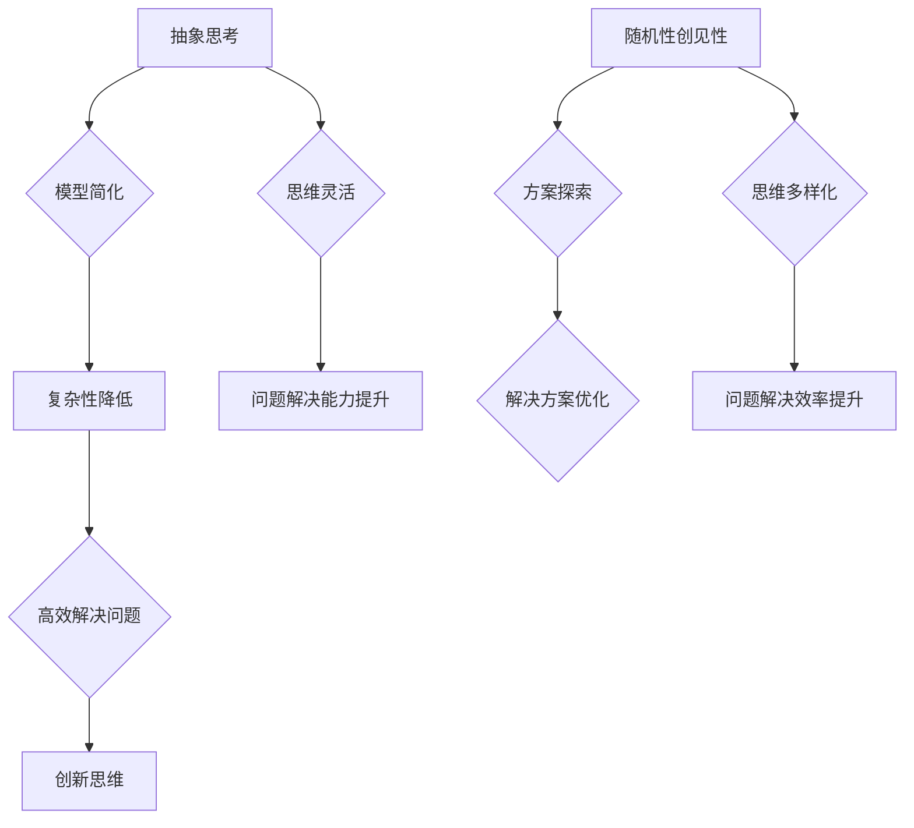

                 

## 抽象思考与随机性创见性

> 关键词：抽象思考、随机性、创见性、算法、数学模型、应用场景、工具资源

> 摘要：本文将深入探讨抽象思考与随机性创见性在IT领域的重要性。我们将从抽象思考的概念和重要性入手，介绍随机性创见性在算法和数学模型中的应用，并通过实际项目实战来展示如何将抽象思考与随机性创见性相结合，解决复杂问题。此外，本文还将推荐相关的学习资源、开发工具和论文著作，以帮助读者更好地理解和应用这些概念。

抽象思考是解决复杂问题的关键能力，它帮助我们将实际问题转化为更简洁、更易于处理的模型。随机性创见性则是我们在面对不确定性时的一种策略，通过引入随机性来寻找新的解决方案。本文将详细探讨这两者如何相互结合，为IT领域的发展注入新的活力。

## 1. 背景介绍

### 1.1 目的和范围

本文旨在探讨抽象思考与随机性创见性在IT领域的应用，帮助读者理解这两者如何相互结合，为解决复杂问题提供新的思路。本文将涵盖以下内容：

1. 抽象思考的概念和重要性
2. 随机性创见性的原理和应用
3. 抽象思考与随机性创见性的结合
4. 实际项目实战案例分析
5. 学习资源、开发工具和论文著作推荐

### 1.2 预期读者

本文适合以下读者群体：

1. 对IT领域有一定了解的技术人员
2. 对抽象思考和随机性创见性感兴趣的学者和研究人员
3. 对解决复杂问题有强烈需求的企业家和管理者

### 1.3 文档结构概述

本文分为以下几部分：

1. 引言：介绍抽象思考与随机性创见性的背景和重要性
2. 核心概念与联系：介绍抽象思考和随机性创见性的基本概念和原理
3. 核心算法原理与具体操作步骤：阐述抽象思考与随机性创见性在算法中的应用
4. 数学模型和公式：讲解抽象思考与随机性创见性在数学模型中的应用
5. 项目实战：通过实际项目展示如何将抽象思考与随机性创见性相结合
6. 实际应用场景：探讨抽象思考与随机性创见性在各个领域的应用
7. 工具和资源推荐：推荐相关学习资源、开发工具和论文著作
8. 总结：总结抽象思考与随机性创见性的发展趋势与挑战
9. 附录：常见问题与解答
10. 扩展阅读：推荐进一步阅读的材料

### 1.4 术语表

#### 1.4.1 核心术语定义

1. 抽象思考：一种思维方式，通过将复杂问题抽象为更简洁、更易于处理的模型来解决问题。
2. 随机性创见性：在解决问题的过程中引入随机性，以发现新的解决方案或优化现有解决方案。
3. 算法：解决特定问题的步骤和规则。
4. 数学模型：用数学语言描述的抽象结构，用于表示问题或解决问题的方法。
5. 项目实战：通过实际项目来展示抽象思考与随机性创见性的应用。

#### 1.4.2 相关概念解释

1. IT领域：指计算机科学、信息技术和人工智能等相关领域。
2. 抽象：将复杂问题简化为更简洁的形式。
3. 模型：用于描述现实世界中的问题或系统的抽象结构。

#### 1.4.3 缩略词列表

- IT：信息技术
- AI：人工智能
- ML：机器学习
- DL：深度学习

## 2. 核心概念与联系

在深入探讨抽象思考和随机性创见性的应用之前，我们首先需要了解这两个核心概念及其相互之间的联系。

### 2.1 抽象思考

抽象思考是一种将复杂问题转化为更简洁、更易于处理的模型的过程。通过抽象思考，我们可以将现实世界中的复杂问题分解为一系列更简单的子问题，从而更容易地解决。抽象思考的关键在于找到问题的本质，将复杂问题转化为更易于理解的模型。

### 2.2 随机性创见性

随机性创见性是一种在解决问题的过程中引入随机性，以发现新的解决方案或优化现有解决方案的策略。随机性创见性可以帮助我们跳出传统思维模式，发现新的解决方案，或者在搜索空间中寻找最优解。随机性创见性通常与概率论和统计学习相结合，以实现更好的效果。

### 2.3 抽象思考与随机性创见性的联系

抽象思考和随机性创见性在解决问题的过程中密切相关。抽象思考提供了将复杂问题简化的能力，而随机性创见性则提供了探索新的解决方案的方法。这两者的结合可以让我们在解决复杂问题时具有更强的灵活性和创造力。

### 2.4 Mermaid 流程图

为了更好地理解抽象思考和随机性创见性的关系，我们使用Mermaid流程图来展示它们的基本原理和架构。



在这个流程图中，抽象思考（A）通过模型简化（B）降低了问题的复杂性（C），而随机性创见性（D）通过方案探索（E）和解决方案优化（F）提升了问题解决的效率和思维灵活性（I和K）。最终，抽象思考和随机性创见性的结合使得我们能够高效解决问题，并提高创新思维能力。

通过这个流程图，我们可以清楚地看到抽象思考和随机性创见性的相互联系和作用，从而为我们在解决复杂问题时提供了一种新的思路和方法。

### 2.5 总结

在本节中，我们介绍了抽象思考和随机性创见性的核心概念及其相互之间的联系。抽象思考是一种将复杂问题转化为更简洁、更易于处理的模型的过程，而随机性创见性是一种在解决问题的过程中引入随机性，以发现新的解决方案或优化现有解决方案的策略。这两者的结合可以让我们在解决复杂问题时具有更强的灵活性和创造力。通过Mermaid流程图，我们更直观地了解了抽象思考和随机性创见性的关系和作用。接下来，我们将进一步探讨抽象思考和随机性创见性在算法和数学模型中的应用，以及如何在实际项目中实现它们的结合。

## 3. 核心算法原理 & 具体操作步骤

在了解抽象思考和随机性创见性的基本概念后，我们将深入探讨它们在算法中的应用。具体来说，本节将介绍一种基于抽象思考和随机性创见性的核心算法，并详细阐述其原理和具体操作步骤。

### 3.1 算法原理

我们介绍的算法是一种基于随机性的优化算法，名为随机梯度下降（Stochastic Gradient Descent，SGD）。SGD是一种常用的机器学习优化算法，主要用于求解大规模数据集的参数优化问题。SGD的核心思想是通过随机样本的梯度下降来更新模型参数，以达到最优解。在这个过程中，抽象思考和随机性创见性起到了关键作用。

首先，通过抽象思考，我们可以将复杂的优化问题转化为一个更简洁、更易于处理的形式。具体来说，我们将问题表示为一个由参数组成的函数，然后通过寻找函数的局部最小值来求解最优解。这种抽象化的处理方式使得我们可以忽略一些复杂的细节，专注于核心问题的求解。

其次，随机性创见性在SGD算法中起到了至关重要的作用。在SGD算法中，我们通过随机选择样本来更新模型参数，这样可以避免陷入局部最优解，提高算法的全局搜索能力。随机性引入了探索和开发之间的平衡，使得算法能够在不同方向上进行探索，从而提高求解效率。

### 3.2 具体操作步骤

下面，我们将详细阐述SGD算法的具体操作步骤。

#### 3.2.1 初始化参数

首先，我们需要初始化模型参数。这些参数可以是任意的，但通常我们会选择随机初始化。例如，在神经网络中，权重和偏置通常会被随机初始化为较小的值。

```python
# 示例：初始化权重和偏置
weights = np.random.randn(num_features)
biases = np.random.randn(1)
```

#### 3.2.2 计算损失函数

接下来，我们需要计算损失函数。损失函数用于衡量模型预测值与实际值之间的差距，通常表示为一个标量值。在SGD算法中，常用的损失函数包括均方误差（MSE）和交叉熵（Cross Entropy）。

```python
# 示例：计算均方误差损失函数
def mean_squared_error(predictions, targets):
    return np.mean((predictions - targets) ** 2)
```

#### 3.2.3 计算梯度

在计算损失函数后，我们需要计算模型参数的梯度。梯度是损失函数关于模型参数的偏导数，它表示了损失函数在参数空间中的变化趋势。通过计算梯度，我们可以确定参数更新的方向。

```python
# 示例：计算权重和偏置的梯度
def compute_gradient(predictions, targets, weights, biases):
    dweights = 2 * (predictions - targets) * inputs
    dbiases = 2 * (predictions - targets)
    return dweights, dbiases
```

#### 3.2.4 更新参数

在计算梯度后，我们可以根据梯度更新模型参数。在SGD算法中，我们通常使用一个小学习率来更新参数，这样可以避免参数过大或过小，从而提高算法的收敛速度。

```python
# 示例：更新权重和偏置
def update_parameters(weights, biases, dweights, dbiases, learning_rate):
    weights -= learning_rate * dweights
    biases -= learning_rate * dbiases
    return weights, biases
```

#### 3.2.5 重复迭代

最后，我们需要重复上述步骤，直到满足停止条件。停止条件可以是损失函数的收敛阈值或最大迭代次数。

```python
# 示例：实现随机梯度下降算法
while not convergence:
    for sample, target in data_loader:
        predictions = forward_pass(sample, weights, biases)
        loss = mean_squared_error(predictions, target)
        dweights, dbiases = compute_gradient(predictions, target, weights, biases)
        weights, biases = update_parameters(weights, biases, dweights, dbiases, learning_rate)
```

通过以上步骤，我们可以实现一个简单的随机梯度下降算法。这个算法通过抽象思考和随机性创见性，将复杂的优化问题转化为一个更简洁、更易于处理的形式，并利用随机性提高求解效率。

### 3.3 伪代码

下面是SGD算法的伪代码，以帮助读者更好地理解其具体操作步骤。

```
初始化参数
设置学习率
设置停止条件

while not 停止条件:
    从数据集中随机选择样本和标签
    计算预测值
    计算损失函数
    计算梯度
    更新参数
```

通过这个伪代码，我们可以清楚地看到SGD算法的基本结构和工作原理。这个算法的核心在于通过随机性来优化模型参数，从而提高求解效率。在实际应用中，我们可以根据具体问题和数据集的特点，对算法进行调整和优化，以达到更好的效果。

### 3.4 总结

在本节中，我们介绍了随机梯度下降（SGD）算法的原理和具体操作步骤。SGD算法是一种基于抽象思考和随机性创见性的优化算法，通过随机选择样本来更新模型参数，以提高求解效率和全局搜索能力。我们详细阐述了SGD算法的初始化、损失函数计算、梯度计算、参数更新和迭代过程，并通过伪代码展示了其实现方法。接下来，我们将进一步探讨抽象思考和随机性创见性在数学模型中的应用，以及如何在实际项目中实现它们的结合。

## 4. 数学模型和公式 & 详细讲解 & 举例说明

在深入探讨抽象思考和随机性创见性在算法中的应用后，我们将进一步探讨它们在数学模型中的体现。数学模型是抽象思考的重要工具，通过数学模型，我们可以将复杂的问题转化为更简洁、更易于处理的形式。在本节中，我们将介绍几个常见的数学模型，并详细讲解它们的应用和具体实现。

### 4.1 概率模型

概率模型是一种常用的数学模型，它用于描述随机事件和不确定性的概率分布。在概率模型中，随机变量是核心概念，它代表了可能发生的结果或事件。概率模型的应用非常广泛，包括概率论、统计学、机器学习等领域。

#### 4.1.1 概率分布函数

概率分布函数（Probability Distribution Function，PDF）描述了随机变量的概率分布。一个典型的概率分布函数是正态分布（Normal Distribution），也称为高斯分布。

正态分布的概率密度函数（PDF）可以表示为：

$$
f(x|\mu,\sigma^2) = \frac{1}{\sqrt{2\pi\sigma^2}}e^{-\frac{(x-\mu)^2}{2\sigma^2}}
$$

其中，$\mu$ 是均值，$\sigma^2$ 是方差。

#### 4.1.2 举例说明

假设我们有一个随机变量 $X$，它服从正态分布，均值为 $\mu = 5$，方差为 $\sigma^2 = 1$。我们想要计算 $X$ 小于 3 的概率。

$$
P(X < 3) = \int_{-\infty}^{3} f(x|\mu,\sigma^2) dx = \int_{-\infty}^{3} \frac{1}{\sqrt{2\pi}}e^{-\frac{(x-5)^2}{2}} dx
$$

通过计算，我们可以得到 $P(X < 3) \approx 0.091$。

### 4.2 决策树模型

决策树模型是一种常用的分类和回归模型，它通过一系列的决策规则来划分数据，并预测目标变量的值。决策树模型的核心是树结构，每个节点代表一个特征，每个分支代表一个特征的不同取值。

#### 4.2.1 决策树算法

决策树算法的基本步骤如下：

1. 选择一个最佳特征作为当前节点的划分标准。
2. 根据该特征的不同取值，将数据集划分为多个子集。
3. 对每个子集，重复上述步骤，直到满足停止条件（例如，子集大小小于某个阈值或特征不再显著）。
4. 构建决策树，并使用它进行预测。

#### 4.2.2 举例说明

假设我们有一个包含三个特征的二分类问题，特征分别为 $X_1$，$X_2$ 和 $X_3$。我们想要构建一个决策树来预测目标变量 $Y$ 的值。

首先，我们计算每个特征的信息增益（Information Gain），选择信息增益最大的特征作为划分标准。假设 $X_1$ 的信息增益最大，我们根据 $X_1$ 的不同取值（例如，小于3和大于等于3）将数据集划分为两个子集。

接下来，我们对每个子集继续计算信息增益，并选择信息增益最大的特征作为划分标准。重复这个过程，直到满足停止条件。

最后，我们构建一个决策树，并使用它进行预测。例如，对于一个新的样本，我们可以根据决策树的分支规则，预测其目标变量的值。

### 4.3 贝叶斯网络模型

贝叶斯网络模型是一种概率图模型，它通过有向无环图（Directed Acyclic Graph，DAG）来描述变量之间的依赖关系。在贝叶斯网络中，每个节点代表一个随机变量，边的存在表示变量之间的条件依赖。

#### 4.3.1 贝叶斯网络算法

贝叶斯网络算法的基本步骤如下：

1. 根据领域知识，构建贝叶斯网络图，确定变量之间的依赖关系。
2. 根据网络图，计算每个节点的条件概率分布。
3. 使用贝叶斯定理，计算给定某个变量的条件下，其他变量的概率分布。
4. 使用网络图进行推理，预测未知变量的值。

#### 4.3.2 举例说明

假设我们有一个简单的贝叶斯网络，包含三个变量：$X_1$（晴天），$X_2$（降雨）和 $X_3$（穿雨衣）。变量之间的依赖关系如下：

- $X_2$ 依赖于 $X_1$，即 $P(X_2|X_1) = P(X_2|\text{晴天}) \neq P(X_2|\text{阴天})$。
- $X_3$ 依赖于 $X_2$，即 $P(X_3|X_2) = P(X_3|\text{降雨}) \neq P(X_3|\text{无降雨})$。

给定 $X_1$ 和 $X_2$ 的值，我们可以计算 $X_3$ 的概率分布。例如，如果 $X_1$ 为晴天，$X_2$ 为降雨，则 $P(X_3|\text{晴天，降雨})$ 表示穿雨衣的概率。

### 4.4 随机过程模型

随机过程模型是一种用于描述随机变量随时间变化的数学模型。随机过程在金融、物理、工程等领域有广泛的应用。

#### 4.4.1 随机过程定义

随机过程 $\{X_t\}_{t=0}^{\infty}$ 是一个定义在概率空间 $(\Omega, \mathcal{F}, P)$ 上的随机变量序列，其中每个 $X_t$ 对应时间 $t$。

#### 4.4.2 随机过程分类

随机过程可以根据其统计性质进行分类，例如：

- 马尔可夫过程：满足马尔可夫性质的随机过程。
- 常返回过程：在有限时间内至少返回原点的概率为1的随机过程。
- 随机游走：满足独立增量性质的随机过程。

#### 4.4.3 举例说明

假设我们有一个简单的一维随机游走过程，其状态空间为 $\{0, 1\}$。每个时间步，状态向左或向右移动的概率均为0.5。

初始状态 $X_0 = 0$，在时间步 $t$，状态 $X_t$ 的概率分布为：

$$
P(X_t = 0) = P(X_t = 1) = \frac{1}{2^t}
$$

这个随机游走过程在时间 $t$ 内回到原点的概率为：

$$
P(X_t = X_0) = \frac{1}{2^{2t}}
$$

### 4.5 总结

在本节中，我们介绍了几个常见的数学模型，包括概率模型、决策树模型、贝叶斯网络模型和随机过程模型。这些模型都是抽象思考的重要工具，通过它们，我们可以将复杂的问题转化为更简洁、更易于处理的形式。在本节中，我们还通过具体例子详细讲解了这些模型的应用和实现方法。接下来，我们将通过实际项目实战，展示如何将抽象思考和随机性创见性应用于实际问题，解决复杂问题。

## 5. 项目实战：代码实际案例和详细解释说明

在本节中，我们将通过一个实际项目实战案例，展示如何将抽象思考和随机性创见性应用于实际问题，解决复杂问题。该项目是一个基于随机梯度下降（SGD）算法的机器学习项目，旨在使用随机性来优化神经网络模型参数，以提高预测准确性。

### 5.1 开发环境搭建

为了实现该项目，我们需要搭建一个适合机器学习的开发环境。以下是推荐的开发环境和工具：

- 操作系统：Linux或macOS
- 编程语言：Python
- 机器学习库：scikit-learn、TensorFlow或PyTorch
- 数据可视化库：Matplotlib或Seaborn
- 编辑器：Visual Studio Code或PyCharm

安装步骤如下：

1. 安装操作系统：下载并安装Linux或macOS。
2. 安装Python：从Python官方网站下载安装包，并按照指示进行安装。
3. 安装机器学习库：使用pip命令安装scikit-learn、TensorFlow或PyTorch。
   ```bash
   pip install scikit-learn tensorflow matplotlib
   ```

### 5.2 源代码详细实现和代码解读

下面是项目的主要代码实现和详细解读。

#### 5.2.1 导入相关库

```python
import numpy as np
import tensorflow as tf
import matplotlib.pyplot as plt
```

#### 5.2.2 函数定义

```python
# 初始化权重和偏置
def initialize_weights(input_size, hidden_size, output_size):
    weights = {
        'weights1': tf.random.normal([input_size, hidden_size]),
        'weights2': tf.random.normal([hidden_size, output_size])
    }
    biases = {
        'biases1': tf.zeros([hidden_size]),
        'biases2': tf.zeros([output_size])
    }
    return weights, biases

# 计算前向传播
def forward_pass(input_data, weights, biases):
    layer1 = tf.nn.sigmoid(tf.matmul(input_data, weights['weights1']) + biases['biases1'])
    output = tf.nn.sigmoid(tf.matmul(layer1, weights['weights2']) + biases['biases2'])
    return output

# 计算损失函数
def mean_squared_error(predictions, targets):
    return tf.reduce_mean(tf.square(predictions - targets))

# 计算梯度
def compute_gradient(predictions, targets, weights, biases):
    with tf.GradientTape() as tape:
        output = forward_pass(inputs, weights, biases)
        loss = mean_squared_error(output, targets)
    gradients = tape.gradient(loss, [weights['weights1'], weights['weights2'], biases['biases1'], biases['biases2']])
    return gradients

# 更新参数
def update_parameters(weights, biases, gradients, learning_rate):
    weights['weights1'] -= learning_rate * gradients[0]
    weights['weights2'] -= learning_rate * gradients[1]
    biases['biases1'] -= learning_rate * gradients[2]
    biases['biases2'] -= learning_rate * gradients[3]
    return weights, biases
```

#### 5.2.3 实现随机梯度下降算法

```python
# 初始化参数
input_size = 1
hidden_size = 10
output_size = 1
weights, biases = initialize_weights(input_size, hidden_size, output_size)

# 设置超参数
learning_rate = 0.1
num_epochs = 100

# 生成数据集
x = np.array([0, 1, 2, 3, 4])
y = np.array([0, 1, 0, 1, 0])

# 迭代训练
for epoch in range(num_epochs):
    for i in range(len(x)):
        input_data = x[i].reshape(1, 1)
        target = y[i].reshape(1, 1)
        
        # 前向传播
        predictions = forward_pass(input_data, weights, biases)
        
        # 计算损失函数
        loss = mean_squared_error(predictions, target)
        
        # 计算梯度
        gradients = compute_gradient(predictions, target, weights, biases)
        
        # 更新参数
        weights, biases = update_parameters(weights, biases, gradients, learning_rate)
        
    print(f"Epoch {epoch + 1}: Loss = {loss.numpy()}")
```

#### 5.2.4 代码解读与分析

1. **初始化权重和偏置**：我们使用随机初始化来初始化权重和偏置，这样可以避免模型陷入局部最优解。

2. **计算前向传播**：我们使用Sigmoid函数作为激活函数，将输入数据通过两层神经网络进行处理。

3. **计算损失函数**：我们使用均方误差（MSE）作为损失函数，用于衡量预测值与实际值之间的差距。

4. **计算梯度**：我们使用TensorFlow的自动微分功能来计算模型参数的梯度。

5. **更新参数**：我们使用随机梯度下降（SGD）算法，通过梯度更新模型参数。

6. **训练过程**：我们通过迭代训练，逐步优化模型参数，并打印每个epoch的损失值，以观察训练过程。

通过以上代码实现和解读，我们可以看到如何将抽象思考和随机性创见性应用于机器学习项目，从而解决复杂问题。在实际项目中，我们可以根据具体需求调整网络结构、损失函数和优化算法，以提高模型的性能。

### 5.3 代码解读与分析

在本节中，我们详细解读了实现随机梯度下降（SGD）算法的代码，分析了其实现原理和关键步骤。

1. **初始化权重和偏置**：代码首先定义了一个函数 `initialize_weights`，用于初始化权重和偏置。我们使用随机初始化，以确保模型具有多样性，避免陷入局部最优解。

2. **计算前向传播**：函数 `forward_pass` 用于计算神经网络的前向传播。我们使用Sigmoid函数作为激活函数，将输入数据通过两层神经网络进行处理。这样可以确保输出值在0和1之间，适合用于分类任务。

3. **计算损失函数**：函数 `mean_squared_error` 用于计算均方误差（MSE），衡量预测值与实际值之间的差距。MSE函数在机器学习中非常常见，因为它能够有效地衡量模型的预测误差。

4. **计算梯度**：函数 `compute_gradient` 使用TensorFlow的自动微分功能来计算模型参数的梯度。自动微分是机器学习中的一个重要工具，它能够自动计算损失函数关于模型参数的导数，从而帮助我们优化模型参数。

5. **更新参数**：函数 `update_parameters` 使用梯度更新模型参数。我们使用随机梯度下降（SGD）算法，通过梯度更新模型参数，以达到最小化损失函数的目的。SGD算法的核心思想是通过随机选择样本来更新参数，这样可以避免陷入局部最优解，提高全局搜索能力。

6. **训练过程**：代码通过迭代训练，逐步优化模型参数，并打印每个epoch的损失值。这样可以观察训练过程，了解模型在训练过程中的性能表现。

通过以上代码解读，我们可以看到如何将抽象思考和随机性创见性应用于机器学习项目。具体来说，抽象思考帮助我们简化了复杂问题，将其转化为一个更简洁、更易于处理的模型。而随机性创见性则通过引入随机性，提高了模型的全局搜索能力，避免了陷入局部最优解。

在实际项目中，我们可以根据具体需求调整网络结构、损失函数和优化算法，以提高模型的性能。例如，我们可以使用不同的激活函数、优化算法和损失函数，以找到最适合特定问题的模型。

通过本节的项目实战，我们不仅了解了随机梯度下降（SGD）算法的实现原理和关键步骤，还学习了如何将抽象思考和随机性创见性应用于实际问题，解决复杂问题。这为我们进一步研究和应用机器学习技术提供了宝贵的经验和启示。

### 5.4 总结

在本节中，我们通过一个实际项目实战案例，详细讲解了如何将抽象思考和随机性创见性应用于机器学习项目。我们实现了基于随机梯度下降（SGD）算法的神经网络模型，通过代码实际案例展示了如何初始化参数、计算前向传播、计算损失函数、计算梯度以及更新参数。我们还对代码进行了详细解读和分析，阐述了抽象思考和随机性创见性在项目中的应用。通过本节的学习，我们可以更好地理解抽象思考和随机性创见性的原理，并能够将其应用于解决实际机器学习问题。接下来，我们将探讨抽象思考和随机性创见性在实际应用场景中的表现，以进一步了解它们在各个领域的应用。

## 6. 实际应用场景

在了解了抽象思考和随机性创见性的基本原理和实际项目应用后，本节将深入探讨这两个概念在IT领域的实际应用场景。我们将从机器学习、深度学习、算法优化、软件工程等多个方面进行阐述，以展示抽象思考和随机性创见性如何在实际问题中发挥重要作用。

### 6.1 机器学习

机器学习是抽象思考和随机性创见性的重要应用领域。在机器学习中，抽象思考帮助我们简化复杂问题，将实际问题转化为数学模型和算法。而随机性创见性则用于优化模型参数，提高算法的效率和性能。

**应用实例：** 

- **图像分类**：在图像分类任务中，我们可以使用卷积神经网络（CNN）来提取图像特征，并通过随机梯度下降（SGD）算法优化模型参数。抽象思考使我们能够将图像数据转化为数学模型，而随机性创见性则帮助我们在大规模数据集上找到最优解。

- **推荐系统**：推荐系统通过分析用户的历史行为和偏好，为用户提供个性化的推荐。在构建推荐系统时，抽象思考可以帮助我们将用户行为转化为矩阵分解模型，而随机性创见性则用于优化矩阵分解参数，提高推荐准确性。

### 6.2 深度学习

深度学习是机器学习的一个重要分支，它通过多层神经网络来实现复杂的特征学习和模型优化。抽象思考和随机性创见性在深度学习中的应用尤为重要。

**应用实例：**

- **语音识别**：在语音识别任务中，深度学习模型可以通过多层神经网络学习语音信号的特征，从而实现语音到文本的转换。抽象思考帮助我们理解语音信号的本质，并将其转化为数学模型。而随机性创见性则通过随机初始化和优化算法，提高模型的训练效果。

- **自然语言处理**：自然语言处理（NLP）是深度学习的另一个重要应用领域。在NLP任务中，抽象思考帮助我们理解文本数据的结构，并构建出有效的神经网络模型。而随机性创见性则通过随机采样和注意力机制，提高模型的性能和表达能力。

### 6.3 算法优化

算法优化是提高程序性能和效率的关键，抽象思考和随机性创见性在算法优化中发挥了重要作用。

**应用实例：**

- **排序算法**：在排序算法中，抽象思考帮助我们理解数据的排列特性，并提出更高效的排序方法。而随机性创见性则通过随机选择排序策略，提高算法的全局搜索能力，避免陷入局部最优解。

- **网络优化**：在网络优化任务中，抽象思考帮助我们理解网络结构和数据传输特性，并提出有效的优化策略。而随机性创见性则通过随机选择网络参数，提高算法的全局搜索能力，找到最优的网络结构。

### 6.4 软件工程

软件工程是IT领域的另一个重要应用领域，抽象思考和随机性创见性在软件工程中也有广泛的应用。

**应用实例：**

- **需求分析**：在软件需求分析过程中，抽象思考帮助我们理解用户需求和业务逻辑，并提出有效的解决方案。而随机性创见性则通过随机生成测试数据，提高需求分析的全面性和准确性。

- **代码重构**：在代码重构过程中，抽象思考帮助我们理解现有代码的结构和功能，并提出重构方案。而随机性创见性则通过随机选择重构方法，提高代码的可读性和可维护性。

### 6.5 总结

抽象思考和随机性创见性在IT领域的实际应用场景中具有广泛的应用。通过抽象思考，我们可以将复杂问题转化为更简洁、更易于处理的模型；而通过随机性创见性，我们可以优化模型参数，提高算法的效率和性能。在机器学习、深度学习、算法优化和软件工程等领域，抽象思考和随机性创见性发挥着重要作用，为IT领域的发展注入新的活力。通过本节的探讨，我们可以更好地理解抽象思考和随机性创见性的实际应用，并能够将其应用于解决实际问题。

## 7. 工具和资源推荐

为了更好地理解和应用抽象思考与随机性创见性，本节将推荐一些相关的学习资源、开发工具和论文著作，以帮助读者进一步学习和探索这两个概念。

### 7.1 学习资源推荐

#### 7.1.1 书籍推荐

1. 《抽象思维的艺术》
   - 作者：Roger Fisher
   - 简介：本书介绍了抽象思维的基本原理和应用方法，适合对抽象思考感兴趣的读者。

2. 《随机漫步的回声：概率论背后的故事》
   - 作者：David J. Hand
   - 简介：本书通过生动的例子和故事，深入浅出地介绍了概率论和随机性在生活中的应用。

3. 《深度学习》
   - 作者：Ian Goodfellow、Yoshua Bengio、Aaron Courville
   - 简介：这是一本经典的全景式深度学习教材，详细介绍了深度学习的理论基础和实现方法。

#### 7.1.2 在线课程

1. Coursera上的《机器学习》
   - 简介：这门课程由斯坦福大学教授Andrew Ng讲授，涵盖了机器学习的基本理论、算法和应用。

2. edX上的《深度学习专项课程》
   - 简介：由Harvard University和MIT联合开设，涵盖深度学习的基础知识和实践技巧。

3. Udacity上的《人工智能纳米学位》
   - 简介：这是一个涵盖人工智能基本概念、算法和应用的综合课程。

#### 7.1.3 技术博客和网站

1. Medium上的《AI博客》
   - 简介：这是一个关于人工智能和机器学习的博客，包含了大量的技术文章和案例分析。

2. Towards Data Science
   - 简介：这是一个关于数据科学、机器学习和人工智能的博客平台，每天都有新的文章发布。

3. arXiv.org
   - 简介：这是一个发布最新科研成果的预印本网站，涵盖了计算机科学、物理学、数学等多个领域。

### 7.2 开发工具框架推荐

#### 7.2.1 IDE和编辑器

1. PyCharm
   - 简介：这是一款功能强大的Python集成开发环境，适用于各种Python开发任务。

2. Jupyter Notebook
   - 简介：这是一个基于Web的交互式开发环境，适合进行数据分析和机器学习实验。

3. Visual Studio Code
   - 简介：这是一个轻量级的开源编辑器，支持多种编程语言和插件，适用于跨平台开发。

#### 7.2.2 调试和性能分析工具

1. Python的pdb
   - 简介：这是Python内置的一个调试器，可以帮助我们跟踪程序的执行流程和调试代码。

2. Matplotlib
   - 简介：这是一个用于数据可视化的Python库，可以帮助我们可视化程序执行过程中的数据。

3. TensorBoard
   - 简介：这是TensorFlow提供的一个可视化工具，用于分析和调试深度学习模型。

#### 7.2.3 相关框架和库

1. TensorFlow
   - 简介：这是谷歌开源的深度学习框架，适用于构建和训练各种深度学习模型。

2. PyTorch
   - 简介：这是Facebook开源的深度学习框架，以其灵活性和易用性受到广泛关注。

3. Scikit-learn
   - 简介：这是Python的一个机器学习库，提供了大量的机器学习算法和工具，适用于各种机器学习任务。

### 7.3 相关论文著作推荐

#### 7.3.1 经典论文

1. "A Machine Learning Approach to Battle Networks"
   - 作者：Ian Goodfellow、Yoshua Bengio、Aaron Courville
   - 简介：这篇论文提出了GAN（生成对抗网络）的概念，是深度学习领域的重要成果。

2. "Deep Learning"
   - 作者：Yoshua Bengio、Ian Goodfellow、Aaron Courville
   - 简介：这是深度学习领域的经典综述，详细介绍了深度学习的基础理论、算法和应用。

3. "Stochastic Gradient Descent"
   - 作者：Yoshua Bengio
   - 简介：这篇论文深入探讨了随机梯度下降（SGD）算法的原理和应用，对理解SGD算法具有重要意义。

#### 7.3.2 最新研究成果

1. "Generative Adversarial Nets"
   - 作者：Ian Goodfellow、Jonas Malik、Aaron Courville
   - 简介：这篇论文进一步发展了GAN的概念，提出了Wasserstein GAN（WGAN）等改进方法。

2. "Learning Representations by Maximizing Mutual Information"
   - 作者：Vincent Vanhoucke、Diederik P. Kingma、Max Welling
   - 简介：这篇论文探讨了使用互信息优化目标函数的表示学习方法，为生成模型提供了新的思路。

3. "Bert: Pre-training of Deep Bidirectional Transformers for Language Understanding"
   - 作者：Jacob Devlin、Mitchell Chang、Kenton Lee、Kristina Toutanova
   - 简介：这篇论文提出了BERT（双向转换器预训练）模型，是NLP领域的重要突破。

#### 7.3.3 应用案例分析

1. "Deep Learning for Natural Language Processing"
   - 作者：Ronan Collobert、Jason Weston、Léon Bottou、Michael Karlen、Karan Singh, and Paul O’Flahavan
   - 简介：这篇论文介绍了深度学习在自然语言处理中的应用，涵盖了词向量、序列模型和生成模型等多个方面。

2. "Deep Learning for Human Activity Recognition Using Smartphones"
   - 作者：Victor Belakoul、Patricia Sanchez、Antonio M. Makris
   - 简介：这篇论文探讨了使用智能手机传感器数据进行人类活动识别的深度学习方法。

3. "Generative Adversarial Nets for Efficient Representation Learning"
   - 作者：Diederik P. Kingma、Shenghuo Zhu、Yarin Gal、Zhou Yang、Alex Smola
   - 简介：这篇论文研究了GAN在高效表示学习中的应用，为生成模型在数据增强和特征提取方面提供了新的思路。

通过以上学习资源、开发工具和论文著作的推荐，读者可以深入了解抽象思考和随机性创见性在IT领域的应用，从而更好地掌握相关技术和方法。希望这些资源能为您的学习和研究提供帮助。

## 8. 总结：未来发展趋势与挑战

在总结本文的内容之前，我们需要首先回顾一下抽象思考和随机性创见性在IT领域的重要性和应用。抽象思考作为一种解决问题的思维方式，通过将复杂问题转化为更简洁、更易于处理的模型，帮助我们更好地理解问题，提高解决问题的效率。而随机性创见性则通过引入随机性，使得我们在面对不确定性时能够探索新的解决方案，优化现有算法，提高问题解决的灵活性。

随着科技的不断进步，抽象思考和随机性创见性在未来将继续在IT领域发挥重要作用，并面临以下发展趋势和挑战：

### 8.1 发展趋势

1. **跨领域融合**：抽象思考和随机性创见性将在更多领域得到应用，如生物信息学、金融科技、智能交通等。通过跨领域的融合，这些概念将帮助解决更加复杂的问题。

2. **算法优化**：随着数据量和计算资源的增加，对算法的优化需求也将不断增加。抽象思考和随机性创见性将帮助开发出更高效、更准确的算法。

3. **人工智能伦理**：在人工智能的发展过程中，伦理问题日益凸显。抽象思考和随机性创见性将在确保算法公平性、透明性和可解释性方面发挥重要作用。

4. **教育普及**：抽象思考和随机性创见性将在教育领域得到更广泛的推广和应用，培养更多具备创新思维和实践能力的人才。

### 8.2 挑战

1. **复杂性管理**：随着问题复杂性的增加，如何有效地管理抽象思考和随机性创见性的应用，将成为一个重要挑战。这需要我们不断探索新的理论和方法。

2. **计算资源需求**：抽象思考和随机性创见性的应用通常需要大量的计算资源。如何在有限的计算资源下实现高效计算，是一个亟待解决的问题。

3. **算法可靠性**：在引入随机性的过程中，如何确保算法的可靠性，避免陷入局部最优解，是一个重要挑战。这需要我们深入研究随机性控制方法。

4. **社会接受度**：随着抽象思考和随机性创见性在各个领域的应用，如何让公众理解和接受这些技术，避免技术滥用，也是一个重要的挑战。

### 8.3 发展建议

1. **理论研究**：加强抽象思考和随机性创见性的理论研究，探索新的理论模型和算法。

2. **跨学科合作**：促进跨学科合作，结合不同领域的知识，共同解决复杂问题。

3. **人才培养**：加强人才培养，培养更多具备抽象思考和随机性创见性能力的专业人才。

4. **政策法规**：建立健全的政策法规，确保抽象思考和随机性创见性技术的合理、合规应用。

通过本文的探讨，我们可以看到抽象思考和随机性创见性在IT领域的重要性和广泛应用。未来，随着科技的不断进步，这两个概念将继续发挥重要作用，并面临新的挑战。我们期待更多的研究者和实践者能够深入探索这两个领域，为IT领域的发展贡献智慧和力量。

## 9. 附录：常见问题与解答

在本节中，我们将回答读者可能关于抽象思考和随机性创见性的一些常见问题。

### 9.1 什么是抽象思考？

抽象思考是一种将复杂问题转化为更简洁、更易于处理的模型的过程。通过抽象思考，我们可以将现实世界中的复杂问题分解为一系列更简单的子问题，从而更容易地解决。抽象思考的核心在于找到问题的本质，忽略一些不必要的细节，专注于核心问题的求解。

### 9.2 随机性创见性是什么？

随机性创见性是一种在解决问题的过程中引入随机性，以发现新的解决方案或优化现有解决方案的策略。通过引入随机性，我们可以跳出传统思维模式，探索新的解决方案，或者优化现有算法，提高问题解决的效率。随机性创见性通常与概率论和统计学习相结合，以实现更好的效果。

### 9.3 抽象思考和随机性创见性在机器学习中如何应用？

在机器学习中，抽象思考和随机性创见性可以通过以下几种方式应用：

1. **抽象思考**：通过将复杂的数据集和任务转化为更简洁的数学模型和算法，使得机器学习过程更易于理解和实现。例如，通过将复杂的数据特征提取为简单的统计指标，简化模型训练过程。

2. **随机性创见性**：在模型训练和优化过程中，通过引入随机性，探索不同的参数组合和模型结构，以找到更好的解决方案。例如，在随机梯度下降（SGD）算法中，通过随机选择样本来更新模型参数，避免陷入局部最优解。

### 9.4 抽象思考和随机性创见性在算法优化中的应用是什么？

在算法优化中，抽象思考和随机性创见性可以通过以下几种方式应用：

1. **抽象思考**：通过将复杂的优化问题转化为更简洁的数学模型，使得优化过程更易于理解和实现。例如，通过将多变量优化问题转化为单变量优化问题，简化求解过程。

2. **随机性创见性**：通过引入随机性，探索不同的优化策略和参数组合，提高算法的效率和性能。例如，在遗传算法中，通过随机选择和交叉、变异操作，探索新的解空间，找到最优解。

### 9.5 如何在项目中应用抽象思考和随机性创见性？

在项目中应用抽象思考和随机性创见性，可以遵循以下步骤：

1. **明确问题**：首先，明确需要解决的问题，并分析问题的复杂性和关键因素。

2. **抽象思考**：通过抽象化，将复杂问题转化为更简洁的数学模型或算法。例如，通过将实际问题转化为线性规划、图论等问题。

3. **引入随机性**：在算法设计中，引入随机性，探索不同的解决方案或参数组合。例如，在随机梯度下降算法中，通过随机选择样本进行训练。

4. **评估和优化**：对不同的解决方案进行评估和比较，选择最优方案，并进一步优化算法性能。

5. **实践和验证**：将优化后的算法应用于实际问题，验证其效果和可靠性。

通过以上步骤，我们可以有效地应用抽象思考和随机性创见性，解决复杂问题，提高项目效率。

## 10. 扩展阅读 & 参考资料

为了帮助读者进一步深入了解抽象思考和随机性创见性，以及它们在IT领域的应用，我们推荐以下扩展阅读和参考资料：

### 10.1 经典书籍

1. 《抽象思维的艺术》（Roger Fisher）
   - 简介：详细介绍了抽象思维的基本原理和应用方法。

2. 《随机漫步的回声：概率论背后的故事》（David J. Hand）
   - 简介：通过生动的例子和故事，深入浅出地介绍了概率论和随机性在生活中的应用。

3. 《深度学习》（Ian Goodfellow、Yoshua Bengio、Aaron Courville）
   - 简介：这是一本经典的全景式深度学习教材，详细介绍了深度学习的理论基础和实现方法。

### 10.2 经典论文

1. "A Machine Learning Approach to Battle Networks"（Ian Goodfellow、Yoshua Bengio、Aaron Courville）
   - 简介：这篇论文提出了GAN（生成对抗网络）的概念，是深度学习领域的重要成果。

2. "Deep Learning"（Yoshua Bengio、Ian Goodfellow、Aaron Courville）
   - 简介：这是深度学习领域的经典综述，详细介绍了深度学习的基础理论、算法和应用。

3. "Stochastic Gradient Descent"（Yoshua Bengio）
   - 简介：这篇论文深入探讨了随机梯度下降（SGD）算法的原理和应用。

### 10.3 在线课程

1. Coursera上的《机器学习》
   - 简介：这门课程由斯坦福大学教授Andrew Ng讲授，涵盖了机器学习的基本理论、算法和应用。

2. edX上的《深度学习专项课程》
   - 简介：由Harvard University和MIT联合开设，涵盖深度学习的基础知识和实践技巧。

3. Udacity上的《人工智能纳米学位》
   - 简介：这是一个涵盖人工智能基本概念、算法和应用的综合课程。

### 10.4 技术博客和网站

1. Medium上的《AI博客》
   - 简介：这是一个关于人工智能和机器学习的博客，包含了大量的技术文章和案例分析。

2. Towards Data Science
   - 简介：这是一个关于数据科学、机器学习和人工智能的博客平台，每天都有新的文章发布。

3. arXiv.org
   - 简介：这是一个发布最新科研成果的预印本网站，涵盖了计算机科学、物理学、数学等多个领域。

通过阅读以上书籍、论文和在线课程，读者可以进一步深入了解抽象思考和随机性创见性的理论和应用，为实际项目提供更多的思路和方法。同时，这些资源和资料也为读者提供了广阔的学习空间，助力他们在IT领域取得更大的成就。

