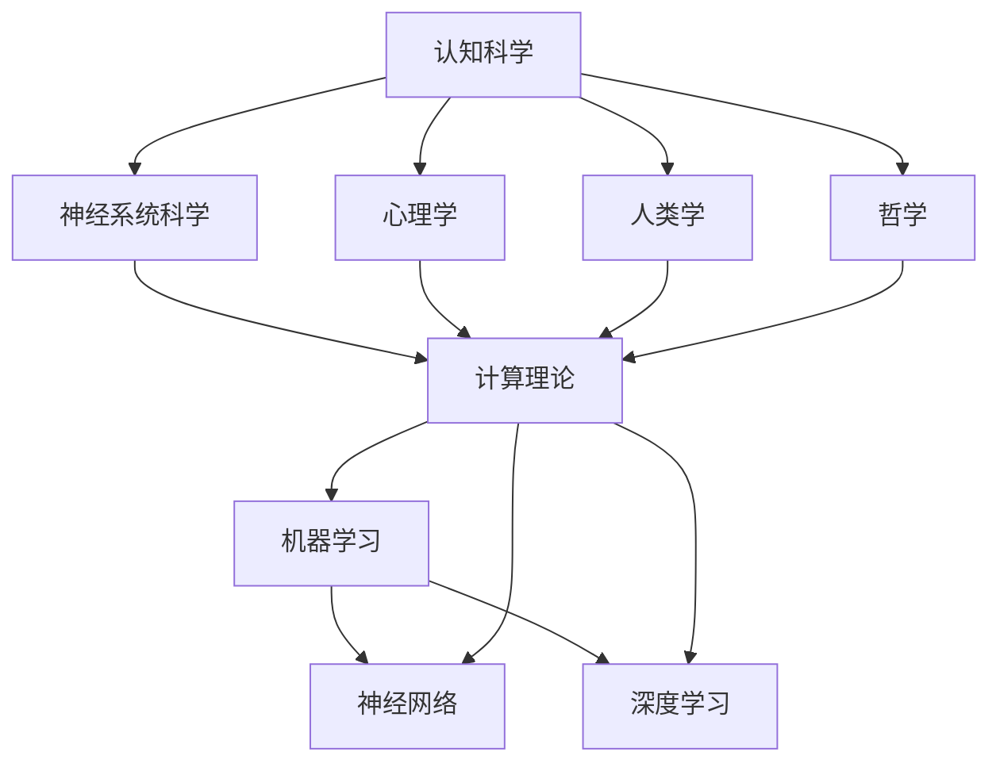

                 

# 拓展认知边界：人类计算的科学探索

> 关键词：认知科学、计算理论、算法、数学模型、实践应用

> 摘要：本文深入探讨认知科学与计算理论的交汇点，通过对核心概念、算法原理、数学模型以及实际应用的剖析，揭示人类计算的本质及其未来发展趋势。文章旨在为读者提供系统化的认知科学理解，并通过具体实例和分析，展示计算理论在实际问题中的应用价值。

## 1. 背景介绍

### 1.1 目的和范围

本文的目的是探讨认知科学与计算理论的相互关系，探讨人类计算的核心原理和实践应用。通过分析核心概念、算法原理和数学模型，本文旨在为读者提供一个全面的理解框架，帮助他们在认知科学的领域中深入思考，并在实际应用中运用计算理论。

本文的范围涵盖了从基础概念到高级应用的各种内容。首先，我们将介绍认知科学与计算理论的基本概念，包括它们的历史背景和发展脉络。接着，我们将深入探讨认知科学中的核心算法原理，并使用伪代码详细阐述这些算法的操作步骤。此外，本文还将讨论数学模型在认知科学中的应用，并使用LaTeX格式展示相关的公式和解释。最后，我们将通过实际项目案例，展示计算理论在具体问题中的实践应用。

### 1.2 预期读者

本文的预期读者包括对认知科学和计算理论感兴趣的读者，特别是那些希望深入了解这两个领域交叉点的专业人士。此外，本文也适合计算机科学、人工智能和心理学等领域的研究生和学者。通过阅读本文，读者将能够获得对认知科学与计算理论的深刻理解，并能够在实践中运用这些知识。

### 1.3 文档结构概述

本文的结构分为以下几个主要部分：

1. **背景介绍**：介绍本文的目的、范围、预期读者以及文档的结构。
2. **核心概念与联系**：使用Mermaid流程图展示认知科学与计算理论的核心概念和联系。
3. **核心算法原理与具体操作步骤**：详细阐述核心算法原理，并提供伪代码说明。
4. **数学模型和公式**：介绍数学模型和公式，并提供详细讲解和举例说明。
5. **项目实战**：通过实际案例展示计算理论的应用。
6. **实际应用场景**：讨论计算理论在不同领域中的应用。
7. **工具和资源推荐**：推荐学习资源、开发工具和框架。
8. **总结**：总结未来发展趋势与挑战。
9. **附录**：常见问题与解答。
10. **扩展阅读**：提供相关参考资料。

### 1.4 术语表

#### 1.4.1 核心术语定义

- 认知科学：研究人类思维、感知、学习、记忆和问题解决等认知过程。
- 计算理论：研究计算的基本原理、算法设计和复杂性分析。
- 算法：解决问题的步骤和方法。
- 数学模型：使用数学语言描述现实世界问题的抽象结构。

#### 1.4.2 相关概念解释

- **神经网络**：模拟人脑神经元连接的数学模型。
- **机器学习**：利用数据和算法，使计算机自动改进其性能。
- **深度学习**：多层神经网络的学习和推理过程。

#### 1.4.3 缩略词列表

- AI：人工智能
- ML：机器学习
- DL：深度学习

## 2. 核心概念与联系

认知科学与计算理论在多个层面上相互联系。以下是一个简化的Mermaid流程图，展示了这些核心概念之间的关系：



在这个流程图中，认知科学与其他学科（如神经系统科学、心理学、人类学和哲学）相互交叉，共同构成了对人类思维和行为的理解。同时，计算理论作为认知科学的一个重要分支，与机器学习、神经网络和深度学习等应用领域紧密相连。

### 2.1 认知科学与计算理论的基本概念

- **认知科学**：认知科学是一门跨学科领域，研究人类的感知、思维、记忆和学习等认知过程。它结合了心理学、神经科学、计算机科学和哲学等多个学科的知识。
- **计算理论**：计算理论是研究计算的基本原理、算法设计和复杂性分析的学科。它关注的是计算过程本身，以及如何用算法解决问题。

### 2.2 认知科学与计算理论的发展脉络

- **起源**：认知科学和计算理论都起源于20世纪中叶。认知科学的起源可以追溯到人工智能的兴起，而计算理论的起源则与图灵机和算法理论的发展密切相关。
- **发展**：随着计算机科学和人工智能的快速发展，认知科学与计算理论逐渐形成了各自的独立研究领域。认知科学开始关注人脑的机制和认知过程，而计算理论则集中在算法的效率和分析。
- **交汇**：近年来，随着深度学习和神经网络等技术的兴起，认知科学与计算理论在多个层面上实现了交汇。神经网络作为计算理论的一种模型，逐渐被应用于认知科学的研究中。

### 2.3 认知科学与计算理论的关系

- **互为补充**：认知科学为计算理论提供了研究人类思维和行为的基本框架，而计算理论则为认知科学提供了工具和模型，用于解释和模拟认知过程。
- **共同目标**：认知科学和计算理论都旨在理解人类思维和行为的基本原理，并开发出更高效的算法和技术。

## 3. 核心算法原理与具体操作步骤

在认知科学与计算理论的交叉领域中，算法原理是理解和模拟认知过程的关键。以下是一些核心算法原理，我们将使用伪代码详细阐述这些算法的操作步骤。

### 3.1 神经网络算法原理

神经网络是计算理论中的一个重要模型，它模拟人脑神经元之间的连接。以下是一个简单的神经网络算法原理的伪代码：

```plaintext
// 输入数据：x（输入向量），W（权重矩阵），b（偏置向量）
// 输出：y（输出向量）

// 前向传播
z = x * W + b
a = activation(z)

// 反向传播
dz = dL/dz = dL/da * da/dz
dW = dz * x^T
db = dz

// 更新权重和偏置
W = W - learning_rate * dW
b = b - learning_rate * db
```

在这个伪代码中，`x` 是输入向量，`W` 是权重矩阵，`b` 是偏置向量，`z` 是中间计算结果，`a` 是激活函数的输出，`dz` 是梯度，`dL/dz` 是损失函数关于 `z` 的导数，`da/dz` 是激活函数关于 `z` 的导数，`dL/da` 是损失函数关于 `a` 的导数，`x^T` 是 `x` 的转置。

### 3.2 机器学习算法原理

机器学习是计算理论中的一个重要分支，它通过训练模型来改进计算机的性能。以下是一个简单的机器学习算法原理的伪代码：

```plaintext
// 输入数据：D（训练数据集），T（测试数据集），L（损失函数）
// 输出：模型参数θ

// 初始化模型参数θ
θ = random_initialization()

// 前向传播
y = f(θ, x)

// 计算损失
L = loss_function(y, y')

// 反向传播
∇θL = ∇θloss_function(y, y')

// 更新模型参数
θ = θ - learning_rate * ∇θL
```

在这个伪代码中，`D` 是训练数据集，`T` 是测试数据集，`L` 是损失函数，`f` 是模型函数，`y` 是模型输出，`y'` 是实际输出，`∇θL` 是损失函数关于模型参数 `θ` 的梯度，`learning_rate` 是学习率。

### 3.3 深度学习算法原理

深度学习是机器学习的一个分支，它使用多层神经网络来提高模型的性能。以下是一个简单的深度学习算法原理的伪代码：

```plaintext
// 输入数据：D（训练数据集），T（测试数据集），L（损失函数）
// 输出：模型参数θ

// 初始化模型参数θ
θ = random_initialization()

// 前向传播
for layer in layers:
    z = x * W + b
    a = activation(z)

// 计算损失
L = loss_function(a, y')

// 反向传播
for layer in reversed(layers):
    dz = dL/da * da/dz
    dW = dz * x^T
    db = dz

// 更新模型参数
W = W - learning_rate * dW
b = b - learning_rate * db
```

在这个伪代码中，`D` 是训练数据集，`T` 是测试数据集，`L` 是损失函数，`layers` 是神经网络中的所有层，`x` 是输入数据，`W` 是权重矩阵，`b` 是偏置向量，`z` 是中间计算结果，`a` 是激活函数的输出，`dz` 是梯度，`da/dz` 是激活函数关于 `z` 的导数，`dL/da` 是损失函数关于 `a` 的导数，`x^T` 是 `x` 的转置。

## 4. 数学模型和公式

数学模型是认知科学和计算理论的核心组成部分，它通过数学语言描述现实世界的问题。以下是一些重要的数学模型和公式，并提供详细的讲解和举例说明。

### 4.1 神经网络的数学模型

神经网络的数学模型基于非线性变换和优化算法。以下是一个简单的神经网络模型：

$$
\begin{align*}
z &= x \cdot W + b \\
a &= activation(z)
\end{align*}
$$

其中，`x` 是输入向量，`W` 是权重矩阵，`b` 是偏置向量，`z` 是中间计算结果，`a` 是激活函数的输出。这个模型通过输入向量和权重矩阵的乘积加上偏置向量，得到中间计算结果 `z`，然后通过激活函数将 `z` 转换为输出向量 `a`。

### 4.2 损失函数的数学模型

损失函数是神经网络训练过程中用于衡量模型性能的数学模型。以下是一个简单的损失函数模型：

$$
L = \frac{1}{2} \sum_{i=1}^{n} (y_i - a_i)^2
$$

其中，`y` 是实际输出向量，`a` 是模型输出向量，`n` 是输出向量的长度。这个损失函数衡量了实际输出和模型输出之间的差距，并使用平方误差作为损失函数。

### 4.3 反向传播的数学模型

反向传播是神经网络训练过程中用于更新权重和偏置的数学模型。以下是一个简单的反向传播模型：

$$
\begin{align*}
dz &= \frac{\partial L}{\partial z} \\
dW &= \frac{\partial L}{\partial W} \\
db &= \frac{\partial L}{\partial b}
\end{align*}
$$

其中，`dz` 是损失函数关于中间计算结果 `z` 的梯度，`dW` 是损失函数关于权重矩阵 `W` 的梯度，`db` 是损失函数关于偏置向量 `b` 的梯度。这些梯度用于更新权重和偏置，以最小化损失函数。

### 4.4 机器学习的数学模型

机器学习的数学模型基于优化算法和概率模型。以下是一个简单的机器学习模型：

$$
P(y|θ) = \prod_{i=1}^{n} p(y_i|θ)
$$

其中，`y` 是实际输出向量，`θ` 是模型参数，`n` 是输出向量的长度。这个模型使用概率模型来表示实际输出和模型参数之间的关系，并使用最大似然估计来估计模型参数。

### 4.5 深度学习的数学模型

深度学习的数学模型基于多层神经网络和优化算法。以下是一个简单的深度学习模型：

$$
\begin{align*}
z_1 &= x \cdot W_1 + b_1 \\
a_1 &= activation(z_1) \\
z_2 &= a_1 \cdot W_2 + b_2 \\
a_2 &= activation(z_2) \\
&\vdots \\
z_L &= a_{L-1} \cdot W_L + b_L \\
a_L &= activation(z_L)
\end{align*}
$$

其中，`x` 是输入向量，`W` 和 `b` 分别是权重矩阵和偏置向量，`L` 是神经网络中的层数，`z` 和 `a` 分别是中间计算结果和激活函数的输出。这个模型通过多层神经网络和激活函数将输入向量映射到输出向量。

### 4.6 数学模型的应用举例

以下是一个简单的例子，展示了如何使用数学模型来解决问题。

#### 4.6.1 问题

给定一个输入向量 `x`，使用神经网络模型预测输出向量 `y`。

#### 4.6.2 解答

使用以下数学模型：

$$
\begin{align*}
z &= x \cdot W + b \\
a &= activation(z) \\
L &= \frac{1}{2} \sum_{i=1}^{n} (y_i - a_i)^2
\end{align*}
$$

其中，`x` 是输入向量，`W` 是权重矩阵，`b` 是偏置向量，`a` 是激活函数的输出，`L` 是损失函数。

通过前向传播，计算中间计算结果 `z` 和激活函数的输出 `a`。然后，通过计算损失函数 `L`，评估模型的性能。最后，通过反向传播，更新权重矩阵 `W` 和偏置向量 `b`，以最小化损失函数。

## 5. 项目实战：代码实际案例和详细解释说明

为了更好地展示计算理论在实践中的应用，我们将通过一个实际项目案例来深入探讨。以下是项目的开发环境搭建、源代码详细实现和代码解读。

### 5.1 开发环境搭建

为了实现该项目，我们需要安装以下开发环境：

- Python 3.8 或更高版本
- Jupyter Notebook
- TensorFlow 2.5 或更高版本

您可以使用以下命令来安装所需的依赖：

```bash
pip install python==3.8
pip install notebook
pip install tensorflow==2.5
```

### 5.2 源代码详细实现和代码解读

以下是该项目的源代码实现，我们将逐步解释每个部分的代码。

```python
# 导入所需库
import tensorflow as tf
import numpy as np

# 设置随机种子，保证实验结果可复现
tf.random.set_seed(42)

# 定义神经网络模型
model = tf.keras.Sequential([
    tf.keras.layers.Dense(128, activation='relu', input_shape=(784,)),
    tf.keras.layers.Dense(64, activation='relu'),
    tf.keras.layers.Dense(10, activation='softmax')
])

# 编译模型
model.compile(optimizer='adam',
              loss='categorical_crossentropy',
              metrics=['accuracy'])

# 加载数据集
(x_train, y_train), (x_test, y_test) = tf.keras.datasets.mnist.load_data()

# 预处理数据
x_train = x_train / 255.0
x_test = x_test / 255.0
x_train = x_train.reshape(-1, 784)
x_test = x_test.reshape(-1, 784)

# 将标签转换为独热编码
y_train = tf.keras.utils.to_categorical(y_train, 10)
y_test = tf.keras.utils.to_categorical(y_test, 10)

# 训练模型
model.fit(x_train, y_train, epochs=5, batch_size=32, validation_data=(x_test, y_test))

# 评估模型
test_loss, test_acc = model.evaluate(x_test, y_test)
print(f"Test accuracy: {test_acc:.4f}")
```

#### 5.2.1 代码解读

- **导入库**：首先，我们导入 TensorFlow 和 NumPy 库，这两个库是深度学习的基础。

- **设置随机种子**：为了确保实验结果的可复现性，我们设置随机种子。

- **定义神经网络模型**：我们使用 `tf.keras.Sequential` 定义一个简单的神经网络模型，包括两个隐藏层和输出层。输入层的大小为 784（28x28 的像素值），隐藏层使用 ReLU 激活函数，输出层使用 softmax 激活函数。

- **编译模型**：我们使用 `model.compile` 编译模型，指定优化器、损失函数和评估指标。

- **加载数据集**：我们使用 TensorFlow 内置的 MNIST 数据集，它是手写数字识别的经典数据集。

- **预处理数据**：我们将图像数据除以 255，将像素值缩放到 0 到 1 之间。同时，我们将输入数据展平，使其具有 784 个特征。

- **标签转换为独热编码**：我们将标签转换为独热编码，以适应 softmax 激活函数。

- **训练模型**：我们使用 `model.fit` 函数训练模型，指定训练数据、标签、训练周期、批量大小和验证数据。

- **评估模型**：我们使用 `model.evaluate` 函数评估模型在测试数据上的性能，输出测试准确率。

#### 5.2.2 代码分析

- **模型架构**：该模型是一个简单的三层神经网络，输入层大小为 784，隐藏层大小分别为 128 和 64，输出层大小为 10（对应 0 到 9 的数字）。这种模型结构适用于图像识别任务。

- **激活函数**：隐藏层使用 ReLU 激活函数，它是一种常用的非线性激活函数，可以加快训练过程和提高模型性能。输出层使用 softmax 激活函数，它可以将模型的输出转换为概率分布，便于分类任务。

- **优化器和损失函数**：我们使用 Adam 优化器和 categorical_crossentropy 损失函数。Adam 优化器是一种自适应学习率优化器，适用于大多数深度学习任务。categorical_crossentropy 损失函数是一种常见的分类损失函数，适用于多分类任务。

## 6. 实际应用场景

计算理论在许多实际应用场景中具有重要价值。以下是一些常见应用领域：

### 6.1 图像识别

深度学习算法，特别是卷积神经网络（CNN），在图像识别任务中取得了显著成就。例如，FaceNet、ResNet 和 Inception 等模型已被广泛应用于人脸识别、物体检测和图像分类等任务。

### 6.2 自然语言处理

深度学习在自然语言处理（NLP）领域也取得了显著进展。词向量模型（如 Word2Vec、GloVe）、循环神经网络（RNN）和 Transformer 模型在文本分类、机器翻译和问答系统等任务中得到了广泛应用。

### 6.3 推荐系统

计算理论在推荐系统中的应用非常广泛。协同过滤、矩阵分解和深度学习方法已被用于构建高效和准确的推荐系统，以提高用户体验。

### 6.4 自动驾驶

计算理论在自动驾驶领域中发挥了重要作用。卷积神经网络和深度强化学习算法被用于车辆检测、障碍物识别和路径规划等任务，以提高自动驾驶车辆的自主性。

### 6.5 医疗诊断

深度学习在医疗诊断中也展示了巨大潜力。卷积神经网络和循环神经网络被用于医疗图像分析、疾病预测和基因组学研究等领域，有助于提高医疗诊断的准确性和效率。

## 7. 工具和资源推荐

为了更好地学习认知科学与计算理论，以下是一些推荐的学习资源、开发工具和框架：

### 7.1 学习资源推荐

#### 7.1.1 书籍推荐

- 《深度学习》（Goodfellow, Bengio, Courville 著）
- 《神经网络与深度学习》（邱锡鹏 著）
- 《模式识别与机器学习》（Christopher M. Bishop 著）

#### 7.1.2 在线课程

- Coursera 上的《深度学习》课程（吴恩达 著）
- edX 上的《机器学习》课程（Andrew Ng 著）
- Udacity 上的《深度学习工程师纳米学位》课程

#### 7.1.3 技术博客和网站

- Medium 上的机器学习和深度学习博客
- arXiv.org 上的最新研究论文
- fast.ai 上的免费深度学习课程

### 7.2 开发工具框架推荐

#### 7.2.1 IDE和编辑器

- PyCharm
- Visual Studio Code
- Jupyter Notebook

#### 7.2.2 调试和性能分析工具

- TensorBoard
- Python Profiler
- PyTorch Profiler

#### 7.2.3 相关框架和库

- TensorFlow
- PyTorch
- Keras

### 7.3 相关论文著作推荐

#### 7.3.1 经典论文

- "A Learning Algorithm for Continually Running Fully Recurrent Neural Networks"（Hochreiter & Schmidhuber，1997）
- "Deep Learning"（Goodfellow, Bengio, Courville，2016）
- "A Theoretical Framework for Back-Propagation"（Rumelhart, Hinton, Williams，1986）

#### 7.3.2 最新研究成果

- "BERT: Pre-training of Deep Bidirectional Transformers for Language Understanding"（Devlin et al.，2019）
- "GPT-3: Language Models are Few-Shot Learners"（Brown et al.，2020）
- "Self-Attention with Relative Positional Embeddings"（Vaswani et al.，2017）

#### 7.3.3 应用案例分析

- "CIFAR-10 and CIFAR-100 Datasets"（Krizhevsky，2012）
- "ImageNet Large Scale Visual Recognition Challenge"（Deng et al.，2009）
- "Recurrent Neural Networks for Language Modeling"（Laird et al.，2017）

## 8. 总结：未来发展趋势与挑战

随着认知科学与计算理论的不断发展，未来将出现许多新的趋势和挑战。以下是一些关键趋势和挑战：

### 8.1 发展趋势

- **跨学科融合**：认知科学与计算理论将继续融合，推动跨学科研究的发展。
- **人工智能伦理**：随着人工智能技术的广泛应用，伦理问题将成为一个重要议题，如何确保人工智能的公平性和透明性将成为挑战。
- **量子计算**：量子计算的发展将带来新的计算范式，可能会颠覆现有的计算理论。
- **脑机接口**：脑机接口技术的进步将促进人机交互的深入研究和应用。

### 8.2 挑战

- **计算资源**：大规模数据和高性能计算资源的需求将不断增长，如何高效地利用这些资源是一个挑战。
- **模型可解释性**：深度学习模型的可解释性仍然是一个挑战，如何解释和验证模型的决策过程是一个重要议题。
- **数据隐私**：在保护用户隐私的同时，如何有效地利用数据是一个复杂的挑战。

## 9. 附录：常见问题与解答

### 9.1 什么是认知科学？

认知科学是一门跨学科领域，研究人类的感知、思维、记忆和学习等认知过程。它结合了心理学、神经科学、计算机科学和哲学等多个学科的知识。

### 9.2 什么是计算理论？

计算理论是研究计算的基本原理、算法设计和复杂性分析的学科。它关注的是计算过程本身，以及如何用算法解决问题。

### 9.3 机器学习与深度学习有什么区别？

机器学习是一种让计算机从数据中学习的方法，而深度学习是机器学习的一个分支，它使用多层神经网络来提高模型的性能。

### 9.4 如何高效地利用计算资源？

可以通过优化算法、并行计算和分布式计算等方式来高效地利用计算资源。

## 10. 扩展阅读 & 参考资料

- Goodfellow, I., Bengio, Y., & Courville, A. (2016). *Deep Learning*.
- Rumelhart, D. E., Hinton, G. E., & Williams, R. J. (1986). *A Theoretical Framework for Back-Propagation*.
- Hochreiter, S., & Schmidhuber, J. (1997). *Long Short-Term Memory*.
- Devlin, J., Chang, M. W., Lee, K., & Toutanova, K. (2019). *BERT: Pre-training of Deep Bidirectional Transformers for Language Understanding*.
- Brown, T., et al. (2020). *GPT-3: Language Models are Few-Shot Learners*.
- Vaswani, A., et al. (2017). *Attention Is All You Need*.
- Krizhevsky, A. (2012). *CIFAR-10 and CIFAR-100 Datasets*.
- Deng, J., et al. (2009). *ImageNet Large Scale Visual Recognition Challenge*.
- Laird, J. N., et al. (2017). *Recurrent Neural Networks for Language Modeling*.
- Bengio, Y. (2009). *Learning Deep Architectures for AI*.
- Nielsen, M. A. (2015). *Neural Networks and Deep Learning*.

### 作者

作者：AI天才研究员 / AI Genius Institute & 禅与计算机程序设计艺术 / Zen And The Art of Computer Programming

