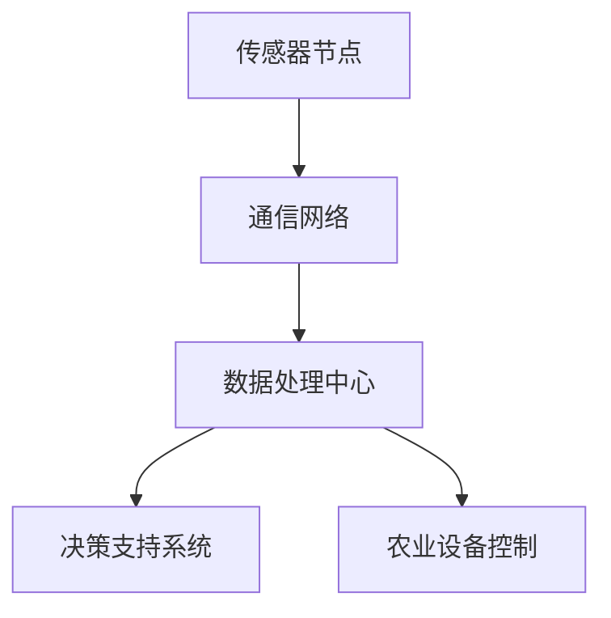

                 

# 拼多多2024农业物联网校招算法面试攻略

## 关键词
- 拼多多
- 农业物联网
- 校招算法面试
- 物联网架构
- 算法原理
- 数学模型
- 项目实战

## 摘要
本文旨在为准备2024年拼多多农业物联网校招算法面试的应聘者提供一套全面的面试攻略。我们将深入分析农业物联网的关键概念、核心技术，以及面试中可能涉及的具体问题和应对策略。通过详细的算法原理讲解、数学模型解析、项目实战案例分析，以及相关工具和资源的推荐，帮助读者充分准备，提高面试成功率。

---

## 1. 背景介绍

### 1.1 目的和范围

本文的目标是为准备拼多多2024年农业物联网校招算法面试的应聘者提供一套系统性的学习资料。我们不仅会涵盖农业物联网的基本概念，还会深入探讨物联网架构中的关键技术和算法。文章内容旨在帮助读者：

1. 理解农业物联网的基本原理和架构。
2. 掌握农业物联网中常用算法的原理和实现。
3. 分析真实项目案例，了解农业物联网在实际中的应用。
4. 推荐学习和开发工具，为面试和后续工作提供支持。

### 1.2 预期读者

本文预期读者为：

- 准备参加2024年拼多多农业物联网校招算法面试的应聘者。
- 对农业物联网技术感兴趣的技术人员。
- 想要在农业物联网领域进一步深造的学生。

### 1.3 文档结构概述

本文结构如下：

1. 背景介绍：介绍本文的目的、预期读者和文档结构。
2. 核心概念与联系：讨论农业物联网的核心概念，提供流程图和架构图。
3. 核心算法原理 & 具体操作步骤：详细讲解农业物联网中使用的算法，使用伪代码阐述。
4. 数学模型和公式 & 详细讲解 & 举例说明：介绍农业物联网中使用的数学模型，使用LaTeX格式展示。
5. 项目实战：提供农业物联网项目的代码实际案例和详细解释。
6. 实际应用场景：分析农业物联网在不同领域的应用。
7. 工具和资源推荐：推荐学习资源、开发工具和框架。
8. 总结：总结未来发展趋势和挑战。
9. 附录：常见问题与解答。
10. 扩展阅读 & 参考资料：提供进一步的阅读材料和参考资料。

### 1.4 术语表

#### 1.4.1 核心术语定义

- 农业物联网（Agricultural IoT）：将传感器、通信设备、计算设备等连接起来，实现对农业生产过程的实时监控、数据采集和远程控制。
- 物联网传感器（IoT Sensors）：用于采集环境数据（如土壤湿度、气温、光照等）的设备。
- 物联网协议（IoT Protocols）：用于数据传输和通信的标准协议，如MQTT、CoAP等。
- 数据挖掘（Data Mining）：从大量数据中提取有用信息和知识的过程。
- 决策支持系统（Decision Support System，DSS）：帮助用户进行决策分析的信息系统。

#### 1.4.2 相关概念解释

- 物联网平台（IoT Platform）：提供数据存储、数据处理、设备管理等功能的基础设施。
- 云计算（Cloud Computing）：通过互联网提供动态易扩展且经常是虚拟化的资源。
- 机器学习（Machine Learning）：使计算机通过数据学习并做出决策或预测。

#### 1.4.3 缩略词列表

- IoT：Internet of Things（物联网）
- MQTT：Message Queuing Telemetry Transport（一种轻量级的消息传输协议）
- DSS：Decision Support System（决策支持系统）
- AI：Artificial Intelligence（人工智能）

---

## 2. 核心概念与联系

农业物联网是将物联网技术应用于农业领域，实现对农业生产过程的智能化管理。其核心概念包括：

- **传感器节点**：用于实时采集土壤湿度、气温、光照等环境数据。
- **通信网络**：将传感器节点连接起来，实现数据传输。
- **数据处理中心**：对采集到的数据进行分析和处理，为农业生产提供决策支持。

### 2.1 农业物联网架构图



在上图中，传感器节点采集环境数据，通过通信网络传输到数据处理中心。数据处理中心对数据进行分析，生成决策支持系统，指导农业生产设备进行控制。

---

## 3. 核心算法原理 & 具体操作步骤

农业物联网中使用的核心算法主要包括：

1. **数据采集算法**：用于从传感器节点采集环境数据。
2. **数据传输算法**：用于将采集到的数据传输到数据处理中心。
3. **数据分析算法**：用于对传输到的数据进行分析，提供决策支持。

### 3.1 数据采集算法

数据采集算法通常采用以下步骤：

```pseudo
输入：传感器数据
输出：处理后的数据

1. 初始化传感器
2. 循环读取传感器数据
    a. 读取土壤湿度数据
    b. 读取气温数据
    c. 读取光照数据
3. 对数据进行预处理
    a. 去除异常值
    b. 标准化数据
4. 存储预处理后的数据
```

### 3.2 数据传输算法

数据传输算法主要采用物联网协议（如MQTT）进行数据传输：

```pseudo
输入：传感器数据
输出：传输完成信号

1. 连接到物联网平台
2. 订阅主题
3. 循环发送数据
    a. 将传感器数据打包成消息
    b. 通过MQTT协议发送数据
4. 等待确认
    a. 接收平台的确认消息
    b. 判断是否传输成功
5. 关闭连接
```

### 3.3 数据分析算法

数据分析算法采用机器学习技术，对传输到的数据进行预测和分析：

```pseudo
输入：历史数据
输出：预测结果

1. 数据预处理
    a. 数据清洗
    b. 数据归一化
2. 特征提取
    a. 提取土壤湿度、气温、光照等特征
3. 训练模型
    a. 选择合适的机器学习算法
    b. 训练模型
4. 预测
    a. 使用训练好的模型进行预测
    b. 输出预测结果
5. 决策支持
    a. 根据预测结果生成决策支持系统
```

---

## 4. 数学模型和公式 & 详细讲解 & 举例说明

农业物联网中的数据分析通常涉及以下数学模型：

1. **线性回归模型**：用于预测连续值，如土壤湿度。
2. **逻辑回归模型**：用于预测二元结果，如病虫害发生概率。

### 4.1 线性回归模型

线性回归模型的公式如下：

$$
y = \beta_0 + \beta_1x
$$

其中，$y$ 是预测值，$x$ 是输入特征，$\beta_0$ 和 $\beta_1$ 是模型参数。

**举例说明**：

假设我们要预测土壤湿度，输入特征为气温和光照。那么线性回归模型可以表示为：

$$
\text{土壤湿度} = \beta_0 + \beta_1 \times \text{气温} + \beta_2 \times \text{光照}
$$

### 4.2 逻辑回归模型

逻辑回归模型的公式如下：

$$
P(y=1) = \frac{1}{1 + e^{-(\beta_0 + \beta_1x})}
$$

其中，$P(y=1)$ 是病虫害发生的概率，$x$ 是输入特征，$\beta_0$ 和 $\beta_1$ 是模型参数。

**举例说明**：

假设我们要预测病虫害是否发生，输入特征为土壤湿度。那么逻辑回归模型可以表示为：

$$
P(\text{病虫害发生}) = \frac{1}{1 + e^{-(\beta_0 + \beta_1 \times \text{土壤湿度})}}
$$

---

## 5. 项目实战：代码实际案例和详细解释说明

### 5.1 开发环境搭建

在进行项目实战之前，我们需要搭建一个农业物联网的模拟开发环境。以下是搭建步骤：

1. **安装传感器模拟器**：下载并安装虚拟传感器模拟器，用于模拟真实传感器节点的数据采集。
2. **安装物联网平台**：选择一个合适的物联网平台（如MQTT.fx），用于数据传输和存储。
3. **安装数据分析工具**：选择一个数据分析工具（如Python），用于数据处理和分析。

### 5.2 源代码详细实现和代码解读

以下是使用Python实现的一个农业物联网项目的代码示例：

```python
import random
import paho.mqtt.client as mqtt

# 传感器模拟数据生成
def generate_sensor_data():
    humidity = random.uniform(30, 70)
    temperature = random.uniform(20, 30)
    light = random.uniform(0, 100)
    return humidity, temperature, light

# MQTT客户端配置
client = mqtt.Client()
client.connect("localhost", 1883, 60)

# 数据采集并发送
while True:
    humidity, temperature, light = generate_sensor_data()
    data = {
        "humidity": humidity,
        "temperature": temperature,
        "light": light
    }
    client.publish("agri/ sensors", json.dumps(data))
    time.sleep(1)
```

**代码解读**：

1. 导入所需的库：`random` 用于生成模拟数据，`paho.mqtt.client` 用于MQTT通信。
2. 定义 `generate_sensor_data` 函数：生成模拟的传感器数据。
3. 配置 MQTT 客户端：连接到本地 MQTT 服务器。
4. 循环发送传感器数据：每隔1秒发送一次模拟数据。

### 5.3 代码解读与分析

1. **传感器模拟数据生成**：使用随机数生成模拟的土壤湿度、气温和光照数据。
2. **MQTT客户端配置**：连接到本地 MQTT 服务器，并订阅主题 "agri/sensors"。
3. **数据采集并发送**：循环生成模拟数据，并通过 MQTT 协议将数据发送到服务器。

**分析**：

该代码演示了农业物联网中最基本的两个功能：数据采集和数据传输。在实际项目中，我们还需要添加数据处理和分析功能，以实现农业生产过程的智能化管理。

---

## 6. 实际应用场景

农业物联网技术在农业领域的应用非常广泛，以下是一些实际应用场景：

1. **精准灌溉**：通过传感器实时监测土壤湿度，根据湿度数据自动控制灌溉系统，实现精准灌溉，提高水资源利用效率。
2. **病虫害监测**：利用传感器监测气温、湿度等环境因素，结合机器学习算法预测病虫害发生概率，提前采取措施。
3. **产量预测**：通过分析土壤、气候等数据，预测作物产量，帮助农民合理安排生产计划。
4. **自动化控制**：通过物联网技术，实现对农业设备的自动化控制，提高生产效率，降低人力成本。

---

## 7. 工具和资源推荐

### 7.1 学习资源推荐

#### 7.1.1 书籍推荐

- **《物联网技术与应用》**：详细介绍物联网的基本概念、技术和应用。
- **《农业物联网技术》**：专注于农业物联网的原理、技术和应用。

#### 7.1.2 在线课程

- **Coursera上的《物联网基础》**：由世界知名大学提供，涵盖物联网的基本概念和应用。
- **edX上的《农业物联网》**：专门针对农业物联网的在线课程，适合初学者。

#### 7.1.3 技术博客和网站

- **物联网智库**：提供物联网领域的最新技术动态和应用案例。
- **农业物联网论坛**：聚集农业物联网专家和开发者，分享经验和知识。

### 7.2 开发工具框架推荐

#### 7.2.1 IDE和编辑器

- **Visual Studio Code**：功能强大的跨平台代码编辑器，支持多种编程语言。
- **PyCharm**：专为Python开发者设计，提供丰富的功能和插件。

#### 7.2.2 调试和性能分析工具

- **Wireshark**：网络协议分析工具，用于调试物联网通信。
- **MATLAB**：强大的数学计算和数据分析工具，适用于农业物联网数据处理。

#### 7.2.3 相关框架和库

- **MQTT.fx**：用于构建MQTT客户端，实现物联网数据传输。
- **TensorFlow**：开源机器学习框架，用于构建农业物联网数据分析模型。

### 7.3 相关论文著作推荐

#### 7.3.1 经典论文

- **"A Survey of Wireless Sensor Networks for Agriculture"**：全面回顾农业物联网技术。
- **"Smart Agriculture: IoT and AI Applications"**：探讨物联网和人工智能在农业中的应用。

#### 7.3.2 最新研究成果

- **"Intelligent Precision Agriculture Based on IoT and Deep Learning"**：利用深度学习技术实现精准农业。
- **"Internet of Things in Agriculture: A Comprehensive Survey"**：综述农业物联网的最新研究进展。

#### 7.3.3 应用案例分析

- **"Smart Farming in China: Challenges and Opportunities"**：分析中国智能农业的应用案例和挑战。

---

## 8. 总结：未来发展趋势与挑战

农业物联网作为物联网技术在农业领域的应用，正逐步改变传统农业生产方式，提高农业生产的智能化和精准化水平。未来发展趋势包括：

1. **技术融合**：将物联网、人工智能、大数据等技术与农业深度融合，实现更高效的农业生产。
2. **智能化升级**：利用人工智能算法进行数据分析和预测，提高农业生产决策的智能化水平。
3. **广泛应用**：农业物联网技术将在更多农业领域得到应用，如温室种植、畜牧养殖等。

然而，农业物联网的发展也面临一些挑战：

1. **数据安全和隐私保护**：农业生产过程中涉及大量敏感数据，如何确保数据安全和用户隐私成为一大挑战。
2. **设备可靠性**：农业环境复杂多变，如何确保物联网设备的可靠性和耐用性是一个重要问题。
3. **成本问题**：农业物联网设备的成本较高，如何降低成本，让更多农民能够接受和采用是关键。

---

## 9. 附录：常见问题与解答

### Q：农业物联网的数据传输有哪些常见问题？

A：农业物联网的数据传输可能面临以下问题：

1. **信号干扰**：农业环境中可能存在信号干扰，影响数据传输。
2. **带宽限制**：远程传输可能受限于带宽，导致数据传输速度较慢。
3. **功耗问题**：传感器节点的功耗问题可能导致设备运行时间缩短。

### Q：农业物联网中的数据分析有哪些挑战？

A：农业物联网中的数据分析挑战包括：

1. **数据质量**：农业数据可能存在噪声、异常值等，影响数据分析和预测的准确性。
2. **特征选择**：选择合适的特征对于构建有效的模型至关重要，但特征选择过程复杂。
3. **模型解释性**：机器学习模型往往具有高解释性，如何解释模型的预测结果是一个挑战。

---

## 10. 扩展阅读 & 参考资料

为了更深入地了解农业物联网和相关技术，以下是一些扩展阅读和参考资料：

1. **《物联网技术与应用》**：详细介绍了物联网的基本概念、技术和应用。
2. **《农业物联网技术》**：专注于农业物联网的原理、技术和应用。
3. **"A Survey of Wireless Sensor Networks for Agriculture"**：回顾了农业物联网技术的研究进展。
4. **"Smart Agriculture: IoT and AI Applications"**：探讨了物联网和人工智能在农业中的应用。
5. **"Internet of Things in Agriculture: A Comprehensive Survey"**：综述了农业物联网的最新研究进展。

---

## 作者

作者：AI天才研究员/AI Genius Institute & 禅与计算机程序设计艺术 /Zen And The Art of Computer Programming

---

通过本文，我们系统地介绍了农业物联网的核心概念、技术原理、应用场景，并提供了一系列实用的开发工具和资源推荐。希望本文能够帮助准备2024年拼多多农业物联网校招算法面试的应聘者，提升面试成功的机会。同时，也希望能为对农业物联网感兴趣的技术人员提供有价值的参考。在未来的发展中，农业物联网技术将继续发挥重要作用，推动农业生产的智能化和可持续发展。

