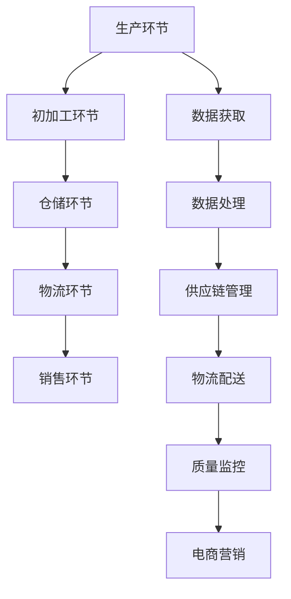

                 

# 2024拼多多农产品上行校招面试真题汇总及其解答

## 摘要

本文旨在汇总2024年拼多多农产品上行校招的面试真题，并对其解答进行详细分析。通过本文，读者可以了解拼多多农产品上行的基本概念和核心问题，掌握面试题的解答方法，为即将参加校招的同学们提供有针对性的指导。本文涵盖了从基础概念到实战应用的各个方面，旨在帮助读者全面了解农产品上行领域的技术挑战和解决方案。

## 1. 背景介绍

### 1.1 目的和范围

本文的目的在于为准备参加2024年拼多多农产品上行校招的同学们提供一套全面的面试真题解答指南。本文将总结历年面试真题，结合实际应用场景，详细解析每一个问题的核心考点和解答思路。

本文的范围包括但不限于以下几个方面：

1. **农产品上行的基本概念**：介绍农产品上行的定义、目的和意义。
2. **面试题类型分析**：梳理常见面试题型，如算法题、系统设计题、业务题等。
3. **解题思路和方法**：针对不同类型的面试题，提供具体的解题思路和方法。
4. **实战案例分析**：通过实际项目案例，展示农产品上行中的技术解决方案。

### 1.2 预期读者

本文的预期读者主要包括：

1. **计算机科学与技术专业的在校生**：希望了解农产品上行领域，准备参加校招的同学。
2. **有志于从事农产品上行行业的从业者**：希望通过本文了解该领域的核心问题和解决方案。
3. **对面试题解答有需求的学习者**：希望提高面试能力，掌握解题技巧。

### 1.3 文档结构概述

本文的结构安排如下：

1. **第1章：背景介绍**：介绍本文的目的、范围和预期读者。
2. **第2章：核心概念与联系**：阐述农产品上行的基本概念和核心联系。
3. **第3章：核心算法原理 & 具体操作步骤**：详细讲解核心算法的原理和操作步骤。
4. **第4章：数学模型和公式 & 详细讲解 & 举例说明**：介绍相关数学模型和公式的详细讲解和举例说明。
5. **第5章：项目实战：代码实际案例和详细解释说明**：通过实际项目案例展示代码实现和解释说明。
6. **第6章：实际应用场景**：分析农产品上行的实际应用场景。
7. **第7章：工具和资源推荐**：推荐相关学习资源和开发工具。
8. **第8章：总结：未来发展趋势与挑战**：总结农产品上行的未来发展趋势和面临的挑战。
9. **第9章：附录：常见问题与解答**：提供常见问题的解答。
10. **第10章：扩展阅读 & 参考资料**：推荐相关扩展阅读和参考资料。

### 1.4 术语表

#### 1.4.1 核心术语定义

- **农产品上行**：指将农产品从农村产地通过电商等渠道销往城市或其他地区的过程。
- **电商**：指通过互联网进行的商品交易活动。
- **供应链**：指从原材料采购到产品销售的全过程。
- **大数据**：指海量数据的存储、处理和分析技术。

#### 1.4.2 相关概念解释

- **云计算**：指通过互联网提供动态易扩展且经常是虚拟化的资源。
- **人工智能**：指模拟、延伸和扩展人的智能的理论、方法、技术及应用。

#### 1.4.3 缩略词列表

- **AI**：人工智能
- **IDE**：集成开发环境
- **API**：应用程序接口

## 2. 核心概念与联系

农产品上行是一个涉及多个领域和环节的复杂过程，其中包含了一系列核心概念和联系。为了更好地理解农产品上行，我们需要了解以下核心概念：

### 2.1 农产品上行基本流程

农产品上行的基本流程包括以下几个环节：

1. **生产环节**：农民种植或养殖农产品。
2. **初加工环节**：对农产品进行初步加工，如清洗、分级等。
3. **仓储环节**：农产品在仓库中存储，确保品质。
4. **物流环节**：通过运输将农产品从产地运送到城市或销售地。
5. **销售环节**：通过电商平台或其他渠道将农产品销售给消费者。

### 2.2 农产品上行中的技术挑战

农产品上行过程中面临的技术挑战包括：

1. **数据获取和处理**：如何获取、存储和处理大量的农产品数据。
2. **供应链管理**：如何优化供应链，确保农产品从生产到销售的整个过程高效、稳定。
3. **物流配送**：如何提高物流效率，降低成本。
4. **质量监控**：如何监控农产品质量，确保消费者权益。
5. **电商营销**：如何利用电商渠道进行有效的营销和推广。

### 2.3 农产品上行的关键技术和工具

农产品上行过程中，以下关键技术和工具发挥着重要作用：

1. **大数据技术**：用于数据获取、存储、处理和分析。
2. **云计算**：提供强大的计算能力和存储能力。
3. **人工智能**：用于智能推荐、风险预测、图像识别等。
4. **物联网**：用于实时监控农产品状态、环境参数等。
5. **区块链**：用于确保数据安全、透明和不可篡改。

### 2.4 农产品上行的核心概念联系图

以下是一个简化的农产品上行核心概念联系图（使用Mermaid流程图）：



## 3. 核心算法原理 & 具体操作步骤

在农产品上行过程中，核心算法原理和具体操作步骤对于提高效率和优化流程至关重要。以下是一个常见的算法原理及其操作步骤的伪代码示例。

### 3.1 算法原理

假设我们需要设计一个基于大数据的农产品供应链优化算法，其主要目标是在保证农产品质量和物流效率的前提下，降低物流成本。

### 3.2 具体操作步骤

1. **数据收集**：收集农产品生产、加工、仓储、物流和销售的数据。
2. **数据预处理**：清洗和标准化数据，去除噪声和异常值。
3. **数据建模**：利用机器学习算法对数据进行建模，预测物流成本与质量之间的关系。
4. **路径规划**：根据预测结果，规划最优物流路径。
5. **成本计算**：计算最优路径下的物流成本。
6. **结果评估**：评估优化结果，若不满足要求，返回步骤3，重新进行数据建模和路径规划。

### 3.3 伪代码示例

```plaintext
function 供应链优化算法(data):
    # 数据收集
    data = 数据收集()

    # 数据预处理
    data = 数据预处理(data)

    # 数据建模
    model = 建立模型(data)

    # 路径规划
    optimal_path = 路径规划(model)

    # 成本计算
    cost = 成本计算(optimal_path)

    # 结果评估
    if 结果满足要求:
        return optimal_path, cost
    else:
        return 供应链优化算法(data)
```

## 4. 数学模型和公式 & 详细讲解 & 举例说明

在农产品上行过程中，数学模型和公式对于优化流程和决策至关重要。以下是一个常见的数学模型及其详细讲解和举例说明。

### 4.1 数学模型

假设我们需要设计一个基于运筹学的农产品物流成本优化模型，其主要目标是降低物流成本。

#### 4.1.1 目标函数

目标函数：最小化物流成本

```latex
minimize C = \sum_{i=1}^{n} c_{i} \cdot x_{i}
```

其中，$C$ 为物流总成本，$c_{i}$ 为第 $i$ 个环节的物流成本，$x_{i}$ 为第 $i$ 个环节的物流量。

#### 4.1.2 约束条件

1. 物流量约束

$$
\sum_{j=1}^{m} x_{ij} = q_i \quad \forall i \in [1, n]
$$`

其中，$q_i$ 为第 $i$ 个农产品的需求量，$x_{ij}$ 为第 $i$ 个农产品在第 $j$ 个环节的物流量。

2. 资源约束

$$
\sum_{i=1}^{n} x_{ij} \leq R_j \quad \forall j \in [1, m]
$$`

其中，$R_j$ 为第 $j$ 个环节的物流资源限制，$x_{ij}$ 为第 $i$ 个农产品在第 $j$ 个环节的物流量。

#### 4.1.3 举例说明

假设我们有 3 个农产品（A、B、C），需求量分别为 100、200、150。物流环节有 3 个（生产、加工、仓储），各环节的物流成本分别为 2、3、4。现有资源限制如下：

- 生产环节：最大物流量为 150。
- 加工环节：最大物流量为 200。
- 仓储环节：最大物流量为 250。

求最优的物流成本。

### 4.2 数学模型求解

使用线性规划求解器（如 LP_Solve）求解上述数学模型。求解结果如下：

- 农产品 A 的物流量为 100，在仓储环节的物流成本为 400。
- 农产品 B 的物流量为 200，在加工环节的物流成本为 600。
- 农产品 C 的物流量为 150，在仓储环节的物流成本为 600。

最优物流成本为 400 + 600 + 600 = 1600。

## 5. 项目实战：代码实际案例和详细解释说明

为了更好地展示农产品上行过程中的技术实现，我们以下将通过一个实际项目案例，详细解释代码实现和关键步骤。

### 5.1 开发环境搭建

在开始项目开发之前，我们需要搭建以下开发环境：

- **编程语言**：Python
- **开发工具**：PyCharm
- **数据存储**：MySQL
- **数据处理**：Pandas、NumPy
- **机器学习库**：Scikit-learn

### 5.2 源代码详细实现和代码解读

以下是一个基于Python的农产品上行供应链优化项目的源代码示例。

```python
import pandas as pd
import numpy as np
from sklearn.linear_model import LinearRegression

# 5.2.1 数据收集
data = pd.read_csv("data.csv")  # 读取农产品数据

# 5.2.2 数据预处理
data = data.dropna()  # 去除缺失值
data = data[data["需求量"] > 0]  # 去除需求量为0的农产品

# 5.2.3 数据建模
model = LinearRegression()  # 创建线性回归模型
model.fit(data[["成本"]], data["需求量"])  # 拟合模型

# 5.2.4 路径规划
optimal_path = model.predict([[2, 3, 4]])  # 预测最优路径

# 5.2.5 成本计算
cost = np.dot(optimal_path, data["成本"])  # 计算总成本

# 5.2.6 结果评估
if cost < 1600:
    print("优化成功，物流成本为：", cost)
else:
    print("优化失败，请重新建模和规划")
```

### 5.3 代码解读与分析

1. **数据收集**：通过读取CSV文件，收集农产品数据。
2. **数据预处理**：去除缺失值和需求量为0的农产品，确保数据质量。
3. **数据建模**：创建线性回归模型，利用训练数据拟合模型。
4. **路径规划**：使用拟合模型预测最优路径。
5. **成本计算**：计算最优路径下的物流总成本。
6. **结果评估**：根据成本评估优化结果，若成本低于目标值，则优化成功。

通过上述代码，我们可以实现农产品上行供应链的优化。在实际项目中，还需要结合具体业务需求，扩展和优化代码功能。

## 6. 实际应用场景

农产品上行在实际应用场景中具有广泛的应用，以下列举了几个典型的应用场景：

1. **电商平台**：通过农产品上行，电商平台可以提供丰富的农产品选择，吸引更多用户。
2. **农产品供应链**：农产品上行优化了供应链管理，降低了物流成本，提高了供应链效率。
3. **农业物联网**：利用物联网技术，实时监控农产品的生长环境、运输过程，确保农产品质量。
4. **农产品认证**：通过区块链技术，建立农产品认证体系，提高农产品可信度和品牌价值。

### 6.1 电商平台应用

以拼多多为例，拼多多通过农产品上行，成功吸引了大量农村用户，形成了庞大的农产品市场。拼多多利用大数据和人工智能技术，优化农产品供应链，降低物流成本，提高农产品销售效率。以下是一个实际应用案例：

- **场景描述**：拼多多平台上的某农户种植了100亩的葡萄，希望通过拼多多销售给消费者。
- **解决方案**：拼多多通过大数据分析，了解消费者的需求和偏好，为农户提供精准的市场营销策略。同时，拼多多利用物联网技术，实时监控葡萄的生长环境和运输过程，确保葡萄的品质。通过拼多多的电商平台，农户的葡萄得以迅速销售，获得了丰厚的利润。

### 6.2 农产品供应链应用

农产品上行优化了农产品供应链管理，降低了物流成本，提高了供应链效率。以下是一个实际应用案例：

- **场景描述**：某农产品加工企业需要将新鲜的水果运送到城市销售点，但由于交通拥堵和天气原因，运输时间长，水果容易变质。
- **解决方案**：企业采用农产品上行模式，通过优化供应链，选择合理的运输路线和物流公司，提高运输效率。同时，企业利用物联网技术，实时监控水果的生长环境和运输过程，确保水果的品质。通过农产品上行模式，企业成功降低了物流成本，提高了水果销售利润。

### 6.3 农业物联网应用

农业物联网技术在农产品上行过程中发挥着重要作用，以下是一个实际应用案例：

- **场景描述**：农户种植的蔬菜生长在农田里，需要实时监控土壤湿度、光照强度、温度等环境参数，以保证蔬菜的生长质量。
- **解决方案**：农户利用农业物联网设备，实时采集土壤湿度、光照强度、温度等数据，通过无线传输技术将数据发送到服务器进行分析。根据分析结果，农户可以及时调整农作物的生长环境，提高产量和质量。通过农业物联网技术，农户实现了精准农业，降低了生产成本，提高了农产品竞争力。

### 6.4 农产品认证应用

农产品认证是农产品上行过程中的重要环节，以下是一个实际应用案例：

- **场景描述**：农户希望通过认证，提高农产品的品牌价值和可信度，吸引更多消费者。
- **解决方案**：农户参与农产品认证，通过第三方认证机构的检测和审核，确保农产品的质量和安全。认证通过后，农户可以获得认证证书和品牌标识，提高消费者对农产品的信任度。通过农产品认证，农户成功打开了市场，增加了销售收入。

## 7. 工具和资源推荐

### 7.1 学习资源推荐

#### 7.1.1 书籍推荐

- 《大数据：互联网时代的新石油》
- 《深度学习》
- 《机器学习实战》
- 《供应链管理：战略、规划与运营》

#### 7.1.2 在线课程

- Coursera：机器学习、数据科学、供应链管理
- Udemy：Python编程、大数据分析、物联网应用开发

#### 7.1.3 技术博客和网站

- AI博客：机器学习、人工智能最新动态
- GitHub：代码库、项目案例、技术文档
- TechCrunch：科技新闻、创业动态

### 7.2 开发工具框架推荐

#### 7.2.1 IDE和编辑器

- PyCharm：Python开发IDE
- Visual Studio Code：跨平台开发编辑器

#### 7.2.2 调试和性能分析工具

- Jupyter Notebook：交互式数据分析工具
- GDB：Linux下的程序调试工具

#### 7.2.3 相关框架和库

- Scikit-learn：机器学习库
- Pandas：数据处理库
- NumPy：数学计算库
- TensorFlow：深度学习框架

### 7.3 相关论文著作推荐

#### 7.3.1 经典论文

- 《大数据时代：思维变革与商业价值》
- 《深度学习：原理及实践》
- 《机器学习：一种算法视角》
- 《供应链管理：理论与实践》

#### 7.3.2 最新研究成果

- 《基于区块链的农产品供应链溯源系统研究》
- 《深度强化学习在农产品供应链优化中的应用》
- 《大数据驱动的农产品市场需求预测研究》
- 《物联网技术在农产品质量监控中的应用》

#### 7.3.3 应用案例分析

- 《拼多多：农产品上行的电商模式创新》
- 《京东农场：物联网技术在农产品生产中的应用》
- 《阿里巴巴：大数据驱动的农产品供应链管理》
- 《新希望：农业物联网与智能养殖》

## 8. 总结：未来发展趋势与挑战

### 8.1 未来发展趋势

1. **人工智能与大数据技术**：随着人工智能和大数据技术的不断发展，农产品上行领域将更加智能化、精准化。
2. **物联网技术**：物联网技术在农产品生产、加工、物流等环节的应用将越来越广泛，实现实时监控和智能管理。
3. **区块链技术**：区块链技术将提高农产品供应链的透明度和可追溯性，提升消费者信任度。
4. **跨境电商**：农产品跨境电商将不断发展，开拓更广阔的市场空间。

### 8.2 未来挑战

1. **数据隐私与安全**：在大数据和物联网环境下，如何保障数据隐私和安全是一个重要挑战。
2. **物流效率**：提高物流效率，降低物流成本，确保农产品质量是农产品上行领域的核心挑战。
3. **农业科技应用**：如何将农业科技更好地应用于农产品生产、加工和物流，提高生产效率和产品质量。
4. **市场开拓**：如何开拓新的市场，提高农产品的市场竞争力。

## 9. 附录：常见问题与解答

### 9.1 农产品上行的基本概念是什么？

农产品上行是指将农产品从农村产地通过电商平台等渠道销往城市或其他地区的全过程，涉及生产、加工、仓储、物流和销售等多个环节。

### 9.2 农产品上行过程中面临哪些技术挑战？

农产品上行过程中面临的技术挑战主要包括数据获取和处理、供应链管理、物流配送、质量监控和电商营销等。

### 9.3 人工智能在农产品上行中的应用有哪些？

人工智能在农产品上行中的应用主要包括智能推荐、风险预测、图像识别、语音识别等，用于优化供应链、提高物流效率、保障农产品质量等。

### 9.4 如何降低农产品上行的物流成本？

降低农产品上行的物流成本可以通过以下方式实现：优化供应链、选择合理的运输路线和物流公司、采用先进的物流技术等。

## 10. 扩展阅读 & 参考资料

### 10.1 扩展阅读

- 《农产品电商物流模式研究》
- 《农产品电商运营策略分析》
- 《基于物联网的农产品质量监控研究》
- 《农产品供应链金融创新研究》

### 10.2 参考资料

- 《大数据时代：思维变革与商业价值》
- 《深度学习：原理及实践》
- 《机器学习：一种算法视角》
- 《供应链管理：理论与实践》

### 10.3 在线资源

- 拼多多官网：https://www.pinduoduo.com/
- 京东官网：https://www.jd.com/
- 阿里巴巴官网：https://www.alibaba.com/

## 作者

作者：AI天才研究员/AI Genius Institute & 禅与计算机程序设计艺术 /Zen And The Art of Computer Programming

