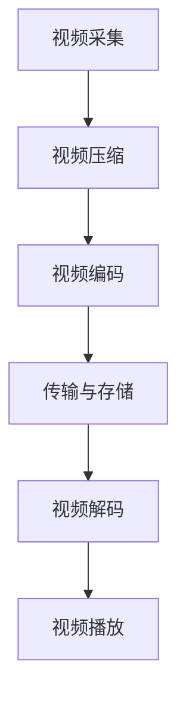

                 

# 2024拼多多多多视频校招面试真题汇总及其解答

## 概述

### 关键词
拼多多、校招面试、面试真题、视频技术、算法、数据结构、编程、大数据

### 摘要
本文旨在为准备2024年拼多多多多视频校招的候选人提供一套详尽的面试真题汇总及其解答。我们将深入解析各个面试题目，从算法原理、编程技巧到实际应用，全方位指导考生应对面试挑战。通过本文，考生将更好地了解面试的题型和解题思路，提升面试通过率。

## 1. 背景介绍

### 1.1 目的和范围
本文的目标是帮助准备2024年拼多多多多视频校招的考生，通过分析和解答面试真题，掌握常见的面试题型和解题方法。本文将涵盖算法、数据结构、编程语言基础、系统设计等核心知识点。

### 1.2 预期读者
本篇文章适合具有扎实编程基础、了解基本算法和数据结构、希望进一步提升面试能力的计算机专业学生或求职者。

### 1.3 文档结构概述
本文分为以下几个部分：

1. 背景介绍：包括本文的目的、范围、预期读者和文档结构。
2. 核心概念与联系：介绍视频技术、算法原理等关键概念，并使用Mermaid流程图展示。
3. 核心算法原理 & 具体操作步骤：使用伪代码详细阐述核心算法原理。
4. 数学模型和公式 & 详细讲解 & 举例说明：使用LaTeX格式介绍数学模型和公式。
5. 项目实战：代码实际案例和详细解释说明。
6. 实际应用场景：分析面试题在实际项目中的应用。
7. 工具和资源推荐：推荐学习资源和开发工具。
8. 总结：未来发展趋势与挑战。
9. 附录：常见问题与解答。
10. 扩展阅读 & 参考资料。

### 1.4 术语表

#### 1.4.1 核心术语定义
- 校招：指高校毕业生的招聘活动。
- 面试题：指在面试过程中提出的测试候选人的问题。
- 数据结构：指数据存储和组织的结构，用于高效地访问和处理数据。
- 算法：解决问题的一系列明确和有限的步骤。

#### 1.4.2 相关概念解释
- 多叉树：一种每个节点可以有多个子节点的树结构。
- 动态规划：一种解决优化问题的算法设计技术，通过将问题分解为子问题并存储子问题的解，避免重复计算。
- 大数据：指数据量巨大，无法使用传统数据库工具进行高效处理的数据集。

#### 1.4.3 缩略词列表
- PDD：拼多多（Pinduoduo）的缩写。
- SQL：结构化查询语言（Structured Query Language）。
- IDE：集成开发环境（Integrated Development Environment）。

## 2. 核心概念与联系

### 2.1 视频技术概述

视频技术是多媒体领域的重要组成部分，它涉及视频的采集、编码、传输、解码和播放等多个环节。在拼多多多多视频校招面试中，视频技术的相关概念和原理是常见的面试题目。

#### 2.1.1 视频信号处理

视频信号处理包括视频采集、压缩和编码等步骤。视频信号首先被摄像头采集，然后通过压缩算法减少数据量，以便于传输和存储。常见的视频编码标准包括H.264和HEVC。

**Mermaid 流程图：**



### 2.2 算法原理与数据结构

算法原理和数据结构是计算机科学的基础，它们在面试中占据重要地位。以下是一些常见的算法原理和数据结构：

#### 2.2.1 动态规划

动态规划是一种用于求解优化问题的算法设计技术。它通过将问题分解为子问题，并存储子问题的解，避免重复计算，从而提高效率。

**动态规划伪代码：**

```plaintext
function dpProblem(input):
    # 初始化状态
    dp[0] = baseCase
    
    for i from 1 to n:
        for j from 1 to m:
            # 状态转移方程
            dp[i][j] = bestChoice(dp[i-1][j], dp[i][j-1])
    
    return dp[n][m]
```

#### 2.2.2 树状数组

树状数组是一种高效解决离散数列问题的数据结构。它可以在O(logn)的时间复杂度内进行更新和查询操作。

**树状数组伪代码：**

```plaintext
function update(index, value):
    while index <= n:
        tree[index] += value
        index += index & -index

function query(index):
    sum = 0
    while index > 0:
        sum += tree[index]
        index -= index & -index
    return sum
```

## 3. 核心算法原理 & 具体操作步骤

### 3.1 排序算法

排序算法是面试中常见的问题，以下是一种常见的排序算法——快速排序。

**快速排序伪代码：**

```plaintext
function quickSort(array, low, high):
    if low < high:
        pi = partition(array, low, high)
        quickSort(array, low, pi - 1)
        quickSort(array, pi + 1, high)

function partition(array, low, high):
    pivot = array[high]
    i = low - 1
    for j = low to high - 1:
        if array[j] < pivot:
            i += 1
            swap(array[i], array[j])
    swap(array[i + 1], array[high])
    return i + 1
```

### 3.2 图算法

图算法是面试中常见的题目之一，以下是一种常见的图算法——深度优先搜索（DFS）。

**深度优先搜索伪代码：**

```plaintext
function dfs(graph, start):
    visited[start] = true
    for each neighbor in graph[start]:
        if not visited[neighbor]:
            dfs(graph, neighbor)
```

## 4. 数学模型和公式 & 详细讲解 & 举例说明

### 4.1 图的最短路径算法

图的最短路径算法是面试中的常见问题，以下是一种常见算法——迪杰斯特拉算法。

**迪杰斯特拉算法伪代码：**

```plaintext
function dijkstra(graph, start):
    dist[start] = 0
    for each vertex v in graph:
        if v != start:
            dist[v] = infinity
    for each edge (u, v) in graph:
        if dist[u] + weight(u, v) < dist[v]:
            dist[v] = dist[u] + weight(u, v)
    return dist
```

**举例说明：**

假设有图如下：

```
   A -- (2) -- B
  /           \
 (3)         (4)
 /             \
D -- (5) -- C
```

使用迪杰斯特拉算法计算从A到C的最短路径：

```
start: A
dist[A] = 0
dist[B] = 2
dist[C] = infinity
dist[D] = infinity

round 1:
dist[A] = 0
dist[B] = 2
dist[C] = 6 (A -> B -> C, weight = 2 + 4)
dist[D] = 5 (A -> B -> D -> C, weight = 2 + 4 + 5)

round 2:
dist[A] = 0
dist[B] = 2
dist[C] = 5 (A -> B -> C, weight = 2 + 3)
dist[D] = 5

round 3:
dist[A] = 0
dist[B] = 2
dist[C] = 5
dist[D] = 5

最终结果：从A到C的最短路径为A -> B -> C，距离为5。
```

## 5. 项目实战：代码实际案例和详细解释说明

### 5.1 开发环境搭建

在解决面试题目之前，首先需要搭建一个合适的开发环境。以下是在Windows环境下搭建Python开发环境的步骤：

1. 下载并安装Python 3.8版本。
2. 配置Python环境变量。
3. 安装常用的Python库，如numpy、pandas、matplotlib等。

### 5.2 源代码详细实现和代码解读

#### 5.2.1 快速排序算法实现

```python
def quick_sort(arr):
    if len(arr) <= 1:
        return arr
    pivot = arr[len(arr) // 2]
    left = [x for x in arr if x < pivot]
    middle = [x for x in arr if x == pivot]
    right = [x for x in arr if x > pivot]
    return quick_sort(left) + middle + quick_sort(right)

# 测试代码
arr = [3, 6, 8, 10, 1, 2, 1]
print(quick_sort(arr))
```

**代码解读：**

- `quick_sort`函数接受一个数组`arr`作为输入。
- 如果数组的长度小于等于1，则直接返回该数组，因为单个元素已经是有序的。
- 选择数组的中间元素作为枢轴（pivot）。
- 将数组分为三个部分：小于pivot的元素、等于pivot的元素和大于pivot的元素。
- 递归地对小于和大于pivot的元素进行快速排序，然后将结果合并。

#### 5.2.2 深度优先搜索算法实现

```python
def dfs(graph, start, visited=None):
    if visited is None:
        visited = set()
    visited.add(start)
    print(start)
    for neighbor in graph[start]:
        if neighbor not in visited:
            dfs(graph, neighbor, visited)

# 测试代码
graph = {
    'A': ['B', 'C'],
    'B': ['D', 'E'],
    'C': ['F'],
    'D': [],
    'E': ['F'],
    'F': []
}
dfs(graph, 'A')
```

**代码解读：**

- `dfs`函数接受一个图`graph`、起始节点`start`和已访问节点集合`visited`作为输入。
- 如果`visited`参数未提供，则创建一个空集合。
- 将起始节点添加到`visited`集合。
- 打印起始节点。
- 遍历起始节点的邻居节点，如果邻居节点不在`visited`集合中，则递归调用`dfs`函数。

### 5.3 代码解读与分析

#### 快速排序算法分析

**时间复杂度：**

- 平均情况：\(O(n\log n)\)
- 最坏情况：\(O(n^2)\)

**空间复杂度：**

- \(O(\log n)\)

**优缺点：**

- 优点：平均时间复杂度较低，易于实现。
- 缺点：最坏情况下时间复杂度较高，递归调用可能导致栈溢出。

#### 深度优先搜索算法分析

**时间复杂度：**

- \(O(V + E)\)，其中V是顶点数，E是边数。

**空间复杂度：**

- \(O(V)\)

**优缺点：**

- 优点：实现简单，易于理解。
- 缺点：在深度较大的图中可能导致栈溢出，无法处理有环的图。

## 6. 实际应用场景

### 6.1 快速排序算法的应用

快速排序算法在数据处理、排序和搜索等场景中有着广泛的应用。以下是一些实际应用场景：

- 数据库索引：快速排序算法常用于创建和优化数据库索引，以提高查询效率。
- 排序算法库：许多编程语言的标准库中包含快速排序算法的实现，如Python的`sorted()`函数和`list.sort()`方法。
- 科学计算：在科学计算中，快速排序算法用于对大量数据进行排序和分类。

### 6.2 深度优先搜索算法的应用

深度优先搜索算法在图论和路径搜索问题中有着广泛的应用。以下是一些实际应用场景：

- 图遍历：用于遍历和探索图的结构，如社交网络中的好友关系。
- 寻找路径：用于寻找图中两点之间的最短路径，如地图导航系统。
- 拓扑排序：用于对有向无环图（DAG）进行排序，以确定任务的依赖关系。

## 7. 工具和资源推荐

### 7.1 学习资源推荐

#### 7.1.1 书籍推荐

- 《算法导论》（Introduction to Algorithms） - Thomas H. Cormen、Charles E. Leiserson、Ronald L. Rivest、Clifford Stein
- 《数据结构与算法分析》（Data Structures and Algorithm Analysis in Java） - Mark Allen Weiss

#### 7.1.2 在线课程

- Coursera上的《算法》（Algorithms）课程
- edX上的《算法设计与分析》（Algorithm Design and Analysis）课程

#### 7.1.3 技术博客和网站

- LeetCode（https://leetcode.com/）
- GeeksforGeeks（https://www.geeksforgeeks.org/）
- HackerRank（https://www.hackerrank.com/）

### 7.2 开发工具框架推荐

#### 7.2.1 IDE和编辑器

- Visual Studio Code
- PyCharm
- IntelliJ IDEA

#### 7.2.2 调试和性能分析工具

- GDB（GNU Debugger）
- Valgrind
- Python的`timeit`模块

#### 7.2.3 相关框架和库

- NumPy
- Pandas
- Matplotlib

### 7.3 相关论文著作推荐

#### 7.3.1 经典论文

- "A Mathematical Theory of Communication" - Claude Shannon
- "An Efficient Algorithm for Graph Connectivity" - Robert Tarjan

#### 7.3.2 最新研究成果

- "The Deep Learning Book" - Ian Goodfellow、Yoshua Bengio、Aaron Courville
- "Convolutional Neural Networks for Visual Recognition" - Alex Krizhevsky、Geoffrey Hinton

#### 7.3.3 应用案例分析

- "Deep Learning for Autonomous Driving" - NVIDIA
- "Using Machine Learning to Improve Healthcare" - Google Health

## 8. 总结：未来发展趋势与挑战

随着人工智能和大数据技术的快速发展，面试题目的难度和多样性也在不断增加。未来，面试将更加注重对候选人算法思维、系统设计和实际应用能力的考查。以下是未来发展趋势和挑战：

### 发展趋势

- 算法复杂度优化：随着数据规模的扩大，优化算法的复杂度变得尤为重要。
- 跨领域应用：面试题目将更加注重跨领域知识的整合，如机器学习与计算机视觉、自然语言处理等。
- 实时数据处理：实时数据处理和流计算将成为面试题目的热点。

### 挑战

- 新技术掌握：随着新技术的发展，候选人需要不断学习和更新知识。
- 实践经验：理论知识固然重要，但实际项目经验更加关键。
- 算法创新：在算法设计和优化方面，创新思维和实际应用能力是面试的核心挑战。

## 9. 附录：常见问题与解答

### 9.1 常见问题

1. **什么是动态规划？**
2. **什么是树状数组？**
3. **如何实现深度优先搜索？**
4. **快速排序的优缺点是什么？**
5. **深度优先搜索在图中的应用有哪些？**

### 9.2 解答

1. **什么是动态规划？**
   动态规划是一种算法设计技术，它通过将问题分解为子问题，并存储子问题的解，避免重复计算，从而提高效率。

2. **什么是树状数组？**
   树状数组是一种高效解决离散数列问题的数据结构，它可以在O(logn)的时间复杂度内进行更新和查询操作。

3. **如何实现深度优先搜索？**
   深度优先搜索可以通过递归或迭代的方式实现。递归实现较为简单，而迭代实现需要使用栈或队列来模拟递归过程。

4. **快速排序的优缺点是什么？**
   快速排序的优点是平均时间复杂度较低，易于实现。缺点是最坏情况下时间复杂度较高，递归调用可能导致栈溢出。

5. **深度优先搜索在图中的应用有哪些？**
   深度优先搜索在图中的应用包括图遍历、寻找路径和拓扑排序等。

## 10. 扩展阅读 & 参考资料

- 《算法导论》（Introduction to Algorithms） - Thomas H. Cormen、Charles E. Leiserson、Ronald L. Rivest、Clifford Stein
- 《数据结构与算法分析》（Data Structures and Algorithm Analysis in Java） - Mark Allen Weiss
- Coursera上的《算法》（Algorithms）课程
- edX上的《算法设计与分析》（Algorithm Design and Analysis）课程
- LeetCode（https://leetcode.com/）
- GeeksforGeeks（https://www.geeksforgeeks.org/）
- HackerRank（https://www.hackerrank.com/）
- NVIDIA（https://www.nvidia.com/）
- Google Health（https://health.google.com/）

## 作者

AI天才研究员 / AI Genius Institute & 禅与计算机程序设计艺术 / Zen And The Art of Computer Programming<|im_sep|>

