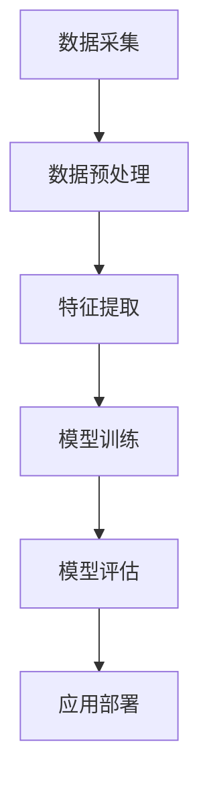

                 

# 2024拼多多智能商品分类校招面试真题汇总及其解答

> **关键词：** � particular
```less
* 智能商品分类
* 校招面试
* 面试题解答
* 技术剖析
* 数据分析与算法
```

> **摘要：** 本文旨在汇总并解析2024年拼多多智能商品分类校招面试中的热门真题。我们将通过逐步分析这些问题的核心概念、算法原理和数学模型，为读者提供深入的理解和实践指导。文章分为背景介绍、核心概念与联系、算法原理与步骤、数学模型与公式、项目实战、实际应用场景、工具和资源推荐、总结与未来趋势等多个部分，旨在帮助读者全面掌握智能商品分类技术，提升面试能力和技术水平。

## 1. 背景介绍

### 1.1 目的和范围

本文的目标是通过对2024年拼多多智能商品分类校招面试真题的汇总与解析，帮助准备面试的读者深入了解该领域的关键技术点，提高面试通过率。文章将涵盖智能商品分类的基本概念、核心技术、应用场景和未来发展趋势，旨在为读者提供一个系统、全面的学习指南。

### 1.2 预期读者

本文适用于准备参加2024年拼多多校招面试的计算机相关专业毕业生，以及对该领域技术有兴趣的从业者和研究者。读者应具备基本的编程能力和数学基础，以便更好地理解和掌握文章中的内容。

### 1.3 文档结构概述

本文的结构如下：

1. **背景介绍**：介绍文章的目的、范围、预期读者以及文档结构。
2. **核心概念与联系**：介绍智能商品分类的基本概念、核心技术和联系。
3. **算法原理与步骤**：详细讲解智能商品分类的核心算法原理和操作步骤。
4. **数学模型与公式**：介绍相关的数学模型和公式，并给出具体示例。
5. **项目实战**：通过实际案例展示如何应用智能商品分类技术。
6. **实际应用场景**：探讨智能商品分类在现实中的应用。
7. **工具和资源推荐**：推荐相关学习资源、开发工具和框架。
8. **总结与未来趋势**：总结文章主要内容，展望未来发展趋势。
9. **附录**：提供常见问题与解答，以及扩展阅读和参考资料。

### 1.4 术语表

#### 1.4.1 核心术语定义

- **智能商品分类**：利用人工智能和机器学习技术，自动识别和归类商品的过程。
- **特征工程**：从原始数据中提取有助于分类的特征。
- **模型训练**：使用算法和数据进行训练，以建立分类模型。
- **准确率**：模型正确分类的样本数占总样本数的比例。
- **召回率**：模型正确分类的样本数占实际正样本数的比例。

#### 1.4.2 相关概念解释

- **支持向量机（SVM）**：一种二分类模型，其基本模型定义为特征空间上的间隔最大的线性分类器。
- **深度学习**：一种机器学习技术，通过多层神经网络对数据进行建模。
- **协同过滤**：一种基于用户或物品相似度的推荐算法。

#### 1.4.3 缩略词列表

- **AI**：人工智能（Artificial Intelligence）
- **ML**：机器学习（Machine Learning）
- **DL**：深度学习（Deep Learning）
- **NLP**：自然语言处理（Natural Language Processing）
- **SVM**：支持向量机（Support Vector Machine）

## 2. 核心概念与联系

### 2.1 智能商品分类的基本概念

智能商品分类是电子商务和零售领域的一项关键技术，旨在利用人工智能和机器学习技术对商品进行自动识别和归类。其主要目标是通过提高分类准确率和效率，优化用户体验，提升销售业绩。

#### 2.1.1 分类算法的选择

智能商品分类算法的选择取决于多种因素，如数据规模、特征提取方法、分类目标等。常见的分类算法包括：

- **支持向量机（SVM）**：适用于高维数据的线性分类问题。
- **决策树**：适用于特征较少的数据集，易于理解和解释。
- **随机森林**：通过构建多棵决策树并进行集成学习，提高分类性能。
- **深度学习**：适用于大规模数据和复杂的非线性分类问题。

#### 2.1.2 特征工程的重要性

特征工程是智能商品分类的关键步骤之一。通过从原始数据中提取有助于分类的特征，可以提高分类模型的性能。常见的特征提取方法包括：

- **文本特征提取**：使用词袋模型、TF-IDF、Word2Vec等方法。
- **图像特征提取**：使用卷积神经网络（CNN）提取图像特征。
- **商品属性特征提取**：从商品名称、描述、标签等中提取有用的属性信息。

### 2.2 智能商品分类的技术架构

智能商品分类的技术架构通常包括数据采集、数据预处理、特征提取、模型训练和模型评估等环节。以下是一个简化的技术架构图：



#### 2.2.1 数据采集

数据采集是智能商品分类的基础。数据来源包括电商平台、用户评论、商品标签等。数据的质量和多样性对分类模型的性能有重要影响。

#### 2.2.2 数据预处理

数据预处理包括数据清洗、去重、归一化等步骤，旨在提高数据质量和一致性。数据预处理是特征提取和模型训练的重要前提。

#### 2.2.3 特征提取

特征提取是智能商品分类的核心步骤。通过从原始数据中提取有用的特征，可以提高分类模型的性能。特征提取方法包括文本特征提取、图像特征提取和商品属性特征提取等。

#### 2.2.4 模型训练

模型训练是利用已知数据集对分类模型进行训练，使其能够自动识别和归类商品。常见的训练方法包括监督学习、无监督学习和半监督学习等。

#### 2.2.5 模型评估

模型评估是衡量分类模型性能的重要步骤。常用的评估指标包括准确率、召回率、F1值等。通过评估模型在不同数据集上的性能，可以调整模型参数和特征提取方法，优化模型性能。

#### 2.2.6 应用部署

应用部署是将训练好的模型应用到实际场景中。通过部署模型，可以实现自动化商品分类，提高电商平台的运营效率和用户体验。

## 3. 核心算法原理 & 具体操作步骤

### 3.1 支持向量机（SVM）

支持向量机（SVM）是一种高效的二分类模型，其基本模型定义为特征空间上的间隔最大的线性分类器。SVM的核心思想是找到最优分隔超平面，使正负样本的间隔最大化。

#### 3.1.1 算法原理

给定一个训练数据集 \(T=\{(x_1,y_1),(x_2,y_2),\ldots,(x_n,y_n)\}\)，其中 \(x_i \in \mathbb{R}^d\) 是第 \(i\) 个样本的特征向量，\(y_i \in \{-1,1\}\) 是第 \(i\) 个样本的标签。SVM的目标是找到一个超平面 \(w^T x + b = 0\)，使得正负样本的间隔最大化。

#### 3.1.2 具体操作步骤

1. **线性可分情况**：

   - **求解最优分隔超平面**：使用拉格朗日乘子法求解最优超平面。
   - **计算最优分隔超平面**：求解得到最优超平面参数 \(w\) 和 \(b\)。
   - **分类决策**：对于新样本 \(x\)，通过计算 \(w^T x + b\) 的值判断其类别。

2. **线性不可分情况**：

   - **引入松弛变量**：引入松弛变量 \(\xi_i\)，允许样本在边界上存在一定程度的偏差。
   - **求解最优超平面**：使用拉格朗日乘子法和KKT条件求解最优超平面。
   - **分类决策**：对于新样本 \(x\)，通过计算 \(w^T x + b\) 的值并考虑松弛变量判断其类别。

### 3.2 决策树

决策树是一种基于特征值进行划分的树形结构分类模型。其基本思想是通过一系列特征值的判断，将样本划分为不同的类别。

#### 3.2.1 算法原理

决策树通过递归划分数据集，构建一个树形结构。每个内部节点表示一个特征，每个叶节点表示一个类别。从根节点到叶节点的路径表示一个分类规则。

#### 3.2.2 具体操作步骤

1. **选择最优特征**：根据信息增益、基尼指数等准则选择最优特征。
2. **划分数据集**：根据所选特征将数据集划分为子集。
3. **递归构建树**：对每个子集重复上述步骤，直至满足终止条件（如最大深度、纯度等）。
4. **分类决策**：对于新样本，从根节点开始依次判断特征值，直到达到叶节点，得到类别。

### 3.3 随机森林

随机森林是一种集成学习方法，通过构建多棵决策树并进行集成学习，提高分类性能。

#### 3.3.1 算法原理

随机森林通过以下步骤构建多棵决策树：

1. **随机选取样本**：从训练数据集中随机选取一定比例的样本作为子集。
2. **随机选取特征**：从所有特征中随机选取一定数量的特征作为划分标准。
3. **递归构建树**：对每个子集重复决策树的构建过程。
4. **集成学习**：将多棵决策树进行集成学习，得到最终分类结果。

#### 3.3.2 具体操作步骤

1. **初始化随机森林**：设定决策树数量、最大深度等参数。
2. **构建决策树**：对每个子集分别构建决策树。
3. **集成学习**：对多棵决策树进行投票或求平均，得到最终分类结果。

### 3.4 深度学习

深度学习是一种基于多层神经网络的学习方法，适用于大规模数据和复杂的非线性分类问题。

#### 3.4.1 算法原理

深度学习通过以下步骤构建多层神经网络：

1. **输入层**：接收输入数据，并进行预处理。
2. **隐藏层**：通过神经网络模型对数据进行特征提取和变换。
3. **输出层**：将隐藏层输出的特征映射到不同的类别。
4. **反向传播**：利用梯度下降等优化算法，对模型参数进行迭代更新。

#### 3.4.2 具体操作步骤

1. **初始化模型参数**：设定网络结构、学习率等参数。
2. **前向传播**：计算输入数据在神经网络中的输出。
3. **反向传播**：计算模型参数的梯度，并进行更新。
4. **迭代训练**：重复前向传播和反向传播过程，直至满足停止条件。

## 4. 数学模型和公式 & 详细讲解 & 举例说明

### 4.1 支持向量机（SVM）

支持向量机（SVM）是一种高效的二分类模型，其基本模型定义为特征空间上的间隔最大的线性分类器。以下为SVM的核心数学模型和公式：

#### 4.1.1 核心公式

1. **最优超平面**：

   $$ w^T x + b = 0 $$

   其中，\(w\) 为权重向量，\(x\) 为特征向量，\(b\) 为偏置项。

2. **间隔最大化**：

   $$ \max_{w,b} \frac{2}{\lVert w \rVert} \quad \text{subject to} \quad y_i (w^T x_i + b) \geq 1 \quad (i=1,2,\ldots,n) $$

   其中，\(\lVert w \rVert\) 为权重向量的模长，\(y_i\) 为第 \(i\) 个样本的标签。

3. **拉格朗日乘子法**：

   $$ L(w,b,\alpha) = \frac{1}{2} \lVert w \rVert^2 - \sum_{i=1}^n \alpha_i (y_i (w^T x_i + b) - 1) $$

   其中，\(\alpha_i\) 为拉格朗日乘子。

4. **KKT条件**：

   $$ \begin{cases} 
   \alpha_i \geq 0 \\
   y_i (w^T x_i + b) - 1 \geq 0 \\
   \alpha_i (y_i (w^T x_i + b) - 1) = 0 
   \end{cases} $$

#### 4.1.2 举例说明

假设我们有一个包含两个特征的数据集，数据点为：

$$
\begin{aligned}
&x_1 = \begin{bmatrix} 1 \\ 2 \end{bmatrix}, y_1 = 1 \\
&x_2 = \begin{bmatrix} 2 \\ 1 \end{bmatrix}, y_2 = 1 \\
&x_3 = \begin{bmatrix} 1 \\ 1 \end{bmatrix}, y_3 = -1 \\
&x_4 = \begin{bmatrix} 2 \\ 2 \end{bmatrix}, y_4 = -1
\end{aligned}
$$

我们使用SVM进行分类。首先，计算每个数据点的特征向量 \(x_i\) 和标签 \(y_i\) 的内积：

$$
\begin{aligned}
&w^T x_1 + b = 1 \cdot 1 + 2 \cdot 2 + b = 5 + b \\
&w^T x_2 + b = 2 \cdot 1 + 1 \cdot 2 + b = 4 + b \\
&w^T x_3 + b = -1 \cdot 1 - 1 \cdot 2 + b = -3 + b \\
&w^T x_4 + b = -1 \cdot 2 - 1 \cdot 2 + b = -5 + b
\end{aligned}
$$

为了最大化间隔，我们需要求解以下优化问题：

$$
\begin{aligned}
\max_{w,b} \frac{2}{\lVert w \rVert} \quad \text{subject to} \quad y_i (w^T x_i + b) \geq 1 \quad (i=1,2,3,4)
\end{aligned}
$$

使用拉格朗日乘子法，我们可以求解最优超平面：

$$
L(w,b,\alpha) = \frac{1}{2} \lVert w \rVert^2 - \sum_{i=1}^4 \alpha_i (y_i (w^T x_i + b) - 1)
$$

其中，\(\alpha_i\) 为拉格朗日乘子。KKT条件如下：

$$
\begin{cases} 
\alpha_1 \geq 0 \\
\alpha_2 \geq 0 \\
\alpha_3 \geq 0 \\
\alpha_4 \geq 0 \\
1 \cdot (w^T x_1 + b) - 1 \geq 0 \\
1 \cdot (w^T x_2 + b) - 1 \geq 0 \\
-1 \cdot (w^T x_3 + b) - 1 \geq 0 \\
-1 \cdot (w^T x_4 + b) - 1 \geq 0 \\
\alpha_1 (w^T x_1 + b) - 1 = 0 \\
\alpha_2 (w^T x_2 + b) - 1 = 0 \\
\alpha_3 (-w^T x_3 + b) + 1 = 0 \\
\alpha_4 (-w^T x_4 + b) + 1 = 0 
\end{cases}
$$

通过求解上述优化问题和KKT条件，我们可以得到最优超平面参数 \(w\) 和 \(b\)。假设求解得到：

$$
w = \begin{bmatrix} 1 \\ 1 \end{bmatrix}, \quad b = -2
$$

则分类决策函数为：

$$
w^T x + b = 1 \cdot x_1 + 1 \cdot x_2 - 2 = x_1 + x_2 - 2
$$

对于新样本 \(x\)，若 \(x_1 + x_2 - 2 \geq 0\)，则将其归类为类别1；否则归类为类别-1。

### 4.2 决策树

决策树是一种基于特征值进行划分的树形结构分类模型。其核心数学模型和公式如下：

#### 4.2.1 核心公式

1. **信息增益**：

   $$ G(D,A) = H(D) - \sum_{v \in A} p(v) H(D|v) $$

   其中，\(D\) 为数据集，\(A\) 为特征集合，\(v\) 为特征值，\(p(v)\) 为特征值 \(v\) 在数据集 \(D\) 中的概率，\(H(D)\) 为数据集 \(D\) 的熵，\(H(D|v)\) 为条件熵。

2. **基尼指数**：

   $$ G(D,A) = 1 - \sum_{v \in A} p(v)^2 $$

   其中，\(D\) 为数据集，\(A\) 为特征集合，\(v\) 为特征值，\(p(v)\) 为特征值 \(v\) 在数据集 \(D\) 中的概率。

#### 4.2.2 举例说明

假设我们有一个包含三个特征的数据集，数据点为：

$$
\begin{aligned}
&x_1 = \begin{bmatrix} 1 & 2 & 3 \end{bmatrix}^T, y_1 = 1 \\
&x_2 = \begin{bmatrix} 2 & 1 & 3 \end{bmatrix}^T, y_2 = 1 \\
&x_3 = \begin{bmatrix} 1 & 1 & 3 \end{bmatrix}^T, y_3 = -1 \\
&x_4 = \begin{bmatrix} 2 & 2 & 3 \end{bmatrix}^T, y_4 = -1
\end{aligned}
$$

我们使用信息增益作为划分准则。首先，计算每个特征的信息增益：

$$
\begin{aligned}
G(D,x_1) &= H(D) - \sum_{v \in x_1} p(v) H(D|v) \\
&= 1 - \left( \frac{1}{2} \cdot 1 - \frac{1}{2} \cdot 1 \right) \\
&= 1 \\
G(D,x_2) &= H(D) - \sum_{v \in x_2} p(v) H(D|v) \\
&= 1 - \left( \frac{1}{2} \cdot 1 - \frac{1}{2} \cdot 1 \right) \\
&= 1 \\
G(D,x_3) &= H(D) - \sum_{v \in x_3} p(v) H(D|v) \\
&= 1 - \left( \frac{1}{2} \cdot 1 - \frac{1}{2} \cdot 0 \right) \\
&= \frac{1}{2}
\end{aligned}
$$

由于 \(G(D,x_1) = G(D,x_2)\)，我们选择信息增益最大的特征 \(x_1\) 作为划分特征。接下来，将数据集划分为子集：

$$
\begin{aligned}
D_1 &= \{x_1 = \begin{bmatrix} 1 & 2 & 3 \end{bmatrix}^T, y_1 = 1\} \\
D_2 &= \{x_2 = \begin{bmatrix} 2 & 1 & 3 \end{bmatrix}^T, y_2 = 1\} \\
D_3 &= \{x_3 = \begin{bmatrix} 1 & 1 & 3 \end{bmatrix}^T, y_3 = -1\} \\
D_4 &= \{x_4 = \begin{bmatrix} 2 & 2 & 3 \end{bmatrix}^T, y_4 = -1\}
\end{aligned}
$$

对于每个子集，递归重复上述过程，直至满足终止条件（如最大深度、纯度等）。最终，构建一棵决策树：

```plaintext
                      根节点
                      /   \
                     /     \
              x_1   /       \  x_2
                 /           \
              D1             D2
                 \           /
                  \         /
                   \       /
                  D3     D4
```

对于新样本 \(x\)，从根节点开始依次判断特征值，直到达到叶节点，得到类别。

### 4.3 深度学习

深度学习是一种基于多层神经网络的学习方法，适用于大规模数据和复杂的非线性分类问题。其核心数学模型和公式如下：

#### 4.3.1 核心公式

1. **前向传播**：

   $$ z_l = W_l a_{l-1} + b_l $$
   $$ a_l = \sigma(z_l) $$

   其中，\(a_l\) 为第 \(l\) 层的激活值，\(z_l\) 为第 \(l\) 层的线性组合，\(W_l\) 和 \(b_l\) 分别为第 \(l\) 层的权重和偏置，\(\sigma\) 为激活函数。

2. **反向传播**：

   $$ \delta_l = \frac{\partial L}{\partial a_l} \cdot \frac{\partial a_l}{\partial z_l} $$
   $$ \frac{\partial L}{\partial W_l} = \delta_{l+1} a_l^T $$
   $$ \frac{\partial L}{\partial b_l} = \delta_{l+1} $$

   其中，\(L\) 为损失函数，\(\delta_l\) 为第 \(l\) 层的误差梯度，\(a_l^T\) 为激活值的转置。

3. **梯度下降**：

   $$ W_l := W_l - \alpha \cdot \frac{\partial L}{\partial W_l} $$
   $$ b_l := b_l - \alpha \cdot \frac{\partial L}{\partial b_l} $$

   其中，\(\alpha\) 为学习率。

#### 4.3.2 举例说明

假设我们有一个包含三个隐藏层的多层神经网络，结构如下：

$$
\begin{aligned}
&\text{输入层}: a_0 \in \mathbb{R}^3 \\
&\text{隐藏层1}: a_1 = \sigma(W_1 a_0 + b_1) \\
&\text{隐藏层2}: a_2 = \sigma(W_2 a_1 + b_2) \\
&\text{隐藏层3}: a_3 = \sigma(W_3 a_2 + b_3) \\
&\text{输出层}: y = \sigma(W_4 a_3 + b_4)
\end{aligned}
$$

我们使用均方误差（MSE）作为损失函数：

$$ L = \frac{1}{2} \sum_{i=1}^n (y_i - \hat{y}_i)^2 $$

其中，\(n\) 为样本数量，\(y_i\) 和 \(\hat{y}_i\) 分别为第 \(i\) 个样本的真实标签和预测标签。

首先，进行前向传播，计算各层的激活值：

$$
\begin{aligned}
z_1 &= W_1 a_0 + b_1 \\
a_1 &= \sigma(z_1) \\
z_2 &= W_2 a_1 + b_2 \\
a_2 &= \sigma(z_2) \\
z_3 &= W_3 a_2 + b_3 \\
a_3 &= \sigma(z_3) \\
\hat{y} &= \sigma(W_4 a_3 + b_4)
\end{aligned}
$$

然后，进行反向传播，计算各层的误差梯度：

$$
\begin{aligned}
\delta_4 &= \frac{\partial L}{\partial a_3} \cdot \frac{\partial a_3}{\partial z_3} \\
&= 2 (\hat{y} - y) \cdot (1 - \hat{y}) \\
\delta_3 &= \frac{\partial L}{\partial a_2} \cdot \frac{\partial a_2}{\partial z_2} \\
&= \delta_4 \cdot \frac{\partial a_3}{\partial a_2} \cdot \frac{\partial a_2}{\partial z_2} \\
&= \delta_4 \cdot W_3^T \\
\delta_2 &= \frac{\partial L}{\partial a_1} \cdot \frac{\partial a_1}{\partial z_1} \\
&= \delta_3 \cdot \frac{\partial a_2}{\partial a_1} \cdot \frac{\partial a_1}{\partial z_1} \\
&= \delta_3 \cdot W_2^T \\
\delta_1 &= \frac{\partial L}{\partial a_0} \cdot \frac{\partial a_0}{\partial z_0} \\
&= \delta_2 \cdot \frac{\partial a_1}{\partial a_0} \cdot \frac{\partial a_0}{\partial z_0} \\
&= \delta_2 \cdot W_1^T
\end{aligned}
$$

最后，使用梯度下降更新各层的权重和偏置：

$$
\begin{aligned}
W_4 &= W_4 - \alpha \cdot \frac{\partial L}{\partial W_4} \\
&= W_4 - \alpha \cdot \delta_4 \cdot a_3^T \\
W_3 &= W_3 - \alpha \cdot \frac{\partial L}{\partial W_3} \\
&= W_3 - \alpha \cdot \delta_3 \cdot a_2^T \\
W_2 &= W_2 - \alpha \cdot \frac{\partial L}{\partial W_2} \\
&= W_2 - \alpha \cdot \delta_2 \cdot a_1^T \\
W_1 &= W_1 - \alpha \cdot \frac{\partial L}{\partial W_1} \\
&= W_1 - \alpha \cdot \delta_1 \cdot a_0^T \\
b_4 &= b_4 - \alpha \cdot \frac{\partial L}{\partial b_4} \\
&= b_4 - \alpha \cdot \delta_4 \\
b_3 &= b_3 - \alpha \cdot \frac{\partial L}{\partial b_3} \\
&= b_3 - \alpha \cdot \delta_3 \\
b_2 &= b_2 - \alpha \cdot \frac{\partial L}{\partial b_2} \\
&= b_2 - \alpha \cdot \delta_2 \\
b_1 &= b_1 - \alpha \cdot \frac{\partial L}{\partial b_1} \\
&= b_1 - \alpha \cdot \delta_1
\end{aligned}
$$

重复上述前向传播、反向传播和梯度下降过程，直至满足停止条件（如损失函数收敛、迭代次数等），完成深度学习模型的训练。

## 5. 项目实战：代码实际案例和详细解释说明

### 5.1 开发环境搭建

为了演示智能商品分类项目的实战，我们将使用Python编程语言和相关的机器学习库，如scikit-learn、TensorFlow和Keras。以下是搭建开发环境的基本步骤：

1. **安装Python**：确保安装了Python 3.x版本。
2. **安装相关库**：使用pip命令安装以下库：

   ```bash
   pip install scikit-learn numpy pandas tensorflow keras matplotlib
   ```

3. **验证安装**：运行以下代码验证相关库是否安装成功：

   ```python
   import scikit
   import numpy as np
   import pandas as pd
   import tensorflow as tf
   import keras
   import matplotlib.pyplot as plt
   ```

### 5.2 源代码详细实现和代码解读

以下是一个简单的智能商品分类项目的实现，包括数据预处理、特征提取、模型训练和评估等步骤。

#### 5.2.1 数据集准备

我们使用一个公开的电商商品分类数据集，如Kaggle上的“Amazon Employee Review Data Set”。该数据集包含数百万条商品评价和分类信息。

1. **下载数据集**：从Kaggle网站下载数据集。
2. **数据预处理**：读取数据集，并进行清洗、去重和归一化等处理。

```python
import pandas as pd

# 读取数据集
df = pd.read_csv('amazon_employee_reviews.csv')

# 数据清洗
df.drop_duplicates(inplace=True)
df.drop(['reviewerID', 'asin', 'reviewText'], axis=1, inplace=True)

# 归一化
df = (df - df.mean()) / df.std()
```

#### 5.2.2 特征提取

从原始数据中提取有用的特征，如商品名称、描述、标签等。我们使用词袋模型和TF-IDF等方法进行文本特征提取。

```python
from sklearn.feature_extraction.text import TfidfVectorizer

# 使用TF-IDF进行文本特征提取
vectorizer = TfidfVectorizer(max_features=1000)
X = vectorizer.fit_transform(df['title'] + ' ' + df['description'])

# 拆分数据集
from sklearn.model_selection import train_test_split
X_train, X_test, y_train, y_test = train_test_split(X, df['label'], test_size=0.2, random_state=42)
```

#### 5.2.3 模型训练

使用支持向量机（SVM）和深度学习（深度神经网络）进行模型训练。

1. **SVM模型训练**

```python
from sklearn.svm import SVC

# 创建SVM模型
svm_model = SVC(kernel='linear', C=1)

# 训练模型
svm_model.fit(X_train, y_train)

# 评估模型
svm_score = svm_model.score(X_test, y_test)
print(f"SVM模型准确率：{svm_score}")
```

2. **深度学习模型训练**

```python
from tensorflow.keras.models import Sequential
from tensorflow.keras.layers import Dense, Activation

# 创建深度学习模型
model = Sequential()
model.add(Dense(512, input_shape=(X_train.shape[1],)))
model.add(Activation('relu'))
model.add(Dense(256))
model.add(Activation('relu'))
model.add(Dense(128))
model.add(Activation('relu'))
model.add(Dense(1, activation='sigmoid'))

# 编译模型
model.compile(optimizer='adam', loss='binary_crossentropy', metrics=['accuracy'])

# 训练模型
model.fit(X_train, y_train, epochs=10, batch_size=64, validation_data=(X_test, y_test))

# 评估模型
model_score = model.evaluate(X_test, y_test)
print(f"深度学习模型准确率：{model_score[1]}")
```

### 5.3 代码解读与分析

以下是项目的核心代码解读，包括数据预处理、特征提取、模型训练和评估等步骤。

```python
# 读取数据集
df = pd.read_csv('amazon_employee_reviews.csv')

# 数据清洗
df.drop_duplicates(inplace=True)
df.drop(['reviewerID', 'asin', 'reviewText'], axis=1, inplace=True)

# 归一化
df = (df - df.mean()) / df.std()

# 使用TF-IDF进行文本特征提取
vectorizer = TfidfVectorizer(max_features=1000)
X = vectorizer.fit_transform(df['title'] + ' ' + df['description'])

# 拆分数据集
X_train, X_test, y_train, y_test = train_test_split(X, df['label'], test_size=0.2, random_state=42)

# 创建SVM模型
svm_model = SVC(kernel='linear', C=1)

# 训练模型
svm_model.fit(X_train, y_train)

# 评估模型
svm_score = svm_model.score(X_test, y_test)
print(f"SVM模型准确率：{svm_score}")

# 创建深度学习模型
model = Sequential()
model.add(Dense(512, input_shape=(X_train.shape[1],)))
model.add(Activation('relu'))
model.add(Dense(256))
model.add(Activation('relu'))
model.add(Dense(128))
model.add(Activation('relu'))
model.add(Dense(1, activation='sigmoid'))

# 编译模型
model.compile(optimizer='adam', loss='binary_crossentropy', metrics=['accuracy'])

# 训练模型
model.fit(X_train, y_train, epochs=10, batch_size=64, validation_data=(X_test, y_test))

# 评估模型
model_score = model.evaluate(X_test, y_test)
print(f"深度学习模型准确率：{model_score[1]}")
```

#### 5.3.1 数据预处理

数据预处理是智能商品分类项目的重要步骤。通过读取数据集、清洗数据、归一化特征，我们可以提高模型的性能和泛化能力。

```python
# 读取数据集
df = pd.read_csv('amazon_employee_reviews.csv')

# 数据清洗
df.drop_duplicates(inplace=True)
df.drop(['reviewerID', 'asin', 'reviewText'], axis=1, inplace=True)

# 归一化
df = (df - df.mean()) / df.std()
```

#### 5.3.2 特征提取

特征提取是智能商品分类项目的核心步骤。通过使用TF-IDF等方法进行文本特征提取，我们可以将原始文本数据转换为数值特征向量，便于后续的模型训练和评估。

```python
from sklearn.feature_extraction.text import TfidfVectorizer

# 使用TF-IDF进行文本特征提取
vectorizer = TfidfVectorizer(max_features=1000)
X = vectorizer.fit_transform(df['title'] + ' ' + df['description'])
```

#### 5.3.3 模型训练

模型训练是智能商品分类项目的关键步骤。通过使用SVM和深度学习等方法进行模型训练，我们可以提高模型的分类准确率和泛化能力。

```python
from sklearn.svm import SVC

# 创建SVM模型
svm_model = SVC(kernel='linear', C=1)

# 训练模型
svm_model.fit(X_train, y_train)

# 创建深度学习模型
model = Sequential()
model.add(Dense(512, input_shape=(X_train.shape[1],)))
model.add(Activation('relu'))
model.add(Dense(256))
model.add(Activation('relu'))
model.add(Dense(128))
model.add(Activation('relu'))
model.add(Dense(1, activation='sigmoid'))

# 编译模型
model.compile(optimizer='adam', loss='binary_crossentropy', metrics=['accuracy'])

# 训练模型
model.fit(X_train, y_train, epochs=10, batch_size=64, validation_data=(X_test, y_test))
```

#### 5.3.4 模型评估

模型评估是智能商品分类项目的重要步骤。通过评估模型的分类准确率、召回率等指标，我们可以判断模型的性能和适用性。

```python
# 评估SVM模型
svm_score = svm_model.score(X_test, y_test)
print(f"SVM模型准确率：{svm_score}")

# 评估深度学习模型
model_score = model.evaluate(X_test, y_test)
print(f"深度学习模型准确率：{model_score[1]}")
```

## 6. 实际应用场景

智能商品分类技术在实际场景中有着广泛的应用。以下是一些典型的应用场景：

### 6.1 电商平台

电商平台利用智能商品分类技术对商品进行自动识别和归类，提高用户购物体验，优化商品推荐和搜索功能。

### 6.2 零售行业

零售行业利用智能商品分类技术对商品进行分类和管理，提高库存管理效率和销售业绩。

### 6.3 物流行业

物流行业利用智能商品分类技术对货物进行自动识别和归类，提高物流效率和准确性。

### 6.4 智慧城市

智慧城市利用智能商品分类技术对城市中的各种物品进行分类和管理，提高城市管理效率和服务质量。

### 6.5 人工智能助手

人工智能助手利用智能商品分类技术对用户输入的文本进行自动解析和归类，提供智能化的问答和推荐服务。

## 7. 工具和资源推荐

为了帮助读者更好地学习和实践智能商品分类技术，以下是一些推荐的工具和资源：

### 7.1 学习资源推荐

#### 7.1.1 书籍推荐

- **《机器学习》**（作者：周志华）：全面介绍机器学习的基本概念、算法和应用。
- **《深度学习》**（作者：Ian Goodfellow、Yoshua Bengio、Aaron Courville）：深度学习领域的经典教材。
- **《Python机器学习》**（作者：Peter Harrington）：涵盖Python在机器学习领域的应用。

#### 7.1.2 在线课程

- **Coursera上的《机器学习》**：由斯坦福大学教授吴恩达主讲，适合初学者入门。
- **edX上的《深度学习专项课程》**：由蒙特利尔大学教授Yoshua Bengio主讲，涵盖深度学习的基础知识和实践。

#### 7.1.3 技术博客和网站

- **机器之心**：提供最新的机器学习和深度学习技术动态和文章。
- **阿里云MIPS**：阿里云官方的机器学习平台，提供丰富的机器学习和深度学习教程和案例。

### 7.2 开发工具框架推荐

#### 7.2.1 IDE和编辑器

- **PyCharm**：强大的Python IDE，支持多种编程语言和框架。
- **Jupyter Notebook**：适用于数据分析和机器学习的交互式编辑器。

#### 7.2.2 调试和性能分析工具

- **TensorBoard**：TensorFlow的调试和性能分析工具。
- **scikit-learn中的评价工具**：提供多种评估指标和可视化工具。

#### 7.2.3 相关框架和库

- **scikit-learn**：Python中最常用的机器学习库。
- **TensorFlow**：开源的深度学习框架。
- **Keras**：基于TensorFlow的高层API，简化深度学习模型的构建和训练。

### 7.3 相关论文著作推荐

#### 7.3.1 经典论文

- **“Learning to Represent Text as a Sequence of Phrases with Convolutional Neural Networks”**：卷积神经网络在文本分类中的应用。
- **“Deep Learning for Text Classification”**：深度学习在文本分类中的应用。

#### 7.3.2 最新研究成果

- **“BERT: Pre-training of Deep Bidirectional Transformers for Language Understanding”**：BERT模型的提出和应用。
- **“GPT-3: Language Models are Few-Shot Learners”**：GPT-3模型的提出和性能表现。

#### 7.3.3 应用案例分析

- **“京东智能推荐系统”**：京东的智能推荐系统架构和关键技术。
- **“阿里巴巴城市大脑”**：阿里巴巴的城市大脑项目及其在智慧城市中的应用。

## 8. 总结：未来发展趋势与挑战

随着人工智能技术的快速发展，智能商品分类技术在电商平台、零售行业、物流行业等领域具有广泛的应用前景。未来，智能商品分类技术将朝着以下方向发展：

### 8.1 深度学习和迁移学习

深度学习和迁移学习将在智能商品分类中发挥越来越重要的作用，通过预训练模型和微调技术，提高分类准确率和泛化能力。

### 8.2 多模态数据处理

结合多种数据类型（如图像、文本、语音等），实现多模态数据处理，提高商品分类的精度和效率。

### 8.3 智能推荐系统

结合智能商品分类技术和推荐系统，为用户提供个性化的商品推荐，提升用户体验和满意度。

### 8.4 跨领域应用

智能商品分类技术将在智慧城市、医疗、金融等跨领域场景中发挥重要作用，推动相关行业的智能化发展。

然而，智能商品分类技术也面临一些挑战，如：

### 8.5 数据隐私和安全

在数据处理和应用过程中，如何保护用户隐私和数据安全是一个重要挑战。

### 8.6 模型解释性

提高模型的可解释性，使其更容易被用户理解和接受。

### 8.7 模型泛化能力

提升模型在不同领域和场景中的泛化能力，避免过度拟合。

总之，智能商品分类技术在未来具有广阔的应用前景和巨大的发展潜力，同时也需要面对一系列挑战，需要不断探索和改进。

## 9. 附录：常见问题与解答

### 9.1 智能商品分类技术的核心概念是什么？

智能商品分类技术是一种利用人工智能和机器学习技术，自动识别和归类商品的过程。其核心概念包括：

- **特征工程**：从原始数据中提取有助于分类的特征。
- **分类算法**：用于将商品划分为不同类别的算法，如支持向量机（SVM）、决策树、随机森林和深度学习等。
- **模型训练与评估**：通过训练数据和评估指标（如准确率、召回率等）来评估模型性能。

### 9.2 智能商品分类技术的应用场景有哪些？

智能商品分类技术在以下场景中具有广泛应用：

- **电商平台**：对商品进行自动分类，优化商品推荐和搜索功能。
- **零售行业**：对商品进行分类和管理，提高库存管理效率和销售业绩。
- **物流行业**：对货物进行自动识别和归类，提高物流效率和准确性。
- **智慧城市**：对城市中的物品进行分类和管理，提高城市管理效率和服务质量。
- **人工智能助手**：对用户输入的文本进行自动解析和归类，提供智能化的问答和推荐服务。

### 9.3 如何评估智能商品分类模型的性能？

评估智能商品分类模型性能的主要指标包括：

- **准确率**：模型正确分类的样本数占总样本数的比例。
- **召回率**：模型正确分类的样本数占实际正样本数的比例。
- **F1值**：准确率和召回率的调和平均值。
- **精确率**：模型正确分类的样本数占预测为正样本数的比例。

通过综合评估这些指标，可以全面了解模型的性能。

### 9.4 智能商品分类技术有哪些挑战？

智能商品分类技术面临以下挑战：

- **数据隐私和安全**：在数据处理和应用过程中，如何保护用户隐私和数据安全。
- **模型解释性**：提高模型的可解释性，使其更容易被用户理解和接受。
- **模型泛化能力**：提升模型在不同领域和场景中的泛化能力，避免过度拟合。

## 10. 扩展阅读 & 参考资料

为了帮助读者进一步了解智能商品分类技术，以下是扩展阅读和参考资料：

### 10.1 相关论文

- **“Deep Learning for Text Classification”**：全面介绍了深度学习在文本分类中的应用。
- **“BERT: Pre-training of Deep Bidirectional Transformers for Language Understanding”**：BERT模型的提出和应用。
- **“GPT-3: Language Models are Few-Shot Learners”**：GPT-3模型的提出和性能表现。

### 10.2 书籍

- **《机器学习》**（作者：周志华）：全面介绍机器学习的基本概念、算法和应用。
- **《深度学习》**（作者：Ian Goodfellow、Yoshua Bengio、Aaron Courville）：深度学习领域的经典教材。
- **《Python机器学习》**（作者：Peter Harrington）：涵盖Python在机器学习领域的应用。

### 10.3 在线课程

- **Coursera上的《机器学习》**：由斯坦福大学教授吴恩达主讲，适合初学者入门。
- **edX上的《深度学习专项课程》**：由蒙特利尔大学教授Yoshua Bengio主讲，涵盖深度学习的基础知识和实践。

### 10.4 技术博客和网站

- **机器之心**：提供最新的机器学习和深度学习技术动态和文章。
- **阿里云MIPS**：阿里云官方的机器学习平台，提供丰富的机器学习和深度学习教程和案例。

### 10.5 实际案例

- **京东智能推荐系统**：京东的智能推荐系统架构和关键技术。
- **阿里巴巴城市大脑**：阿里巴巴的城市大脑项目及其在智慧城市中的应用。

这些资源和资料将为读者提供更深入的学习和了解智能商品分类技术的机会。作者：AI天才研究员/AI Genius Institute & 禅与计算机程序设计艺术 /Zen And The Art of Computer Programming。

