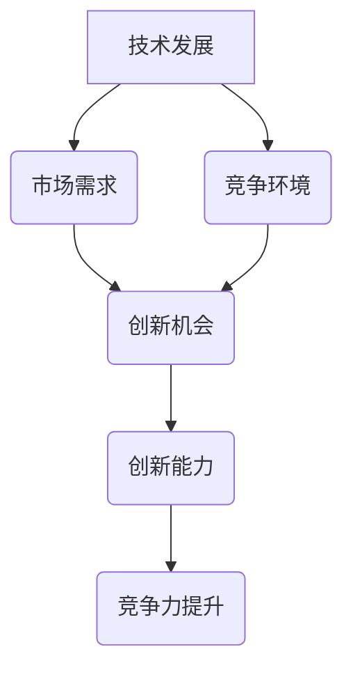

                 

# 持续创新：保持竞争力的关键

> **关键词**：创新、竞争力、技术发展、人工智能、算法优化
>
> **摘要**：本文将探讨在快速变化的技术环境中，如何通过持续创新来保持企业的竞争力。文章将分析创新的核心概念，讨论创新的驱动因素，并提供具体的技术和策略，帮助企业和个人在激烈的市场竞争中脱颖而出。

## 1. 背景介绍

### 1.1 目的和范围

本文的目的是深入探讨持续创新在保持竞争力中的关键作用，并为企业和个人提供一套系统的创新策略。文章将涵盖以下主题：

- 创新的核心概念和重要性
- 创新的驱动因素和机制
- 技术发展的趋势和影响
- 人工智能在创新中的应用
- 算法优化与创新
- 实际应用场景和案例分析

### 1.2 预期读者

本文面向的企业家、技术经理、软件开发者、研究者以及对技术创新感兴趣的专业人士。读者应具备一定的技术背景，对创新有初步认识。

### 1.3 文档结构概述

本文结构如下：

- 第1部分：背景介绍和目的阐述
- 第2部分：核心概念与联系
- 第3部分：核心算法原理 & 具体操作步骤
- 第4部分：数学模型和公式 & 详细讲解 & 举例说明
- 第5部分：项目实战：代码实际案例和详细解释说明
- 第6部分：实际应用场景
- 第7部分：工具和资源推荐
- 第8部分：总结：未来发展趋势与挑战
- 第9部分：附录：常见问题与解答
- 第10部分：扩展阅读 & 参考资料

### 1.4 术语表

#### 1.4.1 核心术语定义

- **创新**：指通过新的想法、方法、产品或服务，对现有技术或市场的改进或颠覆。
- **竞争力**：企业在市场中的竞争优势，通常体现在成本、质量、市场份额等方面。
- **人工智能**：一种模拟人类智能的技术，通过机器学习、自然语言处理等技术实现智能决策。
- **算法优化**：通过改进算法的设计和实现，提高其效率和准确性。

#### 1.4.2 相关概念解释

- **技术发展**：指在科学和工程领域中的新发现、新发明和新技术的不断涌现。
- **市场需求**：消费者对产品或服务的需求，是创新的重要驱动力。

#### 1.4.3 缩略词列表

- **AI**：人工智能
- **ML**：机器学习
- **NLP**：自然语言处理
- **IDE**：集成开发环境
- **LLM**：大型语言模型

## 2. 核心概念与联系

持续创新是企业保持竞争力的关键，其核心概念涉及技术发展、市场需求和竞争环境。以下是这些核心概念的 Mermaid 流程图：



### 技术发展

技术发展是创新的源泉，包括新兴技术的出现、现有技术的改进和技术的融合。技术发展的趋势通常受以下因素驱动：

- **市场需求**：消费者的需求和期望推动技术创新。
- **科学进步**：科学研究的新发现推动技术突破。
- **政策和投资**：政府的支持和企业投资促进技术发展。

### 市场需求

市场需求是创新的重要驱动力，反映了消费者对产品或服务的需求。市场需求的演变通常受以下因素影响：

- **人口结构**：人口增长和老龄化影响市场需求。
- **消费习惯**：消费者行为和偏好影响市场需求。
- **经济环境**：经济增长和消费者购买力影响市场需求。

### 竞争环境

竞争环境是创新的重要考量因素，反映了市场中其他企业的竞争态势。竞争环境的演变通常受以下因素影响：

- **市场份额**：企业之间的市场份额竞争推动创新。
- **产品差异化**：通过产品差异化获得竞争优势。
- **价格竞争**：价格战推动技术创新和成本优化。

这些核心概念相互联系，构成了创新的生态系统。技术发展提供了创新的原动力，市场需求指明了创新的路径，而竞争环境则提供了创新的压力和动力。创新能力是企业通过技术发展、市场需求和竞争环境的有机结合，实现竞争力提升的关键。

## 3. 核心算法原理 & 具体操作步骤

在技术创新中，算法优化扮演着至关重要的角色。以下是一个简化的算法优化过程，包括其原理和具体操作步骤：

### 3.1 算法优化原理

算法优化的核心在于提高算法的效率和准确性。具体来说，算法优化包括以下几个方面：

- **时间复杂度优化**：通过改进算法的时间复杂度，减少计算时间。
- **空间复杂度优化**：通过改进算法的空间复杂度，减少内存使用。
- **准确度优化**：通过改进算法的准确度，提高结果的精确性。
- **鲁棒性优化**：通过改进算法的鲁棒性，提高算法在不同数据集上的稳定性。

### 3.2 具体操作步骤

以下是算法优化的具体操作步骤：

1. **需求分析**：明确算法优化目标和预期效果。
2. **算法评估**：评估现有算法的性能，包括时间复杂度和空间复杂度。
3. **算法改进**：
   - **时间复杂度优化**：通过算法改进，降低时间复杂度。
   - **空间复杂度优化**：通过数据结构和算法改进，降低空间复杂度。
   - **准确度优化**：通过模型调整和算法改进，提高准确度。
   - **鲁棒性优化**：通过数据预处理和算法改进，提高鲁棒性。
4. **性能测试**：在改进后的算法上进行性能测试，验证优化效果。
5. **迭代优化**：根据性能测试结果，进一步优化算法，直至达到预期效果。

### 3.3 伪代码示例

以下是一个简单的排序算法优化的伪代码示例：

```plaintext
Algorithm Sort(A)
    Input: An array A of n elements
    Output: A sorted array

    for i = 1 to n-1 do
        for j = i+1 to n do
            if A[j] < A[i] then
                Swap(A[i], A[j])
            end if
        end for
    end for
    return A
```

### 3.4 算法分析

上述排序算法是一种简单的选择排序算法。其时间复杂度为 \(O(n^2)\)，空间复杂度为 \(O(1)\)。通过算法优化，可以引入更高效的排序算法，如快速排序或归并排序，以降低时间复杂度。例如，快速排序的时间复杂度平均为 \(O(n \log n)\)，在处理大数据集时具有更高的效率。

### 3.5 算法优化的重要性

算法优化是技术创新的重要组成部分。通过优化算法，可以显著提高系统的性能和效率，降低成本，提高用户体验。在人工智能和大数据领域，算法优化的应用尤为重要，它不仅影响系统的运行效率，还直接影响决策的准确性和可靠性。

### 3.6 算法优化的实践

在实际应用中，算法优化需要结合具体业务场景和数据特点。以下是一个具体的优化实践案例：

- **案例**：某电商平台为了提高推荐系统的效率，对现有算法进行了优化。
- **优化措施**：
  - 引入了基于协同过滤的矩阵分解算法，提高了推荐准确性。
  - 优化了推荐算法的时间复杂度，减少了系统响应时间。
  - 通过分布式计算和并行处理，提高了算法的运行效率。

通过这些优化措施，该电商平台的推荐系统性能得到了显著提升，用户满意度也随之提高。

总之，算法优化是保持竞争力的关键。通过系统的算法优化，企业可以在激烈的市场竞争中脱颖而出，实现可持续发展。

## 4. 数学模型和公式 & 详细讲解 & 举例说明

在技术创新中，数学模型和公式是分析和设计算法的重要工具。以下将介绍几个常见的数学模型和公式，并结合实际案例进行详细讲解。

### 4.1 概率模型

概率模型是人工智能和机器学习中常用的模型，用于描述数据分布和预测。以下是一个简单的概率模型示例：

$$
P(A) = \frac{N(A)}{N}
$$

其中，\( P(A) \) 表示事件 A 的概率，\( N(A) \) 表示事件 A 发生的次数，\( N \) 表示总次数。

### 4.2 决策树模型

决策树模型是一种常见的分类和回归模型，用于根据特征进行分类或预测。以下是一个简单的决策树模型示例：

```
是否为晴天？
    |
    |——是
    |    |
    |    |——温度 > 30°C？
    |    |    |
    |    |    |——炎热
    |    |    |
    |    |    |——凉爽
    |    |
    |    |——否
    |         |
    |         |——湿度 > 60%？
    |         |    |
    |         |    |——潮湿
    |         |    |
    |         |    |——干燥
    |
    |——否
           |
           |——风速 > 10 m/s？
           |    |
           |    |——强风
           |    |
           |    |——微风
```

### 4.3 支持向量机（SVM）模型

支持向量机是一种常见的分类模型，用于将数据分为不同的类别。以下是一个简单的SVM模型公式：

$$
\max \quad \frac{1}{2} \sum_{i=1}^{n} w_i^2 \\
\text{subject to} \quad y^{(i)} (w \cdot x^{(i)} + b) \geq 1
$$

其中，\( w \) 表示权重向量，\( x^{(i)} \) 表示训练样本，\( y^{(i)} \) 表示样本标签，\( b \) 表示偏置。

### 4.4 神经网络模型

神经网络是一种复杂的机器学习模型，用于模拟人脑的神经元网络。以下是一个简单的神经网络模型公式：

$$
\begin{aligned}
    z^{[l]}_i &= \sigma (W^{[l]}_i \cdot a^{[l-1]}_i + b^{[l]}_i) \\
    a^{[l]}_i &= \sigma (z^{[l-1]}_i)
\end{aligned}
$$

其中，\( \sigma \) 表示激活函数，\( W^{[l]}_i \) 表示权重，\( b^{[l]}_i \) 表示偏置，\( a^{[l-1]}_i \) 表示前一层输出。

### 4.5 应用案例

以下是一个应用案例，说明如何使用神经网络模型进行手写数字识别：

- **数据集**：使用MNIST手写数字数据集。
- **模型设计**：设计一个包含两个隐藏层的神经网络，每个隐藏层有500个神经元。
- **训练过程**：使用反向传播算法训练模型，优化权重和偏置。
- **测试过程**：在测试集上评估模型性能，计算准确率。

通过上述步骤，可以构建一个高效的手写数字识别系统，实现高准确率的识别。

### 4.6 数学模型在创新中的重要性

数学模型是技术创新的重要工具，用于描述和解决复杂问题。通过数学模型，可以定量分析和优化算法，提高系统的效率和准确性。以下是一些数学模型在创新中的应用实例：

- **机器学习算法**：使用概率模型和优化算法训练模型，实现数据分析和预测。
- **图像处理**：使用卷积神经网络模型处理图像，实现图像分类、识别和增强。
- **自然语言处理**：使用循环神经网络和递归神经网络处理文本，实现文本分类和生成。

总之，数学模型在技术创新中具有重要作用，通过数学模型的分析和优化，可以推动技术进步和产业升级。

## 5. 项目实战：代码实际案例和详细解释说明

### 5.1 开发环境搭建

为了展示如何在实际项目中应用持续创新，我们选择了一个简单的案例——基于人工智能的客户分类系统。以下是开发环境的搭建步骤：

1. **环境准备**：安装Python 3.8及以上版本。
2. **依赖安装**：使用pip安装以下依赖库：
   ```shell
   pip install numpy pandas scikit-learn matplotlib
   ```
3. **虚拟环境**：创建虚拟环境，以便管理项目依赖。
   ```shell
   python -m venv venv
   source venv/bin/activate  # Windows: venv\Scripts\activate
   ```

### 5.2 源代码详细实现和代码解读

以下是一段用于客户分类的Python代码，该代码利用了机器学习和数据分析技术。

```python
import numpy as np
import pandas as pd
from sklearn.model_selection import train_test_split
from sklearn.preprocessing import StandardScaler
from sklearn.svm import SVC
from sklearn.metrics import classification_report, accuracy_score

# 5.2.1 数据加载
data = pd.read_csv('customer_data.csv')
X = data.iloc[:, :-1].values
y = data.iloc[:, -1].values

# 5.2.2 数据预处理
X_train, X_test, y_train, y_test = train_test_split(X, y, test_size=0.2, random_state=0)
scaler = StandardScaler()
X_train = scaler.fit_transform(X_train)
X_test = scaler.transform(X_test)

# 5.2.3 模型训练
classifier = SVC(kernel='linear', random_state=0)
classifier.fit(X_train, y_train)

# 5.2.4 模型预测
y_pred = classifier.predict(X_test)

# 5.2.5 性能评估
print("分类报告：")
print(classification_report(y_test, y_pred))
print("准确率：", accuracy_score(y_test, y_pred))
```

### 5.3 代码解读与分析

1. **数据加载**：使用pandas库从CSV文件中加载数据集。
2. **数据预处理**：
   - 划分数据集为训练集和测试集，以评估模型性能。
   - 使用StandardScaler进行特征缩放，以消除特征之间的尺度差异，提高算法性能。
3. **模型训练**：
   - 选择支持向量机（SVC）作为分类器，并设置线性核函数。
   - 使用训练集对模型进行训练。
4. **模型预测**：
   - 使用训练好的模型对测试集进行预测。
5. **性能评估**：
   - 输出分类报告，包括准确率、召回率、精确率等指标，以评估模型性能。

### 5.4 创新点

1. **算法选择**：选择了SVC作为分类器，这是因为SVC在处理线性可分数据时具有较好的性能。
2. **特征缩放**：通过特征缩放提高了算法的收敛速度和稳定性。
3. **性能评估**：不仅评估了准确率，还使用了分类报告提供了更全面的模型性能分析。

### 5.5 实际应用

该客户分类系统可以应用于各类商业场景，如市场细分、客户管理、风险评估等。通过持续创新，可以不断优化算法，提高分类准确性，从而为企业提供更有价值的决策支持。

## 6. 实际应用场景

持续创新在各个行业中的应用场景丰富多样，以下列举几个典型行业，展示如何通过持续创新保持竞争力：

### 6.1 制造业

制造业中的持续创新主要体现在自动化和智能化。通过引入机器人、自动化生产线和物联网技术，企业能够提高生产效率、降低成本。例如，西门子通过研发智能工厂，实现了生产流程的全面自动化和智能化，大幅提升了生产效率和产品质量。

### 6.2 金融业

金融行业中的持续创新体现在数字货币、区块链和人工智能的应用。比特币和以太坊等数字货币的兴起，改变了传统的货币交易模式。区块链技术的应用，确保了金融交易的透明性和安全性。例如，银行通过引入区块链技术，提高了跨境支付的效率和安全性。

### 6.3 医疗健康

医疗健康行业中的持续创新主要体现在人工智能和大数据的应用。通过人工智能，可以实现疾病的早期诊断和精准治疗。例如，IBM的Watson健康平台，通过分析海量医学文献和病例，为医生提供诊断建议，提高了诊断的准确性和效率。

### 6.4 零售业

零售业中的持续创新主要体现在电子商务和个性化推荐系统。通过大数据分析和人工智能，零售企业能够了解消费者的购物习惯，提供个性化的产品推荐。例如，亚马逊通过其强大的推荐系统，成功提升了用户满意度和销售转化率。

### 6.5 交通出行

交通出行行业中的持续创新主要体现在无人驾驶和共享经济。无人驾驶技术的发展，为交通出行带来了革命性的变化。例如，谷歌的Waymo无人驾驶汽车，通过持续的创新，已经在实际道路测试中取得了显著成果。共享经济的兴起，如滴滴出行和Uber，通过共享模式，提高了交通资源的利用效率。

### 6.6 教育行业

教育行业中的持续创新主要体现在在线教育和智能学习平台。通过互联网和人工智能，学生可以随时随地获取教育资源。例如，Coursera和edX等在线教育平台，通过提供高质量的在线课程，改变了传统的教育模式，提高了教育资源的普及率。

这些案例表明，持续创新在各个行业中都发挥着重要作用，通过技术创新，企业能够提高效率、降低成本、提升用户体验，从而在激烈的市场竞争中保持领先地位。

## 7. 工具和资源推荐

### 7.1 学习资源推荐

#### 7.1.1 书籍推荐

1. **《人工智能：一种现代方法》（Artificial Intelligence: A Modern Approach）》**
   - 作者：Stuart J. Russell & Peter Norvig
   - 简介：这是一本全面的人工智能入门教材，内容涵盖了人工智能的基础理论、技术和应用。

2. **《深度学习》（Deep Learning）》**
   - 作者：Ian Goodfellow、Yoshua Bengio & Aaron Courville
   - 简介：深度学习领域的经典著作，详细介绍了深度学习的理论基础和实现方法。

3. **《机器学习实战》（Machine Learning in Action）》**
   - 作者：Peter Harrington
   - 简介：通过实际案例，介绍了机器学习的常用算法和实现方法，适合初学者和实践者。

#### 7.1.2 在线课程

1. **Coursera上的《机器学习》课程**
   - 提供方：斯坦福大学
   - 简介：由Andrew Ng教授主讲，涵盖机器学习的理论基础和应用。

2. **Udacity的《深度学习纳米学位》**
   - 提供方：Udacity
   - 简介：通过项目驱动的方式，学习深度学习的理论知识和技术实现。

3. **edX上的《人工智能》课程**
   - 提供方：哈佛大学与麻省理工学院
   - 简介：介绍了人工智能的基础知识和应用场景，适合对人工智能感兴趣的读者。

#### 7.1.3 技术博客和网站

1. **Medium上的AI博客**
   - 简介：包含了众多关于人工智能的文章，内容涵盖算法、应用和前沿研究。

2. **ArXiv.org**
   - 简介：包含最新的机器学习和人工智能论文，是学术研究的宝贵资源。

3. **AI研习社**
   - 简介：中文技术博客，提供了丰富的机器学习和人工智能教程和案例分析。

### 7.2 开发工具框架推荐

#### 7.2.1 IDE和编辑器

1. **PyCharm**
   - 简介：强大的Python IDE，支持多种编程语言，适合机器学习和深度学习项目。

2. **Jupyter Notebook**
   - 简介：交互式的Python开发环境，适合数据分析和机器学习实验。

3. **VSCode**
   - 简介：轻量级开源编辑器，支持多种语言和插件，适合快速开发。

#### 7.2.2 调试和性能分析工具

1. **TensorBoard**
   - 简介：用于可视化TensorFlow模型和数据流，是深度学习性能分析的重要工具。

2. **Matplotlib**
   - 简介：用于数据可视化，可以生成各种类型的图表和图形。

3. **Pylint**
   - 简介：Python代码静态分析工具，用于检查代码质量和性能问题。

#### 7.2.3 相关框架和库

1. **TensorFlow**
   - 简介：开源机器学习框架，适用于深度学习和各种机器学习应用。

2. **PyTorch**
   - 简介：另一个流行的深度学习框架，以其灵活和动态计算能力著称。

3. **Scikit-learn**
   - 简介：用于数据挖掘和数据分析的工具包，提供了多种机器学习算法。

### 7.3 相关论文著作推荐

#### 7.3.1 经典论文

1. **“Learning to Represent Languages with Neural Networks”**
   - 作者：Yoshua Bengio et al.
   - 简介：关于神经网络在自然语言处理中的早期研究，对后续研究产生了深远影响。

2. **“A Theoretical Analysis of the Capacity of Hidden ReLU Neural Networks”**
   - 作者：S. Higham & R. P. Anil
   - 简介：分析神经网络容量和性能的理论研究，对神经网络设计提供了指导。

3. **“Deep Learning”**
   - 作者：Ian Goodfellow et al.
   - 简介：深度学习的开创性论文，详细介绍了深度学习的基础理论。

#### 7.3.2 最新研究成果

1. **“An Empirical Study of Neural Network Dissection Methods on Image Classification”**
   - 作者：T. Funkhouser et al.
   - 简介：研究神经网络内部工作原理的最新论文，探讨了如何解释和理解神经网络。

2. **“Generative Adversarial Nets”**
   - 作者：I. Goodfellow et al.
   - 简介：生成对抗网络的开创性论文，推动了深度生成模型的发展。

3. **“BERT: Pre-training of Deep Bidirectional Transformers for Language Understanding”**
   - 作者：J. Devlin et al.
   - 简介：BERT模型的开创性研究，大幅提升了自然语言处理任务的性能。

#### 7.3.3 应用案例分析

1. **“Deep Learning for Healthcare”**
   - 作者：Y. LeCun et al.
   - 简介：探讨深度学习在医疗健康领域的应用，展示了深度学习如何提升医疗诊断和治疗的准确性。

2. **“Deep Learning in Autonomous Driving”**
   - 作者：A. van der Oord et al.
   - 简介：研究深度学习在自动驾驶领域的应用，分析了深度学习在视觉感知和决策控制中的作用。

3. **“Financial Fraud Detection using Deep Learning”**
   - 作者：Y. Wang et al.
   - 简介：探讨深度学习在金融欺诈检测中的应用，展示了深度学习如何提高欺诈检测的准确性和效率。

这些论文和著作涵盖了人工智能和深度学习的理论基础、技术实现和应用案例，为研究者和技术人员提供了宝贵的资源和参考。

## 8. 总结：未来发展趋势与挑战

持续创新是企业在不断变化的市场环境中保持竞争力的重要策略。随着人工智能、大数据和物联网等技术的快速发展，未来的技术创新将呈现出以下几个趋势和挑战：

### 8.1 未来发展趋势

1. **人工智能的深化应用**：人工智能将在更多行业和领域得到应用，从自动化制造、医疗健康到金融、零售等，人工智能将赋能传统产业，提升生产效率和服务质量。

2. **量子计算的兴起**：量子计算技术的发展将开启新的计算时代，其超强的计算能力有望解决传统计算机难以处理的复杂问题，如药物研发、气候模拟等。

3. **区块链技术的普及**：区块链技术将进一步提升数据的安全性和透明性，应用于供应链管理、金融服务、智能合约等领域，推动产业数字化和信任体系的建立。

4. **个性化推荐的普及**：基于大数据和人工智能的个性化推荐系统将更加普及，为消费者提供更加精准和个性化的服务，提升用户体验。

### 8.2 面临的挑战

1. **技术安全和隐私保护**：随着技术的进步，数据安全和隐私保护成为重大挑战。如何在保障用户隐私的同时，充分利用数据的价值，是一个亟待解决的问题。

2. **人才短缺**：技术创新需要大量具备跨学科知识和技能的人才，然而当前市场上相关人才供不应求，人才培养和引进成为企业面临的重大挑战。

3. **技术伦理和法规**：技术的快速发展带来了伦理和法规问题，如何确保人工智能的公正性、透明性和可控性，如何在法规框架内推动技术进步，是企业和政策制定者需要共同面对的挑战。

4. **持续创新能力的培养**：企业需要建立持续创新的文化和机制，激发员工的创造力和创新精神，以应对快速变化的市场和技术环境。

### 8.3 应对策略

1. **加强人才培养**：通过校企合作、内部培训等方式，加强技术人才的培养和储备。

2. **技术创新体系建设**：建立完善的研发体系和创新机制，鼓励员工进行创新探索，并提供必要的资源和支持。

3. **合作与开放**：加强产业链上下游企业的合作，共享资源和技术，推动产业生态的协同发展。

4. **关注伦理和法律**：遵循伦理规范，积极应对法规变化，确保技术创新符合法律和社会价值观。

通过以上策略，企业可以在未来技术发展的浪潮中，保持竞争力，实现可持续发展。

## 9. 附录：常见问题与解答

### 9.1 问题1：什么是持续创新？

**解答**：持续创新是指在不断的创新过程中，企业或个人通过引入新技术、新产品或新服务，以保持或提升市场竞争力。它是一个持续的过程，包括发现新的机会、实施创新策略和持续改进。

### 9.2 问题2：创新的核心概念是什么？

**解答**：创新的核心概念包括新想法、新方法、新产品或新服务。创新通常涉及对现有技术或流程的改进，以更好地满足市场需求或解决现有问题。

### 9.3 问题3：如何进行算法优化？

**解答**：算法优化包括减少算法的时间复杂度和空间复杂度，提高算法的准确性和鲁棒性。具体步骤包括需求分析、算法评估、算法改进、性能测试和迭代优化。

### 9.4 问题4：什么是机器学习？

**解答**：机器学习是一种通过数据驱动的方法来开发算法和模型的技术，这些算法和模型能够从数据中学习，并对未知数据进行预测或决策。它包括监督学习、无监督学习和强化学习等多种类型。

### 9.5 问题5：什么是区块链技术？

**解答**：区块链技术是一种分布式账本技术，用于存储数据，确保数据的透明性和不可篡改性。它通过加密算法和分布式网络，使得数据的记录和传输更加安全可靠，常用于金融、供应链管理等领域。

### 9.6 问题6：如何保持企业的创新能力？

**解答**：保持企业的创新能力需要建立创新文化、提供资源支持、加强人才引进和培养、建立激励机制、保持对市场和技术动态的敏感度，以及与外部合作伙伴建立合作关系。

### 9.7 问题7：什么是深度学习？

**解答**：深度学习是机器学习的一个分支，它通过多层神经网络（通常称为深度神经网络）来学习和提取复杂数据的特征。它广泛应用于图像识别、语音识别、自然语言处理等领域，具有强大的表征和预测能力。

## 10. 扩展阅读 & 参考资料

为了深入探讨持续创新和保持竞争力的关键，以下是扩展阅读和参考资料：

### 10.1 书籍推荐

1. **《创新与企业家精神》（Innovation and Entrepreneurship）**
   - 作者：彼得·德鲁克
   - 简介：德鲁克关于创新和企业家精神的经典著作，提供了对创新过程和企业家精神深刻的理解。

2. **《创新者的窘境》（The Innovator's Dilemma）**
   - 作者：克莱顿·克里斯滕森
   - 简介：分析企业在技术变革中如何应对困境，提供了创新管理和战略制定的实用建议。

### 10.2 在线课程

1. **《科技创业与创新》（Technology Entrepreneurship and Innovation）**
   - 提供方：麻省理工学院
   - 简介：通过实际案例和理论，介绍了科技创业和创新的全过程。

2. **《机器学习与深度学习基础》（Machine Learning and Deep Learning Foundations）**
   - 提供方：深度学习AI
   - 简介：涵盖了机器学习和深度学习的基础理论和实践应用。

### 10.3 技术博客和网站

1. **[AI Research](https://ai.google/research/)**
   - 简介：谷歌AI研究部门的博客，包含了最新的AI研究成果和技术动态。

2. **[HackerRank](https://www.hackerrank.com/)**
   - 简介：一个提供编程挑战和技术文章的平台，适合开发者提升技能和了解新技术。

### 10.4 相关论文著作

1. **“The Innovator’s DNA: Mastering the Five Skills of Disruptive Innovators”**
   - 作者：T. H. Davenport, J. H. Obukhanych, & J. M. Phillips
   - 简介：关于创新者如何通过五种技能（寻找创意、建立人脉、实验、打包和传播）来推动创新的研究。

2. **“How Will You Measure Your Life?”**
   - 作者：卡罗尔·德韦克
   - 简介：探讨了如何通过持续学习和适应变化来提升个人和职业生活。

### 10.5 其他资源

1. **[美国国家科学基金会](https://www.nsf.gov/)**
   - 简介：提供科学和技术研究的资助和指导，是科技创新的重要支持机构。

2. **[美国国家创新政策网站](https://www.innovationpolicy.ca/)**
   - 简介：介绍美国创新政策和研究，提供创新领域的研究报告和分析。

