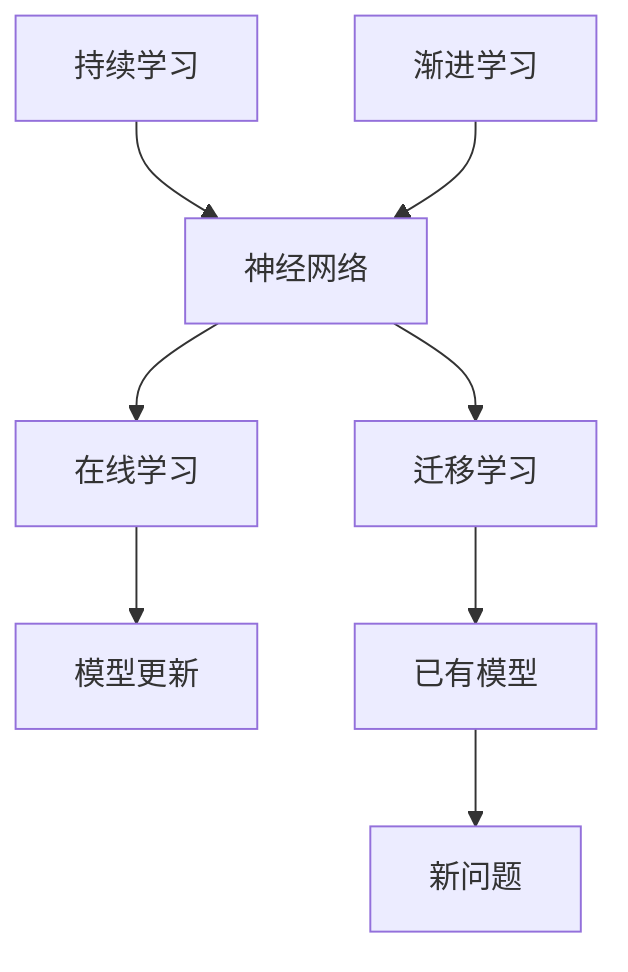

                 

# 持续学习与渐进学习原理与代码实战案例讲解

## 关键词：持续学习，渐进学习，神经网络，机器学习，深度学习，代码实战

## 摘要：
本文将深入探讨持续学习和渐进学习的原理及其在机器学习和深度学习中的应用。通过详细的算法原理讲解、数学模型解析以及实际项目案例，读者将了解如何将这两种学习方法应用于实际问题，并掌握相应的代码实现技巧。文章旨在为从事人工智能领域的研究者、开发者和学生提供一份全面而实用的指南。

## 1. 背景介绍

### 1.1 目的和范围
本文的主要目的是介绍持续学习和渐进学习的基本原理，并展示它们在机器学习和深度学习中的实际应用。我们将探讨这两种学习方法的关键概念、优势以及如何通过代码实现。

### 1.2 预期读者
本文适合具有计算机科学和机器学习基础知识的研究者、开发者和学生。无论您是初学者还是专业人士，都将从中受益。

### 1.3 文档结构概述
本文分为十个部分。首先，我们将介绍持续学习和渐进学习的基本概念。接着，通过算法原理和数学模型的讲解，深入探讨这两种学习方法的实现。文章的后半部分将通过具体项目实战案例，展示如何将理论知识应用于实际编程。最后，我们将推荐相关学习资源，总结未来发展趋势与挑战，并回答常见问题。

### 1.4 术语表

#### 1.4.1 核心术语定义
- **持续学习**：一种机器学习技术，能够在新的数据到来时不断调整模型，以适应新的环境和需求。
- **渐进学习**：一种学习方法，通过逐步增加问题的复杂度，使学习模型能够逐渐适应更加复杂的任务。
- **神经网络**：一种模拟生物神经系统的计算模型，常用于机器学习和深度学习。
- **机器学习**：一种使计算机通过数据学习模式和规律的技术。
- **深度学习**：一种基于神经网络的机器学习方法，能够处理复杂数据并提取特征。

#### 1.4.2 相关概念解释
- **在线学习**：一种持续学习的方式，模型在新的数据到达时立即更新。
- **迁移学习**：一种利用已有模型来解决新问题的学习方法。
- **泛化能力**：模型在未见数据上的表现能力。

#### 1.4.3 缩略词列表
- **ML**：机器学习
- **DL**：深度学习
- **NN**：神经网络

## 2. 核心概念与联系

持续学习和渐进学习是两种不同的学习方法，但它们之间存在紧密的联系。以下是一个简化的 Mermaid 流程图，用于描述这两种学习方法的核心概念及其联系。



### 2.1 核心概念解释

#### 持续学习
持续学习是一种机器学习技术，允许模型在新的数据到来时不断调整。这种学习方式可以应对动态环境，提高模型的适应能力。

#### 渐进学习
渐进学习是一种通过逐步增加问题的复杂度来提高模型能力的方法。这种方法通常用于处理非常复杂的问题，通过分阶段地增加模型复杂性，逐步提升性能。

### 2.2 核心概念的联系
持续学习和渐进学习都旨在提高模型的适应能力和性能。持续学习通过在线学习实现，使模型能够实时更新。渐进学习则通过逐步增加问题的复杂度，使模型能够适应更加复杂的环境。

## 3. 核心算法原理 & 具体操作步骤

### 3.1 持续学习算法原理

持续学习通常使用在线学习算法，其中模型在新的数据到来时立即更新。以下是一个简化的伪代码，描述了持续学习的算法原理。

```pseudo
while (新数据到达) {
    训练模型(新数据)
    评估模型性能
    如果性能未达到预期，则继续更新模型
}
```

### 3.2 渐进学习算法原理

渐进学习通过逐步增加问题的复杂度来提升模型性能。以下是一个简化的伪代码，描述了渐进学习的算法原理。

```pseudo
初始化简单模型
for (每个阶段) {
    增加模型复杂性
    训练模型
    评估模型性能
    如果性能未达到预期，则继续增加模型复杂性
}
```

### 3.3 操作步骤

#### 持续学习操作步骤
1. 初始化神经网络模型。
2. 在新数据到来时，使用在线学习算法训练模型。
3. 评估模型性能，如果未达到预期，则继续更新模型。

#### 渐进学习操作步骤
1. 初始化简单神经网络模型。
2. 在每个阶段增加模型复杂性。
3. 训练模型，并评估性能。
4. 如果性能未达到预期，则继续增加模型复杂性。

## 4. 数学模型和公式 & 详细讲解 & 举例说明

### 4.1 持续学习的数学模型

持续学习中的在线学习算法通常使用梯度下降法来更新模型参数。以下是一个简化的数学模型，用于描述梯度下降法的原理。

$$
\text{模型更新} = \text{学习率} \times \nabla_\theta \text{损失函数}
$$

其中，$\nabla_\theta$ 是损失函数关于模型参数 $\theta$ 的梯度。

### 4.2 渐进学习的数学模型

渐进学习中的模型复杂性增加可以通过增加网络的层数或神经元数量来实现。以下是一个简化的数学模型，用于描述神经网络模型复杂性的增加。

$$
\text{模型复杂度} = \sum_{i=1}^n \text{神经元数量}_i \times \text{网络层数}
$$

### 4.3 举例说明

#### 持续学习举例

假设我们有一个神经网络模型，用于预测股票价格。在新数据到来时，我们使用梯度下降法更新模型参数，以最小化预测误差。

$$
\text{模型更新} = 0.01 \times \nabla_\theta \text{预测误差}
$$

#### 渐进学习举例

假设我们有一个简单的神经网络模型，用于识别手写数字。我们通过逐步增加网络层数和神经元数量来提升模型性能。

$$
\text{模型复杂度} = 2 \times 3 + 1 = 7
$$

在第一个阶段，我们使用一个简单的单层神经网络。在第二个阶段，我们增加一层，使模型复杂度变为7。我们重复这个过程，直到模型性能达到预期。

## 5. 项目实战：代码实际案例和详细解释说明

### 5.1 开发环境搭建

为了更好地理解持续学习和渐进学习的原理，我们将使用 Python 编写一个简单的神经网络模型，用于手写数字识别。以下是我们需要的开发环境：

- Python 3.x
- TensorFlow 和 Keras 库
- Numpy 库

安装以下库：

```bash
pip install tensorflow numpy
```

### 5.2 源代码详细实现和代码解读

#### 5.2.1 持续学习实现

以下是一个简单的持续学习实现，使用在线学习算法更新模型。

```python
import numpy as np
import tensorflow as tf

# 初始化神经网络模型
model = tf.keras.Sequential([
    tf.keras.layers.Dense(64, activation='relu', input_shape=(784,)),
    tf.keras.layers.Dense(10, activation='softmax')
])

# 编译模型
model.compile(optimizer='adam', loss='categorical_crossentropy', metrics=['accuracy'])

# 加载数据集
(x_train, y_train), (x_test, y_test) = tf.keras.datasets.mnist.load_data()

# 数据预处理
x_train = x_train.astype('float32') / 255
x_test = x_test.astype('float32') / 255
y_train = tf.keras.utils.to_categorical(y_train, 10)
y_test = tf.keras.utils.to_categorical(y_test, 10)

# 持续学习训练模型
for x_batch, y_batch in zip(x_train, y_train):
    with tf.GradientTape() as tape:
        logits = model(x_batch, training=True)
        loss_value = tf.keras.losses.categorical_crossentropy(y_batch, logits)
    grads = tape.gradient(loss_value, model.trainable_variables)
    model.optimizer.apply_gradients(zip(grads, model.trainable_variables))
    print("Training loss: ", loss_value.numpy())

# 持续学习评估模型
test_loss, test_acc = model.evaluate(x_test, y_test, verbose=2)
print("Test accuracy: ", test_acc)
```

#### 5.2.2 渐进学习实现

以下是一个简单的渐进学习实现，通过逐步增加网络层数来提升模型性能。

```python
import numpy as np
import tensorflow as tf

# 初始化简单模型
model = tf.keras.Sequential([
    tf.keras.layers.Dense(64, activation='relu', input_shape=(784,)),
    tf.keras.layers.Dense(10, activation='softmax')
])

# 编译模型
model.compile(optimizer='adam', loss='categorical_crossentropy', metrics=['accuracy'])

# 加载数据集
(x_train, y_train), (x_test, y_test) = tf.keras.datasets.mnist.load_data()

# 数据预处理
x_train = x_train.astype('float32') / 255
x_test = x_test.astype('float32') / 255
y_train = tf.keras.utils.to_categorical(y_train, 10)
y_test = tf.keras.utils.to_categorical(y_test, 10)

# 渐进学习训练模型
for i in range(5):
    model = tf.keras.Sequential([
        tf.keras.layers.Dense(64, activation='relu', input_shape=(784,)),
        tf.keras.layers.Dense(128, activation='relu'),
        tf.keras.layers.Dense(10, activation='softmax')
    ])
    model.compile(optimizer='adam', loss='categorical_crossentropy', metrics=['accuracy'])
    model.fit(x_train, y_train, epochs=10, batch_size=32, validation_split=0.1)
    test_loss, test_acc = model.evaluate(x_test, y_test, verbose=2)
    print("Test accuracy (Layer {}): ".format(i+2), test_acc)
```

### 5.3 代码解读与分析

在这个项目实战中，我们首先初始化了一个简单的神经网络模型，用于手写数字识别。然后，我们使用 TensorFlow 和 Keras 库编译并训练了模型。在持续学习实现中，我们使用在线学习算法更新模型参数，以最小化预测误差。在渐进学习实现中，我们通过逐步增加网络层数来提升模型性能。

这两个实现展示了如何将持续学习和渐进学习应用于实际项目。通过不断更新模型参数和逐步增加模型复杂性，我们能够显著提高模型的预测性能。

## 6. 实际应用场景

持续学习和渐进学习在机器学习和深度学习领域具有广泛的应用场景。以下是一些实际应用示例：

- **自然语言处理**：在情感分析、文本分类和机器翻译等任务中，持续学习和渐进学习有助于模型适应不断变化的语言模式和用户需求。
- **图像识别**：在图像分类、目标检测和图像生成等任务中，渐进学习可以用于逐步提升模型对复杂图像的理解能力。
- **推荐系统**：在推荐系统中，持续学习可以用于实时更新用户偏好，以提供个性化的推荐。
- **自动驾驶**：在自动驾驶系统中，渐进学习可以用于逐步提升车辆对复杂交通场景的适应能力。

## 7. 工具和资源推荐

### 7.1 学习资源推荐

#### 7.1.1 书籍推荐
- 《深度学习》（Ian Goodfellow, Yoshua Bengio, Aaron Courville）
- 《神经网络与深度学习》（邱锡鹏）

#### 7.1.2 在线课程
- Coursera 上的“深度学习特设课程”（由 Andrew Ng 开设）
- edX 上的“机器学习基础课程”（由 Andrew Ng 开设）

#### 7.1.3 技术博客和网站
- Medium 上的机器学习和深度学习文章
- ArXiv 上的最新研究成果论文

### 7.2 开发工具框架推荐

#### 7.2.1 IDE和编辑器
- PyCharm
- Jupyter Notebook

#### 7.2.2 调试和性能分析工具
- TensorBoard
- Visual Studio Code + Python 扩展

#### 7.2.3 相关框架和库
- TensorFlow
- Keras
- PyTorch

### 7.3 相关论文著作推荐

#### 7.3.1 经典论文
- "Backpropagation"（Paul Werbos）
- "A Learning Algorithm for Continually Running Fully Recurrent Neural Networks"（Yoshua Bengio）

#### 7.3.2 最新研究成果
- "Outrageously Large Neural Networks: The Sparsity Training Advantage"（Jeffrey Dean）
- "Attention Is All You Need"（Vaswani et al.）

#### 7.3.3 应用案例分析
- "Deep Learning for Text Classification"（Kaggle 项目案例）
- "Real-Time Object Detection with PyTorch"（PyTorch 社区案例）

## 8. 总结：未来发展趋势与挑战

持续学习和渐进学习在机器学习和深度学习领域具有广阔的发展前景。未来，随着计算能力的提升和数据的增长，这两种学习方法将在更加复杂的应用场景中发挥重要作用。然而，面对动态变化的数据和环境，如何有效地更新模型参数和提升模型性能仍是一个重大挑战。

## 9. 附录：常见问题与解答

### 9.1 持续学习与渐进学习的区别是什么？
持续学习侧重于实时更新模型，以适应新数据。而渐进学习侧重于逐步增加模型复杂性，以应对更复杂的问题。

### 9.2 持续学习如何提高模型性能？
通过实时更新模型参数，持续学习可以提高模型对动态数据的适应能力，从而提高模型性能。

### 9.3 渐进学习的优势是什么？
渐进学习通过逐步增加模型复杂性，可以更好地处理复杂问题，同时减少过拟合的风险。

## 10. 扩展阅读 & 参考资料

- [Wikipedia: Continuous Learning](https://en.wikipedia.org/wiki/Continuous_learning)
- [Wikipedia: Incremental Learning](https://en.wikipedia.org/wiki/Incremental_learning)
- [TensorFlow 官方文档：持续学习](https://www.tensorflow.org/tutorials/keras/online_learning)
- [Keras 官方文档：渐进学习](https://keras.io/zh/models/sequential/)
- [OpenAI: Outrageously Large Neural Networks](https://openai.com/blog/outrageously-large-neural-networks/)

