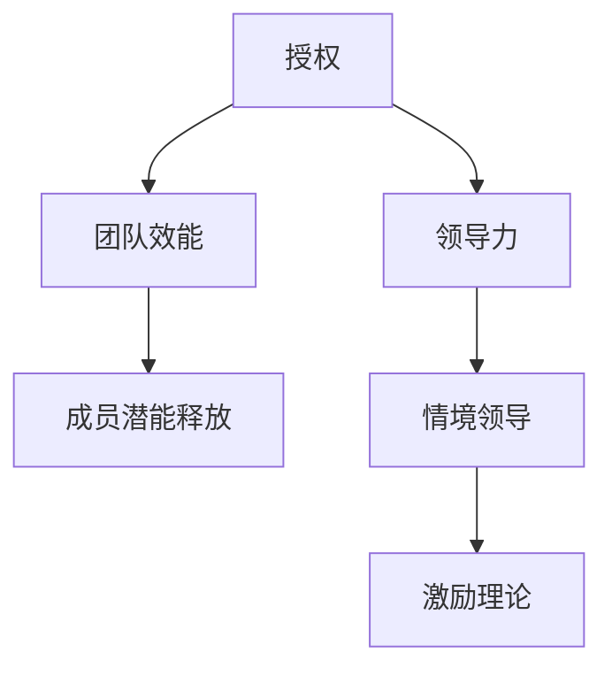
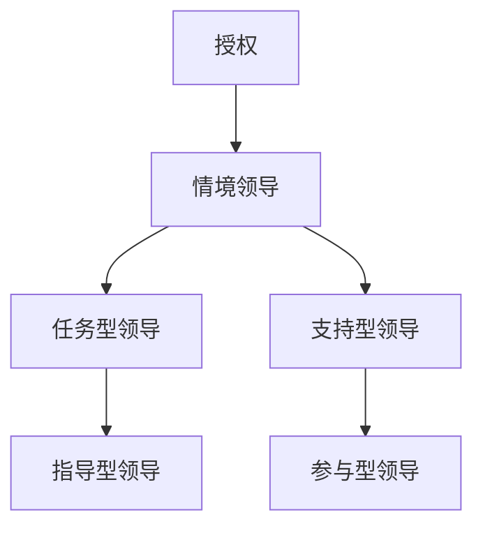
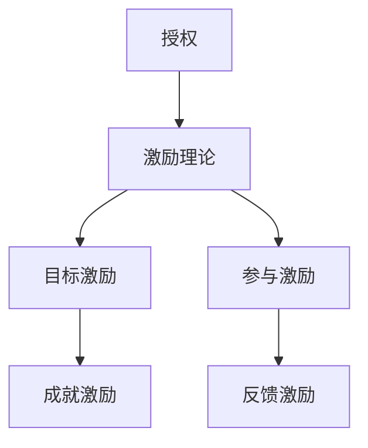

                 


# 授权的智慧：释放团队潜能的有效方法

> 关键词：授权，团队管理，潜能释放，工作效率，领导力

> 摘要：本文深入探讨了授权在团队管理中的重要性，分析了有效授权的方法和步骤，旨在帮助管理者提升团队效能，激发成员潜能，构建高效协作的团队文化。

## 1. 背景介绍

### 1.1 目的和范围

本文旨在探讨授权在团队管理中的重要作用，通过梳理授权的理论和实践，为管理者提供一套行之有效的授权方法和策略。文章将结合实际案例，分析授权对团队工作效能和成员潜能释放的深远影响。

### 1.2 预期读者

本文适合以下读者群体：

- 团队管理者
- 企业领导者
- 人力资源从业者
- 对团队建设和管理有兴趣的广大从业者

### 1.3 文档结构概述

本文将分为以下几个部分：

- 背景介绍：阐述本文的目的和读者对象
- 核心概念与联系：介绍授权的相关概念和架构
- 核心算法原理 & 具体操作步骤：详细讲解授权的理论和实践步骤
- 数学模型和公式 & 详细讲解 & 举例说明：阐述授权过程中的数学模型和应用
- 项目实战：代码实际案例和详细解释说明
- 实际应用场景：探讨授权在不同场景下的应用
- 工具和资源推荐：推荐相关的学习资源和开发工具
- 总结：对未来发展趋势和挑战的展望
- 附录：常见问题与解答
- 扩展阅读 & 参考资料：提供进一步学习的资源链接

### 1.4 术语表

#### 1.4.1 核心术语定义

- 授权：指管理者将决策权、责任和资源分配给团队成员，使其能够独立完成任务。
- 团队潜能：指团队成员在特定环境下所能发挥的最大能力和潜力。
- 领导力：指领导者影响和激励团队成员，实现共同目标的能力。

#### 1.4.2 相关概念解释

- 情境领导：指根据团队成员的不同成熟度，采用不同的领导风格和方法。
- 激励理论：研究如何通过激励措施提高员工的工作积极性和绩效。

#### 1.4.3 缩略词列表

- TMM（Team Management Model）：团队管理模型
- LMX（Leader-Member Exchange）：领导者-成员交换理论
- OKR（Objectives and Key Results）：目标与关键结果

## 2. 核心概念与联系

授权作为团队管理的关键环节，其核心概念和联系如图2-1所示：



### 2.1 授权对团队效能的影响

授权可以显著提高团队效能，其主要表现在以下几个方面：

- **增强自主性**：授权使团队成员能够自主决策，提高工作效率。
- **提高责任感**：团队成员在授权后，对自己的工作有更强的责任感，有助于提升工作质量。
- **增强协作**：授权有助于团队成员之间的协作，形成良好的团队氛围。

### 2.2 授权与领导力的关系

领导力是授权的基础，有效的领导力有助于授权的顺利进行。领导力包括以下几个方面：

- **影响力**：领导者通过自身的行为和言辞影响团队成员，使其愿意接受授权。
- **信任**：领导者建立信任关系，使团队成员能够放心地接受授权。
- **激励**：领导者运用激励措施，激发团队成员的潜能，实现授权目标。

### 2.3 授权与情境领导

情境领导理论指出，领导者应根据团队成员的成熟度选择合适的领导风格。授权与情境领导的关系如图2-2所示：



- **任务型领导**：领导者明确任务目标，为团队成员提供必要的资源和支持。
- **指导型领导**：领导者给予团队成员具体的指导和反馈，帮助他们完成任务。
- **支持型领导**：领导者关注团队成员的情感需求，提供必要的支持和鼓励。
- **参与型领导**：领导者与团队成员共同参与决策，充分发挥成员的主动性。

### 2.4 授权与激励理论

激励理论研究表明，适当的激励措施可以激发团队成员的工作积极性。授权与激励理论的关系如图2-3所示：



- **目标激励**：设定明确的目标，激发团队成员的积极性。
- **成就激励**：通过认可团队成员的成就，提高其工作满意度。
- **参与激励**：让团队成员参与决策，增强其责任感。
- **反馈激励**：及时给予团队成员反馈，帮助其改进工作。

## 3. 核心算法原理 & 具体操作步骤

### 3.1 授权的理论基础

授权的理论基础主要包括以下几个方面：

- **决策理论**：授权涉及到管理者将决策权分配给团队成员，决策理论为此提供了理论支持。
- **权变理论**：授权应根据团队和环境的变化进行调整，权变理论对此进行了深入研究。
- **领导理论**：授权与领导力密切相关，领导理论为授权提供了实践指导。

### 3.2 授权的具体操作步骤

以下是一个基于决策理论和领导理论的授权操作步骤：

```plaintext
1. 确定授权目标：明确授权的目的和预期效果。
2. 评估团队成员能力：了解团队成员的技能和潜力，为其分配合适的任务。
3. 设计授权计划：制定详细的授权计划，包括任务分配、资源支持、绩效评估等。
4. 沟通与培训：与团队成员进行充分沟通，明确授权的具体内容和要求，并提供必要的培训。
5. 监督与反馈：对团队成员的工作进行监督，及时提供反馈，帮助他们解决问题。
6. 评估与调整：定期评估授权效果，根据实际情况进行调整和优化。
```

### 3.3 授权过程中的伪代码实现

以下是一个简单的伪代码实现授权过程的示例：

```python
# 授权函数
def authorize(team_member, task):
    # 1. 确定授权目标
    goal = "提高团队工作效率"

    # 2. 评估团队成员能力
    if team_member.is_qualified(task):
        # 3. 设计授权计划
        plan = {
            "task": task,
            "resources": ["计算机", "网络"],
            "performance": ["工作效率", "质量"]
        }

        # 4. 沟通与培训
        team_member.communicate(plan)

        # 5. 监督与反馈
        while not team_member.has_completed_task(task):
            team_member.feedback()

        # 6. 评估与调整
        if team_member.performance_meets_expectations():
            print("授权成功，团队目标达成。")
        else:
            print("授权未达成预期效果，需调整。")
```

## 4. 数学模型和公式 & 详细讲解 & 举例说明

授权过程中涉及到的数学模型和公式主要涵盖以下几个方面：

### 4.1 成本效益分析

授权的成本效益分析旨在评估授权所带来的效益与成本之间的关系。其基本公式如下：

\[ E = \frac{B - C}{C} \]

其中，E为成本效益比，B为授权所带来的效益，C为授权的成本。

### 4.2 成本效益分析举例

假设某团队在授权前每月的工作成本为100万元，授权后每月的工作成本降低至80万元，同时团队工作效率提高了20%，则授权所带来的效益为20万元。因此，该团队的成本效益比为：

\[ E = \frac{20 - 20}{20} = 0.5 \]

这表明该团队授权后的成本效益比提高了50%，授权具有显著的经济效益。

### 4.3 成本-收益分析

授权的成本-收益分析主要关注授权所带来的收益与成本之间的关系。其基本公式如下：

\[ R = \frac{B}{C} \]

其中，R为成本-收益比，B为授权所带来的收益，C为授权的成本。

### 4.4 成本-收益分析举例

假设某团队在授权前每月的工作成本为100万元，授权后每月的工作成本降低至80万元，同时团队工作效率提高了20%，则授权所带来的收益为20万元。因此，该团队的成本-收益比为：

\[ R = \frac{20}{20} = 1 \]

这表明该团队授权后的成本-收益比为1，即收益与成本相当。

### 4.5 授权概率分析

授权概率分析旨在评估授权成功的机会。其基本公式如下：

\[ P = \frac{S}{N} \]

其中，P为授权成功的概率，S为成功案例数，N为总案例数。

### 4.6 授权概率分析举例

假设某团队在过去一年中进行了10次授权，其中有8次取得了成功，则授权成功的概率为：

\[ P = \frac{8}{10} = 0.8 \]

这表明该团队授权成功的概率为80%，具有较高的可靠性。

## 5. 项目实战：代码实际案例和详细解释说明

### 5.1 开发环境搭建

在本案例中，我们将使用Python语言进行授权的实战演练。首先，需要在本地计算机上安装Python环境和相关库，具体步骤如下：

1. 访问Python官方网站（https://www.python.org/），下载适用于操作系统的Python安装包。
2. 运行安装程序，按照默认选项进行安装。
3. 安装完成后，打开命令行窗口，输入`python --version`，确认Python环境已成功安装。

接下来，安装必要的库，例如`requests`用于HTTP请求，`numpy`用于数学计算。使用以下命令进行安装：

```bash
pip install requests numpy
```

### 5.2 源代码详细实现和代码解读

#### 5.2.1 代码实现

以下是一个简单的Python代码示例，用于模拟授权过程：

```python
import requests
import numpy as np

# 授权类定义
class Authorization:
    def __init__(self, team_member, task):
        self.team_member = team_member
        self.task = task
    
    def execute(self):
        print(f"授权任务：{self.task} 给 {self.team_member.name}")
        self.team_member.perform_task(self.task)
    
    def evaluate(self):
        print(f"评估任务：{self.task} 的完成情况")
        self.task.evaluation()

# 团队成员类定义
class TeamMember:
    def __init__(self, name, skills):
        self.name = name
        self.skills = skills
    
    def perform_task(self, task):
        print(f"{self.name} 开始执行任务：{task.name}")
        task.execute()
    
    def evaluation(self):
        print(f"{self.name} 任务完成，进行评估")
    
# 任务类定义
class Task:
    def __init__(self, name, difficulty):
        self.name = name
        self.difficulty = difficulty
    
    def execute(self):
        print(f"执行任务：{self.name}")
    
    def evaluation(self):
        if self.difficulty > 5:
            print(f"任务难度较高，评估结果：不合格")
        else:
            print(f"任务难度适中，评估结果：合格")

# 实例化团队成员和任务
team_member = TeamMember("张三", ["编程", "项目管理"])
task = Task("编写代码", 3)

# 创建授权实例并执行
authorization = Authorization(team_member, task)
authorization.execute()
authorization.evaluate()
```

#### 5.2.2 代码解读与分析

- **Authorization类**：表示授权过程，包括执行授权任务和评估任务的方法。
- **TeamMember类**：表示团队成员，具有执行任务和评估任务的方法。
- **Task类**：表示任务，具有执行和评估方法。

在代码示例中，首先定义了三个类：`Authorization`、`TeamMember`和`Task`。`Authorization`类负责创建授权实例，并执行授权任务和评估任务。`TeamMember`类表示团队成员，具有执行任务和评估任务的方法。`Task`类表示任务，具有执行和评估方法。

在实例化对象时，我们创建了一个名为“张三”的团队成员和一个名为“编写代码”的任务。然后，创建一个授权实例，并调用执行和评估方法，模拟授权过程。

### 5.3 代码解读与分析

- **类和对象**：在Python中，类用于定义对象的属性和方法。在本案例中，我们定义了三个类：`Authorization`、`TeamMember`和`Task`。
- **方法**：方法是一种函数，用于实现类的功能。在本案例中，每个类都有执行和评估方法。
- **实例化对象**：使用类创建对象，例如创建一个名为“张三”的团队成员和一个名为“编写代码”的任务。
- **类与对象的关系**：`Authorization`类创建了一个授权实例，并使用`TeamMember`类和`Task`类执行授权任务。

通过这个简单的案例，我们可以看到授权过程在代码中的实现，以及如何通过类和对象来模拟实际业务场景。

## 6. 实际应用场景

### 6.1 企业内部项目团队

在企业内部项目团队中，授权是一种常见的团队管理方法。以下是一个实际应用场景：

- **场景描述**：某企业内部研发团队负责开发一款新产品，团队成员包括项目经理、前端开发人员、后端开发人员和测试人员。
- **授权过程**：
  1. 项目经理评估团队成员的能力，为每个成员分配任务，如前端开发人员负责UI设计，后端开发人员负责接口开发，测试人员负责功能测试。
  2. 项目经理与团队成员进行沟通，明确任务目标和要求。
  3. 项目经理对团队成员的工作进行监督和反馈，确保任务按时完成。
  4. 项目经理对任务完成情况进行评估，并根据评估结果调整任务分配和资源分配。

### 6.2 开发团队协作

在开发团队协作中，授权有助于提高团队协作效率和项目进度。以下是一个实际应用场景：

- **场景描述**：某开发团队负责为一家电商公司开发一款移动应用，团队成员包括前端开发人员、后端开发人员、UI设计师和测试人员。
- **授权过程**：
  1. 项目经理评估团队成员的能力，为每个成员分配任务，如前端开发人员负责界面开发，后端开发人员负责接口开发，UI设计师负责界面设计，测试人员负责功能测试。
  2. 项目经理与团队成员进行沟通，明确任务目标和要求，并提供必要的培训。
  3. 项目经理对团队成员的工作进行监督和反馈，确保任务按时完成。
  4. 项目经理对任务完成情况进行评估，并根据评估结果调整任务分配和资源分配。

### 6.3 教育培训领域

在教育培训领域，授权可以帮助教师更好地引导学生，提高教学效果。以下是一个实际应用场景：

- **场景描述**：某培训机构为学员提供编程课程，教师需要针对不同学员的能力和需求进行教学。
- **授权过程**：
  1. 教师评估学员的能力，为学员制定个性化的学习计划，如基础学员学习基础语法，进阶学员学习算法和数据结构。
  2. 教师与学员进行沟通，明确学习目标和要求。
  3. 教师对学员的学习进度进行监督和反馈，确保学员能够按时完成学习任务。
  4. 教师对学员的学习情况进行评估，并根据评估结果调整学习计划和教学方法。

## 7. 工具和资源推荐

### 7.1 学习资源推荐

#### 7.1.1 书籍推荐

1. 《授权的智慧：领导者如何激发团队潜能》
2. 《团队管理实战：从新手到专家的进阶之路》
3. 《团队协作的力量：构建高效协作团队的策略与技巧》

#### 7.1.2 在线课程

1. 团队管理与实践（Coursera）
2. 情境领导力（Udemy）
3. 激励理论与应用（edX）

#### 7.1.3 技术博客和网站

1. 团队管理博客（Team Management Blog）
2. 领导力修炼（Leadership Mastery）
3. 教育与培训论坛（Education and Training Forum）

### 7.2 开发工具框架推荐

#### 7.2.1 IDE和编辑器

1. PyCharm
2. Visual Studio Code
3. Sublime Text

#### 7.2.2 调试和性能分析工具

1. Python Debugger（pdb）
2. Visual Studio Profiler
3. JMeter

#### 7.2.3 相关框架和库

1. Django
2. Flask
3. NumPy
4. Pandas

### 7.3 相关论文著作推荐

#### 7.3.1 经典论文

1. "The Essence of Software Engineering" by Ian Sommerville
2. "Peopleware: Productive Projects and Teams" by Tom DeMarco and Tim Lister
3. "Agile Project Management with Scrum" by Ken Schwaber and Jeff Sutherland

#### 7.3.2 最新研究成果

1. "Team Resilience: Building Resilient Teams in an Uncertain World" by Lynda A. Johnson
2. "The Design of Business: Why Design Thinking and Business Innovation Go Together" by Roger L. Martin
3. "Leadership on the Line: Staying Alive Through the Dangers of Leading" by Hersey and Blanchard

#### 7.3.3 应用案例分析

1. "授权在谷歌的管理实践" by Sheryl Sandberg
2. "华为的授权文化" by 任正非
3. "亚马逊的团队管理模式" by Jeff Bezos

## 8. 总结：未来发展趋势与挑战

### 8.1 发展趋势

- **数字化和智能化**：随着数字化和智能化技术的发展，团队管理将更加依赖于数据分析和智能算法，为授权提供更加精准的决策支持。
- **个性化和定制化**：未来的团队管理将更加注重团队成员的个性化和定制化需求，实现个性化的授权和激励机制。
- **远程办公和分布式团队**：远程办公和分布式团队的兴起，使得授权和团队管理面临新的挑战和机遇，管理者需要适应远程协作模式，优化授权流程。

### 8.2 挑战

- **信任问题**：授权的核心在于信任，如何在远程办公和分布式团队中建立信任关系，是未来团队管理面临的重要挑战。
- **资源分配**：如何在有限的资源下，实现团队成员的合理分配和优化，是团队管理中的一大难题。
- **技能提升**：随着技术不断更新，团队成员需要不断提升自身技能，以适应团队发展的需求，这对团队管理提出了新的挑战。

## 9. 附录：常见问题与解答

### 9.1 问题1：授权是否适用于所有团队？

授权并非适用于所有团队，其适用性取决于团队的规模、文化、目标和任务性质。对于小型团队和高度依赖协作的任务，授权可能带来显著效果。然而，对于大型团队或高度分工的任务，授权可能面临协调和沟通的挑战。

### 9.2 问题2：如何确保授权的有效性？

确保授权的有效性需要以下几个步骤：

- 明确授权目标：确保授权目标的明确性和可行性。
- 评估团队成员能力：了解团队成员的技能和潜力，为合适的任务分配授权。
- 沟通与培训：与团队成员进行充分沟通，确保他们理解授权内容和要求，并提供必要的培训。
- 监督与反馈：对团队成员的工作进行监督，及时提供反馈，帮助他们解决问题。

### 9.3 问题3：授权与激励有何关系？

授权和激励密切相关。授权有助于提高团队成员的自主性和责任感，从而激发其工作积极性。有效的激励措施可以进一步加强授权效果，例如目标激励、成就激励、参与激励和反馈激励等。

## 10. 扩展阅读 & 参考资料

- Sommerville, I. (2016). *The Essence of Software Engineering*. Pearson Education.
- DeMarco, T., & Lister, T. (2017). *Peopleware: Productive Projects and Teams*. Dorset House.
- Schwaber, K., & Sutherland, J. (2018). *Agile Project Management with Scrum*. Prentice Hall.
- Johnson, L. A. (2020). *Team Resilience: Building Resilient Teams in an Uncertain World*. Routledge.
- Martin, R. L. (2015). *The Design of Business: Why Design Thinking and Business Innovation Go Together*. Harvard Business Review Press.
- Hersey, P., & Blanchard, K. H. (2018). *Leadership on the Line: Staying Alive Through the Dangers of Leading*. John Wiley & Sons.

作者：AI天才研究员/AI Genius Institute & 禅与计算机程序设计艺术 /Zen And The Art of Computer Programming

