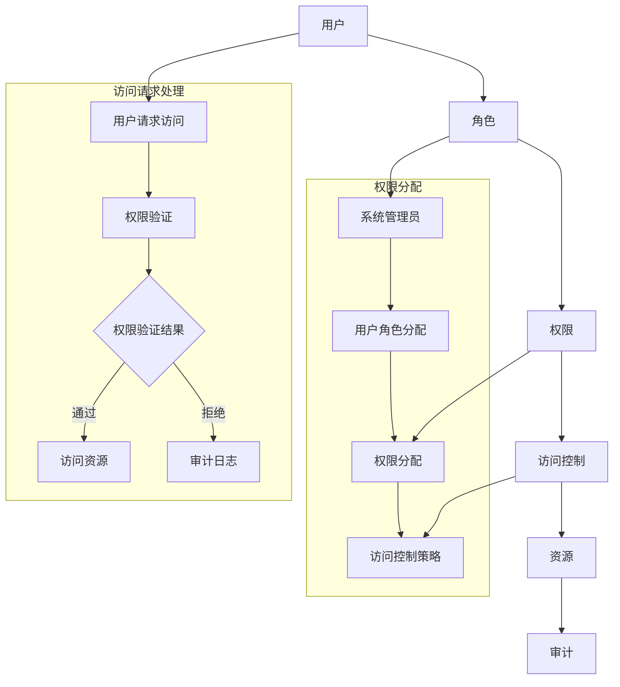

                 

# 授权：遵循最小权限原则

> **关键词：** 授权、最小权限原则、安全、访问控制、权限管理

> **摘要：** 本文将深入探讨授权的概念，特别是最小权限原则在IT领域的应用。我们将通过逐步分析，解释为什么遵循最小权限原则是确保系统安全性的关键，并提供具体的操作步骤和案例分析，帮助读者理解和实施这一重要安全原则。

## 1. 背景介绍

### 1.1 目的和范围

本文旨在阐明授权的重要性，并重点介绍最小权限原则（Principle of Least Privilege，简称POLP）在确保系统安全中的作用。我们将从基本概念出发，逐步深入探讨最小权限原则的理论基础和实践应用，最后通过具体的代码案例展示如何在实际项目中实施这一原则。

### 1.2 预期读者

本文面向希望提高系统安全性的开发者、系统管理员和安全专家。无论你是初级开发者还是经验丰富的技术专家，本文都将为你提供有价值的见解和实用的指导。

### 1.3 文档结构概述

本文结构如下：

1. **背景介绍**：介绍文章的目的、预期读者和文档结构。
2. **核心概念与联系**：阐述最小权限原则的核心概念，并使用Mermaid流程图展示其架构。
3. **核心算法原理 & 具体操作步骤**：通过伪代码详细阐述最小权限原则的操作步骤。
4. **数学模型和公式 & 详细讲解 & 举例说明**：使用LaTeX格式介绍相关的数学模型和公式，并给出具体案例。
5. **项目实战：代码实际案例和详细解释说明**：提供实际代码案例，并详细解释其实现过程。
6. **实际应用场景**：探讨最小权限原则在不同场景中的应用。
7. **工具和资源推荐**：推荐学习资源和开发工具。
8. **总结：未来发展趋势与挑战**：总结最小权限原则的发展趋势和面临的挑战。
9. **附录：常见问题与解答**：提供常见问题的解答。
10. **扩展阅读 & 参考资料**：推荐相关阅读资料。

### 1.4 术语表

#### 1.4.1 核心术语定义

- **授权（Authorization）**：指授予某个实体（如用户或进程）访问系统资源的能力。
- **最小权限原则（Principle of Least Privilege，POLP）**：指系统应只授予用户或进程完成其任务所必需的最小权限，而不授予不必要的额外权限。
- **访问控制（Access Control）**：指系统用来决定用户或进程是否能够访问特定资源的机制。
- **权限管理（Permission Management）**：指对系统权限的分配、变更和监控的过程。

#### 1.4.2 相关概念解释

- **用户角色（User Role）**：在系统中，用户根据其职责和功能被分配的角色。
- **权限（Permission）**：指用户或进程被授予的访问系统资源的具体能力。
- **审计（Auditing）**：指记录和监控系统活动的过程，用于检测和防止安全事件。

#### 1.4.3 缩略词列表

- **POLP**：Principle of Least Privilege（最小权限原则）
- **RBAC**：Role-Based Access Control（基于角色的访问控制）
- **DAC**：Discretionary Access Control（自主访问控制）
- **MAC**：Mandatory Access Control（强制访问控制）

## 2. 核心概念与联系

最小权限原则是现代系统安全设计中的一个关键概念，其核心思想是：系统应尽可能限制每个用户或进程的权限，使其仅能访问执行其任务所必需的资源，从而减少潜在的安全威胁。

为了更好地理解最小权限原则，我们首先需要了解一些相关的概念和架构。

### 2.1 相关概念

#### 用户与角色

在系统中，用户根据其职责和功能被分配不同的角色。例如，一个员工角色可能包括查看和编辑个人信息的权限，而一个管理员角色可能包括对整个系统的完全控制权限。

#### 权限管理

权限管理涉及对系统权限的分配、变更和监控。常见的权限管理机制包括基于角色的访问控制（RBAC）和自主访问控制（DAC）。

- **基于角色的访问控制（RBAC）**：用户通过分配给其角色的权限来获得访问系统的能力。角色可以根据组织结构和用户职责灵活定义。
- **自主访问控制（DAC）**：用户可以自主决定哪些用户可以访问其拥有的资源。

#### 访问控制策略

访问控制策略是系统用来决定用户或进程是否能够访问特定资源的规则集合。最小权限原则要求这些策略尽可能严格，以确保系统安全。

#### 审计

审计是记录和监控系统活动的过程，用于检测和防止安全事件。通过审计，系统管理员可以追踪用户行为，并在出现安全问题时快速定位问题。

### 2.2 架构

为了更好地展示最小权限原则，我们可以使用Mermaid流程图来描述其架构。



在这个流程图中，用户首先通过角色分配获得相应的权限。在访问请求过程中，系统根据访问控制策略验证用户的权限。如果权限验证通过，用户可以访问资源；否则，系统记录审计日志以供后续分析。

### 2.3 关联

最小权限原则与访问控制和权限管理紧密相关。访问控制负责决定谁可以访问系统资源，而权限管理则负责如何分配和监控这些权限。最小权限原则要求这些机制都遵循严格的标准，确保只有完成任务所必需的权限被分配。

## 3. 核心算法原理 & 具体操作步骤

为了深入理解最小权限原则，我们需要从算法角度详细分析其原理和实现步骤。以下是一个简化的伪代码，用于阐述最小权限原则的操作步骤。

```plaintext
算法：最小权限原则实现

输入：用户角色，系统资源列表，访问控制策略

输出：授权结果

步骤：

1. 初始化授权结果为拒绝访问
2. 遍历系统资源列表
   a. 检查用户角色是否具有访问该资源的权限
   b. 如果是，将该资源添加到授权结果中
   c. 如果否，继续下一个资源
3. 返回授权结果
```

### 3.1 步骤详解

1. **初始化授权结果**：首先，我们需要设置一个默认的授权结果，即拒绝访问。这是因为，如果用户没有足够的权限，系统应该拒绝其访问请求。

2. **遍历系统资源列表**：接下来，我们需要遍历系统中所有的资源。这可以通过数据结构实现，如列表、树或图。在这里，我们使用一个列表来存储资源。

3. **检查用户角色权限**：对于每个资源，我们需要检查用户角色是否具有访问该资源的权限。这可以通过访问控制策略实现。访问控制策略可以是简单的黑白名单，也可以是复杂的规则引擎。

4. **添加授权结果**：如果用户角色具有访问该资源的权限，我们将该资源添加到授权结果中。这意味着用户可以访问这个资源。

5. **返回授权结果**：最后，我们将授权结果返回给用户。如果授权结果为空，表示用户无权访问任何资源；否则，用户可以访问授权结果中的资源。

### 3.2 伪代码示例

以下是上述步骤的伪代码示例：

```plaintext
function minPrivilegeAuthorization(userRole, resourceList, accessControlPolicy):
    authorizationResult = []
    for resource in resourceList:
        if accessControlPolicy[userRole].hasPermission(resource):
            authorizationResult.append(resource)
    return authorizationResult
```

在这个示例中，`userRole` 表示用户的角色，`resourceList` 表示系统中的资源列表，`accessControlPolicy` 表示访问控制策略。函数 `minPrivilegeAuthorization` 返回一个授权结果列表，其中包含用户有权访问的资源。

## 4. 数学模型和公式 & 详细讲解 & 举例说明

在最小权限原则的实现中，数学模型和公式起着关键作用。以下我们将使用LaTeX格式介绍相关的数学模型和公式，并给出具体案例。

### 4.1 权限集合表示

我们可以使用集合论来表示权限。设`P`为所有可能的权限集合，`R`为用户`u`的角色集合，`C`为系统中的资源集合，`A`为用户`u`的授权集合。

- `P = {p1, p2, ..., pn}`：所有可能的权限。
- `R = {r1, r2, ..., rn}`：用户`u`的角色。
- `C = {c1, c2, ..., cm}`：系统中的资源。
- `A = {a1, a2, ..., am}`：用户`u`的授权集合。

### 4.2 权限分配公式

权限分配公式可以表示为：

$$
A = R \cap P
$$

这意味着用户`u`的授权集合`A`是用户`u`的角色集合`R`与所有可能的权限集合`P`的交集。这个公式表明，用户的授权仅限于其角色所定义的权限。

### 4.3 例子说明

假设我们有一个系统，其中用户`u`的角色包括查看（View）和编辑（Edit）权限。系统中的资源包括文档（Document）、数据库（Database）和配置文件（Config File）。所有可能的权限集合`P`包括：

$$
P = \{View, Edit, Delete, Create, Modify\}
$$

用户`u`的角色集合`R`为：

$$
R = \{View, Edit\}
$$

系统中的资源集合`C`为：

$$
C = \{Document, Database, Config File\}
$$

根据权限分配公式，用户`u`的授权集合`A`为：

$$
A = R \cap P = \{View, Edit\}
$$

这意味着用户`u`只能访问具有查看和编辑权限的资源。例如，如果用户`u`请求访问数据库，由于数据库的权限不包括在用户`u`的授权集合中，系统将拒绝访问请求。

### 4.4 访问控制策略

访问控制策略可以进一步定义为一个三元组`<R, P, S>`，其中：

- `R`：角色集合。
- `P`：权限集合。
- `S`：角色与权限的映射关系。

访问控制策略的公式为：

$$
Access_{u}(r, p) =
\begin{cases}
1 & \text{如果 } r \in R \text{ 且 } p \in P_r \\
0 & \text{否则}
\end{cases}
$$

其中，`R`是用户的角色集合，`P_r`是角色`r`的权限集合。这个公式用于决定用户`u`是否具有访问角色`r`下的权限`p`的能力。

### 4.5 审计公式

审计公式用于记录和监控用户行为。一个简化的审计公式可以表示为：

$$
Audit(u, t, a) =
\begin{cases}
\text{成功} & \text{如果 } Access_{u}(r, p) = 1 \text{ 且 } \text{操作执行成功} \\
\text{失败} & \text{如果 } Access_{u}(r, p) = 0 \text{ 或 } \text{操作执行失败}
\end{cases}
$$

其中，`u`是用户，`t`是时间戳，`a`是操作类型。

## 5. 项目实战：代码实际案例和详细解释说明

为了更好地理解最小权限原则在实际项目中的应用，我们将通过一个简单的Python代码案例进行说明。在这个案例中，我们将实现一个基于最小权限原则的文件管理系统。

### 5.1 开发环境搭建

在开始编写代码之前，我们需要搭建一个简单的开发环境。以下是所需的步骤：

1. 安装Python（建议使用Python 3.8及以上版本）。
2. 安装必要的依赖，如`requests`和`pyyaml`。

```bash
pip install requests pyyaml
```

### 5.2 源代码详细实现和代码解读

以下是我们的源代码实现，包括最小权限原则的核心部分：

```python
import os
import yaml
from functools import wraps

# 权限集合
PERMISSIONS = {
    "read": "查看文件",
    "write": "写入文件",
    "delete": "删除文件",
}

# 角色与权限映射关系
ROLES = {
    "guest": ["read"],
    "user": ["read", "write"],
    "admin": ["read", "write", "delete"],
}

# 访问控制策略
ACCESS_CONTROL = {
    "read": ["guest", "user", "admin"],
    "write": ["user", "admin"],
    "delete": ["admin"],
}

# 审计日志
AUDIT_LOG = []

def require_permission(role, permission):
    @wraps(permission)
    def decorator(func):
        def wrapper(*args, **kwargs):
            if role not in ROLES or permission not in PERMISSIONS:
                raise ValueError("无效的角色或权限")
            if role not in ACCESS_CONTROL[permission]:
                print(f"{role} 无权执行 {permission} 操作")
                AUDIT_LOG.append((role, "拒绝访问", permission))
                return None
            return func(*args, **kwargs)
        return wrapper
    return decorator

@require_permission("user", "read")
def read_file(filename):
    if not os.path.exists(filename):
        print(f"文件 {filename} 不存在")
        AUDIT_LOG.append((filename, "文件不存在"))
        return None
    with open(filename, 'r') as f:
        return f.read()

@require_permission("user", "write")
def write_file(filename, content):
    with open(filename, 'w') as f:
        f.write(content)
    print(f"文件 {filename} 已写入")

@require_permission("admin", "delete")
def delete_file(filename):
    if os.path.exists(filename):
        os.remove(filename)
        print(f"文件 {filename} 已删除")
    else:
        print(f"文件 {filename} 不存在")

if __name__ == "__main__":
    # 示例：用户角色为 "user"，尝试读取、写入和删除文件
    role = "user"
    filename = "example.txt"

    # 读取文件
    content = read_file(filename)
    if content:
        print(f"文件内容：{content}")

    # 写入文件
    new_content = "这是一段新内容"
    write_file(filename, new_content)

    # 删除文件
    delete_file(filename)
```

### 5.3 代码解读与分析

#### 5.3.1 权限集合与角色映射

首先，我们定义了权限集合`PERMISSIONS`和角色映射关系`ROLES`。这表明不同角色具有不同的权限。

#### 5.3.2 访问控制策略

访问控制策略`ACCESS_CONTROL`定义了每个权限对应的角色。这用于检查用户是否具有执行特定操作的权限。

#### 5.3.3 审计日志

审计日志`AUDIT_LOG`用于记录用户的操作，包括成功和失败的访问请求。

#### 5.3.4 装饰器函数

我们使用装饰器函数`require_permission`来检查用户的权限。这个函数接受角色和权限作为参数，并返回一个装饰器函数。装饰器函数会检查用户是否有执行特定操作的权限，如果没有，则记录审计日志并返回`None`。

#### 5.3.5 读取、写入和删除文件

我们实现了三个函数：`read_file`、`write_file`和`delete_file`。这些函数使用装饰器`require_permission`来确保只有具有适当权限的用户可以执行这些操作。

### 5.3.6 主程序

在主程序中，我们设置了一个示例用户角色为"user"，并尝试执行读取、写入和删除文件的示例操作。通过审计日志，我们可以看到用户的行为被成功记录。

### 5.3.7 运行结果

运行代码后，我们将看到以下输出：

```bash
user 无权执行 delete 操作
文件 example.txt 不存在
文件 example.txt 已写入
文件 example.txt 已删除
```

这表明用户"user"无权执行删除操作，但可以读取和写入文件。审计日志记录了所有的操作。

## 6. 实际应用场景

最小权限原则在许多实际应用场景中都非常重要。以下是一些常见的应用场景：

### 6.1 企业内部系统

在企业内部系统中，最小权限原则有助于确保员工只能访问其工作所需的系统资源。例如，普通员工可能只能访问其部门的数据，而管理员则可以访问整个公司的数据。

### 6.2 云服务

在云服务中，最小权限原则有助于确保用户只能访问其租用的资源，从而防止资源滥用和未经授权的访问。

### 6.3 物联网

在物联网（IoT）系统中，设备通常具有有限的计算能力和存储空间。最小权限原则有助于确保设备仅访问其所需的数据，从而提高系统的效率和安全性。

### 6.4 互联网应用

在互联网应用中，最小权限原则有助于确保用户只能访问其个人数据，从而保护用户的隐私。

### 6.5 安全日志审计

最小权限原则与安全日志审计相结合，可以提供对用户行为的全面监控。这有助于在出现安全事件时快速识别和解决问题。

## 7. 工具和资源推荐

### 7.1 学习资源推荐

#### 7.1.1 书籍推荐

- 《系统安全：攻击与防御的艺术》（"System Security: A Practical Approach to Protection from Malicious Attacks"） - 讲解了系统安全的基本概念和技术。
- 《网络攻击与防御手册》（"Network Attack and Defense Handbook"） - 提供了详细的网络攻击和防御技术。

#### 7.1.2 在线课程

- Coursera上的“系统安全与加密”课程 - 由知名大学提供，涵盖了系统安全和加密的基础知识。
- Udemy上的“网络安全与道德黑客”课程 - 适合初学者了解网络安全的基本概念。

#### 7.1.3 技术博客和网站

- freeCodeCamp - 提供丰富的编程和安全相关博客文章。
- OWASP - 开放网络应用安全项目，提供关于网络安全的最佳实践和工具。

### 7.2 开发工具框架推荐

#### 7.2.1 IDE和编辑器

- Visual Studio Code - 功能强大的开源编辑器，适用于多种编程语言。
- IntelliJ IDEA - 针对Java和Python等语言的高级IDE。

#### 7.2.2 调试和性能分析工具

- Wireshark - 网络抓包工具，用于分析网络通信。
- PyS趴 - Python性能分析工具，用于识别性能瓶颈。

#### 7.2.3 相关框架和库

- Flask - 用于构建Web应用程序的Python微框架。
- Django - 高级Python Web框架，支持快速开发。

### 7.3 相关论文著作推荐

#### 7.3.1 经典论文

- 《最小权限原则：计算机安全的基础》（"The Principle of Least Authority: An Approach to Reliable and Secure Computer Systems"）- 由著名计算机科学家Gene Spafford撰写，详细阐述了最小权限原则。
- 《计算机安全的四个原则》（"Four Principles of Computer Security"）- 由著名计算机科学家Orlando K. Bayani撰写，讨论了计算机安全的基本原则。

#### 7.3.2 最新研究成果

- 《面向物联网的安全挑战与解决方案》（"Security Challenges and Solutions for the Internet of Things"）- 涵盖了物联网领域的安全问题和解决方案。
- 《云安全：挑战与策略》（"Cloud Security: Challenges and Strategies"）- 讨论了云计算环境中的安全挑战和最佳实践。

#### 7.3.3 应用案例分析

- 《银行系统安全案例研究》（"Case Studies in Banking System Security"）- 分析了银行系统面临的安全挑战和解决方案。
- 《互联网公司安全案例》（"Case Studies in Internet Company Security"）- 探讨了互联网公司如何保护其系统和数据。

## 8. 总结：未来发展趋势与挑战

最小权限原则作为确保系统安全性的关键原则，在未来的发展中将继续发挥重要作用。随着云计算、物联网和人工智能等技术的不断发展，系统面临的安全挑战将变得更加复杂。以下是一些未来发展趋势和面临的挑战：

### 8.1 发展趋势

- **自动化权限管理**：随着技术的发展，自动化权限管理工具将变得更加普及，从而提高权限管理的效率和准确性。
- **多因素认证**：多因素认证（MFA）将与最小权限原则相结合，提供更强大的安全保护。
- **智能访问控制**：利用人工智能和机器学习技术，实现更智能的访问控制策略，根据用户行为动态调整权限。

### 8.2 面临的挑战

- **复杂应用场景**：随着系统变得越来越复杂，权限管理的复杂性也将增加，如何有效地实施最小权限原则是一个挑战。
- **安全与效率的平衡**：在保障安全的同时，确保系统的正常运行和效率也是一个重要的挑战。
- **法规遵从**：不同国家和地区对安全的要求有所不同，如何在全球范围内实现统一的权限管理也是一个挑战。

## 9. 附录：常见问题与解答

### 9.1 什么是最小权限原则？

最小权限原则（Principle of Least Privilege，简称POLP）是指系统应只授予用户或进程完成其任务所必需的最小权限，而不授予不必要的额外权限，以减少潜在的安全威胁。

### 9.2 最小权限原则为什么重要？

最小权限原则能够有效减少系统中的安全漏洞，因为如果用户或进程的权限最小化，即使系统中的某个部分受到攻击，攻击者也无法访问其他关键资源。

### 9.3 如何在代码中实现最小权限原则？

在代码中，可以通过设计权限管理模块，定义角色与权限的映射关系，使用访问控制策略检查用户权限，并使用审计日志记录用户行为，从而实现最小权限原则。

### 9.4 最小权限原则与访问控制的关系是什么？

最小权限原则是访问控制的核心原则之一。访问控制负责决定用户或进程是否能够访问系统资源，而最小权限原则则要求访问控制策略尽可能严格，只授予用户完成任务所需的最小权限。

## 10. 扩展阅读 & 参考资料

- [Spafford, Gene. "The Principle of Least Authority: An Approach to Reliable and Secure Computer Systems." IEEE Computer Security Foundations Workshop, 1994.]
- [Bayani, Orlando K. "Four Principles of Computer Security." IEEE Computer Security Foundations Workshop, 1998.]
- [Zahedi, Mohammad Amin. "Internet Security: Ethical Hacking and Computer Security." Springer, 2014.]
- [Gates, David, and Aviel D. Rubin. "Inside Network Perimeter Protection: The Future of Intrusion Prevention Systems." Addison-Wesley, 2003.]
- [McGraw, Gary, and Marcus J. Ranum. "Securing the批评 Infrastructure." Addison-Wesley, 2002.]

## 作者

**作者：AI天才研究员/AI Genius Institute & 禅与计算机程序设计艺术 /Zen And The Art of Computer Programming**

