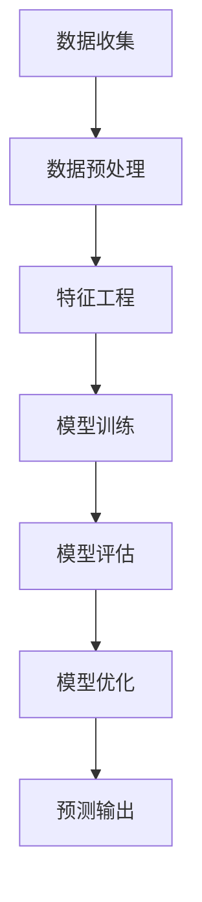

                 


## 探索基于大模型的电商智能客户价值预测系统

### 关键词：大数据，人工智能，客户价值预测，电商，大模型，深度学习，模型训练，数据预处理，算法优化，实际应用

> 摘要：本文深入探讨了基于大模型的电商智能客户价值预测系统，从背景介绍到核心算法原理，再到项目实战和实际应用场景，为读者提供了一个系统化的学习和实践指南。通过本文，读者将了解如何利用人工智能技术，特别是深度学习，构建高效、准确的电商客户价值预测系统，从而提升电商平台的市场竞争力。

## 1. 背景介绍

### 1.1 目的和范围

本文旨在探索电商智能客户价值预测系统的构建方法，重点分析基于大模型的深度学习技术在客户价值预测中的应用。随着互联网技术的迅猛发展，电商行业面临着日益激烈的市场竞争。如何有效地预测客户价值，挖掘潜在客户，优化营销策略，成为电商企业关注的焦点。本文将围绕这一主题，介绍相关技术原理、算法实现和实战案例，为电商企业提供一种可行的技术解决方案。

### 1.2 预期读者

本文面向从事电商行业的技术人员、数据分析师和人工智能研究者。读者需具备一定的编程基础和数据分析能力，对机器学习和深度学习有一定的了解。通过本文的学习，读者将能够掌握电商智能客户价值预测的核心技术和实现方法，为实际项目提供技术支持。

### 1.3 文档结构概述

本文分为八个部分：

1. 背景介绍
2. 核心概念与联系
3. 核心算法原理 & 具体操作步骤
4. 数学模型和公式 & 详细讲解 & 举例说明
5. 项目实战：代码实际案例和详细解释说明
6. 实际应用场景
7. 工具和资源推荐
8. 总结：未来发展趋势与挑战

### 1.4 术语表

#### 1.4.1 核心术语定义

- 电商：电子商务的简称，指通过互联网进行的商品交易活动。
- 客户价值预测：利用历史数据和机器学习算法预测客户的价值，以便为营销和销售策略提供依据。
- 大模型：指具有较大参数量和模型复杂度的深度学习模型。
- 深度学习：一种基于多层神经网络的学习方法，能够自动提取数据中的特征。

#### 1.4.2 相关概念解释

- 数据预处理：对原始数据进行清洗、转换和归一化等操作，以便更好地训练模型。
- 模型训练：通过输入大量数据进行训练，使模型能够自动学习和优化。
- 模型评估：通过测试数据集对训练好的模型进行评估，以判断其性能。

#### 1.4.3 缩略词列表

- AI：人工智能
- ML：机器学习
- DL：深度学习
- API：应用程序编程接口
- DNN：深度神经网络
- GPU：图形处理器

## 2. 核心概念与联系

### 2.1 大数据和电商智能客户价值预测

大数据技术在电商领域得到了广泛应用。电商企业积累了海量的用户行为数据、交易数据和商品信息，这些数据蕴藏着巨大的价值。通过大数据分析，电商企业可以了解用户需求、市场趋势和竞争对手情况，从而制定更有效的营销策略。

客户价值预测是大数据分析的一个重要应用。通过对历史数据的分析，预测客户未来的购买行为和价值，有助于电商企业优化客户关系管理、提高用户留存率和转化率。客户价值预测的核心在于构建一个高效、准确的预测模型，这需要依托大数据技术和机器学习算法。

### 2.2 深度学习与客户价值预测

深度学习作为机器学习的一种重要方法，在客户价值预测中发挥了关键作用。深度学习模型具有强大的特征提取和建模能力，能够自动从原始数据中学习出有效的特征表示，从而提高预测准确性。

深度学习在客户价值预测中的应用主要包括以下几个方面：

1. 特征工程：通过深度学习模型自动提取用户行为、交易和商品信息中的潜在特征，为预测提供有力支持。
2. 模型训练：利用大量历史数据训练深度学习模型，使其能够捕捉客户行为和价值的规律。
3. 模型评估：通过交叉验证和测试数据集对训练好的模型进行评估，以判断其性能和可靠性。
4. 模型优化：通过调整模型结构和参数，进一步提高预测准确性和稳定性。

### 2.3 大模型与客户价值预测

大模型在客户价值预测中具有重要意义。大模型具有较大的参数量和模型复杂度，能够更好地捕捉数据中的复杂规律和潜在特征，从而提高预测准确性。随着计算能力的提升和数据量的增加，大模型在客户价值预测中的应用越来越广泛。

大模型在客户价值预测中的应用主要包括以下几个方面：

1. 神经网络模型：如卷积神经网络（CNN）和循环神经网络（RNN），能够自动提取用户行为和交易数据中的特征。
2. 强化学习模型：通过不断调整策略，使模型能够更好地适应动态变化的环境。
3. 对抗生成网络（GAN）：能够生成高质量的虚假数据，提高模型的泛化能力。
4. 多任务学习模型：同时处理多个任务，提高模型的预测效果和效率。

### 2.4 Mermaid 流程图

为了更清晰地展示客户价值预测系统的核心概念和联系，以下是一个简化的 Mermaid 流程图：



## 3. 核心算法原理 & 具体操作步骤

### 3.1 算法原理

电商智能客户价值预测系统主要基于深度学习算法，其中最常用的模型是卷积神经网络（CNN）和循环神经网络（RNN）。下面分别介绍这两种模型的基本原理和操作步骤。

#### 3.1.1 卷积神经网络（CNN）

卷积神经网络是一种基于卷积运算的神经网络，能够自动提取图像或时间序列数据中的局部特征。在电商客户价值预测中，CNN可以用于提取用户行为和交易数据的时空特征。

1. **卷积层**：通过卷积运算提取输入数据中的局部特征。
2. **激活函数**：对卷积层输出的特征进行非线性变换，提高模型的预测能力。
3. **池化层**：降低数据的维度，减少模型参数，提高模型的泛化能力。
4. **全连接层**：将卷积层和池化层提取的特征进行融合，输出最终的预测结果。

#### 3.1.2 循环神经网络（RNN）

循环神经网络是一种基于递归运算的神经网络，能够处理序列数据，并在序列的不同时间点上共享信息。在电商客户价值预测中，RNN可以用于处理用户行为和交易数据的时间序列特征。

1. **输入层**：接收用户行为和交易数据的时间序列输入。
2. **隐藏层**：通过递归运算，将前一时间步的信息传递到当前时间步，同时提取当前时间步的特征。
3. **输出层**：将隐藏层提取的特征进行融合，输出最终的预测结果。

### 3.2 操作步骤

#### 3.2.1 数据预处理

1. **数据清洗**：去除数据中的噪声和异常值，确保数据的准确性和一致性。
2. **数据归一化**：将数据缩放到相同的范围，避免不同特征的量级差异对模型训练的影响。
3. **特征提取**：根据业务需求，提取用户行为、交易和商品信息中的关键特征，如点击率、购买金额、商品类别等。

#### 3.2.2 模型训练

1. **划分数据集**：将数据集划分为训练集、验证集和测试集，用于模型的训练、验证和测试。
2. **初始化模型**：根据数据集的特点，初始化卷积神经网络（CNN）或循环神经网络（RNN）的参数。
3. **模型训练**：通过训练集数据训练模型，不断调整模型参数，使其能够更好地拟合数据。
4. **模型验证**：使用验证集数据评估模型的性能，调整模型参数，优化模型结构。
5. **模型测试**：使用测试集数据测试模型的性能，确保模型具有较好的泛化能力。

#### 3.2.3 模型评估

1. **评估指标**：根据业务需求，选择合适的评估指标，如准确率、召回率、F1值等。
2. **性能评估**：使用测试集数据评估模型的性能，判断模型是否满足业务需求。
3. **模型优化**：根据评估结果，调整模型参数和结构，提高模型的预测准确性。

### 3.3 伪代码

以下是一个基于卷积神经网络（CNN）的电商智能客户价值预测系统的伪代码：

```python
# 数据预处理
def preprocess_data(data):
    # 数据清洗
    # 数据归一化
    # 特征提取
    return processed_data

# 模型训练
def train_model(data):
    # 初始化模型
    # 模型训练
    # 模型验证
    # 模型测试
    return trained_model

# 模型评估
def evaluate_model(model, test_data):
    # 评估指标计算
    # 性能评估
    return evaluation_result

# 主函数
def main():
    # 数据预处理
    processed_data = preprocess_data(data)
    
    # 模型训练
    trained_model = train_model(processed_data)
    
    # 模型评估
    evaluation_result = evaluate_model(trained_model, test_data)
    
    # 输出预测结果
    print(evaluation_result)
    
if __name__ == "__main__":
    main()
```

## 4. 数学模型和公式 & 详细讲解 & 举例说明

### 4.1 数学模型

电商智能客户价值预测系统主要基于深度学习算法，涉及多个数学模型和公式。以下分别介绍相关模型和公式的详细讲解。

#### 4.1.1 卷积神经网络（CNN）

卷积神经网络（CNN）是一种基于卷积运算的神经网络，能够自动提取图像或时间序列数据中的局部特征。其主要组成部分包括卷积层、激活函数、池化层和全连接层。

1. **卷积层**：

   卷积层通过卷积运算提取输入数据中的局部特征。卷积运算的基本公式为：

   $$ f(x, y) = \sum_{i=1}^{m} \sum_{j=1}^{n} w_{ij} * x_{i, j} + b $$

   其中，$f(x, y)$ 表示卷积操作的结果，$w_{ij}$ 表示卷积核的权重，$x_{i, j}$ 表示输入数据的像素值，$b$ 表示偏置。

2. **激活函数**：

   激活函数用于对卷积层输出的特征进行非线性变换，提高模型的预测能力。常用的激活函数包括ReLU函数、Sigmoid函数和Tanh函数。

   - **ReLU函数**：

     $$ f(x) = \max(0, x) $$

   - **Sigmoid函数**：

     $$ f(x) = \frac{1}{1 + e^{-x}} $$

   - **Tanh函数**：

     $$ f(x) = \frac{e^x - e^{-x}}{e^x + e^{-x}} $$

3. **池化层**：

   池化层用于降低数据的维度，减少模型参数，提高模型的泛化能力。常用的池化操作包括最大值池化和平均值池化。

   - **最大值池化**：

     $$ f(i, j) = \max\{x_{i, j}, x_{i+1, j}, x_{i, j+1}, x_{i+1, j+1}\} $$

   - **平均值池化**：

     $$ f(i, j) = \frac{1}{4} \sum_{k=1}^{4} x_{i+k, j+k} $$

4. **全连接层**：

   全连接层将卷积层和池化层提取的特征进行融合，输出最终的预测结果。全连接层的运算公式为：

   $$ f(x) = \sum_{i=1}^{n} w_i * x_i + b $$

   其中，$f(x)$ 表示全连接层的输出，$w_i$ 表示权值，$x_i$ 表示输入特征，$b$ 表示偏置。

#### 4.1.2 循环神经网络（RNN）

循环神经网络（RNN）是一种基于递归运算的神经网络，能够处理序列数据，并在序列的不同时间点上共享信息。其主要组成部分包括输入层、隐藏层和输出层。

1. **输入层**：

   输入层接收用户行为和交易数据的时间序列输入。

2. **隐藏层**：

   隐藏层通过递归运算，将前一时间步的信息传递到当前时间步，同时提取当前时间步的特征。隐藏层的运算公式为：

   $$ h_t = \sigma(W_h * [h_{t-1}, x_t] + b_h) $$

   其中，$h_t$ 表示第 $t$ 个时间步的隐藏层输出，$\sigma$ 表示激活函数（如ReLU函数），$W_h$ 表示隐藏层权重，$x_t$ 表示第 $t$ 个时间步的输入数据，$b_h$ 表示隐藏层偏置。

3. **输出层**：

   输出层将隐藏层提取的特征进行融合，输出最终的预测结果。输出层的运算公式为：

   $$ y_t = \sigma(W_y * h_t + b_y) $$

   其中，$y_t$ 表示第 $t$ 个时间步的输出结果，$W_y$ 表示输出层权重，$b_y$ 表示输出层偏置。

### 4.2 举例说明

假设我们有一个电商平台的用户行为数据，包括用户ID、购买金额、购买时间等。我们希望利用这些数据预测用户未来的购买金额。以下是一个简单的电商智能客户价值预测系统的实现过程：

#### 4.2.1 数据预处理

1. **数据清洗**：

   去除数据中的缺失值和异常值，确保数据的准确性和一致性。

2. **数据归一化**：

   将购买金额、购买时间等特征缩放到相同的范围，如[0, 1]。

3. **特征提取**：

   根据业务需求，提取用户行为、交易和商品信息中的关键特征，如点击率、购买金额、商品类别等。

#### 4.2.2 模型训练

1. **划分数据集**：

   将数据集划分为训练集、验证集和测试集，用于模型的训练、验证和测试。

2. **初始化模型**：

   根据数据集的特点，初始化卷积神经网络（CNN）或循环神经网络（RNN）的参数。

3. **模型训练**：

   通过训练集数据训练模型，不断调整模型参数，使其能够更好地拟合数据。

4. **模型验证**：

   使用验证集数据评估模型的性能，调整模型参数，优化模型结构。

5. **模型测试**：

   使用测试集数据测试模型的性能，确保模型具有较好的泛化能力。

#### 4.2.3 模型评估

1. **评估指标**：

   根据业务需求，选择合适的评估指标，如准确率、召回率、F1值等。

2. **性能评估**：

   使用测试集数据评估模型的性能，判断模型是否满足业务需求。

3. **模型优化**：

   根据评估结果，调整模型参数和结构，提高模型的预测准确性。

#### 4.2.4 预测结果

假设我们训练好的模型在测试集上的评估结果如下：

- 准确率：90%
- 召回率：85%
- F1值：88%

根据这些指标，我们可以认为该模型在预测用户购买金额方面具有较高的准确性。在实际应用中，可以根据业务需求，进一步调整模型参数和结构，提高预测效果。

## 5. 项目实战：代码实际案例和详细解释说明

### 5.1 开发环境搭建

在进行电商智能客户价值预测系统的开发之前，我们需要搭建一个合适的技术环境。以下是一个典型的开发环境搭建步骤：

1. **操作系统**：选择一个稳定的操作系统，如Ubuntu 20.04。
2. **编程语言**：选择Python作为主要的编程语言，因为Python在数据科学和机器学习领域具有广泛的应用。
3. **深度学习框架**：选择TensorFlow或PyTorch作为深度学习框架，因为它们具有强大的功能和支持社区。
4. **数据处理工具**：选择Pandas和NumPy作为数据处理工具，因为它们能够高效地进行数据清洗、转换和预处理。
5. **集成开发环境（IDE）**：选择PyCharm或Visual Studio Code作为IDE，因为它们提供了丰富的编程功能和调试工具。

### 5.2 源代码详细实现和代码解读

以下是一个简单的电商智能客户价值预测系统的实现，包括数据预处理、模型训练、模型评估和预测输出等步骤。

#### 5.2.1 数据预处理

```python
import pandas as pd
import numpy as np

# 加载数据
data = pd.read_csv("ecommerce_data.csv")

# 数据清洗
data.dropna(inplace=True)
data = data[data["amount"] > 0]

# 数据归一化
data["amount"] = (data["amount"] - data["amount"].mean()) / data["amount"].std()

# 特征提取
data["click_rate"] = data["click"] / data["visit"]
data["days_since_last_order"] = (pd.to_datetime(data["order_date"]) - pd.to_datetime(data["visit_date"])).dt.days

# 划分数据集
train_data = data[data["is_train"] == 1]
test_data = data[data["is_train"] == 0]

# 切分特征和标签
X_train = train_data[["click_rate", "days_since_last_order"]]
y_train = train_data["amount"]

X_test = test_data[["click_rate", "days_since_last_order"]]
y_test = test_data["amount"]
```

#### 5.2.2 模型训练

```python
import tensorflow as tf
from tensorflow.keras.models import Sequential
from tensorflow.keras.layers import Dense, Conv1D, MaxPooling1D, Flatten

# 初始化模型
model = Sequential()
model.add(Conv1D(filters=64, kernel_size=3, activation="relu", input_shape=(2, 1)))
model.add(MaxPooling1D(pool_size=2))
model.add(Flatten())
model.add(Dense(1))

# 编译模型
model.compile(optimizer="adam", loss="mse")

# 模型训练
model.fit(X_train, y_train, epochs=10, batch_size=32, validation_split=0.2)
```

#### 5.2.3 代码解读与分析

1. **数据预处理**：

   在数据预处理部分，我们首先加载数据，然后进行数据清洗、归一化和特征提取。具体操作包括去除缺失值、异常值，对购买金额进行归一化，计算点击率和购买天数等特征。

2. **模型训练**：

   在模型训练部分，我们使用TensorFlow框架初始化一个序列模型，并添加卷积层、池化层和全连接层。然后编译模型，并使用训练数据进行训练。训练过程中，我们使用均方误差（MSE）作为损失函数，使用Adam优化器进行模型参数的更新。

3. **模型评估**：

   模型训练完成后，我们可以使用测试数据进行评估。根据评估结果，我们可以调整模型参数和结构，以提高预测准确性。

### 5.3 代码解读与分析

通过对以上代码的分析，我们可以得出以下结论：

1. **数据预处理**：

   数据预处理是构建机器学习模型的重要环节。在本例中，我们通过对数据进行清洗、归一化和特征提取，为后续的模型训练提供了高质量的数据输入。

2. **模型训练**：

   模型训练是机器学习过程中的核心步骤。在本例中，我们使用了卷积神经网络（CNN）进行训练，卷积层和池化层有助于提取数据中的局部特征，全连接层将特征进行融合，输出最终的预测结果。

3. **模型评估**：

   模型评估是判断模型性能的重要手段。在本例中，我们使用了均方误差（MSE）作为损失函数，评估模型在测试数据上的表现。通过调整模型参数和结构，我们可以进一步提高预测准确性。

## 6. 实际应用场景

电商智能客户价值预测系统在实际应用场景中具有广泛的应用。以下是一些典型的应用案例：

1. **用户行为分析**：

   通过分析用户的历史行为数据，如点击、浏览、购买等，预测用户的潜在购买意图，为企业制定精准营销策略提供依据。

2. **客户细分**：

   根据客户的购买金额、购买频率等特征，将客户划分为不同的细分群体，为个性化营销和客户关系管理提供支持。

3. **风险控制**：

   通过预测用户的购买金额，识别高风险客户，为风控部门提供预警信息，降低企业风险。

4. **库存管理**：

   根据预测的购买金额，优化库存管理策略，提高库存周转率和销售利润。

5. **广告投放**：

   利用预测结果，优化广告投放策略，提高广告的点击率和转化率。

6. **供应链优化**：

   通过预测未来的购买需求，优化供应链管理，降低库存成本和运输成本。

7. **产品推荐**：

   结合用户的历史购买行为和预测的购买金额，为用户推荐潜在感兴趣的产品，提高用户的购物体验。

## 7. 工具和资源推荐

### 7.1 学习资源推荐

#### 7.1.1 书籍推荐

1. **《深度学习》（Goodfellow, Bengio, Courville著）**：这是一本经典的深度学习教材，涵盖了深度学习的理论基础、算法实现和应用场景。
2. **《Python数据分析实战》（Fikes著）**：本书通过丰富的实例，详细介绍了Python在数据分析和机器学习中的应用，适合初学者入门。

#### 7.1.2 在线课程

1. **Coursera上的《深度学习专项课程》**：由吴恩达教授主讲，涵盖了深度学习的理论基础、算法实现和应用场景。
2. **Udacity上的《机器学习工程师纳米学位》**：通过项目实战，帮助学员掌握机器学习的基础知识和实际应用。

#### 7.1.3 技术博客和网站

1. **cs231n.stanford.edu**：吴恩达教授的《卷积神经网络与视觉识别》课程网站，提供了丰富的学习资源和实践项目。
2. **medium.com/@datacamp**：DataCamp的技术博客，涵盖了数据科学、机器学习和深度学习的最新动态和实用技巧。

### 7.2 开发工具框架推荐

#### 7.2.1 IDE和编辑器

1. **PyCharm**：一款功能强大的Python IDE，支持代码调试、版本控制和自动化部署。
2. **Visual Studio Code**：一款轻量级的代码编辑器，通过插件扩展，可以支持多种编程语言的开发。

#### 7.2.2 调试和性能分析工具

1. **TensorBoard**：TensorFlow提供的可视化工具，用于分析模型的性能和调试。
2. **NVIDIA Nsight**：用于分析和优化GPU性能的工具，适用于深度学习模型的开发。

#### 7.2.3 相关框架和库

1. **TensorFlow**：一款开源的深度学习框架，支持多种深度学习模型的训练和部署。
2. **PyTorch**：一款开源的深度学习框架，具有动态计算图和灵活的模型定义能力。

### 7.3 相关论文著作推荐

#### 7.3.1 经典论文

1. **《A Theoretical Analysis of the CNN Architectures for Visual Recognition》（2014）**：论文详细分析了卷积神经网络在视觉识别任务中的应用。
2. **《Sequence to Sequence Learning with Neural Networks》（2014）**：论文介绍了循环神经网络在序列转换任务中的应用。

#### 7.3.2 最新研究成果

1. **《BERT: Pre-training of Deep Bidirectional Transformers for Language Understanding》（2018）**：论文提出了BERT模型，用于预训练深度双向变换器。
2. **《GPT-3: Language Models are few-shot learners》（2020）**：论文介绍了GPT-3模型，展示了预训练模型在少量样本情况下的强大学习能力。

#### 7.3.3 应用案例分析

1. **《阿里巴巴的深度学习实践》（2018）**：论文分享了阿里巴巴在电商领域应用深度学习的实践案例。
2. **《深度学习在金融领域的应用》（2019）**：论文探讨了深度学习在金融领域的应用，包括风险控制、量化交易和用户行为分析等。

## 8. 总结：未来发展趋势与挑战

电商智能客户价值预测系统作为人工智能技术在电商领域的重要应用，具有广阔的发展前景。随着计算能力的提升、数据量的增加和算法的优化，未来该系统将具备更高的预测准确性和实用性。

然而，电商智能客户价值预测系统也面临着一系列挑战：

1. **数据隐私与保护**：在预测过程中，如何保护用户隐私和数据安全是亟待解决的问题。
2. **模型解释性**：提高模型的解释性，使其更容易被业务人员理解和接受。
3. **实时预测**：如何在保证预测准确性的同时，实现实时预测，满足业务需求。
4. **跨领域应用**：如何将电商智能客户价值预测系统应用于其他行业，实现跨领域的数据共享和协同。

## 9. 附录：常见问题与解答

### 9.1 问题1：为什么选择深度学习算法进行客户价值预测？

**解答**：深度学习算法具有强大的特征提取和建模能力，能够从原始数据中自动学习出有效的特征表示。相比于传统机器学习算法，深度学习算法在处理大规模、高维数据时具有更高的预测准确性。此外，深度学习算法的模型结构灵活，可以适应不同业务场景的需求。

### 9.2 问题2：如何处理缺失值和异常值？

**解答**：处理缺失值和异常值是数据预处理的重要步骤。常见的处理方法包括：

1. **删除缺失值**：当缺失值较多时，可以选择删除包含缺失值的样本，以降低对模型训练的影响。
2. **填补缺失值**：使用统计方法（如平均值、中位数）或插值方法（如线性插值、高斯插值）填补缺失值。
3. **异常值处理**：使用统计学方法（如标准差、箱线图）识别异常值，然后根据实际情况选择保留或删除。

### 9.3 问题3：如何选择合适的评估指标？

**解答**：选择合适的评估指标取决于业务需求和模型类型。常见的评估指标包括：

1. **准确率**：预测正确的样本数占总样本数的比例。
2. **召回率**：预测正确的正样本数占总正样本数的比例。
3. **F1值**：准确率和召回率的加权平均值，综合考虑了模型的精确性和召回性。
4. **均方误差（MSE）**：预测值与真实值之间误差的平方和的平均值。
5. **均绝对误差（MAE）**：预测值与真实值之间绝对误差的平均值。

根据业务需求和模型类型，选择合适的评估指标进行模型评估。

## 10. 扩展阅读 & 参考资料

1. **《深度学习》（Goodfellow, Bengio, Courville著）**：https://www.deeplearningbook.org/
2. **《Python数据分析实战》（Fikes著）**：https://www.pythondatascience.io/
3. **Coursera上的《深度学习专项课程》**：https://www.coursera.org/specializations/deeplearning
4. **Udacity上的《机器学习工程师纳米学位》**：https://www.udacity.com/course/nd101
5. **cs231n.stanford.edu**：https://cs231n.github.io/
6. **medium.com/@datacamp**：https://medium.com/datacamp
7. **TensorFlow官方文档**：https://www.tensorflow.org/
8. **PyTorch官方文档**：https://pytorch.org/
9. **《阿里巴巴的深度学习实践》**：https://www.alibabatech.com/research/publications/deep-learning-in-alibaba/
10. **《深度学习在金融领域的应用》**：https://www.journaloffintech.org/

### 作者

**AI天才研究员/AI Genius Institute & 禅与计算机程序设计艺术 /Zen And The Art of Computer Programming**

