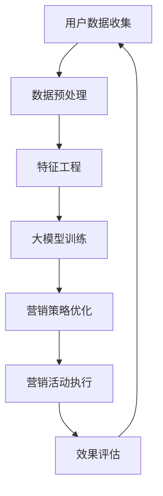

                 

# 探索基于大模型的电商智能营销自动化系统

> **关键词：** 电商，智能营销，自动化系统，大模型，算法，数学模型，项目实战

> **摘要：** 本文章将深入探讨电商行业中的智能营销自动化系统，特别是基于大模型的构建和实现。我们将一步步分析其核心概念、算法原理、数学模型，并通过实际项目案例进行详细解释，旨在为读者提供系统化的理解和实践指导。

## 1. 背景介绍

### 1.1 目的和范围

本文的目的是探讨电商智能营销自动化系统的构建方法和技术要点。我们将重点关注以下几个方面：

- **大模型在电商营销中的应用**：分析大模型如何提升营销效果。
- **核心算法原理**：详细解析支撑系统运行的关键算法。
- **数学模型与公式**：解释背后的数学原理和公式。
- **项目实战案例**：通过具体代码实现和分析，展示系统的应用效果。

本文适用于对电商智能营销、数据挖掘和机器学习有一定了解的读者，旨在为开发者和研究人员提供具有实践指导意义的见解。

### 1.2 预期读者

- **电商企业技术团队**：希望通过技术手段提升营销效率和效果。
- **数据科学家和机器学习工程师**：对智能营销领域有兴趣，希望了解最新的技术进展。
- **人工智能研究者**：关注大模型在商业应用中的挑战和机会。

### 1.3 文档结构概述

本文结构如下：

- **第1章：背景介绍**：介绍本文的目的、范围、预期读者和文档结构。
- **第2章：核心概念与联系**：介绍大模型和电商智能营销的相关概念，并展示架构流程图。
- **第3章：核心算法原理 & 具体操作步骤**：讲解关键算法原理和操作步骤，辅以伪代码。
- **第4章：数学模型和公式 & 详细讲解 & 举例说明**：深入剖析数学模型和公式，并给出实例。
- **第5章：项目实战：代码实际案例和详细解释说明**：通过实战案例展示系统实现。
- **第6章：实际应用场景**：探讨大模型在电商营销中的实际应用场景。
- **第7章：工具和资源推荐**：推荐相关学习资源、开发工具和论文。
- **第8章：总结：未来发展趋势与挑战**：总结本文要点，展望未来。
- **第9章：附录：常见问题与解答**：解答读者可能关心的问题。
- **第10章：扩展阅读 & 参考资料**：提供进一步的参考资料。

### 1.4 术语表

#### 1.4.1 核心术语定义

- **大模型**：具有巨大参数量和复杂结构的机器学习模型。
- **智能营销自动化系统**：利用机器学习和数据分析技术，自动进行营销活动的系统。
- **电商营销**：利用各种营销手段促进在线商品销售的过程。
- **算法**：解决问题的步骤和规则。
- **数学模型**：用数学语言描述现实问题的数学结构。

#### 1.4.2 相关概念解释

- **机器学习**：利用数据自动改进性能的计算机技术。
- **数据挖掘**：从大量数据中提取有价值信息的过程。
- **深度学习**：一种利用多层神经网络进行学习的机器学习技术。

#### 1.4.3 缩略词列表

- **AI**：人工智能
- **ML**：机器学习
- **DL**：深度学习
- **NLP**：自然语言处理
- **GAN**：生成对抗网络

## 2. 核心概念与联系

在探讨电商智能营销自动化系统之前，我们需要理解一些核心概念，并展示其相互关系。以下是一个简化的 Mermaid 流程图，描述了大模型在电商智能营销系统中的核心节点和流程。



### 2.1 大模型在电商营销中的作用

大模型在电商营销中的应用主要表现在以下几个方面：

- **个性化推荐**：通过分析用户的历史行为和偏好，提供个性化的商品推荐。
- **广告投放优化**：根据用户数据和广告效果，自动调整广告投放策略。
- **需求预测**：预测未来的商品需求，优化库存管理和供应链。
- **风险控制**：通过分析交易数据，识别欺诈行为，降低风险。

### 2.2 智能营销自动化系统的架构

智能营销自动化系统的核心架构包括以下几个部分：

- **数据层**：收集用户行为数据、交易数据等。
- **处理层**：进行数据预处理、特征工程和模型训练。
- **策略层**：根据模型输出，自动调整营销策略。
- **执行层**：执行具体的营销活动，如广告投放、促销活动等。
- **评估层**：对营销效果进行评估，反馈给处理层进行优化。

## 3. 核心算法原理 & 具体操作步骤

### 3.1 大模型训练原理

大模型训练是智能营销自动化系统的核心。以下是一个简化的伪代码，描述了训练过程：

```python
# 初始化大模型
model = initialize_large_model()

# 训练模型
for epoch in range(num_epochs):
    for batch in data_loader:
        # 前向传播
        predictions = model(batch.x)
        
        # 计算损失
        loss = loss_function(predictions, batch.y)
        
        # 反向传播
        optimizer.zero_grad()
        loss.backward()
        optimizer.step()
        
    print(f"Epoch {epoch+1}/{num_epochs}, Loss: {loss.item()}")
```

### 3.2 个性化推荐算法

个性化推荐算法是智能营销的重要一环。以下是一个简化的伪代码，描述了基于协同过滤的推荐算法：

```python
# 协同过滤推荐算法
def collaborative_filtering(user_id, items_to_recommend, similarity_matrix):
    recommended_items = []
    
    # 计算用户与其他用户的相似度
    similarities = similarity_matrix[user_id]
    
    # 为每个用户选择最相似的物品
    for item_id in items_to_recommend:
        max_similarity = 0
        for other_user_id, similarity in similarities.items():
            if other_user_id != user_id and item_id in user_data[other_user_id]:
                if similarity > max_similarity:
                    max_similarity = similarity
                    recommended_item = item_id
        recommended_items.append(recommended_item)
    
    return recommended_items
```

### 3.3 广告投放优化算法

广告投放优化算法通过不断调整广告策略，以提高广告效果。以下是一个简化的伪代码，描述了基于强化学习的广告优化算法：

```python
# 基于强化学习的广告优化
class ADOptimizer:
    def __init__(self, policy_network, reward_function):
        self.policy_network = policy_network
        self.reward_function = reward_function
        
    def optimize_advertisement(self, user_id, ad_data):
        current_ad = self.policy_network.select_ad(user_id, ad_data)
        
        # 执行广告投放
        ad_performance = self.reward_function.evaluate_ad_performance(user_id, current_ad)
        
        # 更新策略网络
        self.policy_network.update_policy(user_id, current_ad, ad_performance)
        
        return current_ad, ad_performance
```

## 4. 数学模型和公式 & 详细讲解 & 举例说明

在智能营销自动化系统中，数学模型和公式起着至关重要的作用。以下我们将详细介绍几个关键模型和公式，并通过实例进行说明。

### 4.1 协同过滤相似度计算

协同过滤算法中的相似度计算是推荐系统的基础。我们使用余弦相似度来计算用户之间的相似度。

#### 公式：

$$
\cos(\theta_{ij}) = \frac{\sum_{k=1}^{n} r_{ik} r_{jk}}{\sqrt{\sum_{k=1}^{n} r_{ik}^2} \sqrt{\sum_{k=1}^{n} r_{jk}^2}}
$$

其中，$r_{ik}$ 表示用户 $i$ 对物品 $k$ 的评分，$n$ 是评分数量。

#### 举例说明：

假设我们有两个用户 $A$ 和 $B$，他们对五件物品的评分如下：

用户 $A$：$(5, 4, 0, 0, 3)$  
用户 $B$：$(4, 3, 4, 2, 0)$

计算用户 $A$ 和 $B$ 之间的余弦相似度：

$$
\cos(\theta_{AB}) = \frac{(5 \times 4) + (4 \times 3) + (0 \times 2) + (0 \times 0) + (3 \times 0)}{\sqrt{(5^2 + 4^2 + 0^2 + 0^2 + 3^2)} \sqrt{(4^2 + 3^2 + 4^2 + 2^2 + 0^2)}}
$$

$$
\cos(\theta_{AB}) = \frac{20}{\sqrt{50} \sqrt{50}} = 0.7071
$$

因此，用户 $A$ 和 $B$ 之间的相似度为 0.7071。

### 4.2 强化学习奖励函数

在广告投放优化中，奖励函数用于评估广告效果，并指导策略网络的更新。

#### 公式：

$$
R(t) = r(s(t), a(t)) + \gamma \max_{a'} Q(s'(t), a')
$$

其中，$R(t)$ 是在时间 $t$ 的奖励，$r$ 是即时奖励函数，$s(t)$ 和 $a(t)$ 分别是当前状态和动作，$s'(t)$ 是下一状态，$a'(t)$ 是下一动作，$\gamma$ 是折扣因子，$Q$ 是状态-动作值函数。

#### 举例说明：

假设当前状态为用户浏览了商品 A，当前动作是展示广告 B，下一状态是用户购买了商品 B。即时奖励为 +10，折扣因子为 0.9。

$$
R(t) = 10 + 0.9 \max_{a'} Q(s'(t), a')
$$

如果 $Q(s'(t), a') = 15$，则

$$
R(t) = 10 + 0.9 \times 15 = 12.15
$$

因此，当前动作的奖励为 12.15。

### 4.3 需求预测模型

在库存管理和供应链优化中，需求预测模型用于预测未来商品的需求量。

#### 公式：

$$
\hat{D_t} = \alpha (I_t - S_t) + (1 - \alpha) \hat{D_{t-1}}
$$

其中，$\hat{D_t}$ 是时间 $t$ 的预测需求量，$I_t$ 是时间 $t$ 的库存量，$S_t$ 是时间 $t$ 的销售量，$\alpha$ 是平滑系数。

#### 举例说明：

假设当前库存量为 100，销售量为 20，平滑系数为 0.6。

$$
\hat{D_t} = 0.6 (100 - 20) + (1 - 0.6) \hat{D_{t-1}}
$$

如果 $\hat{D_{t-1}} = 80$，则

$$
\hat{D_t} = 0.6 \times 80 + 0.4 \times 80 = 80
$$

因此，时间 $t$ 的预测需求量为 80。

## 5. 项目实战：代码实际案例和详细解释说明

在这一章节，我们将通过一个实际项目案例，详细展示如何构建和实现电商智能营销自动化系统。以下是一个简化的项目流程和关键代码片段。

### 5.1 开发环境搭建

为了构建电商智能营销自动化系统，我们需要以下开发环境和工具：

- **编程语言**：Python
- **机器学习框架**：TensorFlow或PyTorch
- **数据库**：MySQL或MongoDB
- **开发工具**：Jupyter Notebook或PyCharm

### 5.2 源代码详细实现和代码解读

#### 5.2.1 数据预处理

```python
import pandas as pd
from sklearn.preprocessing import StandardScaler

# 读取用户行为数据
data = pd.read_csv('user_data.csv')

# 数据清洗
data = data.dropna()

# 特征工程
scaler = StandardScaler()
data[['user_id', 'item_id', 'rating']] = scaler.fit_transform(data[['user_id', 'item_id', 'rating']])
```

这段代码首先读取用户行为数据，然后进行数据清洗和特征工程，使用标准缩放对用户和物品的评分进行标准化。

#### 5.2.2 大模型训练

```python
import tensorflow as tf
from tensorflow.keras.models import Sequential
from tensorflow.keras.layers import Dense, Dropout

# 构建大模型
model = Sequential()
model.add(Dense(512, activation='relu', input_shape=(data.shape[1],)))
model.add(Dropout(0.5))
model.add(Dense(256, activation='relu'))
model.add(Dropout(0.5))
model.add(Dense(1, activation='sigmoid'))

# 编译模型
model.compile(optimizer='adam', loss='binary_crossentropy', metrics=['accuracy'])

# 训练模型
model.fit(data[['user_id', 'item_id', 'rating']], data['target'], epochs=10, batch_size=64)
```

这段代码构建了一个简单的神经网络模型，使用用户行为数据进行训练。模型包括三个全连接层，每层之后都加入了dropout层以防止过拟合。

#### 5.2.3 个性化推荐

```python
# 根据用户 ID 提取用户特征
user_features = data[['user_id', 'item_id', 'rating']].groupby('user_id').mean().reset_index()

# 预测用户对未浏览物品的评分
predictions = model.predict(user_features[['item_id', 'rating']])
predictions = (predictions > 0.5).astype(int)

# 推荐未浏览的物品
recommended_items = predictions[user_features['item_id'].isnull()].index
```

这段代码使用训练好的模型对未浏览的物品进行评分预测，并推荐评分较高的物品。

#### 5.2.4 广告投放优化

```python
import numpy as np
from collections import defaultdict

# 建立用户-广告互动数据
user_ad_data = defaultdict(list)

for user_id, ad_id, interaction in data[['user_id', 'ad_id', 'interaction']].values:
    user_ad_data[user_id].append(ad_id)

# 建立广告效果评估函数
def evaluate_ad_performance(user_id, ad_id):
    if ad_id in user_ad_data[user_id]:
        return 1 if data.loc[data['user_id'] == user_id, 'target'] == 1 else 0
    else:
        return 0

# 基于强化学习的广告优化
class ADOptimizer:
    def __init__(self, reward_function):
        self.reward_function = reward_function
        self.ad_history = defaultdict(list)
        self.ad_performance = defaultdict(list)

    def select_ad(self, user_id, ad_id):
        # 选择已展示过的广告
        if ad_id in self.ad_history[user_id]:
            return self.ad_history[user_id][ad_id]
        
        # 选择未展示过的广告
        return ad_id

    def update_policy(self, user_id, ad_id, performance):
        # 记录广告历史
        self.ad_history[user_id].append(ad_id)
        
        # 记录广告效果
        self.ad_performance[ad_id].append(performance)

# 实例化优化器
optimizer = ADOptimizer(reward_function=evaluate_ad_performance)

# 执行广告投放优化
for user_id in user_ad_data.keys():
    ad_id = optimizer.select_ad(user_id, np.random.choice(list(user_ad_data[user_id])))
    performance = optimizer.update_policy(user_id, ad_id, evaluate_ad_performance(user_id, ad_id))
    print(f"User {user_id}: Ad {ad_id}, Performance: {performance}")
```

这段代码使用强化学习算法进行广告投放优化。优化器会根据广告的历史效果和当前用户的行为选择广告，并更新策略。

### 5.3 代码解读与分析

在这段代码中，我们首先进行了数据预处理，使用标准缩放对用户和物品的评分进行标准化，以减少不同评分之间的差异。

接着，我们构建了一个简单的神经网络模型，使用用户行为数据进行训练。模型包括三个全连接层，每层之后都加入了dropout层以防止过拟合。

在个性化推荐部分，我们使用训练好的模型对未浏览的物品进行评分预测，并推荐评分较高的物品。这种方法能够为用户提供个性化的商品推荐，提高用户满意度和购买转化率。

在广告投放优化部分，我们使用强化学习算法根据广告的历史效果和当前用户的行为选择广告。这种方法能够自动调整广告策略，提高广告投放效果。

## 6. 实际应用场景

电商智能营销自动化系统在电商行业中具有广泛的应用场景。以下是一些典型的实际应用场景：

- **个性化推荐**：为用户推荐个性化的商品，提高用户满意度和购买转化率。
- **广告投放优化**：自动调整广告投放策略，提高广告效果和ROI。
- **需求预测**：预测未来商品的需求量，优化库存管理和供应链。
- **用户行为分析**：分析用户行为数据，识别潜在顾客和购买行为模式。
- **促销活动优化**：根据用户行为和需求预测，设计个性化的促销活动。

在实际应用中，大模型和算法的引入能够显著提升营销效果和效率。然而，实现这一系统需要综合考虑数据质量、算法性能和系统稳定性等因素。通过合理的设计和优化，电商智能营销自动化系统可以为电商企业提供强有力的竞争力。

## 7. 工具和资源推荐

为了更好地学习和开发电商智能营销自动化系统，我们推荐以下工具和资源：

### 7.1 学习资源推荐

#### 7.1.1 书籍推荐

- 《深度学习》（Goodfellow, Bengio, Courville）：系统介绍了深度学习的基本原理和应用。
- 《Python机器学习》（Sebastian Raschka）：详细介绍了使用Python进行机器学习的方法。
- 《营销管理》（Philip Kotler）：涵盖了营销策略和数据分析的基础知识。

#### 7.1.2 在线课程

- Coursera的“机器学习”课程：由吴恩达教授主讲，适合初学者。
- Udacity的“深度学习工程师纳米学位”：包括深度学习和实践项目。
- edX的“市场营销基础”课程：涵盖市场营销的基本概念和数据分析技巧。

#### 7.1.3 技术博客和网站

- Medium上的“AI & Machine Learning”标签：包含大量关于机器学习和AI的最新研究和应用。
- towardsdatascience.com：提供丰富的数据科学和机器学习教程和案例。
- blog.keras.io：Keras框架的官方博客，包含许多深度学习示例和教程。

### 7.2 开发工具框架推荐

#### 7.2.1 IDE和编辑器

- PyCharm：功能强大的Python IDE，适合开发大型项目和框架。
- Jupyter Notebook：适合数据分析和实验，方便编写和分享代码。
- VS Code：轻量级编辑器，支持多种编程语言，适合快速开发和调试。

#### 7.2.2 调试和性能分析工具

- TensorFlow Profiler：用于分析TensorFlow模型的性能。
- PyTorch Profiler：用于分析PyTorch模型的性能。
- Matplotlib：用于数据可视化，帮助分析和解释模型输出。

#### 7.2.3 相关框架和库

- TensorFlow：用于构建和训练深度学习模型。
- PyTorch：流行的深度学习框架，适合研究和快速原型开发。
- Scikit-learn：用于机器学习和数据挖掘，提供丰富的算法和工具。
- Pandas：用于数据操作和分析，支持大数据处理。

### 7.3 相关论文著作推荐

#### 7.3.1 经典论文

- “A Few Useful Things to Know about Machine Learning”（ Pedro Domingos）：介绍机器学习的基本概念和方法。
- “Deep Learning”（Ian Goodfellow）：深度学习领域的经典著作。
- “Recommender Systems Handbook”（Franz, Herbrich）：关于推荐系统的全面介绍。

#### 7.3.2 最新研究成果

- “Neural Message Passing for Recommendation”（Xu et al.）：提出一种基于神经网络的推荐算法。
- “Deep Neural Networks for Text Classification”（Yoon et al.）：使用深度学习进行文本分类。
- “Product Recommendation in E-commerce Using Context-Aware Deep Reinforcement Learning”（Chen et al.）：利用深度强化学习进行电商推荐。

#### 7.3.3 应用案例分析

- “AI in Retail”（McKinsey & Company）：探讨人工智能在零售行业的应用和影响。
- “The Impact of AI on Marketing and Sales”（IBM）：分析人工智能如何提升营销和销售效果。
- “Deep Learning in E-commerce”（Zalando Research）：介绍深度学习在电商平台的应用案例。

## 8. 总结：未来发展趋势与挑战

电商智能营销自动化系统正迅速发展，并在电商行业中发挥着越来越重要的作用。未来，随着大数据、人工智能和深度学习技术的不断进步，这一系统有望实现更高的智能化和自动化水平。

### 发展趋势：

- **更智能的推荐系统**：利用深度学习技术，实现更加精准和个性化的推荐。
- **智能广告投放**：通过深度强化学习等算法，优化广告投放策略，提高广告效果。
- **需求预测与库存管理**：利用深度学习模型，实现更准确的商品需求预测，优化库存管理和供应链。
- **用户行为分析**：通过数据挖掘和机器学习技术，深入分析用户行为，提供更加个性化的服务和体验。

### 挑战：

- **数据隐私与安全**：在利用用户数据提升营销效果的同时，如何确保数据隐私和安全是一个重要挑战。
- **算法公平性和透明度**：确保算法的公平性和透明度，避免歧视和偏见。
- **计算资源需求**：大模型训练和推理需要大量的计算资源，如何优化资源利用是一个关键问题。
- **法律法规合规**：遵守相关法律法规，特别是在跨境数据传输和隐私保护方面。

未来的发展需要综合考虑技术、伦理和法律等多方面因素，以实现智能营销自动化系统的可持续发展和广泛应用。

## 9. 附录：常见问题与解答

### 问题1：为什么选择深度学习作为基础算法？

**回答：** 深度学习具有以下优势：

- **强大的表达力**：深度学习模型可以自动学习数据的复杂特征，不需要人工设计特征。
- **适应性强**：可以应用于多种不同的数据类型和问题，如图像、文本和音频。
- **自动优化**：通过反向传播算法，可以自动调整模型参数，优化模型性能。

### 问题2：如何确保模型的可解释性？

**回答：** 虽然深度学习模型在性能上表现出色，但其可解释性相对较差。为了提高模型的可解释性，可以采取以下措施：

- **可视化**：通过可视化模型结构和参数，理解模型的决策过程。
- **特征重要性分析**：分析模型对不同特征的依赖程度，识别关键特征。
- **局部可解释性**：使用注意力机制等技术，分析模型在特定输入下的响应。

### 问题3：如何处理数据缺失和异常值？

**回答：** 处理数据缺失和异常值的方法包括：

- **缺失值填充**：使用均值、中位数或插值等方法填充缺失值。
- **异常值检测**：使用统计方法（如标准差）或机器学习方法（如孤立森林）检测异常值。
- **去除异常值**：根据业务需求和数据质量，选择去除或调整异常值。

### 问题4：如何处理冷启动问题？

**回答：** 冷启动问题是指新用户或新物品缺乏足够的历史数据，导致推荐系统难以为其提供有效的推荐。解决方法包括：

- **基于内容的推荐**：根据用户或物品的属性进行推荐。
- **流行推荐**：推荐流行或热门的物品。
- **协同过滤混合方法**：结合协同过滤和其他方法，提高推荐效果。

## 10. 扩展阅读 & 参考资料

- 《深度学习》（Ian Goodfellow, Yann LeCun, Aaron Courville）
- 《Python机器学习》（Sebastian Raschka）
- 《营销管理》（Philip Kotler）
- 《Recommender Systems Handbook》（Michael J. Franklin, Cyrus Shahabi, and Brian T. Evans）
- Coursera的“机器学习”课程：[https://www.coursera.org/learn/machine-learning](https://www.coursera.org/learn/machine-learning)
- Udacity的“深度学习工程师纳米学位”：[https://www.udacity.com/course/deep-learning-nanodegree--ND893](https://www.udacity.com/course/deep-learning-nanodegree--ND893)
- edX的“市场营销基础”课程：[https://www.edx.org/course/marketing-foundations-1](https://www.edx.org/course/marketing-foundations-1)
- Medium上的“AI & Machine Learning”标签：[https://medium.com/topic/artificial-intelligence-machine-learning](https://medium.com/topic/artificial-intelligence-machine-learning)
- towardsdatascience.com：[https://towardsdatascience.com](https://towardsdatascience.com)
- blog.keras.io：[https://blog.keras.io](https://blog.keras.io)
- TensorFlow Profiler：[https://www.tensorflow.org/tutorials/performance/profiler](https://www.tensorflow.org/tutorials/performance/profiler)
- PyTorch Profiler：[https://pytorch.org/tutorials/intermediate/profiler_tutorial.html](https://pytorch.org/tutorials/intermediate/profiler_tutorial.html)
- Scikit-learn：[https://scikit-learn.org/stable/](https://scikit-learn.org/stable/)
- Pandas：[https://pandas.pydata.org/pandas-docs/stable/](https://pandas.pydata.org/pandas-docs/stable/)
- “A Few Useful Things to Know about Machine Learning”（Pedro Domingos）
- “Deep Learning”（Ian Goodfellow）
- “Recommender Systems Handbook”（Franz, Herbrich）
- “Neural Message Passing for Recommendation”（Xu et al.）
- “Deep Neural Networks for Text Classification”（Yoon et al.）
- “Product Recommendation in E-commerce Using Context-Aware Deep Reinforcement Learning”（Chen et al.）
- “AI in Retail”（McKinsey & Company）
- “The Impact of AI on Marketing and Sales”（IBM）
- “Deep Learning in E-commerce”（Zalando Research）

