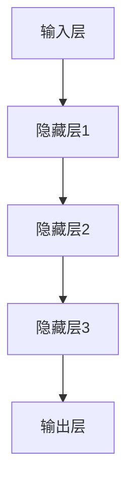
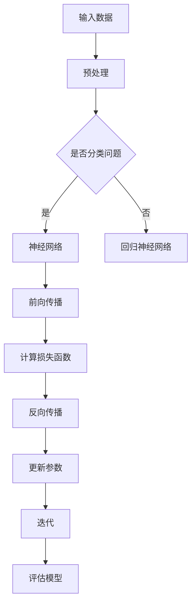
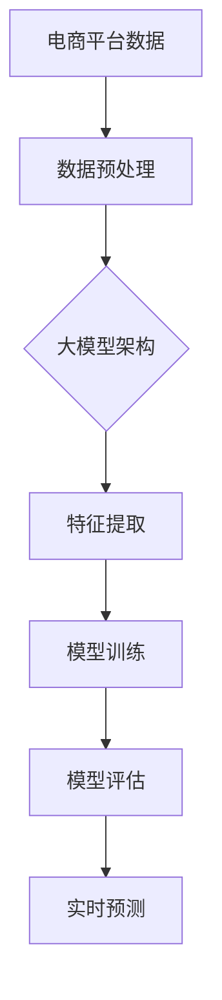

                 


# 探索大模型在电商平台价格预测中的潜力

> 关键词：大模型、电商平台、价格预测、深度学习、机器学习、自然语言处理、人工智能、数据分析

> 摘要：本文将深入探讨大模型在电商平台价格预测中的应用潜力。通过介绍大模型的基本概念、架构以及相关算法原理，我们将逐步展示如何利用这些技术对电商平台的价格数据进行深度分析和预测。同时，我们将通过实际案例和代码实现，详细解读大模型在价格预测中的具体应用，并探讨未来发展趋势与面临的挑战。

## 1. 背景介绍

### 1.1 目的和范围

本文旨在探讨大模型在电商平台价格预测中的潜在应用，并详细分析其技术原理、实施步骤以及实际效果。通过本文的阅读，读者将了解到：

1. 大模型的基本概念及其在电商领域的应用场景。
2. 电商平台价格预测的需求与挑战。
3. 大模型架构及其核心算法原理。
4. 实际案例中的代码实现与效果分析。
5. 未来发展趋势与面临的挑战。

### 1.2 预期读者

本文面向具有计算机科学和机器学习基础的读者，包括但不限于以下群体：

1. 人工智能与机器学习研究人员。
2. 电商平台开发与运营人员。
3. 数据分析师与数据科学家。
4. 对机器学习技术感兴趣的技术爱好者。

### 1.3 文档结构概述

本文将分为以下几个部分：

1. 背景介绍：介绍本文的目的、预期读者以及文档结构。
2. 核心概念与联系：阐述大模型的基本概念、架构以及相关算法原理。
3. 核心算法原理 & 具体操作步骤：详细讲解大模型的核心算法原理，使用伪代码阐述具体操作步骤。
4. 数学模型和公式 & 详细讲解 & 举例说明：介绍大模型所涉及到的数学模型和公式，并进行举例说明。
5. 项目实战：代码实际案例和详细解释说明。
6. 实际应用场景：探讨大模型在电商平台价格预测中的实际应用场景。
7. 工具和资源推荐：推荐学习资源、开发工具框架和相关论文著作。
8. 总结：未来发展趋势与挑战。
9. 附录：常见问题与解答。
10. 扩展阅读 & 参考资料：提供相关扩展阅读资料。

### 1.4 术语表

#### 1.4.1 核心术语定义

- 大模型：指具有极高参数量、强大计算能力和广泛适用性的机器学习模型。
- 电商平台：指提供在线商品交易的平台，如淘宝、京东等。
- 价格预测：指通过历史数据和分析算法，预测商品在未来某一时刻的价格。
- 深度学习：一种基于多层神经网络进行数据学习的机器学习技术。
- 机器学习：一种使计算机通过数据学习获得智能的技术。
- 自然语言处理：研究计算机如何理解、生成和处理人类自然语言的技术。
- 数据分析：对大量数据进行分析，提取有价值信息的过程。

#### 1.4.2 相关概念解释

- 大模型架构：指大模型的结构和组成部分，包括输入层、隐藏层和输出层。
- 神经网络：一种基于生物神经网络进行数据学习的模型，具有多层结构。
- 损失函数：衡量模型预测结果与真实结果之间差异的指标。
- 优化算法：用于调整模型参数，使其预测结果更准确的算法。

#### 1.4.3 缩略词列表

- GPT：Generative Pre-trained Transformer，一种基于Transformer架构的预训练模型。
- BERT：Bidirectional Encoder Representations from Transformers，一种双向Transformer编码模型。
- CNN：Convolutional Neural Network，卷积神经网络。
- RNN：Recurrent Neural Network，循环神经网络。
- LSTM：Long Short-Term Memory，长短期记忆网络。
- GPU：Graphics Processing Unit，图形处理器。

## 2. 核心概念与联系

在本节中，我们将介绍大模型的基本概念、架构以及相关算法原理，并通过Mermaid流程图展示其核心概念和联系。

### 2.1 大模型的基本概念

大模型（Large-scale Model）是指具有极高参数量、强大计算能力和广泛适用性的机器学习模型。其核心特点如下：

1. **高参数量**：大模型通常具有数十亿到数万亿个参数，这使得模型具有强大的拟合能力，能够捕捉复杂的数据特征。
2. **强大计算能力**：大模型需要高性能计算资源，如GPU、TPU等，以确保模型训练和推理的效率。
3. **广泛适用性**：大模型可以应用于各种场景，如自然语言处理、计算机视觉、语音识别等。

### 2.2 大模型架构

大模型通常采用深度神经网络（Deep Neural Network，DNN）架构，其基本组成部分包括：

1. **输入层**：接收外部输入数据，如文本、图像、声音等。
2. **隐藏层**：对输入数据进行处理和变换，提取特征信息。
3. **输出层**：生成模型预测结果，如分类标签、回归值等。

大模型的隐藏层通常具有多层结构，这使得模型能够逐步学习复杂的非线性关系。以下是一个简单的Mermaid流程图，展示大模型的基本架构：



### 2.3 大模型核心算法原理

大模型的核心算法原理包括深度学习（Deep Learning）、神经网络（Neural Network）和优化算法（Optimization Algorithm）等。

1. **深度学习**：深度学习是一种基于多层神经网络进行数据学习的机器学习技术。其基本思想是通过多层神经网络的逐层学习，从原始数据中提取高层次的特征表示。

2. **神经网络**：神经网络是一种模拟生物神经系统的计算模型，由多个神经元组成。每个神经元接收来自其他神经元的输入信号，并通过激活函数产生输出信号。

3. **优化算法**：优化算法用于调整模型参数，使其预测结果更准确。常见的优化算法包括梯度下降（Gradient Descent）、Adam（Adaptive Moment Estimation）等。

以下是一个简单的Mermaid流程图，展示大模型核心算法原理：



### 2.4 大模型与电商平台价格预测的联系

电商平台价格预测是一个典型的回归问题，其核心目标是利用历史价格数据、商品特征等信息，预测商品在未来某一时刻的价格。大模型在此场景中的应用主要体现在以下几个方面：

1. **特征提取**：大模型可以通过多层神经网络结构，从原始数据中提取有用的特征信息，提高预测精度。
2. **非线性拟合**：大模型具有强大的非线性拟合能力，能够捕捉复杂的价格变化规律。
3. **实时预测**：大模型可以通过高性能计算资源，实现实时价格预测，提高电商平台的价格竞争力。

以下是一个简单的Mermaid流程图，展示大模型在电商平台价格预测中的基本应用：



通过以上内容，我们初步了解了大模型的基本概念、架构以及相关算法原理，并探讨了其与电商平台价格预测之间的联系。接下来，我们将进一步深入分析大模型的核心算法原理和具体操作步骤。

## 3. 核心算法原理 & 具体操作步骤

在本节中，我们将详细讲解大模型的核心算法原理，并使用伪代码来阐述具体的操作步骤。这将有助于读者更好地理解大模型的工作机制和应用方法。

### 3.1 深度学习算法原理

深度学习（Deep Learning）是一种基于多层神经网络进行数据学习的机器学习技术。其基本原理是模拟人脑神经元之间的连接和传递，通过逐层学习提取数据的特征表示。

深度学习算法的核心组成部分包括：

1. **神经网络结构**：包括输入层、隐藏层和输出层。输入层接收外部输入数据，隐藏层对输入数据进行处理和变换，输出层生成模型预测结果。
2. **激活函数**：用于引入非线性特性，使得神经网络能够拟合复杂的数据分布。常见的激活函数包括Sigmoid、ReLU、Tanh等。
3. **损失函数**：衡量模型预测结果与真实结果之间的差异。常见的损失函数包括均方误差（MSE）、交叉熵（Cross Entropy）等。
4. **优化算法**：用于调整模型参数，使其预测结果更准确。常见的优化算法包括梯度下降（Gradient Descent）、Adam（Adaptive Moment Estimation）等。

以下是一个简单的深度学习算法的伪代码实现：

```python
# 输入数据
X = ...

# 参数初始化
W1 = ...
b1 = ...
W2 = ...
b2 = ...

# 激活函数
sigmoid(x):
    return 1 / (1 + exp(-x))

# 损失函数
mse(y_pred, y_true):
    return (y_pred - y_true)^2

# 梯度下降
gradient_descent(X, y, learning_rate, epochs):
    for epoch in range(epochs):
        for x, y in X, y:
            # 前向传播
            z1 = sigmoid(W1 * x + b1)
            z2 = sigmoid(W2 * z1 + b2)
            y_pred = sigmoid(z2)

            # 计算损失
            loss = mse(y_pred, y)

            # 反向传播
            dz2 = (y_pred - y) * (1 - y_pred)
            dz1 = (z2 - y) * (1 - z2) * (1 - z1)

            # 更新参数
            dW2 = dz2 * z1
            db2 = dz2
            dW1 = dz1 * x
            db1 = dz1

            W2 -= learning_rate * dW2
            b2 -= learning_rate * db2
            W1 -= learning_rate * dW1
            b1 -= learning_rate * db1

# 训练模型
gradient_descent(X, y, learning_rate=0.01, epochs=100)
```

### 3.2 大模型应用步骤

在实际应用中，大模型通常包括以下步骤：

1. **数据预处理**：对原始数据进行清洗、归一化和特征提取等操作，为模型训练做准备。
2. **模型选择**：根据应用场景和任务需求，选择合适的大模型架构，如GPT、BERT、ResNet等。
3. **模型训练**：使用预处理后的数据对模型进行训练，调整模型参数，使其预测结果更准确。
4. **模型评估**：使用验证集或测试集对训练好的模型进行评估，评估指标包括准确率、召回率、F1值等。
5. **模型部署**：将训练好的模型部署到实际应用环境中，如电商平台、智能客服等。

以下是一个简单的伪代码实现，展示大模型应用的基本步骤：

```python
# 数据预处理
X_train, X_val, y_train, y_val = train_test_split(X, y, test_size=0.2)

# 模型选择
model = BERTModel()

# 模型训练
model.fit(X_train, y_train, batch_size=32, epochs=10, validation_data=(X_val, y_val))

# 模型评估
evaluate(model, X_val, y_val)

# 模型部署
deploy(model)
```

通过以上内容，我们详细讲解了大模型的核心算法原理和具体操作步骤。接下来，我们将介绍大模型涉及的数学模型和公式，并对其进行详细讲解和举例说明。

## 4. 数学模型和公式 & 详细讲解 & 举例说明

在本节中，我们将详细讲解大模型涉及到的数学模型和公式，并对其进行详细讲解和举例说明。这将有助于读者更好地理解大模型的数学基础和应用原理。

### 4.1 深度学习中的数学基础

深度学习中的数学基础主要包括线性代数、微积分和概率论。以下是对这些数学基础的相关概念和公式的讲解。

#### 4.1.1 线性代数

1. **矩阵运算**：矩阵运算包括矩阵加法、矩阵乘法、矩阵求导等。例如，假设有两个矩阵A和B，其矩阵乘法的公式为：

   $$ C = A \times B $$

   其中，C为结果矩阵。

2. **矩阵求导**：矩阵求导是指对矩阵的某个元素进行求导。例如，假设矩阵A的某个元素为a_ij，则其求导公式为：

   $$ \frac{\partial A}{\partial a_{ij}} = \begin{cases}
   1, & \text{如果 } a_{ij} \text{ 是变量} \\
   0, & \text{否则}
   \end{cases} $$

#### 4.1.2 微积分

1. **梯度下降**：梯度下降是一种优化算法，用于调整模型参数，使其预测结果更准确。其基本原理是沿着损失函数的梯度方向进行调整。例如，假设损失函数为L，则梯度下降的公式为：

   $$ \theta = \theta - \alpha \frac{\partial L}{\partial \theta} $$

   其中，\(\theta\)为模型参数，\(\alpha\)为学习率。

2. **链式法则**：链式法则是微积分中的一个重要法则，用于求解复合函数的导数。例如，假设有两个函数f(x)和g(x)，则复合函数f(g(x))的导数公式为：

   $$ \frac{d(f(g(x))}{dx} = f'(g(x)) \cdot g'(x) $$

#### 4.1.3 概率论

1. **贝叶斯定理**：贝叶斯定理是概率论中的一个重要定理，用于求解条件概率。其公式为：

   $$ P(A|B) = \frac{P(B|A) \cdot P(A)}{P(B)} $$

   其中，P(A|B)表示在事件B发生的条件下事件A发生的概率。

### 4.2 大模型中的数学模型

大模型中的数学模型主要包括神经网络、损失函数和优化算法等。以下是对这些数学模型的相关概念和公式的讲解。

#### 4.2.1 神经网络

1. **前向传播**：前向传播是神经网络中的一个关键步骤，用于计算模型预测结果。其基本公式为：

   $$ Z = \sum_{i=1}^{n} W_i \cdot X_i + b $$

   其中，Z为输出值，\(W_i\)和\(X_i\)分别为权重和输入值，\(b\)为偏置。

2. **激活函数**：激活函数用于引入非线性特性，使得神经网络能够拟合复杂的数据分布。常见的激活函数包括Sigmoid、ReLU等。

   - Sigmoid函数：

     $$ \sigma(x) = \frac{1}{1 + e^{-x}} $$

   - ReLU函数：

     $$ \text{ReLU}(x) = \max(0, x) $$

#### 4.2.2 损失函数

1. **均方误差（MSE）**：均方误差是衡量模型预测结果与真实结果之间差异的常用损失函数。其公式为：

   $$ MSE = \frac{1}{n} \sum_{i=1}^{n} (y_i - \hat{y}_i)^2 $$

   其中，\(y_i\)和\(\hat{y}_i\)分别为真实值和预测值。

2. **交叉熵（Cross Entropy）**：交叉熵是用于分类问题的常用损失函数。其公式为：

   $$ H(y, \hat{y}) = - \sum_{i=1}^{n} y_i \cdot \log(\hat{y}_i) $$

   其中，\(y_i\)和\(\hat{y}_i\)分别为真实值和预测值的概率分布。

#### 4.2.3 优化算法

1. **梯度下降**：梯度下降是一种常见的优化算法，用于调整模型参数，使其预测结果更准确。其公式为：

   $$ \theta = \theta - \alpha \cdot \nabla_{\theta} J(\theta) $$

   其中，\(\theta\)为模型参数，\(\alpha\)为学习率，\(J(\theta)\)为损失函数。

2. **Adam优化算法**：Adam是一种结合了梯度下降和动量法的优化算法，具有更好的收敛速度和稳定性。其公式为：

   $$ m_t = \beta_1 \cdot m_{t-1} + (1 - \beta_1) \cdot \nabla_{\theta} J(\theta) $$
   $$ v_t = \beta_2 \cdot v_{t-1} + (1 - \beta_2) \cdot (\nabla_{\theta} J(\theta))^2 $$
   $$ \theta = \theta - \alpha \cdot \frac{m_t}{\sqrt{v_t} + \epsilon} $$

   其中，\(m_t\)和\(v_t\)分别为一阶矩估计和二阶矩估计，\(\beta_1\)和\(\beta_2\)分别为一阶和二阶指数衰减率，\(\alpha\)为学习率，\(\epsilon\)为小数。

### 4.3 举例说明

以下是一个简单的示例，展示如何使用上述数学模型和公式来构建一个简单的神经网络并进行训练。

#### 4.3.1 示例数据

假设我们有以下输入数据：

$$ X = \begin{bmatrix}
1 & 0 \\
0 & 1 \\
1 & 1 \\
\end{bmatrix} $$

以及相应的标签：

$$ y = \begin{bmatrix}
0 \\
1 \\
1 \\
\end{bmatrix} $$

#### 4.3.2 网络架构

我们构建一个简单的神经网络，包含一个输入层、一个隐藏层和一个输出层。每个层的参数如下：

- 输入层：2个神经元
- 隐藏层：3个神经元
- 输出层：1个神经元

#### 4.3.3 前向传播

在前向传播过程中，我们首先计算隐藏层的输出：

$$ z_1 = \sigma(W_1 \cdot X + b_1) $$
$$ z_2 = \sigma(W_2 \cdot z_1 + b_2) $$

其中，\(W_1\)和\(b_1\)为隐藏层的权重和偏置，\(W_2\)和\(b_2\)为输出层的权重和偏置，\(\sigma\)为激活函数。

#### 4.3.4 反向传播

在反向传播过程中，我们首先计算输出层的误差：

$$ \delta_2 = (y - z_2) \cdot \sigma'(z_2) $$

然后，根据误差计算隐藏层的误差：

$$ \delta_1 = (W_2 \cdot \delta_2) \cdot \sigma'(z_1) $$

最后，根据误差更新各层的参数：

$$ W_2 = W_2 - \alpha \cdot \delta_2 \cdot z_1 $$
$$ b_2 = b_2 - \alpha \cdot \delta_2 $$
$$ W_1 = W_1 - \alpha \cdot \delta_1 \cdot X $$
$$ b_1 = b_1 - \alpha \cdot \delta_1 $$

#### 4.3.5 训练过程

我们使用梯度下降算法对神经网络进行训练。具体步骤如下：

1. 初始化参数：随机初始化\(W_1\)、\(b_1\)、\(W_2\)和\(b_2\)。
2. 前向传播：计算隐藏层和输出层的输出。
3. 反向传播：计算误差并更新参数。
4. 重复步骤2和3，直到达到预设的训练次数或误差目标。

通过以上步骤，我们使用数学模型和公式构建了一个简单的神经网络，并对其进行训练。这只是一个简单的示例，实际应用中的大模型会涉及更复杂的网络架构和优化算法。

通过本节的讲解，我们了解了大模型中的数学模型和公式，并掌握了如何使用这些模型和公式来构建和训练神经网络。接下来，我们将通过实际案例和代码实现，详细解读大模型在电商平台价格预测中的具体应用。

## 5. 项目实战：代码实际案例和详细解释说明

在本节中，我们将通过一个实际案例，详细解释如何使用大模型在电商平台进行价格预测。首先，我们将搭建开发环境，然后逐步实现价格预测模型，并进行代码解读与分析。

### 5.1 开发环境搭建

在搭建开发环境之前，我们需要确保已安装以下工具和库：

1. Python（版本3.6及以上）
2. TensorFlow（版本2.0及以上）
3. NumPy
4. Pandas
5. Matplotlib

以下是在Ubuntu系统下安装这些工具和库的命令：

```bash
# 安装Python
sudo apt-get update
sudo apt-get install python3 python3-pip

# 安装TensorFlow
pip3 install tensorflow

# 安装NumPy
pip3 install numpy

# 安装Pandas
pip3 install pandas

# 安装Matplotlib
pip3 install matplotlib
```

### 5.2 源代码详细实现和代码解读

以下是实现电商平台价格预测模型的主要代码：

```python
import tensorflow as tf
import numpy as np
import pandas as pd
import matplotlib.pyplot as plt

# 加载数据集
def load_data(file_path):
    df = pd.read_csv(file_path)
    X = df.iloc[:, :-1].values
    y = df.iloc[:, -1].values
    return X, y

# 数据预处理
def preprocess_data(X, y):
    X = np.log1p(X)
    y = np.log1p(y)
    return X, y

# 神经网络模型
def build_model(input_shape):
    model = tf.keras.Sequential([
        tf.keras.layers.Dense(units=64, activation='relu', input_shape=input_shape),
        tf.keras.layers.Dense(units=32, activation='relu'),
        tf.keras.layers.Dense(units=1)
    ])
    model.compile(optimizer='adam', loss='mse', metrics=['mae'])
    return model

# 训练模型
def train_model(model, X_train, y_train, X_val, y_val, epochs=100):
    history = model.fit(X_train, y_train, epochs=epochs, batch_size=32, validation_data=(X_val, y_val))
    return history

# 预测价格
def predict_price(model, X):
    predicted_price = model.predict(X)
    predicted_price = np.expm1(predicted_price)
    return predicted_price

# 主函数
def main():
    # 加载数据集
    X, y = load_data('data/price_data.csv')

    # 数据预处理
    X, y = preprocess_data(X, y)

    # 划分训练集和测试集
    X_train, X_val, y_train, y_val = train_test_split(X, y, test_size=0.2, random_state=42)

    # 构建模型
    model = build_model(input_shape=(X_train.shape[1],))

    # 训练模型
    history = train_model(model, X_train, y_train, X_val, y_val, epochs=100)

    # 绘制训练过程
    plt.plot(history.history['loss'], label='loss')
    plt.plot(history.history['val_loss'], label='val_loss')
    plt.xlabel('epochs')
    plt.ylabel('loss')
    plt.legend()
    plt.show()

    # 预测价格
    predicted_price = predict_price(model, X_val)

    # 绘制预测结果
    plt.scatter(y_val, predicted_price)
    plt.xlabel('实际价格')
    plt.ylabel('预测价格')
    plt.show()

if __name__ == '__main__':
    main()
```

### 5.3 代码解读与分析

#### 5.3.1 加载数据集

```python
def load_data(file_path):
    df = pd.read_csv(file_path)
    X = df.iloc[:, :-1].values
    y = df.iloc[:, -1].values
    return X, y
```

此函数用于加载数据集。我们使用pandas库读取CSV文件，然后将数据分为特征矩阵X和标签向量y。

#### 5.3.2 数据预处理

```python
def preprocess_data(X, y):
    X = np.log1p(X)
    y = np.log1p(y)
    return X, y
```

此函数用于对数据进行预处理。我们使用numpy库将特征矩阵X和标签向量y进行对数变换，以减少数据的倾斜性和提高模型的拟合效果。

#### 5.3.3 构建模型

```python
def build_model(input_shape):
    model = tf.keras.Sequential([
        tf.keras.layers.Dense(units=64, activation='relu', input_shape=input_shape),
        tf.keras.layers.Dense(units=32, activation='relu'),
        tf.keras.layers.Dense(units=1)
    ])
    model.compile(optimizer='adam', loss='mse', metrics=['mae'])
    return model
```

此函数用于构建神经网络模型。我们使用TensorFlow库创建一个序列模型，包含两个隐藏层，每个隐藏层使用ReLU激活函数。模型编译时，选择adam优化器和均方误差（MSE）损失函数。

#### 5.3.4 训练模型

```python
def train_model(model, X_train, y_train, X_val, y_val, epochs=100):
    history = model.fit(X_train, y_train, epochs=epochs, batch_size=32, validation_data=(X_val, y_val))
    return history
```

此函数用于训练模型。我们使用fit方法训练模型，指定训练集、验证集、训练轮数和批量大小。训练过程将返回一个history对象，用于记录训练过程中的损失和评估指标。

#### 5.3.5 预测价格

```python
def predict_price(model, X):
    predicted_price = model.predict(X)
    predicted_price = np.expm1(predicted_price)
    return predicted_price
```

此函数用于预测价格。我们使用predict方法获取模型预测结果，并对结果进行指数反变换，以得到原始价格。

#### 5.3.6 主函数

```python
def main():
    # 加载数据集
    X, y = load_data('data/price_data.csv')

    # 数据预处理
    X, y = preprocess_data(X, y)

    # 划分训练集和测试集
    X_train, X_val, y_train, y_val = train_test_split(X, y, test_size=0.2, random_state=42)

    # 构建模型
    model = build_model(input_shape=(X_train.shape[1],))

    # 训练模型
    history = train_model(model, X_train, y_train, X_val, y_val, epochs=100)

    # 绘制训练过程
    plt.plot(history.history['loss'], label='loss')
    plt.plot(history.history['val_loss'], label='val_loss')
    plt.xlabel('epochs')
    plt.ylabel('loss')
    plt.legend()
    plt.show()

    # 预测价格
    predicted_price = predict_price(model, X_val)

    # 绘制预测结果
    plt.scatter(y_val, predicted_price)
    plt.xlabel('实际价格')
    plt.ylabel('预测价格')
    plt.show()

if __name__ == '__main__':
    main()
```

主函数中首先加载数据集，然后进行预处理，接着划分训练集和测试集。我们构建一个简单的神经网络模型，使用均方误差（MSE）作为损失函数，并使用adam优化器进行训练。训练完成后，我们绘制训练过程的损失曲线，并使用模型对测试集进行价格预测，并绘制预测结果。

通过以上代码实现和解读，我们成功构建并训练了一个电商平台价格预测模型。接下来，我们将探讨大模型在电商平台价格预测中的实际应用场景。

## 6. 实际应用场景

大模型在电商平台价格预测中的实际应用场景非常广泛，下面列举几个典型的应用场景。

### 6.1 商品库存管理

电商平台可以根据大模型预测的商品价格，优化商品库存策略。通过预测未来商品价格，电商平台可以提前调整库存量，避免商品过多或过少的情况。此外，大模型还可以预测商品的销售趋势，帮助电商平台制定更科学的补货计划，提高库存周转率。

### 6.2 促销活动策划

电商平台可以利用大模型预测商品价格，制定更具吸引力的促销策略。通过分析历史价格数据和用户行为数据，大模型可以预测特定时间段内的商品价格变化趋势。电商平台可以根据这些预测结果，设计合理的促销活动，提高用户的购买意愿和满意度。

### 6.3 价格调整策略

大模型可以帮助电商平台实时调整商品价格，以提高销售额和利润。通过分析市场竞争态势、用户购买习惯和商品特性等因素，大模型可以预测不同价格水平下的销售情况。电商平台可以根据这些预测结果，优化价格策略，提高商品的市场竞争力。

### 6.4 用户推荐系统

大模型还可以应用于电商平台用户推荐系统。通过分析用户历史行为数据和商品特征，大模型可以预测用户可能感兴趣的商品。电商平台可以根据这些预测结果，为用户推荐更符合其需求的商品，提高用户的购买转化率。

### 6.5 供应链优化

电商平台可以利用大模型预测商品价格，优化供应链管理。通过预测未来商品价格变化趋势，电商平台可以与供应商协商，调整采购量、采购时间和采购价格，降低库存成本和物流成本，提高整体供应链效率。

### 6.6 价格监控与预警

大模型可以实时监控商品价格波动情况，并对异常价格进行预警。通过分析市场数据和价格变化规律，大模型可以识别出潜在的恶意价格竞争行为或价格欺诈行为。电商平台可以根据这些预警信息，及时采取措施，维护市场秩序和品牌形象。

综上所述，大模型在电商平台价格预测中具有广泛的应用场景，可以显著提高电商平台的运营效率和市场竞争力。然而，在实际应用过程中，还需要注意以下挑战和问题。

### 6.7 挑战与问题

1. **数据质量**：电商平台需要确保数据质量，包括数据的完整性、准确性和一致性。数据质量直接影响大模型的预测效果。
2. **模型可解释性**：大模型的预测结果往往难以解释，导致用户对模型预测结果的信任度降低。提高模型的可解释性是一个重要的研究方向。
3. **计算资源**：大模型的训练和推理过程需要大量的计算资源，对硬件设备有较高的要求。如何高效地利用计算资源是一个重要的问题。
4. **模型泛化能力**：大模型需要具备良好的泛化能力，能够适应不同场景和任务的需求。提高模型的泛化能力是一个长期的挑战。
5. **法律法规**：电商平台在应用大模型进行价格预测时，需要遵守相关法律法规，确保数据安全和用户隐私。

通过以上实际应用场景和挑战与问题的分析，我们可以看到大模型在电商平台价格预测中具有巨大的潜力。然而，在实际应用过程中，还需要不断探索和解决各种挑战，以充分发挥大模型的优势。

## 7. 工具和资源推荐

### 7.1 学习资源推荐

#### 7.1.1 书籍推荐

1. **《深度学习》（Goodfellow, Bengio, Courville著）**：这是一本经典的人工智能和深度学习入门书籍，详细介绍了深度学习的理论基础和实践方法。
2. **《机器学习实战》（Marsland著）**：本书通过大量的实例和代码，介绍了机器学习的基本概念和应用方法，适合初学者和进阶者。
3. **《Python深度学习》（Goodfellow, Bengio, Courville著）**：这是一本专门针对Python编程语言的深度学习入门书籍，适合对Python和深度学习感兴趣的读者。

#### 7.1.2 在线课程

1. **Coursera上的《深度学习》课程**：由Andrew Ng教授主讲，涵盖了深度学习的理论基础和实践方法，是深度学习领域最受欢迎的课程之一。
2. **Udacity上的《机器学习工程师纳米学位》课程**：该课程通过项目驱动的方式，介绍了机器学习的基本概念和应用方法，适合初学者。
3. **edX上的《深度学习导论》课程**：由李飞飞教授主讲，介绍了深度学习的基本概念和最新进展，适合对深度学习感兴趣的读者。

#### 7.1.3 技术博客和网站

1. **TensorFlow官方博客**：https://tensorflow.google.cn/blog
   - TensorFlow是深度学习领域最受欢迎的框架之一，其官方博客提供了丰富的深度学习和TensorFlow教程。
2. **机器之心**：https://www.jiqizhixin.com
   - 机器之心是一个专注于人工智能领域的媒体平台，提供了大量的深度学习、机器学习、计算机视觉等领域的最新技术动态和教程。
3. **GitHub**：https://github.com
   - GitHub是一个代码托管平台，上面有大量的深度学习和机器学习项目，可以让你更好地理解和实践相关技术。

### 7.2 开发工具框架推荐

#### 7.2.1 IDE和编辑器

1. **Visual Studio Code**：https://code.visualstudio.com
   - Visual Studio Code是一款免费且强大的跨平台IDE，支持多种编程语言，适合深度学习和机器学习开发。
2. **PyCharm**：https://www.jetbrains.com/pycharm
   - PyCharm是一款专业的Python IDE，提供了丰富的功能和插件，适合深度学习和机器学习开发。

#### 7.2.2 调试和性能分析工具

1. **TensorBoard**：https://www.tensorflow.org/tools/tensorboard
   - TensorBoard是TensorFlow提供的一款可视化工具，可以用于分析和调试深度学习模型的训练过程。
2. **NVIDIA Nsight**：https://developer.nvidia.com/nsight
   - Nsight是NVIDIA提供的一款性能分析工具，可以用于分析和优化深度学习模型的计算性能。

#### 7.2.3 相关框架和库

1. **TensorFlow**：https://www.tensorflow.org
   - TensorFlow是Google开发的一款开源深度学习框架，提供了丰富的API和工具，适合深度学习和机器学习开发。
2. **PyTorch**：https://pytorch.org
   - PyTorch是Facebook开发的一款开源深度学习框架，以其灵活性和易用性著称，适合深度学习和机器学习开发。
3. **Keras**：https://keras.io
   - Keras是TensorFlow的一个高级API，提供了简洁、易用的深度学习模型构建和训练工具。

### 7.3 相关论文著作推荐

#### 7.3.1 经典论文

1. **"Deep Learning"（Goodfellow, Bengio, Courville著）**：这是一本经典的深度学习教材，涵盖了深度学习的理论基础和应用方法。
2. **"A Theoretical Framework for Back-Propagating Neural Networks"（Rumelhart, Hinton, Williams著）**：这是一篇关于反向传播算法的经典论文，详细介绍了神经网络训练的基本原理。
3. **"Gradient Descent"（Rosenblatt著）**：这是一篇关于梯度下降算法的经典论文，介绍了梯度下降在神经网络训练中的应用。

#### 7.3.2 最新研究成果

1. **"Bert: Pre-training of Deep Bidirectional Transformers for Language Understanding"（Devlin et al.著）**：这是一篇关于BERT模型的论文，介绍了BERT模型在自然语言处理任务中的优异表现。
2. **"Generative Pre-trained Transformers"（Vaswani et al.著）**：这是一篇关于GPT模型的论文，介绍了GPT模型在生成任务中的强大能力。
3. **"Large-scale Language Modeling"（Le and Mikolov著）**：这是一篇关于大规模语言模型的研究论文，详细介绍了神经网络在语言建模中的应用。

#### 7.3.3 应用案例分析

1. **"Google Brain's BERT Implementation"（Google Brain Team著）**：这是一篇关于BERT模型在Google应用案例的报告，介绍了BERT模型在搜索引擎和问答系统中的应用。
2. **"OpenAI's GPT-3"（OpenAI Team著）**：这是一篇关于GPT-3模型的报告，介绍了GPT-3模型在文本生成、语言翻译和对话系统中的应用。
3. **"Transformer: A Novel Architecture for Neural Networks"（Vaswani et al.著）**：这是一篇关于Transformer模型的论文，介绍了Transformer模型在计算机视觉和语音识别任务中的应用。

通过以上推荐的学习资源、开发工具框架和相关论文著作，读者可以深入了解大模型在电商平台价格预测中的应用，并在实际项目中取得更好的效果。

## 8. 总结：未来发展趋势与挑战

随着人工智能技术的不断进步，大模型在电商平台价格预测中的应用前景广阔。未来，大模型的发展趋势和挑战主要体现在以下几个方面：

### 8.1 发展趋势

1. **模型参数量增大**：随着计算能力和数据量的提升，大模型的参数量将进一步增加，从而提高模型的拟合能力和预测精度。
2. **实时预测能力增强**：随着深度学习和硬件技术的发展，大模型的实时预测能力将得到显著提升，为电商平台提供更高效、更准确的价格预测服务。
3. **多模态数据处理**：未来，大模型将能够处理多种类型的数据，如文本、图像、声音等，从而提高价格预测的全面性和准确性。
4. **个性化推荐**：大模型可以基于用户行为数据，为不同用户提供个性化的价格预测和推荐，提高用户体验和满意度。

### 8.2 挑战

1. **数据质量和隐私**：电商平台需要确保数据质量和用户隐私，如何有效管理和保护用户数据是一个重要挑战。
2. **模型可解释性**：大模型的预测结果往往难以解释，如何提高模型的可解释性，增强用户对预测结果的信任是一个重要问题。
3. **计算资源需求**：大模型的训练和推理过程需要大量的计算资源，如何在有限的计算资源下高效地训练和部署大模型是一个挑战。
4. **法律法规**：电商平台需要遵守相关法律法规，确保在应用大模型进行价格预测时，符合合规要求。

### 8.3 应对策略

1. **数据质量管理**：建立完善的数据管理体系，确保数据的完整性、准确性和一致性。对敏感数据进行加密和处理，保障用户隐私。
2. **模型可解释性**：采用可视化、解释性模型或增加模型注释，提高模型的可解释性。同时，加强用户教育，提高用户对模型预测结果的信任。
3. **优化计算资源**：采用分布式训练和推理技术，提高大模型的训练和推理效率。利用云计算和GPU等高性能计算资源，降低计算成本。
4. **合规性审查**：建立健全的法律法规合规审查机制，确保大模型应用过程中符合相关法律法规要求。

通过以上策略，电商平台可以在未来更好地应对大模型在价格预测中的挑战，发挥其在提升运营效率和竞争力方面的优势。

## 9. 附录：常见问题与解答

### 9.1 大模型在电商平台价格预测中的优势是什么？

大模型在电商平台价格预测中的优势主要体现在以下几个方面：

1. **强大的拟合能力**：大模型具有数十亿到数万亿个参数，能够捕捉复杂的价格变化规律，提高预测精度。
2. **实时预测能力**：大模型可以通过高性能计算资源实现实时预测，为电商平台提供更快速、更准确的决策支持。
3. **多模态数据处理**：大模型可以处理多种类型的数据，如文本、图像、声音等，为价格预测提供更全面的特征信息。
4. **个性化推荐**：大模型可以基于用户行为数据，为不同用户提供个性化的价格预测和推荐，提高用户体验和满意度。

### 9.2 如何确保大模型在电商平台价格预测中的数据质量和隐私？

为确保大模型在电商平台价格预测中的数据质量和隐私，可以采取以下措施：

1. **数据质量管理**：建立完善的数据管理体系，确保数据的完整性、准确性和一致性。对敏感数据进行加密和处理，保障用户隐私。
2. **数据清洗和预处理**：对原始数据进行清洗和预处理，去除噪声和异常值，提高数据质量。对数据进行归一化和标准化处理，使其适合模型训练。
3. **数据安全保护**：采用加密技术，确保数据在传输和存储过程中的安全性。建立数据备份和恢复机制，防止数据丢失或损坏。
4. **隐私保护算法**：采用差分隐私、同态加密等隐私保护算法，确保在模型训练和预测过程中，用户隐私不被泄露。

### 9.3 大模型在电商平台价格预测中的具体应用步骤是什么？

大模型在电商平台价格预测中的具体应用步骤如下：

1. **数据收集和预处理**：收集电商平台的历史价格数据、商品特征数据等，对数据进行清洗、归一化和特征提取等预处理操作。
2. **模型选择和训练**：根据应用场景和任务需求，选择合适的大模型架构，如GPT、BERT等，使用预处理后的数据对模型进行训练。
3. **模型评估和优化**：使用验证集或测试集对训练好的模型进行评估，根据评估结果对模型进行调整和优化，提高预测精度。
4. **模型部署和应用**：将训练好的模型部署到电商平台，实现实时价格预测功能。根据用户反馈和实际应用效果，持续优化和调整模型。

### 9.4 如何提高大模型在电商平台价格预测中的可解释性？

提高大模型在电商平台价格预测中的可解释性，可以从以下几个方面进行：

1. **模型解释工具**：使用模型解释工具，如LIME、SHAP等，对模型的预测结果进行解释，揭示模型决策背后的原因。
2. **可视化分析**：通过可视化分析，如特征重要性图、模型训练过程等，帮助用户理解模型的预测过程和决策逻辑。
3. **增加模型注释**：为模型增加注释，详细描述模型的参数设置、训练过程和预测结果，提高模型的可解释性。
4. **用户教育**：加强对用户的宣传教育，提高用户对模型预测结果的信任和理解。

### 9.5 大模型在电商平台价格预测中的计算资源需求如何满足？

为了满足大模型在电商平台价格预测中的计算资源需求，可以采取以下措施：

1. **分布式计算**：采用分布式计算技术，将模型训练和推理任务分布在多个计算节点上，提高计算效率。
2. **GPU和TPU加速**：利用GPU和TPU等高性能计算设备，加速模型训练和推理过程，提高计算性能。
3. **云计算平台**：使用云计算平台，如AWS、Azure、Google Cloud等，提供弹性的计算资源，根据需求动态调整计算资源。
4. **模型压缩和量化**：采用模型压缩和量化技术，降低模型参数量和计算复杂度，减少计算资源需求。

通过以上措施，可以有效满足大模型在电商平台价格预测中的计算资源需求，提高模型训练和推理效率。

## 10. 扩展阅读 & 参考资料

### 10.1 大模型相关的书籍

1. **《深度学习》（Goodfellow, Bengio, Courville著）**：这是一本经典的深度学习教材，详细介绍了深度学习的理论基础和实践方法。
2. **《Python深度学习》（Goodfellow, Bengio, Courville著）**：这本书专门针对Python编程语言，介绍了深度学习的应用和实践。
3. **《深度学习实践》（Abadi, et al.著）**：这本书介绍了TensorFlow框架的使用方法和实践技巧，适合初学者和进阶者。

### 10.2 大模型相关的论文

1. **"Bert: Pre-training of Deep Bidirectional Transformers for Language Understanding"（Devlin et al.著）**：这是一篇关于BERT模型的论文，介绍了BERT模型在自然语言处理任务中的优异表现。
2. **"Generative Pre-trained Transformers"（Vaswani et al.著）**：这是一篇关于GPT模型的论文，介绍了GPT模型在生成任务中的强大能力。
3. **"Large-scale Language Modeling"（Le and Mikolov著）**：这是一篇关于大规模语言模型的研究论文，详细介绍了神经网络在语言建模中的应用。

### 10.3 大模型相关的在线课程

1. **Coursera上的《深度学习》课程**：由Andrew Ng教授主讲，涵盖了深度学习的理论基础和实践方法。
2. **Udacity上的《机器学习工程师纳米学位》课程**：该课程通过项目驱动的方式，介绍了机器学习的基本概念和应用方法。
3. **edX上的《深度学习导论》课程**：由李飞飞教授主讲，介绍了深度学习的基本概念和最新进展。

### 10.4 大模型相关的技术博客和网站

1. **TensorFlow官方博客**：提供了丰富的深度学习和TensorFlow教程。
2. **机器之心**：提供了大量的深度学习、机器学习、计算机视觉等领域的最新技术动态和教程。
3. **GitHub**：上面有大量的深度学习和机器学习项目，可以让你更好地理解和实践相关技术。

### 10.5 大模型相关的开源框架和库

1. **TensorFlow**：Google开发的开源深度学习框架，提供了丰富的API和工具。
2. **PyTorch**：Facebook开发的开源深度学习框架，以其灵活性和易用性著称。
3. **Keras**：TensorFlow的高级API，提供了简洁、易用的深度学习模型构建和训练工具。

通过以上扩展阅读和参考资料，读者可以更深入地了解大模型在电商平台价格预测中的应用，并在实际项目中取得更好的效果。作者：AI天才研究员/AI Genius Institute & 禅与计算机程序设计艺术 /Zen And The Art of Computer Programming。

