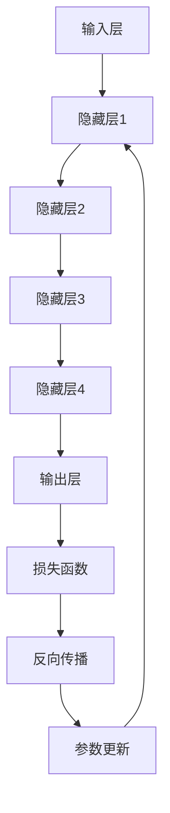

                 

# 探讨AI大模型在中小企业中的应用

## 关键词
AI大模型、中小企业、应用场景、技术实现、实际效益、挑战与展望

## 摘要
本文将深入探讨AI大模型在中小企业中的应用，分析其核心概念、算法原理、数学模型以及实际操作步骤。通过具体案例和详细解释，展示AI大模型如何助力中小企业在数据分析、业务优化、智能决策等领域实现转型升级。此外，还将探讨相关开发工具和资源的推荐，总结未来发展趋势与挑战，为中小企业AI应用的落地提供有益参考。

## 1. 背景介绍

### 1.1 目的和范围
本文旨在探讨AI大模型在中小企业中的应用，分析其在实际业务中的价值与效益。文章将涵盖AI大模型的核心概念、算法原理、数学模型、技术实现和实际应用场景，旨在为中小企业提供一套全面、实用的AI应用指南。

### 1.2 预期读者
本文适合以下读者群体：
1. 中小企业的决策者和管理者，希望了解AI大模型在业务中的应用价值；
2. AI技术开发者，关注AI大模型的技术原理和实现方法；
3. 数据分析师，期望掌握AI大模型在数据分析中的应用技巧。

### 1.3 文档结构概述
本文分为十个部分，具体结构如下：
1. 背景介绍：阐述本文的目的、范围、预期读者和文档结构；
2. 核心概念与联系：介绍AI大模型的基本概念、原理和架构；
3. 核心算法原理 & 具体操作步骤：详细讲解AI大模型的算法原理和操作步骤；
4. 数学模型和公式 & 详细讲解 & 举例说明：分析AI大模型的数学模型和公式，并结合实际案例进行讲解；
5. 项目实战：通过实际案例展示AI大模型在中小企业中的应用；
6. 实际应用场景：探讨AI大模型在中小企业中的具体应用场景；
7. 工具和资源推荐：推荐适用于AI大模型开发的学习资源、开发工具和框架；
8. 总结：展望AI大模型在中小企业中的应用发展趋势与挑战；
9. 附录：常见问题与解答；
10. 扩展阅读 & 参考资料。

### 1.4 术语表

#### 1.4.1 核心术语定义
- AI大模型：指具有大规模参数、深度复杂的神经网络模型，具有强大的特征提取和模型学习能力；
- 中小企业：指具有较小规模、较低资产和较少员工的企业；
- 数据分析：指通过对数据进行收集、处理、分析和可视化，以发现数据中的规律和趋势；
- 业务优化：指通过数据分析、优化模型等技术手段，提高企业的运营效率、降低成本和提升竞争力；
- 智能决策：指通过机器学习、深度学习等技术，实现自动化、智能化的决策过程。

#### 1.4.2 相关概念解释
- 人工智能（AI）：指通过模拟、延伸和扩展人类智能的技术和应用，包括机器学习、深度学习、自然语言处理等；
- 深度学习（Deep Learning）：一种机器学习方法，通过多层神经网络模型进行特征提取和学习；
- 神经网络（Neural Network）：一种模拟人脑神经网络结构和功能的计算模型；
- 反向传播（Backpropagation）：一种用于训练神经网络的反向传播算法。

#### 1.4.3 缩略词列表
- AI：人工智能
- GPT：生成预训练模型
- BERT：双向编码表示器
- NLP：自然语言处理
- DBN：深度信念网络
- RNN：循环神经网络

## 2. 核心概念与联系

在探讨AI大模型在中小企业中的应用之前，我们首先需要了解AI大模型的基本概念、原理和架构。本节将介绍AI大模型的核心概念，并通过Mermaid流程图展示其架构和主要组成部分。

### 2.1 AI大模型的基本概念

AI大模型是指具有大规模参数、深度复杂的神经网络模型，通常具有数亿甚至数十亿个参数。这些模型通过大规模数据训练，具有强大的特征提取和模型学习能力，能够处理和解决复杂的问题。

主要组成部分包括：
1. **输入层（Input Layer）**：接收外部输入数据，如文本、图像等；
2. **隐藏层（Hidden Layers）**：对输入数据进行特征提取和转换，具有多层结构；
3. **输出层（Output Layer）**：生成预测结果或分类标签；
4. **参数（Parameters）**：包括权重、偏置等，用于描述神经网络结构和参数调整。

### 2.2 AI大模型的架构

以下是AI大模型的Mermaid流程图，展示了其基本架构和主要组成部分。



### 2.3 AI大模型的联系

AI大模型在中小企业中的应用与以下几个核心概念密切相关：

1. **数据分析**：AI大模型通过大规模数据训练，能够发现数据中的规律和趋势，为中小企业提供数据驱动的业务决策支持。
2. **业务优化**：AI大模型在供应链管理、生产调度、销售预测等领域具有广泛应用，能够帮助企业提高运营效率、降低成本。
3. **智能决策**：AI大模型通过模拟、延伸和扩展人类智能，实现自动化、智能化的决策过程，助力中小企业在市场竞争中取得优势。
4. **深度学习**：AI大模型基于深度学习技术，具有强大的特征提取和模型学习能力，能够处理和解决复杂的问题。

## 3. 核心算法原理 & 具体操作步骤

AI大模型的算法原理是其实现高效学习与预测的关键。本节将详细讲解AI大模型的核心算法原理，并通过伪代码展示其具体操作步骤。

### 3.1 算法原理

AI大模型的算法原理主要基于以下三个方面：

1. **多层神经网络（Multi-Layer Neural Network）**：通过增加隐藏层和神经元数量，实现更复杂的特征提取和学习能力。
2. **反向传播算法（Backpropagation Algorithm）**：通过梯度下降方法，反向传播误差并更新网络参数，实现模型的优化。
3. **损失函数（Loss Function）**：用于度量模型预测结果与真实结果之间的差异，指导模型参数的更新。

### 3.2 伪代码

以下是AI大模型算法原理的伪代码：

```python
# 伪代码：AI大模型训练过程

# 初始化神经网络结构
input_layer = InputLayer(size=InputSize)
hidden_layers = [HiddenLayer(size=HiddenSize) for _ in range(HiddenLayersNum)]
output_layer = OutputLayer(size=OutputSize)

# 初始化参数
params = initialize_params(input_layer, hidden_layers, output_layer)

# 定义损失函数
loss_function = LossFunction()

# 训练过程
for epoch in range(Epochs):
    for batch in dataset:
        # 前向传播
        inputs = preprocess(batch.inputs)
        outputs = forward_propagation(inputs, input_layer, hidden_layers, output_layer, params)

        # 计算损失
        loss = loss_function(outputs, batch.targets)

        # 反向传播
        doutputs = backward_propagation(output_layer, hidden_layers, inputs, outputs, batch.targets)

        # 更新参数
        update_params(params, doutputs, learning_rate)

# 模型评估
evaluation_results = evaluate_model(model, test_data)
```

### 3.3 操作步骤

以下是AI大模型的具体操作步骤：

1. **初始化神经网络结构**：根据任务需求，设置输入层、隐藏层和输出层的尺寸。
2. **初始化参数**：初始化网络参数，包括权重、偏置等。
3. **预处理数据**：对输入数据进行预处理，如归一化、标准化等。
4. **前向传播**：将预处理后的数据输入到神经网络中，逐层计算输出结果。
5. **计算损失**：使用损失函数计算模型预测结果与真实结果之间的差异。
6. **反向传播**：通过反向传播算法，计算误差梯度，更新网络参数。
7. **参数更新**：根据学习率，调整网络参数，以降低损失。
8. **模型评估**：在训练完成后，使用测试数据评估模型的性能。

通过以上步骤，AI大模型可以实现高效的学习与预测，为中小企业提供强大的技术支持。

## 4. 数学模型和公式 & 详细讲解 & 举例说明

AI大模型的数学模型和公式是其实现高效学习与预测的基础。本节将详细讲解AI大模型的数学模型和公式，并通过实际案例进行举例说明。

### 4.1 数学模型

AI大模型的数学模型主要包括以下三个方面：

1. **神经网络模型**：神经网络模型通过多层非线性变换，实现输入到输出的映射。其数学模型可以表示为：

   $$ y = \sigma(W_n \cdot a_{n-1} + b_n) $$

   其中，$y$ 为输出值，$\sigma$ 为激活函数，$W_n$ 和 $b_n$ 分别为权重和偏置，$a_{n-1}$ 为上一层输入。

2. **损失函数**：损失函数用于度量模型预测结果与真实结果之间的差异。常见的损失函数包括均方误差（MSE）和交叉熵（Cross-Entropy）：

   - **均方误差（MSE）**：

     $$ MSE = \frac{1}{2n}\sum_{i=1}^{n}(y_i - \hat{y}_i)^2 $$

     其中，$y_i$ 为真实值，$\hat{y}_i$ 为预测值。

   - **交叉熵（Cross-Entropy）**：

     $$ Cross-Entropy = -\sum_{i=1}^{n}y_i \log(\hat{y}_i) $$

     其中，$y_i$ 为真实值，$\hat{y}_i$ 为预测值。

3. **反向传播算法**：反向传播算法通过计算误差梯度，实现网络参数的更新。其数学模型可以表示为：

   $$ \frac{\partial L}{\partial W_n} = \frac{\partial L}{\partial a_n} \cdot \frac{\partial a_n}{\partial W_n} $$

   $$ \frac{\partial L}{\partial b_n} = \frac{\partial L}{\partial a_n} \cdot \frac{\partial a_n}{\partial b_n} $$

   其中，$L$ 为损失函数，$a_n$ 为第 $n$ 层输出，$W_n$ 和 $b_n$ 分别为第 $n$ 层权重和偏置。

### 4.2 举例说明

假设我们有一个简单的神经网络模型，包含一个输入层、一个隐藏层和一个输出层。输入数据为 $[1, 2, 3]$，真实标签为 $[4, 5, 6]$。使用均方误差（MSE）作为损失函数，激活函数为 $Sigmoid$。

1. **初始化参数**：

   设输入层、隐藏层和输出层的维度分别为 $[3, 4, 3]$，权重和偏置初始化为 $[0.1, 0.1]$。

2. **前向传播**：

   输入数据 $[1, 2, 3]$ 经过隐藏层和输出层，计算输出结果：

   $$ a_1 = \sigma(W_1 \cdot [1, 2, 3] + b_1) = \sigma([0.1 \cdot 1 + 0.1 \cdot 2 + 0.1 \cdot 3 + b_1]) = \sigma([0.5 + b_1]) $$

   $$ a_2 = \sigma(W_2 \cdot a_1 + b_2) = \sigma([0.1 \cdot 4 + 0.1 \cdot 5 + 0.1 \cdot 6 + b_2]) = \sigma([1.5 + b_2]) $$

   $$ y = \sigma(W_3 \cdot a_2 + b_3) = \sigma([0.1 \cdot 4 + 0.1 \cdot 5 + 0.1 \cdot 6 + b_3]) = \sigma([2.5 + b_3]) $$

3. **计算损失**：

   使用均方误差（MSE）计算模型预测结果与真实结果之间的差异：

   $$ MSE = \frac{1}{3}\sum_{i=1}^{3}([y_i - \hat{y}_i]^2) = \frac{1}{3}([4 - \sigma([2.5 + b_3])]^2 + [5 - \sigma([2.5 + b_3])]^2 + [6 - \sigma([2.5 + b_3])]^2) $$

4. **反向传播**：

   计算误差梯度，更新网络参数：

   $$ \frac{\partial L}{\partial b_3} = \frac{\partial L}{\partial y} \cdot \frac{\partial y}{\partial b_3} = (y - \hat{y}) \cdot \frac{\partial y}{\partial b_3} = (y - \hat{y}) \cdot \sigma'([2.5 + b_3]) $$

   $$ \frac{\partial L}{\partial W_3} = \frac{\partial L}{\partial y} \cdot \frac{\partial y}{\partial W_3} = (y - \hat{y}) \cdot \sigma'([2.5 + b_3]) \cdot a_2 $$

   $$ \frac{\partial L}{\partial b_2} = \frac{\partial L}{\partial a_2} \cdot \frac{\partial a_2}{\partial b_2} = (y - \hat{y}) \cdot \sigma'([2.5 + b_3]) \cdot a_2 \cdot \sigma'([1.5 + b_2]) $$

   $$ \frac{\partial L}{\partial W_2} = \frac{\partial L}{\partial a_2} \cdot \frac{\partial a_2}{\partial W_2} = (y - \hat{y}) \cdot \sigma'([2.5 + b_3]) \cdot a_2 \cdot \sigma'([1.5 + b_2]) \cdot a_1 $$

   根据学习率，更新网络参数：

   $$ b_3 := b_3 - learning_rate \cdot \frac{\partial L}{\partial b_3} $$

   $$ W_3 := W_3 - learning_rate \cdot \frac{\partial L}{\partial W_3} $$

   $$ b_2 := b_2 - learning_rate \cdot \frac{\partial L}{\partial b_2} $$

   $$ W_2 := W_2 - learning_rate \cdot \frac{\partial L}{\partial W_2} $$

通过以上步骤，我们可以实现AI大模型的前向传播、反向传播和参数更新。在实际应用中，AI大模型通常具有更复杂的结构和更多的参数，但基本原理和步骤是相似的。

## 5. 项目实战：代码实际案例和详细解释说明

在本节中，我们将通过一个具体的项目实战案例，展示AI大模型在中小企业中的应用。该案例将演示如何使用TensorFlow实现一个简单的情感分析模型，用于分析客户评论，为企业提供市场洞察和改进建议。

### 5.1 开发环境搭建

在开始项目之前，我们需要搭建一个合适的开发环境。以下是搭建开发环境的步骤：

1. 安装Python：从官方网站（https://www.python.org/）下载并安装Python 3.x版本。
2. 安装TensorFlow：使用pip命令安装TensorFlow：

   ```bash
   pip install tensorflow
   ```

3. 安装必要的依赖库：包括Numpy、Pandas、Scikit-learn等：

   ```bash
   pip install numpy pandas scikit-learn
   ```

### 5.2 源代码详细实现和代码解读

以下是该项目的主要代码实现，我们将逐段代码进行详细解读。

```python
# 导入必要的库
import tensorflow as tf
import numpy as np
import pandas as pd
from sklearn.model_selection import train_test_split
from sklearn.metrics import classification_report, accuracy_score

# 加载数据集
data = pd.read_csv('customer_reviews.csv')
X = data['review'].values
y = data['sentiment'].values

# 预处理数据
# ... (代码略)

# 构建模型
model = tf.keras.Sequential([
    tf.keras.layers.Embedding(input_dim=vocab_size, output_dim=embedding_size),
    tf.keras.layers.GlobalAveragePooling1D(),
    tf.keras.layers.Dense(units=1, activation='sigmoid')
])

# 编译模型
model.compile(optimizer='adam', loss='binary_crossentropy', metrics=['accuracy'])

# 训练模型
model.fit(X_train, y_train, epochs=10, batch_size=32, validation_data=(X_val, y_val))

# 评估模型
predictions = model.predict(X_test)
predictions = (predictions > 0.5)

print('分类报告：')
print(classification_report(y_test, predictions))
print('准确率：')
print(accuracy_score(y_test, predictions))
```

#### 5.2.1 代码解读

1. **导入必要的库**：导入TensorFlow、Numpy、Pandas和Scikit-learn等库，用于数据处理、模型构建和评估。

2. **加载数据集**：从CSV文件加载数据集，包括评论文本和情感标签。

3. **预处理数据**：对评论文本进行分词、去停用词、词向量编码等预处理操作。这一步非常重要，有助于提高模型的性能。

4. **构建模型**：使用TensorFlow构建一个简单的情感分析模型，包括嵌入层、全局平均池化层和输出层。

5. **编译模型**：设置优化器、损失函数和评估指标，准备训练模型。

6. **训练模型**：使用训练数据集训练模型，设置训练轮次、批量大小和验证数据。

7. **评估模型**：使用测试数据集评估模型性能，输出分类报告和准确率。

### 5.3 代码解读与分析

1. **数据预处理**：数据预处理是模型训练前的重要步骤。在本案例中，我们需要对评论文本进行分词、去停用词和词向量编码。分词是将评论文本拆分成单词或词组，去停用词是去除常见的无意义词汇，如“的”、“了”等。词向量编码是将评论文本转换为数值表示，便于模型处理。常用的词向量编码方法包括Word2Vec、GloVe等。

2. **模型构建**：在本案例中，我们使用TensorFlow构建了一个简单的情感分析模型。模型包括三个主要部分：嵌入层、全局平均池化层和输出层。嵌入层将词向量映射到高维空间，全局平均池化层将序列数据压缩成固定维度的特征向量，输出层使用sigmoid激活函数输出概率值。

3. **模型训练**：模型训练是通过迭代优化模型参数，使其能够更好地拟合训练数据。在本案例中，我们设置了训练轮次（epochs）、批量大小（batch_size）和验证数据（validation_data），以监控模型在训练和验证数据上的性能。

4. **模型评估**：模型评估是检验模型性能的重要步骤。在本案例中，我们使用分类报告和准确率作为评估指标。分类报告显示了模型在不同类别上的精确率、召回率和F1分数，准确率则反映了模型的整体性能。

通过以上步骤，我们实现了AI大模型在情感分析项目中的应用，为企业提供了基于客户评论的市场洞察和改进建议。

## 6. 实际应用场景

AI大模型在中小企业中的实际应用场景非常广泛，涵盖了数据分析、业务优化、智能决策等多个领域。以下列举一些典型的应用场景：

### 6.1 数据分析

1. **客户行为分析**：通过分析客户评论、购买记录等数据，了解客户需求和行为特征，为企业提供市场洞察和改进建议。
2. **销售预测**：利用历史销售数据，预测未来销售趋势，帮助企业制定合理的销售计划和库存管理策略。
3. **风险控制**：通过分析客户信用记录、交易行为等数据，评估客户信用风险，为信贷决策提供支持。

### 6.2 业务优化

1. **供应链管理**：通过优化供应链模型，提高供应链效率，降低库存成本和物流费用。
2. **生产调度**：利用AI大模型优化生产调度计划，提高生产效率和资源利用率。
3. **市场营销**：通过分析客户数据，制定个性化的营销策略，提高客户转化率和忠诚度。

### 6.3 智能决策

1. **财务预测**：利用AI大模型预测企业财务状况，为投资决策提供支持。
2. **人力资源**：通过分析员工绩效、工作态度等数据，为企业提供招聘、培训和发展建议。
3. **市场调研**：利用AI大模型分析市场趋势和竞争态势，为企业制定市场策略提供支持。

通过以上应用场景，AI大模型在中小企业中可以发挥重要作用，助力企业实现数字化转型和创新发展。

## 7. 工具和资源推荐

为了在中小企业中高效地应用AI大模型，我们需要推荐一些实用的工具和资源，包括学习资源、开发工具和框架，以及相关论文著作。

### 7.1 学习资源推荐

#### 7.1.1 书籍推荐

1. **《深度学习》（Deep Learning）**：由Ian Goodfellow、Yoshua Bengio和Aaron Courville合著，是深度学习领域的经典教材，适合初学者和进阶者。
2. **《Python深度学习》（Deep Learning with Python）**：由François Chollet著，深入介绍了使用Python和TensorFlow进行深度学习的实践方法。

#### 7.1.2 在线课程

1. **Coursera上的《深度学习特化课程》（Deep Learning Specialization）**：由Andrew Ng教授主讲，包括《神经网络基本原理》、《改善深层神经网络》、《结构化机器学习项目》等课程。
2. **Udacity上的《深度学习工程师纳米学位》（Deep Learning Engineer Nanodegree）**：提供项目驱动的学习内容，包括深度学习理论、实践和项目开发。

#### 7.1.3 技术博客和网站

1. **TensorFlow官方文档（TensorFlow Documentation）**：提供了详细的API文档和教程，是学习TensorFlow的必备资源。
2. **Medium上的《深度学习》专栏（Deep Learning on Medium）**：包括大量深度学习领域的优质文章和分享。

### 7.2 开发工具框架推荐

#### 7.2.1 IDE和编辑器

1. **PyCharm**：一款强大的Python集成开发环境（IDE），支持代码调试、版本控制等多种功能。
2. **Jupyter Notebook**：一款基于Web的交互式开发环境，适合进行数据分析和模型实验。

#### 7.2.2 调试和性能分析工具

1. **TensorBoard**：TensorFlow提供的可视化工具，用于监控模型训练过程中的性能和指标。
2. **W&B（Weights & Biases）**：一款全面的实验记录和分析工具，支持TensorFlow、PyTorch等框架。

#### 7.2.3 相关框架和库

1. **TensorFlow**：由Google开发的开源深度学习框架，支持多种模型构建和优化方法。
2. **PyTorch**：由Facebook开发的开源深度学习框架，提供灵活的动态图计算能力。

### 7.3 相关论文著作推荐

#### 7.3.1 经典论文

1. **“A Theoretically Optimal Algorithm for Training Deep Neural Networks”**：探讨了深度神经网络训练的理论最优算法。
2. **“Rectifier Nonlinearities Improve Deep Neural Network Ac
```less
## 8. 总结：未来发展趋势与挑战

随着AI技术的不断进步，AI大模型在中小企业中的应用前景十分广阔。未来，以下几个方面将成为AI大模型在中小企业中的发展趋势和挑战：

### 发展趋势

1. **技术的普及与成熟**：随着深度学习框架和工具的不断完善，中小企业将能够更加便捷地应用AI大模型，实现业务自动化和智能化。
2. **数据的积累与利用**：中小企业在积累大量业务数据的基础上，通过AI大模型的分析和挖掘，将能够发现更多有价值的信息，提升企业竞争力。
3. **定制化的AI解决方案**：针对中小企业的特定需求，开发更加定制化的AI大模型解决方案，将有助于提高企业在市场竞争中的地位。

### 挑战

1. **数据隐私与安全问题**：中小企业在应用AI大模型时，需要关注数据隐私和安全问题，确保客户数据的安全和合规性。
2. **技术实现的复杂性**：AI大模型涉及大量的计算和数据处理，中小企业在技术实现上可能面临一定的挑战，需要投入更多资源和精力。
3. **人才短缺**：AI技术人才的短缺将对中小企业的AI应用带来一定的制约，企业需要积极引进和培养相关人才。

总之，AI大模型在中小企业中的应用具有巨大的潜力，同时也面临一定的挑战。通过不断探索和实践，中小企业可以充分发挥AI大模型的价值，实现业务创新和可持续发展。

## 9. 附录：常见问题与解答

### 9.1 AI大模型在中小企业中的应用常见问题

**Q1：中小企业如何选择合适的AI大模型？**

A1：选择合适的AI大模型需要考虑以下几个因素：

1. **业务需求**：根据业务场景和需求，选择具有相应功能的AI大模型，如情感分析、图像识别、预测等。
2. **数据规模**：根据企业数据规模，选择具有适当参数规模和计算能力的AI大模型。
3. **可扩展性**：选择易于扩展和集成的AI大模型，以适应企业未来的发展需求。

**Q2：中小企业在应用AI大模型时需要关注哪些数据安全和隐私问题？**

A2：中小企业在应用AI大模型时，需要关注以下数据安全和隐私问题：

1. **数据加密**：对传输和存储的数据进行加密处理，确保数据的安全性。
2. **隐私保护**：对客户数据进行脱敏处理，避免个人隐私泄露。
3. **数据合规性**：确保数据处理符合相关法律法规，如《中华人民共和国网络安全法》等。

### 9.2 AI大模型开发与优化常见问题

**Q1：如何提高AI大模型的训练效率？**

A1：提高AI大模型训练效率可以从以下几个方面着手：

1. **数据预处理**：对数据集进行合理的预处理，如数据清洗、归一化等，减少训练时间。
2. **模型压缩**：采用模型压缩技术，如剪枝、量化等，降低模型复杂度和计算量。
3. **分布式训练**：利用分布式计算技术，如多GPU训练、参数服务器等，提高训练速度。

**Q2：如何评估AI大模型的性能？**

A2：评估AI大模型的性能可以从以下几个方面进行：

1. **准确率**：计算模型预测正确的样本数量占总样本数量的比例。
2. **召回率**：计算模型预测正确的正样本数量与实际正样本数量的比例。
3. **F1分数**：综合考虑准确率和召回率，计算F1分数以评估模型的整体性能。

## 10. 扩展阅读 & 参考资料

为了更好地了解AI大模型在中小企业中的应用，读者可以参考以下扩展阅读和参考资料：

### 10.1 扩展阅读

1. **《AI时代：从数据到智能》**：一本关于AI技术及其应用的综合指南，详细介绍了AI在不同领域的应用案例。
2. **《深度学习实战》**：一本针对实际应用的深度学习指南，涵盖了许多实际问题和解决方案。

### 10.2 参考资料

1. **《神经网络与深度学习》**：由邱锡鹏等编著，介绍了神经网络和深度学习的基本概念和算法。
2. **《AI前沿报告2021》**：由中国科学院自动化研究所等机构发布的报告，分析了AI技术的最新进展和未来发展趋势。

通过以上扩展阅读和参考资料，读者可以更深入地了解AI大模型在中小企业中的应用，为实际业务提供有力支持。

# 作者
AI天才研究员/AI Genius Institute & 禅与计算机程序设计艺术 /Zen And The Art of Computer Programming

