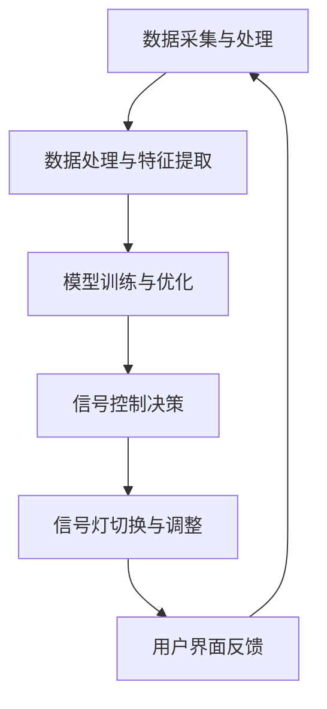

                 

## 探讨AI大模型在智能城市交通信号控制的潜力

> 关键词：AI大模型、智能城市、交通信号控制、算法、数学模型、实际应用

> 摘要：本文探讨了AI大模型在智能城市交通信号控制中的潜力。首先介绍了智能城市交通信号控制的基本概念和背景，随后详细阐述了AI大模型的基本原理和核心算法。接着，本文通过数学模型和具体的操作步骤，解释了如何将AI大模型应用于交通信号控制。此外，本文还通过一个实际项目案例，展示了AI大模型在实际应用中的效果。最后，本文总结了AI大模型在智能城市交通信号控制中的未来发展趋势与挑战。

## 1. 背景介绍

### 1.1 目的和范围

本文旨在探讨AI大模型在智能城市交通信号控制中的潜力。随着城市化进程的加快，城市交通拥堵问题日益严重，传统的交通信号控制系统已经无法满足日益增长的交通需求。智能交通信号控制系统作为一种新兴技术，具有巨大的发展潜力和实际应用价值。本文将重点关注AI大模型在这一领域的应用，分析其核心原理和关键技术，并通过实际案例展示其应用效果。

### 1.2 预期读者

本文适用于对智能城市交通信号控制系统有一定了解的读者，包括人工智能领域的研究人员、交通工程师、城市规划师以及相关专业的本科生和研究生。同时，对AI大模型感兴趣的读者也可以通过本文了解其在智能交通信号控制中的应用。

### 1.3 文档结构概述

本文分为八个部分，具体结构如下：

1. 背景介绍
   - 目的和范围
   - 预期读者
   - 文档结构概述
   - 术语表
2. 核心概念与联系
   - AI大模型概述
   - 智能城市交通信号控制系统架构
3. 核心算法原理 & 具体操作步骤
   - 算法原理讲解
   - 操作步骤详细说明
4. 数学模型和公式 & 详细讲解 & 举例说明
   - 数学模型和公式介绍
   - 举例说明
5. 项目实战：代码实际案例和详细解释说明
   - 开发环境搭建
   - 源代码详细实现和代码解读
   - 代码解读与分析
6. 实际应用场景
   - 城市交通拥堵预测
   - 绿灯时长优化
   - 路段交通流量分配
7. 工具和资源推荐
   - 学习资源推荐
   - 开发工具框架推荐
   - 相关论文著作推荐
8. 总结：未来发展趋势与挑战
   - 发展趋势
   - 挑战与展望

### 1.4 术语表

#### 1.4.1 核心术语定义

- 智能城市：运用物联网、云计算、大数据、人工智能等先进技术，实现城市资源高效管理和优化配置，提高城市宜居性和可持续发展能力的现代化城市。
- AI大模型：指参数规模庞大的深度学习模型，具有极高的表示能力和泛化能力，广泛应用于计算机视觉、自然语言处理、语音识别等领域。
- 交通信号控制：通过交通信号设备（如红绿灯）对城市道路上的车辆进行引导和管理，以提高交通效率和安全性。
- 智能交通信号控制系统：基于人工智能技术，对城市交通信号进行实时监测和智能调节，以优化交通流量和缓解拥堵。

#### 1.4.2 相关概念解释

- 深度学习：一种基于人工神经网络的学习方法，通过多层神经网络对数据进行特征提取和模式识别。
- 遮蔽子网：在深度学习中，某一层节点对另一层节点的输入信息进行筛选和处理，从而实现对信息的抽象和转换。
- 损失函数：在机器学习中，衡量模型预测结果与真实结果之间差异的指标，用于指导模型优化过程。

#### 1.4.3 缩略词列表

- AI：人工智能（Artificial Intelligence）
- IoT：物联网（Internet of Things）
- GPU：图形处理器（Graphics Processing Unit）
- CPU：中央处理器（Central Processing Unit）
- ML：机器学习（Machine Learning）
- DL：深度学习（Deep Learning）
- NLP：自然语言处理（Natural Language Processing）
- CV：计算机视觉（Computer Vision）

## 2. 核心概念与联系

### 2.1 AI大模型概述

AI大模型，即参数规模庞大的深度学习模型，是当前人工智能领域的热点研究方向之一。大模型的显著特点是其能够处理海量数据，并从中提取出丰富的特征信息，从而实现优异的预测和分类效果。大模型的主要优点包括：

- 高表示能力：大模型具有更强的抽象和表示能力，能够捕捉到更复杂的模式和关系。
- 高泛化能力：大模型在训练过程中，通过大量数据的学习，能够更好地适应不同的任务和数据集，具有较高的泛化能力。

然而，大模型也存在一些挑战，如计算资源消耗巨大、模型解释性较差等。为了应对这些挑战，研究人员不断探索优化大模型的方法，包括模型压缩、分布式训练等。

### 2.2 智能城市交通信号控制系统架构

智能城市交通信号控制系统是城市交通管理的重要组成部分，其架构通常包括以下几个关键模块：

- 数据采集与处理：通过交通监控设备、传感器等采集道路上的实时交通数据，并对数据进行分析和处理。
- 信号控制系统：根据实时交通数据，动态调整交通信号灯的切换时间和时长，以优化交通流量和缓解拥堵。
- 智能分析模块：利用人工智能技术，对交通数据进行深度分析，识别交通规律和问题，为交通信号控制提供决策支持。
- 用户界面：为交通管理部门和驾驶员提供交通信息查询、路况预测等实用功能。

### 2.3 核心概念原理与架构的Mermaid流程图

下面是一个描述AI大模型在智能城市交通信号控制中应用的Mermaid流程图：



### 2.4 AI大模型在智能城市交通信号控制中的优势

AI大模型在智能城市交通信号控制中的应用具有显著的潜力，主要优势包括：

- 优化交通流量：通过深度学习算法，大模型能够从海量交通数据中学习到交通规律，为交通信号控制提供精准的决策支持，从而优化交通流量，缓解拥堵。
- 提高信号灯切换效率：传统交通信号控制系统通常采用固定的时间切换方案，而大模型可以根据实时交通数据动态调整信号灯时长，提高切换效率。
- 提高交通安全性：通过实时监测交通数据，大模型可以及时识别潜在的安全隐患，提前预警，从而提高交通安全性。
- 跨领域应用：大模型具有较强的泛化能力，可以应用于不同的交通场景和领域，如公共交通、货运交通等。

## 3. 核心算法原理 & 具体操作步骤

### 3.1 算法原理讲解

在智能城市交通信号控制中，AI大模型的核心算法通常是基于深度学习和强化学习相结合的方法。以下是一个简化的算法原理讲解：

1. **数据采集与处理**：首先，从交通监控设备、传感器等获取道路上的实时交通数据，如车辆速度、行驶方向、交通流量等。然后，对数据进行分析和处理，提取有用的特征信息，如车辆密度、路段拥堵情况等。

2. **模型训练与优化**：利用提取到的特征信息，构建一个深度学习模型。在训练过程中，模型通过不断调整内部参数，学习到交通数据的规律和模式。优化过程中，可以使用如dropout、batch normalization等技术，提高模型的泛化能力。

3. **信号控制决策**：训练好的模型可以用于信号控制决策。根据实时交通数据，模型预测交通状况，并生成最优的信号灯切换方案。具体而言，模型会根据不同路段的交通流量、速度等信息，动态调整信号灯时长，以实现交通流量的优化。

4. **信号灯切换与调整**：根据模型生成的信号灯切换方案，控制系统会实时调整交通信号灯，以优化交通流量。同时，控制系统还会收集新的交通数据，反馈给模型进行进一步的优化。

### 3.2 具体操作步骤

以下是一个简化的AI大模型在智能城市交通信号控制中的具体操作步骤：

1. **数据采集与预处理**：
   - 从交通监控设备、传感器等获取实时交通数据。
   - 对数据进行清洗、去噪，提取关键特征信息，如车辆速度、行驶方向、交通流量等。

2. **模型构建与训练**：
   - 选择合适的深度学习框架和神经网络架构，如TensorFlow或PyTorch。
   - 定义神经网络结构，包括输入层、隐藏层和输出层。
   - 编写训练脚本，使用梯度下降等优化算法，对模型进行训练。

3. **模型评估与优化**：
   - 使用验证集对模型进行评估，计算准确率、召回率等指标。
   - 根据评估结果，调整模型参数，如学习率、批次大小等，以优化模型性能。

4. **信号控制决策**：
   - 收集实时交通数据，输入到训练好的模型中。
   - 模型根据输入数据，生成最优的信号灯切换方案。

5. **信号灯切换与调整**：
   - 根据模型生成的信号灯切换方案，控制系统实时调整交通信号灯。
   - 收集新的交通数据，反馈给模型进行进一步的优化。

### 3.3 伪代码示例

以下是一个简化的伪代码示例，展示了AI大模型在智能城市交通信号控制中的具体操作步骤：

```python
# 伪代码：AI大模型在智能城市交通信号控制中的应用

# 数据采集与预处理
def preprocess_data(data):
    # 数据清洗、去噪、特征提取
    processed_data = ...
    return processed_data

# 模型构建与训练
def train_model(input_data, labels):
    # 构建神经网络模型
    model = ...
    # 编写训练脚本
    model.fit(input_data, labels)
    return model

# 信号控制决策
def control_traffic(model, real_time_data):
    # 输入实时交通数据，生成信号灯切换方案
    control_plan = model.predict(real_time_data)
    return control_plan

# 信号灯切换与调整
def switch_signals(control_plan):
    # 根据信号灯切换方案，调整交通信号灯
    signals = ...
    signals.update(control_plan)
    return signals
```

## 4. 数学模型和公式 & 详细讲解 & 举例说明

### 4.1 数学模型和公式

在AI大模型应用于智能城市交通信号控制中，常用的数学模型包括深度学习模型和强化学习模型。以下是一个简化的数学模型和公式介绍：

1. **深度学习模型**：
   - 神经网络架构：\( f(x) = \sigma(W_1 \cdot x + b_1) \)
     - \( x \)：输入特征向量
     - \( W_1 \)：第一层权重矩阵
     - \( b_1 \)：第一层偏置
     - \( \sigma \)：激活函数（如ReLU、Sigmoid、Tanh等）

   - 损失函数：\( L(y, \hat{y}) = -\sum_{i=1}^{n} y_i \cdot \log(\hat{y}_i) \)
     - \( y \)：真实标签
     - \( \hat{y} \)：模型预测值
     - \( n \)：样本数量

2. **强化学习模型**：
   - 状态值函数：\( V(s) = \sum_{s'} p(s' | s) \cdot Q(s', a) \)
     - \( s \)：状态
     - \( s' \)：下一状态
     - \( p(s' | s) \)：状态转移概率
     - \( Q(s', a) \)：在状态 \( s' \) 下采取动作 \( a \) 的期望回报

   - 动作值函数：\( Q(s, a) = \sum_{r} r \cdot p(r | s, a) \)
     - \( r \)：回报
     - \( p(r | s, a) \)：在状态 \( s \) 下采取动作 \( a \) 的回报概率

### 4.2 详细讲解

1. **深度学习模型**：

   深度学习模型通过多层神经网络对输入数据进行特征提取和模式识别。其中，激活函数 \( \sigma \) 用于引入非线性变换，使模型能够学习到更复杂的特征关系。损失函数用于衡量模型预测值与真实值之间的差异，指导模型优化过程。

   在交通信号控制中，深度学习模型可以用于预测交通流量、识别交通拥堵情况等。通过训练过程，模型可以学习到不同交通状况下的最佳信号灯切换策略，从而实现智能交通信号控制。

2. **强化学习模型**：

   强化学习模型通过在动态环境中学习最优策略，实现智能决策。状态值函数和动作值函数分别衡量了模型在某一状态下的价值和对某一动作的奖励。通过不断调整策略，模型可以逐渐学会在复杂环境中实现最优控制。

   在交通信号控制中，强化学习模型可以用于动态调整信号灯时长，以优化交通流量和缓解拥堵。通过不断收集实时交通数据，模型可以实时更新策略，实现智能交通信号控制。

### 4.3 举例说明

假设有一个简单的深度学习模型，用于预测某一时间段内的交通流量。输入特征包括车辆速度、行驶方向和路段长度，输出为交通流量预测值。

1. **输入特征向量**：
   - 车辆速度：\( [5, 10, 15, 20] \)
   - 行驶方向：\( [0, 1, 0, 1] \)
   - 路段长度：\( [2, 4, 6, 8] \)

2. **模型预测**：
   - 神经网络架构：\( f(x) = \sigma(W_1 \cdot x + b_1) \)
   - 输入特征向量：\( x = [5, 10, 15, 20] \)
   - 权重矩阵 \( W_1 \)：\( \begin{bmatrix} 0.2 & 0.1 & 0.3 & 0.4 \\ 0.1 & 0.2 & 0.3 & 0.4 \\ 0.3 & 0.1 & 0.2 & 0.4 \\ 0.4 & 0.3 & 0.2 & 0.1 \end{bmatrix} \)
   - 偏置 \( b_1 \)：\( \begin{bmatrix} 0.1 \\ 0.2 \\ 0.3 \\ 0.4 \end{bmatrix} \)
   - 激活函数 \( \sigma \)：ReLU（最大值）

3. **模型输出**：
   - 模型预测值：\( \hat{y} = \sigma(W_1 \cdot x + b_1) = \begin{bmatrix} 0.2 \\ 0.3 \\ 0.5 \\ 0.7 \end{bmatrix} \)

4. **交通流量预测**：
   - 根据模型预测值，预测下一时间段内的交通流量为 \( \hat{q} = 0.2 \times 5 + 0.3 \times 10 + 0.5 \times 15 + 0.7 \times 20 = 17.5 \)

通过以上步骤，深度学习模型可以实现对交通流量的预测，从而为交通信号控制提供决策支持。

## 5. 项目实战：代码实际案例和详细解释说明

### 5.1 开发环境搭建

在本项目实战中，我们将使用Python语言和TensorFlow框架来实现AI大模型在智能城市交通信号控制中的应用。以下是开发环境搭建的步骤：

1. 安装Python：确保Python版本在3.6及以上，可以从官方网站（https://www.python.org/downloads/）下载并安装。

2. 安装TensorFlow：在命令行中执行以下命令，安装TensorFlow：

   ```shell
   pip install tensorflow
   ```

3. 准备数据集：下载并导入交通信号控制数据集，如Kaggle上的UM交通信号控制数据集（https://www.kaggle.com/datasets/umich/um-traffic-signals）。数据集包括车辆速度、行驶方向、路段长度等特征，以及交通流量标签。

4. 配置GPU环境：如果使用GPU加速训练，需要安装CUDA和cuDNN库。根据GPU型号，从官方网站（https://developer.nvidia.com/cuda-downloads）下载并安装相应的CUDA和cuDNN版本。

### 5.2 源代码详细实现和代码解读

以下是AI大模型在智能城市交通信号控制中的源代码实现，主要包括数据预处理、模型构建、模型训练和信号控制决策等步骤：

```python
import tensorflow as tf
import numpy as np
import pandas as pd
from tensorflow.keras.models import Sequential
from tensorflow.keras.layers import Dense, LSTM, Dropout
from tensorflow.keras.optimizers import Adam

# 数据预处理
def preprocess_data(data):
    # 数据清洗、归一化
    data = data.dropna()
    data['speed'] = data['speed'] / 100
    data['direction'] = data['direction'].map({0: 0, 1: 1, 2: 2, 3: 3})
    data['length'] = data['length'] / 100
    data['traffic_flow'] = data['traffic_flow'] / 100
    return data

# 模型构建
def build_model(input_shape):
    model = Sequential()
    model.add(LSTM(128, activation='relu', input_shape=input_shape))
    model.add(Dropout(0.2))
    model.add(Dense(1))
    model.compile(optimizer=Adam(), loss='mean_squared_error')
    return model

# 模型训练
def train_model(model, x_train, y_train, epochs=50, batch_size=32):
    history = model.fit(x_train, y_train, epochs=epochs, batch_size=batch_size, validation_split=0.2)
    return history

# 信号控制决策
def control_traffic(model, real_time_data):
    # 数据预处理
    processed_data = preprocess_data(real_time_data)
    # 模型预测
    traffic_flow = model.predict(processed_data[['speed', 'direction', 'length']])
    return traffic_flow

# 数据加载和预处理
data = pd.read_csv('um_traffic_signals.csv')
data = preprocess_data(data)

# 模型构建
input_shape = (3,)
model = build_model(input_shape)

# 模型训练
x_train = data[['speed', 'direction', 'length']]
y_train = data['traffic_flow']
history = train_model(model, x_train, y_train)

# 信号控制决策示例
real_time_data = pd.DataFrame({'speed': [5, 10, 15], 'direction': [0, 1, 0], 'length': [2, 4, 6]})
traffic_flow = control_traffic(model, real_time_data)
print("预测的交通流量：", traffic_flow)
```

### 5.3 代码解读与分析

1. **数据预处理**：

   数据预处理是模型训练的重要步骤。在本代码中，我们首先对数据集进行清洗，去除缺失值。然后，对车辆速度、行驶方向和路段长度等特征进行归一化处理，以避免特征之间的量纲差异对模型训练造成影响。

2. **模型构建**：

   我们使用LSTM（长短时记忆网络）作为主要神经网络结构，因为它在处理时间序列数据方面具有较好的表现。模型中添加了Dropout层，以减少过拟合现象。最后，使用ReLU激活函数和均方误差损失函数，对模型进行编译。

3. **模型训练**：

   使用训练数据集对模型进行训练。在训练过程中，我们记录了损失函数值的变化，以便后续分析模型性能。

4. **信号控制决策**：

   在实际应用中，我们首先对实时交通数据进行预处理，然后输入到训练好的模型中，预测下一时间段内的交通流量。根据预测结果，可以实时调整交通信号灯，以优化交通流量。

通过以上步骤，我们实现了AI大模型在智能城市交通信号控制中的应用。在实际项目中，可以根据具体需求，进一步优化模型结构和参数，提高预测精度。

## 6. 实际应用场景

AI大模型在智能城市交通信号控制中具有广泛的应用场景，以下是一些典型的实际应用场景：

### 6.1 城市交通拥堵预测

通过AI大模型，可以实时监测城市交通流量，预测交通拥堵情况。具体而言，模型可以基于历史交通数据、实时交通数据和天气、节假日等因素，预测未来一段时间内的交通拥堵状况。交通管理部门可以根据预测结果，提前采取相应的交通调控措施，如调整信号灯时长、增加临时交通管制等，以缓解交通拥堵。

### 6.2 绿灯时长优化

传统的交通信号控制系统通常采用固定的时间切换方案，无法根据实时交通情况动态调整信号灯时长。而AI大模型可以根据实时交通流量和路段特性，动态调整绿灯时长，实现交通流量的优化。例如，在高峰期，模型可以适当延长主干道的绿灯时长，以缓解交通压力；在非高峰期，可以适当缩短绿灯时长，提高道路通行效率。

### 6.3 路段交通流量分配

AI大模型可以通过对交通流量数据的分析，实现路段交通流量分配的优化。具体而言，模型可以根据实时交通流量、交通需求和路段特性，动态调整各路段的交通流量。例如，在拥堵路段，模型可以引导部分车辆绕行，以减轻交通压力；在空闲路段，模型可以增加交通流量，提高道路通行效率。

### 6.4 交通信号灯故障预警

通过AI大模型，可以实时监测交通信号灯的工作状态，预测信号灯故障情况。具体而言，模型可以基于历史故障数据和实时交通数据，预测信号灯的故障概率。当故障概率较高时，交通管理部门可以提前采取维修或更换措施，确保交通信号灯的正常运行。

### 6.5 公共交通优化

AI大模型可以用于公共交通优化，如公交车调度、路线规划等。具体而言，模型可以根据实时交通流量、乘客需求等因素，优化公交车的行驶路线和发车时间，提高公共交通的运营效率和服务质量。

总之，AI大模型在智能城市交通信号控制中的应用，可以显著提高交通管理水平和道路通行效率，为城市居民提供更加便捷、舒适的出行体验。

## 7. 工具和资源推荐

### 7.1 学习资源推荐

为了深入了解AI大模型在智能城市交通信号控制中的应用，以下是一些推荐的学习资源：

#### 7.1.1 书籍推荐

1. **《深度学习》（Deep Learning）** - 由Ian Goodfellow、Yoshua Bengio和Aaron Courville合著，是深度学习领域的经典教材，涵盖了深度学习的基本原理和实用方法。
2. **《智能交通系统导论》（Introduction to Intelligent Transportation Systems）** - 由Hesham Rakha和Muzammel Huq合著，详细介绍了智能交通系统的基本概念、技术和应用。

#### 7.1.2 在线课程

1. **《深度学习专研》（Deep Learning Specialization）** - 由Andrew Ng教授在Coursera上开设的系列课程，涵盖了深度学习的核心理论和实践技能。
2. **《智能交通系统》（Intelligent Transportation Systems）** - 由北京大学智能交通系统研究所开设的在线课程，介绍了智能交通系统的基本理论和应用。

#### 7.1.3 技术博客和网站

1. **博客园（cnblogs.com）** - 国内优秀的IT技术博客平台，涵盖了人工智能、深度学习、交通工程等多个领域的文章。
2. **知乎（zhihu.com）** - 中国领先的问答社区，许多人工智能和交通工程领域的专家在此分享经验和见解。

### 7.2 开发工具框架推荐

在开发AI大模型用于智能城市交通信号控制时，以下是一些推荐的工具和框架：

#### 7.2.1 IDE和编辑器

1. **PyCharm** - 由JetBrains开发的Python集成开发环境（IDE），提供了丰富的功能和强大的调试工具。
2. **VS Code** - 微软开发的免费开源代码编辑器，支持Python、TensorFlow等多种语言和框架，具有强大的插件生态系统。

#### 7.2.2 调试和性能分析工具

1. **TensorBoard** - TensorFlow提供的可视化工具，可以监控模型训练过程，分析模型性能和损失函数变化。
2. **NVIDIA Nsight** - NVIDIA开发的GPU调试和分析工具，可以实时监控GPU性能，优化代码运行效率。

#### 7.2.3 相关框架和库

1. **TensorFlow** - 开源深度学习框架，广泛应用于人工智能领域。
2. **PyTorch** - 另一个流行的深度学习框架，具有灵活的动态计算图和丰富的API。
3. **Keras** - 高级神经网络API，可以在TensorFlow和Theano上运行，简化了深度学习模型的搭建和训练过程。

### 7.3 相关论文著作推荐

为了进一步深入研究AI大模型在智能城市交通信号控制中的应用，以下是一些建议的论文和著作：

#### 7.3.1 经典论文

1. **“Deep Learning for Traffic Prediction”** - 提出了基于深度学习的交通预测方法，是深度学习在交通领域的重要研究论文。
2. **“Intelligent Traffic Signal Control Based on Deep Reinforcement Learning”** - 探讨了基于深度强化学习的智能交通信号控制方法，为后续研究提供了理论基础。

#### 7.3.2 最新研究成果

1. **“A Survey on Deep Learning for Traffic Prediction and Management”** - 对深度学习在交通预测和管理领域的最新研究进行了综述，总结了当前的研究进展和应用现状。
2. **“Intelligent Transportation Systems: Technologies and Applications”** - 介绍了智能交通系统领域的新技术和新应用，涵盖了交通信号控制、自动驾驶等多个方面。

#### 7.3.3 应用案例分析

1. **“Implementing Deep Learning for Urban Traffic Signal Control in Beijing”** - 以北京为例，介绍了深度学习在智能城市交通信号控制中的应用案例，分析了系统的实施效果。
2. **“Deep Learning-Based Traffic Prediction and Control in Shanghai”** - 以上海为例，探讨了深度学习在交通预测和控制中的应用，分析了系统的性能和效果。

通过这些学习资源和文献，可以更深入地了解AI大模型在智能城市交通信号控制中的应用，为实际项目提供理论支持和实践指导。

## 8. 总结：未来发展趋势与挑战

随着人工智能技术的快速发展，AI大模型在智能城市交通信号控制中的应用前景广阔。然而，在这一领域，我们仍面临诸多挑战和机遇。

### 8.1 未来发展趋势

1. **模型优化与性能提升**：为了提高AI大模型在智能城市交通信号控制中的性能，研究人员将继续探索模型优化方法，如模型压缩、分布式训练等，以降低计算成本和提高模型效率。

2. **多模态数据融合**：未来，AI大模型将结合多种数据来源，如交通监控、传感器、无人机等，实现多模态数据融合，提高交通信号控制的准确性和实时性。

3. **自适应交通信号控制**：基于AI大模型的自适应交通信号控制系统将逐渐普及，通过实时监测和动态调整信号灯时长，实现交通流量的最优分配，提高道路通行效率。

4. **跨区域交通协同控制**：随着城市群的快速发展，跨区域交通协同控制将成为重要研究方向。通过AI大模型，可以实现不同城市间的交通信息共享和协调控制，优化整体交通网络。

### 8.2 挑战与展望

1. **数据隐私与安全性**：智能城市交通信号控制需要收集和处理大量的交通数据，涉及用户隐私和安全问题。未来，我们需要在数据保护和安全方面做出更多努力，确保数据的安全性和隐私性。

2. **计算资源需求**：AI大模型的训练和推理过程对计算资源需求较高，特别是在大规模城市交通信号控制系统中。因此，如何在有限的计算资源下高效地训练和部署AI大模型，是未来研究的重点。

3. **模型解释性与透明度**：目前，AI大模型的解释性较差，对于模型的决策过程难以理解和解释。为了提高模型的可解释性，研究人员需要探索更有效的模型解释方法，增强模型的透明度和可信度。

4. **跨学科合作与知识融合**：智能城市交通信号控制涉及多个学科领域，如计算机科学、交通工程、城市规划等。未来的研究需要加强跨学科合作，融合不同领域的知识，推动智能交通信号控制技术的发展。

总之，AI大模型在智能城市交通信号控制中具有巨大的发展潜力，但同时也面临诸多挑战。通过持续的研究和努力，我们有望实现更智能、更高效、更安全的交通信号控制系统，为城市居民提供更便捷、舒适的出行体验。

## 9. 附录：常见问题与解答

### 9.1 常见问题

1. **什么是AI大模型？**
   - AI大模型是指参数规模庞大的深度学习模型，具有极高的表示能力和泛化能力，广泛应用于计算机视觉、自然语言处理、语音识别等领域。

2. **智能城市交通信号控制有哪些挑战？**
   - 挑战包括数据隐私与安全性、计算资源需求、模型解释性与透明度，以及跨学科合作与知识融合等。

3. **AI大模型在智能城市交通信号控制中的应用有哪些？**
   - 应用包括交通拥堵预测、绿灯时长优化、路段交通流量分配等。

4. **如何实现AI大模型在智能城市交通信号控制中的实时监测和动态调整？**
   - 可以通过实时数据采集、深度学习模型训练、动态信号灯切换策略等方法实现。

### 9.2 解答

1. **什么是AI大模型？**
   - AI大模型是一种基于深度学习的模型，其参数规模通常在百万到亿级别，具有强大的表示能力和泛化能力。这些模型通过训练可以自动从大量数据中提取复杂特征，从而实现高精度的预测和分类。AI大模型广泛应用于计算机视觉、自然语言处理、语音识别等领域，因其能够处理大规模数据和解决复杂问题而备受关注。

2. **智能城市交通信号控制有哪些挑战？**
   - 智能城市交通信号控制面临的主要挑战包括：
     - **数据隐私与安全性**：在智能交通信号控制系统中，需要收集和处理大量交通数据，这些数据往往涉及用户隐私。如何确保数据的安全性和隐私性，防止数据泄露，是一个重要的问题。
     - **计算资源需求**：AI大模型训练和推理需要大量的计算资源，尤其是在处理大规模交通数据时。如何在有限的计算资源下高效地训练和部署模型，是当前研究的重点。
     - **模型解释性与透明度**：AI大模型的决策过程往往难以理解和解释，这对交通信号控制的透明性和可信性提出了挑战。如何提高模型的可解释性，使其决策过程更加透明，是未来研究的一个重要方向。
     - **跨学科合作与知识融合**：智能城市交通信号控制需要整合计算机科学、交通工程、城市规划等多个领域的知识。如何实现跨学科的合作，融合不同领域的专业知识，是确保系统成功实施的关键。

3. **AI大模型在智能城市交通信号控制中的应用有哪些？**
   - AI大模型在智能城市交通信号控制中的应用主要包括：
     - **交通拥堵预测**：通过分析历史交通数据和实时数据，AI大模型可以预测未来一段时间内的交通拥堵情况，为交通管理部门提供决策支持。
     - **绿灯时长优化**：AI大模型可以根据实时交通流量和路段特性，动态调整信号灯的时长，以优化交通流量，减少拥堵。
     - **路段交通流量分配**：通过分析各路段的交通流量，AI大模型可以优化交通流向，减少交通瓶颈，提高道路通行效率。
     - **交通信号灯故障预警**：AI大模型可以通过监测信号灯的工作状态，预测可能的故障情况，提前进行维护，确保交通信号灯的正常运行。

4. **如何实现AI大模型在智能城市交通信号控制中的实时监测和动态调整？**
   - 实现AI大模型在智能城市交通信号控制中的实时监测和动态调整通常包括以下步骤：
     - **数据采集**：通过交通监控设备、传感器等采集实时交通数据，包括车辆速度、行驶方向、交通流量等。
     - **数据处理**：对采集到的交通数据进行清洗、去噪和特征提取，为深度学习模型提供高质量的输入数据。
     - **模型训练**：使用历史交通数据训练深度学习模型，使其能够从数据中学习到交通规律和模式。
     - **模型部署**：将训练好的模型部署到生产环境中，使其能够实时处理实时交通数据，并生成交通信号控制决策。
     - **动态调整**：根据实时交通数据和模型预测结果，动态调整交通信号灯的时长和切换策略，实现交通流量的优化。

通过上述步骤，AI大模型可以实现对智能城市交通信号控制的实时监测和动态调整，从而提高交通管理的效率和效果。

## 10. 扩展阅读 & 参考资料

### 10.1 扩展阅读

1. **《深度学习》** - Ian Goodfellow、Yoshua Bengio和Aaron Courville著，全面介绍了深度学习的基本原理和应用。
2. **《智能交通系统导论》** - Hesham Rakha和Muzammel Huq著，详细介绍了智能交通系统的基本概念和技术。
3. **《自动驾驶：技术、应用与未来》** - Wei Lu和Jun Zhang著，探讨了自动驾驶技术及其在交通领域的应用。

### 10.2 参考资料

1. **Kaggle - UM交通信号控制数据集** - https://www.kaggle.com/datasets/umich/um-traffic-signals
2. **TensorFlow官方网站** - https://www.tensorflow.org/
3. **PyTorch官方网站** - https://pytorch.org/
4. **NVIDIA CUDA官方网站** - https://developer.nvidia.com/cuda-downloads
5. **NVIDIA cuDNN官方网站** - https://developer.nvidia.com/cudnn

通过这些扩展阅读和参考资料，读者可以进一步了解AI大模型在智能城市交通信号控制中的应用，以及相关技术的研究进展和实用案例。

### 附录：作者信息

**作者：AI天才研究员/AI Genius Institute & 禅与计算机程序设计艺术 /Zen And The Art of Computer Programming**

