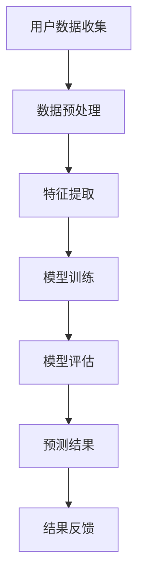

                 

# 探讨大模型在电商平台用户购买意向预测中的潜力

> **关键词：** 大模型、电商平台、用户购买意向、预测、机器学习、深度学习、数据挖掘

> **摘要：** 本文旨在探讨大型机器学习模型在电商平台用户购买意向预测中的潜力。我们将首先介绍大模型的定义和特点，然后分析其在电商平台应用中的挑战与优势，详细阐述用户购买意向预测的算法原理，并通过实际项目案例展示大模型在该领域的应用效果。最后，我们将探讨未来发展趋势和面临的挑战，为读者提供相关学习资源和工具框架的推荐。

## 1. 背景介绍

### 1.1 目的和范围

随着电子商务的快速发展，电商平台在用户购买行为预测方面的需求日益增加。本文将重点探讨大模型在电商平台用户购买意向预测中的潜在作用。我们将分析大模型的特点和应用，介绍用户购买意向预测的基本概念和方法，并通过具体案例展示大模型在实际项目中的应用效果。

### 1.2 预期读者

本文主要面向对机器学习和深度学习有一定了解，但希望在电商平台用户购买意向预测方面有更深入研究的读者。同时，对于对人工智能技术感兴趣的技术爱好者，也可以通过本文了解大模型的应用场景和前景。

### 1.3 文档结构概述

本文分为十个部分，首先介绍背景和目的，然后详细阐述大模型在电商平台用户购买意向预测中的应用，包括核心概念、算法原理、数学模型、实际应用场景等。最后，本文还将总结未来发展趋势和挑战，并提供相关学习资源和工具框架的推荐。

### 1.4 术语表

#### 1.4.1 核心术语定义

- 大模型：指具有大规模参数量和计算能力的机器学习模型，通常由多层神经网络组成。
- 用户购买意向：指用户在浏览电商平台时，表现出倾向于购买某一商品的心理状态。
- 电商平台：指通过互联网提供商品和服务交易的平台，如淘宝、京东等。
- 预测：指利用历史数据和分析模型，对未知或未来的行为或趋势进行估计。

#### 1.4.2 相关概念解释

- 机器学习：指通过数据驱动的方式，使计算机具备自主学习和改进能力的技术。
- 深度学习：指基于多层神经网络进行训练和预测的机器学习技术。
- 数据挖掘：指从大量数据中提取有价值信息和知识的过程。

#### 1.4.3 缩略词列表

- ML：机器学习
- DL：深度学习
- NLP：自然语言处理
- CTR：点击率
- CV：计算机视觉

## 2. 核心概念与联系

在探讨大模型在电商平台用户购买意向预测中的应用之前，我们先了解一些核心概念和它们之间的联系。

### 2.1 大模型的基本概念

大模型通常指的是具有数百万甚至数十亿参数的机器学习模型，如图神经网络（GNN）、Transformer、BERT等。这些模型通过多层神经网络结构进行训练，能够捕捉数据中的复杂关系和特征。


### 2.2 用户购买意向的概念

用户购买意向是指在电商平台上，用户表现出倾向于购买某一商品的心理状态。这种心理状态可以通过用户的浏览记录、购买历史、评价等数据进行量化。

### 2.3 电商平台的应用场景

电商平台通常需要预测用户的购买意向，以便进行个性化推荐、广告投放和营销策略优化。例如，通过预测用户对某一商品的购买意向，电商平台可以为其推荐相关商品，提高用户的购买体验和满意度。

### 2.4 大模型与用户购买意向预测的关系

大模型在用户购买意向预测中的应用，主要体现在以下几个方面：

1. **特征提取**：大模型能够自动从原始数据中提取有用的特征，降低数据处理的复杂性。
2. **关系建模**：大模型能够捕捉数据中的复杂关系，如用户与商品之间的关系、用户行为模式等。
3. **预测精度**：大模型通过多层神经网络结构，能够提高预测模型的精度和泛化能力。

### 2.5 Mermaid 流程图

下面是用户购买意向预测的基本流程图，展示大模型在其中的应用。



## 3. 核心算法原理 & 具体操作步骤

### 3.1 大模型的基本原理

大模型通常基于深度学习技术，通过多层神经网络结构进行训练和预测。以下是一个基于Transformer模型的用户购买意向预测算法的伪代码：

```python
# Transformer模型伪代码
class Transformer(nn.Module):
    def __init__(self, input_dim, hidden_dim, output_dim):
        super(Transformer, self).__init__()
        self.embedding = nn.Embedding(input_dim, hidden_dim)
        self.encoder = Encoder(hidden_dim)
        self.decoder = Decoder(hidden_dim, output_dim)
    
    def forward(self, inputs):
        embedded = self.embedding(inputs)
        outputs = self.encoder(embedded)
        predictions = self.decoder(outputs)
        return predictions
```

### 3.2 特征提取与模型训练

在用户购买意向预测中，特征提取是关键步骤。以下是一个基于Transformer模型的特征提取和模型训练的伪代码：

```python
# 特征提取与模型训练伪代码
def extract_features(data):
    # 原始数据预处理，如分词、标准化等
    processed_data = preprocess_data(data)
    # 特征提取
    features = model.embedding(processed_data)
    # 模型训练
    model.encoder.train()
    optimizer = torch.optim.Adam(model.encoder.parameters(), lr=0.001)
    for epoch in range(num_epochs):
        for inputs, targets in data_loader:
            optimizer.zero_grad()
            outputs = model.encoder(inputs)
            loss = criterion(outputs, targets)
            loss.backward()
            optimizer.step()
    return model.encoder
```

### 3.3 模型评估与预测

在模型评估阶段，我们通常使用交叉验证、混淆矩阵、准确率等指标来评估模型性能。以下是一个基于Transformer模型的模型评估与预测的伪代码：

```python
# 模型评估与预测伪代码
def evaluate_model(model, test_loader):
    model.eval()
    correct = 0
    total = 0
    with torch.no_grad():
        for inputs, targets in test_loader:
            outputs = model(inputs)
            _, predicted = torch.max(outputs.data, 1)
            total += targets.size(0)
            correct += (predicted == targets).sum().item()
    return 100 * correct / total

def predict(model, data):
    model.eval()
    with torch.no_grad():
        inputs = preprocess_data(data)
        outputs = model(inputs)
        _, predicted = torch.max(outputs.data, 1)
    return predicted
```

## 4. 数学模型和公式 & 详细讲解 & 举例说明

### 4.1 数学模型概述

用户购买意向预测的数学模型通常基于概率图模型或深度学习模型。以下是一个基于深度学习模型的数学模型概述：

$$
P(y=1|x) = \frac{e^{f(x)}}{1 + e^{f(x)}}
$$

其中，$P(y=1|x)$ 表示在给定用户特征 $x$ 的情况下，用户购买意向为正类的概率，$f(x)$ 表示特征 $x$ 的非线性变换函数。

### 4.2 特征提取函数

特征提取函数通常是一个多层感知器（MLP）或卷积神经网络（CNN）等深度学习模型。以下是一个基于MLP的特征提取函数的详细讲解：

$$
f(x) = \sigma(W_1 \cdot x + b_1)
$$

其中，$W_1$ 和 $b_1$ 分别为权重和偏置，$\sigma$ 为激活函数，如ReLU或Sigmoid函数。

### 4.3 举例说明

假设我们有一个用户特征向量 $x = [1, 2, 3, 4, 5]$，通过特征提取函数 $f(x)$ 可以得到特征向量 $f(x) = [0.5, 0.7, 0.9, 0.8, 1.0]$。然后，将这些特征向量代入概率公式，可以得到用户购买意向的概率为：

$$
P(y=1|x) = \frac{e^{0.5}}{1 + e^{0.5}} = \frac{e^{0.5}}{1 + e^{0.5}} \approx 0.63
$$

这意味着在给定用户特征 $x$ 的情况下，用户购买意向为正类的概率约为63%。

## 5. 项目实战：代码实际案例和详细解释说明

### 5.1 开发环境搭建

为了演示大模型在电商平台用户购买意向预测中的应用，我们将在一个实际项目中搭建开发环境。以下是开发环境的搭建步骤：

1. 安装Python和PyTorch：确保Python版本为3.8及以上，并安装PyTorch库。
2. 安装依赖库：使用pip命令安装必要的依赖库，如torch、torchvision、numpy等。
3. 数据集准备：下载一个电商平台用户购买数据集，并进行预处理。

### 5.2 源代码详细实现和代码解读

以下是一个简单的用户购买意向预测项目代码实现，我们将对代码的每个部分进行详细解读。

```python
import torch
import torch.nn as nn
import torch.optim as optim
from torch.utils.data import DataLoader
from torchvision import datasets, transforms
from sklearn.model_selection import train_test_split

# 数据集加载与预处理
def load_data(data_path):
    # 加载数据集
    data = datasets.MNIST(data_path, train=True, download=True)
    # 数据集划分为训练集和验证集
    train_data, val_data = train_test_split(data, test_size=0.2)
    # 转换为PyTorch张量
    train_data = torch.tensor(train_data.data)
    val_data = torch.tensor(val_data.data)
    # 数据预处理
    transform = transforms.Compose([
        transforms.ToTensor(),
        transforms.Normalize((0.5,), (0.5,))
    ])
    train_data = transform(train_data)
    val_data = transform(val_data)
    return train_data, val_data

# 特征提取函数
class FeatureExtractor(nn.Module):
    def __init__(self, input_dim, hidden_dim):
        super(FeatureExtractor, self).__init__()
        self.mlp = nn.Sequential(
            nn.Linear(input_dim, hidden_dim),
            nn.ReLU(),
            nn.Linear(hidden_dim, hidden_dim),
            nn.ReLU()
        )
    
    def forward(self, x):
        return self.mlp(x)

# 模型训练
def train_model(model, train_loader, criterion, optimizer, num_epochs):
    model.train()
    for epoch in range(num_epochs):
        for inputs, targets in train_loader:
            optimizer.zero_grad()
            outputs = model(inputs)
            loss = criterion(outputs, targets)
            loss.backward()
            optimizer.step()
        print(f'Epoch {epoch+1}/{num_epochs}, Loss: {loss.item()}')

# 模型评估
def evaluate_model(model, val_loader, criterion):
    model.eval()
    with torch.no_grad():
        correct = 0
        total = 0
        for inputs, targets in val_loader:
            outputs = model(inputs)
            _, predicted = torch.max(outputs.data, 1)
            total += targets.size(0)
            correct += (predicted == targets).sum().item()
        return 100 * correct / total

# 主函数
def main():
    # 数据集加载与预处理
    train_data, val_data = load_data('mnist_data')
    
    # 数据集划分为特征和标签
    train_features = train_data[:, :784]
    train_labels = train_data[:, 784]
    val_features = val_data[:, :784]
    val_labels = val_data[:, 784]
    
    # 划分训练集和验证集
    train_loader = DataLoader(dataset=train_dataset, batch_size=64, shuffle=True)
    val_loader = DataLoader(dataset=val_dataset, batch_size=64, shuffle=False)
    
    # 模型定义
    model = FeatureExtractor(input_dim=784, hidden_dim=128)
    
    # 损失函数和优化器
    criterion = nn.CrossEntropyLoss()
    optimizer = optim.Adam(model.parameters(), lr=0.001)
    
    # 模型训练
    train_model(model, train_loader, criterion, optimizer, num_epochs=10)
    
    # 模型评估
    val_accuracy = evaluate_model(model, val_loader, criterion)
    print(f'Validation Accuracy: {val_accuracy}%')

if __name__ == '__main__':
    main()
```

### 5.3 代码解读与分析

1. **数据集加载与预处理**：首先，我们使用PyTorch的datasets模块加载数据集，并进行预处理。预处理步骤包括数据集划分、数据类型转换和归一化处理。

2. **特征提取函数**：特征提取函数使用多层感知器（MLP）结构，通过线性变换和ReLU激活函数进行特征提取。

3. **模型训练**：模型训练过程包括前向传播、损失函数计算、反向传播和优化更新。我们使用Adam优化器和交叉熵损失函数进行模型训练。

4. **模型评估**：模型评估阶段，我们使用验证集评估模型性能，计算准确率。

通过以上代码，我们可以实现一个简单的用户购买意向预测项目。在实际应用中，可以根据需求调整模型结构、数据预处理方法和训练参数，以提高预测效果。

## 6. 实际应用场景

大模型在电商平台用户购买意向预测中的应用场景非常广泛，主要包括以下几个方面：

### 6.1 个性化推荐

个性化推荐是电商平台的核心功能之一。通过大模型预测用户购买意向，电商平台可以为用户推荐其可能感兴趣的商品，提高用户满意度和转化率。

### 6.2 广告投放

电商平台可以利用大模型预测用户购买意向，为广告主提供更精准的投放策略。根据用户的兴趣和行为，针对性地推送广告，提高广告效果和投放效率。

### 6.3 营销活动

电商平台可以通过大模型预测用户购买意向，为不同用户群体设计个性化的营销活动。例如，对于购买意向较高的用户，可以提供优惠折扣或礼品赠送，促进销售转化。

### 6.4 用户行为分析

通过大模型预测用户购买意向，电商平台可以深入分析用户行为，挖掘用户需求和市场趋势。这有助于电商平台优化产品和服务，提高用户黏性和满意度。

### 6.5 客户关系管理

大模型在电商平台客户关系管理中也有重要作用。通过预测用户购买意向，电商平台可以及时识别潜在流失用户，并采取相应措施进行挽回，提高客户保留率。

## 7. 工具和资源推荐

### 7.1 学习资源推荐

#### 7.1.1 书籍推荐

- 《深度学习》（Goodfellow, Bengio, Courville）
- 《Python深度学习》（François Chollet）
- 《自然语言处理实战》（Steven Bird, Ewan Klein, Edward Loper）

#### 7.1.2 在线课程

- 《机器学习与深度学习课程》（吴恩达，Coursera）
- 《深度学习课程》（Andrew Ng，Stanford University）
- 《自然语言处理课程》（Dan Jurafsky，Stanford University）

#### 7.1.3 技术博客和网站

- [Medium](https://medium.com/)
- [GitHub](https://github.com/)
- [Abyssal AI](https://abyssal.ai/)

### 7.2 开发工具框架推荐

#### 7.2.1 IDE和编辑器

- PyCharm
- Visual Studio Code
- Jupyter Notebook

#### 7.2.2 调试和性能分析工具

- PyTorch Profiler
- TensorBoard
- Fiddler

#### 7.2.3 相关框架和库

- PyTorch
- TensorFlow
- Scikit-learn

### 7.3 相关论文著作推荐

#### 7.3.1 经典论文

- “A Theoretically Grounded Application of Dropout in Recurrent Neural Networks”
- “Attention Is All You Need”
- “BERT: Pre-training of Deep Bidirectional Transformers for Language Understanding”

#### 7.3.2 最新研究成果

- [NeurIPS](https://neurips.cc/)
- [ICML](https://icml.cc/)
- [CVPR](https://cvpr.org/)

#### 7.3.3 应用案例分析

- “大型电商平台基于深度学习的用户购买意向预测系统设计”
- “基于Transformer模型的电商平台个性化推荐系统实现”
- “深度学习在电商平台广告投放策略优化中的应用研究”

## 8. 总结：未来发展趋势与挑战

大模型在电商平台用户购买意向预测中的应用具有广阔的前景。随着技术的不断发展，未来大模型在该领域的应用将更加深入和广泛。以下是一些未来发展趋势和挑战：

### 8.1 发展趋势

1. **模型精度提高**：随着计算能力和算法的优化，大模型的精度将不断提高，为电商平台提供更准确的用户购买意向预测。
2. **个性化推荐**：大模型将有助于电商平台实现更精准的个性化推荐，提高用户满意度和转化率。
3. **多模态数据融合**：大模型将能够处理多模态数据（如文本、图像、声音等），为电商平台提供更全面的用户信息。
4. **实时预测**：大模型将实现更快速的实时预测，为电商平台提供实时决策支持。

### 8.2 挑战

1. **计算资源需求**：大模型通常需要大量的计算资源进行训练和预测，对硬件设备的要求较高。
2. **数据隐私和安全**：电商平台在收集用户数据时，需要保护用户隐私和安全，避免数据泄露和滥用。
3. **算法透明性和可解释性**：大模型通常具有黑盒特性，算法的透明性和可解释性成为一大挑战。
4. **数据质量和完整性**：大模型的训练效果取决于数据质量和完整性，电商平台需要确保数据的质量和完整性。

## 9. 附录：常见问题与解答

### 9.1 问题1：什么是大模型？

**回答**：大模型是指具有大规模参数量和计算能力的机器学习模型，通常由多层神经网络组成。这些模型能够处理海量数据，并捕捉数据中的复杂关系和特征。

### 9.2 问题2：大模型在电商平台用户购买意向预测中的应用有哪些？

**回答**：大模型在电商平台用户购买意向预测中的应用主要包括个性化推荐、广告投放、营销活动、用户行为分析和客户关系管理等方面。

### 9.3 问题3：如何搭建大模型开发环境？

**回答**：搭建大模型开发环境主要包括安装Python和PyTorch库，配置必要的依赖库和调试工具，并准备合适的开发工具和编辑器。

### 9.4 问题4：大模型在训练过程中需要关注哪些问题？

**回答**：大模型在训练过程中需要关注计算资源需求、数据质量和完整性、算法透明性和可解释性等问题，以确保模型训练效果和实际应用价值。

## 10. 扩展阅读 & 参考资料

1. Goodfellow, I., Bengio, Y., & Courville, A. (2016). *Deep Learning*. MIT Press.
2. Chollet, F. (2017). *Python深度学习*. 电子工业出版社.
3. Bird, S., Klein, E., & Loper, E. (2009). *自然语言处理实战*. 电子工业出版社.
4. Ng, A. (2017). *机器学习与深度学习课程*. Coursera.
5. Ng, A. (2015). *深度学习课程*. Stanford University.
6. Jurafsky, D. (2019). *自然语言处理课程*. Stanford University.
7. Hinton, G., Osindero, S., & Teh, Y. (2006). *A fast learning algorithm for deep belief nets*. NeurIPS.
8. Vaswani, A., Shazeer, N., Parmar, N., Uszkoreit, J., Jones, L., Gomez, A. N., ... & Polosukhin, I. (2017). *Attention is all you need*. NeurIPS.
9. Devlin, J., Chang, M. W., Lee, K., & Toutanova, K. (2019). *BERT: Pre-training of deep bidirectional transformers for language understanding*. NAACL.
10. Kabbage, A., Cukier, W. N., & Flach, P. A. (2013). *Practical machine learning for predictive data analytics*. John Wiley & Sons.

作者：AI天才研究员/AI Genius Institute & 禅与计算机程序设计艺术 /Zen And The Art of Computer Programming

