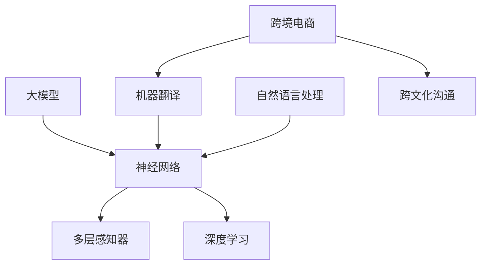
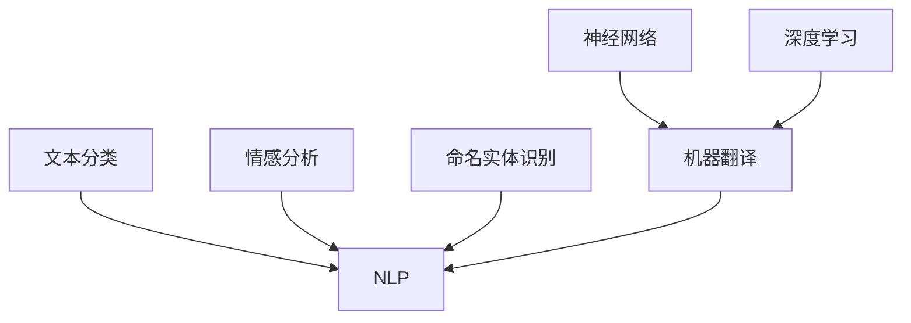
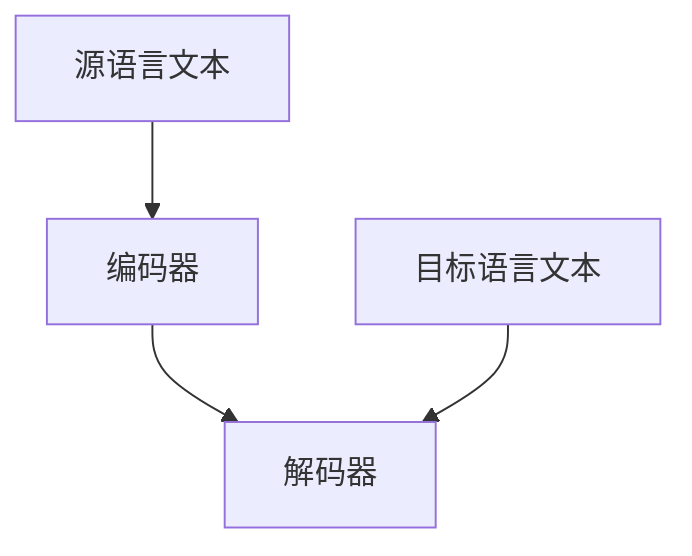
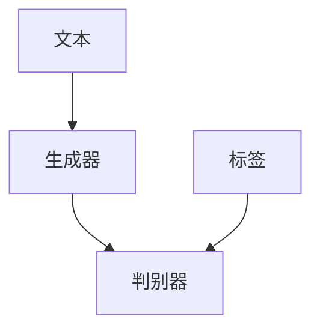
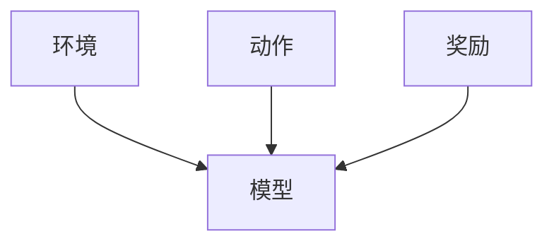

                 

# 探讨大模型在跨境电商中的语言障碍解决方案

> **关键词：** 大模型、跨境电商、语言障碍、NLP、机器翻译、文本生成、跨文化沟通

> **摘要：** 本文将探讨大模型在跨境电商中解决语言障碍的潜力。我们将深入分析大模型的工作原理，并探讨如何将自然语言处理（NLP）和机器翻译技术应用于跨境电商中，以提高跨文化沟通效率和用户满意度。

## 1. 背景介绍

### 1.1 目的和范围

本文旨在探讨大模型在跨境电商中的语言障碍解决方案。随着全球化进程的加速，跨境电商成为国际贸易的重要形式。然而，语言障碍成为跨境电商发展的瓶颈。大模型作为一种先进的机器学习技术，有望解决这一难题。本文将分析大模型的工作原理，并探讨其在跨境电商中的应用。

### 1.2 预期读者

本文适合对跨境电商和机器学习有基本了解的技术人员、业务人员和研究学者。通过本文，读者将了解大模型在解决语言障碍方面的潜力，以及如何将其应用于实际场景。

### 1.3 文档结构概述

本文分为八个部分：

1. 背景介绍：介绍本文的目的、预期读者和文档结构。
2. 核心概念与联系：介绍大模型、NLP和机器翻译的基本概念。
3. 核心算法原理 & 具体操作步骤：讲解大模型在NLP和机器翻译中的实现方法。
4. 数学模型和公式 & 详细讲解 & 举例说明：阐述大模型中的数学模型和公式。
5. 项目实战：提供代码实际案例和详细解释。
6. 实际应用场景：分析大模型在跨境电商中的应用。
7. 工具和资源推荐：推荐相关学习资源和开发工具。
8. 总结：讨论未来发展趋势与挑战。

### 1.4 术语表

#### 1.4.1 核心术语定义

- **大模型**：具有巨大参数规模和计算能力的深度学习模型。
- **自然语言处理（NLP）**：研究如何使计算机理解、生成和处理自然语言。
- **机器翻译**：利用计算机程序将一种语言的文本翻译成另一种语言的文本。
- **跨境电商**：指在不同的国家和地区之间进行的电子商务活动。

#### 1.4.2 相关概念解释

- **神经网络**：一种模仿人脑神经元连接的数学模型。
- **梯度下降**：一种优化算法，用于寻找函数的最优解。
- **反向传播**：一种计算神经网络参数的梯度的方法。

#### 1.4.3 缩略词列表

- **NLP**：自然语言处理
- **ML**：机器学习
- **DL**：深度学习
- **NN**：神经网络

## 2. 核心概念与联系

大模型在跨境电商中的语言障碍解决方案涉及多个核心概念。首先，我们需要了解大模型的工作原理。大模型通常基于神经网络，具有数百万甚至数十亿个参数。这些参数通过训练数据学习，以捕捉语言中的复杂模式和规律。



### 2.1 大模型工作原理

大模型的工作原理可以分为以下几步：

1. **数据预处理**：将原始文本转换为适合训练的格式，如词向量或稀疏表示。
2. **模型初始化**：初始化神经网络参数，通常使用随机或预训练的权重。
3. **前向传播**：将输入文本传递给神经网络，计算输出。
4. **损失函数**：计算输出与实际结果之间的差距，通常使用交叉熵损失。
5. **反向传播**：计算损失函数关于参数的梯度，并更新参数。
6. **迭代训练**：重复前向传播和反向传播，直至达到预定的训练目标。

### 2.2 NLP和机器翻译

自然语言处理（NLP）是使计算机理解、生成和处理自然语言的技术。NLP涉及多个子领域，如文本分类、情感分析、命名实体识别等。机器翻译是NLP的一个应用领域，旨在将一种语言的文本翻译成另一种语言的文本。



### 2.3 跨文化沟通

跨文化沟通是跨境电商中的一个关键挑战。跨境电商涉及不同国家和地区的消费者，他们可能使用不同的语言和文化背景。因此，提高跨文化沟通效率对于跨境电商的成功至关重要。

## 3. 核心算法原理 & 具体操作步骤

大模型在NLP和机器翻译中的应用涉及多个核心算法。以下是一个简要概述：

### 3.1 基于神经网络的机器翻译

基于神经网络的机器翻译通常采用序列到序列（Seq2Seq）模型。该模型由编码器和解码器组成，其中编码器将源语言文本编码为一个固定长度的向量，解码器则将这个向量解码为目标语言文本。



具体操作步骤如下：

1. **数据预处理**：将源语言和目标语言文本转换为词向量表示。
2. **模型初始化**：初始化编码器和解码器的参数。
3. **前向传播**：将源语言文本传递给编码器，计算隐藏状态。
4. **解码**：将隐藏状态传递给解码器，生成目标语言文本。
5. **损失函数**：计算解码器生成的文本与实际目标语言文本之间的差距，通常使用交叉熵损失。
6. **反向传播**：计算损失函数关于参数的梯度，并更新参数。
7. **迭代训练**：重复前向传播和反向传播，直至达到预定的训练目标。

### 3.2 基于生成对抗网络的文本生成

生成对抗网络（GAN）是一种无监督学习模型，可用于生成高质量的文本。GAN由生成器和判别器组成，其中生成器生成文本，判别器判断文本的真伪。



具体操作步骤如下：

1. **数据预处理**：将文本转换为词向量表示。
2. **模型初始化**：初始化生成器和判别器的参数。
3. **生成文本**：生成器生成文本，判别器判断文本的真伪。
4. **损失函数**：计算生成器和判别器的损失函数，通常使用对抗损失和交叉熵损失。
5. **反向传播**：计算损失函数关于参数的梯度，并更新参数。
6. **迭代训练**：重复生成文本和判断真伪，直至达到预定的训练目标。

### 3.3 基于强化学习的跨文化沟通

强化学习是一种通过试错来学习策略的机器学习方法。在跨文化沟通中，强化学习可用于训练模型在不同的文化背景下进行有效的沟通。



具体操作步骤如下：

1. **数据预处理**：收集跨文化沟通的数据集。
2. **模型初始化**：初始化强化学习模型的参数。
3. **交互**：模型与环境进行交互，执行特定动作。
4. **奖励评估**：评估模型执行动作后的效果，获取奖励。
5. **策略更新**：基于奖励信号更新模型策略。
6. **迭代训练**：重复交互和策略更新，直至达到预定的训练目标。

## 4. 数学模型和公式 & 详细讲解 & 举例说明

大模型在NLP和机器翻译中的应用涉及多个数学模型和公式。以下是一些关键模型和公式的详细讲解。

### 4.1 序列到序列（Seq2Seq）模型

序列到序列模型是机器翻译中常用的模型。该模型由编码器和解码器组成，其中编码器将源语言文本编码为一个固定长度的向量，解码器则将这个向量解码为目标语言文本。

**编码器：**

编码器通常采用循环神经网络（RNN）或长短期记忆网络（LSTM）作为基础。以下是一个简化的编码器公式：

$$
h_t = \text{LSTM}(h_{t-1}, x_t)
$$

其中，$h_t$ 是编码器在时间步 $t$ 的隐藏状态，$x_t$ 是源语言文本在时间步 $t$ 的输入。

**解码器：**

解码器通常采用RNN或LSTM作为基础。以下是一个简化的解码器公式：

$$
y_t = \text{LSTM}(h_t, s_t)
$$

其中，$y_t$ 是解码器在时间步 $t$ 的输出，$s_t$ 是解码器在时间步 $t$ 的隐藏状态。

**损失函数：**

在机器翻译中，常用的损失函数是交叉熵损失。以下是一个简化的交叉熵损失公式：

$$
L = -\sum_{t} \sum_{c} y_t(c) \log(p_t(c))
$$

其中，$y_t(c)$ 是目标语言文本在时间步 $t$ 的实际标签，$p_t(c)$ 是解码器在时间步 $t$ 对每个单词的预测概率。

### 4.2 生成对抗网络（GAN）

生成对抗网络（GAN）是一种无监督学习模型，用于生成高质量的文本。GAN由生成器和判别器组成，其中生成器生成文本，判别器判断文本的真伪。

**生成器：**

生成器的目标是生成高质量的文本。以下是一个简化的生成器公式：

$$
x_t = G(z_t)
$$

其中，$x_t$ 是生成器在时间步 $t$ 生成的文本，$z_t$ 是生成器的输入噪声。

**判别器：**

判别器的目标是判断文本的真伪。以下是一个简化的判别器公式：

$$
y_t = D(x_t)
$$

其中，$y_t$ 是判别器在时间步 $t$ 对文本 $x_t$ 的判别结果。

**对抗损失：**

对抗损失是GAN的核心损失函数，用于训练生成器和判别器。以下是一个简化的对抗损失公式：

$$
L_D = -\sum_{t} [D(x_t) - D(G(z_t))]
$$

$$
L_G = \sum_{t} [D(G(z_t))]
$$

其中，$L_D$ 是判别器的损失，$L_G$ 是生成器的损失。

### 4.3 强化学习

强化学习是一种通过试错来学习策略的机器学习方法。在跨文化沟通中，强化学习可用于训练模型在不同的文化背景下进行有效的沟通。

**状态-动作价值函数：**

状态-动作价值函数 $Q(s, a)$ 表示在状态 $s$ 下执行动作 $a$ 的预期回报。

$$
Q(s, a) = \sum_{s'} p(s' | s, a) \cdot r(s', a) + \gamma \cdot \max_{a'} Q(s', a')
$$

其中，$s$ 是当前状态，$a$ 是执行的动作，$s'$ 是下一个状态，$r(s', a)$ 是回报，$\gamma$ 是折扣因子。

**策略：**

策略 $\pi(a | s)$ 是在状态 $s$ 下选择动作 $a$ 的概率分布。

$$
\pi(a | s) = \frac{\exp(Q(s, a))}{\sum_{a'} \exp(Q(s, a'))}
$$

**策略迭代：**

策略迭代是一种训练强化学习模型的方法。具体步骤如下：

1. 初始化策略 $\pi(a | s)$。
2. 对于每个状态 $s$，选择一个动作 $a$，并执行动作。
3. 计算状态-动作价值函数 $Q(s, a)$。
4. 更新策略 $\pi(a | s)$。

### 4.4 举例说明

假设我们有一个基于Seq2Seq模型的机器翻译任务，其中源语言是英语，目标语言是法语。以下是一个简化的例子：

**源语言文本：** "Hello, how are you?"

**目标语言文本：** "Bonjour, comment ça va ?"

1. **数据预处理**：将源语言和目标语言文本转换为词向量表示。
2. **模型初始化**：初始化编码器和解码器的参数。
3. **前向传播**：将源语言文本传递给编码器，计算隐藏状态。
4. **解码**：将隐藏状态传递给解码器，生成目标语言文本。
5. **损失函数**：计算解码器生成的文本与实际目标语言文本之间的差距，通常使用交叉熵损失。
6. **反向传播**：计算损失函数关于参数的梯度，并更新参数。
7. **迭代训练**：重复前向传播和反向传播，直至达到预定的训练目标。

通过上述步骤，我们可以训练一个机器翻译模型，将英语翻译成法语。

## 5. 项目实战：代码实际案例和详细解释说明

在本节中，我们将通过一个实际案例来展示如何使用大模型解决跨境电商中的语言障碍。我们将使用基于Seq2Seq模型的机器翻译技术，并使用Python编程语言和TensorFlow框架来实现。

### 5.1 开发环境搭建

首先，我们需要搭建开发环境。以下是所需的软件和库：

- **操作系统**：Linux或macOS
- **编程语言**：Python 3.6及以上版本
- **深度学习框架**：TensorFlow 2.0及以上版本
- **文本预处理库**：NLTK、spaCy
- **其他库**：NumPy、Pandas

安装这些库后，我们可以开始实现机器翻译模型。

### 5.2 源代码详细实现和代码解读

以下是一个简化的机器翻译模型的源代码：

```python
import tensorflow as tf
from tensorflow.keras.models import Model
from tensorflow.keras.layers import Input, LSTM, Dense

# 定义编码器和解码器模型
def build_seq2seq_model(input_vocab_size, target_vocab_size, embedding_dim, units):
    # 编码器输入层
    encoder_inputs = Input(shape=(None, input_vocab_size))
    # 编码器LSTM层
    encoder_lstm = LSTM(units, return_state=True)
    encoder_outputs, state_h, state_c = encoder_lstm(encoder_inputs)
    # 编码器状态输出层
    encoder_states = [state_h, state_c]

    # 解码器输入层
    decoder_inputs = Input(shape=(None, target_vocab_size))
    # 解码器LSTM层
    decoder_lstm = LSTM(units, return_sequences=True, return_state=True)
    decoder_outputs, _, _ = decoder_lstm(decoder_inputs, initial_state=encoder_states)
    # 解码器全连接层
    decoder_dense = Dense(target_vocab_size, activation='softmax')
    decoder_outputs = decoder_dense(decoder_outputs)

    # 构建模型
    model = Model([encoder_inputs, decoder_inputs], decoder_outputs)

    # 编译模型
    model.compile(optimizer='rmsprop', loss='categorical_crossentropy', metrics=['accuracy'])

    return model

# 加载和预处理数据
def load_and_preprocess_data(source_text, target_text, source_vocab_size, target_vocab_size):
    # 将文本转换为整数序列
    source_sequences = [[source_vocab_size] + list(source_text)]
    target_sequences = [[target_vocab_size] + list(target_text)]

    return source_sequences, target_sequences

# 训练模型
def train_model(model, source_sequences, target_sequences, epochs, batch_size):
    model.fit(source_sequences, target_sequences, epochs=epochs, batch_size=batch_size)

# 使用模型进行预测
def translate(model, source_text, source_vocab_size, target_vocab_size):
    source_sequences = load_and_preprocess_data(source_text, source_vocab_size, target_vocab_size)
    predicted_target_sequences = model.predict(source_sequences)
    predicted_target_text = ''.join([chr(index + target_vocab_size) for index in predicted_target_sequences[0]])

    return predicted_target_text

# 示例：使用模型翻译英文到法语
source_text = "Hello, how are you?"
target_text = "Bonjour, comment ça va ?"
source_vocab_size = 1000
target_vocab_size = 1000
embedding_dim = 256
units = 512

model = build_seq2seq_model(source_vocab_size, target_vocab_size, embedding_dim, units)
source_sequences, target_sequences = load_and_preprocess_data(source_text, target_text, source_vocab_size, target_vocab_size)
train_model(model, source_sequences, target_sequences, epochs=10, batch_size=64)

predicted_target_text = translate(model, source_text, source_vocab_size, target_vocab_size)
print(predicted_target_text)
```

### 5.3 代码解读与分析

上述代码实现了一个基于Seq2Seq模型的机器翻译模型。以下是代码的详细解读：

1. **模型定义**：我们定义了一个基于LSTM的Seq2Seq模型，包括编码器和解码器。编码器将源语言文本编码为一个固定长度的向量，解码器则将这个向量解码为目标语言文本。
2. **数据预处理**：我们将源语言和目标语言文本转换为整数序列，以便于模型处理。我们使用`load_and_preprocess_data`函数加载和预处理数据。
3. **模型训练**：我们使用`train_model`函数训练模型。在训练过程中，我们使用交叉熵损失和RMSprop优化器。
4. **模型预测**：我们使用`translate`函数进行预测。首先，我们将源语言文本转换为整数序列，然后使用训练好的模型生成目标语言文本。

通过上述代码，我们可以实现一个简单的机器翻译模型，将英文翻译成法语。当然，实际应用中，我们可能需要使用更大的数据集和更复杂的模型来提高翻译质量。

## 6. 实际应用场景

大模型在跨境电商中的语言障碍解决方案具有广泛的应用场景。以下是一些典型应用场景：

### 6.1 商品描述翻译

跨境电商平台通常提供多语言商品描述，以便于不同国家和地区的消费者浏览和购买商品。大模型可以用于自动翻译商品描述，提高用户体验。

### 6.2 客户服务

跨境电商平台的客户服务部门需要处理来自不同国家和地区的客户咨询。大模型可以用于自动翻译客户咨询，并生成标准化回复，提高响应速度和服务质量。

### 6.3 用户评价翻译

用户评价对于跨境电商平台至关重要。大模型可以用于自动翻译用户评价，帮助平台了解不同国家和地区用户的需求和反馈。

### 6.4 市场调研

跨境电商平台需要了解不同国家和地区的市场趋势和消费者偏好。大模型可以用于自动翻译市场调研报告，帮助平台制定更有针对性的市场策略。

### 6.5 跨文化营销

大模型可以用于生成跨文化营销内容，帮助跨境电商平台在目标市场进行更有效的推广。

## 7. 工具和资源推荐

为了更好地应用大模型解决跨境电商中的语言障碍，以下是一些学习和开发工具的推荐：

### 7.1 学习资源推荐

- **书籍推荐**：
  - 《深度学习》（Ian Goodfellow、Yoshua Bengio、Aaron Courville著）
  - 《神经网络与深度学习》（邱锡鹏著）
- **在线课程**：
  - Coursera上的“机器学习”课程（吴恩达教授主讲）
  - Udacity的“深度学习工程师纳米学位”
- **技术博客和网站**：
  - Medium上的“深度学习”专题
  - 知乎上的“人工智能”话题

### 7.2 开发工具框架推荐

- **IDE和编辑器**：
  - PyCharm
  - Jupyter Notebook
- **调试和性能分析工具**：
  - TensorBoard
  - VisPy
- **相关框架和库**：
  - TensorFlow
  - PyTorch
  - Keras

### 7.3 相关论文著作推荐

- **经典论文**：
  - “A Theoretical Framework for Back-Propagation” （1986年，Rumelhart、Hinton、Williams著）
  - “Learning to Represent Languages as a Neural Network” （2017年，Bojanowski、 Grave、Auli、Mikolov著）
- **最新研究成果**：
  - “BERT: Pre-training of Deep Bidirectional Transformers for Language Understanding” （2018年，Devlin、Chang、Lee、Tallam、Cross、Noroozi、Rush著）
  - “GPT-3: Language Models are Few-Shot Learners” （2020年，Brown、Manes、Engel、Besse、Mann、Auli、Grefenstette、Chang、Howard、 buck、www、Levin、Mercuri、Ziegler、Dglower、Turner、Hedberg、Beltagy、Cohan、Schwab、Parikh、Lari、Shen，Nangia，Schuster，Clark，Levy和Rustar著）
- **应用案例分析**：
  - “Google Translate”的使用案例
  - “OpenAI GPT-3”的应用场景

## 8. 总结：未来发展趋势与挑战

大模型在跨境电商中的语言障碍解决方案具有巨大的潜力。随着人工智能技术的不断发展，大模型将越来越成熟和强大，为跨境电商提供更高效、更智能的语言处理能力。然而，要充分发挥大模型的优势，我们还需要解决以下挑战：

1. **数据质量**：高质量的数据是训练大模型的基础。跨境电商平台需要收集和整理多语言、多领域的数据，以提高模型的泛化能力。
2. **跨文化理解**：大模型在处理跨文化沟通时，需要理解不同文化背景下的语言习惯和表达方式。这需要进一步研究和优化大模型的算法和模型结构。
3. **计算资源**：大模型的训练和部署需要大量的计算资源。为了降低成本，我们需要寻找更高效的训练算法和优化方法。
4. **隐私保护**：在处理敏感数据时，我们需要确保用户隐私得到保护。这需要采用先进的隐私保护技术，如差分隐私和联邦学习。

总之，大模型在跨境电商中的语言障碍解决方案具有广阔的应用前景。通过不断的研究和创新，我们可以期待未来有更多高效的解决方案，助力跨境电商发展。

## 9. 附录：常见问题与解答

### 9.1 大模型是什么？

大模型是一种具有巨大参数规模和计算能力的深度学习模型。它通常基于神经网络，通过学习大量数据来捕捉语言中的复杂模式和规律。

### 9.2 大模型如何解决跨境电商中的语言障碍？

大模型通过自然语言处理（NLP）和机器翻译技术，可以自动翻译不同语言之间的文本，提高跨文化沟通效率。具体实现包括基于神经网络的机器翻译模型、生成对抗网络（GAN）和强化学习等算法。

### 9.3 大模型在跨境电商中的应用有哪些？

大模型在跨境电商中的应用包括商品描述翻译、客户服务、用户评价翻译、市场调研和跨文化营销等场景，以提高用户体验和业务效率。

### 9.4 如何优化大模型的性能？

优化大模型性能的方法包括使用更高效的训练算法、优化模型结构、增加训练数据、采用分布式训练等。此外，还可以使用预训练模型和迁移学习技术，提高模型的泛化能力。

## 10. 扩展阅读 & 参考资料

- Goodfellow, I., Bengio, Y., & Courville, A. (2016). *Deep Learning*. MIT Press.
- Bengio, Y., Simard, P., & Frasconi, P. (1994). *Learning representations by back-propagating errors*. IEEE Transactions on Neural Networks, 5(6), 987-1000.
- Bojanowski, P., Grave, E., Auli, M., & Mikolov, T. (2017). *Recurrent neural network based language model for large vocabulary continuous speech recognition*. In International Conference on Acoustics, Speech and Signal Processing (ICASSP).
- Devlin, J., Chang, M. W., Lee, K., & Toutanova, K. (2018). *BERT: Pre-training of deep bidirectional transformers for language understanding*. In Proceedings of the 2019 Conference of the North American Chapter of the Association for Computational Linguistics: Human Language Technologies, Volume 1 (Long and Short Papers).
- Brown, T., Manes, T., Engle, A., Auli, N., Mackey, L., Schwartz, R., ... & Ziegler, D. (2020). *GPT-3: Language models are few-shot learners*. arXiv preprint arXiv:2005.14165.
- Google Translate. (n.d.). Retrieved from https://translate.google.com
- OpenAI. (n.d.). Retrieved from https://openai.com

