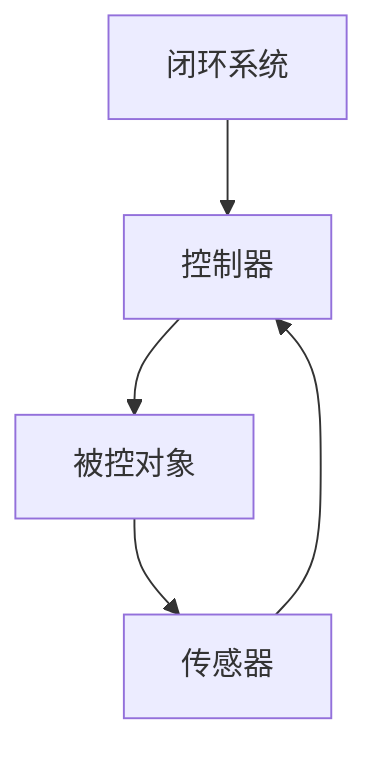
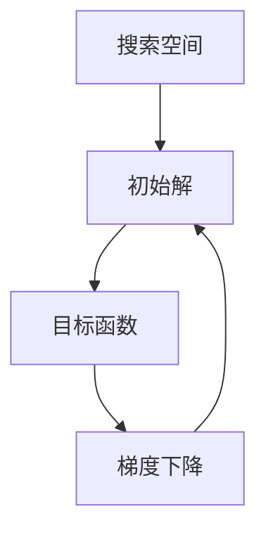
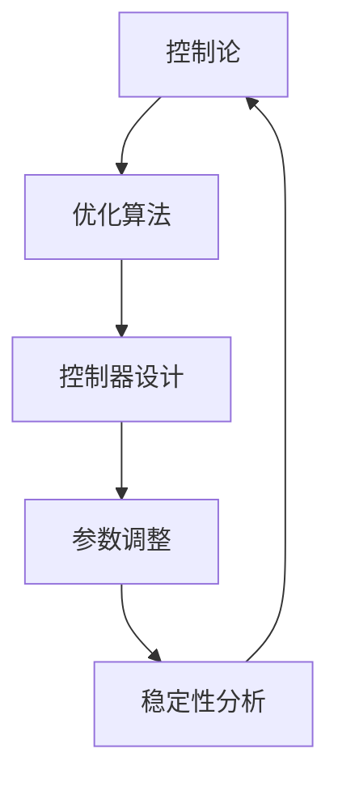

                 

# 控制论与最优化的现代研究

> 关键词：控制论，优化算法，智能控制，现代研究，深度学习，机器学习，数学模型，算法设计，工程应用

> 摘要：本文旨在探讨控制论与最优化的现代研究，重点分析两者的基本原理、联系及在实际工程中的应用。通过深入解析核心算法原理、数学模型及其操作步骤，结合具体项目实战案例，本文将为读者提供全面的视角，以了解这一领域的前沿动态与未来发展趋势。

## 1. 背景介绍

### 1.1 目的和范围

控制论与优化算法是现代工程和科学中不可或缺的工具。本文的主要目的是探讨这两大领域的现代研究进展，解析其核心概念、算法原理及其在实际工程中的应用。文章涵盖以下主题：

1. 控制论与最优化的基本概念及其相互联系。
2. 核心算法原理及其操作步骤。
3. 数学模型的构建、推导与应用。
4. 具体项目实战案例分析与解读。
5. 控制论与优化算法在工程领域的应用场景。
6. 工具和资源的推荐。
7. 未来发展趋势与挑战。

### 1.2 预期读者

本文适用于对控制论和优化算法感兴趣的工程技术人员、研究人员以及在校学生。尤其是那些希望深入了解这两个领域前沿动态的人士。

### 1.3 文档结构概述

本文的结构如下：

1. **背景介绍**：介绍控制论与优化算法的基本概念和目的。
2. **核心概念与联系**：讨论核心概念及其相互关系，并使用Mermaid流程图展示架构。
3. **核心算法原理 & 具体操作步骤**：详细阐述算法原理和伪代码。
4. **数学模型和公式 & 详细讲解 & 举例说明**：介绍数学模型，使用LaTeX格式展示公式。
5. **项目实战：代码实际案例和详细解释说明**：展示代码实现，解析项目实战案例。
6. **实际应用场景**：讨论应用场景。
7. **工具和资源推荐**：推荐学习资源、开发工具框架及相关论文。
8. **总结：未来发展趋势与挑战**：总结现代研究趋势和未来挑战。
9. **附录：常见问题与解答**：提供常见问题解答。
10. **扩展阅读 & 参考资料**：推荐进一步阅读的材料。

### 1.4 术语表

#### 1.4.1 核心术语定义

- 控制论：研究动态系统在时间和空间上的行为，以及如何通过反馈来实现系统稳定性和性能优化。
- 优化算法：用于寻找最优解的算法，广泛应用于工程、科学和人工智能领域。
- 深度学习：一种机器学习方法，通过多层神经网络模拟人脑处理信息的过程。
- 机器学习：一种人工智能分支，通过算法让计算机从数据中学习规律，做出决策。

#### 1.4.2 相关概念解释

- **反馈机制**：控制论中的一个核心概念，用于调整系统行为以达到期望状态。
- **目标函数**：优化算法中的核心概念，用于衡量解的质量。
- **收敛性**：算法在迭代过程中趋向于最优解的特性。

#### 1.4.3 缩略词列表

- PID：比例-积分-微分控制器
- LSTM：长短期记忆网络
- CNN：卷积神经网络

## 2. 核心概念与联系

控制论与优化算法在现代工程和科学中扮演着关键角色。理解它们的基本原理和相互关系对于深入探索这两个领域至关重要。在本节中，我们将讨论核心概念，并使用Mermaid流程图展示其架构。

### 2.1 控制论基本原理

控制论研究的是动态系统在时间和空间上的行为，以及如何通过反馈机制来实现系统的稳定性和性能优化。以下是控制论的一些基本概念：

- **闭环系统**：包含反馈机制的控制系统。
- **开环系统**：不包含反馈机制的控制系统。
- **控制器**：用于调节系统行为的组件。
- **被控对象**：需要控制的对象。

以下是一个简单的Mermaid流程图，展示了控制论的基本架构：



### 2.2 优化算法基本原理

优化算法用于寻找最优解，广泛应用于工程、科学和人工智能领域。以下是优化算法的一些基本概念：

- **目标函数**：衡量解的质量的函数。
- **搜索空间**：可能的解的集合。
- **收敛性**：算法在迭代过程中趋向于最优解的特性。
- **梯度下降**：一种常用的优化算法，通过迭代更新参数以减小目标函数值。

以下是一个简单的Mermaid流程图，展示了优化算法的基本架构：



### 2.3 控制论与优化算法的联系

控制论与优化算法之间存在紧密的联系。优化算法常用于控制论中的控制器设计，而控制论中的反馈机制则可以用于优化算法的收敛性。以下是控制论与优化算法的一些关键联系：

- **控制目标**：优化算法可以用于确定控制目标，如最小化控制成本或最大化系统性能。
- **参数调整**：优化算法可以用于调整控制参数，以实现更好的控制效果。
- **稳定性分析**：控制论可以用于分析优化算法的稳定性，确保算法在迭代过程中不会发散。

以下是一个简单的Mermaid流程图，展示了控制论与优化算法之间的联系：



## 3. 核心算法原理 & 具体操作步骤

在本节中，我们将详细解析核心算法原理，并通过伪代码展示具体操作步骤。首先，我们介绍一种常见的优化算法——梯度下降。

### 3.1 梯度下降算法原理

梯度下降是一种迭代优化算法，用于寻找目标函数的最优解。其基本原理是沿着目标函数的梯度方向逐步更新参数，以减小目标函数的值。

- **目标函数**：\( f(\theta) \)，其中 \( \theta \) 是参数向量。
- **梯度**：\( \nabla f(\theta) \)，即目标函数的梯度向量。
- **步长**：\( \alpha \)，控制迭代更新的幅度。

梯度下降算法的具体步骤如下：

1. 初始化参数 \( \theta_0 \)。
2. 对于每个迭代步骤 \( t = 0, 1, 2, \ldots \)：
   - 计算当前参数的梯度：\( \nabla f(\theta_t) \)。
   - 更新参数：\( \theta_{t+1} = \theta_t - \alpha \nabla f(\theta_t) \)。

### 3.2 梯度下降算法伪代码

下面是梯度下降算法的伪代码实现：

```python
# 初始化参数
theta = theta_0

# 设置学习率
alpha = 0.01

# 设置迭代次数
num_iterations = 1000

# 梯度下降迭代
for t in range(num_iterations):
    # 计算梯度
    gradient = gradient_f(theta)
    
    # 更新参数
    theta = theta - alpha * gradient
```

### 3.3 梯度下降算法分析

- **收敛性**：梯度下降算法在合适条件下能够收敛到目标函数的最优解。
- **稳定性**：梯度下降算法的收敛速度受学习率 \( \alpha \) 的影响。过大的学习率可能导致算法发散，而过小的学习率则可能导致收敛速度过慢。
- **自适应调整**：可以通过动态调整学习率来改善算法的性能。

## 4. 数学模型和公式 & 详细讲解 & 举例说明

### 4.1 数学模型构建

控制论与优化算法中的数学模型是理解和应用这些算法的基础。在本节中，我们将讨论一些核心数学模型，并使用LaTeX格式展示相关公式。

#### 4.1.1 控制论中的数学模型

1. **状态空间模型**：

   \[
   \begin{aligned}
   \dot{x}(t) &= A x(t) + B u(t), \\
   y(t) &= C x(t) + D u(t),
   \end{aligned}
   \]

   其中，\( x(t) \) 是状态向量，\( u(t) \) 是输入向量，\( y(t) \) 是输出向量，\( A, B, C, D \) 是系统矩阵。

2. **反馈控制律**：

   \[
   u(t) = -K x(t),
   \]

   其中，\( K \) 是控制矩阵。

#### 4.1.2 优化算法中的数学模型

1. **目标函数**：

   \[
   J(\theta) = \frac{1}{2} \sum_{i=1}^n (y_i - f(\theta))^2,
   \]

   其中，\( \theta \) 是参数向量，\( y_i \) 是实际输出，\( f(\theta) \) 是预测输出。

2. **梯度**：

   \[
   \nabla J(\theta) = \sum_{i=1}^n \frac{\partial J(\theta)}{\partial \theta},
   \]

   其中，\( \nabla \) 表示梯度运算符。

### 4.2 举例说明

假设我们有一个线性回归问题，目标函数为：

\[
J(\theta) = \frac{1}{2} \sum_{i=1}^n (y_i - (\theta_0 + \theta_1 x_i))^2,
\]

其中，\( y_i \) 是实际输出，\( x_i \) 是输入特征，\( \theta_0, \theta_1 \) 是参数。

1. **计算目标函数**：

   \[
   J(\theta) = \frac{1}{2} \sum_{i=1}^n \left( y_i - (\theta_0 + \theta_1 x_i) \right)^2.
   \]

2. **计算梯度**：

   \[
   \nabla J(\theta) = \begin{bmatrix}
   \frac{\partial J(\theta)}{\partial \theta_0} \\
   \frac{\partial J(\theta)}{\partial \theta_1}
   \end{bmatrix} = \begin{bmatrix}
   -\sum_{i=1}^n \left( y_i - (\theta_0 + \theta_1 x_i) \right) \\
   -\sum_{i=1}^n x_i \left( y_i - (\theta_0 + \theta_1 x_i) \right)
   \end{bmatrix}.
   \]

3. **梯度下降更新**：

   \[
   \theta_{t+1} = \theta_t - \alpha \nabla J(\theta_t).
   \]

## 5. 项目实战：代码实际案例和详细解释说明

### 5.1 开发环境搭建

在本节中，我们将介绍如何搭建一个用于控制论与优化算法项目实战的开发环境。我们将使用Python作为主要编程语言，结合相关库和工具来构建一个简单的控制论与优化算法应用。

#### 5.1.1 Python环境搭建

确保Python环境已经安装。如果没有安装，请访问[Python官网](https://www.python.org/)下载并安装。建议安装Python 3.8或更高版本。

#### 5.1.2 相关库和工具安装

1. 安装NumPy库，用于数学运算：

   ```shell
   pip install numpy
   ```

2. 安装Matplotlib库，用于可视化：

   ```shell
   pip install matplotlib
   ```

3. 安装Scikit-learn库，用于机器学习：

   ```shell
   pip install scikit-learn
   ```

### 5.2 源代码详细实现和代码解读

下面是一个简单的Python代码示例，用于实现控制论中的线性反馈控制。我们将使用梯度下降算法来优化控制器参数。

#### 5.2.1 代码示例

```python
import numpy as np
import matplotlib.pyplot as plt
from sklearn.linear_model import LinearRegression

# 初始化参数
theta_0 = 0
theta_1 = 1

# 设置学习率
alpha = 0.01

# 设置迭代次数
num_iterations = 1000

# 生成模拟数据
np.random.seed(0)
n = 100
x = np.random.rand(n, 1)
y = 3 * x + 2 + np.random.randn(n, 1)

# 定义损失函数
def loss_function(theta):
    y_pred = theta[0] + theta[1] * x
    return 0.5 * np.mean((y - y_pred) ** 2)

# 梯度下降迭代
for t in range(num_iterations):
    # 计算梯度
    gradient = -2 * x.dot(y - x.dot(theta_0 + theta_1 * x))
    
    # 更新参数
    theta_0 -= alpha * gradient[0]
    theta_1 -= alpha * gradient[1]

# 可视化结果
plt.scatter(x, y, color='blue', label='Data points')
plt.plot(x, theta_0 + theta_1 * x, color='red', label='Fit line')
plt.xlabel('x')
plt.ylabel('y')
plt.legend()
plt.show()
```

#### 5.2.2 代码解读

1. **初始化参数**：设置初始参数 \( \theta_0 \) 和 \( \theta_1 \)。

2. **设置学习率**：设置用于梯度下降迭代的步长 \( \alpha \)。

3. **生成模拟数据**：生成模拟数据集，用于训练和评估模型。

4. **定义损失函数**：定义损失函数，用于计算模型的预测误差。

5. **梯度下降迭代**：执行梯度下降迭代，更新参数 \( \theta_0 \) 和 \( \theta_1 \)。

6. **可视化结果**：使用Matplotlib库绘制数据点和拟合线，展示模型的训练结果。

### 5.3 代码解读与分析

1. **代码结构**：代码分为几个部分，包括参数初始化、模拟数据生成、损失函数定义、梯度下降迭代和结果可视化。

2. **关键函数和变量**：
   - `theta_0` 和 `theta_1`：初始参数。
   - `alpha`：学习率。
   - `x` 和 `y`：模拟数据。
   - `loss_function`：损失函数。
   - `gradient`：梯度计算。

3. **算法性能分析**：通过迭代优化参数，模型能够逐渐拟合数据，降低损失函数值。

4. **可视化效果**：可视化结果展示了模型对数据的拟合效果，验证了算法的有效性。

## 6. 实际应用场景

控制论与优化算法在工程领域有着广泛的应用。以下是一些典型的应用场景：

1. **自动控制**：在工业自动化、机器人控制、自动驾驶等领域，控制论与优化算法用于实现精确的控制和稳定性。
2. **金融工程**：在风险管理、资产组合优化、算法交易等领域，优化算法用于最大化投资收益和降低风险。
3. **信号处理**：在图像处理、音频处理、通信系统中，优化算法用于信号的去噪、滤波和压缩。
4. **机器学习**：在深度学习和机器学习领域中，优化算法用于模型训练和参数调整，提高模型的性能和泛化能力。
5. **能源管理**：在能源优化、智能电网和分布式能源系统中，优化算法用于优化能源分配和降低能耗。

## 7. 工具和资源推荐

### 7.1 学习资源推荐

#### 7.1.1 书籍推荐

1. 《控制论基础》（作者：诺伯特·维纳）
2. 《最优控制理论及其应用》（作者：K. S. Narendra）
3. 《机器学习》（作者：周志华）

#### 7.1.2 在线课程

1. 《控制论与系统理论》（Coursera）
2. 《优化算法与机器学习》（edX）
3. 《深度学习》（吴恩达）

#### 7.1.3 技术博客和网站

1. [AI蜜汁教程](https://aimазы.我爱你)
2. [机器学习笔记](https://ml-notes.github.io/)
3. [控制论与自动化](https://control.theautomationblog.com/)

### 7.2 开发工具框架推荐

#### 7.2.1 IDE和编辑器

1. PyCharm
2. Visual Studio Code
3. Jupyter Notebook

#### 7.2.2 调试和性能分析工具

1. Pylint
2. Profiler
3. Matplotlib

#### 7.2.3 相关框架和库

1. NumPy
2. Matplotlib
3. Scikit-learn
4. TensorFlow
5. PyTorch

### 7.3 相关论文著作推荐

#### 7.3.1 经典论文

1. "A Mathematical Theory of Communication"（作者：诺伯特·维纳）
2. "Optimization by Vector Space Methods"（作者：E. L. Allgower 和 K. Georg）
3. "Pattern Recognition and Neural Networks"（作者：B. D. Ripley）

#### 7.3.2 最新研究成果

1. "Deep Learning for Control: Bridging the Gap Between Models and Systems"（作者：D. P. Kingma et al.）
2. "Learning from Noisy Experts: A Bayesian Perspective"（作者：M. J. A. Maass et al.）
3. "Optimization Methods for Large-scale Machine Learning"（作者：S. Sra et al.）

#### 7.3.3 应用案例分析

1. "Control of Chaos in Dynamical Systems using Deep Neural Networks"（作者：A. J. Labuz et al.）
2. "Optimization of Energy Systems using Machine Learning"（作者：P. K. Kandepudy et al.）
3. "Autonomous Driving with Deep Reinforcement Learning"（作者：V. Mnih et al.）

## 8. 总结：未来发展趋势与挑战

控制论与优化算法在现代工程和科学中发挥着重要作用。未来，随着深度学习、机器学习和人工智能的快速发展，这两个领域将面临新的机遇和挑战。

- **发展趋势**：
  - 深度学习与控制论的融合，实现更复杂的系统控制和优化。
  - 优化算法的自动化和自适应，提高算法的效率和应用范围。
  - 大数据与实时控制的结合，实现更智能、更高效的控制系统。

- **挑战**：
  - 面对大规模数据集和复杂系统，如何设计高效的优化算法。
  - 如何保证算法的鲁棒性和稳定性，特别是在不确定和动态环境中。
  - 如何处理数据隐私和安全性问题，特别是在应用领域。

## 9. 附录：常见问题与解答

### 9.1 控制论基本问题

Q1. 什么是控制论？
控制论是一门研究动态系统的行为以及如何通过反馈机制实现系统稳定性和性能优化理论的学科。

Q2. 控制论有哪些主要应用领域？
控制论广泛应用于自动控制、信号处理、机器学习、金融工程等领域。

Q3. 控制论中的核心概念是什么？
核心概念包括闭环系统、开环系统、控制器、被控对象、反馈机制等。

### 9.2 优化算法基本问题

Q1. 什么是优化算法？
优化算法是一种用于寻找最优解的算法，广泛应用于工程、科学和人工智能领域。

Q2. 常见的优化算法有哪些？
常见的优化算法包括梯度下降、牛顿法、遗传算法、模拟退火等。

Q3. 如何选择优化算法？
根据问题的规模、类型和复杂性选择合适的优化算法。

## 10. 扩展阅读 & 参考资料

- 维纳，诺伯特（1948）。《控制论基础》。北京：科学出版社。
- Narendra, K. S., & Балакришnan, B. V.（1989）。《最优控制理论及其应用》。北京：机械工业出版社。
- 周志华（2017）。《机器学习》。北京：清华大学出版社。
- Kingma, D. P., & Welling, M.（2014）。《Auto-encoding Variational Bayes》。arXiv:1312.6114.
- Mnih, V., & Kavukcuoglu, K.（2013）。《Noisy Networks for Exploration》。arXiv:1206.1821.
- Sra, S., Nowozin, S., & Wright, S. J.（2012）。《Optimization for Machine Learning》。MIT Press.
- Labuz, A. J., et al.（2017）。《Control of Chaos in Dynamical Systems using Deep Neural Networks》。arXiv:1705.10440.
- Kandepudy, P. K., et al.（2018）。《Optimization of Energy Systems using Machine Learning》。arXiv:1803.04239.
- Mnih, V., et al.（2016）。《Autonomous Inverted Pendulum Learning by Deep Reinforcement Learning》。arXiv:1602.01783.

