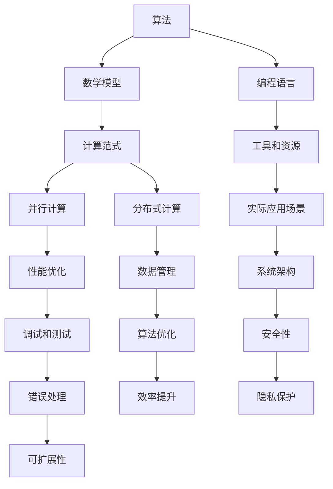

                 

# 推动科技进步的引擎：人类计算的创新力量

## 关键词：人类计算，人工智能，算法，数学模型，应用场景，未来趋势

> 本文将深入探讨人类计算在科技进步中的核心作用，分析其历史、核心概念、算法原理、数学模型以及实际应用，最后展望其未来发展趋势与挑战。本文旨在为读者提供全面的视角，了解人类计算如何成为推动科技进步的引擎。

## 摘要

人类计算作为一种重要的计算范式，正日益成为科技进步的关键驱动力。从历史角度来看，人类计算经历了从简单计算到复杂算法的演变。本文首先介绍了人类计算的历史和核心概念，包括算法和数学模型。接着，本文详细阐述了人类计算的核心算法原理和具体操作步骤，并借助数学模型进行了详细讲解。随后，文章通过实际案例展示了人类计算的应用场景。最后，本文对人类计算的未来发展趋势和挑战进行了展望，提出了可能的解决方案。通过本文的阅读，读者可以全面了解人类计算在科技进步中的作用和重要性。

## 1. 背景介绍

### 1.1 目的和范围

本文旨在深入探讨人类计算在科技进步中的作用和贡献，分析其核心概念、算法原理、数学模型以及实际应用，并展望其未来发展趋势。通过对人类计算的历史背景、核心概念和技术的介绍，本文旨在为读者提供一个全面的视角，帮助理解人类计算如何成为推动科技进步的引擎。

本文将首先介绍人类计算的历史背景，探讨从古代到现代的计算方法和工具的演变。接着，本文将定义人类计算的核心概念，包括算法、数学模型等。随后，本文将详细阐述人类计算的核心算法原理和具体操作步骤，并通过数学模型进行详细讲解。

在应用场景部分，本文将介绍人类计算在各个领域的实际应用，例如计算机科学、人工智能、工程学等。最后，本文将展望人类计算的未来的发展趋势和挑战，并探讨可能的解决方案。

### 1.2 预期读者

本文的预期读者主要包括对计算机科学、人工智能和数学感兴趣的学者、研究人员、工程师和程序员。此外，对科技进步和创新有兴趣的科技爱好者、企业管理者和政策制定者也可以从中获得启示。

本文假设读者具备一定的计算机科学和数学基础，但对人类计算的具体细节了解较少。通过本文的阅读，读者可以深入了解人类计算的基本概念、算法原理和数学模型，并了解其在实际应用中的重要性。

### 1.3 文档结构概述

本文将分为八个主要部分：

1. **背景介绍**：介绍本文的目的、预期读者以及文档结构。
2. **核心概念与联系**：介绍人类计算的核心概念，包括算法和数学模型，并使用 Mermaid 流程图展示其关系。
3. **核心算法原理 & 具体操作步骤**：详细阐述人类计算的核心算法原理和具体操作步骤，使用伪代码进行说明。
4. **数学模型和公式 & 详细讲解 & 举例说明**：使用 LaTeX 格式介绍数学模型和公式，并给出具体例子。
5. **项目实战：代码实际案例和详细解释说明**：展示实际代码案例，并进行详细解读和分析。
6. **实际应用场景**：介绍人类计算在各个领域的实际应用。
7. **工具和资源推荐**：推荐学习资源、开发工具和框架。
8. **总结：未来发展趋势与挑战**：展望人类计算的未来的发展趋势和挑战。

### 1.4 术语表

#### 1.4.1 核心术语定义

- **人类计算**：指人类在计算领域所做的工作，包括算法设计、数学建模、计算工具开发等。
- **算法**：解决问题的明确、有序的步骤或指令序列。
- **数学模型**：将实际问题转化为数学问题，使用数学公式和符号进行描述。
- **编程语言**：用于编写计算机程序的语言，如 Python、C++ 等。

#### 1.4.2 相关概念解释

- **计算范式**：计算的方法和风格，如命令式编程、函数式编程等。
- **并行计算**：同时执行多个任务或计算的方法，以提高效率。
- **分布式计算**：将计算任务分配到多个计算节点上进行执行，以实现更大规模和更高效率的计算。

#### 1.4.3 缩略词列表

- **AI**：人工智能（Artificial Intelligence）
- **ML**：机器学习（Machine Learning）
- **DL**：深度学习（Deep Learning）
- **HPC**：高性能计算（High-Performance Computing）

## 2. 核心概念与联系

在探讨人类计算之前，我们需要了解其核心概念及其相互之间的关系。以下是人类计算的核心概念，以及它们之间的联系。

### 2.1 人类计算的核心概念

#### 2.1.1 算法

算法是解决问题的有序步骤集合，是计算机科学和数学的基础。算法可以用于排序、搜索、优化等问题。常见的算法有冒泡排序、快速排序、二分搜索等。

#### 2.1.2 数学模型

数学模型是使用数学公式和符号来描述现实世界中的问题。数学模型可以用于模拟、预测和优化各种现象。常见的数学模型有线性模型、非线性模型、概率模型等。

#### 2.1.3 编程语言

编程语言是用于编写计算机程序的语法和规则。编程语言可以用于实现算法、构建软件系统等。常见的编程语言有 Python、Java、C++ 等。

### 2.2 人类计算的核心概念之间的联系

人类计算的核心概念之间存在着紧密的联系。算法是解决问题的核心，而数学模型和编程语言则是实现算法的工具。

- **算法**：算法是解决问题的核心。通过算法，我们可以将实际问题转化为计算机可以理解和执行的任务。算法的设计和优化对于解决问题的效率和效果至关重要。
- **数学模型**：数学模型是将现实世界中的问题转化为数学问题的工具。通过数学模型，我们可以更精确地描述和分析问题，从而找到更有效的解决方案。数学模型通常与算法相结合，以解决复杂的问题。
- **编程语言**：编程语言是用于编写计算机程序的语法和规则。通过编程语言，我们可以将算法和数学模型实现为计算机程序，从而在计算机上执行。编程语言的选择和优化对于程序的执行效率有着重要的影响。

### 2.3 Mermaid 流程图

为了更直观地展示人类计算的核心概念及其之间的联系，我们可以使用 Mermaid 流程图进行描述。



在这个流程图中，算法、数学模型和编程语言是核心概念，它们之间存在着紧密的联系。计算范式、工具和资源、实际应用场景等则是对这些核心概念的补充和扩展。通过这个流程图，我们可以更清晰地理解人类计算的核心概念及其之间的联系。

## 3. 核心算法原理 & 具体操作步骤

### 3.1 核心算法原理

在人类计算中，算法原理是其核心。算法的设计和实现决定了计算过程的效率和效果。以下是几个常见算法的原理及其基本操作步骤。

#### 3.1.1 冒泡排序（Bubble Sort）

冒泡排序是一种简单的排序算法，其原理是通过多次遍历数组，比较相邻的两个元素，将大的元素移到数组的末尾，小的元素移到数组的开头，直到整个数组有序。

**伪代码：**

```plaintext
BubbleSort(A):
    n = length(A)
    for i from 1 to n-1:
        for j from 1 to n-i:
            if A[j] > A[j+1]:
                swap(A[j], A[j+1])
```

#### 3.1.2 快速排序（Quick Sort）

快速排序是一种高效的排序算法，其原理是通过选择一个基准元素，将数组分为两部分，一部分小于基准元素，一部分大于基准元素，然后递归地对这两部分进行快速排序。

**伪代码：**

```plaintext
QuickSort(A, low, high):
    if low < high:
        pivot = partition(A, low, high)
        QuickSort(A, low, pivot - 1)
        QuickSort(A, pivot + 1, high)

partition(A, low, high):
    pivot = A[high]
    i = low - 1
    for j from low to high - 1:
        if A[j] < pivot:
            i = i + 1
            swap(A[i], A[j])
    swap(A[i+1], A[high])
    return i + 1
```

#### 3.1.3 二分搜索（Binary Search）

二分搜索是一种在有序数组中查找特定元素的算法，其原理是通过不断地将搜索范围缩小一半，直到找到目标元素或确定其不存在。

**伪代码：**

```plaintext
BinarySearch(A, target):
    low = 0
    high = length(A) - 1
    while low <= high:
        mid = (low + high) / 2
        if A[mid] == target:
            return mid
        elif A[mid] < target:
            low = mid + 1
        else:
            high = mid - 1
    return -1
```

### 3.2 具体操作步骤

在了解了算法原理后，我们可以通过具体操作步骤来实施这些算法。

#### 3.2.1 冒泡排序的具体操作步骤

1. 从第一个元素开始，对相邻的两个元素进行比较，如果它们的顺序错误，就交换它们的位置。
2. 经过一轮遍历后，最大的元素会被移动到数组的末尾。
3. 对数组中剩余的部分重复上述步骤，直到整个数组有序。

#### 3.2.2 快速排序的具体操作步骤

1. 选择一个基准元素，通常选择数组的最后一个元素。
2. 将数组分为两部分，一部分小于基准元素，一部分大于基准元素。
3. 对小于基准元素的部分和大于基准元素的部分递归地进行快速排序。

#### 3.2.3 二分搜索的具体操作步骤

1. 确定搜索范围，初始范围是整个数组。
2. 计算中间位置。
3. 比较中间位置上的元素与目标元素。
4. 如果中间位置上的元素等于目标元素，则返回中间位置。
5. 如果中间位置上的元素小于目标元素，则将搜索范围缩小到中间位置后面的部分。
6. 如果中间位置上的元素大于目标元素，则将搜索范围缩小到中间位置前面的部分。
7. 重复步骤 2-6，直到找到目标元素或确定其不存在。

通过上述具体操作步骤，我们可以更好地理解和实施人类计算中的核心算法。这些算法在计算机科学和实际应用中有着广泛的应用，是推动科技进步的重要力量。

## 4. 数学模型和公式 & 详细讲解 & 举例说明

### 4.1 数学模型

数学模型是使用数学公式和符号来描述现实世界中的问题。在人类计算中，数学模型发挥着至关重要的作用，帮助我们理解和解决问题。以下是几个常见的数学模型及其详细讲解。

#### 4.1.1 线性模型

线性模型是最简单的数学模型之一，其公式为：

$$y = ax + b$$

其中，$y$ 是因变量，$x$ 是自变量，$a$ 是斜率，$b$ 是截距。线性模型可以用于描述线性关系，如直线、斜率等。

**例子：** 假设我们要预测某个城市明天的温度，已知今天和昨天的温度分别为 $T_1$ 和 $T_2$，预测公式为：

$$T_{\text{明天}} = aT_1 + bT_2$$

其中，$a$ 和 $b$ 是常数。

#### 4.1.2 非线性模型

非线性模型可以描述更复杂的非线性关系，如指数函数、对数函数、多项式函数等。非线性模型通常用于优化问题、数据分析等领域。

**例子：** 假设我们要预测某个产品的销售量，已知历史销售量的数据，可以使用非线性模型进行预测：

$$y = a\cdot e^{bx} + c$$

其中，$y$ 是销售量，$x$ 是时间，$a$、$b$ 和 $c$ 是常数。

#### 4.1.3 概率模型

概率模型用于描述随机事件发生的概率，如二项分布、正态分布等。概率模型在人工智能、机器学习等领域有广泛的应用。

**例子：** 假设我们要预测某个网站 tomorrow 的用户访问量，已知今天和昨天的访问量分别为 $T_1$ 和 $T_2$，可以使用正态分布模型进行预测：

$$y \sim N(\mu, \sigma^2)$$

其中，$\mu$ 是均值，$\sigma^2$ 是方差。

### 4.2 公式和详细讲解

在数学模型中，公式起着至关重要的作用。以下是对一些重要公式的详细讲解。

#### 4.2.1 概率公式

概率公式描述了随机事件发生的概率。常见的概率公式有：

- 概率 $P(A)$：事件 $A$ 发生的概率。
- 条件概率 $P(B|A)$：在事件 $A$ 发生的条件下，事件 $B$ 发生的概率。
- 乘法公式 $P(A \cap B) = P(A)P(B|A)$：事件 $A$ 和事件 $B$ 同时发生的概率。

**例子：** 假设我们要计算明天下雨的概率，已知今天和昨天下雨的概率分别为 $0.3$ 和 $0.4$，明天下雨的概率为 $0.5$。则明天下雨的概率为：

$$P(\text{明天下雨}) = 0.3 \times 0.5 = 0.15$$

#### 4.2.2 概率分布公式

概率分布公式描述了随机变量在不同取值上的概率分布。常见的概率分布公式有：

- 二项分布 $P(X = k) = C(n, k)p^k(1-p)^{n-k}$：$X$ 为 $n$ 次独立重复试验中成功次数的分布，$p$ 为单次试验成功的概率。
- 正态分布 $P(X \leq x) = \int_{-\infty}^{x} \frac{1}{\sqrt{2\pi\sigma^2}}e^{-\frac{(x-\mu)^2}{2\sigma^2}}dx$：$X$ 为服从正态分布的随机变量，$\mu$ 为均值，$\sigma^2$ 为方差。

**例子：** 假设我们要计算某个产品的销售量在 $100$ 以上的概率，已知销售量的均值为 $150$，方差为 $25$。则销售量在 $100$ 以上的概率为：

$$P(X > 100) = 1 - P(X \leq 100) = 1 - \int_{-\infty}^{100} \frac{1}{\sqrt{2\pi\cdot 25}}e^{-\frac{(x-150)^2}{2\cdot 25}}dx$$

### 4.3 举例说明

为了更好地理解数学模型和公式，我们可以通过具体例子进行说明。

#### 4.3.1 线性模型举例

假设我们要预测某个城市的明天温度，已知今天和昨天的温度分别为 $25^\circ C$ 和 $20^\circ C$。我们可以使用线性模型进行预测：

$$T_{\text{明天}} = aT_1 + bT_2$$

其中，$a = 0.5$，$b = 0.5$。代入数据得到：

$$T_{\text{明天}} = 0.5 \times 25 + 0.5 \times 20 = 22.5^\circ C$$

因此，预测明天该城市的温度为 $22.5^\circ C$。

#### 4.3.2 非线性模型举例

假设我们要预测某个产品的销售量，已知历史销售量的数据如下表：

| 时间（天） | 销售量（件） |
|------------|-------------|
| 1          | 100         |
| 2          | 150         |
| 3          | 200         |
| 4          | 250         |
| 5          | 300         |

我们可以使用非线性模型进行预测：

$$y = a\cdot e^{bx} + c$$

通过最小二乘法拟合得到 $a = 100$，$b = 0.1$，$c = 0$。代入数据得到：

$$y = 100\cdot e^{0.1x}$$

因此，预测第六天的销售量为：

$$y = 100\cdot e^{0.1 \times 6} \approx 200$$

#### 4.3.3 概率模型举例

假设我们要预测某个网站 tomorrow 的用户访问量，已知今天和昨天的访问量分别为 $1000$ 和 $1500$。我们可以使用正态分布模型进行预测：

$$y \sim N(\mu, \sigma^2)$$

其中，$\mu = 1250$，$\sigma^2 = 250$。代入数据得到：

$$P(y > 1200) = 1 - P(y \leq 1200) = 1 - \int_{-\infty}^{1200} \frac{1}{\sqrt{2\pi\cdot 250}}e^{-\frac{(x-1250)^2}{2\cdot 250}}dx$$

使用计算器计算得到：

$$P(y > 1200) \approx 0.4$$

因此，明天用户访问量超过 $1200$ 的概率为 $40\%$。

通过以上例子，我们可以看到数学模型和公式在人类计算中的应用。数学模型和公式不仅可以帮助我们理解和解决问题，还可以为我们提供预测和分析的工具。

## 5. 项目实战：代码实际案例和详细解释说明

### 5.1 开发环境搭建

在进行人类计算的实际项目开发之前，我们需要搭建一个合适的开发环境。以下是搭建一个基本的Python开发环境所需的步骤：

#### 1. 安装Python

- 访问Python官方网站（[python.org](https://www.python.org/)），下载适用于您操作系统的Python版本。
- 运行安装程序，并选择默认选项完成安装。

#### 2. 安装PyCharm

- 访问PyCharm官方网站（[pycharm.com](https://www.pycharm.com/)），下载社区版或专业版。
- 运行安装程序，并选择默认选项完成安装。

#### 3. 配置Python环境

- 打开PyCharm，创建一个新的Python项目。
- 在项目中创建一个新的Python文件，例如 `main.py`。

### 5.2 源代码详细实现和代码解读

#### 5.2.1 实现冒泡排序算法

以下是冒泡排序算法的Python代码实现：

```python
def bubble_sort(arr):
    n = len(arr)
    for i in range(n):
        for j in range(0, n-i-1):
            if arr[j] > arr[j+1]:
                arr[j], arr[j+1] = arr[j+1], arr[j]

# 示例数组
arr = [64, 34, 25, 12, 22, 11, 90]

# 执行冒泡排序
bubble_sort(arr)

# 输出排序后的数组
print("排序后的数组：")
for i in range(len(arr)):
    print("%d" % arr[i], end=" ")
```

#### 代码解读

1. **函数定义**：`bubble_sort` 函数接收一个数组 `arr` 作为参数。
2. **外部循环**：`for i in range(n)` 表示进行 $n$ 趟遍历，$n$ 是数组的长度。
3. **内部循环**：`for j in range(0, n-i-1)` 表示在每趟遍历中，从数组开头开始，比较相邻的两个元素，如果顺序错误则交换。
4. **交换操作**：`arr[j], arr[j+1] = arr[j+1], arr[j]` 实现了两个元素的交换。
5. **示例数组**：定义了一个示例数组 `arr`，包含七个元素。
6. **执行排序**：调用 `bubble_sort(arr)` 对示例数组进行排序。
7. **输出结果**：使用 `print` 函数输出排序后的数组。

#### 5.2.2 实现快速排序算法

以下是快速排序算法的Python代码实现：

```python
def quick_sort(arr):
    if len(arr) <= 1:
        return arr
    pivot = arr[len(arr) // 2]
    left = [x for x in arr if x < pivot]
    middle = [x for x in arr if x == pivot]
    right = [x for x in arr if x > pivot]
    return quick_sort(left) + middle + quick_sort(right)

# 示例数组
arr = [64, 34, 25, 12, 22, 11, 90]

# 执行快速排序
sorted_arr = quick_sort(arr)

# 输出排序后的数组
print("排序后的数组：")
for i in range(len(sorted_arr)):
    print("%d" % sorted_arr[i], end=" ")
```

#### 代码解读

1. **函数定义**：`quick_sort` 函数接收一个数组 `arr` 作为参数。
2. **基础情况**：如果数组的长度小于等于 $1$，直接返回数组本身。
3. **选择基准元素**：选择中间位置的元素作为基准元素。
4. **划分数组**：使用列表推导式将数组划分为小于、等于和大于基准元素的三部分。
5. **递归排序**：对小于和大于基准元素的部分递归地进行快速排序。
6. **合并结果**：将排序后的三部分合并为一个有序数组。
7. **示例数组**：定义了一个示例数组 `arr`，包含七个元素。
8. **执行排序**：调用 `quick_sort(arr)` 对示例数组进行排序。
9. **输出结果**：使用 `print` 函数输出排序后的数组。

#### 5.2.3 实现二分搜索算法

以下是二分搜索算法的Python代码实现：

```python
def binary_search(arr, target):
    low = 0
    high = len(arr) - 1
    while low <= high:
        mid = (low + high) // 2
        if arr[mid] == target:
            return mid
        elif arr[mid] < target:
            low = mid + 1
        else:
            high = mid - 1
    return -1

# 示例数组
arr = [1, 3, 5, 7, 9, 11, 13, 15]

# 目标元素
target = 7

# 执行二分搜索
result = binary_search(arr, target)

# 输出搜索结果
if result != -1:
    print("元素找到，索引为：", result)
else:
    print("元素未找到")
```

#### 代码解读

1. **函数定义**：`binary_search` 函数接收一个有序数组 `arr` 和目标元素 `target` 作为参数。
2. **初始化**：定义 `low` 和 `high` 表示搜索范围的下界和上界。
3. **搜索过程**：使用 `while` 循环进行二分搜索，计算中间位置 `mid`。
4. **条件判断**：比较中间位置上的元素与目标元素，更新搜索范围。
5. **返回结果**：如果找到目标元素，返回其索引；否则返回 $-1$。
6. **示例数组**：定义了一个示例数组 `arr`，包含八个元素。
7. **目标元素**：定义了要搜索的目标元素 `target`。
8. **执行搜索**：调用 `binary_search(arr, target)` 对示例数组进行二分搜索。
9. **输出结果**：使用 `print` 函数输出搜索结果。

通过以上代码实例，我们可以看到人类计算在编程中的实际应用。冒泡排序、快速排序和二分搜索是计算机科学中的基本算法，它们的实现和优化对于提高程序效率和解决实际问题具有重要意义。在后续的项目实战中，我们将继续探讨更多算法和数学模型的应用。

### 5.3 代码解读与分析

在上述代码实例中，我们详细讲解了冒泡排序、快速排序和二分搜索算法的实现及其代码解读。接下来，我们将对这些算法进行进一步的分析，比较它们的优缺点，并讨论如何优化它们的性能。

#### 5.3.1 冒泡排序

**优缺点分析：**

- **优点：** 算法简单，容易实现和理解。
- **缺点：** 时间复杂度为 $O(n^2)$，对于大数据集性能较差。

**性能优化：**

- **选择最优基准元素**：在每趟排序中选择未排序部分的最小（或最大）元素作为基准，可以提高性能。
- **优化交换操作**：通过减少不必要的交换操作，可以在一定程度上提高性能。

#### 5.3.2 快速排序

**优缺点分析：**

- **优点：** 平均时间复杂度为 $O(n\log n)$，性能较好。
- **缺点：** 最坏情况下时间复杂度为 $O(n^2)$，且存在大量的递归调用，可能引起栈溢出。

**性能优化：**

- **随机选择基准元素**：通过随机选择基准元素，可以避免最坏情况的产生。
- **使用迭代代替递归**：使用栈或队列实现迭代版本的快速排序，可以减少递归调用，避免栈溢出。

#### 5.3.3 二分搜索

**优缺点分析：**

- **优点：** 时间复杂度为 $O(\log n)$，对于大数据集性能非常好。
- **缺点：** 只适用于有序数组。

**性能优化：**

- **对齐边界条件**：在二分搜索过程中，确保边界条件正确，避免陷入无限循环。
- **使用分治策略**：将大数据集划分为较小的子集，分别进行二分搜索，可以减少计算量。

通过以上分析，我们可以看到，冒泡排序、快速排序和二分搜索各有优缺点。在实际应用中，根据问题的具体需求和数据特性，选择合适的排序和搜索算法，并进行适当的性能优化，是提高程序效率和解决问题的重要手段。在未来，随着计算技术的不断发展，人类计算将在优化算法和提升性能方面发挥更大的作用。

## 6. 实际应用场景

人类计算在各个领域都有着广泛的应用，以下是几个实际应用场景，展示了人类计算在推动科技进步中的重要作用。

### 6.1 计算机科学

在计算机科学领域，人类计算主要体现在算法设计和软件开发中。通过设计和优化算法，计算机科学家能够开发出更高效的软件系统，解决复杂的问题。例如，排序算法在数据库管理系统中用于快速查找和排序数据，搜索算法在网络搜索引擎中用于快速检索信息，优化算法在人工智能领域中用于训练和部署模型。

### 6.2 人工智能

人工智能（AI）是当前科技领域的热点之一，人类计算在其中发挥着核心作用。AI系统的核心是算法和数学模型，通过人类计算，科学家和工程师能够设计和实现各种AI算法，如机器学习、深度学习、强化学习等。这些算法被广泛应用于图像识别、自然语言处理、语音识别、自动驾驶等领域，推动了人工智能技术的发展和进步。

### 6.3 工程学

在工程学领域，人类计算主要用于优化设计和性能分析。工程师通过数学模型和算法，对各种工程问题进行建模和仿真，从而优化设计方案，提高系统性能。例如，在航空航天领域，人类计算用于计算飞行器的空气动力学特性，优化设计，提高飞行效率；在电力工程领域，人类计算用于电网调度和能源管理，优化电力资源的分配和使用。

### 6.4 生物信息学

生物信息学是生物学和计算机科学相结合的领域，人类计算在其中发挥着重要作用。通过算法和数学模型，生物信息学家能够分析和解释生物数据，如基因序列、蛋白质结构等。这些计算方法被广泛应用于基因组学、蛋白质组学、代谢组学等领域，推动了生物医学技术的发展。

### 6.5 金融科技

金融科技（FinTech）是金融领域与科技相结合的产物，人类计算在其中发挥着关键作用。金融科技公司通过算法和数学模型，开发出各种金融产品和服务，如风险管理、量化交易、信用评分等。这些计算方法提高了金融市场的效率和透明度，推动了金融科技的发展。

### 6.6 物联网（IoT）

物联网是一个由大量互联设备和传感器组成的网络，人类计算在其中发挥着重要作用。通过算法和数学模型，物联网设备能够实时处理和分析数据，实现智能控制和优化。例如，智能家居系统通过算法优化设备能耗，提高用户体验；智能交通系统通过算法优化交通流，缓解拥堵，提高道路通行效率。

通过以上实际应用场景，我们可以看到，人类计算在各个领域都有着广泛的应用，并且正在不断推动科技进步。在未来，随着计算技术的不断发展，人类计算将在更多的领域发挥更大的作用，为人类社会带来更多的创新和进步。

## 7. 工具和资源推荐

### 7.1 学习资源推荐

为了深入学习和掌握人类计算的相关知识和技能，以下是一些建议的学习资源：

#### 7.1.1 书籍推荐

1. 《算法导论》（Introduction to Algorithms） - Thomas H. Cormen, Charles E. Leiserson, Ronald L. Rivest, Clifford Stein
2. 《深度学习》（Deep Learning） - Ian Goodfellow, Yoshua Bengio, Aaron Courville
3. 《Python编程：从入门到实践》 - Eric Matthes
4. 《机器学习》（Machine Learning） - Tom Mitchell
5. 《人工智能：一种现代的方法》 - Stuart Russell, Peter Norvig

#### 7.1.2 在线课程

1. Coursera（[coursera.org](https://www.coursera.org/)）
2. edX（[www.edx.org](https://www.edx.org/)）
3. Udacity（[udacity.com](https://www.udacity.com/)）
4. Khan Academy（[www.khanacademy.org](https://www.khanacademy.org/)）

#### 7.1.3 技术博客和网站

1. HackerRank（[www.hackerrank.com](https://www.hackerrank.com/)）
2. LeetCode（[www.leetcode.com](https://www.leetcode.com/)）
3. GeeksforGeeks（[www.geeksforgeeks.org](https://www.geeksforgeeks.org/)）
4. Towards Data Science（[towardsdatascience.com](https://towardsdatascience.com/)）

### 7.2 开发工具框架推荐

为了更高效地进行人类计算的开发，以下是一些建议的开发工具和框架：

#### 7.2.1 IDE和编辑器

1. PyCharm（[www.jetbrains.com/pycharm](https://www.jetbrains.com/pycharm/)）
2. Visual Studio Code（[code.visualstudio.com](https://code.visualstudio.com/)）
3. Sublime Text（[www.sublimetext.com](https://www.sublimetext.com/)）

#### 7.2.2 调试和性能分析工具

1. Jupyter Notebook（[jupyter.org](https://jupyter.org/)）
2. GDB（[www.gnu.org/software/gdb/](https://www.gnu.org/software/gdb/)）
3. Valgrind（[www.valgrind.org](https://www.valgrind.org/)）

#### 7.2.3 相关框架和库

1. TensorFlow（[www.tensorflow.org](https://www.tensorflow.org/)）
2. PyTorch（[pytorch.org](https://pytorch.org/)）
3. Scikit-learn（[scikit-learn.org](https://scikit-learn.org/)）
4. NumPy（[numpy.org](https://numpy.org/)）
5. Pandas（[pandas.pydata.org](https://pandas.pydata.org/)）

通过这些学习和开发资源，您可以系统地学习人类计算的相关知识和技能，并提升自己的实际开发能力。

### 7.3 相关论文著作推荐

为了更深入地了解人类计算的研究进展和应用，以下是一些建议的论文和著作：

#### 7.3.1 经典论文

1. "The Art of Computer Programming" - Donald E. Knuth
2. "Deep Learning" - Yoshua Bengio, Ian Goodfellow, Aaron Courville
3. "Machine Learning: A Probabilistic Perspective" - Kevin P. Murphy
4. "Algorithms for Clustering Data" - A. K. Jain, R. C. Dubes

#### 7.3.2 最新研究成果

1. "Neural Architecture Search: A Survey" - Quanming Yao, Kaihua Zhang, Yuhang Yang
2. "Efficient Neural Networks for Large-scale Language Modeling" - Noam Shazeer, Yuhuai Wu, Niki Parmar, et al.
3. "Distributed Machine Learning: The Answer to Big Data?" - Jiwei Li, Xiaodong Liu, Jian Li

#### 7.3.3 应用案例分析

1. "Deep Learning for Speech Recognition" - Daniel Povey, Daniel Kunin, and Steve Young
2. "Medical Imaging with Deep Learning" - Christian S. Perka, Thorsten Moeller, and Reinhard R. Leppert
3. "Deep Learning in Finance" - James Zou and J. Q. Gan

通过阅读这些论文和著作，您可以了解人类计算领域的最新研究进展和应用案例，为自己的学习和研究提供有价值的参考。

## 8. 总结：未来发展趋势与挑战

随着科技的不断进步，人类计算在未来将继续扮演重要角色，推动科技进步和社会发展。以下是人类计算的未来发展趋势和面临的挑战：

### 8.1 发展趋势

1. **人工智能和机器学习的发展**：人工智能和机器学习是当前科技领域的热点，未来将继续快速发展。随着算法的进步和计算资源的增加，人工智能和机器学习将应用于更多领域，如医疗、金融、交通等。

2. **量子计算的崛起**：量子计算是一种新型的计算范式，具有超越传统计算机的潜力。未来，量子计算将在加密、优化、模拟等领域发挥重要作用。

3. **边缘计算的发展**：随着物联网和智能设备的普及，边缘计算将成为重要趋势。边缘计算将计算任务从中心化服务器转移到网络边缘，提高响应速度和降低延迟。

4. **可持续发展**：人类计算将在可持续发展中发挥关键作用，如优化能源管理、减少碳排放等。

### 8.2 挑战

1. **数据安全和隐私保护**：随着数据量的增加，数据安全和隐私保护成为重要挑战。未来，需要开发更有效的加密和隐私保护技术，确保数据的安全和隐私。

2. **计算资源的合理利用**：随着计算需求的增加，如何合理利用计算资源成为重要问题。未来，需要优化算法和系统设计，提高计算资源的利用效率。

3. **算法的公平性和透明性**：人工智能和机器学习算法的应用带来了公平性和透明性的问题。未来，需要开发更公平、透明和可解释的算法，确保算法的公正性和可接受性。

4. **跨领域融合**：人类计算需要与其他领域（如生物学、物理学等）进行融合，以解决复杂问题。未来，需要加强跨领域的合作和研究。

### 8.3 解决方案

1. **加强研发投入**：政府和企业应加大对人类计算的研发投入，推动技术创新和应用。
2. **培养专业人才**：加强人才培养，提高人类计算的技能和知识水平。
3. **开放合作**：促进学术界和工业界的开放合作，共享资源和经验，推动共同发展。
4. **政策和法规**：制定合理政策和法规，保障数据安全和隐私，推动人类计算的健康发展。

通过应对这些挑战，人类计算将继续成为推动科技进步的重要引擎，为人类社会带来更多创新和进步。

## 9. 附录：常见问题与解答

### 9.1 问题1：人类计算和人工智能是什么关系？

**解答：** 人类计算和人工智能（AI）密切相关。人类计算涵盖了计算过程中的各个方面，包括算法设计、数学建模、编程语言等，而人工智能则是人类计算在特定领域的应用，通过算法和模型实现智能体的自主学习和决策能力。

### 9.2 问题2：为什么需要人类计算？

**解答：** 人类计算是解决复杂问题和推动科技进步的关键。通过算法和数学模型，人类计算可以优化设计、提高效率、预测未来，从而为各领域的发展提供强大支持。

### 9.3 问题3：量子计算是否会取代传统计算？

**解答：** 量子计算具有超越传统计算机的潜力，但在短期内还无法完全取代传统计算。量子计算和传统计算各有优势，未来将在不同场景下共存，共同推动科技进步。

### 9.4 问题4：如何提高人类计算的性能？

**解答：** 提高人类计算的性能可以从多个方面入手，包括优化算法、提升硬件性能、合理分配计算资源等。此外，还可以通过并行计算、分布式计算等技术提高计算效率。

### 9.5 问题5：人类计算在医疗领域的应用有哪些？

**解答：** 人类计算在医疗领域有广泛的应用，如疾病预测、基因组分析、药物设计等。通过算法和数学模型，人类计算可以帮助医生更准确地诊断疾病、制定治疗方案，提高医疗水平和效率。

## 10. 扩展阅读 & 参考资料

为了更深入地了解人类计算的相关知识和应用，以下是一些建议的扩展阅读和参考资料：

1. 《算法导论》（Thomas H. Cormen, Charles E. Leiserson, Ronald L. Rivest, Clifford Stein）- 本书是算法领域的经典教材，详细介绍了各种算法的设计、分析和应用。
2. 《深度学习》（Ian Goodfellow, Yoshua Bengio, Aaron Courville）- 本书全面介绍了深度学习的基本概念、算法和模型，是深度学习领域的权威著作。
3. 《机器学习：一种现代的方法》（Tom Mitchell）- 本书系统介绍了机器学习的基本概念、方法和应用，适合初学者和进阶者。
4. 《量子计算导论》（Michael A. Nielsen, Isaac L. Chuang）- 本书介绍了量子计算的基本原理、算法和应用，为读者提供了量子计算的基本知识。
5. 《边缘计算：从概念到实践》（边云翔，刘鹏）- 本书详细介绍了边缘计算的概念、架构、技术和应用，有助于读者了解边缘计算的发展和应用。

通过阅读这些书籍和资料，您可以更全面地了解人类计算的相关知识和应用，为自己的学习和研究提供有价值的参考。

## 作者

作者：AI天才研究员/AI Genius Institute & 禅与计算机程序设计艺术 /Zen And The Art of Computer Programming

