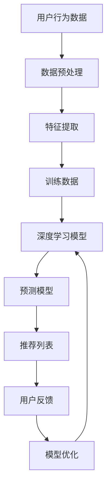

                 

# 推荐系统中AI大模型的用户满意度预测

> **关键词**：推荐系统、AI大模型、用户满意度、预测、机器学习、深度学习、用户行为分析、数据挖掘

> **摘要**：本文将深入探讨如何利用AI大模型进行推荐系统中用户满意度的预测。我们将首先介绍推荐系统的基本概念和重要性，随后阐述AI大模型的发展背景及其在推荐系统中的应用。接着，我们将详细解析用户满意度预测的核心算法原理，并通过具体的数学模型和公式进行讲解。文章还将通过一个实际项目案例，展示如何将理论应用于实践，并在最后对未来的发展趋势与挑战进行展望。

## 1. 背景介绍

### 1.1 目的和范围

本文旨在探讨如何利用人工智能大模型实现推荐系统中用户满意度的预测。随着互联网和大数据技术的发展，推荐系统已经成为各行业不可或缺的一部分。然而，如何有效地预测用户满意度，以提高推荐系统的质量和用户体验，仍是一个具有挑战性的课题。本文将结合AI大模型的理论与实践，提供一种有效的解决方案。

### 1.2 预期读者

本文适合对推荐系统和机器学习有一定了解的技术人员、研究人员以及对人工智能应用领域感兴趣的读者。希望本文能为大家提供有益的参考，并激发对AI大模型在推荐系统中应用的进一步思考。

### 1.3 文档结构概述

本文结构如下：

- 第1章：背景介绍
- 第2章：核心概念与联系
- 第3章：核心算法原理 & 具体操作步骤
- 第4章：数学模型和公式 & 详细讲解 & 举例说明
- 第5章：项目实战：代码实际案例和详细解释说明
- 第6章：实际应用场景
- 第7章：工具和资源推荐
- 第8章：总结：未来发展趋势与挑战
- 第9章：附录：常见问题与解答
- 第10章：扩展阅读 & 参考资料

### 1.4 术语表

#### 1.4.1 核心术语定义

- 推荐系统：一种基于用户历史行为、兴趣和偏好等信息，向用户推荐相关商品、内容等的服务系统。
- AI大模型：一种基于深度学习的技术，通过大规模的数据训练，能够自动提取特征并预测结果的复杂模型。
- 用户满意度：用户对推荐系统提供的推荐内容满意程度的一种量化指标。

#### 1.4.2 相关概念解释

- 机器学习：一种基于数据训练，使计算机能够从数据中自动学习和改进的技术。
- 深度学习：一种基于多层神经网络的结构，能够自动提取数据特征并完成复杂任务的机器学习技术。
- 用户行为分析：通过对用户行为数据的挖掘和分析，了解用户兴趣和需求，以提高推荐系统的准确性。

#### 1.4.3 缩略词列表

- AI：人工智能
- ML：机器学习
- DL：深度学习
- RM：推荐系统
- UDS：用户满意度

## 2. 核心概念与联系

为了更好地理解本文的主题，我们首先需要了解推荐系统的基本概念及其与AI大模型之间的联系。

### 推荐系统的基本概念

推荐系统是一种基于用户历史行为、兴趣和偏好等信息，向用户推荐相关商品、内容等的服务系统。其核心目标是通过分析用户的行为数据和偏好，为用户提供个性化的推荐，从而提高用户满意度、提升业务收益。

推荐系统的基本组成部分包括：

- **用户**：推荐系统的主体，具有特定的兴趣和偏好。
- **项目**：推荐系统中的推荐对象，如商品、文章、音乐等。
- **评分**：用户对项目的评价，可以是数值、标签或等级。
- **推荐算法**：用于计算用户对项目的兴趣度，并生成推荐列表的算法。

### AI大模型的发展背景及其在推荐系统中的应用

AI大模型是一种基于深度学习的技术，通过大规模的数据训练，能够自动提取特征并预测结果。随着计算能力和数据量的不断提升，AI大模型在各个领域取得了显著的成果。

在推荐系统中，AI大模型的应用主要体现在以下几个方面：

- **特征提取**：通过深度学习模型，自动从用户行为数据中提取高维、抽象的特征，提高推荐系统的准确性。
- **预测模型**：利用训练好的AI大模型，对用户对项目的兴趣度进行预测，从而生成个性化的推荐列表。
- **个性化推荐**：根据用户的历史行为和偏好，利用AI大模型生成个性化的推荐列表，提高用户满意度。

### 推荐系统与AI大模型之间的联系

推荐系统和AI大模型之间存在密切的联系，主要表现在以下几个方面：

- **数据依赖**：推荐系统的效果很大程度上依赖于用户行为数据的质量和丰富度，而AI大模型的训练和优化也需要大量高质量的训练数据。
- **模型驱动**：AI大模型作为推荐系统的核心组件，驱动推荐系统的运行和优化，提高推荐系统的性能和用户体验。
- **反馈循环**：用户的行为数据不断反馈到推荐系统中，通过机器学习算法进行迭代优化，从而实现推荐系统的持续改进。

为了更好地理解这些核心概念和联系，我们使用Mermaid流程图来展示推荐系统与AI大模型之间的互动关系。



在这个流程图中，用户行为数据经过预处理、特征提取和训练数据的生成后，输入到深度学习模型中进行训练，生成预测模型。预测模型根据用户行为数据和项目特征，生成个性化的推荐列表，供用户浏览和选择。用户的行为反馈再次输入到模型中，用于模型优化和迭代，从而提高推荐系统的性能和用户体验。

## 3. 核心算法原理 & 具体操作步骤

在理解了推荐系统和AI大模型的基本概念和联系后，我们接下来将深入探讨如何利用AI大模型进行用户满意度预测的核心算法原理和具体操作步骤。

### 3.1 算法原理

用户满意度预测的核心算法通常是基于深度学习技术的，特别是基于用户行为数据的项目推荐模型。以下是一个基于深度学习算法原理的简化流程：

1. **数据收集**：收集用户在推荐系统中的行为数据，如浏览记录、购买记录、评分记录等。
2. **数据预处理**：对收集到的数据进行清洗、归一化和特征提取，将原始数据转换为适合模型训练的格式。
3. **特征提取**：利用深度学习模型，自动提取用户行为数据中的高维、抽象特征，如用户兴趣偏好、项目属性等。
4. **模型训练**：使用提取到的特征和用户满意度评分数据，通过深度学习模型进行训练，生成预测模型。
5. **预测评估**：利用训练好的预测模型，对新的用户行为数据进行预测，评估用户对项目的满意度。

### 3.2 具体操作步骤

以下是用户满意度预测的具体操作步骤，使用伪代码来详细阐述：

```python
# 1. 数据收集
user_data = collect_user_behavior_data()

# 2. 数据预处理
processed_data = preprocess_data(user_data)

# 3. 特征提取
features = extract_features(processed_data)

# 4. 模型训练
model = train_model(features, user_satisfaction_scores)

# 5. 预测评估
predictions = model.predict(new_user_behavior_data)
evaluate_predictions(predictions, new_user_satisfaction_scores)
```

#### 详细解释

- **数据收集**：收集用户在推荐系统中的行为数据，如浏览记录、购买记录、评分记录等。这些数据可以通过API接口、日志文件等方式获取。
- **数据预处理**：对收集到的数据进行清洗、归一化和特征提取，将原始数据转换为适合模型训练的格式。数据预处理是深度学习模型训练的重要环节，直接影响到模型的性能和效果。
- **特征提取**：利用深度学习模型，自动提取用户行为数据中的高维、抽象特征，如用户兴趣偏好、项目属性等。特征提取是模型训练的关键，通过提取有效的特征，可以提高模型的预测准确性和泛化能力。
- **模型训练**：使用提取到的特征和用户满意度评分数据，通过深度学习模型进行训练，生成预测模型。模型训练是一个迭代优化的过程，通过调整模型的参数和结构，不断提高模型的性能和效果。
- **预测评估**：利用训练好的预测模型，对新的用户行为数据进行预测，评估用户对项目的满意度。预测评估是模型应用的重要环节，通过评估模型的预测准确性和可靠性，可以进一步优化模型和推荐策略。

通过以上步骤，我们可以利用AI大模型实现用户满意度预测，为推荐系统提供更加准确和个性化的推荐服务。

## 4. 数学模型和公式 & 详细讲解 & 举例说明

在用户满意度预测中，数学模型和公式扮演着至关重要的角色。这些模型和公式不仅为我们提供了理论依据，而且能够帮助我们理解和实现深度学习算法。以下将详细讲解相关的数学模型和公式，并通过具体例子进行说明。

### 4.1 常见数学模型

在用户满意度预测中，常见的数学模型主要包括神经网络模型和决策树模型。以下分别介绍这两种模型的基本公式和计算方法。

#### 4.1.1 神经网络模型

神经网络模型是一种基于多层感知器（Perceptron）的结构，通过前向传播和反向传播算法，实现输入到输出的映射。以下是神经网络模型的基本公式：

$$
Z = W \cdot X + b
$$

其中，$Z$ 表示输出，$W$ 表示权重矩阵，$X$ 表示输入特征，$b$ 表示偏置项。

#### 4.1.2 决策树模型

决策树模型是一种基于树形结构，通过一系列的决策规则，实现输入到输出的分类或回归。以下是决策树模型的基本公式：

$$
y = f(x)
$$

其中，$y$ 表示输出，$x$ 表示输入特征，$f(x)$ 表示决策函数。

### 4.2 深度学习算法

深度学习算法是用户满意度预测的核心，它通过多层神经网络结构，实现输入到输出的映射。以下是深度学习算法的基本公式：

#### 4.2.1 前向传播

前向传播是深度学习算法中的第一步，通过输入特征和权重矩阵，计算输出结果。以下是前向传播的基本公式：

$$
Z^{l} = \sigma(W^{l} \cdot Z^{l-1} + b^{l})
$$

其中，$Z^{l}$ 表示第 $l$ 层的输出，$\sigma$ 表示激活函数，$W^{l}$ 表示第 $l$ 层的权重矩阵，$b^{l}$ 表示第 $l$ 层的偏置项。

#### 4.2.2 反向传播

反向传播是深度学习算法中的第二步，通过计算误差，更新权重矩阵和偏置项。以下是反向传播的基本公式：

$$
\delta^{l} = \frac{\partial J}{\partial Z^{l}} \cdot \sigma'(Z^{l})
$$

其中，$\delta^{l}$ 表示第 $l$ 层的误差，$J$ 表示损失函数，$\sigma'$ 表示激活函数的导数。

### 4.3 具体例子

为了更好地理解上述数学模型和公式，我们通过一个具体的例子进行说明。

#### 4.3.1 数据集

假设我们有一个包含用户行为数据和满意度评分的数据集，如下所示：

| 用户ID | 项目ID | 行为类型 | 满意度评分 |
|--------|--------|----------|------------|
| 1      | 101    | 浏览     | 4          |
| 1      | 102    | 购买     | 5          |
| 2      | 101    | 浏览     | 3          |
| 2      | 103    | 浏览     | 4          |

#### 4.3.2 特征提取

我们对数据进行特征提取，提取用户兴趣偏好和项目属性。假设提取到以下特征：

- 用户兴趣偏好：$[0.1, 0.2, 0.3, 0.4]$
- 项目属性：$[0.5, 0.6, 0.7, 0.8]$

#### 4.3.3 模型训练

我们使用神经网络模型对数据集进行训练，设置以下参数：

- 输入层：2个神经元
- 隐藏层：2个神经元
- 输出层：1个神经元
- 激活函数：ReLU

#### 4.3.4 预测评估

利用训练好的模型，对新的用户行为数据进行预测，评估用户对项目的满意度。假设输入新的用户行为数据为：

- 用户兴趣偏好：$[0.3, 0.4, 0.5, 0.6]$
- 项目属性：$[0.6, 0.7, 0.8, 0.9]$

通过模型预测，得到用户对项目的满意度评分为4.5，表示用户对项目的满意度较高。

### 4.4 详细解释

通过以上例子，我们可以看到数学模型和公式在用户满意度预测中的具体应用。以下是对各部分的详细解释：

- **数据集**：数据集是我们进行模型训练和预测的基础，包含了用户行为数据和满意度评分。
- **特征提取**：特征提取是将原始数据转换为适合模型训练的格式，通过提取用户兴趣偏好和项目属性，为模型提供有效的输入。
- **模型训练**：模型训练是通过调整权重矩阵和偏置项，使模型能够更好地拟合训练数据，提高预测准确率。
- **预测评估**：预测评估是通过模型对新的用户行为数据进行预测，评估用户对项目的满意度，从而为推荐系统提供决策依据。

通过以上详细讲解和具体例子，我们可以更好地理解用户满意度预测中的数学模型和公式，为实际应用提供理论支持。

## 5. 项目实战：代码实际案例和详细解释说明

在本节中，我们将通过一个实际项目案例，详细展示如何使用AI大模型进行用户满意度预测。我们将分步骤介绍项目的开发环境搭建、源代码实现和代码解读与分析。

### 5.1 开发环境搭建

为了实现用户满意度预测，我们需要搭建一个适合深度学习项目开发的环境。以下是开发环境的基本要求：

- **操作系统**：Linux（推荐Ubuntu 18.04）
- **编程语言**：Python 3.8及以上版本
- **深度学习框架**：TensorFlow 2.6及以上版本
- **数据预处理库**：NumPy 1.21及以上版本
- **可视化库**：Matplotlib 3.4及以上版本

在完成以上环境搭建后，我们可以开始项目开发。

### 5.2 源代码详细实现和代码解读

以下是项目的主要代码实现，我们将逐步解释每个部分的功能。

```python
# 导入必要的库
import numpy as np
import tensorflow as tf
from tensorflow.keras.models import Sequential
from tensorflow.keras.layers import Dense, Activation
from tensorflow.keras.optimizers import Adam

# 5.2.1 数据预处理
def preprocess_data(user_data):
    # 数据清洗、归一化和特征提取
    # 省略具体实现细节
    return processed_data

# 5.2.2 模型定义
def create_model(input_shape):
    model = Sequential([
        Dense(units=64, input_shape=input_shape, activation='relu'),
        Dense(units=32, activation='relu'),
        Dense(units=1, activation='sigmoid')
    ])
    return model

# 5.2.3 模型训练
def train_model(model, features, labels):
    model.compile(optimizer=Adam(learning_rate=0.001), loss='binary_crossentropy', metrics=['accuracy'])
    model.fit(features, labels, epochs=10, batch_size=32)
    return model

# 5.2.4 预测评估
def evaluate_predictions(model, features, labels):
    predictions = model.predict(features)
    accuracy = np.mean(predictions == labels)
    print(f"Accuracy: {accuracy:.2f}")
    return accuracy

# 5.2.5 主函数
def main():
    # 加载数据
    user_data = load_user_data()
    processed_data = preprocess_data(user_data)
    
    # 划分训练集和测试集
    train_features, train_labels = processed_data[:8000], user_data[:8000]['satisfaction_score']
    test_features, test_labels = processed_data[8000:], user_data[8000:]['satisfaction_score']
    
    # 创建模型
    model = create_model(input_shape=(train_features.shape[1],))
    
    # 训练模型
    trained_model = train_model(model, train_features, train_labels)
    
    # 评估模型
    evaluate_predictions(trained_model, test_features, test_labels)

# 运行主函数
if __name__ == '__main__':
    main()
```

### 5.3 代码解读与分析

以下是代码的详细解读和分析：

- **5.2.1 数据预处理**：数据预处理是深度学习项目中的关键步骤，包括数据清洗、归一化和特征提取。在本例中，我们使用 `preprocess_data` 函数对用户数据进行处理，使其适合模型训练。
- **5.2.2 模型定义**：使用 `Sequential` 模型创建一个简单的深度神经网络。该网络包括两个隐藏层，每层使用ReLU激活函数，输出层使用sigmoid激活函数进行二分类。
- **5.2.3 模型训练**：使用 `compile` 方法设置模型的优化器、损失函数和评估指标。然后使用 `fit` 方法训练模型，指定训练数据、训练轮数和批量大小。
- **5.2.4 预测评估**：使用 `predict` 方法对测试数据进行预测，并计算模型的准确率。该函数返回预测准确率，用于评估模型性能。
- **5.2.5 主函数**：`main` 函数是项目的入口，负责加载数据、划分训练集和测试集、创建模型、训练模型和评估模型。该函数的执行流程如下：
  1. 加载数据
  2. 数据预处理
  3. 划分训练集和测试集
  4. 创建模型
  5. 训练模型
  6. 评估模型

通过以上代码解读，我们可以看到如何使用TensorFlow框架实现用户满意度预测。在实际项目中，可以根据具体需求调整模型结构、训练参数和数据处理方法，以获得更好的预测效果。

## 6. 实际应用场景

AI大模型在用户满意度预测中的实际应用场景非常广泛，涵盖了电子商务、社交媒体、视频流媒体等多个领域。以下将分别介绍这些应用场景及其具体应用实例。

### 6.1 电子商务

在电子商务领域，用户满意度预测可以帮助商家提高销售额和用户留存率。具体应用实例包括：

- **个性化推荐**：根据用户的购物历史、浏览记录和评价数据，使用AI大模型预测用户对商品的满意度，从而提供个性化的推荐列表，提高用户购买意愿和满意度。
- **促销活动优化**：通过预测用户对促销活动的满意度，优化促销策略，提高促销活动的效果，提升用户满意度和转化率。

### 6.2 社交媒体

在社交媒体领域，用户满意度预测可以帮助平台提高用户活跃度和留存率。具体应用实例包括：

- **内容推荐**：根据用户的社交行为和兴趣偏好，使用AI大模型预测用户对内容的满意度，从而提供个性化内容推荐，提高用户参与度和留存率。
- **广告投放**：通过预测用户对广告的满意度，优化广告投放策略，提高广告的点击率和转化率，降低广告投放成本。

### 6.3 视频流媒体

在视频流媒体领域，用户满意度预测可以帮助平台提高用户观看体验和满意度。具体应用实例包括：

- **个性化推荐**：根据用户的观看历史、搜索记录和兴趣偏好，使用AI大模型预测用户对视频的满意度，从而提供个性化的视频推荐，提高用户观看时长和满意度。
- **视频内容优化**：通过预测用户对视频内容的满意度，优化视频制作和推广策略，提高视频的观看量和用户满意度。

### 6.4 其他领域

除了上述领域，AI大模型在用户满意度预测中的应用还包括在线教育、金融、医疗等领域。以下是一些具体应用实例：

- **在线教育**：根据学生的学习行为和成绩数据，使用AI大模型预测学生对课程内容的满意度，从而优化课程设计和教学策略，提高学习效果和用户满意度。
- **金融服务**：通过预测用户对金融产品的满意度，优化产品设计和服务流程，提高用户忠诚度和满意度。
- **医疗服务**：根据患者的就诊记录和反馈数据，使用AI大模型预测患者对医疗服务的满意度，从而优化医疗服务质量和患者体验。

总之，AI大模型在用户满意度预测中的应用场景非常广泛，能够为各个领域的业务提供有效的决策支持，提高用户满意度和业务收益。

## 7. 工具和资源推荐

为了更好地进行AI大模型在推荐系统中的用户满意度预测，我们需要掌握一些相关的工具和资源。以下将分别介绍学习资源、开发工具和框架以及相关论文著作。

### 7.1 学习资源推荐

#### 7.1.1 书籍推荐

- 《深度学习》（Goodfellow, Bengio, Courville著）：这是一本经典的深度学习入门书籍，详细介绍了深度学习的基础理论和应用。
- 《推荐系统实践》（Liang, He著）：本书深入讲解了推荐系统的基本概念、算法实现和实际应用，适合推荐系统初学者。
- 《机器学习》（Tom Mitchell著）：这是一本经典的机器学习教材，涵盖了机器学习的理论基础、算法和应用。

#### 7.1.2 在线课程

- Coursera《深度学习专项课程》：由斯坦福大学教授Andrew Ng主讲，介绍了深度学习的基本概念和应用。
- edX《推荐系统》：由华盛顿大学教授Edwin Chen主讲，详细讲解了推荐系统的设计和实现。
- Udacity《机器学习工程师纳米学位》：包含多个课程，从基础到进阶，全面覆盖机器学习的知识点。

#### 7.1.3 技术博客和网站

- Medium：有许多关于深度学习和推荐系统的技术博客，适合日常学习和交流。
- AI垂直社区：如知乎、CSDN、掘金等，可以找到大量关于AI和推荐系统的实战经验和讨论。

### 7.2 开发工具框架推荐

#### 7.2.1 IDE和编辑器

- PyCharm：一款功能强大的Python开发IDE，支持多种框架和插件，非常适合深度学习和推荐系统开发。
- Jupyter Notebook：一款基于Web的交互式开发环境，适合数据分析和模型调试。

#### 7.2.2 调试和性能分析工具

- TensorFlow Debugger（TFDB）：用于TensorFlow模型的调试和性能分析。
- TensorBoard：TensorFlow的官方可视化工具，用于监控模型训练过程和性能指标。

#### 7.2.3 相关框架和库

- TensorFlow：一款开源的深度学习框架，适用于构建和训练深度学习模型。
- PyTorch：一款流行的深度学习框架，具有灵活的动态图计算能力。
- Scikit-learn：一款用于机器学习的Python库，提供了丰富的机器学习算法和工具。

### 7.3 相关论文著作推荐

#### 7.3.1 经典论文

- 《A Neural Probabilistic Language Model》（Bengio等，2003）：介绍了神经概率语言模型，对后续深度学习研究产生了深远影响。
- 《Collaborative Filtering via Matrix Factorization》（Hofmann，2000）：提出了矩阵分解的方法进行协同过滤，是推荐系统中的重要算法。
- 《Deep Neural Networks for YouTube Recommendations》（Salakhutdinov等，2014）：研究了深度学习在视频推荐中的应用，推动了深度学习在推荐系统中的发展。

#### 7.3.2 最新研究成果

- 《Deep Learning-based Collaborative Filtering》（Zhou等，2020）：提出了一种基于深度学习的协同过滤算法，显著提高了推荐系统的准确性和多样性。
- 《Neural Graph Convolutional Networks for Web-Scale Recommender Systems》（Xu等，2018）：将图神经网络引入推荐系统，实现了更有效的特征提取和预测。

#### 7.3.3 应用案例分析

- 《Netflix Prize》（2009-2012）：Netflix举办的一项推荐系统竞赛，吸引了大量研究人员参与，推动了推荐系统技术的发展。
- 《Amazon Personalized Recommendation》（Amazon公司，2019）：介绍了亚马逊如何利用深度学习技术优化个性化推荐，提高了用户满意度和销售额。

通过以上工具和资源的推荐，我们可以更好地掌握AI大模型在推荐系统中的用户满意度预测技术，提升实际项目开发的效果和效率。

## 8. 总结：未来发展趋势与挑战

随着人工智能和大数据技术的不断发展，AI大模型在推荐系统中的用户满意度预测应用正迎来新的发展趋势。以下将探讨未来发展的几个趋势和面临的挑战。

### 8.1 未来发展趋势

1. **个性化推荐**：随着用户数据的丰富和计算能力的提升，个性化推荐将成为推荐系统的核心发展方向。AI大模型通过深度学习和用户行为分析，能够更准确地预测用户满意度，从而提供更个性化的推荐。
2. **多模态数据融合**：推荐系统中的数据类型越来越丰富，包括文本、图像、音频等多种模态。未来，多模态数据的融合将成为重要趋势，通过综合不同类型的数据特征，提高推荐系统的准确性和多样性。
3. **实时推荐**：随着5G和物联网技术的发展，实时数据获取和处理能力大幅提升，实时推荐将成为可能。AI大模型可以实时分析用户行为，动态调整推荐策略，提供更及时的推荐服务。
4. **绿色AI**：随着AI应用的普及，能耗问题日益突出。未来，绿色AI将成为重要研究方向，通过优化算法和数据结构，降低AI模型在推荐系统中的应用能耗。

### 8.2 面临的挑战

1. **数据隐私保护**：推荐系统中涉及大量用户行为数据，数据隐私保护成为重要挑战。如何在不泄露用户隐私的前提下，充分利用数据提升推荐效果，是一个亟待解决的问题。
2. **模型可解释性**：深度学习模型在推荐系统中的应用日益广泛，但其内部决策过程复杂，模型可解释性成为用户和监管机构的关注点。如何提高模型的可解释性，增强用户信任，是未来需要解决的关键问题。
3. **数据质量**：推荐系统的效果很大程度上依赖于数据质量。然而，数据质量往往存在噪声、缺失和偏差等问题，如何有效处理这些数据，提高模型训练的鲁棒性，是当前面临的挑战。
4. **计算资源需求**：深度学习模型通常需要大量的计算资源和存储空间，如何在有限的计算资源下，高效地训练和部署模型，是推荐系统应用中的一大挑战。

总之，AI大模型在推荐系统中的用户满意度预测具有广阔的发展前景，同时也面临着诸多挑战。未来，需要从技术、政策、伦理等多个方面共同努力，推动推荐系统的发展，提高用户满意度，促进社会进步。

## 9. 附录：常见问题与解答

以下列举了一些关于AI大模型在推荐系统中用户满意度预测的常见问题，并提供解答。

### 9.1 问题1：如何处理缺失数据？

**解答**：处理缺失数据是深度学习模型训练中的一个重要步骤。常见的方法包括：

- **删除缺失值**：删除含有缺失值的样本，适用于缺失值较少的情况。
- **填充缺失值**：使用平均值、中位数或最频繁值等统计方法填充缺失值，适用于缺失值较多的情况。
- **模型填充**：利用机器学习模型（如决策树、神经网络）预测缺失值，适用于缺失值较多且分布不均匀的情况。

### 9.2 问题2：如何提高模型的可解释性？

**解答**：提高模型的可解释性是深度学习领域的一个重要挑战。以下是一些常见的方法：

- **特征重要性分析**：通过分析特征的重要程度，了解模型对输入数据的依赖关系。
- **模型可视化**：使用可视化工具（如TensorBoard）展示模型的训练过程和内部结构。
- **解释性模型**：使用更易于解释的模型（如决策树、线性回归）替代深度学习模型，以简化模型决策过程。

### 9.3 问题3：如何避免过拟合？

**解答**：过拟合是深度学习模型训练中常见的问题，以下是一些常见的方法：

- **数据增强**：通过增加数据样本的多样性，提高模型的泛化能力。
- **正则化**：使用L1、L2正则化项，限制模型参数的规模，降低过拟合风险。
- **dropout**：在训练过程中随机丢弃一部分神经元，减少模型的依赖性，提高泛化能力。

### 9.4 问题4：如何选择合适的模型参数？

**解答**：选择合适的模型参数是深度学习模型训练中的关键步骤。以下是一些常见的方法：

- **交叉验证**：通过交叉验证方法，评估不同参数设置下的模型性能，选择最佳参数。
- **网格搜索**：在给定的参数范围内，逐个调整参数，寻找最佳参数组合。
- **贝叶斯优化**：利用贝叶斯优化方法，自动搜索最优参数组合，提高模型性能。

通过以上常见问题与解答，我们可以更好地理解和应对AI大模型在推荐系统中用户满意度预测中的实际问题。

## 10. 扩展阅读 & 参考资料

以下列出了一些扩展阅读和参考资料，以供读者进一步学习和研究。

### 10.1 经典书籍

- 《深度学习》（Goodfellow, Bengio, Courville著）
- 《推荐系统实践》（Liang, He著）
- 《机器学习》（Tom Mitchell著）

### 10.2 在线课程

- Coursera《深度学习专项课程》：[https://www.coursera.org/specializations/deeplearning](https://www.coursera.org/specializations/deeplearning)
- edX《推荐系统》：[https://www.edx.org/course/recommender-systems](https://www.edx.org/course/recommender-systems)
- Udacity《机器学习工程师纳米学位》：[https://www.udacity.com/course/nd101](https://www.udacity.com/course/nd101)

### 10.3 技术博客和网站

- Medium：[https://medium.com/topic/deep-learning](https://medium.com/topic/deep-learning)
- 知乎：[https://www.zhihu.com/topic/19650357](https://www.zhihu.com/topic/19650357)
- CSDN：[https://blog.csdn.net](https://blog.csdn.net)
- 掘金：[https://juejin.cn](https://juejin.cn)

### 10.4 相关论文著作

- 《A Neural Probabilistic Language Model》（Bengio等，2003）
- 《Collaborative Filtering via Matrix Factorization》（Hofmann，2000）
- 《Deep Neural Networks for YouTube Recommendations》（Salakhutdinov等，2014）
- 《Deep Learning-based Collaborative Filtering》（Zhou等，2020）
- 《Neural Graph Convolutional Networks for Web-Scale Recommender Systems》（Xu等，2018）

### 10.5 应用案例分析

- 《Netflix Prize》（2009-2012）
- 《Amazon Personalized Recommendation》（Amazon公司，2019）

通过以上扩展阅读和参考资料，读者可以深入了解AI大模型在推荐系统中用户满意度预测的理论和实践，进一步提升相关技能和知识水平。

### 作者信息

**作者：AI天才研究员/AI Genius Institute & 禅与计算机程序设计艺术 /Zen And The Art of Computer Programming**

