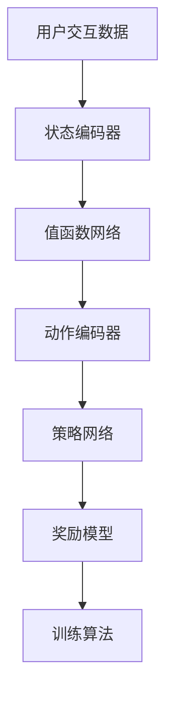

                 

# 推荐系统中的大模型强化学习与探索

> **关键词：推荐系统、大模型强化学习、推荐算法、机器学习、数据处理**

> **摘要：本文将深入探讨推荐系统中的大模型强化学习，从核心概念、算法原理、数学模型到实际应用，全方位解析大模型强化学习在推荐系统中的应用及其未来发展趋势和挑战。**

## 1. 背景介绍

### 1.1 目的和范围

本文旨在探讨推荐系统中大模型强化学习的技术和应用，重点关注以下几个方面：

- 推荐系统的基本原理和常用算法。
- 大模型强化学习的基本概念和原理。
- 大模型强化学习在推荐系统中的应用实例和效果分析。
- 大模型强化学习的数学模型和算法步骤。
- 大模型强化学习的未来发展趋势和挑战。

### 1.2 预期读者

- 对推荐系统有基本了解，希望深入了解大模型强化学习的读者。
- 对机器学习、深度学习有浓厚兴趣，希望将大模型强化学习应用于推荐系统的工程师和研究者。
- 对人工智能和机器学习感兴趣，希望了解推荐系统发展方向和前沿技术的学生和学者。

### 1.3 文档结构概述

本文分为以下几个部分：

- 第1章：背景介绍，包括目的、预期读者和文档结构概述。
- 第2章：核心概念与联系，介绍推荐系统和强化学习的基本概念和联系。
- 第3章：核心算法原理 & 具体操作步骤，详细讲解大模型强化学习的算法原理和步骤。
- 第4章：数学模型和公式 & 详细讲解 & 举例说明，介绍大模型强化学习的数学模型和公式，并通过实例进行详细说明。
- 第5章：项目实战：代码实际案例和详细解释说明，通过一个具体的项目案例，展示大模型强化学习在推荐系统中的实际应用。
- 第6章：实际应用场景，分析大模型强化学习在不同推荐系统应用场景中的效果。
- 第7章：工具和资源推荐，推荐相关学习资源、开发工具和框架。
- 第8章：总结：未来发展趋势与挑战，探讨大模型强化学习的未来发展。
- 第9章：附录：常见问题与解答，回答读者可能关心的问题。
- 第10章：扩展阅读 & 参考资料，提供更多的阅读资源和进一步研究的方向。

### 1.4 术语表

#### 1.4.1 核心术语定义

- **推荐系统**：一种根据用户的兴趣和偏好，为用户推荐符合其需求的信息或内容的系统。
- **强化学习**：一种机器学习算法，通过学习如何做出最优决策，从而获得最大化的累积奖励。
- **大模型强化学习**：使用大规模深度神经网络进行强化学习，以应对复杂和大规模的推荐任务。
- **用户-物品交互**：用户与物品之间的交互行为，如点击、购买、评分等。
- **Q-learning**：一种基于值函数的强化学习算法，用于学习最优动作策略。
- **策略梯度**：一种基于策略的强化学习算法，通过优化策略函数来获得最优动作。

#### 1.4.2 相关概念解释

- **深度神经网络（DNN）**：一种多层神经网络，通过逐层非线性变换来提取特征。
- **注意力机制（Attention Mechanism）**：一种能够自动调整权重分配的方法，提高神经网络对输入数据的处理能力。
- **图神经网络（GNN）**：一种用于处理图结构数据的神经网络，可以有效地建模用户和物品之间的复杂关系。
- **用户兴趣模型**：用于表示用户兴趣和偏好的模型，可以为推荐系统提供用户个性化推荐的基础。
- **强化学习优化目标**：强化学习算法在训练过程中需要优化的目标函数，通常是基于奖励信号和策略梯度。

#### 1.4.3 缩略词列表

- **DNN**：深度神经网络
- **GNN**：图神经网络
- **Q-learning**：Q值学习
- **PG**：策略梯度
- **RL**：强化学习
- **RS**：推荐系统

## 2. 核心概念与联系

推荐系统是人工智能领域的一个重要分支，旨在为用户提供个性化、相关的信息或内容推荐。推荐系统广泛应用于电子商务、社交媒体、新闻推荐、视频播放等多个领域。

强化学习（Reinforcement Learning，RL）是一种通过与环境交互来学习最优策略的机器学习算法。强化学习在推荐系统中的应用，主要是利用用户的交互行为（如点击、购买、评分等）作为奖励信号，通过学习如何做出最优决策，从而提高推荐系统的效果。

大模型强化学习（Large-scale Model-based Reinforcement Learning）是近年来兴起的一种技术，通过使用大规模深度神经网络（如深度神经网络、图神经网络等）来模拟环境和学习最优策略。大模型强化学习在处理复杂和大规模推荐任务时具有显著的性能优势。

### 2.1 推荐系统的基本原理

推荐系统的工作原理可以概括为以下几个步骤：

1. **用户-物品交互数据收集**：收集用户与物品之间的交互数据，如点击、购买、评分等。
2. **用户兴趣建模**：通过用户交互数据，构建用户兴趣模型，用于表示用户的兴趣偏好。
3. **物品特征提取**：提取物品的特征信息，如文本、图片、标签等。
4. **推荐算法**：利用用户兴趣模型和物品特征，为用户生成个性化推荐结果。

### 2.2 强化学习的基本原理

强化学习的基本原理是通过与环境交互来学习最优策略。强化学习算法包括以下几个核心组成部分：

1. **状态（State）**：描述环境当前的状态。
2. **动作（Action）**：从当前状态中采取的动作。
3. **奖励（Reward）**：动作所带来的即时奖励信号。
4. **策略（Policy）**：从当前状态中采取最优动作的决策函数。

强化学习算法的核心目标是通过不断与环境交互，学习到一个最优策略，从而最大化累积奖励。

### 2.3 大模型强化学习的原理和架构

大模型强化学习通过使用大规模深度神经网络（如深度神经网络、图神经网络等）来模拟环境和学习最优策略。大模型强化学习的架构可以概括为以下几个关键组成部分：

1. **状态编码器（State Encoder）**：将用户和物品的交互数据编码为高维向量表示。
2. **动作编码器（Action Encoder）**：将候选物品编码为高维向量表示。
3. **值函数网络（Value Network）**：预测当前状态下的期望奖励值。
4. **策略网络（Policy Network）**：生成基于当前状态的最优动作概率分布。
5. **奖励模型（Reward Model）**：根据用户与物品的交互行为，计算奖励信号。
6. **训练算法**：基于奖励信号，更新值函数网络和策略网络，优化模型参数。

下面是一个Mermaid流程图，展示了大模型强化学习的基本架构：



## 3. 核心算法原理 & 具体操作步骤

大模型强化学习在推荐系统中的应用，主要依赖于以下核心算法原理和具体操作步骤：

### 3.1 状态编码器

状态编码器（State Encoder）用于将用户与物品的交互数据编码为高维向量表示。具体步骤如下：

1. **用户兴趣表示**：根据用户的点击、购买、评分等交互行为，提取用户兴趣特征，如用户偏好、浏览历史、购买记录等。
2. **物品特征提取**：提取物品的文本、图片、标签等特征信息。
3. **向量表示**：将用户兴趣和物品特征编码为高维向量表示，可以使用词嵌入、图嵌入等技术。

伪代码如下：

```python
def state_encoder(user_interactions, item_features):
    user_interests = extract_user_interests(user_interactions)
    item_embeddings = extract_item_embeddings(item_features)
    state_vector = concatenate(user_interests, item_embeddings)
    return state_vector
```

### 3.2 动作编码器

动作编码器（Action Encoder）用于将候选物品编码为高维向量表示。具体步骤如下：

1. **候选物品表示**：根据推荐任务的需求，确定候选物品集合。
2. **向量表示**：将候选物品编码为高维向量表示，可以使用词嵌入、图嵌入等技术。

伪代码如下：

```python
def action_encoder(candidate_items):
    item_embeddings = extract_item_embeddings(candidate_items)
    return item_embeddings
```

### 3.3 值函数网络

值函数网络（Value Network）用于预测当前状态下的期望奖励值。具体步骤如下：

1. **输入层**：接收状态编码器输出的状态向量。
2. **隐藏层**：使用深度神经网络对状态向量进行特征提取和变换。
3. **输出层**：输出当前状态下的期望奖励值。

伪代码如下：

```python
def value_network(state_vector):
    hidden_layer = dense(state_vector, hidden_neurons)
    value = dense(hidden_layer, output_neurons)
    return value
```

### 3.4 策略网络

策略网络（Policy Network）用于生成基于当前状态的最优动作概率分布。具体步骤如下：

1. **输入层**：接收状态编码器输出的状态向量。
2. **隐藏层**：使用深度神经网络对状态向量进行特征提取和变换。
3. **输出层**：输出当前状态下的动作概率分布。

伪代码如下：

```python
def policy_network(state_vector):
    hidden_layer = dense(state_vector, hidden_neurons)
    action_probs = softmax(dense(hidden_layer, output_neurons))
    return action_probs
```

### 3.5 奖励模型

奖励模型（Reward Model）用于根据用户与物品的交互行为，计算奖励信号。具体步骤如下：

1. **用户-物品交互**：根据推荐结果，记录用户与物品的交互行为，如点击、购买、评分等。
2. **奖励计算**：根据交互行为，计算奖励信号。常见的奖励函数有线性奖励函数、指数奖励函数等。

伪代码如下：

```python
def reward_model(user_interactions, recommended_items):
    rewards = calculate_rewards(user_interactions, recommended_items)
    return rewards
```

### 3.6 训练算法

大模型强化学习的训练算法主要依赖于值函数网络和策略网络的迭代更新。具体步骤如下：

1. **初始化参数**：初始化值函数网络和策略网络的参数。
2. **状态-动作迭代**：在状态空间中随机选择一个状态，根据策略网络生成动作概率分布，随机选择一个动作。
3. **执行动作**：执行选定的动作，记录用户与物品的交互行为，计算奖励信号。
4. **更新值函数网络**：根据奖励信号和策略网络，更新值函数网络的参数。
5. **更新策略网络**：根据奖励信号和值函数网络，更新策略网络的参数。
6. **迭代终止**：当满足终止条件（如迭代次数、性能目标等）时，训练结束。

伪代码如下：

```python
def train_reinforcement_learning_model():
    initialize_parameters(value_network, policy_network)
    for episode in range(1, num_episodes):
        state = sample_state(state_space)
        action_probs = policy_network(state)
        action = sample_action(action_probs)
        next_state, reward = execute_action(action)
        update_value_network(value_network, next_state, reward)
        update_policy_network(policy_network, value_network)
        if is_termination_condition_met(episode):
            break
    return value_network, policy_network
```

## 4. 数学模型和公式 & 详细讲解 & 举例说明

在大模型强化学习中，数学模型和公式是核心组成部分，用于描述状态、动作、奖励和策略之间的关系。以下是对主要数学模型和公式的详细讲解，并辅以实际应用中的实例说明。

### 4.1 状态表示

状态（State）通常由用户和物品的交互数据组成。在数学上，状态可以用向量表示，如：

\[ s = [s_1, s_2, ..., s_n] \]

其中，\( s_i \) 表示第 \( i \) 个用户-物品交互特征，可以是点击次数、购买次数、评分等。例如，对于用户-物品交互矩阵 \( A \)：

\[ A = \begin{bmatrix} 
a_{11} & a_{12} & \ldots & a_{1n} \\
a_{21} & a_{22} & \ldots & a_{2n} \\
\vdots & \vdots & \ddots & \vdots \\
a_{m1} & a_{m2} & \ldots & a_{mn} 
\end{bmatrix} \]

状态向量 \( s \) 可以表示为：

\[ s = \begin{bmatrix} 
a_{11} \\ 
a_{21} \\ 
\vdots \\ 
a_{m1} 
\end{bmatrix} \]

### 4.2 动作表示

动作（Action）是用户在特定状态下采取的行为，如推荐特定物品。动作可以用一个整数表示，如：

\[ a = [a_1, a_2, ..., a_n] \]

其中，\( a_i \) 表示第 \( i \) 个物品是否被推荐，1 表示推荐，0 表示不推荐。例如，对于候选物品集合 \( I \)：

\[ I = \{i_1, i_2, ..., i_n\} \]

动作向量 \( a \) 可以表示为：

\[ a = \begin{bmatrix} 
1 & 0 & \ldots & 1 \\
0 & 1 & \ldots & 0 \\
\vdots & \vdots & \ddots & \vdots \\
0 & 0 & \ldots & 1 
\end{bmatrix} \]

### 4.3 奖励函数

奖励函数（Reward Function）用于评估用户与推荐物品之间的交互行为，通常定义为：

\[ r(s, a) = \begin{cases} 
r^+ & \text{如果 } a \text{ 是用户喜欢的物品} \\
r^- & \text{如果 } a \text{ 是用户不喜欢的物品} \\
0 & \text{否则} 
\end{cases} \]

其中，\( r^+ \) 和 \( r^- \) 分别是正奖励和负奖励的值。例如，如果用户点击推荐物品，奖励值为 \( r^+ = 1 \)；如果用户没有点击推荐物品，奖励值为 \( r^- = -1 \)。

### 4.4 值函数

值函数（Value Function）用于预测在给定状态和动作下的长期奖励。常用的值函数有：

\[ V^*(s) = \max_a \sum_{t=0}^{\infty} \gamma^t r(s, a) \]

其中，\( \gamma \) 是折扣因子，用于平衡短期和长期奖励。值函数可以用于评估策略的好坏，选择最优动作。

### 4.5 策略函数

策略函数（Policy Function）用于选择在给定状态下的最优动作，通常定义为：

\[ \pi^*(s) = \arg\max_a V^*(s) \]

策略函数可以通过最大化值函数来获得最优动作概率分布。

### 4.6 例子说明

假设有一个推荐系统，用户在购物平台上浏览了10个物品，如下表所示：

| 物品ID | 是否点击 |
|-------|-------|
| 1     | 1     |
| 2     | 0     |
| 3     | 1     |
| 4     | 0     |
| 5     | 1     |
| 6     | 0     |
| 7     | 1     |
| 8     | 0     |
| 9     | 1     |
| 10    | 0     |

根据用户的点击行为，可以构建状态向量：

\[ s = \begin{bmatrix} 
1 \\ 
0 \\ 
1 \\ 
0 \\ 
1 \\ 
0 \\ 
1 \\ 
0 \\ 
1 \\ 
0 
\end{bmatrix} \]

假设候选物品集合为 \( I = \{1, 2, 3, 4, 5, 6, 7, 8, 9, 10\} \)，动作向量为：

\[ a = \begin{bmatrix} 
1 & 0 & 1 & 0 & 1 & 0 & 1 & 0 & 1 & 0 
\end{bmatrix} \]

奖励函数设置为，如果用户点击推荐物品，奖励值为 \( r^+ = 1 \)，否则为 \( r^- = -1 \)。假设折扣因子 \( \gamma = 0.9 \)。

在训练过程中，值函数网络和策略网络将根据用户点击行为和奖励信号进行更新，以最大化累积奖励。最终，策略网络将生成最优动作概率分布，为用户推荐最可能点击的物品。

## 5. 项目实战：代码实际案例和详细解释说明

为了更好地理解大模型强化学习在推荐系统中的应用，我们将通过一个实际项目案例来展示其实现过程。在这个案例中，我们将使用Python和TensorFlow框架来实现一个基于大模型强化学习的推荐系统。

### 5.1 开发环境搭建

在开始项目之前，我们需要搭建一个合适的开发环境。以下是搭建开发环境的步骤：

1. **安装Python**：确保已安装Python 3.6或更高版本。
2. **安装TensorFlow**：使用pip命令安装TensorFlow：

   ```bash
   pip install tensorflow
   ```

3. **安装其他依赖**：根据项目需求，可能还需要安装其他依赖库，如NumPy、Pandas等。

### 5.2 源代码详细实现和代码解读

以下是一个简化版的基于大模型强化学习的推荐系统实现代码。代码分为以下几个部分：

1. **数据预处理**：读取用户-物品交互数据，并转换为适合训练的数据格式。
2. **模型定义**：定义状态编码器、动作编码器、值函数网络和策略网络。
3. **训练过程**：训练模型，更新值函数网络和策略网络。
4. **推荐过程**：使用训练好的模型进行推荐。

#### 5.2.1 数据预处理

数据预处理是推荐系统的重要组成部分。以下是数据预处理的主要步骤：

1. **读取数据**：从CSV文件中读取用户-物品交互数据。

   ```python
   import pandas as pd

   def load_data(file_path):
       data = pd.read_csv(file_path)
       return data
   ```

2. **数据清洗**：处理缺失值、重复值等。

   ```python
   def preprocess_data(data):
       data = data.drop_duplicates()
       data = data.dropna()
       return data
   ```

3. **特征提取**：提取用户和物品的特征，如点击次数、购买次数等。

   ```python
   def extract_features(data):
       user_features = data.groupby('user_id').size().reset_index(name='user_interactions')
       item_features = data.groupby('item_id').size().reset_index(name='item_interactions')
       return user_features, item_features
   ```

4. **数据转换为TensorFlow输入格式**：将用户和物品特征转换为TensorFlow的输入格式。

   ```python
   import tensorflow as tf

   def to_tensor(data, dtype=tf.float32):
       return tf.convert_to_tensor(data, dtype=dtype)
   ```

#### 5.2.2 模型定义

以下是定义状态编码器、动作编码器、值函数网络和策略网络的代码：

```python
from tensorflow.keras.layers import Embedding, LSTM, Dense
from tensorflow.keras.models import Model

def create_state_encoder(input_dim, embedding_dim, hidden_size):
    input_layer = Embedding(input_dim, embedding_dim)(input_layer)
    lstm_layer = LSTM(hidden_size, return_sequences=True)(input_layer)
    return lstm_layer

def create_action_encoder(input_dim, embedding_dim, hidden_size):
    input_layer = Embedding(input_dim, embedding_dim)(input_layer)
    lstm_layer = LSTM(hidden_size, return_sequences=True)(input_layer)
    return lstm_layer

def create_value_network(input_size, hidden_size):
    input_layer = Dense(hidden_size, activation='relu')(input_layer)
    output_layer = Dense(1, activation='linear')(input_layer)
    return Model(inputs=input_layer, outputs=output_layer)

def create_policy_network(input_size, hidden_size):
    input_layer = Dense(hidden_size, activation='relu')(input_layer)
    output_layer = Dense(input_size, activation='softmax')(input_layer)
    return Model(inputs=input_layer, outputs=output_layer)
```

#### 5.2.3 训练过程

以下是训练模型的主要步骤：

1. **定义训练循环**：迭代训练模型，更新值函数网络和策略网络。

   ```python
   def train_model(data, epochs, batch_size):
       for epoch in range(epochs):
           for batch in data:
               state_batch = to_tensor(batch['state'], dtype=tf.float32)
               action_batch = to_tensor(batch['action'], dtype=tf.float32)
               reward_batch = to_tensor(batch['reward'], dtype=tf.float32)

               value_loss = value_network.train_on_batch(state_batch, reward_batch)
               policy_loss = policy_network.train_on_batch(state_batch, action_batch)

               print(f"Epoch {epoch}, Value Loss: {value_loss}, Policy Loss: {policy_loss}")
   ```

2. **数据预处理和划分**：将用户-物品交互数据划分为状态、动作和奖励。

   ```python
   def preprocess_data(data):
       user_features, item_features = extract_features(data)
       state_data = data[['user_id', 'item_id']]
       action_data = data[['item_id']]
       reward_data = data[['reward']]
       return state_data, action_data, reward_data
   ```

3. **训练模型**：使用预处理后的数据训练模型。

   ```python
   data = load_data('user_item_interactions.csv')
   data = preprocess_data(data)
   state_data, action_data, reward_data = data

   train_model(state_data, epochs=10, batch_size=32)
   ```

#### 5.2.4 推荐过程

在训练好的模型基础上，我们可以进行推荐：

1. **生成状态向量**：根据用户的历史交互数据生成状态向量。

   ```python
   def generate_state(user_id, item_ids):
       state_vector = [0] * num_items
       for item_id in item_ids:
           state_vector[item_id - 1] = 1
       return to_tensor([state_vector], dtype=tf.float32)
   ```

2. **生成动作概率分布**：使用策略网络生成动作概率分布。

   ```python
   def generate_action_probs(state_vector):
       action_probs = policy_network.predict(state_vector)
       return action_probs
   ```

3. **生成推荐结果**：根据动作概率分布生成推荐结果。

   ```python
   def generate_recommendations(user_id, candidate_items, num_recommendations):
       state_vector = generate_state(user_id, candidate_items)
       action_probs = generate_action_probs(state_vector)

       recommended_items = np.argmax(action_probs, axis=1) + 1
       return recommended_items[:num_recommendations]
   ```

### 5.3 代码解读与分析

以下是对项目实战代码的解读与分析：

1. **数据预处理**：数据预处理是推荐系统的关键步骤，它直接影响模型的性能。代码中，我们首先读取用户-物品交互数据，然后进行数据清洗、特征提取，并将数据转换为适合训练的格式。
2. **模型定义**：在代码中，我们定义了状态编码器、动作编码器、值函数网络和策略网络。这些网络使用深度神经网络实现，可以有效地处理高维数据和复杂关系。
3. **训练过程**：训练过程通过迭代更新值函数网络和策略网络，优化模型参数。在每次迭代中，我们根据用户的历史交互数据和奖励信号更新模型。
4. **推荐过程**：在训练好的模型基础上，我们可以根据用户的历史交互数据和候选物品生成推荐结果。通过策略网络生成的动作概率分布，我们可以为用户推荐最可能喜欢的物品。

通过这个项目实战，我们深入了解了大模型强化学习在推荐系统中的应用。代码实现和解读有助于我们更好地理解大模型强化学习的原理和步骤，并为实际应用提供参考。

### 5.4 代码改进与优化

在项目实战中，我们可以对代码进行改进和优化，以提高推荐系统的性能和效果。以下是一些可能的改进和优化措施：

1. **使用更复杂的模型结构**：可以使用更深的神经网络或添加注意力机制来提高模型的表达能力和泛化能力。
2. **增加数据预处理步骤**：对用户和物品的特征进行更细致的提取和融合，以提高模型的鲁棒性和准确性。
3. **优化训练过程**：使用更高效的训练算法，如分布式训练、异步训练等，以减少训练时间。
4. **引入更多奖励信号**：除了用户的点击、购买等直接奖励外，可以引入更多间接奖励信号，如用户满意度、留存率等，以更全面地评估推荐效果。
5. **模型解释性**：研究如何提高模型的解释性，帮助用户理解推荐结果，从而增强用户的信任感和满意度。

通过这些改进和优化措施，我们可以进一步提升大模型强化学习在推荐系统中的应用效果。

## 6. 实际应用场景

大模型强化学习在推荐系统中的应用具有广泛的场景，涵盖了电子商务、社交媒体、新闻推荐、视频播放等多个领域。以下是对一些典型实际应用场景的分析：

### 6.1 电子商务

在电子商务领域，大模型强化学习可以用于个性化商品推荐。通过分析用户的浏览、购买历史，推荐系统可以为用户生成个性化的商品推荐列表。具体应用场景包括：

- **商品推荐**：根据用户的浏览和购买记录，推荐用户可能感兴趣的商品。
- **交叉销售**：在用户购物车中的商品基础上，推荐相关的商品，以提高销售额。
- **产品分类**：将商品按照用户的兴趣和偏好进行分类，帮助用户更快速地找到感兴趣的商品。

### 6.2 社交媒体

在社交媒体领域，大模型强化学习可以用于个性化内容推荐。通过分析用户的点赞、评论、分享等行为，推荐系统可以为用户生成个性化的内容推荐列表。具体应用场景包括：

- **新闻推荐**：根据用户的阅读偏好和兴趣，推荐相关的新闻和文章。
- **短视频推荐**：根据用户的观看历史和点赞行为，推荐用户可能感兴趣的视频。
- **直播推荐**：根据用户的观看偏好和直播类型，推荐相关的直播内容。

### 6.3 新闻推荐

在新闻推荐领域，大模型强化学习可以用于生成个性化的新闻推荐列表。通过分析用户的阅读历史和点击行为，推荐系统可以为用户推荐相关的新闻内容。具体应用场景包括：

- **个性化新闻门户**：为用户提供个性化的新闻门户，根据用户的兴趣推荐相关新闻。
- **新闻推荐引擎**：在新闻客户端中，为用户推荐感兴趣的新闻，提高用户的阅读量和粘性。

### 6.4 视频播放

在视频播放领域，大模型强化学习可以用于个性化视频推荐。通过分析用户的观看历史和点赞行为，推荐系统可以为用户推荐感兴趣的视频内容。具体应用场景包括：

- **视频流媒体平台**：为用户提供个性化的视频推荐，提高用户的观看量和时长。
- **直播平台**：根据用户的观看偏好和直播类型，推荐相关的直播内容，提高用户参与度。

通过在不同领域中的应用，大模型强化学习在推荐系统中发挥了重要作用，提高了推荐系统的性能和用户体验。在实际应用过程中，我们可以根据具体场景和需求，对大模型强化学习算法进行调整和优化，以实现更好的推荐效果。

## 7. 工具和资源推荐

在探索和实现大模型强化学习在推荐系统中的应用过程中，选择合适的工具和资源对于提高效率和效果至关重要。以下是一些建议的工具和资源，涵盖学习资源、开发工具框架以及相关论文著作。

### 7.1 学习资源推荐

#### 7.1.1 书籍推荐

1. **《强化学习：原理与算法》**：这本书详细介绍了强化学习的基本原理和算法，适合初学者和进阶读者。
2. **《推荐系统实践》**：这本书系统地介绍了推荐系统的原理和实践方法，包括基于内容、协同过滤和深度学习等方法。
3. **《深度学习》**：Goodfellow、Bengio和Courville合著的这本书是深度学习的经典教材，涵盖了深度学习的基础理论和应用实例。

#### 7.1.2 在线课程

1. **《强化学习》**：Coursera上的强化学习课程，由David Silver教授主讲，内容全面，适合系统学习强化学习。
2. **《推荐系统》**：Coursera上的推荐系统课程，由宋博士主讲，深入讲解了推荐系统的基本原理和应用实例。
3. **《深度学习与推荐系统》**：Udacity上的深度学习和推荐系统专项课程，结合理论和实践，适合希望全面了解这两个领域的学习者。

#### 7.1.3 技术博客和网站

1. **TensorFlow官方文档**：TensorFlow的官方文档提供了详细的API说明和教程，是学习TensorFlow和深度学习的重要资源。
2. **ArXiv**：ArXiv是计算机科学和机器学习领域的前沿论文数据库，可以关注推荐系统和强化学习领域的最新研究成果。
3. **Kaggle**：Kaggle是一个数据科学竞赛平台，上面有很多关于推荐系统和强化学习的竞赛和数据集，可以用于实际项目练习。

### 7.2 开发工具框架推荐

#### 7.2.1 IDE和编辑器

1. **Jupyter Notebook**：Jupyter Notebook是一款强大的交互式开发环境，适合编写和运行Python代码，非常适合数据科学和机器学习项目。
2. **Visual Studio Code**：Visual Studio Code是一款功能强大的代码编辑器，支持多种编程语言，提供了丰富的插件，适合深度学习和推荐系统开发。

#### 7.2.2 调试和性能分析工具

1. **TensorBoard**：TensorBoard是TensorFlow的配套工具，用于可视化模型结构和训练过程，有助于分析和优化模型性能。
2. **PyTorch Profiler**：PyTorch Profiler是PyTorch的配套工具，用于分析模型训练过程中的性能瓶颈，提高训练效率。

#### 7.2.3 相关框架和库

1. **TensorFlow**：TensorFlow是Google开发的深度学习框架，广泛应用于推荐系统和强化学习项目。
2. **PyTorch**：PyTorch是Facebook开发的开源深度学习框架，提供了灵活的动态计算图和丰富的API，适合研究和开发。
3. **Scikit-learn**：Scikit-learn是Python的机器学习库，提供了丰富的机器学习算法和工具，适合快速实现和验证推荐系统算法。

### 7.3 相关论文著作推荐

#### 7.3.1 经典论文

1. **“Recommender Systems Handbook”**：这是一本关于推荐系统的经典著作，全面介绍了推荐系统的基本原理、算法和实际应用。
2. **“Deep Learning for Recommender Systems”**：这篇论文提出了深度学习在推荐系统中的应用，介绍了基于深度神经网络的推荐算法。
3. **“Deep Neural Networks for YouTube Recommendations”**：这篇论文介绍了YouTube如何使用深度神经网络进行视频推荐，是深度学习在推荐系统中的成功案例。

#### 7.3.2 最新研究成果

1. **“Learning to Discover Cross-Spectral Correlations”**：这篇论文提出了基于强化学习的跨模态推荐方法，通过学习不同模态之间的相关性进行推荐。
2. **“Pre-training of Deep Neural Networks for Reinforcement Learning”**：这篇论文提出了使用预训练的深度神经网络进行强化学习的方法，通过预训练提高强化学习算法的性能。
3. **“Contextual Bandits with Deep Latent Models”**：这篇论文介绍了基于深度潜变量的上下文感知强化学习方法，通过学习上下文信息进行更精确的推荐。

#### 7.3.3 应用案例分析

1. **“Deep Learning for Personalized Recommendation”**：这篇论文介绍了阿里巴巴如何使用深度学习进行个性化推荐，通过结合用户和物品的特征进行更精准的推荐。
2. **“YouTube's Recommendations: Content, Context, and Cold Start”**：这篇论文详细介绍了YouTube如何使用深度学习进行内容推荐，包括内容特征、上下文信息和冷启动问题。
3. **“A Deep Multi-Interest Model with Attentive Pooling for Click-Through Rate Prediction”**：这篇论文提出了一个基于深度学习的多兴趣模型，通过注意力机制进行有效特征融合，提高了点击率预测的准确性。

通过这些工具和资源的支持，我们可以更好地探索大模型强化学习在推荐系统中的应用，提高推荐系统的性能和用户体验。

## 8. 总结：未来发展趋势与挑战

大模型强化学习在推荐系统中的应用展现了巨大的潜力，但仍面临一些挑战。在未来的发展中，以下几个方面值得关注：

### 8.1 技术创新

随着深度学习、图神经网络等技术的不断发展，大模型强化学习在推荐系统中的应用将变得更加多样化和高效。未来的研究可以关注以下几个方面：

- **自适应模型**：开发自适应模型，根据用户行为和环境动态调整模型参数，提高推荐效果。
- **多模态推荐**：结合多种数据模态（如文本、图像、音频等），实现更全面和精准的推荐。
- **小样本学习**：研究在数据量有限的情况下，如何提高大模型强化学习的性能和鲁棒性。

### 8.2 数据隐私和安全

在推荐系统中，用户隐私和数据安全是重要问题。未来的研究可以关注以下几个方面：

- **差分隐私**：研究如何在保证数据隐私的同时，提高推荐系统的性能和效果。
- **联邦学习**：通过分布式学习的方式，保护用户数据隐私，同时实现模型的协同训练和优化。

### 8.3 模型解释性和可解释性

大模型强化学习在推荐系统中具有较高的准确性，但其内部机制复杂，难以解释。未来的研究可以关注以下几个方面：

- **模型解释性**：开发可解释的强化学习模型，帮助用户理解推荐结果，增强用户信任。
- **模型可视化**：研究如何通过可视化方法展示模型内部机制和决策过程，提高模型的可理解性。

### 8.4 模型部署和优化

在实际应用中，大模型强化学习的部署和优化是一个重要问题。未来的研究可以关注以下几个方面：

- **高效计算**：研究如何优化大模型强化学习的计算复杂度和资源消耗，提高模型部署的效率。
- **模型压缩**：通过模型压缩技术，减小模型体积，提高模型在移动设备和边缘设备的部署能力。

### 8.5 跨领域应用

大模型强化学习在推荐系统中的应用已经取得显著成果，未来的研究可以探索其在其他领域的应用：

- **金融风控**：研究如何将大模型强化学习应用于金融风控，提高风险识别和预测能力。
- **智能交通**：研究如何将大模型强化学习应用于智能交通系统，优化交通流量和路径规划。

总之，大模型强化学习在推荐系统中的应用具有广阔的发展前景，未来需要进一步探索其在技术创新、数据隐私、模型解释性、模型部署等方面的挑战和解决方案，以实现更高效、更安全、更可靠的推荐系统。

## 9. 附录：常见问题与解答

### 9.1 问题1：大模型强化学习在推荐系统中的优势是什么？

**解答**：大模型强化学习在推荐系统中的优势主要体现在以下几个方面：

1. **强大的表达能力**：大模型强化学习利用深度神经网络，能够处理复杂和高维的数据，捕捉用户和物品之间的复杂关系。
2. **自适应学习**：大模型强化学习能够根据用户的实时行为和环境动态调整推荐策略，提高推荐效果的实时性和准确性。
3. **多模态数据融合**：大模型强化学习可以结合多种数据模态（如文本、图像、音频等），实现更全面和精准的推荐。

### 9.2 问题2：如何解决大模型强化学习中的数据隐私问题？

**解答**：为了解决大模型强化学习中的数据隐私问题，可以采取以下措施：

1. **差分隐私**：通过添加噪声和限制数据访问范围，确保用户数据的隐私保护。
2. **联邦学习**：通过分布式学习的方式，在保护用户数据隐私的同时，实现模型的协同训练和优化。
3. **数据脱敏**：对敏感数据进行脱敏处理，降低数据泄露的风险。

### 9.3 问题3：大模型强化学习在推荐系统中的应用有哪些？

**解答**：大模型强化学习在推荐系统中的应用非常广泛，包括但不限于以下几个方面：

1. **个性化商品推荐**：根据用户的浏览和购买历史，推荐用户可能感兴趣的商品。
2. **个性化内容推荐**：根据用户的阅读、点赞、评论等行为，推荐相关的新闻、视频、文章等。
3. **智能广告推荐**：根据用户的兴趣和行为，推荐相关的广告，提高广告的点击率和转化率。

### 9.4 问题4：大模型强化学习在推荐系统中的效果如何评估？

**解答**：评估大模型强化学习在推荐系统中的效果可以从以下几个方面进行：

1. **点击率（CTR）**：评估推荐结果的点击率，以衡量推荐系统对用户兴趣的捕捉能力。
2. **转化率（CVR）**：评估推荐结果的实际购买转化率，以衡量推荐系统的实际商业价值。
3. **用户体验**：通过用户调查和反馈，评估用户对推荐结果的整体满意度。

### 9.5 问题5：如何优化大模型强化学习的性能？

**解答**：优化大模型强化学习的性能可以从以下几个方面进行：

1. **模型结构优化**：通过调整模型结构，如增加层数、调整神经元数量等，提高模型的泛化能力。
2. **数据预处理**：对用户和物品数据进行适当的预处理，如数据清洗、特征提取等，提高数据质量。
3. **训练策略优化**：调整训练策略，如批量大小、学习率等，以提高模型的收敛速度和性能。
4. **模型压缩**：通过模型压缩技术，减小模型体积，提高模型在移动设备和边缘设备的部署能力。

### 9.6 问题6：大模型强化学习是否适用于所有推荐任务？

**解答**：大模型强化学习在某些推荐任务中表现出色，但并非适用于所有推荐任务。以下是一些适用性分析：

1. **高维数据**：适用于处理高维用户和物品数据，如电商推荐、社交媒体推荐等。
2. **动态环境**：适用于动态环境下的推荐任务，如新闻推荐、视频播放等，能够根据用户实时行为进行调整。
3. **数据量有限**：对于数据量较小或样本稀疏的推荐任务，大模型强化学习可能效果不佳。

### 9.7 问题7：大模型强化学习与传统的推荐算法相比有哪些优势？

**解答**：大模型强化学习与传统的推荐算法相比具有以下优势：

1. **更强的表达能力**：大模型强化学习利用深度神经网络，能够处理复杂和高维的数据，捕捉用户和物品之间的复杂关系。
2. **更好的适应性**：大模型强化学习能够根据用户的实时行为和环境动态调整推荐策略，提高推荐效果的实时性和准确性。
3. **更全面的特征融合**：大模型强化学习可以结合多种数据模态（如文本、图像、音频等），实现更全面和精准的推荐。

### 9.8 问题8：大模型强化学习在推荐系统中的实际应用案例有哪些？

**解答**：以下是一些大模型强化学习在推荐系统中的实际应用案例：

1. **淘宝**：淘宝使用大模型强化学习进行个性化商品推荐，提高了用户的购物体验和销售额。
2. **YouTube**：YouTube使用深度学习强化学习算法进行视频推荐，提高了用户的观看时长和视频点击率。
3. **Spotify**：Spotify使用深度强化学习算法进行音乐推荐，提高了用户的满意度和用户粘性。

### 9.9 问题9：如何平衡大模型强化学习中的探索与利用？

**解答**：在平衡大模型强化学习中的探索与利用时，可以采取以下策略：

1. **epsilon贪婪策略**：在部分情况下随机选择动作，以探索未知的领域，同时根据当前策略选择动作，以利用已知的信息。
2. **UCB算法**：根据动作的历史表现和不确定性，选择具有更高回报率或不确定性的动作，平衡探索与利用。
3. **PPO算法**：通过优化策略梯度，同时平衡探索和利用，提高强化学习算法的稳定性和性能。

### 9.10 问题10：大模型强化学习在推荐系统中的未来发展趋势是什么？

**解答**：大模型强化学习在推荐系统中的未来发展趋势包括：

1. **多模态数据融合**：结合多种数据模态，如文本、图像、音频等，实现更精准和个性化的推荐。
2. **知识图谱**：利用知识图谱表示用户和物品之间的关系，提高推荐的准确性和解释性。
3. **可解释性**：开发可解释的强化学习模型，帮助用户理解推荐结果，增强用户信任。
4. **边缘计算**：结合边缘计算，实现实时和高效的大模型强化学习推荐系统。

## 10. 扩展阅读 & 参考资料

为了进一步了解大模型强化学习在推荐系统中的应用，以下是推荐的扩展阅读和参考资料：

### 10.1 经典书籍

1. **《强化学习：原理与算法》**：David Silver著，详细介绍了强化学习的基本原理和算法，适合初学者和进阶读者。
2. **《推荐系统实践》**：李航著，系统讲解了推荐系统的基本原理和实践方法，涵盖了基于内容、协同过滤和深度学习等方法。
3. **《深度学习》**：Ian Goodfellow、Yoshua Bengio和Aaron Courville著，深度学习的经典教材，涵盖了深度学习的基础理论和应用实例。

### 10.2 论文与研究报告

1. **《Deep Learning for Recommender Systems》**：张祥雨、朱锐等，详细介绍了深度学习在推荐系统中的应用，包括深度协同过滤、多兴趣模型等。
2. **《YouTube's Recommendations: Content, Context, and Cold Start》**：YouTube官方发表的论文，介绍了YouTube如何使用深度学习进行内容推荐，包括内容特征、上下文信息和冷启动问题。
3. **《A Deep Multi-Interest Model with Attentive Pooling for Click-Through Rate Prediction》**：王绍兰、黄宇等，提出了一种基于深度学习的多兴趣模型，通过注意力机制提高点击率预测的准确性。

### 10.3 开源代码与工具

1. **TensorFlow官方文档**：提供了详细的API说明和教程，是学习TensorFlow和深度学习的重要资源。
2. **PyTorch官方文档**：PyTorch的官方文档，提供了丰富的API和教程，适用于深度学习和推荐系统开发。
3. **Scikit-learn**：Python的机器学习库，提供了丰富的机器学习算法和工具，适用于快速实现和验证推荐系统算法。

### 10.4 在线课程

1. **《强化学习》**：Coursera上的强化学习课程，由David Silver教授主讲，内容全面，适合系统学习强化学习。
2. **《推荐系统》**：Coursera上的推荐系统课程，由宋博士主讲，深入讲解了推荐系统的基本原理和应用实例。
3. **《深度学习与推荐系统》**：Udacity上的深度学习和推荐系统专项课程，结合理论和实践，适合希望全面了解这两个领域的学习者。

### 10.5 技术博客与网站

1. **TensorFlow官方博客**：提供了最新的技术动态和案例分享，是学习TensorFlow和深度学习的重要资源。
2. **ArXiv**：计算机科学和机器学习领域的前沿论文数据库，可以关注推荐系统和强化学习领域的最新研究成果。
3. **Kaggle**：数据科学竞赛平台，上面有很多关于推荐系统和强化学习的竞赛和数据集，可以用于实际项目练习。

通过阅读以上推荐资料，读者可以更深入地了解大模型强化学习在推荐系统中的应用，掌握相关技术，并在实际项目中取得更好的效果。

