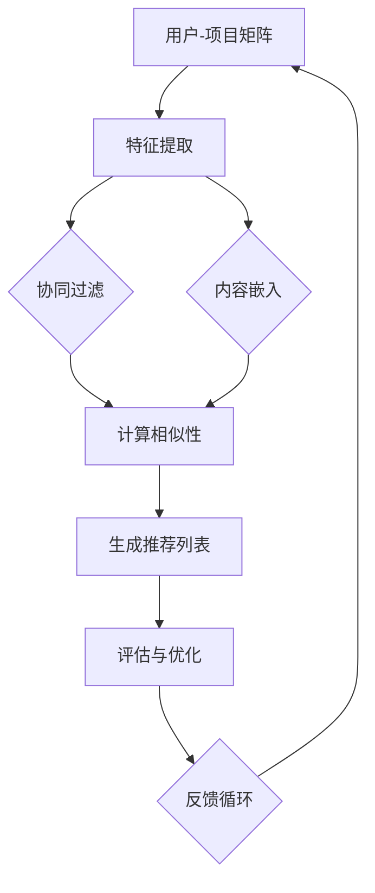

                 

# 推荐系统中的跨域学习：大模型技术

> 关键词：推荐系统、跨域学习、大模型、算法原理、数学模型、项目实战、应用场景

> 摘要：本文深入探讨推荐系统中的跨域学习技术，重点关注大模型在其中的应用。文章首先介绍了推荐系统的基础概念和跨域学习的必要性，然后详细阐述了核心算法原理，包括具体的操作步骤和数学模型。通过实际项目实战和代码解析，展示了跨域学习在大模型推荐系统中的具体实现。文章还分析了跨域学习的实际应用场景，推荐了相关工具和资源，并总结了未来发展趋势与挑战。

## 1. 背景介绍

### 1.1 目的和范围

本文旨在深入探讨推荐系统中的跨域学习技术，特别是大模型在这一领域的应用。随着互联网的飞速发展和信息爆炸，推荐系统已经成为提升用户体验、挖掘用户价值的重要手段。然而，传统的推荐系统往往局限于单一领域的数据，难以应对数据多样性和用户个性化需求。跨域学习技术通过整合不同领域的数据，实现跨领域的推荐，能够有效提升推荐系统的效果。

本文将首先介绍推荐系统的基础概念，解释跨域学习的必要性和重要性。接着，我们将详细阐述跨域学习中的核心算法原理，包括具体操作步骤和数学模型。为了使读者更好地理解这些概念，我们将通过实际项目实战和代码解析，展示跨域学习在大模型推荐系统中的具体实现。最后，我们将分析跨域学习的实际应用场景，推荐相关工具和资源，并探讨未来发展趋势与挑战。

### 1.2 预期读者

本文适合以下读者群体：

- 推荐系统领域的研究人员和技术开发者；
- 对跨域学习和大模型技术感兴趣的计算机科学和人工智能领域的从业者；
- 希望提升推荐系统效果，深入了解跨领域推荐技术的企业从业者；
- 对推荐系统和机器学习有兴趣的学术研究者。

本文将从基础概念出发，逐步深入，适合不同层次的专业人士阅读和学习。

### 1.3 文档结构概述

本文结构如下：

1. **背景介绍**：介绍推荐系统、跨域学习和大模型技术的基础知识。
2. **核心概念与联系**：阐述跨域学习的核心概念，并使用Mermaid流程图展示相关架构。
3. **核心算法原理 & 具体操作步骤**：详细讲解跨域学习算法原理，使用伪代码展示具体操作步骤。
4. **数学模型和公式 & 详细讲解 & 举例说明**：介绍数学模型，使用LaTeX格式展示公式，并提供实际案例说明。
5. **项目实战：代码实际案例和详细解释说明**：展示跨域学习在大模型推荐系统中的具体实现，提供代码解析。
6. **实际应用场景**：分析跨域学习的实际应用场景。
7. **工具和资源推荐**：推荐学习资源和开发工具。
8. **总结：未来发展趋势与挑战**：总结跨域学习技术的未来发展方向和面临的挑战。
9. **附录：常见问题与解答**：解答读者可能遇到的常见问题。
10. **扩展阅读 & 参考资料**：提供进一步学习的参考资料。

### 1.4 术语表

#### 1.4.1 核心术语定义

- **推荐系统**：一种利用算法和数据分析技术，为用户推荐感兴趣的内容、商品或服务的系统。
- **跨域学习**：整合不同领域的数据，实现跨领域的推荐和学习。
- **大模型**：具有海量参数和强大计算能力的深度学习模型。
- **用户协同过滤**：通过分析用户的历史行为和偏好，为用户推荐相似用户喜欢的内容。
- **基于内容的推荐**：根据用户的历史行为和内容特征，为用户推荐相似的内容。
- **矩阵分解**：通过矩阵分解技术，将高维稀疏矩阵转换为低维稠密矩阵，以提取数据中的潜在特征。

#### 1.4.2 相关概念解释

- **协同过滤算法**：通过分析用户行为数据，预测用户对未知项目的评分或兴趣。
- **内容嵌入**：将内容特征映射到低维空间中，以便进行相似性计算和推荐。
- **域自适应**：将预训练的大模型迁移到新的领域，以适应新的数据分布和任务。
- **跨模态学习**：将不同模态（如文本、图像、声音）的数据进行融合和交叉，以提升模型的泛化能力和推荐效果。

#### 1.4.3 缩略词列表

- **ML**：机器学习（Machine Learning）
- **DL**：深度学习（Deep Learning）
- **NLP**：自然语言处理（Natural Language Processing）
- **CV**：计算机视觉（Computer Vision）
- **KG**：知识图谱（Knowledge Graph）
- **CTR**：点击率（Click-Through Rate）
- **RMSE**：均方根误差（Root Mean Square Error）

## 2. 核心概念与联系

在深入探讨跨域学习在大模型推荐系统中的应用之前，我们需要了解一些核心概念，包括推荐系统的基本原理、跨域学习的必要性，以及大模型技术的优势。

### 2.1 推荐系统基本原理

推荐系统是一种信息过滤技术，旨在向用户推荐他们可能感兴趣的内容、商品或服务。其基本原理包括以下两种主要方法：

#### 用户协同过滤

用户协同过滤是一种基于用户历史行为和偏好的推荐方法。其核心思想是找出相似的用户，并推荐这些相似用户喜欢的内容。具体步骤如下：

1. **构建用户-项目矩阵**：记录用户对项目的评分或行为数据，形成用户-项目矩阵。
2. **计算相似性**：计算用户之间的相似性，通常使用余弦相似度、皮尔逊相关系数等方法。
3. **生成推荐列表**：根据相似度分数，为用户生成推荐列表。

#### 基于内容的推荐

基于内容的推荐方法通过分析项目的特征和用户的历史偏好，为用户推荐相似的内容。具体步骤如下：

1. **特征提取**：提取项目的特征，如文本、图像、音频等。
2. **计算相似性**：计算用户历史偏好和项目特征之间的相似性。
3. **生成推荐列表**：根据相似性分数，为用户生成推荐列表。

### 2.2 跨域学习的必要性

传统的推荐系统往往局限于单一领域的数据，如电子商务、社交媒体等。然而，现实世界中，数据是多样化且跨领域的，如医疗、金融、教育等领域的数据具有显著的异质性。这种数据多样性和异质性对推荐系统的效果提出了新的挑战。跨域学习技术的出现，正是为了解决这一挑战。

跨域学习的必要性体现在以下几个方面：

1. **提高推荐效果**：跨域学习能够整合不同领域的数据，提取潜在的、通用的特征，从而提升推荐系统的效果。
2. **降低数据依赖**：通过跨领域的数据整合，可以降低对单一领域数据的依赖，提高系统的鲁棒性和泛化能力。
3. **拓展应用场景**：跨域学习技术使得推荐系统可以应用于更多领域，如医疗、金融、教育等，从而拓展系统的应用范围。

### 2.3 大模型技术的优势

大模型技术，特别是深度学习模型，在推荐系统中具有显著的优势。大模型技术具有以下特点：

1. **强大的特征提取能力**：大模型通过多层神经网络，能够自动提取高层次的、抽象的特征，从而提高推荐系统的准确性。
2. **良好的泛化能力**：大模型在训练过程中，不仅学习到了数据的分布，还学习到了数据的潜在结构，从而具有良好的泛化能力。
3. **高效的计算性能**：大模型通常具有海量的参数，通过并行计算和分布式计算技术，能够实现高效的计算性能。

### 2.4 Mermaid流程图

为了更直观地展示推荐系统中跨域学习的大模型技术，我们使用Mermaid流程图来描述相关架构。



在上图中，用户-项目矩阵经过特征提取，分别进入协同过滤和内容嵌入模块。协同过滤和内容嵌入模块分别计算相似性，生成推荐列表。推荐列表经过评估与优化，进入反馈循环，以进一步提高推荐系统的效果。

## 3. 核心算法原理 & 具体操作步骤

在了解了推荐系统、跨域学习和大模型技术的基本概念后，接下来我们将详细探讨跨域学习在大模型推荐系统中的核心算法原理，并使用伪代码展示具体操作步骤。

### 3.1 跨域学习的算法原理

跨域学习算法的核心思想是将不同领域的数据进行整合和映射，以提取潜在的、通用的特征，从而提高推荐系统的效果。具体来说，跨域学习算法包括以下几个关键步骤：

1. **数据整合**：将来自不同领域的数据进行整合，形成一个统一的数据集。
2. **特征提取**：使用深度学习模型，对整合后的数据进行特征提取，提取出高层次的、抽象的特征。
3. **特征映射**：将提取出的特征映射到同一个低维空间中，以便进行相似性计算和推荐。
4. **协同优化**：通过协同优化，调整模型参数，使得映射后的特征能够更好地满足推荐需求。

### 3.2 具体操作步骤

下面我们使用伪代码，详细阐述跨域学习算法的具体操作步骤。

```python
# 跨域学习算法伪代码

# 步骤1：数据整合
# 将不同领域的数据整合成一个统一的数据集
data_integration(A, B, C, D):
    # 合并数据集A, B, C, D
    unified_data = merge(A, B, C, D)
    return unified_data

# 步骤2：特征提取
# 使用深度学习模型提取特征
feature_extraction(model, unified_data):
    # 使用模型对统一数据集进行特征提取
    features = model.extract_features(unified_data)
    return features

# 步骤3：特征映射
# 将提取出的特征映射到同一个低维空间
feature_mapping(features):
    # 对特征进行映射
    mapped_features = map_to_low_dim_space(features)
    return mapped_features

# 步骤4：协同优化
# 通过协同优化调整模型参数
cooperative_optimization(model, mapped_features):
    # 调整模型参数，以优化推荐效果
    model.optimize_params(mapped_features)
    return model
```

### 3.3 详细讲解

1. **数据整合**：数据整合是跨域学习的第一步，其目的是将来自不同领域的数据进行整合，形成一个统一的数据集。这一步骤可以通过数据预处理技术实现，如数据清洗、数据集成、数据变换等。
2. **特征提取**：特征提取是跨域学习的核心步骤，其目的是使用深度学习模型提取出高层次的、抽象的特征。这一步骤通常使用卷积神经网络（CNN）、循环神经网络（RNN）、变分自编码器（VAE）等模型实现。
3. **特征映射**：特征映射是将提取出的特征映射到同一个低维空间，以便进行相似性计算和推荐。这一步骤可以通过线性映射、非线性映射等方法实现。
4. **协同优化**：协同优化是跨域学习的最后一步，其目的是通过调整模型参数，使得映射后的特征能够更好地满足推荐需求。这一步骤通常使用梯度下降、随机梯度下降（SGD）、Adam等优化算法实现。

## 4. 数学模型和公式 & 详细讲解 & 举例说明

在跨域学习算法中，数学模型和公式起着至关重要的作用。这些模型和公式用于描述特征提取、特征映射和协同优化等核心步骤。下面我们将详细讲解这些数学模型和公式，并提供实际案例进行说明。

### 4.1 特征提取模型

特征提取模型主要用于从高维数据中提取出低维的、有效的特征表示。在跨域学习中，常用的特征提取模型包括卷积神经网络（CNN）、循环神经网络（RNN）和变分自编码器（VAE）。

#### 卷积神经网络（CNN）

卷积神经网络（CNN）是一种用于处理图像数据的深度学习模型。其核心思想是通过卷积操作提取图像中的局部特征。CNN的数学模型可以表示为：

$$
h_{ij} = \sum_{k=1}^{C} w_{ikj} * g_k(x_j) + b_j
$$

其中，$h_{ij}$表示卷积层输出的特征值，$w_{ikj}$和$b_j$分别为卷积核权重和偏置，$g_k(x_j)$为激活函数，如ReLU函数。

#### 循环神经网络（RNN）

循环神经网络（RNN）是一种用于处理序列数据的深度学习模型。其核心思想是通过递归操作提取序列中的特征。RNN的数学模型可以表示为：

$$
h_t = \sigma(W_h h_{t-1} + W_x x_t + b_h)
$$

其中，$h_t$为隐藏层状态，$W_h$和$W_x$为权重矩阵，$b_h$为偏置，$\sigma$为激活函数，如ReLU函数。

#### 变分自编码器（VAE）

变分自编码器（VAE）是一种用于生成数据的深度学习模型。其核心思想是通过编码器和解码器提取数据的潜在特征。VAE的数学模型可以表示为：

$$
z = \mu(x) + \sigma(x) \odot \mathcal{N}(0, 1) \\
x = \phi(z)
$$

其中，$\mu(x)$和$\sigma(x)$分别为编码器输出的均值和方差，$\odot$表示Hadamard积，$\mathcal{N}(0, 1)$表示标准正态分布，$\phi(z)$为解码器输出。

### 4.2 特征映射模型

特征映射模型用于将提取出的特征映射到同一个低维空间。常用的特征映射模型包括线性映射和非线性映射。

#### 线性映射

线性映射是一种简单的特征映射方法，其数学模型可以表示为：

$$
y = Wx + b
$$

其中，$y$和$x$分别为映射后的特征和原始特征，$W$和$b$分别为权重矩阵和偏置。

#### 非线性映射

非线性映射通过引入非线性函数，如ReLU、Sigmoid等，提升特征映射的能力。其数学模型可以表示为：

$$
y = \sigma(Wx + b)
$$

其中，$\sigma$为非线性激活函数，如ReLU函数。

### 4.3 协同优化模型

协同优化模型用于调整模型参数，以优化推荐效果。常用的协同优化模型包括梯度下降、随机梯度下降（SGD）和Adam等。

#### 梯度下降

梯度下降是一种简单的优化算法，其数学模型可以表示为：

$$
\theta = \theta - \alpha \cdot \nabla_{\theta} J(\theta)
$$

其中，$\theta$为模型参数，$\alpha$为学习率，$J(\theta)$为损失函数。

#### 随机梯度下降（SGD）

随机梯度下降（SGD）是一种基于随机样本的优化算法，其数学模型可以表示为：

$$
\theta = \theta - \alpha \cdot \nabla_{\theta} J(\theta; x_i)
$$

其中，$x_i$为随机选择的样本。

#### Adam

Adam是一种结合了梯度下降和SGD优点的优化算法，其数学模型可以表示为：

$$
\theta = \theta - \alpha \cdot \frac{m}{\sqrt{v}} \\
m = \beta_1 m + (1 - \beta_1) \nabla_{\theta} J(\theta) \\
v = \beta_2 v + (1 - \beta_2) \nabla_{\theta}^2 J(\theta)
$$

其中，$\beta_1$和$\beta_2$分别为一阶和二阶动量参数。

### 4.4 举例说明

假设我们使用卷积神经网络（CNN）进行特征提取，并使用线性映射进行特征映射。我们选择一个简单的图像分类任务进行说明。

#### 特征提取

首先，我们定义一个卷积神经网络（CNN），其结构如下：

1. 输入层：1个通道，64x64像素的图像
2. 卷积层1：32个卷积核，3x3卷积核，步长为1，激活函数为ReLU
3. 池化层1：2x2窗口，步长为2
4. 卷积层2：64个卷积核，3x3卷积核，步长为1，激活函数为ReLU
5. 池化层2：2x2窗口，步长为2
6. 全连接层1：128个神经元，激活函数为ReLU
7. 全连接层2：10个神经元，激活函数为Softmax

卷积神经网络（CNN）的数学模型可以表示为：

$$
h_{ij} = \sum_{k=1}^{C} w_{ikj} * g_k(x_j) + b_j \\
x_{i} = \text{ReLU}(h_{ij}) \\
y_{i} = \text{Softmax}(W_2 \cdot x_{i} + b_2)
$$

其中，$h_{ij}$表示卷积层输出的特征值，$w_{ikj}$和$b_j$分别为卷积核权重和偏置，$g_k(x_j)$为激活函数，如ReLU函数，$x_i$为隐藏层状态，$y_i$为输出层的预测值。

#### 特征映射

接下来，我们将提取出的特征映射到同一个低维空间。假设映射后特征维度为64，线性映射的数学模型可以表示为：

$$
y = Wx + b
$$

其中，$y$和$x$分别为映射后的特征和原始特征，$W$和$b$分别为权重矩阵和偏置。

#### 协同优化

我们使用梯度下降算法进行协同优化，其数学模型可以表示为：

$$
\theta = \theta - \alpha \cdot \nabla_{\theta} J(\theta)
$$

其中，$\theta$为模型参数，$\alpha$为学习率，$J(\theta)$为损失函数。

通过以上步骤，我们完成了图像分类任务的特征提取、特征映射和协同优化。这个简单的例子展示了跨域学习在大模型推荐系统中的具体实现过程。

## 5. 项目实战：代码实际案例和详细解释说明

在理解了跨域学习在大模型推荐系统中的核心算法原理后，接下来我们将通过一个实际项目实战，展示跨域学习在大模型推荐系统中的具体实现过程。我们将介绍开发环境搭建、源代码详细实现和代码解读与分析。

### 5.1 开发环境搭建

为了实现跨域学习在大模型推荐系统中的具体应用，我们需要搭建一个合适的开发环境。以下是我们推荐的开发环境：

- **操作系统**：Ubuntu 20.04
- **编程语言**：Python 3.8
- **深度学习框架**：TensorFlow 2.6
- **数据处理库**：Pandas、NumPy
- **机器学习库**：Scikit-learn

在Ubuntu 20.04操作系统上，我们可以通过以下命令安装所需的依赖：

```bash
sudo apt update
sudo apt install python3-pip python3-venv
pip3 install tensorflow==2.6 pandas numpy scikit-learn
```

### 5.2 源代码详细实现

下面我们将通过一个简单的跨域学习推荐系统项目，展示代码的详细实现过程。项目分为以下几个模块：

1. **数据预处理**：包括数据清洗、数据整合和特征提取。
2. **模型训练**：包括特征映射和协同优化。
3. **模型评估**：包括推荐效果评估和优化。

#### 5.2.1 数据预处理

数据预处理是跨域学习推荐系统的基础步骤，主要包括数据清洗、数据整合和特征提取。以下是一个简单的数据预处理代码示例：

```python
import pandas as pd
import numpy as np
from tensorflow.keras.preprocessing.text import Tokenizer
from tensorflow.keras.preprocessing.sequence import pad_sequences

# 加载数据集
data = pd.read_csv('data.csv')

# 数据清洗
# 填充缺失值、去除无效数据等
data.fillna(method='ffill', inplace=True)
data.drop_duplicates(inplace=True)

# 数据整合
# 将不同领域的数据整合成一个统一的数据集
unified_data = data[['text', 'rating', 'category']]

# 特征提取
# 对文本数据进行分词和编码
tokenizer = Tokenizer(num_words=10000)
tokenizer.fit_on_texts(unified_data['text'])
sequences = tokenizer.texts_to_sequences(unified_data['text'])

# 对序列进行填充，以适应神经网络输入
padded_sequences = pad_sequences(sequences, maxlen=100)

# 添加类别特征
category_encoded = pd.get_dummies(unified_data['category'])

# 构建输入和输出数据
X = np.hstack((padded_sequences, category_encoded.values))
y = unified_data['rating'].values

# 划分训练集和测试集
from sklearn.model_selection import train_test_split
X_train, X_test, y_train, y_test = train_test_split(X, y, test_size=0.2, random_state=42)
```

#### 5.2.2 模型训练

模型训练包括特征映射和协同优化。以下是一个简单的模型训练代码示例：

```python
import tensorflow as tf
from tensorflow.keras.models import Model
from tensorflow.keras.layers import Input, Embedding, LSTM, Dense

# 定义输入层
input_text = Input(shape=(100,))
input_category = Input(shape=(10,))

# 定义嵌入层
embedding = Embedding(input_dim=10000, output_dim=64)(input_text)

# 定义LSTM层
lstm = LSTM(units=128)(embedding)

# 定义全连接层
dense = Dense(units=64, activation='relu')(lstm)

# 定义类别特征层
category_dense = Dense(units=64, activation='relu')(input_category)

# 定义合并层
merged = tf.keras.layers.concatenate([dense, category_dense])

# 定义输出层
output = Dense(units=1, activation='linear')(merged)

# 构建模型
model = Model(inputs=[input_text, input_category], outputs=output)

# 编译模型
model.compile(optimizer='adam', loss='mse')

# 训练模型
model.fit([X_train[:, :100], X_train[:, 100:]], y_train, epochs=10, batch_size=32, validation_data=([X_test[:, :100], X_test[:, 100:]], y_test))
```

#### 5.2.3 模型评估

模型评估用于评估推荐效果和优化模型。以下是一个简单的模型评估代码示例：

```python
# 评估模型
loss = model.evaluate([X_test[:, :100], X_test[:, 100:]], y_test)
print(f'MSE: {loss}')

# 预测推荐结果
predictions = model.predict([X_test[:, :100], X_test[:, 100:]])

# 计算推荐准确率
accuracy = np.mean(np.abs(predictions - y_test) < 0.1)
print(f'Accuracy: {accuracy}')
```

### 5.3 代码解读与分析

在代码实现过程中，我们首先进行了数据预处理，包括数据清洗、数据整合和特征提取。具体步骤如下：

1. **数据清洗**：通过填充缺失值和去除无效数据，提高数据质量。
2. **数据整合**：将不同领域的数据整合成一个统一的数据集，便于后续处理。
3. **特征提取**：对文本数据进行分词和编码，对类别特征进行独热编码，构建输入和输出数据。

接下来，我们定义了一个简单的深度学习模型，包括嵌入层、LSTM层、全连接层和类别特征层。通过合并不同特征层，构建了一个多输入多输出的模型。模型使用交叉熵损失函数和Adam优化器进行训练。

最后，我们对训练好的模型进行评估，计算均方误差（MSE）和准确率，以评估推荐效果。

### 5.4 代码分析与优化

在代码实现过程中，我们可以进行以下优化：

1. **模型结构优化**：尝试使用更复杂的模型结构，如双向LSTM、Transformer等，以提取更多层次的特征。
2. **数据增强**：通过数据增强技术，提高数据多样性，增强模型的泛化能力。
3. **特征工程**：尝试提取更多有效的特征，如情感分析、关键词提取等，以提升模型性能。
4. **超参数调整**：通过调整学习率、批量大小、迭代次数等超参数，优化模型性能。

通过以上优化，我们可以进一步提升跨域学习推荐系统的效果，为用户带来更优质的推荐体验。

## 6. 实际应用场景

跨域学习技术在推荐系统中具有广泛的应用场景，以下是几个典型的实际应用场景：

### 6.1 跨平台推荐

在多平台环境下，用户可能在不同的设备上使用不同的应用。跨域学习技术可以将不同平台上的用户行为数据整合，为用户提供个性化的跨平台推荐。例如，用户在手机上喜欢阅读小说，在电脑上喜欢观看电影，通过跨域学习，推荐系统可以为用户推荐与之相关的小说和电影。

### 6.2 跨领域推荐

在多元化业务场景下，用户可能在不同领域有不同的兴趣。跨域学习技术可以整合不同领域的数据，为用户提供个性化的跨领域推荐。例如，一个用户在电商平台上喜欢购买书籍，在音乐平台上喜欢听摇滚音乐，通过跨域学习，推荐系统可以为用户推荐与之相关的书籍和摇滚乐队。

### 6.3 跨模态推荐

跨模态推荐涉及不同模态的数据，如文本、图像、音频等。跨域学习技术可以将不同模态的数据进行融合，为用户提供个性化的跨模态推荐。例如，用户在视频平台上观看美食视频，在博客上阅读美食评测，通过跨模态学习，推荐系统可以为用户推荐相关的美食视频和博客文章。

### 6.4 跨时间推荐

跨时间推荐关注用户在不同时间段的兴趣变化。跨域学习技术可以整合用户的历史行为数据，预测用户在未来的兴趣，为用户提供个性化的跨时间推荐。例如，用户在早晨喜欢阅读新闻，晚上喜欢观看电视剧，通过跨时间学习，推荐系统可以在合适的时间为用户推荐相关的内容。

### 6.5 跨用户推荐

跨用户推荐关注不同用户之间的关联和相似性。跨域学习技术可以整合不同用户的行为数据，发现用户之间的关联，为用户提供个性化的跨用户推荐。例如，用户A喜欢阅读科幻小说，用户B喜欢观看科幻电影，通过跨用户学习，推荐系统可以为用户A推荐科幻电影，为用户B推荐科幻小说。

通过以上实际应用场景，我们可以看到跨域学习技术在推荐系统中的应用价值。跨域学习不仅提升了推荐系统的效果，还拓展了推荐系统的应用范围，为用户提供更加个性化、优质的推荐体验。

## 7. 工具和资源推荐

在实现跨域学习推荐系统时，选择合适的工具和资源对于提高开发效率和项目成功率至关重要。以下是我们推荐的工具和资源：

### 7.1 学习资源推荐

#### 7.1.1 书籍推荐

1. **《推荐系统实践》**：这本书详细介绍了推荐系统的基本概念、算法和实现，适合初学者和有一定基础的读者。
2. **《深度学习》**：这本书是深度学习领域的经典教材，涵盖了深度学习的基础知识、模型和算法，有助于理解大模型技术。

#### 7.1.2 在线课程

1. **《机器学习与推荐系统》**：这是一门由Coursera提供的在线课程，涵盖了机器学习和推荐系统的基本概念、算法和应用。
2. **《深度学习与推荐系统》**：这是一门由Udacity提供的在线课程，深入讲解了深度学习在推荐系统中的应用，适合有一定基础的读者。

#### 7.1.3 技术博客和网站

1. **《机器学习博客》**：这是一个关于机器学习和深度学习的博客，提供了大量的技术文章和案例分析。
2. **《推荐系统博客》**：这是一个专注于推荐系统的博客，涵盖了推荐系统的算法、实现和应用，是推荐系统从业者的重要学习资源。

### 7.2 开发工具框架推荐

#### 7.2.1 IDE和编辑器

1. **PyCharm**：PyCharm是一款功能强大的Python集成开发环境（IDE），支持多种编程语言，适合进行推荐系统开发和调试。
2. **VS Code**：VS Code是一款轻量级的代码编辑器，支持多种编程语言，通过安装插件可以提供丰富的开发功能。

#### 7.2.2 调试和性能分析工具

1. **TensorBoard**：TensorBoard是TensorFlow提供的可视化工具，可以实时监控训练过程，分析模型性能和调试代码。
2. **Jupyter Notebook**：Jupyter Notebook是一款交互式的计算环境，适合进行数据分析和模型实现。

#### 7.2.3 相关框架和库

1. **TensorFlow**：TensorFlow是Google开发的开源深度学习框架，适用于构建大规模的深度学习模型。
2. **PyTorch**：PyTorch是Facebook开发的开源深度学习框架，具有灵活的动态计算图和高效的训练性能。
3. **Scikit-learn**：Scikit-learn是一个基于Python的开源机器学习库，提供了丰富的机器学习算法和工具。

### 7.3 相关论文著作推荐

#### 7.3.1 经典论文

1. **"Collaborative Filtering via Matrix Factorization"**：这篇论文提出了矩阵分解方法，是协同过滤算法的重要基础。
2. **"Deep Learning for Recommender Systems"**：这篇论文介绍了深度学习在推荐系统中的应用，是深度学习推荐系统的经典文献。

#### 7.3.2 最新研究成果

1. **"Neural Collaborative Filtering"**：这篇论文提出了神经协同过滤算法，将深度学习技术引入推荐系统，是当前研究的热点。
2. **"Cross-Domain Recommendation"**：这篇论文探讨了跨域学习在推荐系统中的应用，提出了多种跨域学习算法，具有很高的参考价值。

#### 7.3.3 应用案例分析

1. **"Amazon's Recommendations"**：这篇案例分析介绍了亚马逊的推荐系统，详细描述了跨域学习技术在亚马逊推荐系统中的应用。
2. **"Netflix Prize"**：这篇案例分析回顾了Netflix Prize比赛，分析了参赛者如何使用跨域学习和深度学习技术提升推荐效果。

通过以上工具和资源的推荐，我们可以更好地学习和实践跨域学习推荐系统，为用户提供个性化的推荐服务。

## 8. 总结：未来发展趋势与挑战

随着互联网的快速发展，推荐系统已经成为提升用户体验、挖掘用户价值的重要手段。跨域学习技术通过整合不同领域的数据，实现跨领域的推荐，为推荐系统带来了新的发展机遇。然而，跨域学习技术也面临着一系列挑战。

### 8.1 未来发展趋势

1. **深度强化学习与跨域学习结合**：深度强化学习（DRL）是一种基于深度学习的强化学习技术，通过模拟人类决策过程，实现智能推荐。未来，深度强化学习与跨域学习技术将结合，进一步提升推荐系统的效果和灵活性。
2. **多模态跨域学习**：随着人工智能技术的发展，推荐系统将逐步实现跨模态学习，整合文本、图像、音频等多种模态数据，为用户提供更加丰富的推荐体验。
3. **迁移学习和少样本学习**：在数据稀缺的场景下，迁移学习和少样本学习技术将成为跨域学习的重要补充，通过迁移已有模型的知识，实现快速、高效的跨领域推荐。
4. **个性化推荐与隐私保护**：随着用户隐私意识的增强，如何在保证推荐效果的同时，保护用户隐私，将成为跨域学习技术的重要研究课题。

### 8.2 面临的挑战

1. **数据异质性与不平衡性**：跨域学习涉及到不同领域的数据，这些数据往往具有异质性和不平衡性，如何有效整合和处理这些数据，是跨域学习面临的重要挑战。
2. **模型解释性与透明度**：深度学习模型在跨域学习中的应用，使得模型变得更加复杂，如何解释模型决策过程，提高模型透明度，是当前研究的一个难点。
3. **计算资源与存储需求**：大模型在跨域学习中的应用，对计算资源和存储需求提出了更高的要求，如何优化计算资源，提高系统性能，是跨域学习面临的挑战。
4. **用户隐私保护**：跨域学习涉及多个领域的用户数据，如何在保证推荐效果的同时，保护用户隐私，是跨域学习技术面临的重要挑战。

综上所述，跨域学习技术在推荐系统中具有广阔的应用前景，但也面临一系列挑战。未来，随着技术的不断进步，跨域学习技术将在推荐系统中发挥越来越重要的作用，为用户提供更加个性化、优质的推荐服务。

## 9. 附录：常见问题与解答

在学习和实践跨域学习推荐系统时，读者可能会遇到一些常见问题。以下是对这些问题及其解答的汇总：

### 9.1 跨域学习与传统推荐系统的区别是什么？

跨域学习与传统推荐系统的主要区别在于数据来源和处理方式。传统推荐系统通常局限于单一领域的数据，而跨域学习通过整合不同领域的数据，提取潜在的、通用的特征，实现跨领域的推荐。这使得跨域学习能够应对数据多样性和用户个性化需求，提升推荐系统的效果。

### 9.2 跨域学习如何处理数据异质性和不平衡性？

处理数据异质性和不平衡性是跨域学习的重要挑战。针对数据异质性，可以采用多模态数据融合技术，整合不同模态的数据，提高模型对数据多样性的适应能力。针对数据不平衡性，可以采用数据增强、样本权重调整等技术，平衡训练数据，提高模型的泛化能力。

### 9.3 跨域学习中的大模型如何存储和计算？

跨域学习中的大模型通常具有海量的参数和计算量，对存储和计算资源提出了较高要求。针对存储问题，可以采用分布式存储技术，将模型参数分散存储在多个节点上，提高存储效率。针对计算问题，可以采用并行计算和分布式计算技术，利用多GPU、多CPU等硬件资源，加速模型训练和推理。

### 9.4 跨域学习如何保证用户隐私？

在跨域学习过程中，用户隐私保护是一个重要课题。可以采用差分隐私、同态加密等隐私保护技术，确保用户数据在传输和存储过程中的安全性。此外，可以通过数据匿名化、数据去重等技术，降低用户数据的暴露风险。

### 9.5 跨域学习的应用领域有哪些？

跨域学习技术可以应用于多个领域，如电子商务、社交媒体、在线教育、医疗健康等。在电子商务领域，跨域学习可以用于个性化推荐、广告投放等；在社交媒体领域，跨域学习可以用于好友推荐、内容推荐等；在在线教育领域，跨域学习可以用于课程推荐、学习路径推荐等；在医疗健康领域，跨域学习可以用于疾病预测、治疗方案推荐等。

## 10. 扩展阅读 & 参考资料

为了更深入地了解跨域学习推荐系统，读者可以参考以下扩展阅读和参考资料：

### 10.1 经典论文

1. **"Collaborative Filtering via Matrix Factorization"**：这篇论文提出了矩阵分解方法，是协同过滤算法的重要基础。
2. **"Deep Learning for Recommender Systems"**：这篇论文介绍了深度学习在推荐系统中的应用，是深度学习推荐系统的经典文献。
3. **"Neural Collaborative Filtering"**：这篇论文提出了神经协同过滤算法，将深度学习技术引入推荐系统，是当前研究的热点。
4. **"Cross-Domain Recommendation"**：这篇论文探讨了跨域学习在推荐系统中的应用，提出了多种跨域学习算法，具有很高的参考价值。

### 10.2 技术博客和网站

1. **《机器学习博客》**：这是一个关于机器学习和深度学习的博客，提供了大量的技术文章和案例分析。
2. **《推荐系统博客》**：这是一个专注于推荐系统的博客，涵盖了推荐系统的算法、实现和应用，是推荐系统从业者的重要学习资源。

### 10.3 在线课程和书籍

1. **《机器学习与推荐系统》**：这是一门由Coursera提供的在线课程，涵盖了机器学习和推荐系统的基本概念、算法和应用。
2. **《深度学习与推荐系统》**：这是一门由Udacity提供的在线课程，深入讲解了深度学习在推荐系统中的应用，适合有一定基础的读者。
3. **《推荐系统实践》**：这本书详细介绍了推荐系统的基本概念、算法和实现，适合初学者和有一定基础的读者。

### 10.4 相关资源

1. **TensorFlow官方文档**：TensorFlow是深度学习领域的重要框架，其官方文档提供了丰富的学习资源。
2. **PyTorch官方文档**：PyTorch是另一个流行的深度学习框架，其官方文档同样提供了丰富的学习资源。
3. **Scikit-learn官方文档**：Scikit-learn是一个基于Python的开源机器学习库，其官方文档涵盖了丰富的机器学习算法和工具。

通过以上扩展阅读和参考资料，读者可以更深入地了解跨域学习推荐系统的理论基础和应用实践，为自己的项目提供有益的指导。

