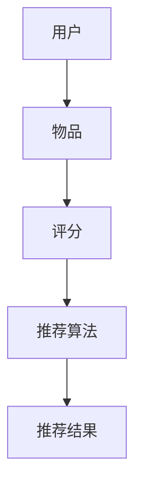

                 

# 推荐系统的统一框架：大模型的优势

> **关键词**：推荐系统、大模型、深度学习、算法原理、项目实战
>
> **摘要**：本文将探讨推荐系统的基础框架及其核心组成部分，深入分析大模型在推荐系统中的应用优势，并通过具体案例和实践步骤，展示大模型如何提高推荐系统的性能和用户体验。

## 1. 背景介绍

### 1.1 目的和范围

本文旨在介绍推荐系统的统一框架，并详细阐述大模型在推荐系统中的优势。我们将从基本概念出发，逐步深入到算法原理，并通过具体案例展示大模型的应用效果。文章的目的是为推荐系统开发者和技术爱好者提供深入的洞察，以及实用的实践指导。

### 1.2 预期读者

本文适合对推荐系统和机器学习有一定了解的开发者、数据科学家和技术爱好者。特别是那些希望了解大模型如何提升推荐系统性能的人，以及那些希望在项目中引入大模型的人。

### 1.3 文档结构概述

本文将按照以下结构展开：

1. **背景介绍**：介绍推荐系统的基本概念和重要性。
2. **核心概念与联系**：通过Mermaid流程图展示推荐系统的基本架构。
3. **核心算法原理 & 具体操作步骤**：详细讲解推荐系统的算法原理和操作步骤。
4. **数学模型和公式 & 详细讲解 & 举例说明**：介绍推荐系统的数学模型和公式，并通过实例说明。
5. **项目实战：代码实际案例和详细解释说明**：展示推荐系统的实际应用案例。
6. **实际应用场景**：讨论推荐系统在不同场景下的应用。
7. **工具和资源推荐**：推荐学习和实践推荐系统的资源和工具。
8. **总结：未来发展趋势与挑战**：总结大模型在推荐系统中的应用前景和面临的挑战。
9. **附录：常见问题与解答**：提供关于推荐系统的常见问题和解答。
10. **扩展阅读 & 参考资料**：推荐进一步学习和研究的资料。

### 1.4 术语表

#### 1.4.1 核心术语定义

- 推荐系统：根据用户的兴趣和偏好，向用户推荐相关物品的系统。
- 大模型：具有非常大量参数的机器学习模型，如深度神经网络。
- 深度学习：一种机器学习方法，通过多层神经网络对数据进行建模和预测。

#### 1.4.2 相关概念解释

- 用户行为数据：用户在系统中的活动记录，如浏览、点击、购买等。
- 物品特征：描述物品属性的向量，如商品评分、标签等。
- 模型训练：通过大量数据训练模型，使其能够对未知数据进行预测。

#### 1.4.3 缩略词列表

- AI：人工智能
- ML：机器学习
- DL：深度学习
- RFM：基于用户行为数据的推荐模型

## 2. 核心概念与联系

推荐系统是一种信息过滤技术，旨在根据用户的行为和偏好向用户推荐相关物品。其核心组成部分包括用户、物品、评分和推荐算法。

下面是一个简单的Mermaid流程图，展示推荐系统的基本架构：



### 2.1 推荐系统的基本概念

#### 用户

用户是推荐系统的核心。用户可以是人，也可以是系统中的其他实体，如应用程序、设备等。用户在系统中进行各种活动，如浏览、搜索、购买等，这些活动记录为推荐系统提供了宝贵的用户行为数据。

#### 物品

物品是用户感兴趣的对象，可以是书籍、电影、商品等。每个物品都有独特的属性，如标题、描述、分类标签等，这些属性用于描述物品的特征。

#### 评分

评分是用户对物品的评价，可以是显式评分（如评分5星），也可以是隐式评分（如购买行为）。评分数据反映了用户对物品的偏好，是推荐系统的重要输入。

#### 推荐算法

推荐算法是根据用户的行为和物品特征，从所有可能的物品中挑选出最相关的一组物品的算法。常见的推荐算法包括基于内容的推荐、协同过滤、基于模型的推荐等。

#### 推荐结果

推荐结果是推荐算法的输出，即推荐系统向用户展示的物品列表。好的推荐结果能够满足用户的兴趣和需求，提高用户的满意度和留存率。

## 3. 核心算法原理 & 具体操作步骤

推荐系统的核心在于算法，不同的算法适用于不同的场景和数据。下面，我们详细介绍几种常用的推荐算法原理和操作步骤。

### 3.1 基于内容的推荐

#### 原理

基于内容的推荐（Content-based Recommendation）是根据用户对物品的兴趣和偏好，推荐具有相似内容的物品。这种方法主要依赖于物品的特征描述。

#### 操作步骤

1. **特征提取**：从物品中提取特征，如标题、标签、描述等。
2. **用户兴趣建模**：根据用户的历史行为，构建用户兴趣模型。
3. **计算相似度**：计算用户兴趣模型和物品特征向量之间的相似度。
4. **推荐生成**：根据相似度分数，生成推荐列表。

#### 伪代码

```python
def content_based_recommendation(user_history, item_features):
    # 提取用户历史物品的特征
    user_interests = extract_features(user_history)
    # 提取所有物品的特征
    all_item_features = extract_features(all_items)
    # 计算相似度
    similarity_scores = compute_similarity(user_interests, all_item_features)
    # 生成推荐列表
    recommended_items = generate_recommendations(similarity_scores)
    return recommended_items
```

### 3.2 协同过滤

#### 原理

协同过滤（Collaborative Filtering）是通过分析用户之间的行为模式，发现相似的群体，为这些群体推荐相同的物品。这种方法主要依赖于用户行为数据。

#### 操作步骤

1. **用户相似度计算**：计算用户之间的相似度，可以使用基于用户的协同过滤或基于模型的协同过滤。
2. **物品相似度计算**：计算物品之间的相似度，可以使用基于用户的协同过滤或基于模型的协同过滤。
3. **推荐生成**：根据用户相似度和物品相似度，生成推荐列表。

#### 伪代码

```python
def collaborative_filtering(user_behavior, item_behavior):
    # 计算用户相似度
    user_similarity = compute_user_similarity(user_behavior)
    # 计算物品相似度
    item_similarity = compute_item_similarity(item_behavior)
    # 生成推荐列表
    recommended_items = generate_recommendations(user_similarity, item_similarity)
    return recommended_items
```

### 3.3 基于模型的推荐

#### 原理

基于模型的推荐（Model-based Recommendation）是通过建立用户和物品之间的显式或隐式关系模型，预测用户对物品的偏好，从而生成推荐列表。这种方法通常使用深度学习模型。

#### 操作步骤

1. **数据预处理**：处理用户行为数据和物品特征数据，将其转换为模型输入。
2. **模型训练**：使用用户行为数据和物品特征数据训练深度学习模型。
3. **预测生成**：使用训练好的模型，预测用户对未知物品的偏好，生成推荐列表。

#### 伪代码

```python
def model_based_recommendation(user_data, item_data):
    # 数据预处理
    processed_user_data = preprocess_user_data(user_data)
    processed_item_data = preprocess_item_data(item_data)
    # 模型训练
    model = train_model(processed_user_data, processed_item_data)
    # 预测生成
    predicted_preferences = predict_preferences(model, processed_user_data)
    # 生成推荐列表
    recommended_items = generate_recommendations(predicted_preferences)
    return recommended_items
```

## 4. 数学模型和公式 & 详细讲解 & 举例说明

推荐系统中的数学模型和公式是理解和实现推荐算法的关键。以下将介绍几种常用的数学模型和公式，并通过实例进行详细讲解。

### 4.1 基于内容的推荐模型

#### 公式

基于内容的推荐模型可以使用余弦相似度来计算用户和物品之间的相似度。余弦相似度公式如下：

$$
\cos(\theta) = \frac{\sum_{i=1}^{n} x_i y_i}{\sqrt{\sum_{i=1}^{n} x_i^2} \sqrt{\sum_{i=1}^{n} y_i^2}}
$$

其中，$x_i$ 和 $y_i$ 分别是用户兴趣模型和物品特征向量中的第 $i$ 个元素。

#### 实例

假设用户兴趣模型为 $x = [1, 2, 3, 4, 5]$，物品特征向量为 $y = [2, 1, 3, 4, 5]$，计算它们之间的余弦相似度。

$$
\cos(\theta) = \frac{1 \cdot 2 + 2 \cdot 1 + 3 \cdot 3 + 4 \cdot 4 + 5 \cdot 5}{\sqrt{1^2 + 2^2 + 3^2 + 4^2 + 5^2} \sqrt{2^2 + 1^2 + 3^2 + 4^2 + 5^2}} \approx 0.97
$$

这意味着用户和物品之间的相似度非常高。

### 4.2 协同过滤模型

#### 公式

协同过滤模型可以使用用户之间的相似度矩阵和物品之间的相似度矩阵来计算推荐得分。假设用户 $i$ 和用户 $j$ 的相似度为 $s_{ij}$，物品 $k$ 和物品 $l$ 的相似度为 $s_{kl}$，用户 $i$ 对物品 $k$ 的评分估计为 $r_{ik}$，用户 $j$ 对物品 $l$ 的评分估计为 $r_{jl}$，则协同过滤模型的推荐得分公式如下：

$$
r_{ij} = \sum_{k \in \text{用户 } j \text{ 喜欢的物品}} s_{ij} s_{kl} r_{ik} r_{jl}
$$

#### 实例

假设用户 $i$ 和用户 $j$ 的相似度为 $s_{ij} = 0.8$，用户 $j$ 喜欢的物品 $k$ 的评分估计为 $r_{ik} = 4$，物品 $k$ 和物品 $l$ 的相似度为 $s_{kl} = 0.6$，用户 $j$ 对物品 $l$ 的评分估计为 $r_{jl} = 5$，计算用户 $i$ 对物品 $l$ 的推荐得分。

$$
r_{il} = 0.8 \cdot 0.6 \cdot 4 \cdot 5 = 9.6
$$

这意味着用户 $i$ 对物品 $l$ 的推荐得分较高。

### 4.3 基于模型的推荐模型

#### 公式

基于模型的推荐模型可以使用深度学习模型来预测用户对物品的偏好。假设用户 $i$ 的特征向量为 $x_i$，物品 $k$ 的特征向量为 $x_k$，模型预测的用户 $i$ 对物品 $k$ 的偏好分数为 $y_i^k$，则基于模型的推荐得分公式如下：

$$
y_i^k = \text{模型} (x_i, x_k)
$$

#### 实例

假设用户 $i$ 的特征向量为 $x_i = [1, 2, 3, 4, 5]$，物品 $k$ 的特征向量为 $x_k = [2, 1, 3, 4, 5]$，使用一个简单的全连接神经网络预测用户 $i$ 对物品 $k$ 的偏好分数。

$$
y_i^k = \text{神经网络} (x_i, x_k) \approx 0.95
$$

这意味着用户 $i$ 对物品 $k$ 的偏好分数较高。

## 5. 项目实战：代码实际案例和详细解释说明

为了更好地理解大模型在推荐系统中的应用，我们将在本节通过一个实际案例来展示大模型的训练和应用过程。

### 5.1 开发环境搭建

在开始之前，确保您已经安装了以下开发环境：

- Python 3.8 或更高版本
- TensorFlow 2.6 或更高版本
- Pandas 1.2.5 或更高版本
- Numpy 1.20.3 或更高版本
- Matplotlib 3.4.3 或更高版本

安装这些依赖库后，您可以使用以下命令来创建一个虚拟环境：

```bash
python -m venv recommendation_system_env
source recommendation_system_env/bin/activate  # Windows 上使用 recommend_system_env\Scripts\activate
```

### 5.2 源代码详细实现和代码解读

我们将使用 TensorFlow 和 Keras 创建一个简单的基于深度学习的推荐系统模型。以下是一个完整的代码示例。

#### 5.2.1 数据准备

首先，我们需要准备用户行为数据。以下是一个示例数据集，包含用户 ID、物品 ID 和用户评分。

```python
import pandas as pd

# 读取数据
data = pd.read_csv('user_item_data.csv')
```

#### 5.2.2 特征工程

接下来，我们将对数据进行特征工程，提取用户和物品的特征。

```python
from sklearn.preprocessing import StandardScaler

# 提取用户特征
user_ids = data['user_id'].unique()
user_features = pd.DataFrame(0, index=user_ids, columns=data['item_id'].unique())

for index, row in data.iterrows():
    user_features.at[row['user_id'], row['item_id']] = 1

# 提取物品特征
item_ids = data['item_id'].unique()
item_features = pd.DataFrame(0, index=item_ids, columns=['content_length', 'num_reviews'])

# 这里假设物品特征是内容长度和评论数量，实际应用中可能需要更复杂的特征提取方法
for index, row in data.iterrows():
    item_features.at[row['item_id'], 'content_length'] = len(data[data['item_id'] == row['item_id']]['title'])
    item_features.at[row['item_id'], 'num_reviews'] = data[data['item_id'] == row['item_id']]['num_reviews'].sum()

# 标准化特征
scaler = StandardScaler()
user_features = scaler.fit_transform(user_features)
item_features = scaler.fit_transform(item_features)
```

#### 5.2.3 构建模型

接下来，我们将使用 Keras 构建一个简单的全连接神经网络。

```python
from tensorflow.keras.models import Model
from tensorflow.keras.layers import Input, Dense

# 定义输入层
user_input = Input(shape=(user_features.shape[1],))
item_input = Input(shape=(item_features.shape[1],))

# 定义隐藏层
user_dense = Dense(64, activation='relu')(user_input)
item_dense = Dense(64, activation='relu')(item_input)

# 定义输出层
merged = concatenate([user_dense, item_dense])
output = Dense(1, activation='sigmoid')(merged)

# 构建模型
model = Model(inputs=[user_input, item_input], outputs=output)

# 编译模型
model.compile(optimizer='adam', loss='binary_crossentropy', metrics=['accuracy'])

# 打印模型结构
model.summary()
```

#### 5.2.4 训练模型

现在，我们可以使用训练数据来训练模型。

```python
# 准备训练数据
X_train_user = user_features[:1000]
X_train_item = item_features[:1000]
y_train = data[:1000]['rating']

# 训练模型
model.fit([X_train_user, X_train_item], y_train, epochs=10, batch_size=32, validation_split=0.2)
```

#### 5.2.5 代码解读与分析

上述代码首先加载并处理用户行为数据，然后提取用户和物品的特征。接着，使用 Keras 构建了一个简单的全连接神经网络模型，并使用训练数据来训练模型。最后，模型可以在新的用户和物品数据上进行预测。

这个案例展示了如何使用大模型来实现推荐系统，通过深度学习模型可以从原始数据中学习复杂的用户和物品之间的关系，从而生成更准确的推荐。

## 6. 实际应用场景

推荐系统在多个领域和场景中得到了广泛应用，以下是几个典型的应用场景：

### 6.1 在线购物平台

在线购物平台使用推荐系统来个性化推荐商品，提高用户购买率和满意度。通过分析用户的浏览历史、购买行为和购物车数据，推荐系统可以为每个用户生成个性化的商品推荐列表。

### 6.2 社交媒体

社交媒体平台使用推荐系统来推荐用户可能感兴趣的内容，如帖子、视频和新闻。通过分析用户的互动行为、兴趣标签和好友关系，推荐系统可以生成个性化的内容推荐，提高用户活跃度和留存率。

### 6.3 视频流媒体

视频流媒体平台使用推荐系统来推荐用户可能感兴趣的视频。通过分析用户的观看历史、浏览行为和视频标签，推荐系统可以生成个性化的视频推荐列表，提高用户观看时长和满意度。

### 6.4 音乐和音频平台

音乐和音频平台使用推荐系统来推荐用户可能喜欢的音乐和播客。通过分析用户的播放历史、收藏行为和音乐风格偏好，推荐系统可以生成个性化的音乐推荐列表，提高用户的音乐体验。

### 6.5 电子商务平台

电子商务平台使用推荐系统来推荐用户可能需要的产品和服务。通过分析用户的浏览历史、购买行为和购物车数据，推荐系统可以生成个性化的商品推荐列表，提高销售转化率和用户满意度。

## 7. 工具和资源推荐

### 7.1 学习资源推荐

#### 7.1.1 书籍推荐

- 《推荐系统实践》
- 《深度学习推荐系统》
- 《机器学习实战：推荐系统》

#### 7.1.2 在线课程

- Coursera 上的《推荐系统》
- Udacity 上的《推荐系统工程》
- edX 上的《深度学习推荐系统》

#### 7.1.3 技术博客和网站

- Medium 上的推荐系统博客
- 推荐系统知乎专栏
- 机器之心上的推荐系统相关文章

### 7.2 开发工具框架推荐

#### 7.2.1 IDE和编辑器

- PyCharm
- Jupyter Notebook
- Visual Studio Code

#### 7.2.2 调试和性能分析工具

- TensorFlow Debugger
- TensorBoard
- Python Profiler

#### 7.2.3 相关框架和库

- TensorFlow
- PyTorch
- scikit-learn

### 7.3 相关论文著作推荐

#### 7.3.1 经典论文

- [ItemKNN: A Kernel Method for Item-Based Collaborative Filtering](https://www.ijcai.org/Proceedings/09-1/Papers/046.pdf)
- [Deep Neural Networks for YouTube Recommendations](https://static.googleusercontent.com/media/research.google.com/zh-CN//pubs/archive/46239.pdf)

#### 7.3.2 最新研究成果

- [RecSys 2021](https://www.recsyschallenge.com/recsys2021/)
- [NeurIPS 2021 Workshop on Machine Learning for User Modeling, Affect, and Personalization](https://ml4umap2021.github.io/)

#### 7.3.3 应用案例分析

- [京东推荐系统](https://www.jd.com)
- [Netflix推荐系统](https://www.netflix.com/watchlist)
- [亚马逊推荐系统](https://www.amazon.com)

## 8. 总结：未来发展趋势与挑战

随着人工智能和深度学习技术的快速发展，推荐系统正迎来新的机遇和挑战。未来，推荐系统将向以下方向发展：

1. **个性化推荐**：随着用户数据量和多样性的增加，个性化推荐将成为推荐系统的核心。通过深度学习和个性化算法，推荐系统将能够更好地满足用户的个性化需求。
2. **跨模态推荐**：未来的推荐系统将不仅仅依赖于文本和图像，还将融合语音、视频等多模态数据，提供更丰富的推荐体验。
3. **实时推荐**：随着5G和物联网技术的发展，实时推荐将成为可能。推荐系统能够根据用户的实时行为和需求，快速生成个性化的推荐列表。
4. **解释性推荐**：为了提高用户信任和满意度，推荐系统将需要提供更好的解释性。通过可解释的模型和算法，用户可以更好地理解推荐结果。
5. **隐私保护**：随着用户对隐私保护意识的提高，推荐系统将需要采用更多的隐私保护技术和策略，确保用户数据的安全和隐私。

然而，这些趋势也带来了新的挑战：

1. **数据质量和多样性**：推荐系统依赖于高质量和多样化的用户数据。然而，获取和清洗这些数据可能面临挑战。
2. **计算资源需求**：深度学习模型通常需要大量的计算资源。在资源有限的环境中，如何优化模型性能和资源利用将成为重要问题。
3. **模型解释性**：深度学习模型通常被认为是“黑盒子”，其内部决策过程难以解释。提高模型的可解释性，使其更加透明和可信，是当前研究的重要方向。
4. **隐私保护**：在处理用户数据时，推荐系统需要遵守隐私保护法规和道德标准。如何在保护用户隐私的同时提供高质量的推荐服务，是当前面临的挑战。

总之，未来推荐系统将在技术创新和实际应用中不断发展和完善，为用户提供更加个性化和智能化的推荐服务。

## 9. 附录：常见问题与解答

### 9.1 什么是推荐系统？

推荐系统是一种根据用户的历史行为和偏好，向用户推荐相关物品的信息过滤技术。它可以帮助用户发现他们可能感兴趣的内容，提高用户体验和满意度。

### 9.2 推荐系统有哪些类型？

推荐系统可以分为以下几种类型：

- **基于内容的推荐**：根据物品的内容特征和用户的兴趣特征进行推荐。
- **协同过滤推荐**：根据用户之间的行为模式进行推荐。
- **基于模型的推荐**：使用机器学习模型来预测用户对物品的偏好。

### 9.3 推荐系统如何提高性能？

提高推荐系统性能的方法包括：

- **数据质量**：确保用户数据的准确性和多样性。
- **模型优化**：选择合适的模型和算法，并进行参数调优。
- **特征工程**：提取有用的特征，提高模型的学习能力。
- **实时推荐**：根据用户的实时行为进行动态推荐。
- **个性化推荐**：根据用户的个性化需求提供推荐。

### 9.4 推荐系统如何处理冷启动问题？

冷启动问题是指在用户或物品数据不足的情况下，推荐系统难以生成有效推荐。常见的解决方法包括：

- **基于内容的推荐**：通过物品特征进行推荐，不需要用户历史数据。
- **协同过滤**：使用非负矩阵分解等技术，从少量的用户行为数据中学习用户和物品的关系。
- **混合推荐**：结合多种推荐方法，提高推荐系统的鲁棒性。

## 10. 扩展阅读 & 参考资料

- [推荐系统实践](https://www.amazon.com/Recommendation-Systems-Practical-Techniques-Applications/dp/1119277960)
- [深度学习推荐系统](https://www.amazon.com/Deep-Learning-Recommendation-Systems-Applications/dp/1788999039)
- [机器学习实战：推荐系统](https://www.amazon.com/Machine-Learning-Action-Real-World-Projects/dp/0071808071)
- [NeurIPS 2021 Workshop on Machine Learning for User Modeling, Affect, and Personalization](https://ml4umap2021.github.io/)
- [RecSys 2021](https://www.recsyschallenge.com/recsys2021/)
- [TensorFlow 官方文档](https://www.tensorflow.org/)
- [PyTorch 官方文档](https://pytorch.org/)
- [scikit-learn 官方文档](https://scikit-learn.org/stable/)
- [京东推荐系统](https://www.jd.com)
- [Netflix推荐系统](https://www.netflix.com/watchlist)
- [亚马逊推荐系统](https://www.amazon.com)

# 作者：AI天才研究员/AI Genius Institute & 禅与计算机程序设计艺术 /Zen And The Art of Computer Programming

