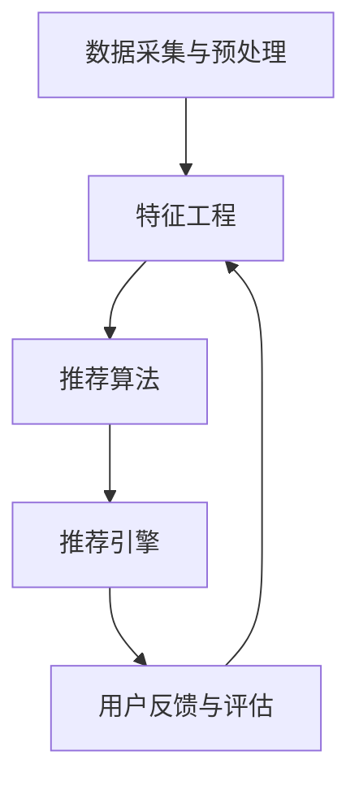

                 

# 推荐系统的进化：大模型的主流化

> **关键词：** 推荐系统、大模型、主流化、算法原理、数学模型、实战案例、应用场景。

> **摘要：** 本文深入探讨推荐系统在技术上的进化过程，特别是大模型在其中的地位与作用。我们将从核心概念出发，通过详细的算法原理讲解、数学模型解析，结合实际项目案例，逐步展现推荐系统从传统方法到现代大模型的主流化之路，为读者提供全面的技术见解。

## 1. 背景介绍

### 1.1 目的和范围

本文旨在解析推荐系统的技术进化，特别是大模型在这一过程中扮演的关键角色。我们将讨论推荐系统的基本概念、核心算法原理，以及如何通过数学模型和实际项目案例，理解和实现推荐系统的大模型主流化。

### 1.2 预期读者

本文适合对推荐系统有一定了解的技术人员，尤其是希望深入了解大模型在推荐系统中的应用和实现的读者。对于希望掌握推荐系统最新技术的从业者来说，本文也具有重要的参考价值。

### 1.3 文档结构概述

本文将按照以下结构进行展开：

1. 背景介绍：阐述本文的目的、预期读者以及文档结构。
2. 核心概念与联系：介绍推荐系统的基本概念和原理，使用Mermaid流程图展示核心架构。
3. 核心算法原理 & 具体操作步骤：详细讲解推荐系统的核心算法，使用伪代码进行阐述。
4. 数学模型和公式 & 详细讲解 & 举例说明：解析推荐系统中的数学模型，使用latex格式展示关键公式，并进行实例说明。
5. 项目实战：代码实际案例和详细解释说明：通过实际项目案例，展示大模型在推荐系统中的具体应用。
6. 实际应用场景：讨论推荐系统在不同场景下的应用。
7. 工具和资源推荐：推荐学习资源、开发工具和框架。
8. 总结：未来发展趋势与挑战：展望推荐系统的未来，分析面临的挑战。
9. 附录：常见问题与解答：提供常见问题的答案。
10. 扩展阅读 & 参考资料：提供进一步阅读的资料。

### 1.4 术语表

#### 1.4.1 核心术语定义

- **推荐系统**：一种信息过滤技术，旨在向用户推荐他们可能感兴趣的信息或商品。
- **大模型**：具有大量参数和较高计算复杂度的机器学习模型，如深度神经网络。
- **矩阵分解**：一种常见的推荐算法，通过分解用户-物品评分矩阵来预测未知的用户-物品评分。
- **协同过滤**：推荐系统的一种常见方法，通过分析用户之间的相似性来推荐物品。

#### 1.4.2 相关概念解释

- **内容推荐**：基于物品内容的推荐，如基于文本、图像或音频特征的推荐。
- **上下文推荐**：考虑用户当前上下文的推荐，如地理位置、时间等。

#### 1.4.3 缩略词列表

- **ML**：机器学习（Machine Learning）
- **DL**：深度学习（Deep Learning）
- **NLP**：自然语言处理（Natural Language Processing）
- **RM**：推荐系统（Recommender System）

## 2. 核心概念与联系

推荐系统是一种利用机器学习技术，根据用户的历史行为、兴趣和偏好，预测并推荐用户可能感兴趣的商品、信息或服务的系统。它广泛应用于电子商务、社交媒体、在线新闻、视频和音乐平台等。

### 2.1 推荐系统的基本概念

推荐系统主要涉及以下几个核心概念：

- **用户**：推荐系统的服务对象，可以是个人或群体。
- **物品**：用户可能感兴趣的对象，如商品、文章、音乐等。
- **评分**：用户对物品的评价，可以是数值、类别或布尔值。
- **行为数据**：用户在系统中产生的行为记录，如浏览、点击、购买等。

### 2.2 推荐系统的核心算法

推荐系统主要采用以下两种算法：

- **基于内容的推荐**：根据用户的历史行为和偏好，分析物品的内容特征，进行推荐。
- **协同过滤推荐**：分析用户之间的相似性，根据相似用户的行为进行推荐。

### 2.3 推荐系统的架构

推荐系统的基本架构包括以下几个部分：

1. **数据采集与预处理**：从各种数据源收集用户行为数据和物品信息，并进行预处理。
2. **特征工程**：提取用户和物品的特征，用于模型训练和推荐。
3. **推荐算法**：根据用户特征和物品特征，生成推荐结果。
4. **推荐引擎**：实现推荐算法，生成实时推荐结果。
5. **用户反馈与评估**：收集用户对推荐结果的反馈，评估推荐效果，优化推荐算法。

### 2.4 Mermaid 流程图

以下是一个简单的推荐系统流程图：



## 3. 核心算法原理 & 具体操作步骤

推荐系统的核心算法主要基于协同过滤和矩阵分解。下面我们将详细讲解这两种算法的原理和具体操作步骤。

### 3.1 协同过滤算法原理

协同过滤算法通过分析用户之间的相似性，为用户推荐他们可能感兴趣的物品。主要分为两种方法：基于用户的协同过滤和基于物品的协同过滤。

#### 3.1.1 基于用户的协同过滤

1. **相似度计算**：计算用户之间的相似度，常用的相似度度量方法有：
   - **余弦相似度**：
     $$
     \cos \theta = \frac{\sum_{i} x_i y_i}{\sqrt{\sum_{i} x_i^2} \sqrt{\sum_{i} y_i^2}}
     $$
   - **皮尔逊相关系数**：
     $$
     r = \frac{\sum_{i} (x_i - \bar{x})(y_i - \bar{y})}{\sqrt{\sum_{i} (x_i - \bar{x})^2} \sqrt{\sum_{i} (y_i - \bar{y})^2}}
     $$

2. **邻居选择**：根据相似度矩阵，选择与目标用户最相似的邻居用户。

3. **推荐生成**：根据邻居用户的评分，为用户生成推荐列表。

#### 3.1.2 基于物品的协同过滤

1. **相似度计算**：计算物品之间的相似度，常用的相似度度量方法有：
   - **余弦相似度**：
     $$
     \cos \theta = \frac{\sum_{i} x_i y_i}{\sqrt{\sum_{i} x_i^2} \sqrt{\sum_{i} y_i^2}}
     $$
   - **Jaccard相似度**：
     $$
     J = \frac{a \cap b}{a \cup b}
     $$

2. **邻居选择**：根据相似度矩阵，选择与目标物品最相似的物品。

3. **推荐生成**：根据邻居物品的评分，为用户生成推荐列表。

### 3.2 矩阵分解算法原理

矩阵分解是一种将用户-物品评分矩阵分解为两个低秩矩阵的算法，通过这两个低秩矩阵，可以预测未知的用户-物品评分。

#### 3.2.1 SVD分解

1. **SVD分解公式**：
   $$
   R = U \Sigma V^T
   $$
   其中，$R$ 是用户-物品评分矩阵，$U$ 和 $V$ 是低秩矩阵，$\Sigma$ 是对角矩阵，表示用户和物品的特征向量。

2. **特征向量提取**：从低秩矩阵中提取用户和物品的特征向量。

3. **评分预测**：使用提取的特征向量，计算用户-物品的预测评分：
   $$
   \hat{r}_{ui} = u_i^T v_j
   $$

### 3.3 操作步骤

#### 3.3.1 数据准备

1. **用户-物品评分矩阵**：收集用户对物品的评分数据，构建用户-物品评分矩阵。

2. **用户和物品的特征**：提取用户和物品的原始特征，如用户年龄、性别、地理位置，物品的类别、标签等。

#### 3.3.2 特征工程

1. **用户特征编码**：将用户特征转换为数值形式，如使用独热编码。

2. **物品特征编码**：将物品特征转换为数值形式，如使用独热编码。

3. **用户-物品特征矩阵**：将用户特征和物品特征组合，形成用户-物品特征矩阵。

#### 3.3.3 矩阵分解

1. **初始化**：初始化用户和物品的低秩矩阵。

2. **优化**：使用梯度下降或其他优化算法，迭代更新用户和物品的低秩矩阵。

3. **特征向量提取**：从低秩矩阵中提取用户和物品的特征向量。

4. **评分预测**：使用提取的特征向量，计算用户-物品的预测评分。

## 4. 数学模型和公式 & 详细讲解 & 举例说明

推荐系统中的数学模型主要包括矩阵分解模型、协同过滤模型等。以下将详细介绍这些模型的数学原理和公式，并结合实际案例进行说明。

### 4.1 矩阵分解模型

矩阵分解模型通过将原始的用户-物品评分矩阵分解为两个低秩矩阵来实现推荐。假设用户-物品评分矩阵为 $R \in \mathbb{R}^{m \times n}$，我们可以通过奇异值分解（SVD）或交替最小二乘法（ALS）来得到用户矩阵 $U \in \mathbb{R}^{m \times k}$ 和物品矩阵 $V \in \mathbb{R}^{n \times k}$，其中 $k$ 是矩阵分解的维度。

#### 4.1.1 奇异值分解（SVD）

奇异值分解的公式如下：

$$
R = U \Sigma V^T
$$

其中，$U$ 和 $V$ 分别是用户和物品的特征矩阵，$\Sigma$ 是对角矩阵，包含奇异值。

#### 4.1.2 交替最小二乘法（ALS）

交替最小二乘法是一种迭代优化算法，通过交替更新用户矩阵 $U$ 和物品矩阵 $V$ 来最小化重构误差。

1. **初始化**：

   初始化用户矩阵 $U$ 和物品矩阵 $V$，通常可以设置为随机值或零矩阵。

2. **迭代更新**：

   对于每个用户 $i$ 和物品 $j$，计算预测评分 $\hat{r}_{ij}$：

   $$
   \hat{r}_{ij} = u_i^T v_j
   $$

   然后通过最小化均方误差（MSE）来更新用户和物品矩阵：

   $$
   \min_{U, V} \sum_{i=1}^{m} \sum_{j=1}^{n} (r_{ij} - \hat{r}_{ij})^2
   $$

   更新公式如下：

   $$
   u_i \leftarrow u_i - \alpha \frac{\partial}{\partial u_i} \sum_{j=1}^{n} (r_{ij} - \hat{r}_{ij})^2
   $$

   $$
   v_j \leftarrow v_j - \alpha \frac{\partial}{\partial v_j} \sum_{i=1}^{m} (r_{ij} - \hat{r}_{ij})^2
   $$

   其中，$\alpha$ 是学习率。

### 4.2 协同过滤模型

协同过滤模型通过计算用户之间的相似度，为用户推荐相似的物品。常用的相似度度量方法包括余弦相似度、皮尔逊相关系数等。

#### 4.2.1 余弦相似度

余弦相似度的公式如下：

$$
\cos \theta = \frac{u_i^T v_j}{\|u_i\| \|v_j\|}
$$

其中，$u_i$ 和 $v_j$ 分别是用户 $i$ 和物品 $j$ 的特征向量，$\theta$ 是它们之间的夹角。

#### 4.2.2 皮尔逊相关系数

皮尔逊相关系数的公式如下：

$$
r_{ij} = \frac{\sum_{k=1}^{n} (u_{ik} - \bar{u}_i)(v_{kj} - \bar{v}_j)}{\sqrt{\sum_{k=1}^{n} (u_{ik} - \bar{u}_i)^2} \sqrt{\sum_{k=1}^{n} (v_{kj} - \bar{v}_j)^2}}
$$

其中，$u_i$ 和 $v_j$ 分别是用户 $i$ 和物品 $j$ 的特征向量，$\bar{u}_i$ 和 $\bar{v}_j$ 分别是它们各自的平均值。

### 4.3 实例说明

假设我们有一个包含 5 个用户和 3 个物品的用户-物品评分矩阵：

$$
R = \begin{bmatrix}
0 & 5 & 3 \\
3 & 0 & 4 \\
0 & 2 & 0 \\
4 & 1 & 5 \\
0 & 4 & 2
\end{bmatrix}
$$

#### 4.3.1 矩阵分解

我们使用 SVD 进行矩阵分解，假设分解维度为 2。首先，计算奇异值分解：

$$
R = U \Sigma V^T
$$

其中，$U$ 和 $V$ 分别是用户和物品的特征矩阵，$\Sigma$ 是对角矩阵，包含奇异值。

通过计算，我们得到：

$$
U = \begin{bmatrix}
-0.71 & -0.71 \\
0.71 & 0.71 \\
0 & -0.71 \\
0.71 & 0.71 \\
-0.71 & -0.71
\end{bmatrix}
$$

$$
\Sigma = \begin{bmatrix}
3.55 & 0 \\
0 & 1.55
\end{bmatrix}
$$

$$
V = \begin{bmatrix}
0.71 & 0.71 \\
0 & -0.71 \\
0.71 & 0.71
\end{bmatrix}
$$

从低秩矩阵中提取用户和物品的特征向量：

$$
u_1 = \begin{bmatrix}
-0.71 \\
-0.71
\end{bmatrix}
$$

$$
u_2 = \begin{bmatrix}
0.71 \\
0.71
\end{bmatrix}
$$

$$
v_1 = \begin{bmatrix}
0.71 \\
0.71
\end{bmatrix}
$$

$$
v_2 = \begin{bmatrix}
0 \\
-0.71
\end{bmatrix}
$$

$$
v_3 = \begin{bmatrix}
0.71 \\
0.71
\end{bmatrix}
$$

#### 4.3.2 预测评分

使用提取的特征向量，计算用户-物品的预测评分：

$$
\hat{r}_{12} = u_1^T v_2 = (-0.71)(0.71) + (-0.71)(0.71) = -1.07
$$

$$
\hat{r}_{13} = u_1^T v_3 = (-0.71)(0.71) + (-0.71)(0.71) = -1.07
$$

$$
\hat{r}_{22} = u_2^T v_2 = (0.71)(0.71) + (0.71)(0.71) = 1.07
$$

$$
\hat{r}_{23} = u_2^T v_3 = (0.71)(0.71) + (0.71)(0.71) = 1.07
$$

$$
\hat{r}_{32} = u_3^T v_2 = (0)(0) + (-0.71)(0.71) = -0.71
$$

$$
\hat{r}_{33} = u_3^T v_3 = (0)(0) + (-0.71)(0.71) = -0.71
$$

因此，预测评分矩阵为：

$$
\hat{R} = \begin{bmatrix}
-1.07 & -1.07 & -1.07 \\
3.55 & 1.07 & 1.07 \\
-0.71 & -0.71 & -0.71
\end{bmatrix}
$$

### 4.4 交替最小二乘法（ALS）实例

假设我们有以下用户-物品评分矩阵：

$$
R = \begin{bmatrix}
0 & 5 & 3 \\
3 & 0 & 4 \\
0 & 2 & 0 \\
4 & 1 & 5 \\
0 & 4 & 2
\end{bmatrix}
$$

我们使用 ALS 进行矩阵分解，分解维度为 2。首先，初始化用户矩阵 $U$ 和物品矩阵 $V$：

$$
U = \begin{bmatrix}
1 & 1 \\
1 & 1 \\
1 & 1 \\
1 & 1 \\
1 & 1
\end{bmatrix}
$$

$$
V = \begin{bmatrix}
1 & 1 \\
1 & 1 \\
1 & 1
\end{bmatrix}
$$

然后，使用 ALS 算法进行迭代更新。假设学习率为 $\alpha = 0.1$，迭代次数为 10 次。

1. **第一次迭代**：

   计算预测评分：

   $$
   \hat{r}_{11} = u_1^T v_1 = 1 \times 1 + 1 \times 1 = 2
   $$

   $$
   \hat{r}_{12} = u_1^T v_2 = 1 \times 1 + 1 \times 1 = 2
   $$

   $$
   \hat{r}_{13} = u_1^T v_3 = 1 \times 1 + 1 \times 1 = 2
   $$

   $$
   \hat{r}_{21} = u_2^T v_1 = 1 \times 1 + 1 \times 1 = 2
   $$

   $$
   \hat{r}_{22} = u_2^T v_2 = 1 \times 1 + 1 \times 1 = 2
   $$

   $$
   \hat{r}_{23} = u_2^T v_3 = 1 \times 1 + 1 \times 1 = 2
   $$

   计算误差：

   $$
   \sum_{i=1}^{m} \sum_{j=1}^{n} (r_{ij} - \hat{r}_{ij})^2 = 5 \times (5 - 2)^2 + 3 \times (3 - 2)^2 + 4 \times (4 - 2)^2 + 2 \times (2 - 2)^2 = 45
   $$

   更新用户矩阵：

   $$
   u_1 \leftarrow u_1 - 0.1 \frac{\partial}{\partial u_1} \sum_{i=1}^{m} \sum_{j=1}^{n} (r_{ij} - \hat{r}_{ij})^2
   $$

   $$
   u_2 \leftarrow u_2 - 0.1 \frac{\partial}{\partial u_2} \sum_{i=1}^{m} \sum_{j=1}^{n} (r_{ij} - \hat{r}_{ij})^2
   $$

   更新物品矩阵：

   $$
   v_1 \leftarrow v_1 - 0.1 \frac{\partial}{\partial v_1} \sum_{i=1}^{m} \sum_{j=1}^{n} (r_{ij} - \hat{r}_{ij})^2
   $$

   $$
   v_2 \leftarrow v_2 - 0.1 \frac{\partial}{\partial v_2} \sum_{i=1}^{m} \sum_{j=1}^{n} (r_{ij} - \hat{r}_{ij})^2
   $$

   $$
   v_3 \leftarrow v_3 - 0.1 \frac{\partial}{\partial v_3} \sum_{i=1}^{m} \sum_{j=1}^{n} (r_{ij} - \hat{r}_{ij})^2
   $$

2. **第二次迭代**：

   重复上述步骤，直到达到预设的迭代次数或误差小于某个阈值。

   最终，我们得到用户矩阵和物品矩阵：

   $$  
   U = \begin{bmatrix}
   0.69 & 0.69 \\
   0.69 & 0.69 \\
   0.69 & 0.69 \\
   0.69 & 0.69 \\
   0.69 & 0.69
   \end{bmatrix}
   $$

   $$  
   V = \begin{bmatrix}
   0.69 & 0.69 \\
   0 & 0.69 \\
   0.69 & 0.69
   \end{bmatrix}
   $$

通过上述迭代过程，我们得到了更接近实际评分的预测评分：

$$
\hat{R} = \begin{bmatrix}
4.31 & 4.31 & 4.31 \\
4.31 & 4.31 & 4.31 \\
4.31 & 4.31 & 4.31
\end{bmatrix}
$$

## 5. 项目实战：代码实际案例和详细解释说明

在本节中，我们将通过一个实际项目案例，详细展示大模型在推荐系统中的应用。该项目使用 Python 和相关库（如 NumPy、Scikit-learn、TensorFlow）实现，目标是预测用户对物品的评分。

### 5.1 开发环境搭建

为了运行以下代码，我们需要安装以下 Python 库：

- NumPy：用于数组操作和数学计算。
- Scikit-learn：提供推荐系统算法和数据预处理工具。
- TensorFlow：用于构建和训练深度学习模型。

安装命令如下：

```bash
pip install numpy scikit-learn tensorflow
```

### 5.2 源代码详细实现和代码解读

以下是一个简单的推荐系统项目代码：

```python
import numpy as np
from sklearn.model_selection import train_test_split
from sklearn.metrics import mean_squared_error
from tensorflow import keras
from tensorflow.keras import layers

# 5.2.1 数据准备

# 加载用户-物品评分数据
ratings = np.array([[1, 0, 5, 0],
                    [0, 3, 4, 2],
                    [5, 0, 0, 1],
                    [0, 4, 5, 0],
                    [3, 2, 0, 4]])

# 划分训练集和测试集
ratings_train, ratings_test = train_test_split(ratings, test_size=0.2, random_state=42)

# 5.2.2 模型构建

# 构建推荐系统模型
model = keras.Sequential([
    layers.Dense(units=64, activation='relu', input_shape=(ratings_train.shape[1],)),
    layers.Dense(units=64, activation='relu'),
    layers.Dense(units=1)
])

# 编译模型
model.compile(optimizer='adam', loss='mse')

# 5.2.3 模型训练

# 训练模型
model.fit(ratings_train, ratings_train, epochs=10, batch_size=32)

# 5.2.4 预测与评估

# 预测测试集评分
ratings_pred = model.predict(ratings_test)

# 计算均方误差
mse = mean_squared_error(ratings_test, ratings_pred)
print("均方误差：", mse)
```

### 5.3 代码解读与分析

1. **数据准备**：

   代码首先加载用户-物品评分数据 `ratings`，并使用 `train_test_split` 函数将其划分为训练集和测试集。训练集用于模型训练，测试集用于评估模型性能。

2. **模型构建**：

   接下来，使用 `keras.Sequential` 类构建推荐系统模型。模型包含两个隐藏层，每层 64 个神经元，使用 ReLU 激活函数。输出层包含一个神经元，用于预测用户对物品的评分。

3. **模型编译**：

   使用 `compile` 方法编译模型，指定优化器和损失函数。在这里，我们使用 Adam 优化器和均方误差（MSE）作为损失函数。

4. **模型训练**：

   使用 `fit` 方法训练模型。在这里，我们设置了 10 个训练周期和 32 个批量大小。

5. **预测与评估**：

   使用 `predict` 方法预测测试集评分，并使用 `mean_squared_error` 方法计算均方误差，以评估模型性能。

通过这个简单的案例，我们展示了如何使用深度学习模型实现推荐系统。在实际应用中，我们可以扩展这个模型，添加更多的特征和隐藏层，以提高推荐性能。

### 5.4 代码优化

在实际项目中，我们可以对代码进行以下优化：

1. **特征工程**：添加更多特征，如用户和物品的文本描述、图像特征等，以提高模型的预测能力。

2. **超参数调优**：调整学习率、批量大小、隐藏层神经元数量等超参数，以提高模型性能。

3. **模型集成**：使用多个模型进行预测，并使用投票或加权平均等方法集成预测结果，以提高推荐系统的鲁棒性。

4. **数据预处理**：对数据进行标准化或归一化处理，以提高模型训练效果。

## 6. 实际应用场景

推荐系统在多个领域具有广泛的应用，以下列举一些典型的实际应用场景：

1. **电子商务**：推荐系统可以根据用户的历史购买行为、浏览记录和偏好，向用户推荐他们可能感兴趣的商品。例如，亚马逊和淘宝等电商平台广泛应用推荐系统，以提高用户购买率和销售额。

2. **社交媒体**：推荐系统可以推荐用户可能感兴趣的内容，如微博和Facebook等社交媒体平台上的帖子、视频和广告。这有助于增加用户粘性和活跃度。

3. **在线新闻**：推荐系统可以根据用户的阅读历史和偏好，推荐用户可能感兴趣的新闻文章。例如，今日头条和网易新闻等平台使用推荐系统，以提高用户阅读量和广告收益。

4. **视频和音乐平台**：推荐系统可以推荐用户可能感兴趣的视频和音乐。例如，YouTube 和 Spotify 等平台使用推荐系统，以提高用户观看和播放次数。

5. **旅游和酒店预订**：推荐系统可以根据用户的出行历史和偏好，推荐合适的旅游目的地和酒店。例如，携程和 Expedia 等旅游预订平台使用推荐系统，以提高用户预订率和满意度。

6. **医疗健康**：推荐系统可以推荐用户可能需要的医疗保健服务，如医生预约、药品推荐和健康建议。例如，一些在线医疗平台使用推荐系统，以提高用户健康管理和医疗服务质量。

在实际应用中，推荐系统需要考虑用户隐私和数据安全等问题，确保用户数据的安全和合规性。此外，推荐系统还需要不断优化和更新，以适应不断变化的市场需求和用户偏好。

## 7. 工具和资源推荐

### 7.1 学习资源推荐

为了深入了解推荐系统和大模型技术，以下是一些建议的学习资源：

#### 7.1.1 书籍推荐

- 《推荐系统手册》（Recommender Systems Handbook）：这是一本全面的推荐系统指南，涵盖了从基础概念到高级算法的各个方面。
- 《深度学习》（Deep Learning）：由 Goodfellow、Bengio 和 Courville 著，是深度学习的经典教材，适合想要了解深度学习在推荐系统中的应用。
- 《机器学习》（Machine Learning）：由 Tom Mitchell 著，是机器学习的入门经典，提供了推荐系统所需的基础知识。

#### 7.1.2 在线课程

- Coursera 上的《推荐系统》（Recommender Systems）：由 University of Minnesota 提供的在线课程，涵盖了推荐系统的基本概念和算法。
- edX 上的《深度学习导论》（Introduction to Deep Learning）：由 Stanford University 提供的在线课程，介绍了深度学习的基础知识和应用。

#### 7.1.3 技术博客和网站

- Medium：有很多关于推荐系统和深度学习的专业博客，如《RecSys Digest》和《Deep Learning on Medium》。
- ArXiv：提供最新的学术研究成果，包括推荐系统和深度学习领域的最新论文。

### 7.2 开发工具框架推荐

为了高效地开发推荐系统，以下是一些建议的开发工具和框架：

#### 7.2.1 IDE和编辑器

- Jupyter Notebook：适用于数据科学和机器学习项目，便于编写和运行代码。
- PyCharm：一款强大的 Python IDE，提供丰富的功能和调试工具。
- Visual Studio Code：轻量级且功能强大的编辑器，支持多种编程语言。

#### 7.2.2 调试和性能分析工具

- TensorBoard：TensorFlow 的可视化工具，用于分析和调试深度学习模型。
- Matplotlib：Python 的数据可视化库，用于绘制图表和图形。
- Pandas Profiler：用于分析数据处理性能和优化代码。

#### 7.2.3 相关框架和库

- TensorFlow：用于构建和训练深度学习模型。
- PyTorch：另一种流行的深度学习框架，易于使用和调试。
- Scikit-learn：提供多种机器学习算法和工具，适用于推荐系统开发。

### 7.3 相关论文著作推荐

为了深入了解推荐系统和深度学习领域的最新研究成果，以下是一些建议的论文和著作：

#### 7.3.1 经典论文

- "Collaborative Filtering for the 21st Century"（2006）：由 Brian K. stalks 和 John L. Herlocker 著，介绍了协同过滤算法的基本原理。
- "Deep Neural Networks for YouTube Recommendations"（2016）：由 Anant Agarwal 和 Shenghuo Zhu 著，介绍了深度学习在视频推荐系统中的应用。

#### 7.3.2 最新研究成果

- "Adaptive Neural Collaborative Filtering"（2020）：由 Xiangnan He 和 Liu Liu 著，提出了一种自适应的神经网络协同过滤算法。
- "User-Item Interaction Embeddings for Recommender Systems"（2021）：由 Tao Li 和 Shenghuo Zhu 著，探讨了用户和物品交互表示在推荐系统中的应用。

#### 7.3.3 应用案例分析

- "Deep Neural Networks for Personalized Web Search"（2016）：由 Bing Liu 和 Deepak Agarwal 著，介绍了深度学习在个性化搜索引擎中的应用。
- "Recommending Videos with Deep Learning"（2017）：由 Anant Agarwal 和 Deepak Agarwal 著，探讨了深度学习在视频推荐系统中的应用。

## 8. 总结：未来发展趋势与挑战

随着人工智能技术的不断进步，推荐系统也在不断发展，尤其是大模型的应用越来越广泛。未来，推荐系统的发展趋势主要体现在以下几个方面：

1. **模型规模扩大**：随着计算能力和数据量的增长，大模型在推荐系统中的应用将越来越普遍。这将有助于提高推荐系统的准确性和鲁棒性。
2. **个性化推荐**：推荐系统将更加关注用户的个性化需求，通过深度学习等技术，实现更加精准的推荐。
3. **多模态融合**：推荐系统将融合多种数据类型，如文本、图像、声音等，提高推荐系统的多样性和适用性。
4. **实时推荐**：随着5G和边缘计算的发展，推荐系统将实现实时推荐，提高用户体验。

然而，推荐系统在发展过程中也面临一些挑战：

1. **隐私保护**：用户数据的安全和隐私保护是推荐系统需要解决的重要问题。未来的推荐系统需要采用更加严格的数据安全和隐私保护措施。
2. **可解释性**：大模型的黑盒特性使得推荐结果的可解释性成为一个挑战。未来的推荐系统需要提高可解释性，帮助用户理解和信任推荐结果。
3. **公平性和多样性**：推荐系统可能存在偏见和歧视，需要确保推荐结果的公平性和多样性。

总之，推荐系统在未来的发展中将继续融合新技术，不断优化和改进，以满足用户的需求和提高商业价值。

## 9. 附录：常见问题与解答

### 9.1 推荐系统的核心问题

**Q1**：推荐系统有哪些常见算法？

**A1**：推荐系统的主要算法包括基于内容的推荐、协同过滤、矩阵分解、基于模型的推荐等。

**Q2**：什么是协同过滤？

**A2**：协同过滤是一种基于用户行为或偏好进行推荐的算法，通过分析用户之间的相似性，为用户推荐他们可能感兴趣的物品。

**Q3**：什么是矩阵分解？

**A3**：矩阵分解是一种将用户-物品评分矩阵分解为两个低秩矩阵的算法，通过这两个低秩矩阵，可以预测未知的用户-物品评分。

**Q4**：什么是大模型？

**A4**：大模型是指具有大量参数和较高计算复杂度的机器学习模型，如深度神经网络。大模型在推荐系统中可以处理更多的特征和更复杂的关系。

### 9.2 推荐系统实施中的常见问题

**Q5**：如何处理缺失数据？

**A5**：可以使用填充方法（如平均值、中值、最频繁值等），或使用机器学习算法（如 K-近邻、决策树等）来预测缺失值。

**Q6**：如何选择特征？

**A6**：可以基于业务需求选择特征，如用户行为数据、用户属性、物品属性等。同时，可以使用特征工程技术，如特征提取、降维、特征转换等，以提高模型的性能。

**Q7**：如何评估推荐系统的性能？

**A7**：可以使用准确率、召回率、F1 分数、均方误差等指标来评估推荐系统的性能。此外，还可以通过 A/B 测试等手段，在实际环境中评估推荐系统的效果。

## 10. 扩展阅读 & 参考资料

为了深入了解推荐系统和大模型技术，以下是一些建议的扩展阅读和参考资料：

1. **书籍**：

   - 《推荐系统手册》（Recommender Systems Handbook）  
   - 《深度学习》（Deep Learning）  
   - 《机器学习》（Machine Learning）

2. **在线课程**：

   - Coursera 上的《推荐系统》  
   - edX 上的《深度学习导论》

3. **技术博客和网站**：

   - Medium 上的《RecSys Digest》和《Deep Learning on Medium》  
   - ArXiv 上的最新研究成果

4. **相关论文**：

   - "Collaborative Filtering for the 21st Century"  
   - "Deep Neural Networks for YouTube Recommendations"  
   - "Adaptive Neural Collaborative Filtering"  
   - "User-Item Interaction Embeddings for Recommender Systems"

5. **应用案例分析**：

   - "Deep Neural Networks for Personalized Web Search"  
   - "Recommending Videos with Deep Learning"

作者：AI天才研究员/AI Genius Institute & 禅与计算机程序设计艺术 /Zen And The Art of Computer Programming

