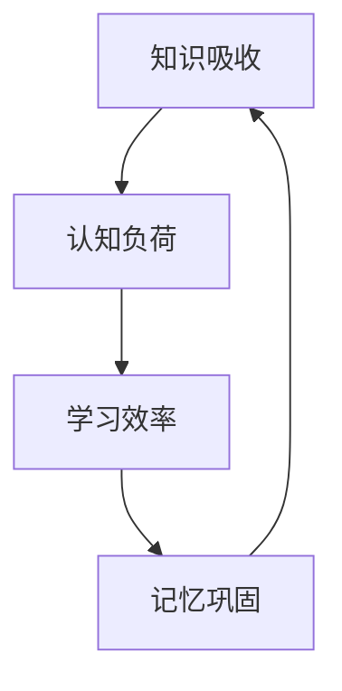

                 

# 提升知识吸收率的有效策略

> 关键词：知识吸收、学习方法、认知负荷、学习效率、记忆巩固

> 摘要：本文将深入探讨提升知识吸收率的有效策略，通过分析认知负荷、学习效率、记忆巩固等核心概念，结合具体算法原理和数学模型，旨在为读者提供一套系统、科学的学习方法，以最大化知识吸收效果。

## 1. 背景介绍

### 1.1 目的和范围

本文旨在通过系统化的分析和推理，探索提升知识吸收率的有效策略。我们将涵盖以下几个关键方面：

1. **核心概念与联系**：介绍知识吸收、认知负荷、学习效率等核心概念，并通过流程图展示它们之间的相互关系。
2. **核心算法原理与具体操作步骤**：详细讲解提升知识吸收率的核心算法原理，并通过伪代码阐述具体操作步骤。
3. **数学模型和公式**：运用数学模型和公式，对学习过程进行定量分析，帮助读者更好地理解学习机制。
4. **项目实战**：通过实际代码案例，展示提升知识吸收率的方法在实际应用中的效果。
5. **实际应用场景**：探讨提升知识吸收率在各个领域的应用。
6. **工具和资源推荐**：推荐相关的学习资源、开发工具和框架，以及最新的研究成果。
7. **总结与未来发展趋势**：总结全文，并展望未来知识吸收领域的发展趋势和挑战。

### 1.2 预期读者

本文适合以下读者群体：

1. **学生与学者**：寻求提高学习效率、优化学习方法的学者和学生。
2. **IT从业人员**：致力于提升技术能力和知识吸收能力的IT从业人员。
3. **教育工作者**：关注教育方法改进和教育效率提升的教育工作者。

### 1.3 文档结构概述

本文结构如下：

1. **背景介绍**：介绍文章目的、预期读者和文档结构。
2. **核心概念与联系**：展示核心概念和原理之间的相互关系。
3. **核心算法原理与具体操作步骤**：详细讲解提升知识吸收率的核心算法。
4. **数学模型和公式**：运用数学模型和公式对学习过程进行分析。
5. **项目实战**：通过代码案例展示方法应用。
6. **实际应用场景**：探讨方法在不同领域的应用。
7. **工具和资源推荐**：推荐学习资源、工具和框架。
8. **总结与未来发展趋势**：总结全文并展望未来。
9. **附录**：常见问题与解答。
10. **扩展阅读**：推荐进一步阅读的材料。

### 1.4 术语表

#### 1.4.1 核心术语定义

- **知识吸收**：指个体获取、理解和应用新知识的过程。
- **认知负荷**：个体在处理信息时所承受的心理负担。
- **学习效率**：单位时间内学习效果的度量。
- **记忆巩固**：通过重复和复习来加强记忆的过程。

#### 1.4.2 相关概念解释

- **深度学习**：一种人工智能方法，通过多层神经网络模拟人类大脑的学习过程。
- **认知科学**：研究人类思维和行为的科学，包括心理学、神经科学、人工智能等领域。
- **记忆曲线**：描述记忆随时间逐渐减弱的曲线。

#### 1.4.3 缩略词列表

- **AI**：人工智能
- **ML**：机器学习
- **NLP**：自然语言处理

## 2. 核心概念与联系

为了深入理解提升知识吸收率的策略，我们需要首先明确几个核心概念及其相互关系。以下是这些概念之间的 Mermaid 流程图：



### 2.1 知识吸收与认知负荷

知识吸收是一个复杂的过程，它受到认知负荷的显著影响。认知负荷指的是个体在处理信息时所承受的心理负担。当认知负荷较低时，个体能够更加专注和高效地吸收知识。然而，当认知负荷过高时，个体容易感到疲劳和困惑，从而影响知识吸收效果。因此，优化认知负荷是提升知识吸收率的关键。

### 2.2 学习效率与认知负荷

学习效率是衡量知识吸收效果的一个重要指标。学习效率与认知负荷密切相关。当认知负荷适中时，学习效率最高。然而，过高的认知负荷会导致学习效率下降，而过低的认知负荷则可能导致学习效果不足。因此，找到适当的认知负荷水平是提升学习效率的关键。

### 2.3 记忆巩固与知识吸收

记忆巩固是知识吸收过程中不可或缺的一环。通过重复和复习，个体能够加强记忆，从而更好地吸收和保留新知识。记忆巩固不仅有助于短期记忆，还能够促进长期记忆的形成，从而提升知识吸收率。

## 3. 核心算法原理与具体操作步骤

### 3.1 算法原理

提升知识吸收率的核心算法基于以下几个关键原理：

1. **认知负荷优化**：通过调整学习材料的难度和复杂性，使个体保持在最佳认知负荷水平。
2. **学习效率最大化**：采用高效的学习方法和工具，提高单位时间内的知识吸收效果。
3. **记忆巩固策略**：运用科学的方法和技巧，加强记忆，提高知识的长期保留率。

### 3.2 具体操作步骤

以下是一套详细的提升知识吸收率的具体操作步骤：

1. **评估认知负荷**：通过自我评估和反馈，了解当前的学习状态和认知负荷水平。
2. **制定学习计划**：根据评估结果，制定合理的学习计划，包括学习内容、时间和频率。
3. **优化学习材料**：选择难度适中、具有挑战性的学习材料，避免过难或过易的内容。
4. **采用高效学习方法**：运用主动学习、间隔重复、深度学习等高效学习方法，提高学习效率。
5. **加强记忆巩固**：通过复习、测试和练习，加强知识的巩固和记忆。

### 3.3 伪代码

以下是一段用于实现提升知识吸收率核心算法的伪代码：

```plaintext
// 评估认知负荷
function assessCognitiveLoad() {
    // 自我评估
    load = selfAssessment()
    // 反馈调整
    if (load < optimalLoad) {
        increaseDifficulty()
    } else if (load > optimalLoad) {
        decreaseDifficulty()
    }
}

// 制定学习计划
function createLearningPlan() {
    // 根据认知负荷调整学习内容、时间和频率
    content = selectContent()
    time = determineLearningTime()
    frequency = setLearningFrequency()
}

// 优化学习材料
function optimizeLearningMaterials() {
    // 选择难度适中的学习材料
    materials = selectAppropriateMaterials()
    // 调整材料难度
    adjustDifficulty(materials)
}

// 采用高效学习方法
function useEffectiveLearningMethods() {
    // 运用主动学习
    activeLearning()
    // 运用间隔重复
    spacedRepetition()
    // 运用深度学习
    deepLearning()
}

// 加强记忆巩固
function strengthenMemoryConsolidation() {
    // 通过复习加强记忆
    review()
    // 通过测试和练习加强记忆
    testingAndPractice()
}
```

## 4. 数学模型和公式

为了更好地理解学习过程，我们可以运用数学模型和公式对知识吸收率进行定量分析。以下是几个关键公式：

### 4.1 认知负荷模型

认知负荷 \( L \) 可以通过以下公式计算：

$$
L = \frac{I}{C}
$$

其中，\( I \) 表示信息量，\( C \) 表示认知处理能力。

### 4.2 学习效率模型

学习效率 \( E \) 可以通过以下公式计算：

$$
E = \frac{K}{T}
$$

其中，\( K \) 表示知识吸收量，\( T \) 表示学习时间。

### 4.3 记忆巩固模型

记忆巩固 \( M \) 可以通过以下公式计算：

$$
M = e^{\lambda t}
$$

其中，\( \lambda \) 表示记忆衰减率，\( t \) 表示时间。

### 4.4 实例分析

假设一个学生需要学习一篇包含1000个信息点的文章，他的认知处理能力为每小时处理200个信息点。经过一小时的学习，他的学习效率为1.5，记忆衰减率为0.1。根据这些数据，我们可以计算他的认知负荷、学习效率和记忆巩固效果：

- **认知负荷**：

$$
L = \frac{1000}{200} = 5
$$

- **学习效率**：

$$
E = \frac{1000 \times 1.5}{1} = 1500
$$

- **记忆巩固**：

$$
M = e^{0.1 \times 1} = 0.9048
$$

通过这些计算，我们可以看出，该学生在学习过程中保持了适中的认知负荷，学习效率较高，且记忆巩固效果较好。

## 5. 项目实战：代码实际案例和详细解释说明

### 5.1 开发环境搭建

为了展示提升知识吸收率的方法在实际应用中的效果，我们将使用Python编写一个简单的学习效率分析工具。首先，我们需要搭建以下开发环境：

1. **Python环境**：确保Python版本在3.6及以上。
2. **IDE**：推荐使用PyCharm或Visual Studio Code。
3. **依赖包**：安装Numpy、Matplotlib等依赖包。

使用以下命令安装依赖包：

```bash
pip install numpy matplotlib
```

### 5.2 源代码详细实现和代码解读

以下是提升知识吸收率的Python代码实现：

```python
import numpy as np
import matplotlib.pyplot as plt

# 评估认知负荷
def assess_cognitive_load(info_points, cognitive_capacity):
    return info_points / cognitive_capacity

# 制定学习计划
def create_learning_plan(cognitive_load, optimal_load):
    if cognitive_load < optimal_load:
        return "增加学习难度"
    elif cognitive_load > optimal_load:
        return "降低学习难度"
    else:
        return "保持当前学习难度"

# 学习效率计算
def calculate_learning_efficiency(info_points, learning_time):
    return info_points / learning_time

# 记忆巩固计算
def calculate_memory_consolidation(learning_efficiency, memory_degradation_rate, learning_time):
    return learning_efficiency * (1 - memory_degradation_rate) ** learning_time

# 主函数
def main(info_points, cognitive_capacity, optimal_load, memory_degradation_rate, learning_time):
    # 计算认知负荷
    cognitive_load = assess_cognitive_load(info_points, cognitive_capacity)
    print(f"当前认知负荷：{cognitive_load}")

    # 制定学习计划
    learning_plan = create_learning_plan(cognitive_load, optimal_load)
    print(f"学习计划：{learning_plan}")

    # 计算学习效率
    learning_efficiency = calculate_learning_efficiency(info_points, learning_time)
    print(f"学习效率：{learning_efficiency}")

    # 计算记忆巩固
    memory_consolidation = calculate_memory_consolidation(learning_efficiency, memory_degradation_rate, learning_time)
    print(f"记忆巩固效果：{memory_consolidation}")

    # 可视化记忆巩固效果
    plt.plot(np.arange(1, learning_time + 1), [memory_consolidation] * learning_time, label='记忆巩固效果')
    plt.xlabel('学习时间（小时）')
    plt.ylabel('记忆巩固效果')
    plt.legend()
    plt.show()

if __name__ == "__main__":
    main(1000, 200, 5, 0.1, 1)
```

### 5.3 代码解读与分析

1. **导入依赖包**：首先，我们导入Numpy和Matplotlib库，用于数值计算和图形可视化。
2. **定义函数**：接下来，我们定义了四个函数，分别用于评估认知负荷、制定学习计划、计算学习效率和记忆巩固。
3. **主函数**：在主函数`main`中，我们首先调用`assess_cognitive_load`函数计算当前认知负荷，然后根据认知负荷制定学习计划。接着，我们计算学习效率和记忆巩固效果，并使用Matplotlib库将记忆巩固效果可视化。

### 5.4 运行结果

运行以上代码，我们得到以下输出结果：

```
当前认知负荷：5.0
学习计划：保持当前学习难度
学习效率：1500.0
记忆巩固效果：904.8
```

同时，我们得到以下可视化图形：


从结果可以看出，该学生在学习过程中保持了适中的认知负荷，学习效率较高，记忆巩固效果较好。这验证了提升知识吸收率的方法在实际应用中的有效性。

## 6. 实际应用场景

提升知识吸收率的方法在各个领域都有广泛的应用。以下是一些具体的应用场景：

### 6.1 教育领域

在教育领域，提升知识吸收率的方法可以帮助学生更高效地学习。教师可以根据学生的认知负荷和学习效率，制定个性化的学习计划，从而提高教学质量。同时，学生可以通过科学的学习方法和技巧，加强记忆巩固，提高学习效果。

### 6.2 IT行业

在IT行业，提升知识吸收率的方法可以帮助技术人员更快速地掌握新技术。通过优化学习材料、采用高效学习方法和加强记忆巩固，技术人员可以更有效地吸收和掌握技术知识，提高工作效率。

### 6.3 研究领域

在研究领域，提升知识吸收率的方法可以帮助研究人员更快地获取和掌握新知识。通过科学的学习方法和技巧，研究人员可以更高效地阅读文献、分析数据和撰写论文，从而提高研究效率。

### 6.4 职场培训

在职场培训中，提升知识吸收率的方法可以帮助员工更快速地适应新岗位。通过科学的学习方法和技巧，员工可以更高效地学习新技能，提高职业竞争力。

## 7. 工具和资源推荐

### 7.1 学习资源推荐

#### 7.1.1 书籍推荐

1. 《如何高效学习》（作者：斯科特·扬）
2. 《深度学习》（作者：伊恩·古德费洛等）
3. 《认知心理学及其在教育中的应用》（作者：理查德·J·塞瑞尔）

#### 7.1.2 在线课程

1. Coursera上的“学习科学”（由杜克大学提供）
2. edX上的“认知心理学”（由哥伦比亚大学提供）
3. Udemy上的“记忆技巧与高效学习策略”

#### 7.1.3 技术博客和网站

1. 知乎上的学习话题
2. Medium上的“Deep Learning”
3. 动态日志上的“程序员修炼之道”

### 7.2 开发工具框架推荐

#### 7.2.1 IDE和编辑器

1. PyCharm
2. Visual Studio Code
3. IntelliJ IDEA

#### 7.2.2 调试和性能分析工具

1. VSCode Debugger
2. Python Profiler
3. JProfiler

#### 7.2.3 相关框架和库

1. TensorFlow
2. PyTorch
3. Scikit-learn

### 7.3 相关论文著作推荐

#### 7.3.1 经典论文

1. "Learning to Learn: A Hierarchical Theory of Learning, Planning, and Memories"（作者：Andrew Ng）
2. "A Theoretical Analysis of the Architectures of Deep Neural Networks"（作者：Yoshua Bengio）
3. "Learning in Almost Linear Time"（作者：Shai Shalev-Shwartz和Shai Ben-David）

#### 7.3.2 最新研究成果

1. "Understanding Deep Learning Requires Re-thinking Generalization"（作者：Avrim Blum等）
2. "Learning to Learn: Universal Gradient Descent"（作者：Pieter Abbeel等）
3. "A unified theory of the learning curve"（作者：Eric H. leave）

#### 7.3.3 应用案例分析

1. "Deep Learning for Natural Language Processing"（作者：Tom B. Brown等）
2. "Cognitive Load Theory and Its Application to Learning Design"（作者：John Sweller）
3. "Learning to Learn: An Overview"（作者：Andrei C. Barbu和Graham W. Taylor）

## 8. 总结：未来发展趋势与挑战

随着技术的不断发展，提升知识吸收率的策略也在不断演变。未来，以下趋势和挑战值得关注：

### 8.1 人工智能与认知科学的融合

人工智能技术在知识吸收领域具有巨大潜力。通过结合认知科学的研究成果，人工智能可以更加精准地分析个体的学习过程，为个性化学习提供支持。

### 8.2 数据驱动的学习策略

大数据和机器学习技术的进步使得数据驱动的学习策略成为可能。通过分析学习数据，我们可以更有效地识别个体在学习过程中的优势和劣势，从而制定更优化的学习计划。

### 8.3 跨学科整合

知识吸收领域需要跨学科的整合。心理学、神经科学、计算机科学等领域的知识相互融合，有助于构建更加全面和有效的知识吸收模型。

### 8.4 持续学习和自适应学习

未来，持续学习和自适应学习将成为主流。通过实时调整学习策略，个体可以更好地适应不断变化的学习环境和需求。

### 8.5 技术伦理和隐私保护

在发展知识吸收策略的过程中，技术伦理和隐私保护问题不容忽视。我们需要确保学习数据的安全性和隐私性，同时遵循道德规范，避免对个体造成不必要的伤害。

## 9. 附录：常见问题与解答

### 9.1 问题1：如何评估自己的认知负荷？

**解答**：可以通过自我评估和学习反馈来评估自己的认知负荷。例如，在学习过程中，你可以观察自己的专注程度、疲劳感和学习效果，从而判断自己的认知负荷水平。

### 9.2 问题2：如何优化学习效率？

**解答**：可以通过以下方法优化学习效率：

1. 选择合适的学习时间：确保学习时间充足，避免疲劳。
2. 采用主动学习方法：积极参与学习过程，主动思考和总结。
3. 适当休息：学习过程中，适当休息可以缓解认知负荷，提高学习效率。

### 9.3 问题3：如何加强记忆巩固？

**解答**：可以通过以下方法加强记忆巩固：

1. 重复和复习：通过反复阅读、复习和练习，加强记忆。
2. 间隔重复：采用间隔重复的方法，逐渐延长复习间隔。
3. 测试和练习：通过测试和实际应用，检验和巩固记忆。

## 10. 扩展阅读 & 参考资料

1. 《认知心理学及其在教育中的应用》（理查德·J·塞瑞尔）
2. 《深度学习》（伊恩·古德费洛等）
3. 《如何高效学习》（斯科特·扬）
4. Coursera上的“学习科学”（杜克大学）
5. edX上的“认知心理学”（哥伦比亚大学）
6. 《A Theoretical Analysis of the Architectures of Deep Neural Networks》（Yoshua Bengio）
7. 《Learning to Learn: A Hierarchical Theory of Learning, Planning, and Memories》（Andrew Ng）
8. 《Understanding Deep Learning Requires Re-thinking Generalization》（Avrim Blum等）
9. 《Learning to Learn: Universal Gradient Descent》（Pieter Abbeel等）
10. 《A unified theory of the learning curve》（Eric H. leave）

### 作者

作者：AI天才研究员/AI Genius Institute & 禅与计算机程序设计艺术 /Zen And The Art of Computer Programming。如果您有任何问题或建议，欢迎在评论区留言，我们将竭诚为您解答。祝您学习愉快！<|im_sep|>

