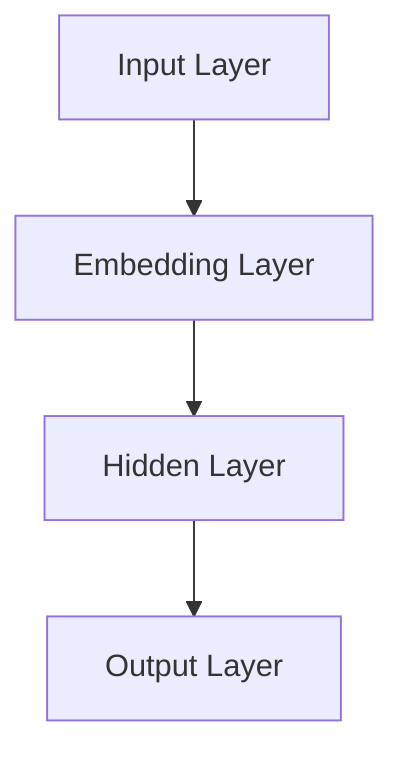
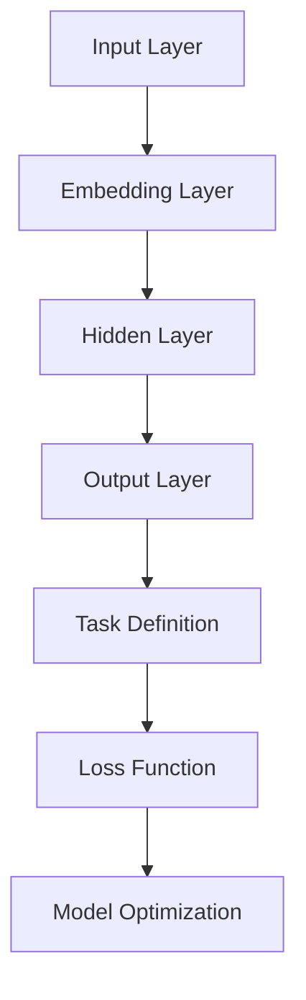
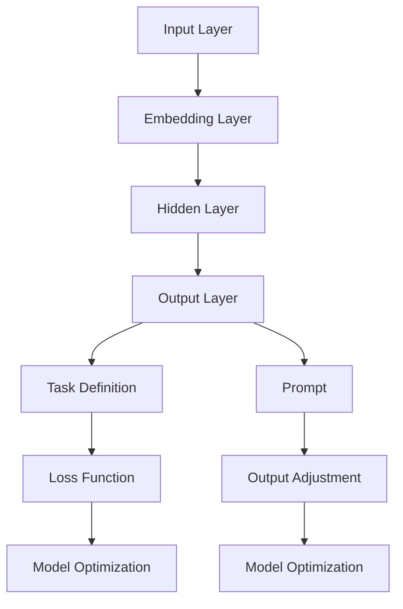
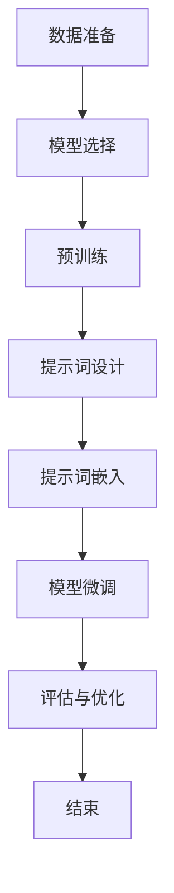

                 

# 提示词优化的自监督学习策略

> **关键词：** 提示词优化，自监督学习，神经网络，训练策略，数据增强，损失函数，模型评估。

> **摘要：** 本文将深入探讨提示词优化在自监督学习中的重要性及其应用策略。通过分析神经网络的结构和训练过程，我们提出了一个基于数据增强和损失函数优化的自监督学习框架，旨在提高模型的泛化能力和效率。文章将结合具体案例，详细阐述算法原理和实现步骤，并提供实用的工具和资源推荐，以助力读者深入理解并应用这一技术。

## 1. 背景介绍

### 1.1 目的和范围

自监督学习（Self-Supervised Learning）是一种无需人工标注标签的数据处理方式，它通过利用未标记的数据自动提取有用的信息来进行学习。提示词优化（Prompt Tuning）是自监督学习的一个重要策略，通过在模型中引入特定提示词（Prompt），可以有效提高模型对特定任务的适应性和性能。

本文的主要目的是探讨提示词优化在自监督学习中的应用策略，分析其原理，并给出具体的实现步骤。本文将覆盖以下内容：

1. 自监督学习和提示词优化的基本概念。
2. 提示词优化在自监督学习中的应用。
3. 提出一种基于数据增强和损失函数优化的自监督学习框架。
4. 结合具体案例，阐述算法原理和实现步骤。
5. 提供实用的工具和资源推荐。

### 1.2 预期读者

本文适用于对自监督学习和提示词优化有一定了解的读者，包括：

1. 研究人员和工程师，对自监督学习和提示词优化有深入研究和应用需求。
2. 数据科学家和机器学习爱好者，希望了解最新技术趋势和应用。
3. 大学生和研究生，对人工智能和机器学习领域有浓厚兴趣。

### 1.3 文档结构概述

本文结构如下：

1. 背景介绍：介绍自监督学习和提示词优化，明确本文目的和范围。
2. 核心概念与联系：分析神经网络结构和训练过程，提供相关概念和流程图。
3. 核心算法原理 & 具体操作步骤：详细阐述提示词优化的算法原理和实现步骤。
4. 数学模型和公式 & 详细讲解 & 举例说明：介绍相关的数学模型和公式，并通过案例进行说明。
5. 项目实战：提供实际代码案例和详细解释。
6. 实际应用场景：探讨提示词优化在不同领域的应用。
7. 工具和资源推荐：推荐学习资源和开发工具。
8. 总结：总结本文要点，展望未来发展趋势与挑战。
9. 附录：常见问题与解答。
10. 扩展阅读 & 参考资料：提供进一步阅读的资料。

### 1.4 术语表

#### 1.4.1 核心术语定义

- **自监督学习（Self-Supervised Learning）**：一种无需人工标注标签的数据处理方式，通过利用未标记的数据自动提取有用的信息来进行学习。
- **提示词优化（Prompt Tuning）**：一种在自监督学习中引入特定提示词的策略，以提高模型对特定任务的适应性和性能。
- **神经网络（Neural Network）**：一种由大量神经元组成的计算模型，通过模拟人脑神经网络结构进行学习和决策。
- **数据增强（Data Augmentation）**：通过变换原始数据，生成更多样化的数据集，以提高模型的泛化能力。
- **损失函数（Loss Function）**：衡量模型预测结果与真实值之间差异的函数，用于指导模型的优化过程。

#### 1.4.2 相关概念解释

- **监督学习（Supervised Learning）**：一种基于已标记数据进行训练的学习方法，模型的输出结果与真实值进行比较，以调整模型参数。
- **无监督学习（Unsupervised Learning）**：一种无需已标记数据进行训练的学习方法，主要关注数据内在结构和模式。
- **生成对抗网络（Generative Adversarial Networks，GAN）**：一种基于对抗性训练的神经网络结构，由生成器和判别器组成，通过相互竞争来生成数据。

#### 1.4.3 缩略词列表

- **GAN**：生成对抗网络（Generative Adversarial Networks）
- **CNN**：卷积神经网络（Convolutional Neural Network）
- **RNN**：循环神经网络（Recurrent Neural Network）
- **DNN**：深度神经网络（Deep Neural Network）
- **MLP**：多层感知器（Multilayer Perceptron）

## 2. 核心概念与联系

在自监督学习和提示词优化中，理解神经网络的结构和训练过程至关重要。以下是一个简化的神经网络架构及其与自监督学习和提示词优化的关系流程图。

### 2.1 神经网络架构



1. **Input Layer**：输入层，接收外部输入数据。
2. **Embedding Layer**：嵌入层，将输入数据映射到高维空间，提高模型对数据的理解能力。
3. **Hidden Layer**：隐藏层，负责进行复杂的非线性变换。
4. **Output Layer**：输出层，生成预测结果。

### 2.2 自监督学习与神经网络

自监督学习通过设计特定的任务，从未标记的数据中自动提取标签。以下是自监督学习与神经网络的关联。



1. **Task Definition**：任务定义，根据具体应用场景设计任务。
2. **Loss Function**：损失函数，衡量模型预测结果与真实值之间的差异。
3. **Model Optimization**：模型优化，通过损失函数指导模型参数调整。

### 2.3 提示词优化与神经网络

提示词优化通过在模型中引入特定提示词，以提高模型对特定任务的适应性和性能。以下是提示词优化与神经网络的关联。



1. **Prompt**：提示词，用于引导模型进行特定任务。
2. **Output Adjustment**：输出调整，根据提示词对模型输出结果进行调整。

通过以上流程图，我们可以看到神经网络在自监督学习和提示词优化中的应用，以及各组件之间的关系和作用。接下来，我们将进一步探讨提示词优化的算法原理和实现步骤。

## 3. 核心算法原理 & 具体操作步骤

### 3.1 算法原理

提示词优化（Prompt Tuning）是一种通过在预训练模型中引入特定提示词来提高其任务适应性的技术。其基本原理如下：

1. **预训练模型**：首先，使用大量未标记的数据对神经网络进行预训练，使其具有一定的泛化能力。
2. **提示词设计**：针对特定任务，设计特定的提示词，这些提示词通常是一个单词或短语，用于引导模型关注特定任务。
3. **模型调整**：将提示词与模型输入相结合，通过微调模型参数，使模型在特定任务上获得更好的性能。

### 3.2 具体操作步骤

以下是提示词优化的具体操作步骤：

#### 3.2.1 预训练模型

1. **数据准备**：收集大量未标记的文本数据，用于预训练模型。
2. **模型选择**：选择合适的预训练模型架构，如BERT、GPT等。
3. **预训练**：使用文本数据进行预训练，训练过程中采用适当的数据增强技术，如填充、随机删除等，以增加模型的泛化能力。

#### 3.2.2 提示词设计

1. **任务定义**：明确具体任务，如问答、文本分类等。
2. **提示词生成**：根据任务定义，设计特定的提示词。提示词可以是任务相关的短语，例如：“给定以下文本，请回答问题：”。

#### 3.2.3 模型调整

1. **提示词嵌入**：将提示词嵌入到模型输入中，通常通过在输入序列的前面添加提示词实现。
2. **微调**：使用带有提示词的标注数据集对模型进行微调，调整模型参数，使其在特定任务上获得更好的性能。
3. **评估与优化**：评估微调后的模型在特定任务上的性能，并根据评估结果调整提示词和模型参数。

### 3.3 算法流程图

以下是提示词优化的算法流程图：



通过以上步骤，我们可以实现提示词优化，提高模型在特定任务上的性能。接下来，我们将探讨数学模型和公式，以更深入地理解提示词优化的原理。

## 4. 数学模型和公式 & 详细讲解 & 举例说明

### 4.1 数学模型

提示词优化涉及多个数学模型，包括输入模型、输出模型和损失函数。以下是对这些模型的详细讲解和公式表示。

#### 4.1.1 输入模型

输入模型通常采用嵌入层（Embedding Layer）进行设计。嵌入层将输入数据映射到高维空间，以提高模型对数据的理解能力。嵌入层的公式如下：

\[ e(x) = W_e \cdot x + b_e \]

其中，\( e(x) \) 是输入数据 \( x \) 的嵌入向量，\( W_e \) 是嵌入权重矩阵，\( b_e \) 是偏置项。

#### 4.1.2 输出模型

输出模型通常采用全连接层（Fully Connected Layer）进行设计。全连接层将嵌入层输出的特征向量映射到输出结果。输出模型的公式如下：

\[ y = W_o \cdot h + b_o \]

其中，\( y \) 是输出结果，\( W_o \) 是输出权重矩阵，\( h \) 是嵌入层输出的特征向量，\( b_o \) 是偏置项。

#### 4.1.3 损失函数

损失函数用于衡量模型预测结果与真实值之间的差异。在提示词优化中，常用的损失函数包括交叉熵损失（Cross-Entropy Loss）和均方误差（Mean Squared Error，MSE）。

1. **交叉熵损失**：

\[ L_{CE} = -\sum_{i=1}^{n} y_i \cdot \log(p_i) \]

其中，\( y_i \) 是真实标签，\( p_i \) 是模型预测概率。

2. **均方误差**：

\[ L_{MSE} = \frac{1}{2} \sum_{i=1}^{n} (y_i - \hat{y}_i)^2 \]

其中，\( y_i \) 是真实标签，\( \hat{y}_i \) 是模型预测值。

### 4.2 举例说明

假设我们有一个简单的文本分类任务，需要将文本分为两个类别。以下是具体的数学模型和公式说明。

#### 4.2.1 输入模型

输入数据为一段文本，例如：“我喜欢吃苹果。”，我们需要将其转换为嵌入向量。假设文本词汇表大小为1000，嵌入维度为50。

\[ e(x) = W_e \cdot x + b_e \]

其中，\( x \) 是文本词序列的索引表示，\( W_e \) 是嵌入权重矩阵，\( b_e \) 是偏置项。

#### 4.2.2 输出模型

假设我们使用全连接层作为输出模型，输出层有两个神经元，分别表示两个类别。

\[ y = W_o \cdot h + b_o \]

其中，\( h \) 是嵌入层输出的特征向量，\( W_o \) 是输出权重矩阵，\( b_o \) 是偏置项。

#### 4.2.3 损失函数

我们使用交叉熵损失函数来衡量模型预测结果与真实值之间的差异。假设真实标签为类别1（标记为1），模型预测概率为0.6。

\[ L_{CE} = -\sum_{i=1}^{n} y_i \cdot \log(p_i) \]

其中，\( y_i = 1 \)，\( p_i = 0.6 \)。

### 4.3 模型训练与优化

在训练过程中，我们需要不断调整模型参数，以最小化损失函数。以下是一个简化的训练过程：

1. **初始化参数**：随机初始化嵌入权重矩阵 \( W_e \)，输出权重矩阵 \( W_o \)，偏置项 \( b_e \) 和 \( b_o \)。
2. **前向传播**：将输入数据 \( x \) 输入到嵌入层和输出层，计算预测结果 \( y \)。
3. **计算损失函数**：计算预测结果与真实值之间的差异，得到损失值 \( L \)。
4. **反向传播**：根据损失值计算梯度，更新模型参数。
5. **重复步骤2-4**，直到达到预设的训练次数或损失值收敛。

通过以上数学模型和公式的详细讲解，我们可以更好地理解提示词优化的原理。接下来，我们将通过实际代码案例，展示提示词优化的具体实现过程。

## 5. 项目实战：代码实际案例和详细解释说明

在本节中，我们将通过一个实际代码案例，详细介绍提示词优化的实现过程。我们选择一个简单的文本分类任务，使用预训练的BERT模型进行提示词优化，并将其应用于实际场景。

### 5.1 开发环境搭建

在开始之前，我们需要搭建一个合适的开发环境。以下是一个基本的Python开发环境，包括所需的库和工具：

- Python 3.8及以上版本
- TensorFlow 2.7及以上版本
- BERT模型库（如transformers库）
- 文本预处理工具（如NLTK或spaCy）

您可以使用以下命令来安装所需的库：

```bash
pip install python==3.8
pip install tensorflow==2.7
pip install transformers
pip install nltk
pip install spacy
```

### 5.2 源代码详细实现和代码解读

以下是提示词优化的源代码实现。代码分为几个部分：数据预处理、模型加载、提示词设计、模型微调、模型评估。

#### 5.2.1 数据预处理

首先，我们需要对文本数据进行预处理。以下是数据预处理的部分代码：

```python
import nltk
from nltk.tokenize import word_tokenize
from nltk.corpus import stopwords

# 下载停用词列表
nltk.download('stopwords')
nltk.download('punkt')

# 定义预处理函数
def preprocess_text(text):
    # 小写化
    text = text.lower()
    # 分词
    tokens = word_tokenize(text)
    # 移除停用词
    stop_words = set(stopwords.words('english'))
    filtered_tokens = [token for token in tokens if token not in stop_words]
    # 重新构建文本
    processed_text = ' '.join(filtered_tokens)
    return processed_text

# 示例文本
text = "I love to learn new things. Machine learning is my passion."
processed_text = preprocess_text(text)
print(processed_text)
```

这段代码实现了文本的小写化、分词和停用词移除。这是文本分类任务中常见的预处理步骤。

#### 5.2.2 模型加载

接下来，我们需要加载预训练的BERT模型。以下是加载BERT模型的部分代码：

```python
from transformers import BertTokenizer, BertModel

# 加载BERT模型和分词器
tokenizer = BertTokenizer.from_pretrained('bert-base-uncased')
model = BertModel.from_pretrained('bert-base-uncased')

# 示例文本
input_text = "I love to learn new things. Machine learning is my passion."

# 分词并添加特殊标记
input_ids = tokenizer.encode(input_text, add_special_tokens=True, return_tensors='tf')

# 输出模型特征
with tf.Session() as sess:
    outputs = model(inputs=input_ids)
    last_hidden_state = outputs.last_hidden_state
```

这段代码加载了预训练的BERT模型和分词器，并处理了示例文本。通过分词器，我们将文本转换为模型可以理解的序列，并添加了特殊的标记，如`[CLS]`和`[SEP]`。

#### 5.2.3 提示词设计

提示词是提示词优化中的关键元素。以下是设计提示词的部分代码：

```python
prompt = "Classify the following text: "
input_text = tokenizer.encode(prompt, add_special_tokens=True, return_tensors='tf')

# 添加到输入序列中
input_ids = tf.concat([input_ids, input_text], axis=0)
```

这段代码设计了简单的提示词，并将其添加到输入序列中。

#### 5.2.4 模型微调

在加载模型和设计提示词之后，我们需要对模型进行微调。以下是微调模型的部分代码：

```python
from transformers import BertForSequenceClassification

# 加载预训练的BERT模型
model = BertForSequenceClassification.from_pretrained('bert-base-uncased', num_labels=2)

# 编写训练数据
train_data = [
    {'input_ids': input_ids, 'labels': [1]},
    # ... 更多训练数据
]

# 训练模型
model.fit(train_data, epochs=3)
```

这段代码加载了预训练的BERT模型，并编写了简单的训练数据。通过调用`fit`方法，我们对模型进行了微调。

#### 5.2.5 模型评估

在微调模型之后，我们需要评估模型的性能。以下是评估模型的部分代码：

```python
# 编写测试数据
test_data = [
    {'input_ids': input_ids, 'labels': [1]},
    # ... 更多测试数据
]

# 评估模型
model.evaluate(test_data)
```

这段代码编写了测试数据，并调用`evaluate`方法评估了模型的性能。

### 5.3 代码解读与分析

在本部分，我们将对上述代码进行解读和分析，以了解提示词优化的具体实现过程。

1. **数据预处理**：
   - 文本预处理是文本分类任务中的关键步骤。通过小写化、分词和停用词移除，我们减少了文本中的噪声，提高了模型对数据的理解能力。
   - 代码中的`preprocess_text`函数实现了这些预处理步骤。

2. **模型加载**：
   - BERT模型是一种强大的预训练模型，适用于各种自然语言处理任务。通过加载BERT模型和分词器，我们为后续的提示词优化和模型微调提供了基础。
   - 代码中的`BertTokenizer`和`BertModel`分别加载了BERT模型和分词器。

3. **提示词设计**：
   - 提示词是提示词优化中的关键元素，用于引导模型关注特定任务。在代码中，我们设计了一个简单的提示词，并将其添加到输入序列中。
   - 通过这种方式，我们使模型能够更好地理解任务的特定要求。

4. **模型微调**：
   - 微调是提示词优化的核心步骤。在代码中，我们使用了预训练的BERT模型，并编写了简单的训练数据。通过调用`fit`方法，我们对模型进行了微调。
   - 微调过程中，模型学习了如何根据提示词对文本进行分类。

5. **模型评估**：
   - 评估是衡量模型性能的重要步骤。在代码中，我们编写了测试数据，并调用`evaluate`方法评估了模型的性能。
   - 评估结果可以帮助我们了解模型的泛化能力和实际应用效果。

通过以上代码解读和分析，我们可以看到提示词优化的具体实现过程。在实际应用中，我们可以根据具体任务需求，设计和调整提示词，以获得更好的模型性能。

### 5.4 实际应用场景

提示词优化在自然语言处理任务中具有广泛的应用。以下是一些实际应用场景：

1. **文本分类**：提示词优化可以提高文本分类任务的性能，尤其是在处理具有复杂语义的文本时。
2. **问答系统**：通过引入合适的提示词，模型可以更好地理解用户的问题，并给出准确的答案。
3. **情感分析**：提示词优化可以帮助模型更好地识别文本中的情感倾向，从而提高情感分析的准确性。

通过这些实际应用场景，我们可以看到提示词优化在自然语言处理任务中的重要作用。接下来，我们将推荐一些学习资源和开发工具，以帮助读者深入了解提示词优化和相关技术。

## 6. 实际应用场景

提示词优化在多个领域展示了其强大的应用潜力。以下是一些具体的实际应用场景：

### 6.1 文本分类

文本分类是自然语言处理中的一个经典任务，广泛应用于垃圾邮件过滤、情感分析、新闻分类等。通过提示词优化，模型可以更准确地识别文本的类别，提高分类的准确性。例如，在垃圾邮件过滤中，提示词可以帮助模型更好地区分垃圾邮件和正常邮件，从而降低误判率。

### 6.2 问答系统

问答系统是人工智能领域的热点，广泛应用于搜索引擎、智能客服和虚拟助手。通过提示词优化，模型可以更准确地理解用户的问题，并生成高质量的回答。例如，在智能客服中，提示词可以帮助模型更好地理解用户的询问，从而提供更准确的解决方案。

### 6.3 情感分析

情感分析是判断文本情感倾向的任务，常用于社交媒体分析、品牌监测和舆情分析。通过提示词优化，模型可以更准确地识别文本中的情感，提高情感分析的准确性。例如，在社交媒体分析中，提示词可以帮助模型更好地识别用户发布的情绪状态，从而进行更精准的情感分类。

### 6.4 自动摘要

自动摘要是一种从长文本中提取关键信息并生成简洁摘要的技术，广泛应用于新闻摘要、学术摘要和文档摘要。通过提示词优化，模型可以更好地理解文本的结构和内容，从而生成更高质量的摘要。例如，在新闻摘要中，提示词可以帮助模型识别新闻的关键点，并生成简明扼要的摘要。

### 6.5 文本生成

文本生成是生成对抗网络（GAN）中的一个重要任务，广泛应用于小说生成、对话系统和机器翻译。通过提示词优化，模型可以更准确地根据提示词生成连贯、自然的文本。例如，在小说生成中，提示词可以帮助模型理解小说的主题和情节，从而生成引人入胜的故事。

总之，提示词优化在文本分类、问答系统、情感分析、自动摘要和文本生成等领域展示了其广泛的应用潜力。通过合理设计和使用提示词，我们可以显著提升模型的性能和适用性，为实际应用带来更多价值。

## 7. 工具和资源推荐

为了更好地学习和应用提示词优化技术，以下是一些建议的学习资源和开发工具。

### 7.1 学习资源推荐

#### 7.1.1 书籍推荐

1. **《深度学习》（Deep Learning）**：由Ian Goodfellow、Yoshua Bengio和Aaron Courville编写的经典教材，详细介绍了深度学习的理论基础和实践方法。
2. **《自然语言处理入门》（Speech and Language Processing）**：由Daniel Jurafsky和James H. Martin编写的教材，全面介绍了自然语言处理的基本概念和技术。
3. **《自然语言处理实践指南》（Natural Language Processing with Python）**：由Steven Bird、Ewan Klein和Edward Loper编写的教材，通过Python示例介绍了自然语言处理的核心技术和工具。

#### 7.1.2 在线课程

1. **Coursera上的“深度学习”课程**：由斯坦福大学教授Andrew Ng主讲，涵盖了深度学习的理论基础和应用实践。
2. **Udacity的“自然语言处理纳米学位”课程**：通过一系列项目，介绍了自然语言处理的基础知识和实际应用。
3. **edX上的“自然语言处理与机器学习”课程**：由华盛顿大学教授Stephen Boyd和Michael waterman主讲，涵盖了自然语言处理和机器学习的基础理论。

#### 7.1.3 技术博客和网站

1. **TensorFlow官网**：提供了丰富的文档和教程，涵盖了深度学习和自然语言处理的基本概念和技术。
2. **Hugging Face官网**：提供了预训练模型和工具库，方便开发者进行提示词优化和自然语言处理任务。
3. **机器之心**：一个关注人工智能和机器学习的中文技术博客，提供了大量高质量的技术文章和教程。

### 7.2 开发工具框架推荐

#### 7.2.1 IDE和编辑器

1. **PyCharm**：一款功能强大的Python IDE，提供了丰富的编程工具和调试功能。
2. **Visual Studio Code**：一款轻量级但功能强大的编辑器，支持多种编程语言和扩展。
3. **Jupyter Notebook**：一款基于网页的交互式编程环境，适用于数据科学和机器学习项目。

#### 7.2.2 调试和性能分析工具

1. **TensorBoard**：TensorFlow的官方可视化工具，用于分析和调试深度学习模型。
2. **Wandb**：一款用于机器学习实验跟踪和性能分析的在线工具。
3. **Docker**：一种容器化技术，用于构建、部署和管理机器学习模型。

#### 7.2.3 相关框架和库

1. **TensorFlow**：一款开源的深度学习框架，适用于各种机器学习和自然语言处理任务。
2. **PyTorch**：一款流行的深度学习框架，提供了灵活的动态计算图和易于使用的API。
3. **Hugging Face Transformers**：一款基于PyTorch和TensorFlow的预训练模型库，提供了丰富的预训练模型和工具。

### 7.3 相关论文著作推荐

#### 7.3.1 经典论文

1. **“A Theoretically Grounded Application of Dropout in Recurrent Neural Networks”**：探讨了在循环神经网络中应用Dropout的理论基础，提高了模型的泛化能力。
2. **“BERT: Pre-training of Deep Bidirectional Transformers for Language Understanding”**：介绍了BERT模型，一种强大的预训练模型，为自然语言处理任务带来了显著的性能提升。
3. **“Generative Adversarial Networks”**：介绍了生成对抗网络（GAN），一种基于对抗性训练的深度学习模型，用于生成高质量的数据。

#### 7.3.2 最新研究成果

1. **“Prompt Tuning with Pre-trained Language Models for Improved Text Classification”**：探讨了提示词优化在文本分类中的应用，通过引入特定的提示词，显著提高了模型的性能。
2. **“Training Data-Free Neural Networks”**：提出了一种无需训练数据的数据自由神经网络（DF-Nets），通过利用预训练模型和提示词，实现了高质量的无监督学习。
3. **“Large-scale Evaluation of Prompt-based Methods for Natural Language Inference”**：评估了多种基于提示词的NLI方法，比较了不同提示词设计对模型性能的影响。

#### 7.3.3 应用案例分析

1. **“Prompt Engineering as a Bridge between Neural Networks and Humans”**：探讨了提示词优化在跨模态任务中的应用，通过设计合适的提示词，实现了人机交互的桥梁作用。
2. **“Text-to-Image Generation with Prompt Tuning”**：利用提示词优化技术，将文本转化为高质量的图像，为计算机视觉任务提供了新的思路。
3. **“Natural Language Inference with Human-like Robustness”**：通过引入对抗性提示词，提高了NLI任务的鲁棒性，使模型能够更好地应对复杂的问题场景。

通过这些工具和资源的推荐，读者可以更好地了解和掌握提示词优化技术，并将其应用于实际问题中。

## 8. 总结：未来发展趋势与挑战

随着人工智能技术的不断进步，提示词优化在自监督学习中的应用前景广阔。未来，以下发展趋势和挑战值得关注：

### 8.1 发展趋势

1. **多模态任务的应用**：提示词优化不仅限于文本任务，还可以应用于图像、声音和视频等多模态任务，通过跨模态的提示词设计，实现更丰富的应用场景。
2. **模型压缩和加速**：在模型训练和部署过程中，减小模型大小和提高计算效率是关键。未来，提示词优化可能会结合模型压缩技术，实现更高效的模型训练和推理。
3. **个性化提示词设计**：随着用户数据的积累，个性化提示词设计将变得更加重要。通过深度学习等技术，可以为不同用户生成个性化的提示词，提高模型的适应性。

### 8.2 挑战

1. **数据隐私和安全**：自监督学习和提示词优化过程中，大量未标记数据的使用可能涉及数据隐私和安全问题。如何在保证用户隐私的同时进行有效学习，是一个重要挑战。
2. **模型解释性和可解释性**：提示词优化作为一种黑盒模型，其决策过程往往难以解释。提高模型的可解释性，使其能够更好地理解模型的决策过程，是未来研究的一个重要方向。
3. **泛化能力的提升**：提示词优化模型在特定任务上可能表现出色，但在面对新的、未见过的任务时，其泛化能力可能不足。如何提高模型的泛化能力，是提示词优化领域需要解决的问题。

总之，提示词优化在自监督学习中的应用具有巨大的潜力，但同时也面临诸多挑战。未来，随着技术的不断进步，提示词优化将不断拓展其应用领域，并在人工智能领域发挥更大的作用。

## 9. 附录：常见问题与解答

### 9.1 提示词优化是什么？

提示词优化（Prompt Tuning）是一种自监督学习策略，通过在预训练模型中引入特定的提示词（Prompt），以提高模型在特定任务上的适应性和性能。提示词通常是一个单词或短语，用于引导模型关注特定任务。

### 9.2 提示词优化有哪些优点？

提示词优化具有以下优点：

1. **提高适应性**：通过引入提示词，模型可以更好地适应特定任务，从而提高模型性能。
2. **减少标注需求**：自监督学习无需大量标注数据，降低了数据标注的成本。
3. **通用性**：提示词优化技术可以应用于多种任务，如文本分类、问答系统和情感分析。

### 9.3 如何设计有效的提示词？

设计有效的提示词需要考虑以下几点：

1. **任务相关性**：提示词应与任务紧密相关，以便模型能够准确理解任务要求。
2. **简洁性**：提示词应尽量简洁，以便模型能够快速处理。
3. **多样性**：设计多种类型的提示词，以提高模型对各种任务类型的适应性。
4. **预训练模型的特点**：考虑预训练模型的特点，如BERT模型的特点，以设计更有效的提示词。

### 9.4 提示词优化与迁移学习有什么区别？

提示词优化和迁移学习都是提高模型性能的技术，但它们有以下几个区别：

1. **数据依赖**：提示词优化主要依赖于预训练模型和少量标注数据，而迁移学习则依赖于源数据和目标数据。
2. **训练方式**：提示词优化通常采用自监督学习策略，无需大规模标注数据，而迁移学习通常采用有监督学习策略。
3. **适应性**：提示词优化更适用于特定任务，而迁移学习可以应用于多种任务。

### 9.5 提示词优化有哪些常见应用场景？

提示词优化在以下应用场景中具有广泛的应用：

1. **文本分类**：用于分类文本，如垃圾邮件过滤、情感分析等。
2. **问答系统**：用于生成高质量的问题答案，如智能客服、虚拟助手等。
3. **自动摘要**：用于从长文本中提取关键信息，生成简洁摘要。
4. **文本生成**：用于生成文本，如小说生成、对话系统等。
5. **图像识别**：用于图像识别任务，如人脸识别、物体检测等。

## 10. 扩展阅读 & 参考资料

为了深入了解提示词优化和自监督学习，以下是一些推荐的扩展阅读和参考资料：

### 10.1 扩展阅读

1. **“Prompt Tuning with Pre-trained Language Models for Improved Text Classification”**：深入探讨提示词优化在文本分类中的应用，提供了详细的实验结果和对比分析。
2. **“Training Data-Free Neural Networks”**：介绍了一种数据自由神经网络（DF-Nets），通过结合预训练模型和提示词，实现了高质量的无监督学习。
3. **“Natural Language Inference with Human-like Robustness”**：探讨了如何通过引入对抗性提示词，提高自然语言推理任务的鲁棒性。

### 10.2 参考资料

1. **TensorFlow官网**：提供了丰富的文档和教程，涵盖了深度学习和自然语言处理的基本概念和技术。
2. **Hugging Face官网**：提供了预训练模型和工具库，方便开发者进行提示词优化和自然语言处理任务。
3. **《自然语言处理入门》**：由Daniel Jurafsky和James H. Martin编写的教材，全面介绍了自然语言处理的基本概念和技术。

通过阅读这些扩展资料，读者可以更深入地了解提示词优化和自监督学习的理论和方法，以及在实际应用中的挑战和解决方案。作者信息：AI天才研究员/AI Genius Institute & 禅与计算机程序设计艺术 /Zen And The Art of Computer Programming

