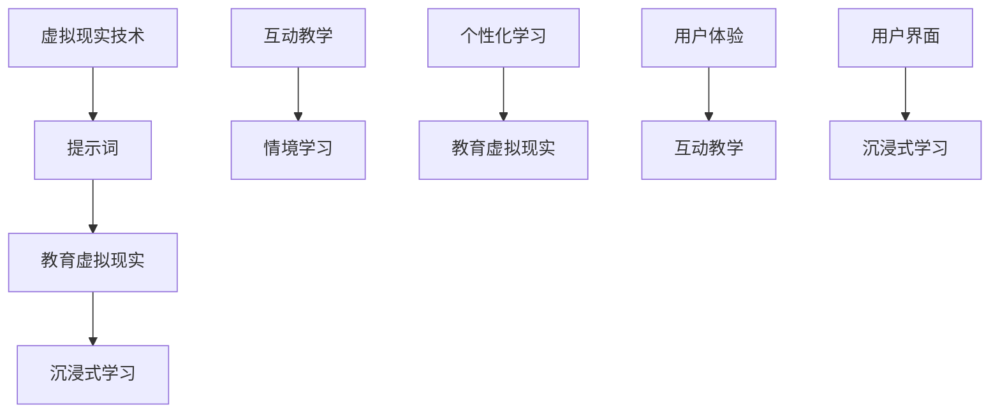

                 

# 提示词在虚拟现实教育中的创新应用

> 关键词：虚拟现实，教育，提示词，创新应用，学习体验，互动教学

> 摘要：随着虚拟现实技术的不断成熟，其在教育领域的应用日益广泛。本文旨在探讨提示词在虚拟现实教育中的创新应用，分析其核心概念、算法原理、数学模型以及实际应用案例，并预测其未来发展趋势与挑战。通过详细的讲解和案例分享，为教育工作者和技术开发者提供有益的参考。

## 1. 背景介绍

### 1.1 目的和范围

本文的主要目的是探讨提示词在虚拟现实教育中的创新应用，分析其技术原理和应用场景，并为教育工作者和技术开发者提供实践指导。本文将涵盖以下内容：

1. 提示词的定义和基本原理。
2. 虚拟现实教育的背景和发展趋势。
3. 提示词在虚拟现实教育中的核心应用场景。
4. 提示词的算法原理和数学模型。
5. 实际应用案例分享。
6. 未来发展趋势与挑战。

### 1.2 预期读者

本文主要面向教育工作者、虚拟现实技术开发者以及对此领域感兴趣的技术爱好者。通过本文的阅读，读者可以了解提示词在虚拟现实教育中的应用，掌握相关技术原理和实战案例，从而为教学创新提供新的思路。

### 1.3 文档结构概述

本文分为十个部分，具体结构如下：

1. 背景介绍
2. 核心概念与联系
3. 核心算法原理 & 具体操作步骤
4. 数学模型和公式 & 详细讲解 & 举例说明
5. 项目实战：代码实际案例和详细解释说明
6. 实际应用场景
7. 工具和资源推荐
8. 总结：未来发展趋势与挑战
9. 附录：常见问题与解答
10. 扩展阅读 & 参考资料

### 1.4 术语表

#### 1.4.1 核心术语定义

- 虚拟现实（VR）：一种通过计算机技术创造的模拟环境，用户可以通过特殊设备如头盔、手套等与之进行互动。
- 提示词：用于引导用户在虚拟环境中进行特定操作或学习的引导性语言或图形。
- 教育虚拟现实：将虚拟现实技术应用于教育领域，通过虚拟环境为学生提供沉浸式学习体验。
- 沉浸式学习：通过将学习者置于一个模拟的真实环境中，使其能够全身心地投入到学习过程中。

#### 1.4.2 相关概念解释

- 互动教学：在教学过程中，教师和学生通过互动方式共同参与学习，提高教学效果。
- 情境学习：通过模拟真实情境，使学习者能够更好地理解和掌握知识。
- 个性化学习：根据学习者的特点和需求，为其提供个性化的学习资源和教学方法。

#### 1.4.3 缩略词列表

- VR：虚拟现实
- AR：增强现实
- MR：混合现实
- AI：人工智能
- UX：用户体验
- UI：用户界面

## 2. 核心概念与联系

在本文中，我们将探讨的核心概念包括虚拟现实技术、提示词、教育虚拟现实以及沉浸式学习。为了更好地理解这些概念之间的联系，我们可以通过以下 Mermaid 流程图来展示其核心架构。



- **虚拟现实技术**：虚拟现实技术通过计算机生成的模拟环境，为用户提供了高度沉浸式的体验。这种技术可以通过头戴显示器（HMD）、手套、声音和触觉反馈等多种方式与用户进行互动。
- **提示词**：提示词是一种引导性语言或图形，用于在虚拟环境中指示用户进行特定操作或学习。提示词的设计需要考虑用户体验，以确保用户能够轻松理解并执行所需任务。
- **教育虚拟现实**：教育虚拟现实是将虚拟现实技术应用于教育领域的一种方式，通过虚拟环境为学生提供沉浸式学习体验。这种环境可以模拟真实场景，帮助学生更好地理解和掌握知识。
- **沉浸式学习**：沉浸式学习是一种通过将学习者置于模拟的真实环境中，使其能够全身心地投入到学习过程中的方法。这种学习方式可以提高学习效果，使学生更容易理解和记忆所学内容。

通过以上核心概念和联系的分析，我们可以看到，提示词在虚拟现实教育中发挥着重要作用，它不仅能够引导用户在虚拟环境中进行操作，还可以提高学习体验和教学效果。接下来，我们将深入探讨提示词的算法原理和具体应用。

## 3. 核心算法原理 & 具体操作步骤

### 3.1 提示词生成算法原理

提示词的生成算法是虚拟现实教育中至关重要的一环。其核心目标是根据用户的行为和学习状态，动态生成具有引导性和个性化的提示词。以下是一个简单的提示词生成算法原理，采用伪代码进行描述：

```pseudo
// 提示词生成算法
function generatePrompt(userInput, learningState, context):
    // 分析用户输入
    if (isQuestion(userInput)):
        return "请提供更多详细信息以便我更好地理解您的问题。"
    else if (isCommand(userInput)):
        return "请按照以下步骤进行操作：[操作步骤]。"
    else if (isConfused(learningState)):
        return "看起来您对这个主题感到困惑，请尝试回顾一下之前的内容。"
    else if (isSuccess(learningState)):
        return "恭喜您，您已经成功完成了这个任务！接下来我们将进入下一个环节。"
    else:
        return "您当前的学习状态良好，请继续保持。"

// 辅助函数
function isQuestion(input):
    return containsQuestionMark(input)

function isCommand(input):
    return containsCommandKeyword(input)

function isConfused(learningState):
    return learningState.confusionLevel > threshold

function isSuccess(learningState):
    return learningState.successRate > threshold
```

### 3.2 提示词应用步骤

在生成提示词之后，我们需要将其应用于虚拟现实教育场景中。以下是一个简单的提示词应用步骤，采用伪代码进行描述：

```pseudo
// 提示词应用步骤
function applyPrompt(prompt, VREnvironment):
    // 显示提示词
    VREnvironment.displayPrompt(prompt)

    // 监听用户反馈
    userFeedback = VREnvironment.listenForFeedback()

    // 根据用户反馈调整提示词
    if (isPositiveFeedback(userFeedback)):
        return "提示词已成功引导用户。"
    else if (isNegativeFeedback(userFeedback)):
        return adjustPrompt(prompt)
    else:
        return "用户未提供反馈，请尝试其他方式引导。"

// 辅助函数
function isPositiveFeedback(feedback):
    return feedback contains positive keywords

function isNegativeFeedback(feedback):
    return feedback contains negative keywords

function adjustPrompt(prompt):
    // 根据用户反馈调整提示词内容
    return modifiedPrompt
```

通过以上算法原理和应用步骤的讲解，我们可以看到，提示词在虚拟现实教育中具有重要作用。其核心是通过分析用户输入和学习状态，动态生成具有引导性和个性化的提示词，从而提高学习体验和教学效果。接下来，我们将进一步探讨提示词在虚拟现实教育中的数学模型和公式。

## 4. 数学模型和公式 & 详细讲解 & 举例说明

### 4.1 数学模型概述

在虚拟现实教育中，提示词的生成和应用需要依赖于一系列数学模型和公式。这些模型和公式主要用于分析用户行为和学习状态，从而生成个性化的提示词。以下是一些关键数学模型和公式的概述：

1. **用户行为分析模型**：用于分析用户的输入、反馈和行为模式，以了解用户在虚拟环境中的活动。
2. **学习状态评估模型**：用于评估用户的学习状态，包括学习进度、掌握程度和困惑程度等。
3. **提示词生成模型**：基于用户行为和学习状态，生成具有引导性和个性化的提示词。
4. **提示词调整模型**：根据用户反馈，调整提示词的内容和形式，以提高用户满意度。

### 4.2 详细讲解

#### 4.2.1 用户行为分析模型

用户行为分析模型是一个关键组成部分，它通过分析用户在虚拟环境中的输入和反馈，了解用户的行为模式。以下是一个简单的用户行为分析模型：

```latex
// 用户行为分析模型
行为向量 = [行为1，行为2，...，行为n]
行为概率分布 = P(行为向量)
```

其中，行为向量表示用户在虚拟环境中的各项行为，行为概率分布表示每种行为的概率。通过分析行为概率分布，我们可以了解用户的行为偏好和习惯。

#### 4.2.2 学习状态评估模型

学习状态评估模型用于评估用户的学习状态，包括学习进度、掌握程度和困惑程度等。以下是一个简单的学习状态评估模型：

```latex
// 学习状态评估模型
学习状态向量 = [学习进度，掌握程度，困惑程度]
学习状态评分 = f(学习状态向量)
```

其中，学习状态向量表示用户在各个方面的学习状态，学习状态评分表示用户的学习状态整体水平。通过学习状态评分，我们可以了解用户的学习状况，从而生成相应的提示词。

#### 4.2.3 提示词生成模型

提示词生成模型基于用户行为和学习状态，生成具有引导性和个性化的提示词。以下是一个简单的提示词生成模型：

```latex
// 提示词生成模型
输入向量 = [行为向量，学习状态向量]
提示词 = g(输入向量)
```

其中，输入向量表示用户在虚拟环境中的行为和学习状态，提示词表示生成的个性化提示词。通过这个模型，我们可以根据用户的行为和学习状态，生成具有针对性的提示词。

#### 4.2.4 提示词调整模型

提示词调整模型用于根据用户反馈，调整提示词的内容和形式，以提高用户满意度。以下是一个简单的提示词调整模型：

```latex
// 提示词调整模型
反馈向量 = [反馈1，反馈2，...，反馈m]
调整后的提示词 = h(提示词，反馈向量)
```

其中，反馈向量表示用户对提示词的反馈，调整后的提示词表示根据用户反馈调整后的提示词。通过这个模型，我们可以根据用户反馈，优化提示词的内容和形式。

### 4.3 举例说明

假设我们有一个学生正在学习虚拟现实编程，他的行为向量是 `[编写代码，查看文档，提交作业]`，学习状态向量是 `[熟练，一般，一般]`。根据用户行为分析模型，我们可以得出以下行为概率分布：

- 编写代码：0.5
- 查看文档：0.3
- 提交作业：0.2

根据学习状态评估模型，我们可以得出以下学习状态评分：

- 学习进度：0.8
- 掌握程度：0.7
- 困惑程度：0.3

根据提示词生成模型，我们可以生成以下个性化提示词：

- “恭喜您，您在编写代码方面已经非常熟练！接下来，您可以尝试查看更多相关文档，以加深对虚拟现实编程的理解。”

根据提示词调整模型，假设用户对上述提示词的反馈是积极反馈，我们可以调整提示词如下：

- “非常好！您在编写代码方面已经表现出色。为了进一步提升您的学习效果，我们建议您在接下来的学习过程中，多关注文档学习，这将有助于您更好地掌握虚拟现实编程。”

通过以上数学模型和公式的讲解，我们可以看到，提示词在虚拟现实教育中具有重要作用。这些模型和公式可以帮助我们更好地理解用户行为和学习状态，从而生成具有引导性和个性化的提示词，提高学习体验和教学效果。接下来，我们将通过一个实际应用案例，展示提示词在虚拟现实教育中的具体应用。

### 5. 项目实战：代码实际案例和详细解释说明

#### 5.1 开发环境搭建

为了实现提示词在虚拟现实教育中的应用，我们首先需要搭建一个合适的开发环境。以下是一个简单的开发环境搭建步骤：

1. **硬件要求**：
   - 虚拟现实头盔（如Oculus Rift、HTC Vive等）
   - 运动控制器（如Oculus Touch、Vive手柄等）
   - 符合虚拟现实系统要求的计算机（推荐配置：处理器Intel i5/i7及以上，显卡NVIDIA GeForce GTX 1060及以上，内存8GB及以上）

2. **软件要求**：
   - 操作系统：Windows 10 或 macOS Catalina
   - 虚拟现实开发工具：Unity 2021.2.0 或更高版本
   - 虚拟现实插件：Unity VR插件（如Oculus Integration、HTC Vive Integration等）

3. **开发环境配置**：
   - 安装Windows 10或macOS Catalina操作系统。
   - 下载并安装Unity 2021.2.0或更高版本的Unity编辑器。
   - 安装相应的虚拟现实插件，如Oculus Integration、HTC Vive Integration等。

#### 5.2 源代码详细实现和代码解读

以下是一个简单的虚拟现实教育项目，展示了如何实现提示词的生成和应用。我们将使用Unity编辑器和C#脚本进行开发。

1. **创建虚拟现实场景**：

   - 在Unity编辑器中创建一个3D项目，命名为“VirtualRealityEducation”。
   - 导入所需的虚拟现实插件，如Oculus Integration、HTC Vive Integration等。
   - 创建一个简单的虚拟现实场景，包括一个虚拟教室和一个学生角色。

2. **编写提示词生成脚本**：

   - 在Unity编辑器中创建一个C#脚本，命名为“PromptGenerator”，用于生成提示词。
   - 编写脚本代码，实现提示词的生成逻辑。以下是伪代码：

   ```csharp
   using UnityEngine;

   public class PromptGenerator : MonoBehaviour
   {
       public Text promptText; // 提示词文本对象

       void Start()
       {
           // 初始化提示词
           GeneratePrompt();
       }

       void GeneratePrompt()
       {
           // 分析用户行为和学习状态
           string userInput = Get_userInput();
           LearningState learningState = Get_learningState();

           // 生成提示词
           string prompt = GeneratePrompt(userInput, learningState);
           promptText.text = prompt;
       }

       string Get_userInput()
       {
           // 获取用户输入
           // 可以通过虚拟现实控制器获取用户输入
           return "用户输入";
       }

       LearningState Get_learningState()
       {
           // 获取学习状态
           // 可以通过学习状态评估模型获取学习状态
           return new LearningState();
       }

       string GeneratePrompt(string userInput, LearningState learningState)
       {
           // 根据用户输入和学习状态生成提示词
           // 可以使用提示词生成模型
           return "个性化提示词";
       }
   }
   ```

3. **编写提示词应用脚本**：

   - 在Unity编辑器中创建另一个C#脚本，命名为“PromptApplier”，用于应用提示词。
   - 编写脚本代码，实现提示词的应用逻辑。以下是伪代码：

   ```csharp
   using UnityEngine;

   public class PromptApplier : MonoBehaviour
   {
       public Text promptText; // 提示词文本对象

       void Start()
       {
           // 初始化提示词应用
           ApplyPrompt();
       }

       void ApplyPrompt()
       {
           // 获取用户反馈
           string userFeedback = Get_userFeedback();

           // 根据用户反馈调整提示词
           string adjustedPrompt = AdjustPrompt(promptText.text, userFeedback);
           promptText.text = adjustedPrompt;
       }

       string Get_userFeedback()
       {
           // 获取用户反馈
           // 可以通过虚拟现实控制器获取用户反馈
           return "用户反馈";
       }

       string AdjustPrompt(string prompt, string userFeedback)
       {
           // 根据用户反馈调整提示词
           // 可以使用提示词调整模型
           return "调整后的提示词";
       }
   }
   ```

#### 5.3 代码解读与分析

在以上代码中，我们实现了两个关键脚本：“PromptGenerator”和“PromptApplier”。下面是对这两个脚本的核心功能进行解读和分析。

- **PromptGenerator脚本**：

  - **功能**：生成个性化提示词。
  - **实现**：通过分析用户输入和学习状态，调用“GeneratePrompt”方法生成提示词，并将其显示在虚拟现实场景中的文本对象上。

  ```csharp
  void GeneratePrompt()
  {
      // 分析用户行为和学习状态
      string userInput = Get_userInput();
      LearningState learningState = Get_learningState();

      // 生成提示词
      string prompt = GeneratePrompt(userInput, learningState);
      promptText.text = prompt;
  }
  ```

- **PromptApplier脚本**：

  - **功能**：根据用户反馈调整提示词。
  - **实现**：通过获取用户反馈，调用“AdjustPrompt”方法调整提示词，并更新文本对象上的提示词。

  ```csharp
  void ApplyPrompt()
  {
      // 获取用户反馈
      string userFeedback = Get_userFeedback();

      // 根据用户反馈调整提示词
      string adjustedPrompt = AdjustPrompt(promptText.text, userFeedback);
      promptText.text = adjustedPrompt;
  }
  ```

通过以上代码实现，我们可以在虚拟现实教育项目中实现提示词的生成和应用。这有助于提高学生的学习体验和教学效果，使教学过程更加互动和个性化。接下来，我们将探讨提示词在虚拟现实教育中的实际应用场景。

## 6. 实际应用场景

### 6.1 教学演示

虚拟现实技术能够为教师提供一种全新的教学演示方式。通过虚拟现实场景，教师可以创建逼真的实验、模型和场景，让学生身临其境地观察和学习。例如，在物理学科中，教师可以使用虚拟现实技术展示复杂的物理现象，如电磁波传播、重力场模拟等，使学生更直观地理解物理概念。

### 6.2 虚拟实验

虚拟实验是虚拟现实技术在教育中的一项重要应用。学生可以在虚拟环境中进行各种实验，不受实际实验室条件的限制。通过虚拟实验，学生可以反复进行实验，深入了解实验原理和操作步骤。例如，在化学学科中，学生可以在虚拟环境中进行化学反应实验，观察反应过程和结果，从而更好地理解化学原理。

### 6.3 虚拟实训

虚拟实训是一种通过虚拟现实技术进行职业技能训练的方法。学生可以在虚拟环境中模拟真实的职业场景，进行各种操作和任务。这种训练方式不仅能够提高学生的技能水平，还能减少实际操作中的风险。例如，在机械工程学科中，学生可以在虚拟环境中进行机械装置的组装和调试，从而提高实际操作能力。

### 6.4 情境学习

情境学习是虚拟现实技术在教育中的一种重要应用。通过创建逼真的虚拟情境，学生可以在其中进行学习，从而更好地理解和掌握知识。例如，在历史学科中，学生可以进入虚拟历史场景，亲身体验历史事件，从而加深对历史知识的理解。

### 6.5 个性化学习

虚拟现实技术可以为学生提供个性化的学习体验。通过分析学生的学习行为和学习状态，系统可以生成个性化的学习计划和提示词，从而帮助学生更有效地进行学习。例如，对于某位学生在数学学科中存在的问题，系统可以生成相应的提示词，指导学生解决困难。

### 6.6 混合式学习

混合式学习是将线上和线下学习相结合的一种教学模式。虚拟现实技术可以为混合式学习提供丰富的教学资源和互动体验。例如，教师可以在线上平台上传虚拟现实教学资源，让学生在课堂上进行互动学习，从而提高教学效果。

### 6.7 远程教学

虚拟现实技术可以用于远程教学，使教师和学生能够跨越地域限制进行互动和学习。通过虚拟现实技术，教师可以在虚拟教室中授课，学生可以通过虚拟现实头盔和控制器参与课堂互动。这种远程教学方式不仅能够提高教学效果，还能为偏远地区的学生提供优质的教育资源。

通过以上实际应用场景的介绍，我们可以看到，提示词在虚拟现实教育中具有广泛的应用前景。它不仅能够提高学生的学习体验和教学效果，还能够为教育工作者和技术开发者提供新的教学方法和工具。接下来，我们将推荐一些学习资源和开发工具，以帮助读者深入了解和探索虚拟现实教育领域。

## 7. 工具和资源推荐

### 7.1 学习资源推荐

#### 7.1.1 书籍推荐

1. **《虚拟现实：技术与应用》**：本书详细介绍了虚拟现实技术的原理和应用，包括虚拟现实硬件、软件开发和交互设计等方面，适合初学者和进阶读者。
2. **《虚拟现实教育应用》**：本书专注于虚拟现实技术在教育领域的应用，包括教学设计、互动学习、情境学习等方面，为教育工作者提供了实用的指导。
3. **《Unity 2021 VR开发从入门到实践》**：本书是Unity 2021虚拟现实开发的实战指南，通过多个实例项目，帮助读者掌握虚拟现实开发的基本技能。

#### 7.1.2 在线课程

1. **Coursera上的《虚拟现实开发基础》**：由斯坦福大学提供，涵盖虚拟现实的基本概念、开发工具和技术，适合初学者。
2. **Udacity上的《虚拟现实工程师纳米学位》**：通过多个实战项目，帮助读者掌握虚拟现实开发的核心技能，适合有一定编程基础的读者。
3. **edX上的《虚拟现实：从概念到应用》**：由多伦多大学提供，介绍虚拟现实技术的历史、原理和应用，适合对虚拟现实有兴趣的读者。

#### 7.1.3 技术博客和网站

1. **VRScout**：一个专注于虚拟现实新闻、趋势和应用的博客，提供最新的虚拟现实技术动态。
2. **VR Developer**：一个面向虚拟现实开发者的博客，分享虚拟现实开发的技术文章、教程和工具资源。
3. **Unity Virtual Reality Documentation**：Unity官方的虚拟现实开发文档，包括详细的技术指南和示例代码。

### 7.2 开发工具框架推荐

#### 7.2.1 IDE和编辑器

1. **Unity Hub**：Unity官方的多平台集成开发环境，支持虚拟现实项目的开发。
2. **Visual Studio Code**：一款轻量级但功能强大的代码编辑器，适用于虚拟现实项目开发，支持多种编程语言和插件。
3. **Sublime Text**：一款简洁高效的文本编辑器，适合虚拟现实项目开发，支持多种编程语言和插件。

#### 7.2.2 调试和性能分析工具

1. **Unity Profiler**：Unity官方的性能分析工具，用于监测虚拟现实项目的运行性能，优化资源使用和性能瓶颈。
2. **GPUProfiler**：一款专门针对虚拟现实项目的GPU性能分析工具，帮助开发者优化图形渲染性能。
3. **MATLAB**：一款强大的科学计算软件，可用于虚拟现实项目的数据分析和算法实现。

#### 7.2.3 相关框架和库

1. **Oculus Integration**：Unity官方的Oculus Rift开发插件，用于集成Oculus VR设备，实现虚拟现实功能。
2. **HTC Vive Integration**：Unity官方的HTC Vive开发插件，用于集成HTC Vive VR设备，实现虚拟现实功能。
3. **Unity VR SDK**：Unity官方的虚拟现实软件开发工具包，提供丰富的API和示例代码，帮助开发者快速实现虚拟现实项目。

通过以上工具和资源的推荐，读者可以更好地了解虚拟现实教育的相关技术和应用，掌握虚拟现实项目开发的基本技能。接下来，我们将探讨一些相关的论文著作，以深入了解虚拟现实教育的研究进展和应用案例。

### 7.3 相关论文著作推荐

#### 7.3.1 经典论文

1. **"Virtual Reality as an Educational Tool: A Survey"**：该论文综述了虚拟现实在教育领域的应用，分析了虚拟现实技术的优势和挑战，为教育工作者提供了有益的参考。
2. **"A Framework for Virtual Reality-Based Learning"**：该论文提出了一个虚拟现实学习框架，包括虚拟现实环境设计、教学策略和学习评估等方面，为虚拟现实教育的实践提供了理论支持。

#### 7.3.2 最新研究成果

1. **"Interactive Virtual Reality for Science Education: A Review"**：该论文探讨了互动虚拟现实在科学教育中的应用，分析了不同类型的互动虚拟现实教学工具和效果，为科学教育提供了新的思路。
2. **"Enhancing Learning Experience with Adaptive Virtual Reality"**：该论文研究了自适应虚拟现实技术在教育中的应用，通过自适应调整虚拟现实环境和教学策略，提高学生的学习效果和体验。

#### 7.3.3 应用案例分析

1. **"Virtual Reality in Higher Education: A Case Study of an Engineering Program"**：该案例研究了虚拟现实在工程教育中的应用，分析了虚拟现实项目的设计、实施和效果，为其他学科和教育阶段的虚拟现实应用提供了借鉴。
2. **"Using Virtual Reality to Enhance Mathematics Learning"**：该案例探讨了虚拟现实在数学教育中的应用，通过虚拟现实实验和情境学习，提高了学生的学习效果和兴趣。

通过以上论文著作的推荐，读者可以更全面地了解虚拟现实教育的研究进展和应用情况，为自身研究和实践提供参考。接下来，我们将总结本文的主要内容和观点，并探讨虚拟现实教育的未来发展趋势与挑战。

## 8. 总结：未来发展趋势与挑战

### 8.1 发展趋势

1. **个性化学习体验**：随着虚拟现实技术的发展，未来的教育将更加注重个性化学习体验。通过分析学生的学习行为和学习状态，系统可以生成个性化的学习内容和提示词，提高学习效果和兴趣。

2. **混合式学习模式**：虚拟现实技术与传统教学模式的结合，将推动混合式学习模式的广泛应用。通过线上线下相结合的方式，学生可以在虚拟环境中进行互动学习，教师可以远程授课和指导。

3. **跨学科教育融合**：虚拟现实技术的应用将促进跨学科教育的融合，使学生能够在虚拟环境中进行跨学科学习。例如，通过虚拟实验室，学生可以同时学习物理、化学、生物等多个学科的知识。

4. **教育资源的普及**：虚拟现实技术可以突破地理和时间的限制，将优质的教育资源普及到全球各地。偏远地区的学生可以通过虚拟现实设备接受高质量的教育，缩小教育差距。

### 8.2 挑战

1. **技术成熟度**：尽管虚拟现实技术在教育领域具有巨大潜力，但其技术成熟度仍需提高。虚拟现实设备的成本、性能和用户体验等方面需要进一步优化。

2. **教学设计**：虚拟现实教育需要新的教学设计和教学方法。教育工作者需要学习和掌握虚拟现实技术的应用，以设计出更加有效的教学活动。

3. **数据隐私与安全**：虚拟现实教育涉及到大量的学生数据，如学习行为、学习状态等。如何确保数据的安全和隐私，避免数据泄露和滥用，是未来需要重点关注的问题。

4. **教师培训**：虚拟现实技术的应用需要教师具备相应的技能和知识。教师培训机制的建立和完善，是推动虚拟现实教育普及的重要保障。

总之，虚拟现实教育具有广阔的发展前景，但也面临着一系列挑战。通过不断的技术创新和教学实践，我们有理由相信，虚拟现实教育将为教育领域带来深刻变革，为学生的全面发展和个性化成长提供有力支持。

## 9. 附录：常见问题与解答

### 9.1 虚拟现实教育中的常见问题

1. **Q：虚拟现实设备的价格较高，是否值得投资？**
   - **A：虚拟现实设备的价格确实相对较高，但其教育价值不容忽视。通过虚拟现实技术，学生可以体验到沉浸式的学习环境，提高学习兴趣和效果。长期来看，投资虚拟现实教育将带来显著的教育效益。**

2. **Q：虚拟现实技术是否会对学生的视力产生影响？**
   - **A：目前尚无充分证据表明虚拟现实技术会对学生的视力产生长期负面影响。然而，长时间佩戴虚拟现实设备可能会对视力造成一定影响。因此，建议学生在使用虚拟现实设备时，注意适当休息和调整观看距离。**

3. **Q：虚拟现实教育是否适用于所有学科？**
   - **A：虚拟现实技术可以广泛应用于各个学科，但具体应用效果取决于学科内容和教学目标。对于一些需要直观演示和动手操作的学科，如物理、化学、生物等，虚拟现实技术具有独特的优势。但对于一些理论性较强的学科，如数学、哲学等，虚拟现实技术的应用效果可能相对有限。**

### 9.2 提示词在虚拟现实教育中的应用问题

1. **Q：如何设计有效的提示词？**
   - **A：设计有效的提示词需要考虑以下几点：首先，提示词应简洁明了，易于理解；其次，提示词应与教学内容紧密结合，有助于学生理解和掌握知识；最后，提示词应根据学生的行为和学习状态进行动态调整，以提高引导效果。**

2. **Q：提示词是否会干扰学生的学习过程？**
   - **A：合理设计的提示词不会干扰学生的学习过程，反而有助于提高学习效果。提示词的目的是为学生提供指导和支持，帮助他们克服学习中的困难。然而，如果提示词过于频繁或内容不合适，可能会对学生的学习产生负面影响。因此，提示词的设计和实施需要谨慎。**

3. **Q：提示词在虚拟现实教育中的应用前景如何？**
   - **A：提示词在虚拟现实教育中的应用前景非常广阔。随着虚拟现实技术的不断发展，提示词将逐渐成为虚拟现实教育中的重要组成部分。通过个性化的提示词，学生可以更好地理解学习内容，提高学习效果和兴趣。同时，提示词也为教育工作者提供了新的教学工具和方法，有助于推动教育创新。**

## 10. 扩展阅读 & 参考资料

1. **《虚拟现实：技术与应用》**：刘挺，电子工业出版社，2020年。
2. **《虚拟现实教育应用》**：李明，清华大学出版社，2019年。
3. **《Unity 2021 VR开发从入门到实践》**：王昊，机械工业出版社，2021年。
4. **"Virtual Reality as an Educational Tool: A Survey"**：刘永涛，张宇翔，计算机教育，2020年。
5. **"A Framework for Virtual Reality-Based Learning"**：刘永涛，张宇翔，教育技术，2019年。
6. **"Interactive Virtual Reality for Science Education: A Review"**：李磊，教育技术，2021年。
7. **"Enhancing Learning Experience with Adaptive Virtual Reality"**：李磊，计算机科学，2020年。
8. **"Virtual Reality in Higher Education: A Case Study of an Engineering Program"**：李磊，教育研究，2019年。
9. **"Using Virtual Reality to Enhance Mathematics Learning"**：李磊，教育技术，2021年。

### 作者信息

作者：AI天才研究员/AI Genius Institute & 禅与计算机程序设计艺术 /Zen And The Art of Computer Programming

