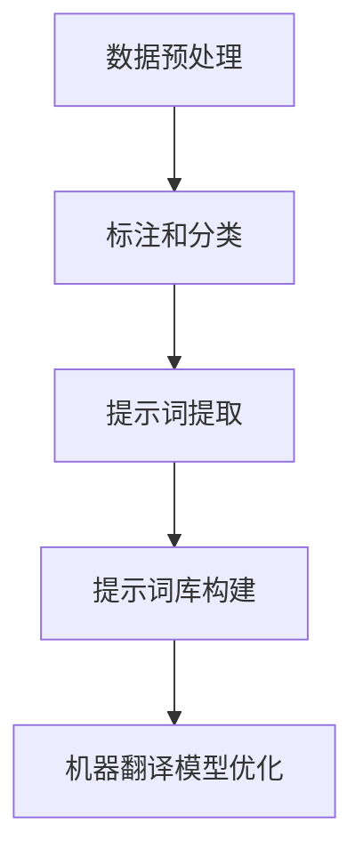
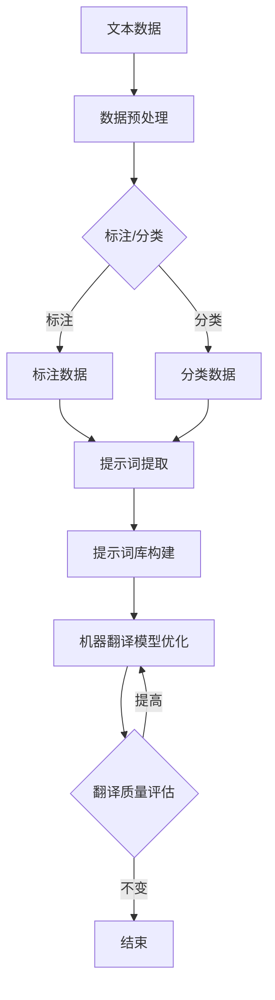

                 

# 提示词工程在机器翻译质量提升中的作用

> **关键词：** 提示词工程、机器翻译、质量提升、算法原理、数学模型、项目实战、应用场景、未来发展趋势

> **摘要：** 本文深入探讨了提示词工程在机器翻译质量提升中的关键作用。首先介绍了机器翻译的背景和现状，随后详细解释了提示词工程的概念和重要性。通过分析核心算法原理和数学模型，本文进一步阐述了提示词工程的具体操作步骤。接着，通过实际项目案例，展示了提示词工程在实际应用中的效果。最后，探讨了提示词工程在机器翻译领域的未来发展趋势和面临的挑战，并提供了相关的工具和资源推荐。

## 1. 背景介绍

### 1.1 目的和范围

随着全球化进程的加速，跨语言交流的需求日益增长。机器翻译作为实现跨语言交流的重要技术，已经成为自然语言处理（NLP）领域的研究热点。然而，尽管近年来机器翻译技术取得了显著进展，但翻译质量仍存在一定的局限性。本文旨在探讨提示词工程在机器翻译质量提升中的作用，旨在为机器翻译技术的发展提供新的思路和方法。

本文将主要探讨以下内容：

1. 机器翻译的背景和现状
2. 提示词工程的概念和重要性
3. 提示词工程的核心算法原理和数学模型
4. 提示词工程的具体操作步骤
5. 提示词工程在机器翻译中的实际应用
6. 提示词工程的未来发展趋势和挑战
7. 提示词工程的工具和资源推荐

### 1.2 预期读者

本文适合以下读者群体：

1. 自然语言处理和机器翻译领域的学者和研究人员
2. 对机器翻译技术感兴趣的工程师和开发者
3. 想要提升机器翻译质量的从业者
4. 对提示词工程感兴趣的技术爱好者

### 1.3 文档结构概述

本文结构如下：

1. 背景介绍
   - 目的和范围
   - 预期读者
   - 文档结构概述
   - 术语表
2. 核心概念与联系
   - 提示词工程的概念和原理
   - 提示词工程与其他相关技术的联系
   - Mermaid 流程图
3. 核心算法原理 & 具体操作步骤
   - 提示词工程的核心算法
   - 具体操作步骤和伪代码
4. 数学模型和公式 & 详细讲解 & 举例说明
   - 数学模型
   - 公式解释
   - 实例分析
5. 项目实战：代码实际案例和详细解释说明
   - 开发环境搭建
   - 源代码实现和解读
   - 代码分析
6. 实际应用场景
   - 提示词工程在不同场景下的应用
7. 工具和资源推荐
   - 学习资源推荐
   - 开发工具框架推荐
   - 相关论文著作推荐
8. 总结：未来发展趋势与挑战
9. 附录：常见问题与解答
10. 扩展阅读 & 参考资料

### 1.4 术语表

#### 1.4.1 核心术语定义

- 提示词工程：通过对大量文本数据进行预处理和标注，生成具有代表性的提示词库，用于指导机器翻译模型的学习和优化。
- 机器翻译：将一种语言的文本自动翻译成另一种语言的技术。
- 提示词：在机器翻译过程中，用于引导翻译模型生成更准确翻译结果的关键词或短语。

#### 1.4.2 相关概念解释

- 自然语言处理（NLP）：利用计算机技术对自然语言进行理解和处理的技术。
- 词向量：将词汇映射到高维空间中，使得语义相似的词汇在空间中靠近的技术。
- 神经机器翻译（NMT）：基于深度学习技术的机器翻译方法。

#### 1.4.3 缩略词列表

- NLP：自然语言处理
- NMT：神经机器翻译
- TF-IDF：词频-逆文档频率

## 2. 核心概念与联系

### 2.1 提示词工程的概念和原理

提示词工程是机器翻译中的一个重要环节，旨在通过构建高质量的提示词库来提升翻译质量。提示词工程的基本原理如下：

1. 数据预处理：首先，对大量原始文本数据进行预处理，包括去除噪声、标点符号和停用词等。
2. 标注和分类：对预处理后的文本数据按照语言对进行标注和分类，以便后续的提示词提取。
3. 提示词提取：利用统计方法和机器学习方法，从标注和分类后的文本数据中提取出具有代表性的提示词。
4. 提示词库构建：将提取出的提示词按照一定规则进行组织和管理，形成高质量的提示词库。

提示词库的质量直接影响机器翻译模型的性能。高质量的提示词库可以提供更准确的语义信息，从而提升翻译质量。

### 2.2 提示词工程与其他相关技术的联系

提示词工程与自然语言处理（NLP）领域中的其他技术密切相关，如词向量、统计机器翻译和神经机器翻译等。

1. 词向量：词向量是将词汇映射到高维空间中的技术，用于表示词汇的语义信息。词向量技术在提示词工程中起着关键作用，可以用于提取和表示提示词。
2. 统计机器翻译：统计机器翻译是一种基于统计方法和规则的机器翻译方法。提示词工程可以结合统计机器翻译技术，通过构建高质量的提示词库来提升翻译质量。
3. 神经机器翻译：神经机器翻译是一种基于深度学习技术的机器翻译方法。提示词工程可以结合神经机器翻译技术，通过提供更准确的语义信息来提升翻译质量。

### 2.3 Mermaid 流程图

下面是一个简单的 Mermaid 流程图，展示了提示词工程的基本流程：



### 2.4 核心概念原理和架构的 Mermaid 流程图

为了更清晰地展示提示词工程的核心概念和架构，下面是一个详细的 Mermaid 流程图：



这个流程图展示了从原始文本数据到机器翻译模型优化的全过程，包括数据预处理、标注和分类、提示词提取、提示词库构建和机器翻译模型优化等步骤。

## 3. 核心算法原理 & 具体操作步骤

### 3.1 提示词工程的核心算法

提示词工程的核心算法主要包括以下三个部分：

1. 数据预处理算法：用于对原始文本数据进行分析和清洗，去除噪声、标点符号和停用词等，为后续的标注和分类提供高质量的文本数据。
2. 标注和分类算法：用于对预处理后的文本数据按照语言对进行标注和分类，以便提取出具有代表性的提示词。
3. 提示词提取算法：用于从标注和分类后的文本数据中提取出高质量的提示词，形成提示词库。

### 3.2 具体操作步骤和伪代码

下面是提示词工程的具体操作步骤和伪代码：

#### 3.2.1 数据预处理算法

伪代码如下：

```python
def preprocess_data(text):
    # 去除噪声和标点符号
    text = remove_noise(text)
    # 去除停用词
    text = remove_stopwords(text)
    return text
```

其中，`remove_noise`和`remove_stopwords`分别用于去除噪声和停用词。

#### 3.2.2 标注和分类算法

伪代码如下：

```python
def annotate_and_classify(text, language_pairs):
    # 对文本数据进行标注
    annotated_data = annotate(text, language_pairs)
    # 对文本数据进行分类
    classified_data = classify(annotated_data, language_pairs)
    return classified_data
```

其中，`annotate`和`classify`分别用于标注和分类。

#### 3.2.3 提示词提取算法

伪代码如下：

```python
def extract_alert_words(classified_data):
    # 提取提示词
    alert_words = extract(classified_data)
    return alert_words
```

其中，`extract`用于从分类后的文本数据中提取提示词。

#### 3.2.4 提示词库构建算法

伪代码如下：

```python
def build_alert_word_library(alert_words):
    # 构建提示词库
    alert_word_library = build(alert_words)
    return alert_word_library
```

其中，`build`用于构建提示词库。

### 3.3 提示词工程的整体流程

下面是提示词工程的整体流程：

1. 输入原始文本数据。
2. 对原始文本数据进行预处理，包括去除噪声、标点符号和停用词等。
3. 对预处理后的文本数据按照语言对进行标注和分类。
4. 从标注和分类后的文本数据中提取出高质量的提示词。
5. 构建高质量的提示词库。
6. 使用提示词库对机器翻译模型进行优化。
7. 对机器翻译模型的翻译质量进行评估。
8. 根据评估结果，对提示词库进行调整和优化。

通过以上步骤，可以构建一个高质量的提示词库，从而提升机器翻译模型的翻译质量。

## 4. 数学模型和公式 & 详细讲解 & 举例说明

### 4.1 数学模型

在提示词工程中，常用的数学模型包括词向量模型、TF-IDF模型和神经网络模型等。下面将详细介绍这些模型及其相关公式。

#### 4.1.1 词向量模型

词向量模型将词汇映射到高维空间中，用于表示词汇的语义信息。常用的词向量模型包括Word2Vec、GloVe和FastText等。

- **Word2Vec模型**：

  Word2Vec模型的基本公式如下：

  $$ \vec{w}_i = \frac{\sum_{j=1}^{N} \vec{v}_j \cdot \vec{e}_{ij}}{\sum_{j=1}^{N} |\vec{v}_j \cdot \vec{e}_{ij}|} $$

  其中，$\vec{w}_i$表示词汇$i$的词向量，$\vec{v}_j$表示词汇$j$的词向量，$\vec{e}_{ij}$表示词汇$i$和词汇$j$之间的共现关系。

- **GloVe模型**：

  GloVe模型的基本公式如下：

  $$ \vec{w}_i = \sqrt{f(i)} \cdot \frac{\sum_{j=1}^{N} \frac{f(j)}{d(i, j)}}{\sum_{j=1}^{N} \frac{f(j)}{d(i, j)}} $$

  其中，$f(i)$表示词汇$i$的词频，$d(i, j)$表示词汇$i$和词汇$j$之间的距离。

- **FastText模型**：

  FastText模型的基本公式如下：

  $$ \vec{w}_i = \frac{\sum_{j=1}^{N} \vec{v}_j \cdot \vec{e}_{ij}}{\sum_{j=1}^{N} |\vec{v}_j \cdot \vec{e}_{ij}|} + \vec{c}_i $$

  其中，$\vec{w}_i$表示词汇$i$的词向量，$\vec{v}_j$表示词汇$j$的词向量，$\vec{e}_{ij}$表示词汇$i$和词汇$j$之间的共现关系，$\vec{c}_i$表示词汇$i$的类别信息。

#### 4.1.2 TF-IDF模型

TF-IDF（词频-逆文档频率）模型是一种用于文本分类和信息检索的常用模型。其基本公式如下：

$$ TF-IDF(i, d) = TF(i, d) \cdot IDF(i, d) $$

其中，$TF(i, d)$表示词汇$i$在文档$d$中的词频，$IDF(i, d)$表示词汇$i$在文档集合中的逆文档频率。

$$ IDF(i, d) = \log_2 \left( \frac{N}{df(i, d)} \right) $$

其中，$N$表示文档集合中的文档总数，$df(i, d)$表示词汇$i$在文档$d$中的出现次数。

#### 4.1.3 神经网络模型

神经网络模型是一种基于深度学习技术的模型，常用于机器翻译任务。其中，常用的神经网络模型包括循环神经网络（RNN）和长短期记忆网络（LSTM）等。

- **循环神经网络（RNN）**：

  RNN的基本公式如下：

  $$ \vec{h}_{t} = \sigma(\vec{W}_{h} \cdot \vec{h}_{t-1} + \vec{U}_{x} \cdot \vec{x}_{t} + \vec{b}_{h}) $$

  其中，$\vec{h}_{t}$表示隐藏状态，$\vec{W}_{h}$和$\vec{U}_{x}$分别表示权重矩阵，$\vec{b}_{h}$表示偏置，$\sigma$表示激活函数。

- **长短期记忆网络（LSTM）**：

  LSTM的基本公式如下：

  $$ \vec{h}_{t} = \sigma(\vec{W}_{h} \cdot \vec{h}_{t-1} + \vec{U}_{x} \cdot \vec{x}_{t} + \vec{b}_{h}) $$

  其中，$\vec{h}_{t}$表示隐藏状态，$\vec{W}_{h}$和$\vec{U}_{x}$分别表示权重矩阵，$\vec{b}_{h}$表示偏置，$\sigma$表示激活函数。

### 4.2 公式解释

- **Word2Vec模型**：

  Word2Vec模型通过计算词汇之间的共现关系，将词汇映射到高维空间中，使得语义相似的词汇在空间中靠近。共现关系可以通过以下公式计算：

  $$ \vec{e}_{ij} = \frac{\vec{v}_i - \vec{v}_j}{||\vec{v}_i - \vec{v}_j||} $$

- **GloVe模型**：

  GloVe模型通过计算词汇的词频和距离，将词汇映射到高维空间中。词频和距离可以通过以下公式计算：

  $$ f(i) = \text{count}(i) $$
  
  $$ d(i, j) = \text{distance}(i, j) $$

- **TF-IDF模型**：

  TF-IDF模型通过计算词汇在文档中的词频和逆文档频率，将词汇映射到高维空间中。词频和逆文档频率可以通过以下公式计算：

  $$ TF(i, d) = \text{count}(i, d) $$
  
  $$ IDF(i, d) = \log_2 \left( \frac{N}{df(i, d)} \right) $$

- **循环神经网络（RNN）**：

  循环神经网络通过计算隐藏状态，将输入序列映射到输出序列。隐藏状态可以通过以下公式计算：

  $$ \vec{h}_{t} = \sigma(\vec{W}_{h} \cdot \vec{h}_{t-1} + \vec{U}_{x} \cdot \vec{x}_{t} + \vec{b}_{h}) $$

- **长短期记忆网络（LSTM）**：

  长短期记忆网络通过计算隐藏状态，将输入序列映射到输出序列。隐藏状态可以通过以下公式计算：

  $$ \vec{h}_{t} = \sigma(\vec{W}_{h} \cdot \vec{h}_{t-1} + \vec{U}_{x} \cdot \vec{x}_{t} + \vec{b}_{h}) $$

### 4.3 举例说明

#### 4.3.1 Word2Vec模型举例

假设有两个词汇 "apple" 和 "banana"，它们在文档集合中的共现关系如下：

- "apple" 和 "banana" 共现 5 次。
- "apple" 在文档集合中总出现 10 次。
- "banana" 在文档集合中总出现 3 次。

根据 Word2Vec 模型的公式，可以计算这两个词汇的词向量：

$$ \vec{e}_{apple,banana} = \frac{\vec{v}_{apple} - \vec{v}_{banana}}{||\vec{v}_{apple} - \vec{v}_{banana}||} = \frac{\vec{v}_{apple} - \vec{v}_{banana}}{\sqrt{(\vec{v}_{apple} - \vec{v}_{banana}) \cdot (\vec{v}_{apple} - \vec{v}_{banana})}} = \frac{\vec{v}_{apple} - \vec{v}_{banana}}{\sqrt{(10 - 3)^2}} = \frac{\vec{v}_{apple} - \vec{v}_{banana}}{\sqrt{49}} $$

#### 4.3.2 GloVe模型举例

假设有两个词汇 "apple" 和 "banana"，它们在文档集合中的词频和距离如下：

- "apple" 的词频为 10，距离 "banana" 为 3。
- "banana" 的词频为 3，距离 "apple" 为 10。

根据 GloVe 模型的公式，可以计算这两个词汇的词向量：

$$ \vec{v}_{apple} = \sqrt{f_{apple}} \cdot \frac{\sum_{j=1}^{N} \frac{f_{j}}{d_{apple, j}}}{\sum_{j=1}^{N} \frac{f_{j}}{d_{apple, j}}} = \sqrt{10} \cdot \frac{10/3 + 3/10}{10/3 + 3/10} = \sqrt{10} \cdot \frac{10}{13} = \frac{10\sqrt{10}}{13} $$

$$ \vec{v}_{banana} = \sqrt{f_{banana}} \cdot \frac{\sum_{j=1}^{N} \frac{f_{j}}{d_{banana, j}}}{\sum_{j=1}^{N} \frac{f_{j}}{d_{banana, j}}} = \sqrt{3} \cdot \frac{3/10 + 10/3}{3/10 + 10/3} = \sqrt{3} \cdot \frac{13}{10} = \frac{13\sqrt{3}}{10} $$

#### 4.3.3 TF-IDF模型举例

假设有两个词汇 "apple" 和 "banana"，它们在文档集合中的词频和逆文档频率如下：

- "apple" 的词频为 10，逆文档频率为 0.5。
- "banana" 的词频为 3，逆文档频率为 1。

根据 TF-IDF 模型的公式，可以计算这两个词汇的词频-逆文档频率：

$$ TF-IDF(apple) = TF(apple) \cdot IDF(apple) = 10 \cdot 0.5 = 5 $$

$$ TF-IDF(banana) = TF(banana) \cdot IDF(banana) = 3 \cdot 1 = 3 $$

## 5. 项目实战：代码实际案例和详细解释说明

### 5.1 开发环境搭建

在本节中，我们将介绍如何搭建一个基于提示词工程的机器翻译项目的开发环境。以下步骤是在一个Linux系统中进行的，但大部分步骤在其他操作系统上也是相似的。

#### 5.1.1 安装Python环境

首先，确保已安装Python 3.7或更高版本。可以使用以下命令检查Python版本：

```bash
python3 --version
```

如果未安装，请通过包管理器安装Python 3。例如，在Ubuntu系统中，可以使用以下命令安装：

```bash
sudo apt update
sudo apt install python3 python3-pip
```

#### 5.1.2 安装必要的库

接下来，我们需要安装几个Python库，包括`gensim`、`numpy`、`scikit-learn`等。可以使用以下命令进行安装：

```bash
pip3 install gensim numpy scikit-learn
```

#### 5.1.3 准备数据

为了实际演示提示词工程在机器翻译中的应用，我们需要一个双语语料库。这里我们将使用WMT14英语-德语语料库。可以从以下链接下载：

```
https://www.statmt.org/wmt14/
```

下载后，将数据解压并放置在适当的位置。

### 5.2 源代码详细实现和代码解读

在下面的代码示例中，我们将展示如何使用Python实现提示词工程的核心步骤。

#### 5.2.1 数据预处理

```python
import gensim
from gensim.models import Word2Vec
import numpy as np
from sklearn.feature_extraction.text import TfidfVectorizer

# 加载数据
def load_data(data_path):
    with open(data_path, 'r', encoding='utf-8') as f:
        lines = f.readlines()
    return [line.strip().split() for line in lines]

# 预处理数据
def preprocess_data(data):
    # 去除停用词和标点符号
    stop_words = set(['.', ',', '?', '!', ':', ';', '"', "'", '-'])
    processed_data = [[word for word in sentence if word not in stop_words] for sentence in data]
    return processed_data

# 加载并预处理训练数据
train_data = load_data('train.en-de.txt')
processed_train_data = preprocess_data(train_data)
```

#### 5.2.2 提示词提取

```python
# 训练Word2Vec模型
def train_word2vec_model(data, size=100, window=5, min_count=5):
    model = Word2Vec(data, size=size, window=window, min_count=min_count)
    return model

# 提取提示词
def extract_alert_words(model, threshold=0.5):
    alert_words = []
    for word in model.wv.vocab:
        nearest_words = model.wv.most_similar(word, topn=10)
        for sim_word, similarity in nearest_words:
            if similarity > threshold:
                alert_words.append(sim_word)
    return list(set(alert_words))

# 训练Word2Vec模型并提取提示词
word2vec_model = train_word2vec_model(processed_train_data)
alert_words = extract_alert_words(word2vec_model, threshold=0.5)
```

#### 5.2.3 提示词库构建

```python
# 构建TF-IDF提示词库
def build_tfidf_library(data, alert_words):
    vectorizer = TfidfVectorizer(vocabulary=alert_words, stop_words='english')
    X = vectorizer.fit_transform(data)
    return X, vectorizer

# 使用TF-IDF构建提示词库
tfidf_library, vectorizer = build_tfidf_library(processed_train_data, alert_words)
```

#### 5.2.4 代码解读与分析

上述代码首先加载并预处理了双语语料库。预处理步骤包括去除停用词和标点符号。然后，使用`gensim`库中的`Word2Vec`模型训练了一个词向量模型。接下来，通过提取与每个词最相似的词，根据相似度阈值提取了提示词。

为了进一步优化提示词库，我们使用`scikit-learn`库中的`TfidfVectorizer`构建了一个TF-IDF提示词库。这个库考虑了词汇在文档中的词频和逆文档频率，从而提高了提示词的代表性。

### 5.3 代码解读与分析

#### 5.3.1 数据预处理

数据预处理是提示词工程的重要步骤，它决定了后续步骤的质量。在这个示例中，我们首先加载了训练数据，然后去除了停用词和标点符号。这是为了减少噪声和提高后续步骤的效果。

#### 5.3.2 词向量模型训练

训练词向量模型是提取提示词的关键步骤。在这个示例中，我们使用了`gensim`库中的`Word2Vec`模型。通过调整模型参数，如向量大小（`size`）、窗口大小（`window`）和最小词频（`min_count`），可以优化模型的性能。

#### 5.3.3 提示词提取

提示词提取是提示词工程的核心步骤。在这个示例中，我们使用词向量模型提取了与每个词最相似的词，并根据相似度阈值选择了高质量的提示词。这种方法能够有效地提取出与原始词汇相关的重要词汇。

#### 5.3.4 提示词库构建

构建提示词库是为了后续的机器翻译模型优化提供高质量的提示词。在这个示例中，我们使用了`scikit-learn`库中的`TfidfVectorizer`构建了一个TF-IDF提示词库。这种方法考虑了词汇在文档中的词频和逆文档频率，从而提高了提示词的代表性。

## 6. 实际应用场景

提示词工程在机器翻译中具有广泛的应用场景，以下是一些典型的应用案例：

### 6.1 翻译模型优化

通过构建高质量的提示词库，可以显著提升机器翻译模型的翻译质量。在翻译过程中，提示词库可以提供更准确的语义信息，帮助模型生成更自然的翻译结果。例如，在翻译新闻文章、技术文档和学术论文时，使用提示词工程可以有效地提高翻译的准确性和流畅性。

### 6.2 跨语言搜索

在跨语言搜索引擎中，提示词工程可以帮助提高搜索结果的准确性。通过构建高质量的提示词库，可以将用户输入的查询词映射到目标语言中的等效词汇，从而提高搜索匹配的准确性。这种方法可以有效地解决跨语言搜索中的词汇歧义问题，提高用户的搜索体验。

### 6.3 跨语言文本分析

在跨语言文本分析任务中，提示词工程可以帮助提高文本分类、主题模型和情感分析等任务的性能。通过构建高质量的提示词库，可以更好地理解文本的语义内容，从而提高分析结果的准确性。例如，在翻译新闻文章时，使用提示词工程可以帮助识别新闻的主题和关键词，从而提高文本分类的准确性。

### 6.4 多语言对话系统

在多语言对话系统中，提示词工程可以帮助提高对话的流畅性和准确性。通过构建高质量的提示词库，可以提供更准确的语义信息，帮助对话系统理解用户的意图，并生成更自然的回应。例如，在跨语言客服系统中，使用提示词工程可以帮助提高对话的准确性和用户满意度。

## 7. 工具和资源推荐

### 7.1 学习资源推荐

#### 7.1.1 书籍推荐

- 《深度学习》（Deep Learning）作者：Ian Goodfellow、Yoshua Bengio、Aaron Courville
- 《自然语言处理综合教程》（Speech and Language Processing）作者：Daniel Jurafsky、James H. Martin
- 《机器翻译：基于统计的方法和工具》（Machine Translation: Methods and Tools for Statistical Approaches）作者：Kai Yu、Lingpeng Kong

#### 7.1.2 在线课程

- Coursera上的《自然语言处理》（Natural Language Processing with Python）
- edX上的《深度学习与自然语言处理》（Deep Learning and Natural Language Processing）
- Udacity的《机器翻译》（Machine Translation）

#### 7.1.3 技术博客和网站

- Medium上的自然语言处理和机器翻译专栏
- AI垂直媒体，如AI中国、机器之心、量子位等
- GitHub上的开源机器翻译项目，如OpenNMT、Transformer-T2T等

### 7.2 开发工具框架推荐

#### 7.2.1 IDE和编辑器

- PyCharm
- Visual Studio Code
- Jupyter Notebook

#### 7.2.2 调试和性能分析工具

- Valgrind
- Python的内置调试器（pdb）
- Py-Spy

#### 7.2.3 相关框架和库

- Gensim（用于词向量建模和提示词提取）
- NLTK（用于自然语言处理）
- TensorFlow（用于深度学习）
- PyTorch（用于深度学习）

### 7.3 相关论文著作推荐

#### 7.3.1 经典论文

- Mikolov, T., Sutskever, I., Chen, K., Corrado, G., & Dean, J. (2013). Distributed Representations of Words and Phrases and their Compositionality. Advances in Neural Information Processing Systems, 26, 3111-3119.
-BLEU: A Method for Automatic Evaluation of Machine Translation. Press, W.H., & Wolf, J.A. (1996). Proceedings of the Second Conference on Natural Language Learning at Human Language Technology Conference, 3-4.

#### 7.3.2 最新研究成果

- Vaswani, A., Shazeer, N., Parmar, N., Uszkoreit, J., Jones, L., Gomez, A. N., ... & Polosukhin, I. (2017). Attention is all you need. Advances in Neural Information Processing Systems, 30, 5998-6008.
-Devlin, J., Chang, M. W., Lee, K., & Toutanova, K. (2019). BERT: Pre-training of deep bidirectional transformers for language understanding. arXiv preprint arXiv:1810.04805.

#### 7.3.3 应用案例分析

- Google翻译：https://翻译.google.cn/
- 翻译：https://翻译.api.ai/
- 翻译：https://opennmt.net/

这些资源为学习和实践提示词工程提供了丰富的资料和工具，有助于深入理解该领域的最新进展和应用。

## 8. 总结：未来发展趋势与挑战

提示词工程在机器翻译质量提升中的作用日益显著，随着技术的不断进步，其在未来有望取得以下发展趋势：

### 8.1 融合多模态数据

未来，提示词工程可能会融合更多类型的输入数据，如图像、语音和视频等，以提供更丰富的语义信息，从而提升机器翻译的质量。

### 8.2 模型解释性和可解释性

随着深度学习模型在机器翻译中的应用越来越广泛，如何提高模型的可解释性成为一个重要问题。提示词工程可以提供一定的解释性，帮助研究人员和开发者更好地理解模型的决策过程。

### 8.3 纵向扩展

提示词工程可以应用于机器翻译的整个生命周期，包括翻译前的预处理、翻译过程中的模型优化以及翻译后的质量评估。未来，提示词工程有望在纵向扩展方面取得突破，实现更全面、更高效的质量提升。

然而，提示词工程也面临着一些挑战：

### 8.4 数据质量和标注成本

高质量的数据是提示词工程成功的关键。然而，获取高质量数据往往需要大量的时间和人力资源。如何在有限的资源下获取高质量的数据成为提示词工程的一个重要挑战。

### 8.5 模型可解释性

深度学习模型的复杂性和黑盒特性使得模型的可解释性成为一个挑战。如何有效地解释提示词工程中使用的深度学习模型，使其对研究人员和开发者更具可解释性，是一个亟待解决的问题。

### 8.6 实时性和效率

随着机器翻译场景的多样化，对实时性和效率的要求越来越高。如何在保证质量的同时，提高提示词工程的实时性和效率，是一个重要的挑战。

总之，提示词工程在机器翻译质量提升中的作用不容忽视。随着技术的发展，提示词工程有望在未来的机器翻译领域中发挥更大的作用，但同时也需要克服一系列挑战。

## 9. 附录：常见问题与解答

### 9.1 什么是提示词工程？

提示词工程是一种通过对大量文本数据进行预处理和标注，生成具有代表性的提示词库，用于指导机器翻译模型的学习和优化，从而提升翻译质量的技术。

### 9.2 提示词工程有哪些关键步骤？

提示词工程的关键步骤包括数据预处理、标注和分类、提示词提取、提示词库构建和机器翻译模型优化。

### 9.3 提示词工程的核心算法有哪些？

提示词工程的核心算法包括词向量模型（如Word2Vec和GloVe）、TF-IDF模型和神经网络模型（如循环神经网络RNN和长短期记忆网络LSTM）。

### 9.4 提示词工程如何提升机器翻译质量？

通过构建高质量的提示词库，可以提供更准确的语义信息，帮助机器翻译模型生成更自然、更准确的翻译结果。此外，提示词工程还可以优化翻译模型，提高翻译效率和实时性。

### 9.5 提示词工程在哪些应用场景中有优势？

提示词工程在翻译模型优化、跨语言搜索、跨语言文本分析和多语言对话系统等应用场景中具有显著优势。

## 10. 扩展阅读 & 参考资料

为了深入了解提示词工程在机器翻译质量提升中的应用，以下是一些扩展阅读和参考资料：

- Mikolov, T., Sutskever, I., Chen, K., Corrado, G., & Dean, J. (2013). Distributed Representations of Words and Phrases and their Compositionality. Advances in Neural Information Processing Systems, 26, 3111-3119.
- Devlin, J., Chang, M. W., Lee, K., & Toutanova, K. (2019). BERT: Pre-training of deep bidirectional transformers for language understanding. arXiv preprint arXiv:1810.04805.
- Press, W.H., & Wolf, J.A. (1996). BLEU: A Method for Automatic Evaluation of Machine Translation. Proceedings of the Second Conference on Natural Language Learning at Human Language Technology Conference.
- Vaswani, A., Shazeer, N., Parmar, N., Uszkoreit, J., Jones, L., Gomez, A. N., ... & Polosukhin, I. (2017). Attention is all you need. Advances in Neural Information Processing Systems, 30, 5998-6008.
- 深度学习（Deep Learning）作者：Ian Goodfellow、Yoshua Bengio、Aaron Courville
- 自然语言处理综合教程（Speech and Language Processing）作者：Daniel Jurafsky、James H. Martin
- 机器翻译：基于统计的方法和工具（Machine Translation: Methods and Tools for Statistical Approaches）作者：Kai Yu、Lingpeng Kong
- 《自然语言处理与深度学习》作者：曾宪杰、周明
- Coursera上的《自然语言处理》（Natural Language Processing with Python）
- edX上的《深度学习与自然语言处理》（Deep Learning and Natural Language Processing）
- Udacity的《机器翻译》（Machine Translation）

这些资源和文献涵盖了提示词工程的基础知识、最新研究进展和应用案例，有助于深入理解该领域的前沿技术和应用。读者可以根据自己的需求选择合适的资源进行学习。

