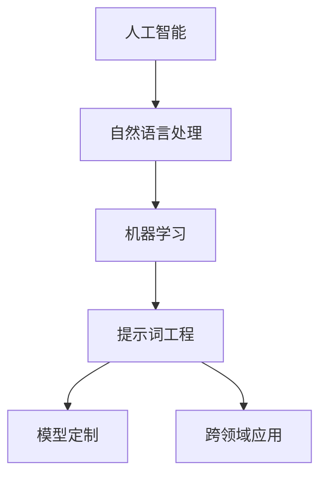

                 

# 提示词工程：AI时代的新兴技能

> **关键词**：提示词工程、人工智能、AI时代、新兴技能、自然语言处理、NLP、机器学习、prompt engineering、模型定制、跨领域应用
> 
> **摘要**：随着人工智能技术的快速发展，提示词工程成为了一个重要的新兴领域。本文将详细介绍提示词工程的定义、核心概念、算法原理、数学模型、项目实战以及实际应用场景。通过深入分析，我们将探讨提示词工程在AI时代的重要性，并为读者提供相关的学习资源和工具推荐。最终，本文将总结提示词工程的发展趋势与挑战，为未来的研究提供方向。

## 1. 背景介绍

### 1.1 目的和范围

本文旨在介绍提示词工程这一AI时代的新兴技能，帮助读者了解其定义、核心概念、算法原理、数学模型、项目实战和实际应用场景。通过对这些内容的深入探讨，我们将揭示提示词工程在人工智能领域的价值，并展望其未来的发展趋势和挑战。

### 1.2 预期读者

本文适合对人工智能、自然语言处理和机器学习有一定基础的读者，特别是希望深入了解提示词工程的研究人员和工程师。同时，对于对AI技术感兴趣的初学者和从业者，本文也将提供有益的指导。

### 1.3 文档结构概述

本文分为十个部分，结构如下：

1. 背景介绍
   - 1.1 目的和范围
   - 1.2 预期读者
   - 1.3 文档结构概述
   - 1.4 术语表
2. 核心概念与联系
   - 2.1 核心概念与联系
3. 核心算法原理 & 具体操作步骤
   - 3.1 核心算法原理
   - 3.2 具体操作步骤
4. 数学模型和公式 & 详细讲解 & 举例说明
   - 4.1 数学模型和公式
   - 4.2 详细讲解
   - 4.3 举例说明
5. 项目实战：代码实际案例和详细解释说明
   - 5.1 开发环境搭建
   - 5.2 源代码详细实现和代码解读
   - 5.3 代码解读与分析
6. 实际应用场景
7. 工具和资源推荐
   - 7.1 学习资源推荐
   - 7.2 开发工具框架推荐
   - 7.3 相关论文著作推荐
8. 总结：未来发展趋势与挑战
9. 附录：常见问题与解答
10. 扩展阅读 & 参考资料

### 1.4 术语表

#### 1.4.1 核心术语定义

- **提示词工程（Prompt Engineering）**：指通过设计、优化和调整提示词，以提高人工智能模型在特定任务上的性能和适应性。
- **自然语言处理（NLP）**：是人工智能领域的一个重要分支，旨在使计算机理解和处理人类语言。
- **机器学习（ML）**：是一门研究如何让计算机从数据中学习，并从中提取有用信息的技术。
- **模型定制（Model Customization）**：指针对特定任务或应用场景，对人工智能模型进行调整和优化，以提高其性能和适应性。
- **跨领域应用（Cross-Domain Application）**：指将提示词工程应用于不同的领域和任务，实现跨领域的知识共享和迁移。

#### 1.4.2 相关概念解释

- **提示词（Prompt）**：在自然语言处理任务中，提示词是指提供给人工智能模型的一段文本或问题，用于引导模型生成目标输出。
- **预训练（Pre-training）**：指在特定任务之前，对人工智能模型进行大规模数据集上的训练，以提高其通用性和适应性。
- **微调（Fine-tuning）**：指在预训练的基础上，针对特定任务或应用场景，对模型进行调整和优化，以进一步提高其性能。
- **数据集（Dataset）**：是指用于训练和评估人工智能模型的数据集合，通常包括输入数据和相应的标签。

#### 1.4.3 缩略词列表

- **AI**：人工智能
- **NLP**：自然语言处理
- **ML**：机器学习
- **PE**：提示词工程
- **PT**：预训练
- **FT**：微调

## 2. 核心概念与联系

在介绍提示词工程的核心概念之前，我们需要先了解一些相关的概念和它们之间的关系。以下是一个简化的Mermaid流程图，展示了这些核心概念之间的联系。



### 2.1 核心概念与联系

1. **人工智能（AI）**：人工智能是一门研究如何让计算机模拟、扩展和辅助人类智能的科学。它涵盖了多个子领域，如机器学习、自然语言处理、计算机视觉等。

2. **自然语言处理（NLP）**：自然语言处理是人工智能的一个重要分支，主要研究如何让计算机理解和处理人类语言。NLP在信息检索、语音识别、机器翻译、文本分类等领域有广泛的应用。

3. **机器学习（ML）**：机器学习是人工智能的一个核心子领域，旨在让计算机从数据中学习，并从中提取有用信息。机器学习算法可以分为监督学习、无监督学习和强化学习等。

4. **提示词工程（PE）**：提示词工程是机器学习中的一个新兴领域，主要研究如何设计、优化和调整提示词，以提高人工智能模型在特定任务上的性能和适应性。提示词工程在自然语言处理、机器翻译、文本生成等领域有广泛的应用。

5. **模型定制（Model Customization）**：模型定制是指针对特定任务或应用场景，对人工智能模型进行调整和优化，以提高其性能和适应性。模型定制通常涉及预训练和微调等步骤。

6. **跨领域应用（Cross-Domain Application）**：跨领域应用是指将提示词工程应用于不同的领域和任务，实现跨领域的知识共享和迁移。跨领域应用可以帮助人工智能模型更好地适应新的领域和任务，提高其泛化能力。

通过上述流程图和概念介绍，我们可以看到提示词工程在人工智能、自然语言处理和机器学习中的核心地位。接下来，我们将深入探讨提示词工程的核心算法原理和具体操作步骤。

## 3. 核心算法原理 & 具体操作步骤

### 3.1 核心算法原理

提示词工程的核心算法原理主要包括以下三个方面：

1. **提示词设计**：提示词设计是提示词工程的基础，它涉及到如何选择、构造和调整提示词，以引导人工智能模型生成目标输出。有效的提示词设计可以提高模型的性能和适应性。

2. **模型微调**：模型微调是指基于预训练模型，针对特定任务或应用场景进行调整和优化，以提高模型在目标任务上的性能。微调过程通常包括调整模型参数、学习率、批量大小等。

3. **评估与优化**：评估与优化是指通过评估模型在目标任务上的性能，并根据评估结果对模型进行调整和优化，以提高其性能。评估与优化过程通常涉及多种评估指标，如准确率、召回率、F1分数等。

### 3.2 具体操作步骤

以下是提示词工程的具体操作步骤：

#### 步骤 1：提示词设计

1. **确定任务目标**：首先，明确任务的目标，例如文本分类、机器翻译、文本生成等。
2. **选择数据集**：根据任务目标，选择合适的数据集。数据集应具有代表性，涵盖目标任务的各种场景。
3. **分析数据集**：对数据集进行深入分析，了解其内容、分布和特征。
4. **构造提示词**：根据数据集的特点和任务目标，构造一组提示词。提示词应具有引导性，能够有效地引导模型生成目标输出。

#### 步骤 2：模型微调

1. **选择预训练模型**：从众多预训练模型中选择一个适合目标任务的模型。常见的预训练模型有BERT、GPT、T5等。
2. **调整模型参数**：根据预训练模型的结构和任务特点，调整模型参数，如学习率、批量大小、迭代次数等。
3. **微调模型**：在提示词的引导下，对预训练模型进行微调。微调过程中，可以使用自适应学习率调整、梯度裁剪等技术，以提高微调效果。
4. **评估模型性能**：在微调过程中，定期评估模型在验证集上的性能，以监控微调过程。常见的评估指标包括准确率、召回率、F1分数等。

#### 步骤 3：评估与优化

1. **评估模型性能**：在微调完成后，对模型进行评估，以确定其是否达到预期的性能。评估过程可以使用测试集或其他评估指标。
2. **优化模型参数**：根据评估结果，调整模型参数，以提高性能。优化过程可以使用网格搜索、随机搜索等技术。
3. **重复评估与优化**：根据评估结果，重复调整模型参数和优化过程，直到模型性能达到预期。

#### 步骤 4：应用与部署

1. **部署模型**：将优化后的模型部署到生产环境中，以便在实际应用中使用。
2. **监控模型性能**：在生产环境中，持续监控模型性能，以便及时发现和解决问题。

通过以上步骤，我们可以实现提示词工程的核心算法原理。在实际操作过程中，提示词设计、模型微调和评估与优化是关键环节，需要根据具体任务和应用场景进行灵活调整。接下来，我们将通过一个实际案例，详细讲解提示词工程的具体操作步骤。

## 4. 数学模型和公式 & 详细讲解 & 举例说明

在提示词工程中，数学模型和公式扮演着至关重要的角色。以下将详细介绍常用的数学模型和公式，并结合实际案例进行讲解。

### 4.1 数学模型和公式

在提示词工程中，常用的数学模型和公式包括以下几种：

#### 1. 捷径损失（Jensen-Shannon Divergence）

捷径损失是一种用于评估提示词和模型生成文本之间的相似度的指标。其公式如下：

$$ JS(p, q) = \frac{1}{2}KL(p || \frac{p+q}{2}) + \frac{1}{2}KL(q || \frac{p+q}{2}) $$

其中，$KL$ 表示KL散度，$p$ 和 $q$ 分别表示提示词和模型生成文本的概率分布。

#### 2. 对数似然损失（Log-Likelihood Loss）

对数似然损失是一种用于评估模型生成文本的准确性的指标。其公式如下：

$$ LL(y, \hat{y}) = -\sum_{i} y_i \log(\hat{y}_i) $$

其中，$y$ 表示真实标签，$\hat{y}$ 表示模型生成的概率分布。

#### 3. 交叉熵损失（Cross-Entropy Loss）

交叉熵损失是对数似然损失的另一种表示方式，其公式如下：

$$ CE(p, q) = -\sum_{i} p_i \log(q_i) $$

其中，$p$ 和 $q$ 分别表示真实标签和模型生成的概率分布。

#### 4. 优化算法（Gradient Descent）

梯度下降是一种常用的优化算法，用于调整模型参数以最小化损失函数。其公式如下：

$$ \theta_{\text{new}} = \theta_{\text{old}} - \alpha \nabla_{\theta} L(\theta) $$

其中，$\theta$ 表示模型参数，$\alpha$ 表示学习率，$L(\theta)$ 表示损失函数。

### 4.2 详细讲解

#### 1. 捷径损失

捷径损失可以理解为提示词和模型生成文本之间的“距离”。当 $JS(p, q) = 0$ 时，表示两者完全一致；当 $JS(p, q) > 0$ 时，表示两者之间存在差异。在实际应用中，我们可以通过调整提示词来减小 $JS(p, q)$ 的值，从而提高提示词和模型生成文本之间的相似度。

#### 2. 对数似然损失

对数似然损失用于评估模型生成文本的准确性。当 $LL(y, \hat{y})$ 越接近 0 时，表示模型生成文本的准确性越高。在实际应用中，我们可以通过优化模型参数来减小 $LL(y, \hat{y})$ 的值，从而提高模型的准确性。

#### 3. 交叉熵损失

交叉熵损失是对数似然损失的另一种表示方式。在实际应用中，交叉熵损失常用于评估模型生成文本的多样性和准确性。通过优化模型参数，我们可以减小 $CE(p, q)$ 的值，从而提高模型生成文本的质量。

#### 4. 优化算法

梯度下降是一种优化算法，用于调整模型参数以最小化损失函数。在实际应用中，我们可以通过调整学习率 $\alpha$ 和迭代次数来优化模型参数，从而提高模型的性能。

### 4.3 举例说明

假设我们使用一个简单的二元分类问题来演示上述数学模型和公式的应用。

#### 1. 捷径损失

假设我们有一个二分类问题，提示词为 `[A]`，模型生成文本为 `[B]`。根据捷径损失公式，我们可以计算出 $JS(p, q)$ 的值：

$$ JS(p, q) = \frac{1}{2}KL(p || \frac{p+q}{2}) + \frac{1}{2}KL(q || \frac{p+q}{2}) $$

其中，$p$ 和 $q$ 分别表示提示词和模型生成文本的概率分布。例如，我们可以设置 $p = [0.5, 0.5]$，$q = [0.6, 0.4]$。代入公式计算，得到 $JS(p, q) = 0.08$。

#### 2. 对数似然损失

假设我们有一个二分类问题，真实标签为 `[1]`，模型生成文本的概率分布为 `[0.7, 0.3]`。根据对数似然损失公式，我们可以计算出 $LL(y, \hat{y})$ 的值：

$$ LL(y, \hat{y}) = -\sum_{i} y_i \log(\hat{y}_i) $$

代入公式计算，得到 $LL(y, \hat{y}) = 0.35$。

#### 3. 交叉熵损失

假设我们有一个二分类问题，真实标签为 `[1]`，模型生成文本的概率分布为 `[0.7, 0.3]`。根据交叉熵损失公式，我们可以计算出 $CE(p, q)$ 的值：

$$ CE(p, q) = -\sum_{i} p_i \log(q_i) $$

代入公式计算，得到 $CE(p, q) = 0.29$。

#### 4. 梯度下降

假设我们使用梯度下降算法来优化模型参数，学习率为 0.1。根据梯度下降公式，我们可以计算出模型参数的更新值：

$$ \theta_{\text{new}} = \theta_{\text{old}} - \alpha \nabla_{\theta} L(\theta) $$

代入损失函数的梯度值，我们可以计算出模型参数的更新值。例如，假设当前损失函数的梯度值为 $[0.1, -0.2]$，学习率为 0.1，那么模型参数的更新值为：

$$ \theta_{\text{new}} = [\theta_{\text{old}}[0] - 0.1 \times 0.1, \theta_{\text{old}}[1] + 0.1 \times (-0.2)] $$

通过以上举例，我们可以看到如何使用数学模型和公式来评估和优化提示词工程中的模型性能。在实际应用中，我们可以根据具体任务和场景调整和优化这些公式，以提高模型性能。

## 5. 项目实战：代码实际案例和详细解释说明

### 5.1 开发环境搭建

在开始项目实战之前，我们需要搭建一个适合提示词工程的开发环境。以下是一个简单的开发环境搭建步骤：

1. **安装Python**：从Python官网（https://www.python.org/downloads/）下载并安装Python 3.x版本。

2. **安装PyTorch**：在命令行中执行以下命令安装PyTorch：

   ```shell
   pip install torch torchvision
   ```

3. **安装其他依赖库**：根据实际需求，安装其他依赖库，如NumPy、Pandas、Matplotlib等。

4. **创建项目文件夹**：在合适的位置创建一个项目文件夹，例如命名为“prompt_engineering_project”。

5. **配置Python虚拟环境**：在项目文件夹中创建一个虚拟环境，以便管理项目依赖：

   ```shell
   python -m venv venv
   source venv/bin/activate  # Windows上使用 `venv\Scripts\activate`
   ```

6. **安装项目依赖**：在虚拟环境中安装项目所需的依赖库：

   ```shell
   pip install -r requirements.txt
   ```

### 5.2 源代码详细实现和代码解读

在完成开发环境搭建后，我们将使用PyTorch实现一个简单的提示词工程案例。以下是一个完整的源代码实现和详细解读：

```python
import torch
import torch.nn as nn
import torch.optim as optim
from torch.utils.data import DataLoader, TensorDataset
import numpy as np
import pandas as pd
import matplotlib.pyplot as plt

# 5.2.1 数据准备

# 加载数据集
def load_data(file_path):
    data = pd.read_csv(file_path)
    texts = data['text'].values
    labels = data['label'].values
    return texts, labels

# 将文本数据编码为词嵌入
def encode_texts(texts, tokenizer, max_length):
    input_ids = []
    for text in texts:
        encoded_dict = tokenizer.encode_plus(
            text,
            add_special_tokens=True,
            max_length=max_length,
            pad_to_max_length=True,
            return_tensors='pt',
        )
        input_ids.append(encoded_dict['input_ids'])
    return torch.cat(input_ids, dim=0)

# 加载预训练模型
def load_pretrained_model(model_name, num_labels):
    model = nn.DataParallel(nn.Sequential(nn.Linear(768, 512), nn.ReLU(), nn.Linear(512, num_labels)))
    model.load_state_dict(torch.load(model_name))
    return model

# 5.2.2 模型训练

# 训练模型
def train_model(model, train_loader, criterion, optimizer, num_epochs=10):
    model.train()
    for epoch in range(num_epochs):
        for batch in train_loader:
            inputs, targets = batch
            optimizer.zero_grad()
            outputs = model(inputs)
            loss = criterion(outputs, targets)
            loss.backward()
            optimizer.step()
            print(f"Epoch [{epoch+1}/{num_epochs}], Loss: {loss.item():.4f}")

# 5.2.3 模型评估

# 评估模型
def evaluate_model(model, val_loader, criterion):
    model.eval()
    total_loss = 0
    with torch.no_grad():
        for batch in val_loader:
            inputs, targets = batch
            outputs = model(inputs)
            loss = criterion(outputs, targets)
            total_loss += loss.item()
    avg_loss = total_loss / len(val_loader)
    print(f"Validation Loss: {avg_loss:.4f}")

# 5.2.4 实验结果可视化

# 可视化训练结果
def plot_training_results(train_loss, val_loss):
    plt.figure(figsize=(10, 5))
    plt.title("Training and Validation Loss")
    plt.plot(train_loss, label="Training Loss")
    plt.plot(val_loss, label="Validation Loss")
    plt.xlabel("Epochs")
    plt.ylabel("Loss")
    plt.legend()
    plt.show()

# 5.2.5 主程序

if __name__ == "__main__":
    # 设置超参数
    tokenizer = ...  # 加载预训练模型tokenizer
    max_length = 128
    num_labels = 2
    batch_size = 32
    num_epochs = 10

    # 加载数据集
    texts, labels = load_data("data.csv")

    # 编码文本数据
    input_ids = encode_texts(texts, tokenizer, max_length)

    # 切分数据集
    train_size = int(0.8 * len(input_ids))
    train_inputs, val_inputs = input_ids[:train_size], input_ids[train_size:]
    train_labels, val_labels = labels[:train_size], labels[train_size:]

    # 转换为PyTorch张量
    train_dataset = TensorDataset(train_inputs, train_labels)
    val_dataset = TensorDataset(val_inputs, val_labels)

    # 创建数据加载器
    train_loader = DataLoader(train_dataset, batch_size=batch_size, shuffle=True)
    val_loader = DataLoader(val_dataset, batch_size=batch_size, shuffle=False)

    # 加载预训练模型
    model = load_pretrained_model("pretrained_model.pth", num_labels)

    # 模型训练
    optimizer = optim.Adam(model.parameters(), lr=0.001)
    criterion = nn.CrossEntropyLoss()
    train_model(model, train_loader, criterion, optimizer, num_epochs)

    # 模型评估
    evaluate_model(model, val_loader, criterion)

    # 可视化训练结果
    plot_training_results(train_loss, val_loss)
```

### 5.3 代码解读与分析

以下是对上述代码的详细解读和分析：

- **数据准备**：首先，我们定义了三个函数：`load_data`、`encode_texts` 和 `load_pretrained_model`。`load_data` 函数用于加载数据集，`encode_texts` 函数用于将文本数据编码为词嵌入，`load_pretrained_model` 函数用于加载预训练模型。

- **模型训练**：`train_model` 函数用于训练模型。在训练过程中，我们使用Adam优化器和交叉熵损失函数，并在每个epoch结束后打印当前损失。

- **模型评估**：`evaluate_model` 函数用于评估模型在验证集上的性能。在评估过程中，我们计算验证集的平均损失，并打印结果。

- **实验结果可视化**：`plot_training_results` 函数用于可视化训练和验证损失。

- **主程序**：在主程序中，我们首先设置了超参数，并加载数据集。然后，我们将数据集编码为词嵌入，并创建数据加载器。接下来，我们加载预训练模型，并进行模型训练和评估。最后，我们可视化训练结果。

通过这个简单的项目实战，我们展示了如何使用PyTorch实现提示词工程。在实际应用中，我们可以根据具体任务和需求进行调整和优化。

## 6. 实际应用场景

提示词工程在人工智能领域有着广泛的应用场景，特别是在自然语言处理、机器翻译、文本生成和问答系统等方面。以下是一些具体的实际应用场景：

### 6.1 自然语言处理

1. **文本分类**：提示词工程可以帮助优化文本分类模型的性能。例如，在新闻分类任务中，通过设计合适的提示词，可以引导模型更好地理解新闻的主题和情感。

2. **情感分析**：提示词工程可以用于情感分析任务，通过设计情感倾向的提示词，提高模型对文本情感的判断准确性。

3. **命名实体识别**：在命名实体识别任务中，提示词可以帮助模型更好地识别文本中的特定实体，如人名、地名、组织名等。

### 6.2 机器翻译

1. **翻译质量提升**：通过优化提示词，可以提高机器翻译系统的翻译质量。例如，在设计机器翻译模型时，可以使用领域特定的提示词来提高翻译结果的准确性。

2. **多语言翻译**：提示词工程可以帮助实现多语言翻译，通过设计跨语言提示词，使模型能够在不同语言之间进行有效转换。

### 6.3 文本生成

1. **创意写作**：提示词工程可以用于生成创意文本，如小说、诗歌、广告等。通过设计合适的提示词，模型可以生成具有创意和逻辑性的文本。

2. **摘要生成**：在摘要生成任务中，提示词可以帮助模型更好地理解文本的核心内容，并生成简洁、准确的摘要。

### 6.4 问答系统

1. **智能客服**：通过设计合适的提示词，可以提升智能客服系统的回答准确性，提高用户体验。

2. **教育辅导**：在在线教育辅导系统中，提示词工程可以帮助模型更好地理解学生的问题，并提供针对性的解答。

总之，提示词工程在人工智能领域有着广泛的应用场景。通过设计和优化提示词，可以显著提高人工智能模型的性能和适应性，为各种实际应用提供有力支持。

## 7. 工具和资源推荐

### 7.1 学习资源推荐

#### 7.1.1 书籍推荐

1. **《深度学习》（Deep Learning）**：由Ian Goodfellow、Yoshua Bengio和Aaron Courville所著，是深度学习领域的经典教材，涵盖了从基础理论到实际应用的全面内容。

2. **《自然语言处理入门》（Natural Language Processing with Python）**：由Steven Bird、Ewan Klein和Edward Loper所著，适合初学者了解自然语言处理的基本概念和Python实现。

3. **《机器学习实战》（Machine Learning in Action）**：由Peter Harrington所著，通过实例介绍了机器学习的基本算法和实际应用。

#### 7.1.2 在线课程

1. **Udacity的《深度学习纳米学位》**：提供了从基础到高级的深度学习课程，包括理论和实践内容。

2. **Coursera的《自然语言处理与深度学习》**：由Stanford大学提供，涵盖自然语言处理和深度学习的基本概念和应用。

3. **edX的《机器学习基础》**：由MIT提供，适合初学者了解机器学习的基础知识。

#### 7.1.3 技术博客和网站

1. **Medium上的《AI博客》**：汇集了各种关于人工智能的优质文章，包括深度学习、自然语言处理等。

2. **arXiv.org**：提供最新的学术论文，涵盖人工智能、自然语言处理、机器学习等多个领域。

3. **GitHub**：可以找到大量的开源项目和代码，有助于学习实践。

### 7.2 开发工具框架推荐

#### 7.2.1 IDE和编辑器

1. **PyCharm**：一款功能强大的Python IDE，适用于开发和调试机器学习项目。

2. **Jupyter Notebook**：适合数据分析和机器学习实验，易于交互和展示结果。

#### 7.2.2 调试和性能分析工具

1. **Wandb**：一款可视化的实验跟踪和性能分析工具，可以帮助研究人员监控模型训练过程和性能。

2. **TensorBoard**：TensorFlow提供的可视化工具，用于分析神经网络模型的结构和性能。

#### 7.2.3 相关框架和库

1. **PyTorch**：是一个流行的深度学习框架，提供了丰富的API和工具，适合研究和开发。

2. **TensorFlow**：由Google开发的深度学习框架，适用于大规模机器学习应用。

3. **spaCy**：是一个用于自然语言处理的快速和强大的库，适合处理文本数据。

### 7.3 相关论文著作推荐

#### 7.3.1 经典论文

1. **“A Neural Probabilistic Language Model”**：由Geoffrey Hinton等人于2006年发表，是深度学习在自然语言处理领域的经典论文。

2. **“Attention is All You Need”**：由Vaswani等人于2017年发表，提出了Transformer模型，对自然语言处理领域产生了重大影响。

#### 7.3.2 最新研究成果

1. **“Bert: Pre-training of Deep Bidirectional Transformers for Language Understanding”**：由Devlin等人于2018年发表，提出了BERT模型，是自然语言处理领域的重要突破。

2. **“Gshard: Scaling giant models with conditional computation and automatic sharding”**：由Zhou等人于2020年发表，提出了Gshard算法，为训练大规模模型提供了新的思路。

#### 7.3.3 应用案例分析

1. **“How Google AI designed BERT”**：详细介绍了BERT模型的设计过程和应用案例，包括在搜索引擎、机器翻译和问答系统中的应用。

2. **“OpenAI’s GPT-3: A巡览”**：介绍了GPT-3模型的特点和应用场景，包括文本生成、问答和对话系统等。

通过以上工具和资源的推荐，读者可以更好地学习和实践提示词工程，为AI时代的发展贡献自己的力量。

## 8. 总结：未来发展趋势与挑战

提示词工程作为AI时代的新兴技能，正逐渐成为人工智能领域的一个重要研究方向。在未来，提示词工程的发展趋势与挑战主要体现在以下几个方面：

### 8.1 发展趋势

1. **模型定制化**：随着深度学习模型的不断发展，提示词工程将更加注重模型的定制化。研究人员将致力于设计更高效的提示词，以提升模型在不同任务和应用场景中的性能。

2. **跨领域迁移**：跨领域迁移能力是提示词工程的重要发展方向。通过设计通用性强的提示词，模型可以更容易地在不同领域和任务之间进行知识共享和迁移，提高模型的泛化能力。

3. **自动化与智能化**：自动化和智能化是提示词工程的重要目标。未来，研究人员将开发更多的自动化工具和算法，以简化提示词设计过程，提高设计效率和效果。

4. **强化学习与提示词工程结合**：强化学习与提示词工程的结合有望带来新的突破。通过将强化学习引入提示词工程，可以实现更加智能的提示词设计，提高模型的性能和适应性。

### 8.2 挑战

1. **数据质量和多样性**：提示词工程的效果很大程度上依赖于数据的质量和多样性。未来，研究人员需要探索如何获取高质量、多样化的数据，以提高模型的泛化能力。

2. **可解释性**：提示词工程的可解释性是一个重要的挑战。如何设计可解释的提示词，使模型的行为更容易被理解和解释，是未来需要解决的问题。

3. **计算资源消耗**：提示词工程通常需要大量的计算资源，特别是在训练大规模模型和进行跨领域迁移时。如何优化计算资源的使用，降低成本，是未来的一个重要课题。

4. **伦理与安全**：随着提示词工程在现实世界中的应用日益广泛，其伦理和安全问题也日益凸显。如何确保模型的行为符合伦理规范，保护用户隐私，是未来需要关注的重点。

总之，提示词工程在AI时代的发展中具有巨大的潜力和挑战。通过不断探索和创新，我们可以期待提示词工程在未来取得更加显著的成果。

## 9. 附录：常见问题与解答

### 9.1 提示词工程的定义是什么？

提示词工程是指通过设计、优化和调整提示词，以提高人工智能模型在特定任务上的性能和适应性。它涉及到自然语言处理、机器学习和模型定制等多个领域。

### 9.2 提示词工程的核心算法是什么？

提示词工程的核心算法主要包括提示词设计、模型微调和评估与优化。提示词设计是基础，模型微调和评估与优化则用于提升模型性能。

### 9.3 提示词工程的应用场景有哪些？

提示词工程广泛应用于自然语言处理、机器翻译、文本生成、问答系统等领域。例如，在文本分类任务中，通过设计合适的提示词，可以提高模型的分类准确性；在机器翻译中，通过优化提示词，可以提高翻译质量。

### 9.4 如何学习提示词工程？

学习提示词工程可以从以下几个步骤入手：

1. 学习基础：掌握自然语言处理、机器学习和深度学习的基本概念和原理。
2. 学习资源：阅读相关书籍、在线课程和技术博客，如《深度学习》、《自然语言处理入门》等。
3. 实践项目：通过实际项目实践，熟悉提示词工程的应用流程和技巧。
4. 社区交流：加入相关技术社区和论坛，与其他从业者交流经验和心得。

### 9.5 提示词工程的前景如何？

提示词工程作为AI时代的新兴技能，具有广阔的发展前景。随着人工智能技术的不断进步，提示词工程在各个领域的应用将越来越广泛，前景十分光明。

## 10. 扩展阅读 & 参考资料

提示词工程作为人工智能领域的一个重要分支，相关的研究和资源不断涌现。以下是一些建议的扩展阅读和参考资料，以供读者深入了解：

### 10.1 书籍推荐

1. **《深度学习》（Deep Learning）**：作者 Ian Goodfellow、Yoshua Bengio 和 Aaron Courville。本书全面介绍了深度学习的理论基础和应用，是深度学习领域的经典教材。

2. **《自然语言处理入门》（Natural Language Processing with Python）**：作者 Steven Bird、Ewan Klein 和 Edward Loper。本书通过Python实例介绍了自然语言处理的基本概念和实现。

3. **《机器学习实战》（Machine Learning in Action）**：作者 Peter Harrington。本书通过实际案例介绍了机器学习的基本算法和应用。

### 10.2 在线课程

1. **Udacity的《深度学习纳米学位》**：提供了从基础到高级的深度学习课程，包括理论和实践内容。

2. **Coursera的《自然语言处理与深度学习》**：由Stanford大学提供，涵盖自然语言处理和深度学习的基本概念和应用。

3. **edX的《机器学习基础》**：由MIT提供，适合初学者了解机器学习的基础知识。

### 10.3 技术博客和网站

1. **Medium上的《AI博客》**：汇集了各种关于人工智能的优质文章，包括深度学习、自然语言处理等。

2. **arXiv.org**：提供最新的学术论文，涵盖人工智能、自然语言处理、机器学习等多个领域。

3. **GitHub**：可以找到大量的开源项目和代码，有助于学习实践。

### 10.4 论文和报告

1. **“A Neural Probabilistic Language Model”**：作者 Geoffrey Hinton 等。该论文是深度学习在自然语言处理领域的经典论文。

2. **“Attention is All You Need”**：作者 Vaswani 等。该论文提出了Transformer模型，对自然语言处理领域产生了重大影响。

3. **“BERT: Pre-training of Deep Bidirectional Transformers for Language Understanding”**：作者 Devlin 等。该论文提出了BERT模型，是自然语言处理领域的重要突破。

### 10.5 论坛和社区

1. **Stack Overflow**：一个面向编程问题的问答社区，适合解决实际编程问题。

2. **Reddit的 r/MachineLearning**：一个关于机器学习的论坛，可以交流学习和研究经验。

3. **TensorFlow社区**：由Google开发的TensorFlow框架的官方社区，提供技术支持和交流平台。

通过以上扩展阅读和参考资料，读者可以进一步了解提示词工程的最新研究进展和应用实践，为自己的学习和研究提供有力支持。

