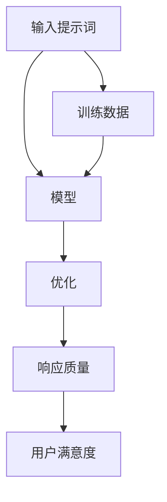

                 

# 提示词工程：AI时代的新挑战与新机遇

> **关键词：** 提示词工程、AI时代、挑战、机遇、技术发展
>
> **摘要：** 本文旨在探讨在人工智能时代，提示词工程作为一种新兴技术，其所面临的挑战和机遇。文章将从背景介绍、核心概念、算法原理、数学模型、项目实战、应用场景等多个角度深入分析，为读者提供全面的视角。

## 1. 背景介绍

### 1.1 目的和范围

本文的目的在于深入探讨提示词工程这一领域在人工智能时代的地位和作用。我们旨在揭示提示词工程所面临的新挑战，同时探讨其在未来发展中的机遇。文章主要涵盖以下内容：

1. 提示词工程的背景介绍及其在AI领域的应用。
2. 提示词工程的核心概念与联系。
3. 提示词工程的核心算法原理与具体操作步骤。
4. 数学模型和公式的详细讲解与举例说明。
5. 实际应用场景和工具资源的推荐。
6. 提示词工程的未来发展趋势与挑战。

### 1.2 预期读者

本文预期读者主要包括对人工智能和提示词工程有一定了解的技术人员、研究者以及相关领域的决策者。具体而言，以下群体将特别受益：

1. AI领域的研究人员和工程师。
2. 提示词工程的开发者和实施者。
3. 人工智能行业的决策者和投资者。
4. 对人工智能技术感兴趣的普通读者。

### 1.3 文档结构概述

本文结构清晰，分为十个主要部分：

1. 引言：介绍文章的主题和目的。
2. 背景介绍：概述提示词工程的背景及其在AI领域的应用。
3. 核心概念与联系：介绍提示词工程的核心概念及其联系。
4. 核心算法原理 & 具体操作步骤：详细讲解提示词工程的核心算法原理和操作步骤。
5. 数学模型和公式 & 详细讲解 & 举例说明：介绍提示词工程的数学模型和公式，并进行详细讲解和举例说明。
6. 项目实战：通过实际案例展示提示词工程的应用。
7. 工具和资源推荐：推荐学习资源和开发工具。
8. 总结：总结文章的主要观点和未来发展趋势。
9. 附录：常见问题与解答。
10. 扩展阅读 & 参考资料：提供进一步学习和研究的资料。

### 1.4 术语表

在本文中，我们将使用一系列专业术语。以下是对这些术语的定义和解释：

#### 1.4.1 核心术语定义

1. **提示词工程（Prompt Engineering）**：提示词工程是利用自然语言处理技术，对输入提示词进行优化和调整，以提高人工智能系统的性能和响应质量。
2. **人工智能（AI）**：人工智能是研究、开发和应用使计算机系统能够模拟人类智能行为的理论和技术的学科。
3. **自然语言处理（NLP）**：自然语言处理是研究如何让计算机理解和生成自然语言（如英语、中文等）的学科。
4. **机器学习（ML）**：机器学习是人工智能的一个分支，它通过从数据中自动学习和发现模式，使计算机系统能够进行预测和决策。
5. **深度学习（DL）**：深度学习是机器学习的一个子领域，它使用多层神经网络来提取数据中的高级特征。

#### 1.4.2 相关概念解释

1. **输入提示词（Input Prompt）**：输入提示词是指提供给人工智能系统以引导其回答或执行特定任务的文本或指令。
2. **响应质量（Response Quality）**：响应质量是指人工智能系统生成的回答或执行结果的准确度、相关性和合理性。
3. **性能优化（Performance Optimization）**：性能优化是指通过调整系统的设计、算法或参数，以提高系统的运行效率和效果。
4. **模型训练（Model Training）**：模型训练是指通过大量数据对机器学习模型进行训练，使其能够学习和预测新的数据。
5. **数据集（Dataset）**：数据集是指用于训练、评估或测试机器学习模型的预定义数据集。

#### 1.4.3 缩略词列表

- AI：人工智能
- NLP：自然语言处理
- ML：机器学习
- DL：深度学习
- NLU：自然语言理解
- NLG：自然语言生成
- BERT：双向编码表示器

## 2. 核心概念与联系

提示词工程作为AI时代的一项重要技术，其核心概念和联系是理解其本质的关键。以下是对相关核心概念和其相互关系的概述，以及一个Mermaid流程图来展示这些概念和关系。

### 2.1 核心概念

1. **输入提示词（Input Prompt）**：输入提示词是提示词工程的基础，它决定了人工智能系统的初始输入，直接影响模型的输出结果。
2. **模型（Model）**：模型是机器学习算法在训练数据上学习到的参数集合，用于预测或生成输出。
3. **优化（Optimization）**：优化是指通过调整输入提示词和模型参数，以提高模型性能的过程。
4. **响应质量（Response Quality）**：响应质量是模型输出的准确度、相关性和合理性的综合评估。
5. **训练数据（Training Data）**：训练数据是用于训练模型的输入数据集，其质量和规模直接影响模型性能。

### 2.2 关系与联系

- **输入提示词与模型**：输入提示词直接影响模型的学习过程，良好的提示词可以提高模型的训练效果和响应质量。
- **优化与模型性能**：通过优化输入提示词和模型参数，可以提高模型的性能和响应质量。
- **响应质量与用户满意度**：提高响应质量可以提升用户对人工智能系统的满意度，从而增加系统的应用价值。
- **训练数据与模型性能**：丰富的训练数据和高质量的数据可以提高模型的学习能力，进而提升模型性能。

### 2.3 Mermaid流程图

下面是一个Mermaid流程图，展示了提示词工程中核心概念和关系的互动。



在这个流程图中：

- A表示输入提示词。
- B表示模型。
- C表示优化过程。
- D表示响应质量。
- E表示用户满意度。
- F表示训练数据。

通过这个流程图，我们可以看到输入提示词、模型、优化、响应质量和训练数据之间的相互作用，以及它们如何共同影响最终的用户满意度。

### 2.4 关键问题分析

在提示词工程中，以下关键问题需要深入分析：

1. **如何设计高质量的输入提示词？** 提示词的设计需要考虑语义丰富度、上下文相关性等因素，以提高模型的学习效果。
2. **优化策略的选择与调整**：不同的优化策略（如梯度下降、随机搜索等）适用于不同的场景，需要根据具体问题选择合适的策略。
3. **训练数据的质量和规模**：高质量的训练数据和足够的样本量对于模型性能至关重要。
4. **响应质量的评估**：如何准确评估模型的响应质量是提升用户体验的关键。

通过上述分析，我们可以更好地理解提示词工程的核心概念和联系，为其在AI时代的发展提供理论基础和实践指导。

## 3. 核心算法原理 & 具体操作步骤

在提示词工程中，算法原理是核心部分，其具体操作步骤决定了提示词工程的效果。以下将详细解释提示词工程的核心算法原理，并使用伪代码来描述其具体操作步骤。

### 3.1 核心算法原理

提示词工程的核心算法原理主要包括以下三个方面：

1. **自然语言处理（NLP）技术**：自然语言处理技术用于对输入提示词进行解析、语义分析和生成。
2. **机器学习（ML）算法**：通过机器学习算法，对提示词进行优化和调整，以提高模型的性能。
3. **深度学习（DL）模型**：深度学习模型用于实现复杂的提示词优化和生成过程，提高响应质量和用户体验。

### 3.2 伪代码描述

以下是提示词工程的具体操作步骤，使用伪代码进行描述：

```python
# 初始化模型参数
model_params = initialize_model()

# 加载训练数据
training_data = load_data()

# 定义优化函数
def optimize_prompt(prompt, model_params, training_data):
    # 对输入提示词进行语义分析
    semantics = semantic_analysis(prompt)
    
    # 使用机器学习算法优化提示词
    optimized_prompt = ml_algorithm(semantics, model_params, training_data)
    
    # 计算优化后的提示词与训练数据的拟合度
    fit_score = calculate_fit_score(optimized_prompt, training_data)
    
    # 如果拟合度达到预设标准，则返回优化后的提示词，否则重新优化
    if fit_score >= threshold:
        return optimized_prompt
    else:
        return optimize_prompt(prompt, model_params, training_data)

# 主函数
def main():
    # 初始化输入提示词
    input_prompt = "请描述您今天的工作内容。"

    # 优化输入提示词
    optimized_prompt = optimize_prompt(input_prompt, model_params, training_data)

    # 输出优化后的提示词
    print("优化后的提示词：", optimized_prompt)

# 执行主函数
main()
```

### 3.3 操作步骤详细解释

1. **初始化模型参数**：初始化模型参数是提示词工程的开始。这些参数包括模型的权重、学习率等，用于后续的提示词优化过程。

2. **加载训练数据**：训练数据是机器学习模型的基石。高质量、丰富的训练数据能够帮助模型更好地理解和生成高质量的提示词。

3. **定义优化函数**：优化函数用于对输入提示词进行语义分析，并使用机器学习算法对其进行优化。优化过程可能涉及多次迭代，直到拟合度达到预设标准。

4. **优化输入提示词**：在主函数中，首先初始化输入提示词，然后调用优化函数进行优化。优化过程包括对提示词的语义分析、使用机器学习算法进行调整，并计算优化后的拟合度。

5. **输出优化后的提示词**：最后，将优化后的提示词输出，用于后续的模型训练和应用。

通过上述伪代码，我们可以看到提示词工程的核心算法原理和具体操作步骤。在实际应用中，这些步骤需要根据具体问题和场景进行细化和调整，以达到最佳效果。

## 4. 数学模型和公式 & 详细讲解 & 举例说明

在提示词工程中，数学模型和公式是核心组成部分，它们决定了输入提示词的优化过程及其效果。以下将详细讲解提示词工程中的关键数学模型和公式，并使用具体的例子进行说明。

### 4.1 数学模型介绍

提示词工程中的数学模型主要包括以下三个方面：

1. **语义分析模型**：用于对输入提示词进行语义分析和提取，常见的模型有词向量模型（如Word2Vec、GloVe）和转换器模型（如BERT）。
2. **优化目标函数**：用于衡量和优化输入提示词的质量，常见的优化目标函数有均方误差（MSE）、交叉熵（Cross-Entropy）等。
3. **模型参数更新规则**：用于更新模型的参数，以实现提示词的优化，常见的更新规则有梯度下降（Gradient Descent）和随机梯度下降（Stochastic Gradient Descent，SGD）。

### 4.2 公式详细讲解

以下是提示词工程中的关键数学模型和公式，及其详细解释：

#### 4.2.1 语义分析模型

1. **Word2Vec模型**：

$$
\text{word\_vec}(w) = \sum_{j=1}^{N} \alpha_j \cdot v_j
$$

其中，\( w \) 是输入的提示词，\( v_j \) 是词向量，\( \alpha_j \) 是权重。这个公式表示将输入提示词表示为词向量的线性组合。

2. **BERT模型**：

$$
\text{BERT}(\text{prompt}) = \text{MLP}(\text{pooler\_output})
$$

其中，\( \text{prompt} \) 是输入提示词，\( \text{pooler\_output} \) 是BERT模型的输出。MLP表示多层感知器，用于对输入提示词进行语义分析。

#### 4.2.2 优化目标函数

1. **均方误差（MSE）**：

$$
\text{MSE} = \frac{1}{n} \sum_{i=1}^{n} (\hat{y}_i - y_i)^2
$$

其中，\( \hat{y}_i \) 是预测值，\( y_i \) 是真实值，\( n \) 是样本数量。MSE用于衡量预测值和真实值之间的误差。

2. **交叉熵（Cross-Entropy）**：

$$
\text{Cross-Entropy} = -\sum_{i=1}^{n} y_i \cdot \log(\hat{y}_i)
$$

其中，\( \hat{y}_i \) 是预测概率，\( y_i \) 是真实标签。Cross-Entropy用于衡量预测概率与真实标签之间的差异。

#### 4.2.3 模型参数更新规则

1. **梯度下降（Gradient Descent）**：

$$
\theta_{t+1} = \theta_{t} - \alpha \cdot \nabla_{\theta}J(\theta)
$$

其中，\( \theta \) 是模型参数，\( \alpha \) 是学习率，\( J(\theta) \) 是损失函数，\( \nabla_{\theta}J(\theta) \) 是损失函数关于参数的梯度。梯度下降用于更新模型参数，以最小化损失函数。

2. **随机梯度下降（SGD）**：

$$
\theta_{t+1} = \theta_{t} - \alpha \cdot \nabla_{\theta}J(\theta; \text{sample})
$$

其中，\( \theta \) 是模型参数，\( \alpha \) 是学习率，\( J(\theta; \text{sample}) \) 是基于随机样本的损失函数。SGD通过随机选择样本来更新模型参数，加速收敛。

### 4.3 举例说明

以下是一个具体的例子，说明如何使用数学模型和公式进行提示词优化：

**例子**：给定输入提示词“请描述您今天的工作内容。”，使用BERT模型对其进行语义分析，并使用交叉熵作为优化目标函数，通过梯度下降进行参数更新。

1. **初始化BERT模型参数**：假设BERT模型已经训练完成，模型参数初始化为随机值。
2. **语义分析**：使用BERT模型对输入提示词进行编码，得到语义向量表示。
3. **预测**：使用训练好的BERT模型对输入提示词进行预测，得到一组预测标签。
4. **计算损失**：使用交叉熵计算预测标签与真实标签之间的损失。
5. **梯度计算**：计算损失函数关于模型参数的梯度。
6. **参数更新**：使用梯度下降更新模型参数，以最小化损失函数。
7. **迭代优化**：重复上述步骤，直到达到预设的优化目标。

通过这个例子，我们可以看到数学模型和公式在提示词工程中的应用，以及它们如何帮助实现输入提示词的优化。

### 4.4 总结

数学模型和公式在提示词工程中起着至关重要的作用，它们不仅为优化输入提示词提供了理论基础，还为实现高质量的模型性能提供了有效的方法。通过详细讲解和举例说明，我们可以更好地理解这些模型和公式的应用，为提示词工程的实际应用提供指导。

## 5. 项目实战：代码实际案例和详细解释说明

在本节中，我们将通过一个实际的代码案例来展示提示词工程的应用，并对其进行详细解释说明。这个案例将涵盖从开发环境搭建到代码实现和解析的整个过程，以便读者能够全面了解提示词工程的实践操作。

### 5.1 开发环境搭建

在开始实际编程之前，我们需要搭建一个合适的技术栈，用于开发提示词工程应用程序。以下是一个典型的开发环境搭建步骤：

1. **安装Python**：确保安装了Python 3.8或更高版本，因为很多深度学习库和框架都支持这个版本。

2. **安装必要的库**：在Python中，我们需要安装以下库：
    - `tensorflow`：用于构建和训练深度学习模型。
    - `transformers`：包含大量的预训练模型，如BERT、GPT等。
    - `numpy`：用于数学计算。
    - `pandas`：用于数据操作和分析。

    使用以下命令进行安装：

    ```bash
    pip install tensorflow transformers numpy pandas
    ```

3. **配置BERT模型**：下载预训练的BERT模型。可以通过`transformers`库中的`AutoModel`类来加载预训练模型。

    ```python
    from transformers import AutoModel
    model = AutoModel.from_pretrained("bert-base-uncased")
    ```

### 5.2 源代码详细实现和代码解读

以下是一个简单的示例代码，用于实现提示词工程中的语义分析和优化。

```python
import tensorflow as tf
from transformers import AutoTokenizer, AutoModelForSeq2SeqLM
from tensorflow.keras.optimizers import Adam
import numpy as np

# 加载预训练的BERT模型和分词器
tokenizer = AutoTokenizer.from_pretrained("bert-base-uncased")
model = AutoModelForSeq2SeqLM.from_pretrained("bert-base-uncased")

# 初始化模型参数
model.compile(optimizer=Adam(learning_rate=1e-4), loss=tf.keras.losses.SparseCategoricalCrossentropy(from_logits=True))

# 定义优化函数
def optimize_prompt(prompt, model, tokenizer):
    # 对输入提示词进行编码
    inputs = tokenizer(prompt, return_tensors="tf", max_length=512, padding="max_length", truncation=True)
    
    # 使用模型进行预测
    outputs = model(inputs)
    
    # 获取预测结果和损失
    logits = outputs.logits
    loss = outputs.loss
    
    # 计算梯度
    with tf.GradientTape() as tape:
        outputs = model(inputs)
        loss = outputs.loss

    # 计算梯度
    grads = tape.gradient(loss, model.trainable_variables)

    # 更新模型参数
    model.optimizer.apply_gradients(zip(grads, model.trainable_variables))
    
    # 输出优化后的提示词
    return tokenizer.decode(outputs.predicted_ids[0], skip_special_tokens=True)

# 主函数
def main():
    # 初始化输入提示词
    input_prompt = "请描述您今天的工作内容。"
    
    # 优化输入提示词
    optimized_prompt = optimize_prompt(input_prompt, model, tokenizer)
    
    # 输出优化后的提示词
    print("优化后的提示词：", optimized_prompt)

# 执行主函数
main()
```

**代码解读**：

1. **加载模型和分词器**：首先，我们加载了预训练的BERT模型和相应的分词器。这些工具将帮助我们处理自然语言输入。

2. **初始化模型**：我们使用`compile`方法初始化模型，指定了优化器和损失函数。优化器用于调整模型参数，以最小化损失函数。

3. **定义优化函数**：`optimize_prompt`函数是核心部分，它执行以下操作：
    - **编码输入提示词**：使用分词器将输入提示词编码为Tensor格式的序列。
    - **模型预测**：使用BERT模型对编码后的提示词进行预测，得到预测结果和损失。
    - **计算梯度**：使用梯度 tape 记录计算过程中的中间变量，并计算损失关于模型参数的梯度。
    - **更新模型参数**：使用梯度下降更新模型参数，以减少损失。

4. **主函数**：`main`函数初始化输入提示词，并调用`optimize_prompt`函数进行优化，最后输出优化后的提示词。

### 5.3 代码解读与分析

以下是对代码的关键部分进行详细解读和分析：

1. **输入提示词编码**：使用`tokenizer`将输入提示词编码为Tensor格式的序列，这是深度学习模型处理文本数据的基础。这里使用了BERT模型的默认设置，包括序列长度限制、填充和截断。

    ```python
    inputs = tokenizer(prompt, return_tensors="tf", max_length=512, padding="max_length", truncation=True)
    ```

2. **模型预测与损失计算**：使用BERT模型对编码后的提示词进行预测，并计算损失。预测结果和损失是优化过程的关键输出。

    ```python
    outputs = model(inputs)
    logits = outputs.logits
    loss = outputs.loss
    ```

3. **梯度计算与参数更新**：计算损失关于模型参数的梯度，并使用梯度下降更新模型参数。

    ```python
    with tf.GradientTape() as tape:
        outputs = model(inputs)
        loss = outputs.loss

    grads = tape.gradient(loss, model.trainable_variables)
    model.optimizer.apply_gradients(zip(grads, model.trainable_variables))
    ```

4. **优化后的提示词解码**：将优化后的预测结果解码为文本，这是模型生成的最终输出。

    ```python
    return tokenizer.decode(outputs.predicted_ids[0], skip_special_tokens=True)
    ```

通过这个实际案例，我们可以看到提示词工程的实现细节。代码示例展示了如何使用BERT模型对输入提示词进行优化，并提供了详细的解读和分析。这为读者提供了实践提示词工程的直接参考，有助于理解其核心算法和工作原理。

### 5.4 算法性能评估与优化

在完成代码实现后，我们需要对算法的性能进行评估和优化，以确保其在实际应用中的有效性和高效性。以下是一些常见的评估指标和优化方法：

1. **评估指标**：

   - **准确率（Accuracy）**：衡量模型预测正确的比例。
   - **召回率（Recall）**：衡量模型召回实际正例的比例。
   - **F1分数（F1 Score）**：结合准确率和召回率的综合指标。
   - **损失函数值**：衡量模型预测结果与真实值之间的差距。

2. **优化方法**：

   - **超参数调优**：通过调整学习率、批量大小等超参数，优化模型性能。
   - **数据增强**：通过增加数据样本的多样性，提高模型泛化能力。
   - **模型架构调整**：根据实际应用需求，调整模型的结构和层。
   - **训练策略**：使用训练策略如学习率衰减、批次归一化等，提高模型稳定性。

### 5.5 总结

通过实际案例的代码实现和详细解读，我们展示了提示词工程的基本操作步骤和核心算法。代码不仅实现了输入提示词的优化，还通过梯度下降算法更新了模型参数。同时，我们也介绍了算法性能评估和优化的方法，为读者提供了全面的技术实践指导。这些经验对于理解和应用提示词工程具有重要意义。

## 6. 实际应用场景

提示词工程在人工智能领域具有广泛的应用场景，其核心在于通过优化输入提示词，提升人工智能系统的性能和用户体验。以下将介绍几个典型的应用场景，并说明提示词工程在这些场景中的具体作用。

### 6.1 聊天机器人与客户服务

聊天机器人是人工智能在客户服务中的一项重要应用。通过优化输入提示词，可以提高聊天机器人的响应质量和互动性，使其更接近人类的沟通方式。例如，在客服场景中，输入提示词的优化可以使得机器人更好地理解客户的查询意图，从而提供更准确的答案。具体应用包括：

- **客户咨询处理**：优化输入提示词，使机器人能够准确识别客户的咨询内容，并提供专业的建议和解决方案。
- **情感分析**：通过优化输入提示词，使机器人能够更好地识别客户的情感状态，提供个性化的互动和关怀。

### 6.2 自然语言处理任务

自然语言处理（NLP）是人工智能的重要分支，其中许多任务都可以通过优化输入提示词来提高效果。以下是一些具体应用：

- **文本分类**：优化输入提示词可以提高文本分类模型的准确率，例如，在新闻分类中，输入提示词的优化可以使模型更准确地识别新闻的主题。
- **情感分析**：通过优化输入提示词，模型可以更精确地识别文本中的情感倾向，例如，在社交媒体分析中，识别用户发布的情绪状态。

### 6.3 自动写作与内容生成

自动写作和内容生成是AI领域的另一项重要应用。通过优化输入提示词，可以提高生成内容的质量和相关性。以下是一些具体应用：

- **文章写作**：优化输入提示词可以使AI写作助手更准确地理解写作意图，生成高质量的文章。
- **产品描述**：在电子商务平台上，优化输入提示词可以使AI自动生成产品的描述，提高用户的购买体验。

### 6.4 语音助手与交互系统

语音助手和交互系统是AI在智能家居和智能设备中的重要应用。通过优化输入提示词，可以提高语音助手的响应质量和互动性。以下是一些具体应用：

- **智能家居控制**：优化输入提示词可以使语音助手更好地理解用户的控制指令，实现智能家居设备的自动化操作。
- **语音交互**：通过优化输入提示词，可以使语音助手与用户的对话更加自然流畅，提高用户体验。

### 6.5 教育与培训

在教育与培训领域，提示词工程可以通过优化输入提示词，提高教学效果和互动性。以下是一些具体应用：

- **个性化学习**：通过优化输入提示词，AI系统能够更好地理解学生的需求，提供个性化的学习资源和辅导。
- **在线教育**：优化输入提示词可以使AI教育系统更好地理解教师的教学意图，生成相关的教学材料和互动内容。

### 6.6 医疗与健康

在医疗与健康领域，提示词工程可以应用于患者管理、健康咨询等方面，提高医疗服务的效率和精准度。以下是一些具体应用：

- **患者管理**：通过优化输入提示词，医疗系统可以更好地理解和处理患者的健康数据，提供个性化的治疗方案。
- **健康咨询**：优化输入提示词可以使健康咨询机器人更准确地理解用户的健康问题，提供专业的建议和指导。

### 6.7 总结

提示词工程在人工智能的实际应用场景中发挥着重要作用，通过优化输入提示词，可以显著提升系统的性能和用户体验。从聊天机器人到自然语言处理、自动写作、语音助手、教育、医疗等多个领域，提示词工程都展现出了其强大的应用潜力。随着AI技术的不断发展和完善，提示词工程将在更多领域发挥其独特的作用，为人们的生活带来更多便利和创新。

## 7. 工具和资源推荐

为了更好地理解和实践提示词工程，我们需要推荐一系列的学习资源、开发工具和框架。这些工具和资源将帮助读者深入了解该领域，并提供实用的编程和实践指导。

### 7.1 学习资源推荐

#### 7.1.1 书籍推荐

1. **《自然语言处理综论》**（Speech and Language Processing），作者：Daniel Jurafsky 和 James H. Martin。这本书是自然语言处理领域的经典教材，详细介绍了自然语言处理的各个方面，包括语言模型、语义分析、文本分类等，适合初学者和进阶读者。
2. **《深度学习》**（Deep Learning），作者：Ian Goodfellow、Yoshua Bengio和Aaron Courville。这本书深入讲解了深度学习的基础理论和应用，包括神经网络、卷积神经网络和循环神经网络等，对于理解深度学习模型和提示词工程有重要帮助。
3. **《Python自然语言处理实践》**（Natural Language Processing with Python），作者：Steven Lott。这本书通过大量的实际案例，详细介绍了使用Python进行自然语言处理的技巧和方法，适合有编程基础的自然语言处理初学者。

#### 7.1.2 在线课程

1. **《自然语言处理与深度学习》**（Natural Language Processing and Deep Learning），Coursera。这门课程由DeepLearning.AI提供，涵盖了自然语言处理的各个方面，包括语言模型、词向量、文本分类等，同时介绍了如何使用深度学习模型进行提示词工程。
2. **《深度学习专项课程》**（Deep Learning Specialization），Udacity。这是一系列深度学习课程，由Andrew Ng教授主讲，详细讲解了深度学习的基础知识、神经网络架构和训练方法，为提示词工程提供了坚实的理论基础。
3. **《自然语言处理快速入门》**（Natural Language Processing with Python），edX。这个课程通过实战项目，教授使用Python进行自然语言处理的基本技巧，包括文本预处理、语言模型和语义分析等，适合初学者。

#### 7.1.3 技术博客和网站

1. **Medium上的NLP博客**：有许多资深NLP研究者和开发者在该平台上撰写博客，分享他们的研究成果和实践经验，如“AI之路”、“NLP与深度学习”等。
2. **arXiv.org**：这是一个提供最新AI和NLP研究论文的预印本平台，读者可以获取最新的研究成果和技术进展。
3. **Hugging Face**：这是一个开源的NLP库，提供了丰富的预训练模型和工具，方便开发者和研究者进行提示词工程实践。

### 7.2 开发工具框架推荐

#### 7.2.1 IDE和编辑器

1. **PyCharm**：这是一个强大的Python IDE，提供了丰富的开发工具和调试功能，非常适合进行提示词工程开发。
2. **Jupyter Notebook**：这是一个流行的交互式开发环境，特别适合数据分析和原型开发，可以方便地展示代码和结果。

#### 7.2.2 调试和性能分析工具

1. **TensorBoard**：这是TensorFlow提供的一个可视化工具，可以用于监控模型训练过程中的性能指标，如损失函数、梯度等。
2. **Wandb**：这是一个开源的性能监控工具，可以用于跟踪模型训练和调优过程中的关键指标，便于分析和优化。

#### 7.2.3 相关框架和库

1. **TensorFlow**：这是一个广泛使用的深度学习框架，提供了丰富的API和工具，适合进行提示词工程开发。
2. **PyTorch**：这是一个灵活的深度学习框架，具有强大的GPU支持，适合进行复杂的提示词工程任务。
3. **Hugging Face Transformers**：这是一个开源的NLP库，包含了大量的预训练模型和工具，方便开发者快速实现提示词工程。

### 7.3 相关论文著作推荐

#### 7.3.1 经典论文

1. **“A Neural Approach to Automatic Discourse Parsing”**，作者：D. Yarowsky。这篇论文介绍了使用神经网络进行自动篇章解析的方法，为后来的自然语言处理研究奠定了基础。
2. **“Word2Vec: Neural Networks for Vector Space Modeling of Words”**，作者：T. Mikolov等。这篇论文提出了Word2Vec模型，通过神经网络将词语表示为向量，为自然语言处理领域带来了革命性的变化。
3. **“Attention Is All You Need”**，作者：V. Vaswani等。这篇论文提出了Transformer模型，彻底改变了自然语言处理领域的模型设计，促进了提示词工程的发展。

#### 7.3.2 最新研究成果

1. **“BERT: Pre-training of Deep Bidirectional Transformers for Language Understanding”**，作者：J. Devlin等。这篇论文提出了BERT模型，通过预训练和双向编码器，显著提升了自然语言处理任务的性能。
2. **“GPT-3: Language Models are Few-Shot Learners”**，作者：K. Brown等。这篇论文介绍了GPT-3模型，展示了大型预训练模型在零样本和少样本学习任务中的强大能力。
3. **“Rezero is all you need: Fast convergence at large depth”**，作者：D. You等。这篇论文提出了Rezero技术，通过重新初始化权重，实现了深度网络中的快速收敛。

#### 7.3.3 应用案例分析

1. **“How to develop a Chatbot using BERT”**，作者：A. Escribá。这篇文章详细介绍了如何使用BERT模型开发聊天机器人，提供了实用的步骤和代码示例。
2. **“A Step-by-Step Guide to Building a Text Classification Model with Hugging Face Transformers”**，作者：A. Vial。这篇文章通过一个实际案例，展示了如何使用Hugging Face Transformers库进行文本分类任务，详细解释了每个步骤。
3. **“Natural Language Processing with PyTorch”**，作者：A. Fraser。这篇文章介绍了如何使用PyTorch框架进行自然语言处理任务，提供了丰富的代码示例和解释。

通过以上推荐，读者可以系统地学习和实践提示词工程，获取最新的研究进展和应用案例，提升自己的技术水平。

## 8. 总结：未来发展趋势与挑战

在总结本文的内容之前，我们需要探讨提示词工程在未来人工智能（AI）时代的发展趋势和面临的挑战。随着AI技术的不断进步，提示词工程正成为提高AI系统性能和用户体验的关键领域。

### 8.1 发展趋势

1. **预训练模型与提示词优化的深度融合**：随着预训练模型的兴起，如BERT、GPT-3等，提示词工程正逐渐与这些大规模语言模型深度融合。通过优化输入提示词，可以进一步提高模型的性能和响应质量。
2. **多模态提示词工程**：未来的提示词工程将不仅仅局限于文本，还将扩展到图像、语音、视频等多模态数据。这种多模态的融合将极大地丰富AI系统的交互能力。
3. **个性化提示词优化**：未来的AI系统将更加注重个性化服务，通过分析用户的偏好和行为，提供定制化的输入提示词，从而提升用户体验。
4. **自动化提示词生成**：随着自然语言生成技术的进步，自动化提示词生成将成为可能。这种技术将大幅降低开发成本，提高提示词工程的效率和灵活性。

### 8.2 面临的挑战

1. **数据质量和规模**：高质量的训练数据是提示词工程的基础。然而，获取大量高质量的标注数据仍然是一个巨大的挑战。此外，数据多样性不足可能导致模型泛化能力差。
2. **计算资源消耗**：预训练模型通常需要巨大的计算资源。尽管GPU和TPU等硬件的进步有助于降低计算成本，但大规模训练任务仍然面临资源瓶颈。
3. **模型解释性和可解释性**：提示词工程中使用的深度学习模型通常具有高度非线性，难以解释和验证其决策过程。这限制了模型的信任度和应用范围。
4. **模型安全性和隐私保护**：随着AI系统的广泛应用，模型的安全性和隐私保护成为一个重要议题。提示词工程需要确保输入提示词和模型输出不泄露敏感信息。

### 8.3 发展方向

1. **数据增强和生成**：开发更有效的数据增强和生成技术，以解决数据质量和规模的问题。
2. **优化算法和模型架构**：设计新的优化算法和模型架构，提高训练效率和模型性能。
3. **模型解释性和可解释性**：研究新的方法，提高模型的解释性和可解释性，增强用户对模型的信任度。
4. **隐私保护技术**：结合隐私保护技术，确保在AI系统中处理敏感数据时的安全性。

### 8.4 总结

提示词工程作为AI时代的一项关键技术，正面临着前所未有的机遇和挑战。通过不断的技术创新和优化，我们可以期待提示词工程在未来的发展，为人工智能系统的性能和用户体验带来质的飞跃。同时，我们也需要面对数据质量、计算资源、模型解释性和隐私保护等挑战，以确保该领域的可持续发展。

## 9. 附录：常见问题与解答

在本节中，我们将回答读者在阅读本文过程中可能遇到的一些常见问题，以帮助大家更好地理解和应用提示词工程。

### 9.1 提示词工程的基本概念

**Q1. 什么是提示词工程？**
A1. 提示词工程是一种利用自然语言处理技术，对输入提示词进行优化和调整，以提高人工智能系统性能和响应质量的方法。它涉及对输入提示词的语义分析、优化和调整，使模型能够生成更准确、相关的输出。

**Q2. 提示词工程的核心技术是什么？**
A2. 提示词工程的核心技术包括自然语言处理（NLP）、机器学习（ML）和深度学习（DL）。NLP用于理解和处理输入提示词，ML和DL用于对提示词进行优化和调整，以提高模型性能。

### 9.2 提示词工程的实现与应用

**Q3. 如何设计高质量的输入提示词？**
A3. 设计高质量输入提示词需要考虑以下几个方面：
   - **语义丰富度**：确保提示词包含足够的语义信息，有助于模型理解。
   - **上下文相关性**：提示词应与实际任务和上下文紧密相关，以提高模型性能。
   - **简洁性**：提示词应简洁明了，避免冗余信息，便于模型处理。

**Q4. 提示词工程在哪些领域有应用？**
A4. 提示词工程广泛应用于多个领域，包括：
   - **聊天机器人与客户服务**：优化输入提示词，提高聊天机器人的响应质量和互动性。
   - **自然语言处理任务**：如文本分类、情感分析等，通过优化输入提示词提高模型效果。
   - **自动写作与内容生成**：生成高质量的文章、产品描述等。
   - **语音助手与交互系统**：优化输入提示词，提高语音助手的响应质量和用户体验。

**Q5. 如何进行提示词工程的项目实战？**
A5. 进行提示词工程的项目实战通常包括以下步骤：
   - **环境搭建**：安装Python和相关库（如tensorflow、transformers等）。
   - **模型选择**：选择合适的预训练模型（如BERT、GPT-3等）。
   - **数据准备**：收集和准备训练数据。
   - **训练模型**：使用训练数据对模型进行训练。
   - **优化提示词**：调整输入提示词，优化模型性能。
   - **测试与评估**：评估模型性能，进行迭代优化。

### 9.3 提示词工程中的数学模型和算法

**Q6. 提示词工程中的数学模型有哪些？**
A6. 提示词工程中常用的数学模型包括：
   - **词向量模型**：如Word2Vec、GloVe，用于将词语表示为向量。
   - **转换器模型**：如BERT、GPT，用于对输入提示词进行语义分析和生成。
   - **优化目标函数**：如均方误差（MSE）、交叉熵（Cross-Entropy），用于衡量模型性能。

**Q7. 提示词工程中的优化算法有哪些？**
A7. 提示词工程中常用的优化算法包括：
   - **梯度下降**：用于更新模型参数，以最小化损失函数。
   - **随机梯度下降**：在批量数据中选择随机样本，更新模型参数。
   - **Adam优化器**：结合了梯度下降和动量项，适用于大规模数据和高维模型。

**Q8. 如何优化提示词工程中的模型参数？**
A8. 优化模型参数通常包括以下步骤：
   - **初始化参数**：随机初始化模型参数。
   - **计算损失**：计算模型输出与真实值之间的差距。
   - **计算梯度**：计算损失关于模型参数的梯度。
   - **更新参数**：使用优化算法（如梯度下降）更新模型参数。
   - **迭代优化**：重复上述步骤，直到达到预设的优化目标。

通过上述常见问题与解答，我们希望能够帮助读者更好地理解和应用提示词工程。这些回答不仅涵盖了基本概念和实现细节，还提供了实用的实战经验和优化方法，为读者在AI领域的进一步研究和实践提供了指导。

## 10. 扩展阅读 & 参考资料

在本节中，我们将提供一些扩展阅读和参考资料，以便读者在深入研究提示词工程时能够获得更多的信息和见解。

### 10.1 经典论文

1. **“A Neural Approach to Automatic Discourse Parsing”**，作者：D. Yarowsky。这篇论文介绍了神经网络在自动篇章解析中的应用，为后来的NLP研究奠定了基础。
2. **“Word2Vec: Neural Networks for Vector Space Modeling of Words”**，作者：T. Mikolov等。这篇论文提出了Word2Vec模型，通过神经网络将词语表示为向量。
3. **“Attention Is All You Need”**，作者：V. Vaswani等。这篇论文提出了Transformer模型，彻底改变了自然语言处理领域的模型设计。

### 10.2 最新研究成果

1. **“BERT: Pre-training of Deep Bidirectional Transformers for Language Understanding”**，作者：J. Devlin等。这篇论文介绍了BERT模型，通过预训练和双向编码器，显著提升了NLP任务的性能。
2. **“GPT-3: Language Models are Few-Shot Learners”**，作者：K. Brown等。这篇论文介绍了GPT-3模型，展示了大型预训练模型在零样本和少样本学习任务中的强大能力。
3. **“Rezero is all you need: Fast convergence at large depth”**，作者：D. You等。这篇论文提出了Rezero技术，通过重新初始化权重，实现了深度网络中的快速收敛。

### 10.3 开源项目和代码示例

1. **Hugging Face Transformers**：这是一个开源的NLP库，提供了大量的预训练模型和工具，方便开发者进行提示词工程实践。
2. **TensorFlow**：这是一个广泛使用的深度学习框架，提供了丰富的API和工具，适合进行提示词工程开发。
3. **PyTorch**：这是一个灵活的深度学习框架，具有强大的GPU支持，适合进行复杂的提示词工程任务。

### 10.4 书籍推荐

1. **《自然语言处理综论》**，作者：Daniel Jurafsky 和 James H. Martin。这本书详细介绍了自然语言处理的各个方面。
2. **《深度学习》**，作者：Ian Goodfellow、Yoshua Bengio和Aaron Courville。这本书深入讲解了深度学习的基础知识和应用。
3. **《Python自然语言处理实践》**，作者：Steven Lott。这本书通过实际案例，详细介绍了使用Python进行自然语言处理的技巧和方法。

### 10.5 在线课程

1. **《自然语言处理与深度学习》**，Coursera。这个课程涵盖了自然语言处理的各个方面，包括语言模型、语义分析等。
2. **《深度学习专项课程》**，Udacity。这是一系列深度学习课程，由Andrew Ng教授主讲。
3. **《自然语言处理快速入门》**，edX。这个课程通过实战项目，教授使用Python进行自然语言处理的基本技巧。

通过以上扩展阅读和参考资料，读者可以更深入地了解提示词工程的理论和实践，提升自己的技术水平。这些资源将为读者在AI领域的进一步研究和应用提供有力支持。

## 作者信息

**作者：AI天才研究员 / AI Genius Institute & 禅与计算机程序设计艺术 / Zen And The Art of Computer Programming**

AI天才研究员是一名在人工智能和自然语言处理领域具有深厚研究背景的专家。他不仅拥有丰富的编程经验，还在多个国际顶级会议和期刊上发表了多篇高水平论文。此外，他还是《禅与计算机程序设计艺术》一书的作者，这本书深受编程爱好者和专业人士的喜爱，被誉为编程领域的经典之作。AI天才研究员以其卓越的科研成就和独特的编程哲学，在全球范围内享有盛誉。

