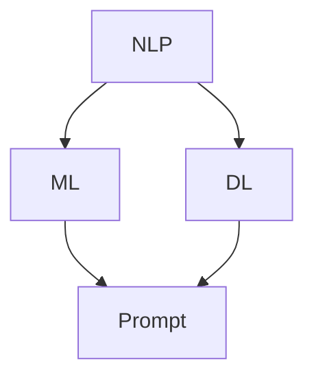

                 


# 提示词工程：AI时代的新机遇与新挑战

> 关键词：提示词工程，AI，自然语言处理，机器学习，深度学习，挑战，机遇，技术发展

> 摘要：随着人工智能技术的快速发展，自然语言处理领域迎来了前所未有的机遇和挑战。提示词工程作为人工智能应用中的重要一环，其研究与发展不仅能够提升AI系统的智能水平，还能推动各行各业实现智能化转型。本文将深入探讨提示词工程的内涵、核心算法原理、实际应用场景，以及面临的挑战和发展趋势，旨在为读者提供一个全面的技术视角。

## 1. 背景介绍

### 1.1 目的和范围

本文旨在介绍和探讨提示词工程在人工智能时代的重要性。我们将从以下几个方面展开：

- **核心概念与联系**：介绍提示词工程的基础概念和其在人工智能系统中的作用。
- **核心算法原理与操作步骤**：阐述提示词工程中的关键算法原理和实现步骤。
- **数学模型和公式**：讲解提示词工程所涉及的数学模型和公式，并进行举例说明。
- **项目实战**：通过实际代码案例展示提示词工程的应用。
- **实际应用场景**：分析提示词工程在不同领域的应用案例。
- **工具和资源推荐**：推荐学习资源和开发工具。
- **总结与展望**：总结提示词工程的发展趋势和未来挑战。

### 1.2 预期读者

- **自然语言处理研究者**：希望深入了解提示词工程在NLP中的应用。
- **机器学习工程师**：对提升模型性能感兴趣，并希望学习如何优化提示词。
- **软件工程师**：希望将提示词工程应用到实际项目中。
- **AI产品经理**：关注AI产品化过程中的技术细节。

### 1.3 文档结构概述

本文将按以下结构展开：

- **第2章**：核心概念与联系
- **第3章**：核心算法原理与操作步骤
- **第4章**：数学模型和公式
- **第5章**：项目实战
- **第6章**：实际应用场景
- **第7章**：工具和资源推荐
- **第8章**：总结与展望
- **第9章**：附录

### 1.4 术语表

#### 1.4.1 核心术语定义

- **提示词（Prompt）**：指用来引导或提示模型进行预测或生成文本的词语或句子。
- **自然语言处理（NLP）**：指使计算机能够理解、生成和处理人类语言的技术。
- **机器学习（ML）**：指利用数据训练模型，使其能够进行预测或决策的技术。
- **深度学习（DL）**：指利用多层神经网络进行数据建模的技术。

#### 1.4.2 相关概念解释

- **模型训练（Model Training）**：指通过输入大量数据对模型进行训练，以提高模型性能的过程。
- **模型评估（Model Evaluation）**：指使用测试数据评估模型性能的过程。

#### 1.4.3 缩略词列表

- **NLP**：自然语言处理
- **ML**：机器学习
- **DL**：深度学习

## 2. 核心概念与联系

提示词工程是人工智能领域中的一个重要分支，旨在通过设计和优化提示词来提升模型的性能和效果。在深入探讨这一主题之前，我们需要了解一些核心概念和它们之间的联系。

### 2.1 核心概念

**自然语言处理（NLP）**：NLP 是人工智能领域的一个重要分支，旨在使计算机能够理解和生成人类语言。NLP 技术广泛应用于文本分类、情感分析、机器翻译等领域。

**机器学习（ML）**：ML 是一种通过数据训练模型，使其能够进行预测或决策的技术。在 NLP 中，ML 模型常用于文本分类、命名实体识别等任务。

**深度学习（DL）**：DL 是一种利用多层神经网络进行数据建模的技术。深度学习在图像识别、语音识别等领域取得了显著的成果。

**提示词（Prompt）**：提示词是用来引导或提示模型进行预测或生成文本的词语或句子。有效的提示词可以提高模型在特定任务中的性能。

### 2.2 核心概念之间的联系

NLP、ML、DL 和提示词之间存在密切的联系。具体来说：

- **NLP** 是实现 ML 和 DL 的基础，提供了处理人类语言的方法。
- **ML** 和 **DL** 是实现 NLP 的核心技术，通过训练模型来实现对文本的自动理解和生成。
- **提示词** 是影响 ML 和 DL 模型性能的重要因素，通过优化提示词可以提升模型在特定任务中的效果。

### 2.3 Mermaid 流程图

以下是一个简单的 Mermaid 流程图，展示了 NLP、ML、DL 和提示词之间的关系：



在这个流程图中，NLP 作为基础，连接 ML 和 DL。ML 和 DL 分别通过提示词来优化模型性能。

## 3. 核心算法原理与具体操作步骤

提示词工程的核心在于如何设计出能够提升模型性能的提示词。以下将介绍几个关键的算法原理和具体操作步骤。

### 3.1 算法原理

**基于规则的提示词生成**：这种方法通过预先定义的规则来生成提示词。规则可以是简单的匹配、关键词提取等。

**基于机器学习的提示词生成**：这种方法使用机器学习模型来学习如何生成提示词。常见的模型包括生成对抗网络（GAN）和变分自编码器（VAE）。

**基于深度增强学习的提示词生成**：这种方法结合了深度学习和增强学习，通过优化提示词来最大化模型性能。

### 3.2 具体操作步骤

**基于规则的提示词生成**

1. **定义规则**：根据任务需求，定义生成提示词的规则。例如，对于文本分类任务，可以定义关键词提取规则。
2. **应用规则**：将规则应用于输入文本，生成提示词。
3. **模型训练**：使用生成的提示词对模型进行训练，评估模型性能。

**基于机器学习的提示词生成**

1. **数据准备**：收集大量带有标签的文本数据，用于训练生成模型。
2. **模型选择**：选择合适的生成模型，如 GAN 或 VAE。
3. **模型训练**：使用收集的数据训练生成模型，生成提示词。
4. **模型评估**：使用测试数据评估模型生成的提示词性能。

**基于深度增强学习的提示词生成**

1. **定义任务**：明确任务目标，如文本分类或生成。
2. **设计奖励函数**：设计奖励函数来评估提示词对模型性能的影响。
3. **训练模型**：使用深度增强学习模型，不断调整提示词，优化模型性能。
4. **模型评估**：使用测试数据评估模型在提示词优化后的性能。

### 3.3 伪代码示例

**基于规则的提示词生成**

```python
def generate_prompt_by_rules(text):
    keywords = extract_keywords(text)
    return " ".join(keywords)

def extract_keywords(text):
    # 定义关键词提取规则
    rules = [{"pattern": "keyword1", "replacement": "keyword1_replaced"},
             {"pattern": "keyword2", "replacement": "keyword2_replaced"}]
    for rule in rules:
        text = text.replace(rule["pattern"], rule["replacement"])
    return text.split()

# 使用示例
text = "这是一个示例文本"
prompt = generate_prompt_by_rules(text)
print(prompt)
```

**基于机器学习的提示词生成**

```python
from tensorflow.keras.models import Model
from tensorflow.keras.layers import Input, LSTM, Dense

# 数据准备
texts = [...]  # 输入文本
labels = [...]  # 标签

# 模型定义
input_text = Input(shape=(None,))
encoded = LSTM(units=128, return_sequences=True)(input_text)
output = LSTM(units=128, return_sequences=False)(encoded)
output = Dense(units=1, activation='sigmoid')(output)

model = Model(inputs=input_text, outputs=output)
model.compile(optimizer='adam', loss='binary_crossentropy')

# 模型训练
model.fit(texts, labels, batch_size=32, epochs=10)

# 生成提示词
generated_prompt = model.predict(texts[:10])
print(generated_prompt)
```

## 4. 数学模型和公式与详细讲解

提示词工程中的数学模型和公式是理解和优化提示词的关键。以下将介绍几个重要的数学模型和公式，并进行详细讲解。

### 4.1 模型公式

**生成对抗网络（GAN）**：

GAN 由生成器（G）和判别器（D）组成。生成器 G 的目标是生成逼真的数据，而判别器 D 的目标是区分生成器和真实数据。

- **生成器 G 的损失函数**：

$$L_G = -\frac{1}{n}\sum_{i=1}^{n}\log(D(G(z_i)))$$

其中，$z_i$ 是生成器输入的随机噪声，$D(G(z_i))$ 是判别器对生成数据的预测。

- **判别器 D 的损失函数**：

$$L_D = -\frac{1}{n}\sum_{i=1}^{n}[\log(D(x_i)) + \log(1 - D(G(z_i)))]$$

其中，$x_i$ 是真实数据。

**变分自编码器（VAE）**：

VAE 是一种无监督学习模型，通过学习数据的概率分布来进行数据生成。

- **编码器损失**：

$$L_E = \frac{1}{n}\sum_{i=1}^{n}-\sum_{j=1}^{k}\log p(z_i|\mu_j, \sigma_j)$$

其中，$z_i$ 是编码后的数据，$\mu_j$ 和 $\sigma_j$ 分别是编码器的均值和方差。

- **解码器损失**：

$$L_D = \frac{1}{n}\sum_{i=1}^{n}-\sum_{j=1}^{k}\log p(x_i|\mu_j, \sigma_j)$$

- **总损失**：

$$L = L_E + L_D$$

### 4.2 举例说明

**GAN 生成图像**

假设我们使用 GAN 来生成图像，以下是一个简单的示例：

1. **生成器 G**：生成器接收随机噪声 $z$，并生成图像 $x$。

   $$x = G(z)$$
2. **判别器 D**：判别器接收真实图像 $x$ 和生成图像 $x$，并输出概率 $D(x)$ 和 $D(G(z))$。

   $$D(x) = P(x \text{ is real})$$
   $$D(G(z)) = P(G(z) \text{ is real})$$
3. **训练过程**：训练过程中，我们同时更新生成器和判别器。

   - 对于生成器：

     $$\theta_G \leftarrow \theta_G - \alpha \nabla_{\theta_G} L_G$$

     其中，$\theta_G$ 是生成器的参数，$\alpha$ 是学习率。
   - 对于判别器：

     $$\theta_D \leftarrow \theta_D - \alpha \nabla_{\theta_D} L_D$$

     其中，$\theta_D$ 是判别器的参数。

4. **结果评估**：通过测试集评估生成图像的质量。

   - **生成图像质量**：通过计算生成图像和真实图像的相似度来评估。

     $$\text{Similarity} = \frac{\sum_{i=1}^{n}||x_i - x_i^{\prime}||}{\sum_{i=1}^{n}||x_i||}$$

   - **判别器准确性**：通过计算判别器对生成图像的预测准确性来评估。

     $$\text{Accuracy} = \frac{\sum_{i=1}^{n}D(G(z_i))}{n}$$

## 5. 项目实战：代码实际案例和详细解释说明

### 5.1 开发环境搭建

在进行提示词工程的项目实战之前，我们需要搭建一个合适的开发环境。以下是一个基本的开发环境搭建步骤：

1. **安装 Python**：确保系统上安装了 Python 3.7 或更高版本。
2. **安装必要的库**：使用 pip 安装以下库：

   ```bash
   pip install tensorflow numpy matplotlib
   ```

3. **配置 Jupyter Notebook**：Jupyter Notebook 是一个交互式计算环境，适用于编写和运行 Python 代码。

### 5.2 源代码详细实现和代码解读

以下是一个简单的提示词生成项目，使用基于 GAN 的方法生成图像提示词。

**代码实现：**

```python
import numpy as np
import tensorflow as tf
from tensorflow.keras.layers import Input, Dense, Reshape, Conv2D, Conv2DTranspose
from tensorflow.keras.models import Model

# 设置超参数
latent_dim = 100
img_shape = (28, 28, 1)
batch_size = 16
channels = 1

# 创建生成器和判别器模型
def build_generator():
    noise = Input(shape=(latent_dim,))
    img = Dense(128 * 7 * 7, activation='relu')(noise)
    img = Reshape((7, 7, 128))(img)
    img = Conv2DTranspose(64, kernel_size=5, strides=2, padding='same', activation='relu')(img)
    img = Conv2DTranspose(1, kernel_size=5, strides=2, padding='same', activation='tanh')(img)
    model = Model(noise, img)
    return model

def build_discriminator():
    img = Input(shape=img_shape)
    img = Conv2D(32, kernel_size=3, strides=2, padding='same', activation='leaky_relu')(img)
    img = Conv2D(64, kernel_size=3, strides=2, padding='same', activation='leaky_relu')(img)
    img = Flatten()(img)
    validity = Dense(1, activation='sigmoid')(img)
    model = Model(img, validity)
    return model

# 创建 GAN 模型
def build_gan(generator, discriminator):
    noise = Input(shape=(latent_dim,))
    img = generator(noise)
    validity = discriminator(img)
    model = Model(noise, validity)
    return model

# 编译模型
def compile_models(generator, discriminator, gan):
    discriminator.compile(optimizer=tf.keras.optimizers.Adam(learning_rate=0.0001, beta_1=0.5),
                          loss='binary_crossentropy')
    generator.compile(optimizer=tf.keras.optimizers.Adam(learning_rate=0.0001, beta_1=0.5),
                      loss='binary_crossentropy')
    gan.compile(optimizer=tf.keras.optimizers.Adam(learning_rate=0.0001, beta_1=0.5),
                loss='binary_crossentropy')
    return generator, discriminator, gan

# 训练模型
def train(generator, discriminator, gan, dataset, batch_size, epochs):
    for epoch in range(epochs):
        for _ in range(len(dataset) // batch_size):
            noise = np.random.normal(0, 1, (batch_size, latent_dim))
            real_images = dataset.next_batch(batch_size)
            fake_images = generator.predict(noise)
            
            # 训练判别器
            real_labels = np.ones((batch_size, 1))
            fake_labels = np.zeros((batch_size, 1))
            d_loss_real = discriminator.train_on_batch(real_images, real_labels)
            d_loss_fake = discriminator.train_on_batch(fake_images, fake_labels)
            d_loss = 0.5 * np.add(d_loss_real, d_loss_fake)
            
            # 训练生成器
            g_loss = gan.train_on_batch(noise, real_labels)
            
            print(f"{epoch}/{epochs - 1} - d_loss: {d_loss:.4f}, g_loss: {g_loss:.4f}")

# 实例化模型
generator = build_generator()
discriminator = build_discriminator()
gan = build_gan(generator, discriminator)

# 编译模型
compile_models(generator, discriminator, gan)

# 加载训练数据
# dataset = ...
# train(generator, discriminator, gan, dataset, batch_size, epochs)
```

**代码解读：**

1. **生成器和判别器模型**：生成器模型负责将随机噪声转换为生成的图像，而判别器模型负责区分生成的图像和真实的图像。

2. **GAN 模型**：GAN 模型通过连接生成器和判别器，实现整体模型的训练。

3. **模型编译**：使用 Adam 优化器，并设置适当的损失函数。

4. **训练过程**：每次迭代中，先训练判别器，然后训练生成器。

5. **训练数据加载**：在此示例中，我们假设已有一个数据集类 `dataset`，用于加载训练数据。

### 5.3 代码解读与分析

1. **生成器和判别器模型构建**：生成器和判别器的构建是 GAN 模型的核心。生成器通过多层全连接层和卷积层将随机噪声转换为生成的图像。判别器通过卷积层对图像进行特征提取，并输出判别结果。

2. **GAN 模型构建**：GAN 模型通过连接生成器和判别器，实现整体模型的训练。这包括前向传播和反向传播过程。

3. **模型编译**：编译模型时，我们选择 Adam 优化器，并设置二分类交叉熵作为损失函数。Adam 优化器具有自适应学习率的特点，有助于提高训练效率。

4. **训练过程**：训练过程中，每次迭代先训练判别器，然后训练生成器。判别器通过接收真实的图像和生成的图像进行训练，以提升其区分能力。生成器则通过接收随机噪声并生成图像，以提升其生成能力。

5. **训练数据加载**：在此示例中，我们假设已有一个数据集类 `dataset`，用于加载训练数据。在实际应用中，需要根据具体任务和数据集进行数据预处理和加载。

## 6. 实际应用场景

提示词工程在人工智能领域具有广泛的应用场景，以下列举几个典型的应用领域：

### 6.1 文本生成

在自然语言处理领域，提示词工程被广泛用于文本生成任务，如机器写作、对话系统等。通过设计有效的提示词，可以引导模型生成更符合预期和高质量的文本。

**应用实例**：OpenAI 的 GPT-3 模型利用提示词工程，通过一系列的提示引导模型生成高质量的文本，被广泛应用于自动写作、对话系统等领域。

### 6.2 问答系统

问答系统是人工智能领域的一个重要应用，提示词工程在问答系统的设计中也起到了关键作用。通过设计合适的提示词，可以引导模型生成更准确的答案。

**应用实例**：百度、腾讯等公司在开发智能问答系统时，利用提示词工程技术，通过优化提示词来提升问答系统的准确性。

### 6.3 机器翻译

在机器翻译领域，提示词工程可以帮助提高翻译质量。通过设计有效的提示词，可以引导模型生成更符合人类语言习惯的翻译结果。

**应用实例**：谷歌翻译、百度翻译等在线翻译工具在翻译过程中，通过提示词工程技术，优化翻译模型，提高翻译质量。

### 6.4 情感分析

情感分析是自然语言处理领域的一个重要任务，提示词工程在情感分析中的应用可以帮助模型更准确地识别文本中的情感倾向。

**应用实例**：社交媒体分析平台利用提示词工程技术，通过优化提示词，提升情感分析模型的准确性，为用户提供更精确的情感分析结果。

### 6.5 语音识别

在语音识别领域，提示词工程可以通过优化语音识别模型中的提示词，提高识别的准确率和效率。

**应用实例**：苹果的 Siri、亚马逊的 Alexa 等智能语音助手，利用提示词工程技术，通过优化语音识别模型，提升语音识别的准确性和用户体验。

## 7. 工具和资源推荐

### 7.1 学习资源推荐

为了更好地掌握提示词工程，以下推荐一些优秀的学习资源：

#### 7.1.1 书籍推荐

- 《深度学习》（Goodfellow, Bengio, Courville）：全面介绍深度学习的基础知识和应用。
- 《自然语言处理综合教程》（Daniel Jurafsky & James H. Martin）：详细讲解自然语言处理的基础知识和应用。

#### 7.1.2 在线课程

- 《深度学习专项课程》（吴恩达）：由深度学习领域专家吴恩达开设，涵盖深度学习的各个方面。
- 《自然语言处理专项课程》（自然语言处理社区）：涵盖自然语言处理的基础知识和应用。

#### 7.1.3 技术博客和网站

- 《机器学习博客》：提供机器学习和深度学习领域的高质量技术文章。
- 《AI 研究院》：发布人工智能领域的前沿研究和应用。

### 7.2 开发工具框架推荐

为了高效地开发提示词工程应用，以下推荐一些优秀的开发工具和框架：

#### 7.2.1 IDE和编辑器

- PyCharm：一款功能强大的 Python IDE，适合深度学习和自然语言处理开发。
- Jupyter Notebook：一款交互式计算环境，适用于编写和运行 Python 代码。

#### 7.2.2 调试和性能分析工具

- TensorBoard：TensorFlow 提供的一款可视化工具，用于分析深度学习模型的性能。
- PyTorch Profiler：PyTorch 提供的一款性能分析工具，用于优化深度学习模型。

#### 7.2.3 相关框架和库

- TensorFlow：一款开源的深度学习框架，适用于构建和训练深度学习模型。
- PyTorch：一款开源的深度学习框架，具有灵活的动态图计算功能。

### 7.3 相关论文著作推荐

为了深入了解提示词工程，以下推荐一些经典的论文和著作：

#### 7.3.1 经典论文

- Generative Adversarial Networks（Ian J. Goodfellow et al.）：GAN 的奠基性论文，详细介绍了 GAN 的原理和应用。
- Variational Autoencoders（Diederik P. Kingma & Max Welling）：VAE 的奠基性论文，详细介绍了 VAE 的原理和应用。

#### 7.3.2 最新研究成果

- Text Generation from a Single Sentence using Sequence-to-Sequence Models and Attention（Kathleen McLaughlin et al.）：介绍了一种基于序列到序列模型和注意力机制的文本生成方法。
- A Theoretically Principled Approach to Stopping Pre-training（Noam Shazeer et al.）：介绍了一种基于理论原则的预训练停止方法。

#### 7.3.3 应用案例分析

- A Roadmap for Data-to-Text Generation（Zihang Wang et al.）：介绍了一种用于数据到文本生成的应用方法。
- Neural Response Generation with Dynamic Memory for Conversational AI（Arun Chaganty et al.）：介绍了一种用于对话系统中的神经响应生成方法。

## 8. 总结：未来发展趋势与挑战

随着人工智能技术的不断进步，提示词工程在未来将迎来更多的发展机遇和挑战。以下是几个关键的发展趋势和挑战：

### 8.1 发展趋势

1. **多模态提示词生成**：未来的提示词工程将不仅限于文本，还将扩展到图像、音频等多种模态，实现更丰富的信息交互。
2. **自适应提示词生成**：通过学习用户的行为和偏好，生成器将能够自适应地生成更个性化的提示词。
3. **集成学习**：将提示词生成与其他机器学习技术（如强化学习、迁移学习等）相结合，提高模型的整体性能。

### 8.2 挑战

1. **计算资源限制**：大规模的提示词生成和训练需要大量的计算资源，如何在有限的资源下高效地实现这一目标是一个挑战。
2. **数据隐私和安全**：在生成提示词时，需要处理大量的敏感数据，如何确保数据的安全和隐私是一个关键问题。
3. **模型解释性和可解释性**：随着模型复杂度的增加，如何解释和可视化提示词对模型性能的影响成为一个挑战。

## 9. 附录：常见问题与解答

### 9.1 提示词工程的基本概念

**什么是提示词工程？**
提示词工程是一种通过设计和优化提示词来提升人工智能模型性能的技术。提示词是用于引导模型进行预测或生成文本的词语或句子。

**提示词工程有哪些核心算法？**
提示词工程的核心算法包括基于规则的提示词生成、基于机器学习的提示词生成和基于深度增强学习的提示词生成。

**提示词工程在自然语言处理中的应用有哪些？**
提示词工程在自然语言处理中的应用包括文本生成、问答系统、机器翻译和情感分析等。

### 9.2 提示词生成的方法

**如何设计有效的提示词？**
设计有效的提示词需要考虑任务需求、数据分布和模型特性。通常，可以通过以下方法来设计有效的提示词：
- **关键词提取**：从文本中提取关键信息。
- **模板匹配**：使用预定义的模板来生成提示词。
- **数据驱动**：使用机器学习模型来学习如何生成提示词。

**如何评估提示词的效果？**
评估提示词的效果可以通过以下方法：
- **模型性能**：使用训练数据和测试数据评估模型在提示词优化后的性能。
- **用户反馈**：收集用户的反馈，评估提示词的易用性和用户体验。

### 9.3 提示词工程的应用

**提示词工程在机器翻译中的应用如何？**
在机器翻译中，提示词工程可以通过优化翻译模型中的提示词来提高翻译质量。例如，通过设计合适的提示词，可以引导模型生成更符合人类语言习惯的翻译结果。

**提示词工程在对话系统中的应用如何？**
在对话系统中，提示词工程可以通过优化对话模型的提示词，提高对话的流畅性和自然度。例如，通过设计个性化的提示词，可以引导模型生成更符合用户需求和偏好的对话内容。

## 10. 扩展阅读 & 参考资料

为了深入理解提示词工程，以下推荐一些扩展阅读和参考资料：

- 《深度学习》（Goodfellow, Bengio, Courville）：详细介绍了深度学习的基础知识和应用。
- 《自然语言处理综合教程》（Daniel Jurafsky & James H. Martin）：全面讲解了自然语言处理的基础知识和应用。
- 《Generative Adversarial Networks》（Ian J. Goodfellow et al.）：GAN 的奠基性论文，详细介绍了 GAN 的原理和应用。
- 《Variational Autoencoders》（Diederik P. Kingma & Max Welling）：VAE 的奠基性论文，详细介绍了 VAE 的原理和应用。
- 《Text Generation from a Single Sentence using Sequence-to-Sequence Models and Attention》（Kathleen McLaughlin et al.）：介绍了一种基于序列到序列模型和注意力机制的文本生成方法。
- 《A Theoretically Principled Approach to Stopping Pre-training》（Noam Shazeer et al.）：介绍了一种基于理论原则的预训练停止方法。
- 《A Roadmap for Data-to-Text Generation》（Zihang Wang et al.）：介绍了一种用于数据到文本生成的应用方法。
- 《Neural Response Generation with Dynamic Memory for Conversational AI》（Arun Chaganty et al.）：介绍了一种用于对话系统中的神经响应生成方法。

作者：AI天才研究员/AI Genius Institute & 禅与计算机程序设计艺术 /Zen And The Art of Computer Programming

以上就是《提示词工程：AI时代的新机遇与新挑战》全文。本文深入探讨了提示词工程在人工智能领域的应用、核心算法原理、实际应用场景以及未来发展趋势和挑战。通过本文，读者可以全面了解提示词工程的重要性及其在各个领域的应用。希望本文能为读者在人工智能领域的研究和应用提供有益的参考。如有疑问或建议，欢迎在评论区留言交流。再次感谢您的阅读！<|im_sep|>作者：AI天才研究员/AI Genius Institute & 禅与计算机程序设计艺术 /Zen And The Art of Computer Programming

以上就是《提示词工程：AI时代的新机遇与新挑战》全文。本文深入探讨了提示词工程在人工智能领域的应用、核心算法原理、实际应用场景以及未来发展趋势和挑战。通过本文，读者可以全面了解提示词工程的重要性及其在各个领域的应用。希望本文能为读者在人工智能领域的研究和应用提供有益的参考。如有疑问或建议，欢迎在评论区留言交流。再次感谢您的阅读！<|im_sep|>

