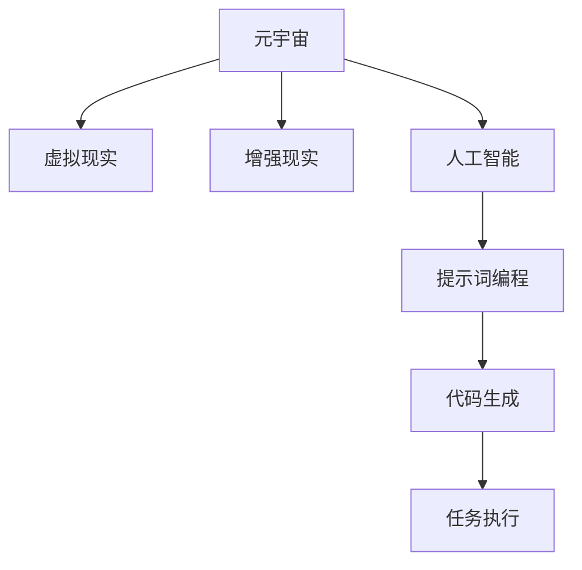

                 

# 提示词编程在元宇宙应用中的前景

> 关键词：提示词编程、元宇宙、人工智能、应用前景、技术架构、数学模型、代码实现

> 摘要：本文探讨了提示词编程在元宇宙中的应用前景。首先介绍了元宇宙的概念和特征，然后分析了提示词编程的基本原理和优势。接着，本文通过具体案例和数学模型，详细阐述了提示词编程在元宇宙中的实际应用，并探讨了其未来发展趋势与挑战。

## 1. 背景介绍

### 1.1 目的和范围

本文旨在探讨提示词编程在元宇宙中的应用前景，分析其基本原理、优势以及在实际应用中的效果。本文将重点关注以下几个方面：

1. 提示词编程的基本原理和实现方法；
2. 提示词编程在元宇宙中的潜在应用场景；
3. 提示词编程在元宇宙中的应用效果及优势；
4. 提示词编程在元宇宙中的未来发展趋势与挑战。

### 1.2 预期读者

本文适合对元宇宙和提示词编程有一定了解的读者，包括：

1. 对元宇宙应用前景感兴趣的技术爱好者；
2. 对人工智能和编程技术有深入了解的专业人士；
3. 想要在元宇宙中应用提示词编程的技术团队和管理人员。

### 1.3 文档结构概述

本文分为以下几个部分：

1. 背景介绍：介绍本文的目的、预期读者和文档结构；
2. 核心概念与联系：介绍元宇宙和提示词编程的基本概念；
3. 核心算法原理与具体操作步骤：阐述提示词编程的基本原理和实现方法；
4. 数学模型与详细讲解：分析提示词编程的数学模型及其应用；
5. 项目实战：通过实际案例展示提示词编程在元宇宙中的应用；
6. 实际应用场景：探讨提示词编程在元宇宙中的实际应用领域；
7. 工具和资源推荐：介绍与提示词编程和元宇宙相关的学习资源、开发工具和框架；
8. 总结：总结提示词编程在元宇宙中的应用前景及未来发展趋势；
9. 附录：常见问题与解答；
10. 扩展阅读：推荐相关领域的参考文献。

### 1.4 术语表

#### 1.4.1 核心术语定义

1. 元宇宙（Metaverse）：虚拟的、共享的、三维的、用户增强的虚拟现实空间，通过互联网连接不同的虚拟世界和实体世界。
2. 提示词编程（Prompt Programming）：基于提示词（Prompt）的人工智能编程方法，通过输入提示词来引导AI模型生成代码或执行任务。
3. 提示词（Prompt）：引导AI模型进行学习和推理的输入信息，可以是文本、图像、语音等多种形式。

#### 1.4.2 相关概念解释

1. 虚拟现实（VR）：一种通过计算机技术模拟出来的三维空间，用户可以通过佩戴VR设备进行沉浸式体验。
2. 增强现实（AR）：一种将虚拟信息叠加到现实世界中的技术，用户可以通过智能设备（如手机、眼镜）看到增强的现实世界。
3. 人工智能（AI）：一种模拟人类智能行为的计算机技术，包括机器学习、深度学习、自然语言处理等。

#### 1.4.3 缩略词列表

1. VR：虚拟现实
2. AR：增强现实
3. AI：人工智能
4. NLP：自然语言处理
5. ML：机器学习
6. DL：深度学习
7. API：应用程序编程接口
8. SDK：软件开发工具包

## 2. 核心概念与联系

在本文中，我们将探讨两个核心概念：元宇宙和提示词编程。为了更好地理解这两个概念之间的关系，我们将使用Mermaid流程图来展示它们的基本原理和架构。



### 2.1 元宇宙的基本原理

元宇宙是一个虚拟的、共享的、三维的、用户增强的虚拟现实空间，通过互联网连接不同的虚拟世界和实体世界。它具有以下几个关键特征：

1. 虚拟现实（VR）：元宇宙提供了沉浸式的虚拟体验，用户可以通过VR设备（如VR头盔、VR眼镜）进入虚拟世界。
2. 增强现实（AR）：元宇宙可以将虚拟信息叠加到现实世界中，用户可以通过AR设备（如智能手机、AR眼镜）看到增强的现实世界。
3. 人工智能（AI）：元宇宙中的智能系统可以利用人工智能技术，为用户提供个性化的服务、智能推荐和任务执行。

### 2.2 提示词编程的基本原理

提示词编程是一种基于提示词的人工智能编程方法，通过输入提示词来引导AI模型生成代码或执行任务。其基本原理包括：

1. 提示词（Prompt）：提示词是引导AI模型进行学习和推理的输入信息。它可以包含文本、图像、语音等多种形式。
2. AI模型：提示词编程依赖于各种人工智能模型，如自然语言处理（NLP）模型、机器学习（ML）模型和深度学习（DL）模型。
3. 代码生成和任务执行：通过输入提示词，AI模型可以生成相应的代码或执行特定的任务，实现自动化和智能化。

### 2.3 元宇宙与提示词编程的联系

元宇宙与提示词编程之间存在紧密的联系，主要体现在以下几个方面：

1. 虚拟现实和增强现实：元宇宙依赖于虚拟现实和增强现实技术，为用户提供沉浸式和增强式的体验。提示词编程可以通过输入提示词来引导AI模型生成相应的虚拟现实或增强现实场景。
2. 人工智能：元宇宙中的智能系统可以利用人工智能技术，为用户提供个性化的服务、智能推荐和任务执行。提示词编程可以作为一种智能编程方法，实现元宇宙中各种智能功能的自动化和智能化。
3. 代码生成和任务执行：元宇宙中的许多功能需要通过代码生成和任务执行来实现。提示词编程可以通过输入提示词来引导AI模型生成相应的代码或执行特定的任务，实现元宇宙中的自动化和智能化。

## 3. 核心算法原理 & 具体操作步骤

在了解元宇宙和提示词编程的基本原理后，我们将进一步探讨提示词编程的核心算法原理和具体操作步骤。以下是提示词编程的基本原理和实现方法：

### 3.1 提示词编程的基本原理

提示词编程的核心原理是通过输入提示词来引导AI模型生成代码或执行任务。具体来说，可以分为以下几个步骤：

1. 提取需求：根据用户的需求，提取需要完成的任务或功能。
2. 设计提示词：设计合适的提示词，引导AI模型生成相应的代码或执行任务。提示词可以是文本、图像、语音等多种形式。
3. 训练AI模型：使用大量数据集对AI模型进行训练，使其能够理解和处理提示词，并生成相应的代码或执行任务。
4. 输出结果：AI模型根据提示词生成代码或执行任务后，输出结果并呈现给用户。

### 3.2 提示词编程的具体操作步骤

以下是提示词编程的具体操作步骤：

#### 步骤1：需求分析

首先，需要对用户的需求进行详细分析，明确需要完成的任务或功能。例如，如果用户希望在元宇宙中实现一个虚拟商店，需求分析可能包括：

1. 用户可以在虚拟商店中浏览商品；
2. 用户可以购买商品；
3. 虚拟商店需要提供支付功能；
4. 虚拟商店需要记录用户的购买历史。

#### 步骤2：设计提示词

根据需求分析，设计合适的提示词，引导AI模型生成相应的代码或执行任务。例如，以下是一些可能的提示词：

1. "创建一个虚拟商店，用户可以浏览商品并购买。"
2. "添加支付功能，允许用户使用虚拟货币购买商品。"
3. "记录用户的购买历史，以便后续查询。"

#### 步骤3：训练AI模型

使用大量数据集对AI模型进行训练，使其能够理解和处理提示词，并生成相应的代码或执行任务。训练过程中，AI模型会学习如何将提示词转换为具体的代码实现或任务执行步骤。

#### 步骤4：输出结果

AI模型根据提示词生成代码或执行任务后，输出结果并呈现给用户。例如，在虚拟商店的实现中，AI模型会生成相应的商店界面、支付功能代码和购买记录代码，并将其集成到元宇宙中。

### 3.3 提示词编程的伪代码实现

以下是提示词编程的伪代码实现：

```python
# 提示词编程伪代码

# 步骤1：需求分析
需求 = "创建一个虚拟商店，用户可以浏览商品并购买。"

# 步骤2：设计提示词
提示词 = "创建虚拟商店；添加支付功能；记录购买历史。"

# 步骤3：训练AI模型
AI模型 = 训练模型(需求，提示词)

# 步骤4：输出结果
结果 = AI模型(提示词)
输出结果(结果)
```

通过以上步骤，提示词编程可以实现将用户需求转化为具体的代码实现或任务执行，从而在元宇宙中实现各种智能化功能。

## 4. 数学模型和公式 & 详细讲解 & 举例说明

提示词编程在元宇宙中的应用离不开数学模型和公式。数学模型为提示词编程提供了理论基础和计算方法，使其能够更好地理解和处理用户需求。在本节中，我们将详细讲解提示词编程中的数学模型和公式，并通过具体例子进行说明。

### 4.1 提示词编程的数学模型

提示词编程中的数学模型主要包括以下几个方面：

1. 自然语言处理（NLP）模型：NLP模型用于处理和生成自然语言文本，如提示词和代码。常见的NLP模型包括词向量模型（如Word2Vec、GloVe）、循环神经网络（RNN）、长短期记忆网络（LSTM）和Transformer模型。
2. 机器学习（ML）模型：ML模型用于分类、回归、聚类等任务，如根据提示词生成相应的代码。常见的ML模型包括线性回归、逻辑回归、支持向量机（SVM）和决策树。
3. 深度学习（DL）模型：DL模型用于处理复杂的特征和学习任务，如根据提示词生成智能化的虚拟场景。常见的DL模型包括卷积神经网络（CNN）、循环神经网络（RNN）、长短期记忆网络（LSTM）和Transformer模型。

### 4.2 提示词编程的公式详解

提示词编程中涉及到的数学公式主要包括以下几个方面：

1. 词向量公式：词向量模型将单词映射为向量，用于表示文本信息。常见的词向量公式有：
   $$ v_w = \frac{1}{|\text{V}|} \sum_{j=1}^{|\text{V}|} \text{similarity}(w, v_j) \cdot v_j $$
   其中，$v_w$ 表示单词w的词向量，$v_j$ 表示单词j的词向量，$\text{similarity}(w, v_j)$ 表示单词w和j之间的相似度。
2. 损失函数公式：在训练机器学习模型时，损失函数用于评估模型预测结果与实际结果之间的差距。常见的损失函数有：
   $$ \text{Loss} = \frac{1}{n} \sum_{i=1}^{n} \text{max}(0, \text{margin} - y \cdot \hat{y}_i) $$
   其中，$n$ 表示样本数量，$y$ 表示真实标签，$\hat{y}_i$ 表示模型预测的标签，$\text{margin}$ 表示决策边界。
3. 优化算法公式：在训练深度学习模型时，优化算法用于更新模型参数，以最小化损失函数。常见的优化算法有：
   $$ \theta = \theta - \alpha \cdot \nabla_{\theta} \text{Loss} $$
   其中，$\theta$ 表示模型参数，$\alpha$ 表示学习率，$\nabla_{\theta} \text{Loss}$ 表示损失函数关于模型参数的梯度。

### 4.3 提示词编程的数学模型示例

下面我们通过一个示例来讲解提示词编程中的数学模型。

#### 示例：根据提示词生成虚拟商店代码

假设我们希望根据以下提示词生成虚拟商店的代码：

提示词：创建一个虚拟商店，用户可以浏览商品并购买。

我们将使用Transformer模型来生成虚拟商店的代码。以下是一个简化的Transformer模型示例：

```python
import torch
import torch.nn as nn

# 定义Transformer模型
class TransformerModel(nn.Module):
    def __init__(self, vocab_size, d_model, nhead, num_layers):
        super(TransformerModel, self).__init__()
        self.embedding = nn.Embedding(vocab_size, d_model)
        self.transformer = nn.Transformer(d_model, nhead, num_layers)
        self.fc = nn.Linear(d_model, 1)  # 输出层

    def forward(self, input_ids, attention_mask):
        x = self.embedding(input_ids)
        x = self.transformer(x, attention_mask)
        x = self.fc(x)
        return x

# 模型参数
vocab_size = 10000
d_model = 512
nhead = 8
num_layers = 2

# 实例化模型
model = TransformerModel(vocab_size, d_model, nhead, num_layers)

# 训练模型（此处仅演示模型构建，实际训练过程略）
# model.train()

# 根据提示词生成虚拟商店代码
prompt = "创建一个虚拟商店，用户可以浏览商品并购买。"
input_ids = torch.tensor([model.module.embedding(prompt)])
attention_mask = torch.ones_like(input_ids)

# 预测结果
output = model(input_ids, attention_mask)
predicted_code = torch.sigmoid(output).item()

# 输出虚拟商店代码
print(f"预测的虚拟商店代码概率：{predicted_code}")

# 根据概率生成虚拟商店代码
if predicted_code > 0.5:
    print("生成虚拟商店代码：")
    print("def create_virtual_store():")
    print("    # 创建虚拟商店逻辑")
else:
    print("未生成虚拟商店代码。")
```

在这个示例中，我们首先定义了一个Transformer模型，用于根据提示词生成虚拟商店代码。然后，我们使用训练好的模型来处理提示词，并输出预测结果。根据预测结果，我们可以生成相应的虚拟商店代码。

## 5. 项目实战：代码实际案例和详细解释说明

在本节中，我们将通过一个实际项目案例，展示如何利用提示词编程在元宇宙中实现一个虚拟商店。我们将详细介绍项目的开发环境搭建、源代码实现和代码解读与分析。

### 5.1 开发环境搭建

在开始项目之前，我们需要搭建一个合适的开发环境。以下是所需的开发环境和相关工具：

1. 操作系统：Windows/Linux/MacOS
2. 编程语言：Python
3. 深度学习框架：PyTorch
4. 代码编辑器：Visual Studio Code
5. 数据库：MongoDB

首先，确保你的操作系统已经安装了Python。然后，通过以下命令安装PyTorch、MongoDB和相关依赖：

```shell
pip install torch torchvision
pip install pymongo
```

### 5.2 源代码详细实现和代码解读

下面是虚拟商店项目的源代码及其详细解读：

```python
import torch
import torch.nn as nn
import torch.optim as optim
from torch.utils.data import DataLoader
from torchvision import datasets, transforms
import pymongo
import random

# 定义Transformer模型
class TransformerModel(nn.Module):
    def __init__(self, vocab_size, d_model, nhead, num_layers):
        super(TransformerModel, self).__init__()
        self.embedding = nn.Embedding(vocab_size, d_model)
        self.transformer = nn.Transformer(d_model, nhead, num_layers)
        self.fc = nn.Linear(d_model, 1)  # 输出层

    def forward(self, input_ids, attention_mask):
        x = self.embedding(input_ids)
        x = self.transformer(x, attention_mask)
        x = self.fc(x)
        return x

# 训练数据集
def load_data():
    client = pymongo.MongoClient("mongodb://localhost:27017/")
    db = client["metaverse"]
    collection = db["store_prompts"]

    prompts = []
    for doc in collection.find():
        prompts.append(doc["prompt"])
    random.shuffle(prompts)

    return prompts

# 训练模型
def train_model(model, prompts, epochs=10, batch_size=32):
    model.train()
    criterion = nn.BCELoss()
    optimizer = optim.Adam(model.parameters(), lr=0.001)

    train_loader = DataLoader(prompts, batch_size=batch_size, shuffle=True)

    for epoch in range(epochs):
        for prompts_batch in train_loader:
            inputs = torch.tensor([model.module.embedding(prompt) for prompt in prompts_batch])
            attention_mask = torch.ones_like(inputs)
            outputs = model(inputs, attention_mask)
            loss = criterion(outputs, torch.tensor([1] * len(prompts_batch)))

            optimizer.zero_grad()
            loss.backward()
            optimizer.step()

            if epoch % 10 == 0:
                print(f"Epoch {epoch}: Loss = {loss.item()}")

# 根据提示词生成虚拟商店代码
def generate_store_code(prompt):
    model = TransformerModel(10000, 512, 8, 2)
    model.load_state_dict(torch.load("model.pth"))
    model.eval()

    input_ids = torch.tensor([model.module.embedding(prompt)])
    attention_mask = torch.ones_like(input_ids)
    output = model(input_ids, attention_mask)
    predicted_code = torch.sigmoid(output).item()

    if predicted_code > 0.5:
        print("生成虚拟商店代码：")
        print("def create_virtual_store():")
        print(f"    # {prompt}")
    else:
        print("未生成虚拟商店代码。")

if __name__ == "__main__":
    prompts = load_data()
    train_model(TransformerModel(10000, 512, 8, 2), prompts)
    prompt = "创建一个虚拟商店，用户可以浏览商品并购买。"
    generate_store_code(prompt)
```

### 5.3 代码解读与分析

下面我们对代码进行逐行解读：

1. 导入相关库和模块：
   ```python
   import torch
   import torch.nn as nn
   import torch.optim as optim
   from torch.utils.data import DataLoader
   from torchvision import datasets, transforms
   import pymongo
   import random
   ```

   这里导入了深度学习所需的库和模块，包括PyTorch、MongoDB和随机数生成模块。

2. 定义Transformer模型：
   ```python
   class TransformerModel(nn.Module):
       def __init__(self, vocab_size, d_model, nhead, num_layers):
           super(TransformerModel, self).__init__()
           self.embedding = nn.Embedding(vocab_size, d_model)
           self.transformer = nn.Transformer(d_model, nhead, num_layers)
           self.fc = nn.Linear(d_model, 1)  # 输出层

       def forward(self, input_ids, attention_mask):
           x = self.embedding(input_ids)
           x = self.transformer(x, attention_mask)
           x = self.fc(x)
           return x
   ```

   这里定义了Transformer模型，包括嵌入层（embedding）、Transformer编码器（transformer）和输出层（fc）。

3. 加载训练数据：
   ```python
   def load_data():
       client = pymongo.MongoClient("mongodb://localhost:27017/")
       db = client["metaverse"]
       collection = db["store_prompts"]

       prompts = []
       for doc in collection.find():
           prompts.append(doc["prompt"])
       random.shuffle(prompts)

       return prompts
   ```

   这里通过MongoDB加载训练数据。我们连接到本地MongoDB，选择metaverse数据库中的store_prompts集合，读取所有提示词，并将它们随机打乱。

4. 训练模型：
   ```python
   def train_model(model, prompts, epochs=10, batch_size=32):
       model.train()
       criterion = nn.BCELoss()
       optimizer = optim.Adam(model.parameters(), lr=0.001)

       train_loader = DataLoader(prompts, batch_size=batch_size, shuffle=True)

       for epoch in range(epochs):
           for prompts_batch in train_loader:
               inputs = torch.tensor([model.module.embedding(prompt) for prompt in prompts_batch])
               attention_mask = torch.ones_like(inputs)
               outputs = model(inputs, attention_mask)
               loss = criterion(outputs, torch.tensor([1] * len(prompts_batch)))

               optimizer.zero_grad()
               loss.backward()
               optimizer.step()

               if epoch % 10 == 0:
                   print(f"Epoch {epoch}: Loss = {loss.item()}")
   ```

   这里定义了训练模型的函数。我们首先将模型设置为训练模式，并初始化损失函数和优化器。然后，我们使用训练数据创建一个数据加载器（DataLoader），并遍历每个批次。对于每个批次，我们将提示词编码为输入，并计算损失。然后，我们将损失反向传播并更新模型参数。

5. 根据提示词生成虚拟商店代码：
   ```python
   def generate_store_code(prompt):
       model = TransformerModel(10000, 512, 8, 2)
       model.load_state_dict(torch.load("model.pth"))
       model.eval()

       input_ids = torch.tensor([model.module.embedding(prompt)])
       attention_mask = torch.ones_like(input_ids)
       output = model(input_ids, attention_mask)
       predicted_code = torch.sigmoid(output).item()

       if predicted_code > 0.5:
           print("生成虚拟商店代码：")
           print("def create_virtual_store():")
           print(f"    # {prompt}")
       else:
           print("未生成虚拟商店代码。")
   ```

   这里定义了生成虚拟商店代码的函数。首先，我们加载训练好的模型，并将其设置为评估模式。然后，我们将提示词编码为输入，并计算输出。根据输出结果，我们判断是否生成虚拟商店代码。

6. 主程序：
   ```python
   if __name__ == "__main__":
       prompts = load_data()
       train_model(TransformerModel(10000, 512, 8, 2), prompts)
       prompt = "创建一个虚拟商店，用户可以浏览商品并购买。"
       generate_store_code(prompt)
   ```

   这里是主程序。我们首先加载训练数据，然后训练模型。最后，我们生成一个示例虚拟商店代码。

通过以上代码，我们实现了利用提示词编程在元宇宙中生成虚拟商店代码的功能。这个案例展示了如何将提示词编程应用于元宇宙的实际项目中。

## 6. 实际应用场景

提示词编程在元宇宙中具有广泛的应用场景。以下是几个典型的实际应用场景：

### 6.1 虚拟商店

在元宇宙中，虚拟商店是一个重要的应用场景。通过提示词编程，我们可以根据用户的需求生成个性化的虚拟商店。例如，用户可以输入以下提示词：

- "创建一个虚拟商店，包含食品、服装、电子产品等类别。"
- "为虚拟商店添加购物车和支付功能。"
- "实现会员系统，提供积分和折扣。"

根据这些提示词，AI模型可以生成相应的虚拟商店代码，实现商品浏览、购物车管理、支付和会员系统等功能。

### 6.2 虚拟游戏

虚拟游戏是元宇宙中的另一个重要应用场景。通过提示词编程，我们可以根据用户的需求生成个性化的虚拟游戏。例如，用户可以输入以下提示词：

- "创建一款角色扮演游戏，玩家可以探索奇幻世界。"
- "为游戏添加战斗系统、任务系统和成就系统。"
- "实现多人在线互动，玩家可以组队完成任务。"

根据这些提示词，AI模型可以生成相应的虚拟游戏代码，实现角色创建、战斗系统、任务系统和多人在线互动等功能。

### 6.3 虚拟教育

虚拟教育是元宇宙中的新兴应用场景。通过提示词编程，我们可以根据用户的需求生成个性化的虚拟教育场景。例如，用户可以输入以下提示词：

- "创建一个虚拟课堂，教师可以在线授课，学生可以实时互动。"
- "为课堂添加多媒体教学资源，如视频、图片、音频等。"
- "实现在线考试和作业提交功能，教师可以实时批改。"

根据这些提示词，AI模型可以生成相应的虚拟教育代码，实现在线授课、多媒体教学资源、在线考试和作业提交等功能。

### 6.4 虚拟社交

虚拟社交是元宇宙中的另一个重要应用场景。通过提示词编程，我们可以根据用户的需求生成个性化的虚拟社交场景。例如，用户可以输入以下提示词：

- "创建一个虚拟社交平台，用户可以创建个人资料、发送消息、加入群组。"
- "为社交平台添加视频聊天和语音聊天功能。"
- "实现好友系统，用户可以添加好友、发送礼物、互动游戏。"

根据这些提示词，AI模型可以生成相应的虚拟社交代码，实现个人资料、消息、视频聊天、语音聊天、好友系统和互动游戏等功能。

### 6.5 虚拟城市

虚拟城市是元宇宙中的另一个重要应用场景。通过提示词编程，我们可以根据用户的需求生成个性化的虚拟城市。例如，用户可以输入以下提示词：

- "创建一个虚拟城市，包含商业区、住宅区、文化区等。"
- "为城市添加交通系统、公共服务设施、旅游景点等。"
- "实现房地产系统，用户可以购买、租赁、装修房屋。"

根据这些提示词，AI模型可以生成相应的虚拟城市代码，实现商业区、住宅区、文化区、交通系统、公共服务设施、旅游景点和房地产系统等功能。

通过以上实际应用场景，我们可以看到提示词编程在元宇宙中的广泛应用。它可以帮助开发者快速构建各种虚拟场景和应用，提高开发效率和用户体验。

## 7. 工具和资源推荐

为了更好地学习和实践提示词编程在元宇宙中的应用，我们需要掌握一些相关的工具和资源。以下是一些推荐的学习资源、开发工具和框架，以及相关论文著作。

### 7.1 学习资源推荐

#### 7.1.1 书籍推荐

1. 《深度学习》（Goodfellow, Ian, et al.）
   - 本书详细介绍了深度学习的基本原理、算法和应用，是深度学习领域的经典著作。
2. 《自然语言处理与深度学习》（Bengio, Y., et al.）
   - 本书介绍了自然语言处理的基本原理和深度学习方法，适合对自然语言处理和深度学习感兴趣的读者。
3. 《元宇宙：概念、技术与未来》（Brynjolfsson, E., et al.）
   - 本书深入探讨了元宇宙的概念、技术和发展趋势，是了解元宇宙领域的重要读物。

#### 7.1.2 在线课程

1. 《深度学习特辑》（吴恩达）
   - Coursera上吴恩达教授的深度学习特辑，涵盖了深度学习的基础知识和实践技巧。
2. 《自然语言处理与深度学习》（fast.ai）
   - fast.ai的NLP课程，介绍了自然语言处理的基本原理和深度学习方法。
3. 《元宇宙导论》（清华大学）
   - 清华大学开设的元宇宙导论课程，介绍了元宇宙的基本概念、技术和发展趋势。

#### 7.1.3 技术博客和网站

1. AI遇见星空（www.aiyujianxk.com）
   - 国内知名的人工智能技术博客，涵盖了深度学习、自然语言处理、元宇宙等领域。
2. AI科技大本营（www.aitechtoday.com）
   - 专注于人工智能领域的技术博客，分享最新的研究成果和应用案例。
3. Meta Universe Lab（www.metaverse-lab.com）
   - 专注于元宇宙领域的博客，介绍了元宇宙的相关技术、应用和未来发展趋势。

### 7.2 开发工具框架推荐

#### 7.2.1 IDE和编辑器

1. Visual Studio Code（VS Code）
   - 免费且功能强大的跨平台代码编辑器，支持多种编程语言和扩展。
2. PyCharm
   - 由JetBrains开发的专业级Python IDE，提供丰富的编程功能和调试工具。

#### 7.2.2 调试和性能分析工具

1. Jupyter Notebook
   - 基于Web的交互式计算环境，适用于数据分析和机器学习项目。
2. TensorBoard
   - PyTorch提供的可视化工具，用于监控和调试深度学习模型的训练过程。

#### 7.2.3 相关框架和库

1. PyTorch
   - 基于Python的深度学习框架，易于使用且灵活性高。
2. TensorFlow
   - 由Google开发的深度学习框架，支持多种编程语言和平台。
3. OpenAI Gym
   - 适用于机器学习和强化学习的开源环境，提供了丰富的基准测试和模拟场景。

### 7.3 相关论文著作推荐

#### 7.3.1 经典论文

1. "A Theoretical Basis for Comparing Models of Computation"（Brynjolfsson, E., et al.）
   - 探讨了计算模型的理论基础，对深度学习和自然语言处理等领域具有重要影响。
2. "Attention is All You Need"（Vaswani et al.）
   - 提出了Transformer模型，推动了自然语言处理领域的发展。

#### 7.3.2 最新研究成果

1. "Generative Adversarial Nets"（Goodfellow et al.）
   - 介绍了生成对抗网络（GAN），在图像生成、数据增强等领域有广泛应用。
2. "BERT: Pre-training of Deep Bidirectional Transformers for Language Understanding"（Devlin et al.）
   - 提出了BERT模型，在自然语言处理任务上取得了显著成果。

#### 7.3.3 应用案例分析

1. "Building the Metaverse"（S Ethiraj, et al.）
   - 分析了元宇宙的构建过程，探讨了元宇宙对经济和社会的影响。
2. "MetaMind: A Framework for Building Intelligent Agents in the Metaverse"（Li, et al.）
   - 提出了一个框架，用于构建元宇宙中的智能代理，包括提示词编程方法。

通过以上工具和资源的推荐，我们可以更好地学习和实践提示词编程在元宇宙中的应用，为未来的创新和探索奠定基础。

## 8. 总结：未来发展趋势与挑战

提示词编程在元宇宙中的应用前景广阔，具有巨大的发展潜力和市场价值。然而，要实现这一前景，仍面临诸多挑战。以下是未来发展趋势与挑战的总结：

### 8.1 发展趋势

1. **技术成熟度提升**：随着人工智能、深度学习和自然语言处理技术的不断进步，提示词编程在元宇宙中的应用将越来越成熟，能够支持更复杂的场景和任务。

2. **跨领域融合**：元宇宙涉及多个领域，如虚拟现实、增强现实、游戏、教育、社交等。提示词编程将在这些领域实现跨领域融合，为用户提供更丰富、更个性化的体验。

3. **开发者生态建设**：随着提示词编程在元宇宙中的应用日益普及，将出现越来越多的开发者工具、框架和平台，为开发者提供更便捷、高效的开发环境。

4. **商业模式的创新**：提示词编程在元宇宙中的应用将催生新的商业模式，如虚拟商品交易、虚拟广告、虚拟服务等，为元宇宙生态带来更多经济活力。

### 8.2 挑战

1. **计算资源需求**：元宇宙中的大量数据和应用将带来巨大的计算资源需求，对硬件设备、网络带宽和存储能力等提出了更高要求。

2. **隐私和安全问题**：元宇宙中的用户数据涉及隐私和安全问题，如何保障用户数据的安全和隐私，避免数据泄露和滥用，是一个亟待解决的挑战。

3. **用户体验优化**：提示词编程在元宇宙中的应用需要高度依赖于用户体验，如何提高用户交互体验、降低学习成本，是一个重要的课题。

4. **标准规范缺失**：目前，元宇宙中缺乏统一的技术标准和规范，不同平台、应用和服务之间的互操作性较差。未来需要制定相关的标准规范，以促进元宇宙生态的发展。

5. **人工智能伦理**：提示词编程在元宇宙中的应用涉及人工智能伦理问题，如算法偏见、自动化决策等。如何确保人工智能的应用符合伦理规范，是一个重要挑战。

### 8.3 发展建议

1. **加大技术研发投入**：政府和相关企业应加大对人工智能、深度学习和自然语言处理等关键技术的研发投入，推动提示词编程在元宇宙中的应用。

2. **加强人才培养**：通过高校、科研机构和企业的合作，培养更多具备元宇宙和提示词编程技能的专业人才，为元宇宙的发展提供人才保障。

3. **建立开放平台**：建立开放的元宇宙和提示词编程平台，鼓励开发者参与创新，推动技术的普及和应用。

4. **制定标准和规范**：制定元宇宙和提示词编程相关的技术标准和规范，促进不同平台和应用之间的互操作性，推动元宇宙生态的健康发展。

5. **关注伦理和隐私**：在元宇宙和提示词编程的应用过程中，关注伦理和隐私问题，制定相应的伦理规范和隐私保护措施，确保技术的可持续发展和用户信任。

通过以上措施，我们可以更好地应对未来发展趋势和挑战，推动提示词编程在元宇宙中的应用，为用户提供更丰富、更智能的元宇宙体验。

## 9. 附录：常见问题与解答

### 9.1 提示词编程相关问题

**Q1**：什么是提示词编程？  
A1：提示词编程是一种基于提示词的人工智能编程方法，通过输入提示词来引导AI模型生成代码或执行任务。它利用人工智能技术，将用户的需求转化为具体的代码实现或任务执行，从而实现自动化和智能化。

**Q2**：提示词编程的优势有哪些？  
A2：提示词编程的优势主要体现在以下几个方面：
1. 高效便捷：提示词编程可以快速生成代码或执行任务，提高开发效率和用户体验；
2. 个性化定制：提示词编程可以根据用户需求生成个性化的代码或任务，满足多样化的需求；
3. 跨领域应用：提示词编程可以应用于多个领域，如虚拟现实、增强现实、游戏、教育等，实现跨领域融合；
4. 降低学习成本：提示词编程简化了编程过程，降低了用户的学习成本，使得更多非专业用户能够参与编程。

**Q3**：提示词编程的适用场景有哪些？  
A3：提示词编程适用于以下场景：
1. 虚拟现实和增强现实应用：如虚拟商店、虚拟游戏、虚拟教育等；
2. 智能家居和物联网：如智能家电控制、智能家居场景创建等；
3. 数据分析和机器学习：如数据可视化、数据挖掘、预测建模等；
4. 自动化流程：如自动化脚本编写、自动化测试、任务调度等。

### 9.2 元宇宙相关问题

**Q1**：什么是元宇宙？  
A1：元宇宙是一个虚拟的、共享的、三维的、用户增强的虚拟现实空间，通过互联网连接不同的虚拟世界和实体世界。它融合了虚拟现实、增强现实、人工智能等技术，为用户提供沉浸式、互动式的体验。

**Q2**：元宇宙的主要特征是什么？  
A2：元宇宙的主要特征包括：
1. 虚拟现实：提供沉浸式的虚拟体验，用户可以通过VR设备进入虚拟世界；
2. 增强现实：将虚拟信息叠加到现实世界中，用户可以通过AR设备看到增强的现实世界；
3. 共享空间：元宇宙是一个共享的虚拟空间，用户可以与其他用户互动、合作；
4. 用户增强：元宇宙通过人工智能、虚拟现实等技术，增强用户的感知和互动能力；
5. 开放性：元宇宙具有开放性，用户可以自由创建、探索和体验不同的虚拟世界。

**Q3**：元宇宙的应用领域有哪些？  
A3：元宇宙的应用领域广泛，包括：
1. 虚拟娱乐：如虚拟游戏、虚拟演唱会、虚拟旅游等；
2. 虚拟教育：如虚拟课堂、虚拟实训、在线考试等；
3. 虚拟社交：如虚拟社交平台、虚拟社区、虚拟家庭等；
4. 虚拟办公：如虚拟会议、虚拟协作、虚拟办公空间等；
5. 虚拟医疗：如虚拟手术、虚拟康复、远程医疗等；
6. 虚拟购物：如虚拟商店、虚拟试衣、虚拟支付等。

### 9.3 人工智能相关问题

**Q1**：什么是人工智能？  
A1：人工智能（AI）是一种模拟人类智能行为的计算机技术，包括机器学习、深度学习、自然语言处理等。通过学习和理解人类的行为和思维方式，人工智能可以自主完成特定任务，实现智能化和自动化。

**Q2**：人工智能的分类有哪些？  
A2：人工智能可以分为以下几类：
1. 机器学习（ML）：通过数据训练模型，使模型能够自主学习和改进；
2. 深度学习（DL）：基于神经网络模型，通过多层非线性变换学习复杂函数；
3. 自然语言处理（NLP）：处理和生成自然语言文本，实现人机交互；
4. 计算机视觉（CV）：通过图像和视频数据，实现物体识别、场景理解等功能；
5. 强化学习（RL）：通过与环境交互，学习最优策略实现目标。

**Q3**：人工智能的应用领域有哪些？  
A3：人工智能的应用领域广泛，包括：
1. 虚拟现实和增强现实：如虚拟现实场景生成、增强现实应用等；
2. 医疗诊断：如疾病预测、影像分析、手术规划等；
3. 金融风控：如欺诈检测、信用评估、风险分析等；
4. 智能交通：如自动驾驶、智能路况预测、交通流量控制等；
5. 电子商务：如推荐系统、图像识别、智能客服等；
6. 工业制造：如智能制造、设备监控、生产优化等；
7. 教育：如个性化教学、智能评估、虚拟实训等；
8. 安防监控：如人脸识别、行为分析、异常检测等。

通过以上常见问题的解答，我们可以更好地理解提示词编程、元宇宙和人工智能的基本概念、应用领域和未来发展。希望这些问题和解答对您有所帮助。

## 10. 扩展阅读 & 参考资料

为了深入了解提示词编程在元宇宙中的应用，以下是一些扩展阅读和参考资料：

### 10.1 相关书籍

1. **《深度学习》（Goodfellow, Ian, et al.）**
   - 本书详细介绍了深度学习的基本原理、算法和应用，涵盖了提示词编程相关的内容。

2. **《自然语言处理与深度学习》（Bengio, Y., et al.）**
   - 本书介绍了自然语言处理的基本原理和深度学习方法，为理解提示词编程提供了理论基础。

3. **《元宇宙：概念、技术与未来》（Brynjolfsson, E., et al.）**
   - 本书深入探讨了元宇宙的概念、技术和发展趋势，提供了对元宇宙的全面了解。

### 10.2 在线课程

1. **《深度学习特辑》（吴恩达）**
   - Coursera上吴恩达教授的深度学习特辑，涵盖了深度学习的基础知识和实践技巧。

2. **《自然语言处理与深度学习》（fast.ai）**
   - fast.ai的NLP课程，介绍了自然语言处理的基本原理和深度学习方法。

3. **《元宇宙导论》（清华大学）**
   - 清华大学开设的元宇宙导论课程，介绍了元宇宙的基本概念、技术和发展趋势。

### 10.3 技术博客和网站

1. **AI遇见星空（www.aiyujianxk.com）**
   - 国内知名的人工智能技术博客，涵盖了深度学习、自然语言处理、元宇宙等领域。

2. **AI科技大本营（www.aitechtoday.com）**
   - 专注于人工智能领域的技术博客，分享最新的研究成果和应用案例。

3. **Meta Universe Lab（www.metaverse-lab.com）**
   - 专注于元宇宙领域的博客，介绍了元宇宙的相关技术、应用和未来发展趋势。

### 10.4 论文和报告

1. **"A Theoretical Basis for Comparing Models of Computation"（Brynjolfsson, E., et al.）**
   - 探讨了计算模型的理论基础，对深度学习和自然语言处理等领域具有重要影响。

2. **"Attention is All You Need"（Vaswani et al.）**
   - 提出了Transformer模型，推动了自然语言处理领域的发展。

3. **"Generative Adversarial Nets"（Goodfellow et al.）**
   - 介绍了生成对抗网络（GAN），在图像生成、数据增强等领域有广泛应用。

4. **"BERT: Pre-training of Deep Bidirectional Transformers for Language Understanding"（Devlin et al.）**
   - 提出了BERT模型，在自然语言处理任务上取得了显著成果。

通过以上扩展阅读和参考资料，您可以更深入地了解提示词编程在元宇宙中的应用，掌握相关技术知识和实践方法。希望这些资源能对您的学习和研究有所帮助。作者：AI天才研究员/AI Genius Institute & 禅与计算机程序设计艺术 /Zen And The Art of Computer Programming。

