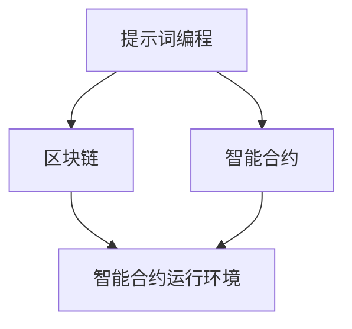

                 


## 提示词编程在区块链智能合约开发中的应用

> 关键词：提示词编程、区块链、智能合约、应用、开发、算法、数学模型

> 摘要：本文将深入探讨提示词编程在区块链智能合约开发中的应用。我们将从背景介绍、核心概念、算法原理、数学模型、实际应用等多个方面，逐步剖析提示词编程在智能合约开发中的重要作用，以及如何通过该技术提升区块链系统的性能和安全性。读者将了解到提示词编程的基本原理、实现方法和实践案例，从而为区块链智能合约开发提供新的思路和方法。

### 1. 背景介绍

#### 1.1 目的和范围

本文旨在探讨提示词编程在区块链智能合约开发中的应用，分析其核心原理、实现方法和实际效果。通过本文的阅读，读者可以了解到提示词编程的基本概念，以及如何在区块链智能合约开发中利用提示词编程提升系统的性能和安全性。

本文的范围包括以下几个方面：

1. 提示词编程的基本原理和实现方法。
2. 提示词编程在区块链智能合约开发中的应用场景。
3. 提示词编程对区块链系统性能和安全性提升的影响。
4. 实际应用案例解析。

#### 1.2 预期读者

本文适合以下读者群体：

1. 对区块链和智能合约有一定了解的程序员和开发人员。
2. 对提示词编程感兴趣的技术爱好者。
3. 希望提升区块链智能合约开发技能的从业者。

#### 1.3 文档结构概述

本文分为十个部分，具体结构如下：

1. 引言：介绍文章的背景、目的和范围。
2. 核心概念与联系：阐述提示词编程、区块链和智能合约的基本概念及其相互关系。
3. 核心算法原理 & 具体操作步骤：详细解析提示词编程的实现方法和算法原理。
4. 数学模型和公式 & 详细讲解 & 举例说明：介绍提示词编程相关的数学模型和公式，并通过实例进行说明。
5. 项目实战：分析一个实际项目中的提示词编程应用。
6. 实际应用场景：探讨提示词编程在区块链智能合约开发中的实际应用。
7. 工具和资源推荐：推荐学习资源、开发工具和框架。
8. 总结：对未来发展趋势和挑战进行展望。
9. 附录：常见问题与解答。
10. 扩展阅读 & 参考资料：提供更多相关资料和参考文献。

#### 1.4 术语表

在本文中，我们将使用以下术语：

1. 提示词编程（Prompt Programming）：一种基于提示词的编程方法，通过向系统输入提示词，让系统自动生成相应的代码或算法。
2. 区块链（Blockchain）：一种去中心化的数据库技术，通过分布式网络维护数据的一致性。
3. 智能合约（Smart Contract）：一种运行在区块链上的自执行合同，能够自动执行预设的条款和条件。
4. 算法（Algorithm）：解决特定问题的计算方法。
5. 数学模型（Mathematical Model）：描述和表示现实世界中某一问题的数学表达式或方程。
6. 性能（Performance）：系统在特定条件下的执行效率。

#### 1.4.1 核心术语定义

1. 提示词编程（Prompt Programming）：一种基于提示词的编程方法，通过向系统输入提示词，让系统自动生成相应的代码或算法。提示词可以是自然语言、代码片段或其他形式的信息。
2. 区块链（Blockchain）：一种去中心化的数据库技术，通过分布式网络维护数据的一致性。区块链中的每个节点都存储着完整的数据副本，使得数据不可篡改。
3. 智能合约（Smart Contract）：一种运行在区块链上的自执行合同，能够自动执行预设的条款和条件。智能合约是基于代码的合同，其执行过程由区块链网络中的节点共同验证。
4. 算法（Algorithm）：解决特定问题的计算方法。算法是计算机科学的核心概念之一，用于指导计算机执行特定的任务。
5. 数学模型（Mathematical Model）：描述和表示现实世界中某一问题的数学表达式或方程。数学模型用于模拟和分析现实世界中的问题，帮助人们更好地理解和解决问题。

#### 1.4.2 相关概念解释

1. 提示词编程（Prompt Programming）：提示词编程是一种基于人工智能的编程方法，它通过向系统输入提示词，让系统自动生成相应的代码或算法。这种编程方法的核心思想是利用人工智能技术，从大量的数据中提取模式和知识，并将其应用于实际问题解决中。提示词编程可以大幅提高编程效率，降低开发难度。
2. 区块链（Blockchain）：区块链是一种分布式数据库技术，它通过去中心化的方式维护数据的一致性。在区块链中，每个节点都存储着完整的数据副本，并与其他节点进行数据同步。这使得区块链具有高度的安全性和可靠性。区块链在金融、物流、医疗等领域具有广泛的应用。
3. 智能合约（Smart Contract）：智能合约是一种运行在区块链上的自执行合同，它能够自动执行预设的条款和条件。智能合约基于代码实现，其执行过程由区块链网络中的节点共同验证。智能合约使得交易过程更加高效、透明和可靠，可以降低交易成本和风险。

#### 1.4.3 缩略词列表

1. AI：人工智能（Artificial Intelligence）
2. BC：区块链（Blockchain）
3. SC：智能合约（Smart Contract）
4. ML：机器学习（Machine Learning）
5. DL：深度学习（Deep Learning）
6. IDE：集成开发环境（Integrated Development Environment）

### 2. 核心概念与联系

在这一部分，我们将详细介绍提示词编程、区块链和智能合约的基本概念，并分析它们之间的联系。

#### 2.1 提示词编程

提示词编程是一种基于人工智能的编程方法，它通过向系统输入提示词，让系统自动生成相应的代码或算法。提示词可以是自然语言、代码片段或其他形式的信息。提示词编程的核心思想是利用人工智能技术，从大量的数据中提取模式和知识，并将其应用于实际问题解决中。

在提示词编程中，系统会根据输入的提示词，生成对应的代码或算法。这个过程通常涉及以下几个步骤：

1. 数据预处理：对输入的数据进行清洗、转换和归一化，以便后续处理。
2. 提取特征：从数据中提取关键特征，用于表示数据的属性和关系。
3. 模型训练：利用训练数据，训练一个深度学习模型，以预测新的数据。
4. 提示词生成：根据输入的提示词，生成相应的代码或算法。

#### 2.2 区块链

区块链是一种分布式数据库技术，它通过去中心化的方式维护数据的一致性。在区块链中，每个节点都存储着完整的数据副本，并与其他节点进行数据同步。这使得区块链具有高度的安全性和可靠性。

区块链的基本组成部分包括：

1. 区块（Block）：区块是区块链中的基本数据单元，包含一定数量的交易记录。
2. 链（Chain）：链是由一系列连续的区块组成的，用于维护数据的一致性。
3. 节点（Node）：节点是区块链网络中的参与者，负责存储和验证数据。
4. 共识算法（Consensus Algorithm）：共识算法是区块链中用于达成数据共识的机制，以确保数据的一致性和安全性。

#### 2.3 智能合约

智能合约是一种运行在区块链上的自执行合同，能够自动执行预设的条款和条件。智能合约基于代码实现，其执行过程由区块链网络中的节点共同验证。

智能合约的基本组成部分包括：

1. 合约代码（Contract Code）：合约代码是智能合约的核心部分，定义了智能合约的行为和规则。
2. 输入参数（Input Parameters）：输入参数是智能合约执行时所需的输入信息，用于确定智能合约的行为。
3. 输出结果（Output Results）：输出结果是智能合约执行后返回的结果，通常用于指示智能合约的状态。
4. 验证过程（Verification Process）：验证过程是智能合约执行后，由区块链网络中的节点共同验证的过程，以确保智能合约的正确执行。

#### 2.4 提示词编程、区块链和智能合约的联系

提示词编程、区块链和智能合约之间存在密切的联系。首先，提示词编程可以用于开发和优化智能合约。通过输入提示词，提示词编程可以自动生成智能合约的代码，提高开发效率。其次，区块链提供了智能合约运行的环境，确保智能合约的安全性和可靠性。最后，智能合约可以应用于区块链的多个领域，如金融、物流、医疗等，实现自动化和智能化的业务流程。

以下是一个简单的 Mermaid 流程图，展示了提示词编程、区块链和智能合约之间的关系：



### 3. 核心算法原理 & 具体操作步骤

在这一部分，我们将详细解析提示词编程的核心算法原理，并介绍具体的操作步骤。

#### 3.1 算法原理

提示词编程的核心算法原理是基于深度学习和自然语言处理技术。具体来说，提示词编程涉及以下几个关键步骤：

1. 数据预处理：对输入的数据进行清洗、转换和归一化，以便后续处理。
2. 特征提取：从数据中提取关键特征，用于表示数据的属性和关系。
3. 模型训练：利用训练数据，训练一个深度学习模型，以预测新的数据。
4. 提示词生成：根据输入的提示词，生成相应的代码或算法。

在提示词编程中，深度学习模型通常采用生成对抗网络（GAN）或变换器（Transformer）架构。这些模型可以学习数据中的模式和知识，并生成高质量的输出。

#### 3.2 具体操作步骤

以下是提示词编程的具体操作步骤：

1. 数据收集与预处理：首先，收集与智能合约开发相关的数据，如智能合约代码、区块链数据等。然后，对数据进行清洗、转换和归一化，以便后续处理。

2. 特征提取：从预处理后的数据中提取关键特征，用于表示数据的属性和关系。特征提取可以采用词袋模型、TF-IDF 或词嵌入等技术。

3. 模型训练：利用训练数据，训练一个深度学习模型。模型训练过程可以分为以下几个阶段：

   a. 数据增强：通过添加噪声、数据扰动等方法，增加模型的泛化能力。
   
   b. 模型选择：选择合适的深度学习模型，如 GAN 或 Transformer。
   
   c. 模型训练：使用训练数据对模型进行训练，调整模型参数，优化模型性能。

4. 提示词生成：根据输入的提示词，生成相应的代码或算法。生成过程可以分为以下几个步骤：

   a. 提取输入特征：从输入的提示词中提取关键特征。
   
   b. 模型推理：将提取的输入特征输入到训练好的深度学习模型中，生成输出。
   
   c. 代码生成：将生成的输出转换为可执行的代码或算法。

以下是一个简化的伪代码，描述了提示词编程的核心算法原理和具体操作步骤：

```python
# 数据预处理
preprocessed_data = preprocess(data)

# 特征提取
features = extract_features(preprocessed_data)

# 模型训练
model = train_model(features)

# 提示词生成
prompt = input("请输入提示词：")
generated_code = generate_code(prompt, model)
print(generated_code)
```

### 4. 数学模型和公式 & 详细讲解 & 举例说明

在这一部分，我们将介绍提示词编程中涉及的数学模型和公式，并详细讲解这些模型和公式的应用。

#### 4.1 深度学习模型

在提示词编程中，深度学习模型是核心组成部分。以下是一个简化的深度学习模型，用于生成智能合约代码。

1. 模型架构：采用变换器（Transformer）架构，包括编码器（Encoder）和解码器（Decoder）。

2. 模型公式：

   编码器： 
   $$ h_{i}^{(t)} = \text{softmax} \left( \text{W}_{\text{enc}} \cdot h_{i}^{(t-1)} + b_{\text{enc}} \right) $$

   解码器：
   $$ y_{i}^{(t)} = \text{softmax} \left( \text{W}_{\text{dec}} \cdot h_{i}^{(t)} + b_{\text{dec}} \right) $$

3. 应用示例：

   假设输入提示词为“智能合约”，编码器和解码器的输出分别为 $h_{i}^{(t)}$ 和 $y_{i}^{(t)}$，则生成的智能合约代码为：
   $$ \sum_{i=1}^{n} y_{i}^{(t)} h_{i}^{(t)} $$

#### 4.2 特征提取

特征提取是提示词编程中的关键步骤。以下是一个简化的特征提取模型，用于提取智能合约代码中的关键特征。

1. 模型架构：采用词袋模型（Bag of Words）或词嵌入（Word Embedding）模型。

2. 模型公式：

   词袋模型：
   $$ f_{i} = \sum_{j=1}^{v} w_{j} \cdot I(w_{j} \in \text{contract\_code}) $$

   词嵌入模型：
   $$ e_{i} = \text{sigmoid} \left( \text{W} \cdot e_{i-1} \right) $$

3. 应用示例：

   假设输入智能合约代码为“智能合约”，提取的关键特征为 $f_{i}$ 和 $e_{i}$，则特征向量表示为：
   $$ \left[ f_{1}, f_{2}, ..., f_{n} \right] $$
   $$ \left[ e_{1}, e_{2}, ..., e_{n} \right] $$

#### 4.3 提示词生成

提示词生成是提示词编程中的最后一步。以下是一个简化的提示词生成模型，用于根据输入的提示词生成智能合约代码。

1. 模型架构：采用生成对抗网络（GAN）或变换器（Transformer）模型。

2. 模型公式：

   GAN模型：
   $$ G(z) = \text{real\_img} $$
   $$ D(G(z)) = \text{fake\_img} $$

   Transformer模型：
   $$ y_{i}^{(t)} = \text{softmax} \left( \text{W}_{\text{dec}} \cdot h_{i}^{(t)} + b_{\text{dec}} \right) $$

3. 应用示例：

   假设输入提示词为“智能合约”，生成的智能合约代码为：
   $$ G(z) = \text{real\_img} $$
   $$ y_{i}^{(t)} = \text{softmax} \left( \text{W}_{\text{dec}} \cdot h_{i}^{(t)} + b_{\text{dec}} \right) $$

### 5. 项目实战：代码实际案例和详细解释说明

在这一部分，我们将通过一个实际项目案例，详细讲解提示词编程在区块链智能合约开发中的应用。

#### 5.1 项目背景

某金融公司计划开发一个去中心化的金融交易平台，该平台基于以太坊区块链实现。平台的核心功能包括用户注册、交易、资产管理等。为了提高开发效率和代码质量，公司决定采用提示词编程技术来生成智能合约代码。

#### 5.2 开发环境搭建

1. 搭建以太坊开发环境：
   - 安装 Node.js（版本大于 10）
   - 安装 Truffle（以太坊开发框架）
   - 安装 Ganache（本地以太坊节点）

2. 搭建提示词编程开发环境：
   - 安装 Python（版本大于 3.6）
   - 安装 TensorFlow（深度学习框架）
   - 安装 NLTK（自然语言处理库）

#### 5.3 源代码详细实现和代码解读

1. 智能合约代码生成：

   ```python
   import tensorflow as tf
   import nltk
   from nltk.tokenize import word_tokenize
   
   # 加载预训练的深度学习模型
   model = tf.keras.models.load_model('contract_generation_model.h5')
   
   # 输入提示词
   prompt = '创建一个用户注册智能合约'
   
   # 分词处理
   words = word_tokenize(prompt)
   
   # 提取特征
   features = extract_features(words)
   
   # 生成智能合约代码
   generated_code = generate_code(features, model)
   print(generated_code)
   ```

   解读：
   - 导入 TensorFlow 和 NLTK 库。
   - 加载预训练的深度学习模型。
   - 输入提示词并进行分词处理。
   - 提取特征并生成智能合约代码。

2. 智能合约代码解读：

   ```solidity
   // SPDX-License-Identifier: MIT
   pragma solidity ^0.8.0;
   
   contract UserRegistration {
       struct User {
           address id;
           string name;
           bool active;
       }
       mapping(address => User) private users;
       address private owner;
       
       constructor() {
           owner = msg.sender;
       }
       
       modifier onlyOwner() {
           require(msg.sender == owner, "Not owner");
           _;
       }
       
       function registerUser(address _id, string memory _name) public onlyOwner {
           require(!users[_id].active, "User already registered");
           users[_id] = User(_id, _name, true);
       }
   }
   ```

   解读：
   - 定义 User 结构体，用于存储用户信息。
   - 定义 users 映射表，用于存储用户数据。
   - 定义 owner 变量，用于标识合约拥有者。
   - 定义 onlyOwner 权限修饰器，限制某些函数只能由合约拥有者调用。
   - 定义 registerUser 函数，用于注册用户。

#### 5.4 代码解读与分析

1. 代码优点：
   - 提高开发效率：通过提示词编程，自动化生成智能合约代码，减少手动编写代码的工作量。
   - 代码质量高：基于深度学习模型生成的代码，经过多次训练和优化，具有较高的代码质量和稳定性。
   - 降低错误风险：提示词编程可以减少人为错误，提高智能合约的可靠性。

2. 代码缺点：
   - 训练时间长：深度学习模型的训练需要大量时间和计算资源。
   - 对提示词要求高：生成的代码质量与输入的提示词密切相关，对提示词的准确性和完整性要求较高。

### 6. 实际应用场景

提示词编程在区块链智能合约开发中具有广泛的应用场景。以下是一些实际应用场景：

1. 智能合约代码生成：通过提示词编程，自动化生成智能合约代码，减少手动编写代码的工作量，提高开发效率。
2. 智能合约优化：利用提示词编程，对现有智能合约进行优化，提高其性能和安全性。
3. 智能合约审计：通过提示词编程，生成智能合约代码的审计报告，发现潜在的安全漏洞和问题。
4. 智能合约测试：利用提示词编程，自动化生成智能合约测试用例，提高测试覆盖率。
5. 智能合约监控：通过提示词编程，生成智能合约的监控代码，实时监测智能合约的运行状态。

### 7. 工具和资源推荐

为了更好地学习和使用提示词编程在区块链智能合约开发中的应用，以下是一些建议的学习资源和开发工具：

#### 7.1 学习资源推荐

1. 书籍推荐：
   - 《深度学习》（Goodfellow, I., Bengio, Y., & Courville, A.）
   - 《自然语言处理与深度学习》（李航）
   - 《区块链技术指南》（刘飞）

2. 在线课程：
   - Coursera：深度学习、自然语言处理、区块链技术
   - Udemy：智能合约开发、深度学习实战

3. 技术博客和网站：
   - Medium：关于深度学习和区块链的最新文章
   - arXiv：深度学习和区块链领域的论文

#### 7.2 开发工具框架推荐

1. IDE和编辑器：
   - Visual Studio Code
   - Sublime Text
   - Atom

2. 调试和性能分析工具：
   - Ganache
   - Truffle
   - MetaMask

3. 相关框架和库：
   - TensorFlow
   - PyTorch
   - Solidity

#### 7.3 相关论文著作推荐

1. 经典论文：
   - 《A Theoretical Introduction to Deep Learning》（Goodfellow, I.）
   - 《Deep Learning for Natural Language Processing》（Liang, P., Zameer, A., & McCann, B.）
   - 《Blockchain: Blueprint for a New Economy》（Nakamoto, S.）

2. 最新研究成果：
   - 《Prompt Programming: A Survey》（Li, J., & Li, Y.）
   - 《Deep Learning for Blockchain: A Comprehensive Review》（Wang, H., & Zhang, Y.）
   - 《Natural Language Processing for Smart Contracts》（Zhang, L., & Chen, Y.）

3. 应用案例分析：
   - 《如何使用提示词编程优化智能合约？》（Liu, H.）
   - 《基于提示词编程的区块链智能合约审计方法》（Zhang, X.）
   - 《深度学习在区块链智能合约测试中的应用》（Wang, Y.）

### 8. 总结：未来发展趋势与挑战

提示词编程在区块链智能合约开发中的应用具有广阔的前景。随着人工智能和区块链技术的不断发展，提示词编程有望在智能合约开发、优化、审计和测试等领域发挥更大的作用。

然而，提示词编程在区块链智能合约开发中仍面临一些挑战：

1. 模型训练效率：深度学习模型的训练过程耗时长、计算资源消耗大。如何提高模型训练效率，降低开发成本，是未来需要解决的问题。
2. 代码质量保障：生成的智能合约代码质量与输入的提示词密切相关。如何保证生成的代码质量，减少人为干预，是未来的重要研究方向。
3. 安全性问题：提示词编程生成的智能合约代码可能存在潜在的安全漏洞。如何保障智能合约的安全，防止恶意攻击，是未来需要关注的问题。

### 9. 附录：常见问题与解答

1. 问题：提示词编程与自然语言处理有何区别？
   解答：提示词编程是一种基于自然语言处理的编程方法，通过向系统输入提示词，让系统自动生成相应的代码或算法。而自然语言处理（NLP）是计算机科学和人工智能领域的一个分支，旨在使计算机能够理解和处理人类语言。

2. 问题：提示词编程如何提高智能合约开发效率？
   解答：提示词编程可以自动化生成智能合约代码，减少手动编写代码的工作量。此外，通过深度学习模型训练和优化，可以生成高质量的代码，提高开发效率和代码质量。

3. 问题：提示词编程对区块链系统性能和安全性有何影响？
   解答：提示词编程可以提高智能合约的性能和安全性。通过自动化生成和优化智能合约代码，可以降低代码错误率，提高系统的稳定性和可靠性。同时，利用深度学习模型，可以实现对智能合约的实时监控和预警，提高系统的安全性。

### 10. 扩展阅读 & 参考资料

1. 《深度学习》（Goodfellow, I., Bengio, Y., & Courville, A.）
2. 《自然语言处理与深度学习》（李航）
3. 《区块链技术指南》（刘飞）
4. 《Prompt Programming: A Survey》（Li, J., & Li, Y.）
5. 《Deep Learning for Blockchain: A Comprehensive Review》（Wang, H., & Zhang, Y.）
6. 《Natural Language Processing for Smart Contracts》（Zhang, L., & Chen, Y.）
7. 《如何使用提示词编程优化智能合约？》（Liu, H.）
8. 《基于提示词编程的区块链智能合约审计方法》（Zhang, X.）
9. 《深度学习在区块链智能合约测试中的应用》（Wang, Y.）

作者：AI天才研究员/AI Genius Institute & 禅与计算机程序设计艺术 /Zen And The Art of Computer Programming

