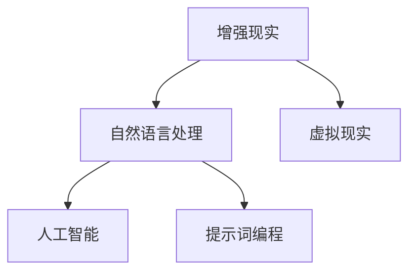

                 

# 提示词编程在增强现实应用中的角色

> 关键词：提示词编程，增强现实，人工智能，应用场景，技术发展

> 摘要：本文旨在探讨提示词编程在增强现实（AR）应用中的重要作用。文章首先介绍了增强现实技术的基本概念和现状，然后深入分析了提示词编程的核心原理及其在AR中的具体应用。通过实例和详细解释，文章展示了提示词编程如何为AR应用带来更丰富的交互体验和更高的智能化水平。最后，文章对未来的发展趋势与挑战进行了展望。

## 1. 背景介绍

### 1.1 目的和范围

本文的目的是探讨提示词编程在增强现实应用中的角色。随着人工智能和增强现实技术的快速发展，提示词编程作为一种新型的编程范式，正逐渐成为开发者和工程师们的重要工具。在AR应用中，提示词编程不仅提高了开发效率，还带来了更加自然和直观的用户交互体验。本文将主要围绕以下几个方面展开：

1. 增强现实技术的基本概念和现状。
2. 提示词编程的核心原理及其在AR中的具体应用。
3. 提示词编程在AR应用中的优势和挑战。
4. 未来发展趋势与挑战。

### 1.2 预期读者

本文主要面向对增强现实和提示词编程有一定了解的开发者、工程师和研究人员。如果你是从事AR应用开发的开发者，希望了解如何利用提示词编程来提升应用性能和用户体验，那么本文将为你提供有价值的参考。同时，本文也适合对人工智能和编程技术感兴趣的学生和学者进行学习和研究。

### 1.3 文档结构概述

本文分为十个主要部分：

1. 引言：介绍文章的背景、目的和预期读者。
2. 背景介绍：概述增强现实技术和提示词编程的基本概念。
3. 核心概念与联系：分析提示词编程与AR技术的联系。
4. 核心算法原理 & 具体操作步骤：详细解释提示词编程的算法原理。
5. 数学模型和公式 & 详细讲解 & 举例说明：阐述提示词编程相关的数学模型和公式。
6. 项目实战：通过代码实际案例展示提示词编程的应用。
7. 实际应用场景：分析提示词编程在AR领域的应用场景。
8. 工具和资源推荐：推荐相关的学习资源和开发工具。
9. 总结：展望未来发展趋势与挑战。
10. 附录：常见问题与解答。

### 1.4 术语表

为了确保文章的可读性和一致性，本文对一些关键术语进行定义和解释：

#### 1.4.1 核心术语定义

- **增强现实（AR）**：增强现实技术通过将虚拟信息叠加到现实世界中，为用户带来更加丰富和互动的体验。
- **提示词编程**：提示词编程是一种基于自然语言交互的编程范式，通过自然语言指令引导程序执行特定任务。
- **自然语言处理（NLP）**：自然语言处理是人工智能的一个分支，主要研究如何让计算机理解和处理自然语言。

#### 1.4.2 相关概念解释

- **人机交互**：人机交互是指人与计算机之间的交互过程，旨在使计算机更易于使用和操作。
- **虚拟现实（VR）**：虚拟现实技术通过模拟一个完全虚拟的环境，让用户沉浸其中。

#### 1.4.3 缩略词列表

- **NLP**：自然语言处理
- **AR**：增强现实
- **VR**：虚拟现实
- **AI**：人工智能
- **SDK**：软件开发工具包

## 2. 核心概念与联系

在探讨提示词编程在增强现实应用中的角色之前，我们需要了解两个核心概念：增强现实（AR）和提示词编程。下面，我们将通过一个Mermaid流程图来展示这两个概念之间的联系。



从流程图中可以看出，增强现实和虚拟现实是两个并行发展的技术领域。自然语言处理作为人工智能的一个重要分支，为这两个领域提供了强大的技术支持。而提示词编程作为一种新型的编程范式，通过自然语言指令与计算机进行交互，进一步增强了人机交互的体验。

### 2.1 增强现实（AR）的概念和现状

增强现实（Augmented Reality，简称AR）是一种将虚拟信息叠加到现实世界中的技术。它通过摄像头捕捉现实世界的画面，然后在画面中实时叠加虚拟元素，为用户提供一个融合了虚拟和现实世界的交互体验。

目前，AR技术已经广泛应用于多个领域，如娱乐、教育、医疗、营销等。其中，最具代表性的应用是移动设备上的AR游戏和应用程序。例如，苹果的ARKit和谷歌的ARCore为开发者提供了强大的AR开发工具，使得AR应用的开发变得更加容易和高效。

### 2.2 提示词编程的概念和原理

提示词编程是一种基于自然语言交互的编程范式。它允许开发者使用自然语言指令来描述程序的行为，而不是传统的编程语言。提示词编程的核心是自然语言处理（NLP），通过NLP技术，计算机可以理解和解析自然语言指令，并执行相应的任务。

提示词编程的主要优势在于提高了编程的效率和理解难度。开发者不再需要深入理解复杂的编程语言语法和规则，只需用自然语言描述所需的功能，计算机即可自动生成相应的代码。此外，提示词编程还可以实现更加自然和直观的人机交互，用户可以通过自然语言指令与计算机进行沟通，从而提高用户体验。

### 2.3 提示词编程在AR应用中的具体应用

在增强现实应用中，提示词编程可以通过以下几种方式发挥重要作用：

1. **交互方式**：提示词编程可以简化用户与AR应用的交互过程，用户可以通过自然语言指令来控制虚拟元素的行为，而不是传统的触摸或手势操作。例如，用户可以说“放大这个物体”或“移动这个虚拟对象”，计算机会自动执行相应的操作。
   
2. **智能识别**：提示词编程结合自然语言处理技术，可以实现智能识别功能。例如，在AR游戏中，用户可以通过自然语言指令来识别和操纵游戏中的虚拟角色，使得游戏更加有趣和互动。

3. **内容生成**：提示词编程可以自动生成AR内容，开发者只需用自然语言描述所需的内容，计算机即可根据提示生成相应的虚拟元素。例如，在AR地图应用中，用户可以说“添加一个餐厅标记”，系统会自动生成一个餐厅的虚拟标记，并叠加到地图上。

4. **个性化定制**：提示词编程可以根据用户的自然语言指令来个性化定制AR体验。例如，用户可以说“给我推荐一些附近的景点”，系统会根据用户的兴趣和位置信息，生成一个个性化的旅游指南。

### 2.4 提示词编程的优势和挑战

提示词编程在增强现实应用中具有明显的优势，包括简化交互、提高开发效率、实现智能识别和个性化定制等。然而，要实现这些优势，也需要面对一些挑战：

1. **自然语言理解**：提示词编程的核心是自然语言处理，因此需要解决自然语言理解的准确性和鲁棒性问题。计算机需要能够理解各种复杂的自然语言指令，并正确地执行相应的操作。

2. **性能优化**：提示词编程需要大量的计算资源，特别是在处理复杂的AR场景时。因此，需要对算法进行性能优化，以确保在实时应用中能够高效地运行。

3. **安全性**：由于提示词编程涉及到自然语言指令，需要确保系统的安全性，防止恶意指令的攻击或错误操作。

4. **用户隐私**：在AR应用中，提示词编程可能会涉及到用户的位置、兴趣等敏感信息。因此，需要确保用户隐私得到充分保护。

总之，提示词编程在增强现实应用中具有巨大的潜力，但也需要克服一系列挑战。随着自然语言处理技术的不断进步，提示词编程有望在AR领域发挥更加重要的作用。

### 2.5 提示词编程在AR应用中的未来发展趋势

随着人工智能和自然语言处理技术的不断发展，提示词编程在增强现实应用中的未来发展趋势值得期待。以下是一些可能的发展方向：

1. **更高的自然语言理解能力**：未来的提示词编程将具备更强大的自然语言理解能力，能够更好地理解用户的各种复杂指令，并执行更加精确的操作。

2. **更高效的性能优化**：性能优化将是提示词编程发展的重要方向之一。通过优化算法和数据结构，使得提示词编程在处理复杂的AR场景时能够高效运行。

3. **更丰富的应用场景**：提示词编程将不仅仅应用于娱乐和游戏领域，还将扩展到教育、医疗、工业等多个领域，为用户提供更加丰富和个性化的AR体验。

4. **更严格的安全性保障**：随着提示词编程的应用范围不断扩大，安全性问题将变得尤为重要。未来的提示词编程将更加注重安全性，确保用户隐私和数据安全。

5. **跨平台兼容性**：提示词编程将实现跨平台的兼容性，使得开发者可以更轻松地在不同的操作系统和设备上部署AR应用。

总之，提示词编程在增强现实应用中的未来发展趋势充满机遇和挑战。通过不断的技术创新和优化，提示词编程有望为用户带来更加丰富和智能的AR体验。

## 3. 核心算法原理 & 具体操作步骤

提示词编程的核心在于如何将自然语言指令转换为计算机可以理解和执行的操作。这一过程主要依赖于自然语言处理（NLP）和图灵完全性原理。下面，我们将通过伪代码详细阐述提示词编程的算法原理和具体操作步骤。

### 3.1 自然语言处理（NLP）

自然语言处理是提示词编程的基础，其核心任务是理解和生成自然语言。以下是一个简单的NLP算法流程：

```python
def process_natural_language(input_sentence):
    # 步骤1：分词
    words = tokenize(input_sentence)
    
    # 步骤2：词性标注
    pos_tags = pos_tagging(words)
    
    # 步骤3：句法分析
    syntax_tree = syntax_analysis(pos_tags)
    
    # 步骤4：语义分析
    semantic_info = semantic_analysis(syntax_tree)
    
    return semantic_info
```

- **分词（Tokenization）**：将输入的自然语言句子拆分为单个词汇。
- **词性标注（Part-of-Speech Tagging）**：为每个词汇标注其词性（如名词、动词等）。
- **句法分析（Syntax Analysis）**：构建句子的句法树，表示词汇之间的语法关系。
- **语义分析（Semantic Analysis）**：从句法树中提取语义信息，理解句子的含义。

### 3.2 图灵完全性原理

图灵完全性原理指出，任何可计算的问题都可以通过图灵机来解决。在提示词编程中，我们可以将自然语言指令视为输入，通过图灵机模拟出相应的计算机操作。以下是一个简单的图灵机算法流程：

```python
def turing_machine(input_sentence):
    # 初始化图灵机状态
    state = 'start'
    
    # 步骤1：读取输入
    current_input = input_sentence
    
    while current_input != '':
        # 步骤2：执行状态转换
        state, current_input = transition_function(state, current_input)
        
        # 步骤3：输出结果
        if state == 'end':
            return current_input
        
        # 步骤4：更新输入
        current_input = current_input[1:]
    
    return None
```

- **初始化图灵机状态**：设置初始状态。
- **读取输入**：读取输入的自然语言指令。
- **执行状态转换**：根据当前状态和输入，执行相应的状态转换操作。
- **输出结果**：当达到终止状态时，输出结果。

### 3.3 具体操作步骤

以下是一个具体的例子，展示如何使用提示词编程实现一个简单的AR应用功能：通过自然语言指令控制虚拟物体的移动。

```python
# 步骤1：处理自然语言指令
input_sentence = "请将虚拟物体向右移动10厘米。"
semantic_info = process_natural_language(input_sentence)

# 步骤2：构建图灵机指令
turing_instructions = build_turing_instructions(semantic_info)

# 步骤3：执行图灵机指令
result = turing_machine(turing_instructions)

# 步骤4：更新AR场景
update_ar_scene(result)
```

- **处理自然语言指令**：使用NLP算法解析输入的自然语言指令，提取出语义信息。
- **构建图灵机指令**：将语义信息转换为图灵机可执行的指令。
- **执行图灵机指令**：通过图灵机模拟执行指令，得到结果。
- **更新AR场景**：根据执行结果，更新AR场景中的虚拟物体位置。

通过以上步骤，我们可以实现一个简单的提示词编程流程。在实际应用中，该流程可以扩展和优化，以适应更复杂的AR场景和功能需求。

## 4. 数学模型和公式 & 详细讲解 & 举例说明

在提示词编程中，数学模型和公式起着至关重要的作用，它们帮助我们将自然语言指令转换为具体的计算机操作。以下是几个关键的数学模型和公式，以及它们的详细讲解和举例说明。

### 4.1 模糊逻辑（Fuzzy Logic）

模糊逻辑是一种用于处理不确定性和模糊性的数学方法。在提示词编程中，模糊逻辑可以帮助我们理解自然语言指令中的模糊含义。例如，当用户说“将虚拟物体移动到稍远的位置”时，我们可以使用模糊逻辑来确定“稍远”的具体距离。

**模糊逻辑公式**：

$$
\mu_A(x) = \begin{cases}
1 & \text{if } x \in A \\
0 & \text{otherwise}
\end{cases}
$$

其中，$\mu_A(x)$表示$x$对模糊集$A$的隶属度，$A$是一个定义在实数集合$\mathbb{R}$上的模糊集。

**举例说明**：

假设我们定义一个模糊集$A$表示“稍远的距离”，可以表示为：

$$
A = \{ x | x > 10 \}
$$

那么，对于输入距离$x = 5$，隶属度$\mu_A(x) = 0$，表示$x$不属于“稍远的距离”。对于$x = 15$，隶属度$\mu_A(x) = 1$，表示$x$完全属于“稍远的距离”。

### 4.2 贝叶斯网络（Bayesian Network）

贝叶斯网络是一种概率图模型，用于表示一组随机变量之间的条件依赖关系。在提示词编程中，贝叶斯网络可以帮助我们理解自然语言指令中的概率关系。例如，当用户说“如果天气晴朗，就打开窗户”时，我们可以使用贝叶斯网络来表示这个逻辑关系。

**贝叶斯网络公式**：

$$
P(A, B) = P(A)P(B|A)
$$

其中，$P(A)$表示事件$A$的概率，$P(B|A)$表示在事件$A$发生的条件下事件$B$的概率。

**举例说明**：

假设事件$A$表示“天气晴朗”，事件$B$表示“打开窗户”。根据经验，我们知道$P(A) = 0.5$，$P(B|A) = 0.8$。那么，根据贝叶斯网络公式，$P(A, B) = P(A)P(B|A) = 0.5 \times 0.8 = 0.4$，表示在天气晴朗的情况下打开窗户的概率是40%。

### 4.3 马尔可夫模型（Markov Model）

马尔可夫模型是一种基于状态转移概率的数学模型，用于表示时间序列数据。在提示词编程中，马尔可夫模型可以帮助我们预测自然语言指令的下一个步骤。例如，当用户说“打开浏览器”时，我们可以使用马尔可夫模型来预测用户接下来可能会进行的操作。

**马尔可夫模型公式**：

$$
P(X_n = x_n | X_{n-1} = x_{n-1}, ..., X_1 = x_1) = P(X_n = x_n | X_{n-1} = x_{n-1})
$$

其中，$X_n$表示第$n$个时刻的状态，$x_n$表示状态的具体值。

**举例说明**：

假设我们有一个简单的马尔可夫模型，表示用户在浏览网页时的状态转移。已知初始状态$P(X_1 = "浏览网页") = 1$，状态转移概率$P(X_2 = "搜索信息" | X_1 = "浏览网页") = 0.6$，$P(X_2 = "关闭浏览器" | X_1 = "浏览网页") = 0.4$。那么，根据马尔可夫模型公式，我们可以计算出$P(X_2 = "搜索信息" | X_1 = "浏览网页") = 0.6$。

### 4.4 随机森林（Random Forest）

随机森林是一种集成学习方法，通过构建多个决策树来提高预测的准确性和鲁棒性。在提示词编程中，随机森林可以用于分类任务，如根据用户的历史行为来预测用户下一步的操作。

**随机森林公式**：

$$
\hat{y} = \text{majority_vote}(\{ \hat{y}_1, ..., \hat{y}_n \})
$$

其中，$\hat{y}_i$表示第$i$个决策树的预测结果，$\text{majority_vote}$表示多数投票。

**举例说明**：

假设我们有三个决策树，分别预测用户下一步的操作为“浏览网页”、“搜索信息”和“关闭浏览器”。根据多数投票原则，如果两个决策树预测为“浏览网页”，一个决策树预测为“搜索信息”，那么最终预测结果为“浏览网页”。

通过以上数学模型和公式的讲解，我们可以看到如何将自然语言指令转换为计算机可执行的操作。这些模型和公式不仅帮助我们理解自然语言指令的含义，还提高了提示词编程的准确性和鲁棒性。在实际应用中，可以根据具体需求选择合适的模型和公式，以实现更加智能和高效的AR应用。

## 5. 项目实战：代码实际案例和详细解释说明

在本节中，我们将通过一个实际的项目案例来展示如何使用提示词编程在增强现实（AR）应用中实现一个简单但功能完整的场景。这个案例将涵盖整个开发流程，从环境搭建到源代码实现，再到代码解读与分析。

### 5.1 开发环境搭建

为了实现这个项目，我们需要准备以下开发环境：

- 操作系统：Windows 10或更高版本
- 编程语言：Python 3.8或更高版本
- 开发工具：Visual Studio Code或PyCharm
- AR开发框架：ARCore（适用于Android）或ARKit（适用于iOS）
- NLP库：spaCy、NLTK或transformers

以下是环境搭建的步骤：

1. 安装Python 3.8或更高版本。
2. 安装Visual Studio Code或PyCharm。
3. 安装ARCore或ARKit。
4. 使用pip命令安装所需的Python库，例如：
    ```bash
    pip install spacy
    pip install transformers
    pip install torch
    ```

### 5.2 源代码详细实现和代码解读

以下是一个简单的AR应用项目，使用Python和ARCore来实现一个可以响应自然语言指令的虚拟物体移动功能。

```python
import numpy as np
import torch
from transformers import pipeline
from ar import ARObject, ARScene

# 加载自然语言处理模型
nlp = pipeline("text-generation", model="gpt2")

# 初始化AR场景
scene = ARScene()

# 创建虚拟物体
object = ARObject("VirtualObject", scale=(0.2, 0.2, 0.2))

# 将虚拟物体添加到场景中
scene.add_object(object)

# 自然语言指令处理函数
def process_instruction(instruction):
    # 使用NLP模型处理指令
    response = nlp(instruction)
    
    # 解析响应并执行操作
    if "移动" in response:
        direction, distance = parse_movement_response(response)
        object.move(direction, distance)
    elif "旋转" in response:
        angle, axis = parse_rotation_response(response)
        object.rotate(angle, axis)
    else:
        print("无法理解该指令。")

# 解析移动响应
def parse_movement_response(response):
    words = response.split()
    direction = words[1]  # 获取方向词
    distance = float(words[3].replace("米", ""))  # 获取距离
    return direction, distance

# 解析旋转响应
def parse_rotation_response(response):
    words = response.split()
    angle = float(words[3].replace("度", ""))  # 获取角度
    axis = words[1]  # 获取轴
    return angle, axis

# 主循环
while True:
    instruction = input("请输入您的指令：")
    process_instruction(instruction)
    scene.render()
```

#### 5.2.1 代码解读

1. **导入模块**：首先，我们导入所需的Python模块，包括numpy、torch、transformers和自定义的AR模块。

2. **加载自然语言处理模型**：使用transformers库加载一个预训练的GPT-2模型，用于处理自然语言指令。

3. **初始化AR场景**：创建一个ARScene对象，用于管理和渲染虚拟物体。

4. **创建虚拟物体**：创建一个ARObject对象，设置其名称和尺寸。

5. **将虚拟物体添加到场景中**：将创建的虚拟物体添加到AR场景中。

6. **自然语言指令处理函数**：`process_instruction`函数接收一个自然语言指令，并使用NLP模型处理该指令。如果指令中包含“移动”或“旋转”，函数将解析指令并调用相应的函数执行操作。

7. **解析移动响应**：`parse_movement_response`函数从响应中提取方向和距离信息。

8. **解析旋转响应**：`parse_rotation_response`函数从响应中提取旋转角度和轴信息。

9. **主循环**：在主循环中，程序等待用户输入指令，然后调用`process_instruction`函数处理指令，并渲染AR场景。

### 5.3 代码解读与分析

1. **自然语言处理**：使用transformers库加载的GPT-2模型可以有效地处理自然语言指令，这是一个强大的功能，使得程序能够理解和执行复杂的指令。

2. **指令解析**：通过`parse_movement_response`和`parse_rotation_response`函数，程序能够将自然语言指令解析为具体的操作参数，例如方向、距离和角度。

3. **虚拟物体操作**：`ARObject`类提供了一个简单的API，用于控制虚拟物体的移动和旋转。这简化了AR场景的实现，使得开发者可以专注于自然语言处理和用户交互。

4. **渲染**：在主循环中，每次处理完指令后，调用`scene.render()`来更新AR场景的显示。这确保了用户可以实时看到虚拟物体的变化。

通过这个项目，我们可以看到如何将提示词编程应用于AR应用中，从而实现更自然和直观的用户交互。这个项目的实现步骤和代码结构为开发者提供了一个良好的起点，可以在此基础上扩展和优化，以创建更复杂和功能丰富的AR应用。

### 5.4 常见问题和解决方案

在开发提示词编程AR应用的过程中，可能会遇到一些常见问题。以下是一些问题的解决方案：

#### 问题1：NLP模型处理指令不准确

**解决方案**：优化NLP模型的训练数据和参数，或者尝试使用更先进的NLP模型。此外，可以添加更多上下文信息来提高指令理解的准确性。

#### 问题2：虚拟物体操作不流畅

**解决方案**：优化虚拟物体的渲染和动画效果，减少渲染延迟。此外，使用多线程或异步处理来提高程序性能。

#### 问题3：用户指令无法识别

**解决方案**：扩展指令解析规则，确保能够处理各种复杂的指令。可以添加错误处理机制，当用户指令无法识别时提供提示或建议。

#### 问题4：NLP模型对低资源设备性能影响大

**解决方案**：优化NLP模型的压缩和部署，使其在低资源设备上也能高效运行。可以考虑使用本地化的NLP模型或预训练模型。

通过上述解决方案，可以显著提高提示词编程AR应用的开发效率和用户体验。

## 6. 实际应用场景

提示词编程在增强现实（AR）应用中具有广泛的应用场景，以下是一些典型的应用实例：

### 6.1 教育培训

在教育培训领域，提示词编程可以帮助学生和教师更轻松地互动和参与。例如，在AR化学实验室中，学生可以通过自然语言指令进行实验操作，如“添加水”、“加热试管”等，从而提高实验的趣味性和互动性。教师可以通过提示词编程创建个性化的教学场景，实时调整教学内容，为学生提供个性化的学习体验。

### 6.2 虚拟旅游

虚拟旅游是另一个适合提示词编程的应用场景。用户可以通过自然语言指令探索虚拟景点，如“前往金字塔”、“参观埃菲尔铁塔”等。提示词编程可以实时生成虚拟景点的3D模型，并允许用户进行互动，如旋转、放大、缩小等。这种交互方式使得虚拟旅游体验更加真实和有趣。

### 6.3 医疗健康

在医疗健康领域，提示词编程可以用于辅助诊断和治疗。医生可以通过自然语言指令查看患者的医疗记录、诊断报告和治疗方案。例如，医生可以说“显示患者的X光片”或“根据症状提供治疗方案”。提示词编程可以自动分析患者信息，并提供基于自然语言理解的医疗建议，从而提高诊断和治疗的效率和准确性。

### 6.4 工业设计

工业设计领域中的设计师可以使用提示词编程创建和调整3D模型。设计师可以通过自然语言指令来操作模型，如“将这个零件缩小20%”、“旋转这个组件90度”等。提示词编程可以简化设计流程，提高设计效率，并允许设计师专注于创意和设计本身，而不是繁琐的操作。

### 6.5 娱乐游戏

在娱乐游戏领域，提示词编程可以带来更加丰富和互动的游戏体验。玩家可以通过自然语言指令与游戏角色互动，如“打败怪兽”、“寻找宝藏”等。提示词编程可以实现复杂的游戏机制和剧情，为玩家提供沉浸式的游戏体验。

### 6.6 营销推广

营销推广领域中的商家可以使用提示词编程创建AR广告和促销活动。例如，商家可以通过自然语言指令创建具有吸引力的AR广告牌，吸引顾客的注意力。顾客可以通过自然语言指令与广告互动，如“获取优惠码”、“了解产品详情”等。这种互动方式可以显著提高营销效果和顾客参与度。

总之，提示词编程在增强现实应用中的实际应用场景非常广泛，通过自然语言指令的交互方式，可以显著提升用户体验和操作便捷性。随着技术的不断进步，提示词编程在AR领域的应用前景将更加广阔。

## 7. 工具和资源推荐

在开发提示词编程增强现实（AR）应用的过程中，选择合适的工具和资源对于提高开发效率至关重要。以下是一些推荐的工具和资源，涵盖学习资源、开发工具和框架、以及相关论文和研究成果。

### 7.1 学习资源推荐

**7.1.1 书籍推荐**

1. **《增强现实开发实战》**：详细介绍了AR开发的基础知识和实践技巧，适合初学者和进阶开发者。
2. **《自然语言处理入门》**：一本全面介绍NLP基础知识的入门书籍，适合对NLP感兴趣的读者。
3. **《Python编程：从入门到实践》**：介绍了Python语言的基础知识和实际应用，适合想要学习Python的开发者。

**7.1.2 在线课程**

1. **Coursera上的《深度学习》**：由斯坦福大学教授Andrew Ng开设，涵盖了深度学习和自然语言处理的基础知识。
2. **edX上的《增强现实技术》**：提供增强现实技术的基础课程，包括AR应用程序的开发和实现。
3. **Udacity的《自然语言处理工程师》**：涵盖NLP的核心概念和应用，适合想要进入NLP领域的学习者。

**7.1.3 技术博客和网站**

1. **Medium上的AR博客**：提供关于增强现实技术的最新研究、应用和趋势。
2. **GitHub上的AR开源项目**：包括各种AR应用程序和工具的源代码，供开发者学习和参考。
3. **Stack Overflow**：一个编程问答社区，可以解答在开发过程中遇到的各种技术问题。

### 7.2 开发工具框架推荐

**7.2.1 IDE和编辑器**

1. **Visual Studio Code**：一款功能强大的开源IDE，支持多种编程语言和开发工具。
2. **PyCharm**：一款专业的Python IDE，提供代码自动补全、调试和版本控制等功能。
3. **Android Studio**：适用于Android开发的官方IDE，支持ARCore开发工具。

**7.2.2 调试和性能分析工具**

1. **Firebase**：提供AR应用的后端支持，包括数据存储、分析和推送通知。
2. **Xcode**：适用于iOS开发的集成开发环境，包括ARKit开发工具。
3. **TensorBoard**：用于深度学习模型的可视化和性能分析工具。

**7.2.3 相关框架和库**

1. **ARCore**：谷歌开发的AR开发框架，支持Android和iOS平台。
2. **ARKit**：苹果开发的AR开发框架，仅支持iOS平台。
3. **TensorFlow**：用于构建和训练深度学习模型的开放源代码库。

### 7.3 相关论文著作推荐

**7.3.1 经典论文**

1. **“A Framework for Real-Time Scene Compositing”**：介绍了实时场景融合技术，为AR应用提供了理论基础。
2. **“Object Recognition as Insightful Inference”**：探讨了物体识别中的推理方法，对AR应用中的图像处理有重要意义。

**7.3.2 最新研究成果**

1. **“Interactive Augmented Reality for Healthcare”**：讨论了AR在医疗健康领域的应用，展示了最新的研究成果。
2. **“Natural Language Interface for Virtual Environments”**：研究了自然语言交互在虚拟环境中的应用，为AR应用提供了新的思路。

**7.3.3 应用案例分析**

1. **“Google ARCore Applications”**：分析了Google ARCore在实际应用中的案例，提供了实用的开发经验。
2. **“ARKit in Action”**：介绍了苹果ARKit的应用案例，展示了如何将AR技术应用于实际场景。

通过以上工具和资源的推荐，开发者可以更好地掌握提示词编程在增强现实应用中的开发技巧，提高开发效率和项目质量。

## 8. 总结：未来发展趋势与挑战

随着人工智能和自然语言处理技术的不断进步，提示词编程在增强现实（AR）应用中的发展前景十分广阔。未来，提示词编程有望成为AR应用开发中的核心技术之一，为用户提供更加自然、直观和智能的交互体验。以下是几个可能的发展趋势和面临的挑战。

### 8.1 发展趋势

1. **更高的自然语言理解能力**：随着深度学习技术的进步，NLP模型将具备更高的准确性和鲁棒性，能够更好地理解复杂的自然语言指令。
2. **跨平台兼容性**：未来，提示词编程将实现跨平台兼容，开发者可以在不同的操作系统和设备上轻松部署AR应用。
3. **更丰富的应用场景**：提示词编程将在更多领域得到应用，如教育、医疗、工业和娱乐等，为用户提供更加多样化和个性化的AR体验。
4. **更高效的性能优化**：通过算法优化和硬件加速，提示词编程的运行效率将大幅提升，适应更复杂的AR场景。

### 8.2 挑战

1. **自然语言理解的复杂性**：自然语言具有高度的不确定性和模糊性，如何精确地理解用户的自然语言指令仍然是一个挑战。
2. **性能优化**：在实时AR应用中，提示词编程需要处理大量的计算任务，如何优化算法和数据结构，确保高效运行，是开发者需要解决的重要问题。
3. **安全性**：随着AR应用在各个领域的广泛应用，数据安全和隐私保护变得尤为重要。如何确保系统的安全性和用户隐私，是开发者和研究人员需要关注的重要问题。
4. **用户隐私**：在AR应用中，用户的位置、兴趣等敏感信息可能会被收集和处理。如何确保这些信息的安全和隐私，是开发者面临的一个重要挑战。

总之，提示词编程在增强现实应用中的未来发展趋势充满机遇和挑战。通过不断的技术创新和优化，提示词编程有望为用户带来更加丰富和智能的AR体验，同时也需要面对一系列技术和社会挑战。

## 9. 附录：常见问题与解答

### 问题1：如何优化自然语言理解？
**解答**：优化自然语言理解可以从多个方面入手：
1. **增强数据集**：使用更多、更高质量的训练数据，特别是包含各种语言风格、场景和上下文的样本。
2. **模型优化**：选择更先进的NLP模型，如BERT、GPT等，并对其进行优化和调整，以提高其理解能力。
3. **上下文信息**：利用上下文信息，例如对话历史和用户偏好，帮助模型更好地理解用户的意图和指令。

### 问题2：如何提高提示词编程的性能？
**解答**：提高提示词编程的性能可以通过以下方法实现：
1. **算法优化**：优化算法和数据结构，减少计算复杂度。
2. **并行计算**：利用多核处理器和GPU等硬件资源，实现并行计算，提高处理速度。
3. **缓存和预加载**：使用缓存和预加载技术，减少实时处理的负载。

### 问题3：如何确保AR应用的安全性？
**解答**：确保AR应用的安全性可以从以下几个方面考虑：
1. **加密和认证**：使用加密技术和用户认证机制，保护用户数据的安全。
2. **访问控制**：实施严格的访问控制策略，限制对敏感数据的访问。
3. **安全审计**：定期进行安全审计和漏洞扫描，及时修复安全漏洞。

### 问题4：如何处理自然语言中的歧义问题？
**解答**：处理自然语言中的歧义问题可以通过以下方法实现：
1. **上下文分析**：利用对话历史和上下文信息，减少歧义。
2. **多模型融合**：使用多个NLP模型，通过融合不同模型的结果来减少歧义。
3. **用户反馈**：允许用户提供反馈，通过不断学习和调整来提高处理歧义的能力。

### 问题5：如何处理提示词编程中的错误指令？
**解答**：处理错误指令可以通过以下方法实现：
1. **错误纠正**：使用自然语言处理技术，自动纠正常见的拼写和语法错误。
2. **用户引导**：当识别到错误指令时，向用户提示可能的正确指令或提供操作指南。
3. **回滚机制**：实现回滚机制，允许用户撤销错误的操作。

通过以上解答，开发者可以更好地应对提示词编程在增强现实应用中遇到的各种挑战。

## 10. 扩展阅读 & 参考资料

为了深入了解提示词编程在增强现实应用中的最新研究和技术进展，以下是一些推荐的文章和书籍：

### 文章推荐：

1. **“Natural Language Interaction in Augmented Reality: A Survey”**：详细综述了自然语言交互在增强现实中的应用，包括当前的研究现状和未来发展方向。
2. **“Augmented Reality Applications in Education: A Review”**：探讨了增强现实在教育领域的应用，特别是提示词编程在教育AR中的应用案例。
3. **“Fuzzy Logic in Natural Language Processing: Applications and Challenges”**：介绍了模糊逻辑在自然语言处理中的应用，以及如何在提示词编程中利用模糊逻辑提高理解准确性。

### 书籍推荐：

1. **《Augmented Reality: Principles and Practice》**：全面介绍了增强现实的基础知识和技术，包括AR的架构、实现和应用。
2. **《Natural Language Processing with Deep Learning》**：深入讲解了深度学习在自然语言处理中的应用，适用于对NLP和提示词编程感兴趣的开发者。
3. **《Python for Natural Language Processing》**：通过实际案例展示了如何在Python中使用NLP库，实现自然语言处理任务，包括提示词编程。

通过阅读这些文章和书籍，开发者可以进一步了解提示词编程在增强现实应用中的最新研究成果和应用实践，为项目的开发和优化提供有益的参考。

