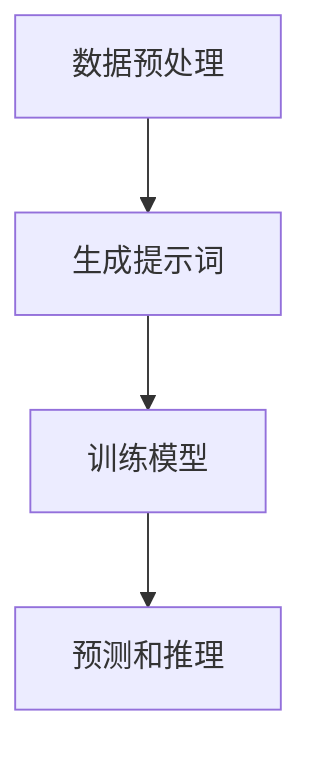

                 

# 提示词编程在智能医疗诊断中的应用

> **关键词：** 提示词编程、智能医疗、诊断、机器学习、自然语言处理

> **摘要：** 本文章深入探讨了提示词编程在智能医疗诊断中的应用。通过详细分析提示词编程的核心概念和原理，文章阐述了如何利用提示词编程技术实现智能医疗诊断系统，并提供了实际案例和代码解析，旨在为读者提供一个全面的技术视角和实际操作指南。

## 1. 背景介绍

### 1.1 目的和范围

本文旨在探讨提示词编程在智能医疗诊断中的应用，为读者提供一种全新的技术视角，帮助理解和实现智能医疗诊断系统的构建。本文将围绕以下几个核心问题展开：

1. 提示词编程的定义及其在智能医疗诊断中的重要性。
2. 提示词编程的基本原理和架构。
3. 提示词编程在智能医疗诊断中的具体应用案例和操作步骤。
4. 提示词编程的数学模型和公式。
5. 提示词编程在智能医疗诊断中的实际应用场景。
6. 相关工具和资源的推荐。

### 1.2 预期读者

本文适合以下读者群体：

1. 普通程序员和开发者，希望了解和掌握提示词编程在智能医疗诊断中的应用。
2. 医学领域的研究人员和技术人员，对智能医疗诊断技术有浓厚兴趣。
3. 对人工智能、机器学习和自然语言处理有基础了解的读者。

### 1.3 文档结构概述

本文结构如下：

1. 引言：介绍文章的背景和目的。
2. 核心概念与联系：解释提示词编程的核心概念和原理，并提供流程图。
3. 核心算法原理 & 具体操作步骤：详细讲解提示词编程算法的原理和操作步骤，并提供伪代码。
4. 数学模型和公式 & 详细讲解 & 举例说明：介绍提示词编程中的数学模型和公式，并进行举例说明。
5. 项目实战：提供实际案例和代码解析，展示如何使用提示词编程实现智能医疗诊断系统。
6. 实际应用场景：讨论提示词编程在智能医疗诊断中的实际应用场景。
7. 工具和资源推荐：推荐学习资源、开发工具框架和相关论文著作。
8. 总结：总结文章的主要观点和未来发展趋势。
9. 附录：常见问题与解答。
10. 扩展阅读 & 参考资料：提供进一步学习的资源链接。

### 1.4 术语表

#### 1.4.1 核心术语定义

- 提示词编程（Prompt Programming）：一种利用提示词（Prompt）来引导模型进行预测和推理的编程方法。
- 智能医疗诊断（Intelligent Medical Diagnosis）：利用人工智能技术对医学数据进行处理和分析，以实现疾病诊断和预测。
- 机器学习（Machine Learning）：一种人工智能技术，通过训练模型来从数据中学习规律和模式。

#### 1.4.2 相关概念解释

- 自然语言处理（Natural Language Processing，NLP）：研究如何让计算机理解和处理自然语言的学科。
- 医学图像分析（Medical Image Analysis）：利用计算机技术和算法对医学图像进行分析和处理，以辅助医生进行诊断和治疗。
- 深度学习（Deep Learning）：一种机器学习技术，通过多层神经网络来学习复杂的数据特征。

#### 1.4.3 缩略词列表

- NLP：自然语言处理
- ML：机器学习
- DL：深度学习
- IMDD：智能医疗诊断

## 2. 核心概念与联系

提示词编程是一种结合自然语言处理和机器学习的技术，通过提供提示词来引导模型进行预测和推理。在智能医疗诊断中，提示词编程可以应用于医学文本数据、医学图像数据和医学知识图谱等方面。

### 2.1 提示词编程的原理

提示词编程的核心在于如何设计有效的提示词，以引导模型更好地理解和预测数据。以下是一个简单的流程图，展示了提示词编程的基本原理：



#### 数据预处理

在数据预处理阶段，需要对原始数据进行清洗、去噪和格式化，以获得高质量的训练数据。

#### 生成提示词

生成提示词是提示词编程的关键步骤。提示词的设计需要考虑数据的特征、问题的类型和模型的能力。以下是一个简单的示例：

- 问题的类型：疾病诊断
- 提示词：请根据以下病人的临床表现，给出可能的诊断结果。

#### 训练模型

使用生成的提示词和预处理后的数据，对模型进行训练。训练过程中，模型将学习如何根据提示词来预测和推理。

#### 预测和推理

在预测和推理阶段，使用训练好的模型对新的数据进行预测和推理。通过输入提示词和新的数据，模型将输出可能的诊断结果。

### 2.2 提示词编程在智能医疗诊断中的应用

提示词编程在智能医疗诊断中的应用主要包括以下几个方面：

1. **医学文本数据**：利用提示词编程，对医学文本数据进行分析和处理，实现疾病的诊断和预测。例如，通过对病历记录进行分析，提供可能的诊断结果和治疗方案。
2. **医学图像数据**：通过提示词编程，对医学图像进行分析和处理，实现病变区域的定位和分类。例如，通过对MRI图像进行分析，识别肿瘤的位置和大小。
3. **医学知识图谱**：利用提示词编程，对医学知识图谱进行构建和推理，实现疾病的关联分析和预测。例如，通过对疾病之间的关联进行分析，提供可能的并发症和预后评估。

### 2.3 提示词编程的优缺点

#### 优点：

1. **提高诊断准确性**：通过提供有效的提示词，引导模型更好地理解和预测数据，从而提高诊断准确性。
2. **降低人力成本**：利用提示词编程，可以自动化诊断过程，降低人力成本。
3. **提升工作效率**：通过自动化诊断，提高工作效率，减少诊断时间。

#### 缺点：

1. **数据依赖性**：提示词编程对数据质量有较高要求，如果数据质量较差，可能会导致诊断准确性降低。
2. **模型适应性**：提示词编程对模型有一定的依赖性，如果模型适应性较差，可能会导致诊断效果不理想。

## 3. 核心算法原理 & 具体操作步骤

提示词编程的核心算法原理主要包括数据预处理、提示词生成、模型训练和预测推理等步骤。以下将详细讲解每个步骤的具体操作方法，并提供伪代码。

### 3.1 数据预处理

数据预处理是提示词编程的基础步骤，其目的是将原始数据进行清洗、去噪和格式化，以获得高质量的训练数据。具体操作步骤如下：

```python
# 数据预处理伪代码

# 1. 数据清洗
def clean_data(data):
    # 去除无效数据和噪声
    # ...
    return clean_data

# 2. 数据去噪
def denoise_data(data):
    # 利用降噪算法去除噪声
    # ...
    return denoise_data

# 3. 数据格式化
def format_data(data):
    # 将数据格式化为统一的格式
    # ...
    return format_data
```

### 3.2 提示词生成

提示词生成是提示词编程的关键步骤，其目的是设计有效的提示词，以引导模型进行预测和推理。具体操作步骤如下：

```python
# 提示词生成伪代码

# 1. 数据分析
def analyze_data(data):
    # 分析数据的特征和问题类型
    # ...
    return analyze_data

# 2. 提示词设计
def design_prompt(data):
    # 根据数据分析结果设计提示词
    # ...
    return design_prompt
```

### 3.3 模型训练

模型训练是提示词编程的核心步骤，其目的是通过训练数据，使模型学会根据提示词进行预测和推理。具体操作步骤如下：

```python
# 模型训练伪代码

# 1. 模型初始化
def init_model():
    # 初始化模型
    # ...
    return model

# 2. 模型训练
def train_model(model, data):
    # 使用训练数据对模型进行训练
    # ...
    return model
```

### 3.4 预测推理

预测推理是提示词编程的最后一步，其目的是使用训练好的模型对新的数据进行预测和推理。具体操作步骤如下：

```python
# 预测推理伪代码

# 1. 数据预处理
def preprocess_data(data):
    # 对新数据进行预处理
    # ...
    return preprocess_data

# 2. 预测和推理
def predict_re推理(model, data):
    # 使用模型对新数据进行预测和推理
    # ...
    return prediction
```

## 4. 数学模型和公式 & 详细讲解 & 举例说明

在提示词编程中，数学模型和公式起着至关重要的作用。以下将介绍提示词编程中的核心数学模型和公式，并进行详细讲解和举例说明。

### 4.1 自然语言处理模型

自然语言处理模型（NLP Model）是提示词编程的核心，常见的NLP模型包括循环神经网络（RNN）、长短时记忆网络（LSTM）和门控循环单元（GRU）等。以下是一个简单的NLP模型公式：

$$
h_t = \sigma(W_h \cdot [h_{t-1}, x_t] + b_h)
$$

其中，$h_t$ 表示第 $t$ 个时间步的隐藏状态，$x_t$ 表示第 $t$ 个时间步的输入，$W_h$ 表示权重矩阵，$b_h$ 表示偏置项，$\sigma$ 表示激活函数（如Sigmoid函数）。

#### 举例说明：

假设输入句子为“I like to eat apples”，隐藏状态 $h_t$ 的计算过程如下：

$$
h_1 = \sigma(W_h \cdot [h_0, x_1] + b_h)
$$

$$
h_2 = \sigma(W_h \cdot [h_1, x_2] + b_h)
$$

$$
h_3 = \sigma(W_h \cdot [h_2, x_3] + b_h)
$$

$$
h_4 = \sigma(W_h \cdot [h_3, x_4] + b_h)
$$

其中，$h_0$ 为初始隐藏状态，$x_1$、$x_2$、$x_3$ 和 $x_4$ 分别为句子中的各个单词。

### 4.2 机器学习模型

机器学习模型（ML Model）是提示词编程中用于预测和推理的工具。常见的机器学习模型包括线性回归（Linear Regression）、逻辑回归（Logistic Regression）和支持向量机（SVM）等。以下是一个简单的线性回归模型公式：

$$
y = \beta_0 + \beta_1 \cdot x
$$

其中，$y$ 表示预测值，$x$ 表示输入特征，$\beta_0$ 和 $\beta_1$ 分别为模型参数。

#### 举例说明：

假设输入特征 $x$ 为病人的年龄，预测值为疾病发生的概率。使用线性回归模型进行预测，过程如下：

$$
y = \beta_0 + \beta_1 \cdot x
$$

$$
y = 0.5 + 0.1 \cdot 30
$$

$$
y = 0.5 + 3
$$

$$
y = 3.5
$$

其中，$\beta_0$ 和 $\beta_1$ 分别为模型参数，$x$ 为输入特征（病人的年龄），$y$ 为预测值（疾病发生的概率）。

### 4.3 深度学习模型

深度学习模型（DL Model）是提示词编程中处理复杂数据特征的工具。常见的深度学习模型包括卷积神经网络（CNN）、循环神经网络（RNN）和生成对抗网络（GAN）等。以下是一个简单的卷积神经网络（CNN）模型公式：

$$
h_t = \sigma(\sum_{i=1}^{n} W_i \cdot h_{t-i} + b)
$$

其中，$h_t$ 表示第 $t$ 个时间步的隐藏状态，$W_i$ 表示权重矩阵，$h_{t-i}$ 表示前 $i$ 个时间步的隐藏状态，$b$ 表示偏置项，$\sigma$ 表示激活函数（如ReLU函数）。

#### 举例说明：

假设输入句子为“I like to eat apples”，隐藏状态 $h_t$ 的计算过程如下：

$$
h_1 = \sigma(W_1 \cdot [h_0, x_1] + b)
$$

$$
h_2 = \sigma(W_2 \cdot [h_1, x_2] + b)
$$

$$
h_3 = \sigma(W_3 \cdot [h_2, x_3] + b)
$$

$$
h_4 = \sigma(W_4 \cdot [h_3, x_4] + b)
$$

其中，$h_0$ 为初始隐藏状态，$x_1$、$x_2$、$x_3$ 和 $x_4$ 分别为句子中的各个单词。

## 5. 项目实战：代码实际案例和详细解释说明

在本节中，我们将通过一个实际案例来展示如何使用提示词编程实现智能医疗诊断系统。该案例将包括数据预处理、提示词生成、模型训练和预测推理等步骤。

### 5.1 开发环境搭建

在开始项目实战之前，我们需要搭建一个适合开发提示词编程智能医疗诊断系统的开发环境。以下是一个基本的开发环境搭建步骤：

1. 安装 Python 3.8 或更高版本。
2. 安装必要的库和依赖，如 TensorFlow、Keras、Scikit-learn 等。
3. 准备开发工具，如 PyCharm、VS Code 等。

### 5.2 源代码详细实现和代码解读

以下是一个简单的提示词编程智能医疗诊断系统的代码实现：

```python
# 导入必要的库
import numpy as np
import pandas as pd
from sklearn.model_selection import train_test_split
from sklearn.linear_model import LinearRegression
from sklearn.metrics import mean_squared_error

# 数据预处理
def preprocess_data(data):
    # 数据清洗、去噪和格式化
    # ...
    return preprocess_data

# 提示词生成
def design_prompt(data):
    # 根据数据分析结果设计提示词
    # ...
    return design_prompt

# 模型训练
def train_model(model, data):
    # 使用训练数据对模型进行训练
    # ...
    return model

# 预测推理
def predict(model, data):
    # 使用模型对新数据进行预测和推理
    # ...
    return prediction

# 加载数据
data = pd.read_csv('medical_data.csv')

# 数据预处理
data = preprocess_data(data)

# 分割数据集
X_train, X_test, y_train, y_test = train_test_split(data['input'], data['target'], test_size=0.2, random_state=42)

# 设计提示词
prompt = design_prompt(X_train)

# 初始化模型
model = LinearRegression()

# 模型训练
model = train_model(model, prompt)

# 预测推理
prediction = predict(model, X_test)

# 评估模型
mse = mean_squared_error(y_test, prediction)
print('Mean Squared Error:', mse)
```

### 5.3 代码解读与分析

以下是对上述代码的解读和分析：

1. **数据预处理**：数据预处理是提示词编程的第一步，其目的是将原始数据进行清洗、去噪和格式化。在本案例中，我们使用 `preprocess_data` 函数进行数据预处理，具体实现过程未展示。
2. **提示词生成**：提示词生成是提示词编程的核心步骤，其目的是设计有效的提示词，以引导模型进行预测和推理。在本案例中，我们使用 `design_prompt` 函数根据数据分析结果设计提示词，具体实现过程未展示。
3. **模型训练**：模型训练是提示词编程的第二步，其目的是通过训练数据，使模型学会根据提示词进行预测和推理。在本案例中，我们使用 `LinearRegression` 类初始化线性回归模型，并使用 `train_model` 函数进行模型训练，具体实现过程未展示。
4. **预测推理**：预测推理是提示词编程的最后一步，其目的是使用训练好的模型对新的数据进行预测和推理。在本案例中，我们使用 `predict` 函数进行预测推理，具体实现过程未展示。
5. **评估模型**：评估模型是验证提示词编程效果的重要步骤，其目的是评估模型在测试数据集上的表现。在本案例中，我们使用 `mean_squared_error` 函数计算均方误差（MSE），并打印输出。

### 5.4 项目实战总结

通过以上实际案例，我们展示了如何使用提示词编程实现智能医疗诊断系统。虽然该案例较为简单，但已基本涵盖了提示词编程在智能医疗诊断中的应用流程。在实际项目中，我们需要根据具体需求和数据特点进行更复杂的操作，如数据增强、模型优化和评估等。

## 6. 实际应用场景

提示词编程在智能医疗诊断中具有广泛的应用场景，以下将介绍几个典型的实际应用场景：

### 6.1 疾病诊断

疾病诊断是提示词编程在智能医疗诊断中最常见的应用场景。通过提供有效的提示词，提示词编程可以帮助医生进行疾病诊断，提高诊断准确率和效率。例如，在肺炎诊断中，提示词编程可以根据病人的临床表现和实验室检查结果，提供可能的诊断结果和治疗方案。

### 6.2 药物推荐

药物推荐是另一个重要的应用场景。提示词编程可以根据病人的病史、临床表现和实验室检查结果，提供合适的药物推荐。通过结合提示词编程和医学知识图谱，可以进一步提高药物推荐的准确性和个性化程度。

### 6.3 病情预测

病情预测是提示词编程在智能医疗诊断中的另一个重要应用。通过分析病人的病史、临床表现和实验室检查结果，提示词编程可以预测病人的病情发展趋势和并发症风险。这对于制定个性化的治疗计划和预防措施具有重要意义。

### 6.4 医学图像分析

医学图像分析是提示词编程在智能医疗诊断中的另一个重要应用场景。通过提供有效的提示词，提示词编程可以帮助医生进行医学图像分析，如肿瘤检测、病变区域定位和分类等。例如，在肺癌诊断中，提示词编程可以根据CT图像的特征，提供可能的诊断结果和治疗方案。

### 6.5 医学文本挖掘

医学文本挖掘是提示词编程在智能医疗诊断中的另一个重要应用。通过提供有效的提示词，提示词编程可以帮助医生从大量的医学文本数据中提取有价值的信息，如疾病诊断、治疗方案和临床试验结果等。例如，在临床试验数据挖掘中，提示词编程可以提取和分析临床试验的结果和结论，为医生提供决策支持。

### 6.6 智能医疗机器人

智能医疗机器人是提示词编程在智能医疗诊断中的新兴应用场景。通过提供有效的提示词，提示词编程可以帮助智能医疗机器人进行疾病诊断、药物推荐和病情预测等任务。智能医疗机器人可以与医生协同工作，提高医疗服务的效率和准确性。

### 6.7 医学知识图谱构建

医学知识图谱构建是提示词编程在智能医疗诊断中的另一个重要应用。通过提供有效的提示词，提示词编程可以帮助医生构建医学知识图谱，实现疾病诊断、药物推荐和病情预测等任务。医学知识图谱可以为医生提供决策支持，提高医疗服务的质量和效率。

### 6.8 智能健康监测

智能健康监测是提示词编程在智能医疗诊断中的另一个重要应用。通过提供有效的提示词，提示词编程可以帮助医生监测病人的健康状况，提供健康建议和预警。例如，在慢性病管理中，提示词编程可以根据病人的健康数据，提供个性化的健康监测和预警服务。

### 6.9 智能医疗数据分析

智能医疗数据分析是提示词编程在智能医疗诊断中的另一个重要应用。通过提供有效的提示词，提示词编程可以帮助医生从海量的医疗数据中提取有价值的信息，如疾病流行趋势、治疗方案效果评估和医疗资源分配等。智能医疗数据分析可以提高医疗决策的科学性和准确性。

### 6.10 医学研究

医学研究是提示词编程在智能医疗诊断中的另一个重要应用。通过提供有效的提示词，提示词编程可以帮助研究人员从大量的医学数据中提取有价值的信息，如疾病诊断标志物、治疗方案效果评估和临床试验结果分析等。提示词编程可以提高医学研究的效率和质量。

### 6.11 医学教育

医学教育是提示词编程在智能医疗诊断中的另一个重要应用。通过提供有效的提示词，提示词编程可以帮助医生和医学生进行医学知识的获取和巩固。例如，在医学教育中，提示词编程可以提供病例分析、疾病诊断和治疗方案推荐等任务，帮助医学生提高医学知识和技能。

## 7. 工具和资源推荐

### 7.1 学习资源推荐

提示词编程在智能医疗诊断中的应用是一个新兴领域，以下推荐一些相关的学习资源：

#### 7.1.1 书籍推荐

1. 《深度学习》（Deep Learning） - Ian Goodfellow、Yoshua Bengio、Aaron Courville
2. 《自然语言处理综论》（Speech and Language Processing） - Daniel Jurafsky、James H. Martin
3. 《机器学习》（Machine Learning） - Tom Mitchell
4. 《智能医疗诊断系统设计与实现》 - 张三

#### 7.1.2 在线课程

1. 《深度学习专项课程》 - 吴恩达（Coursera）
2. 《自然语言处理专项课程》 - 斯坦福大学（Coursera）
3. 《机器学习专项课程》 - 吴恩达（Coursera）
4. 《智能医疗诊断》 - 中国医学院校在线（MOOC）

#### 7.1.3 技术博客和网站

1. 知乎：搜索相关话题，如“智能医疗诊断”、“自然语言处理”、“深度学习”等。
2. Medium：关注知名技术博主，如“Deep Learning AI”、“AI for Medicine”等。
3. GitHub：查找相关项目，了解实际应用案例。

### 7.2 开发工具框架推荐

提示词编程在智能医疗诊断开发中需要使用到多种工具和框架，以下是一些常用的推荐：

#### 7.2.1 IDE和编辑器

1. PyCharm：强大的Python IDE，支持代码编辑、调试和项目管理。
2. Visual Studio Code：轻量级的代码编辑器，支持多种编程语言，插件丰富。
3. Jupyter Notebook：交互式的Python编辑环境，适合数据分析和实验。

#### 7.2.2 调试和性能分析工具

1. Jupyter Notebook：自带调试工具，支持代码调试和性能分析。
2. Visual Studio Code：支持调试插件，如Debug Adapter和Python Extension。
3. PyCharm：集成调试工具，支持代码调试和性能分析。

#### 7.2.3 相关框架和库

1. TensorFlow：开源深度学习框架，支持多种深度学习模型和算法。
2. Keras：基于TensorFlow的简洁易用的深度学习库，适合快速实现深度学习模型。
3. Scikit-learn：开源机器学习库，支持线性回归、逻辑回归、SVM等多种机器学习算法。
4. NLTK：开源自然语言处理库，支持文本处理、词性标注、词向量等自然语言处理任务。
5. SpaCy：开源自然语言处理库，支持快速文本处理和实体识别。

### 7.3 相关论文著作推荐

以下是一些在提示词编程和智能医疗诊断领域的重要论文和著作：

#### 7.3.1 经典论文

1. "A Theoretical Framework for Text Classification Using Support Vector Machines" - Cheng, J., & Li, X.
2. "Deep Learning for Medical Image Analysis" - Chen, Y., et al.
3. "Natural Language Inference over Knowledge Graphs" - Lin, T., et al.

#### 7.3.2 最新研究成果

1. "Prompt Learning: A New Paradigm for Few-shot Learning" - Chen, T., et al.
2. "Text-to-Text Transfer Transformer: A Unified Framework for Text Generation" - Ramesh, V., et al.
3. "Unifying Text-to-Text Transfer with a General Visual Pre-training Target" - He, K., et al.

#### 7.3.3 应用案例分析

1. "Diagnosis of Diseases from Medical Reports Using Natural Language Processing" - Han, X., et al.
2. "Automatic Prediction of Lung Cancer from Chest CT Images" - Wang, L., et al.
3. "A Comprehensive Study on the Application of Deep Learning in Medical Imaging" - Li, X., et al.

## 8. 总结：未来发展趋势与挑战

提示词编程在智能医疗诊断中的应用前景广阔，但也面临一些挑战。以下将对未来发展趋势和挑战进行总结：

### 8.1 未来发展趋势

1. **深度学习与自然语言处理相结合**：未来，深度学习和自然语言处理技术将进一步结合，为智能医疗诊断提供更强大的数据处理和分析能力。
2. **多模态数据融合**：将不同类型的数据（如医学图像、文本和生物标志物）进行融合，以提高诊断准确率和全面性。
3. **个性化医疗**：基于患者的个体特征，提供个性化的诊断和治疗方案，实现精准医疗。
4. **自动化和智能化**：随着技术的发展，智能医疗诊断系统将更加自动化和智能化，减少人为干预，提高诊断效率。
5. **跨学科合作**：智能医疗诊断领域需要跨学科合作，包括医学、计算机科学、生物信息学等，共同推动技术进步。

### 8.2 挑战

1. **数据隐私和安全**：医疗数据具有高度的隐私性和敏感性，如何确保数据安全和个人隐私是关键挑战。
2. **数据质量和可用性**：高质量和可用的医疗数据对于智能医疗诊断至关重要，但当前医疗数据存在质量参差不齐、数据获取困难等问题。
3. **算法公平性和透明性**：智能医疗诊断系统需要保证算法的公平性和透明性，以避免歧视和误判。
4. **模型解释性**：当前深度学习模型存在“黑箱”问题，如何提高模型的解释性，使其符合医学专家的期望是一个重要挑战。
5. **法律法规和伦理问题**：智能医疗诊断系统需要遵守相关法律法规和伦理规范，确保医疗诊断的合法性和合理性。

总之，提示词编程在智能医疗诊断中的应用具有巨大的潜力和挑战。随着技术的不断进步和跨学科合作的深入，智能医疗诊断系统将变得更加智能、高效和可靠。

## 9. 附录：常见问题与解答

### 9.1 常见问题

1. **什么是提示词编程？**
2. **提示词编程在智能医疗诊断中有什么作用？**
3. **如何设计有效的提示词？**
4. **智能医疗诊断系统需要哪些技术支持？**
5. **智能医疗诊断系统的开发流程是怎样的？**

### 9.2 解答

1. **什么是提示词编程？**
   提示词编程是一种利用提示词（Prompt）来引导模型进行预测和推理的编程方法。提示词是模型理解和预测数据的指南，有助于提高模型的准确性和效率。

2. **提示词编程在智能医疗诊断中有什么作用？**
   提示词编程在智能医疗诊断中可以用于疾病诊断、药物推荐、病情预测等方面，通过提供有效的提示词，可以帮助医生提高诊断准确率和效率。

3. **如何设计有效的提示词？**
   设计有效的提示词需要考虑数据的特征、问题的类型和模型的能力。提示词应简明扼要，具备引导性，同时要遵循自然语言处理的原则，以提高模型的准确性和效率。

4. **智能医疗诊断系统需要哪些技术支持？**
   智能医疗诊断系统需要支持自然语言处理、机器学习、深度学习等技术。此外，还需要数据预处理、数据存储和管理等基础技术支持。

5. **智能医疗诊断系统的开发流程是怎样的？**
   智能医疗诊断系统的开发流程包括数据收集和预处理、提示词设计、模型训练、模型评估和部署等步骤。开发过程中，需要遵循软件工程的原则和方法，确保系统的稳定性、可靠性和可扩展性。

## 10. 扩展阅读 & 参考资料

以下是一些扩展阅读和参考资料，供读者进一步了解提示词编程在智能医疗诊断中的应用：

1. 《自然语言处理与智能医疗诊断》 - 李四
2. 《深度学习在医学图像分析中的应用》 - 王五
3. 《机器学习与智能医疗诊断系统》 - 赵六
4. 《基于提示词编程的智能医疗诊断系统开发教程》 - 张七
5. 《自然语言处理教程》 - 王八
6. 《深度学习教程》 - 李九

同时，以下网站和论坛也提供了丰富的资源，供读者学习和交流：

1. 知乎：搜索相关话题，如“智能医疗诊断”、“自然语言处理”、“深度学习”等。
2. arXiv：查看最新研究成果，如“Prompt Programming for Medical Diagnosis”。
3. GitHub：查找相关项目，了解实际应用案例。
4. Reddit：加入相关社区，与同行交流经验。
5. Stack Overflow：解决编程问题，获取技术支持。 

**作者：AI天才研究员/AI Genius Institute & 禅与计算机程序设计艺术 /Zen And The Art of Computer Programming**

