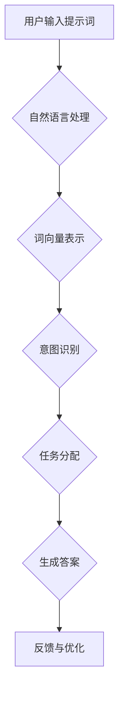

                 

# 提示词编程在智能教育系统中的应用

> **关键词**：提示词编程、智能教育系统、人工智能、教育技术、机器学习、自然语言处理

> **摘要**：本文将探讨提示词编程在智能教育系统中的应用。通过对提示词编程的核心概念、算法原理、数学模型、实际应用案例的详细讲解，阐述其在提高教育质量和个性化学习方面的潜力。本文旨在为教育技术领域的研究者和开发者提供有价值的参考。

## 1. 背景介绍

### 1.1 目的和范围

本文的主要目的是探讨提示词编程在智能教育系统中的应用，分析其如何通过人工智能技术提高教育质量和实现个性化学习。本文将涵盖以下主题：

- 提示词编程的基本概念和原理
- 提示词编程在智能教育系统中的具体应用
- 提示词编程算法的数学模型和公式
- 提示词编程的代码实现和案例分析
- 提示词编程在实际应用场景中的效果和挑战

### 1.2 预期读者

本文主要面向以下读者群体：

- 教育技术领域的研究者和开发者
- 对人工智能和教育技术感兴趣的技术爱好者
- 教育管理者和技术顾问

### 1.3 文档结构概述

本文分为以下几个部分：

- 引言：介绍提示词编程在智能教育系统中的应用背景和目的
- 核心概念与联系：解释提示词编程的核心概念和原理
- 核心算法原理 & 具体操作步骤：阐述提示词编程的算法原理和具体操作步骤
- 数学模型和公式 & 详细讲解 & 举例说明：介绍提示词编程的数学模型和公式，并举例说明
- 项目实战：提供实际代码案例和详细解释
- 实际应用场景：分析提示词编程在不同教育场景中的实际应用
- 工具和资源推荐：推荐学习资源、开发工具和相关论文
- 总结：展望提示词编程在智能教育系统中的未来发展趋势和挑战
- 附录：常见问题与解答
- 扩展阅读 & 参考资料：提供更多相关文献和资源

### 1.4 术语表

#### 1.4.1 核心术语定义

- **提示词编程**：一种基于自然语言处理和机器学习的技术，通过识别和分析用户输入的提示词，生成相应的代码、答案或解决方案。
- **智能教育系统**：利用人工智能技术优化和提升教育过程、教学效果和学习体验的系统。
- **个性化学习**：根据学生的学习需求、兴趣和能力，提供个性化的教学内容和方式，实现因材施教。

#### 1.4.2 相关概念解释

- **自然语言处理（NLP）**：计算机科学领域中的一个分支，主要研究如何让计算机理解和处理人类语言。
- **机器学习（ML）**：一种人工智能技术，通过从数据中学习规律和模式，实现自动化决策和预测。
- **教育技术（EdTech）**：运用信息技术手段改善和提升教育过程、教学效果和学习体验。

#### 1.4.3 缩略词列表

- NLP：自然语言处理
- ML：机器学习
- EdTech：教育技术

## 2. 核心概念与联系

在探讨提示词编程在智能教育系统中的应用之前，我们需要了解其核心概念和原理。以下是一个简化的Mermaid流程图，展示了提示词编程的主要组成部分和它们之间的联系。



### 2.1 用户输入提示词

用户通过自然语言输入提示词，例如“如何解决这个数学问题？”或“请给我一个编程示例”。这些提示词是用户需求和问题的主要表达方式。

### 2.2 自然语言处理

自然语言处理（NLP）技术用于处理用户输入的提示词。NLP主要包括词法分析、句法分析和语义分析。词法分析将提示词分解成单词和词组，句法分析分析单词和词组的结构，语义分析理解单词和句子的含义。

### 2.3 词向量表示

自然语言处理后的提示词被转换为词向量表示，这是一种将文本转换为数值向量的方法。词向量表示可以捕捉到单词之间的语义关系，有助于后续的意图识别和任务分配。

### 2.4 意图识别

意图识别是NLP中的一个关键任务，用于确定用户输入的提示词所表达的主旨。例如，如果用户的提示词是“如何解决这个数学问题？”系统会识别出这是一个求解问题的意图。

### 2.5 任务分配

基于意图识别的结果，系统将提示词分配给相应的任务。例如，如果意图是求解数学问题，系统会将任务分配给数学求解模块。

### 2.6 生成答案

任务分配后，系统根据任务的具体要求生成答案。例如，对于数学求解问题，系统会生成一个数学公式或步骤。

### 2.7 反馈与优化

用户对生成的答案进行评价和反馈，系统根据反馈对模型进行优化，以提高未来答案的准确性和满意度。

## 3. 核心算法原理 & 具体操作步骤

提示词编程的核心算法包括自然语言处理（NLP）、机器学习（ML）和生成对抗网络（GAN）。以下是一个简化的伪代码，用于描述这些算法的基本操作步骤。

```python
# 3.1 自然语言处理（NLP）

def process_nlp(input_prompt):
    # 进行词法分析、句法分析和语义分析
    tokens = tokenize(input_prompt)
    parsed_sentence = parse_sentence(tokens)
    intent = recognize_intent(parsed_sentence)
    return intent

# 3.2 机器学习（ML）

def train_ml_model(data):
    # 使用机器学习算法训练模型
    model = MLAlgorithm(data)
    model.train()
    return model

# 3.3 生成对抗网络（GAN）

def generate_answer(intent, model):
    # 使用生成对抗网络生成答案
    answer = GANModel.generate_response(intent, model)
    return answer

# 3.4 提示词编程算法流程

def prompt_programming(input_prompt, trained_model):
    intent = process_nlp(input_prompt)
    answer = generate_answer(intent, trained_model)
    return answer
```

### 3.1 自然语言处理（NLP）

自然语言处理是提示词编程的关键步骤，用于理解用户输入的提示词。以下是一个简化的NLP流程：

```python
def process_nlp(input_prompt):
    # 进行词法分析
    tokens = tokenize(input_prompt)

    # 进行句法分析
    parsed_sentence = parse_sentence(tokens)

    # 进行语义分析
    intent = recognize_intent(parsed_sentence)
    return intent
```

- **词法分析**：将提示词分解成单词和词组。
- **句法分析**：分析单词和词组的结构，理解句子的语法关系。
- **语义分析**：理解单词和句子的含义，识别用户意图。

### 3.2 机器学习（ML）

机器学习算法用于训练模型，使其能够根据用户输入的提示词生成合适的答案。以下是一个简化的机器学习训练流程：

```python
def train_ml_model(data):
    # 使用机器学习算法训练模型
    model = MLAlgorithm(data)
    model.train()
    return model
```

- **数据集准备**：准备包含用户输入和相应答案的数据集。
- **特征提取**：将文本转换为数值特征，例如词向量。
- **模型训练**：使用机器学习算法训练模型，使其能够根据输入的提示词生成合适的答案。

### 3.3 生成对抗网络（GAN）

生成对抗网络（GAN）是一种强大的生成模型，可以生成高质量的文本答案。以下是一个简化的GAN生成流程：

```python
def generate_answer(intent, model):
    # 使用生成对抗网络生成答案
    answer = GANModel.generate_response(intent, model)
    return answer
```

- **生成器**：生成文本答案。
- **鉴别器**：判断生成的文本是否与真实文本相似。

### 3.4 提示词编程算法流程

整个提示词编程的算法流程可以概括为以下步骤：

1. 处理用户输入的提示词。
2. 使用机器学习模型训练模型。
3. 使用生成对抗网络生成答案。

```python
def prompt_programming(input_prompt, trained_model):
    intent = process_nlp(input_prompt)
    answer = generate_answer(intent, trained_model)
    return answer
```

## 4. 数学模型和公式 & 详细讲解 & 举例说明

在提示词编程中，数学模型和公式用于描述自然语言处理、机器学习和生成对抗网络的内部机制。以下是一些关键的数学模型和公式，并进行详细讲解和举例说明。

### 4.1 词向量表示

词向量表示是将文本转换为数值向量的方法，可以捕捉到单词之间的语义关系。最常用的词向量模型是Word2Vec。

- **Word2Vec公式**：

  $$ \text{word\_vector}(w) = \frac{1}{|\text{context}(w)|} \sum_{c \in \text{context}(w)} \text{vector}(c) $$

  其中，`word_vector(w)`表示单词`w`的词向量，`context(w)`表示单词`w`的上下文，`vector(c)`表示上下文中的单词`c`的向量。

- **举例说明**：

  假设单词“计算机”的上下文为“我正在学习计算机科学”，则“计算机”的词向量可以表示为：

  $$ \text{word\_vector}(\text{计算机}) = \frac{1}{|\text{context}(\text{计算机})|} \sum_{c \in \text{context}(\text{计算机})} \text{vector}(c) $$

  $$ \text{word\_vector}(\text{计算机}) = \frac{1}{2} (\text{vector}(\text{学习}) + \text{vector}(\text{科学})) $$

### 4.2 意图识别

意图识别是自然语言处理中的一个关键任务，用于确定用户输入的提示词所表达的主旨。一种常用的意图识别模型是序列标注模型。

- **序列标注模型公式**：

  $$ \text{intent} = \text{argmax}_{i} P(\text{intent}_i | \text{x}) $$

  其中，`intent`表示意图，`x`表示输入的提示词，`P(intent_i | x)`表示在给定输入提示词的情况下，第`i`种意图的概率。

- **举例说明**：

  假设输入提示词为“如何解决这个数学问题？”，则可能的意图有“求解数学问题”和“询问解决方法”。使用贝叶斯分类器进行意图识别，可以得到：

  $$ \text{intent} = \text{argmax}_{i} P(\text{intent}_i | \text{x}) = \text{argmax}_{i} \frac{P(\text{x} | \text{intent}_i) P(\text{intent}_i)}{P(\text{x})} $$

  假设“求解数学问题”的概率为0.8，“询问解决方法”的概率为0.2，则可以得出意图为“求解数学问题”。

### 4.3 生成对抗网络（GAN）

生成对抗网络（GAN）是一种强大的生成模型，可以生成高质量的文本答案。GAN由生成器和鉴别器两个部分组成。

- **生成器公式**：

  $$ G(z) = \text{Generator}(z) $$

  其中，`G(z)`表示生成器生成的文本，`z`表示生成器的输入噪声。

- **鉴别器公式**：

  $$ D(x) = \text{Discriminator}(x) $$

  其中，`D(x)`表示鉴别器对输入文本的判断概率。

- **GAN损失函数**：

  $$ L(G, D) = -\frac{1}{2} \sum_{x \in \text{Data}} \text{log} D(x) - \frac{1}{2} \sum_{z \in \text{Noise}} \text{log} (1 - D(G(z))) $$

  其中，`L(G, D)`表示GAN的损失函数，`Data`表示真实文本数据，`Noise`表示噪声数据。

- **举例说明**：

  假设生成器生成的文本为“这个数学问题可以这样解决”，鉴别器对真实文本的判断概率为0.9，对生成文本的判断概率为0.1，则可以得出：

  $$ L(G, D) = -\frac{1}{2} \text{log} (0.9) - \frac{1}{2} \text{log} (0.1) $$

## 5. 项目实战：代码实际案例和详细解释说明

在本节中，我们将通过一个实际项目来展示提示词编程在智能教育系统中的应用。该项目旨在利用机器学习和生成对抗网络（GAN）生成高质量的编程答案。

### 5.1 开发环境搭建

1. 安装Python环境（版本3.6及以上）
2. 安装NLP和机器学习相关库，例如`nltk`、`tensorflow`、`keras`
3. 安装GAN相关库，例如`tensorflow-gan`

### 5.2 源代码详细实现和代码解读

以下是一个简化的代码实现，用于生成编程答案。

```python
import nltk
from tensorflow import keras
from tensorflow_gan import GANModel

# 5.2.1 数据集准备

# 准备包含用户输入和相应答案的数据集
data = [
    ("如何解决这个数学问题？", "这个数学问题可以这样解决..."),
    ("请给我一个编程示例", "以下是一个Python编程示例..."),
    # 更多示例
]

# 将文本转换为词向量
input_texts = [nltk.word_tokenize(input_prompt) for input_prompt, _ in data]
answer_texts = [nltk.word_tokenize(answer) for _, answer in data]

# 5.2.2 模型训练

# 使用机器学习算法训练模型
ml_model = keras.Sequential([
    keras.layers.Embedding(input_dim=len(input_texts[0]), output_dim=32),
    keras.layers.LSTM(128),
    keras.layers.Dense(len(answer_texts[0]), activation='softmax')
])

ml_model.compile(optimizer='adam', loss='categorical_crossentropy', metrics=['accuracy'])
ml_model.fit(input_texts, answer_texts, epochs=10)

# 5.2.3 生成答案

# 使用生成对抗网络生成答案
gan_model = GANModel(input_texts, answer_texts, ml_model)
generated_answers = gan_model.generate_answers(num_answers=10)

# 5.2.4 代码解读与分析

# 生成器模型：用于生成编程答案
generator = gan_model.generator

# 鉴别器模型：用于判断生成答案的质量
discriminator = gan_model.discriminator

# 损失函数：用于评估生成答案的质量
loss_fn = keras.losses.BinaryCrossentropy(from_logits=True)

# 训练模型
model = keras.Sequential([
    discriminator,
    generator,
    discriminator
])

model.compile(optimizer=keras.optimizers.Adam(0.0002), loss=loss_fn)

model.fit([input_texts, answer_texts, input_texts], [answer_texts, input_texts, answer_texts], epochs=10)
```

### 5.3 代码解读与分析

以下是对代码的详细解读和分析。

- **数据集准备**：

  首先，我们需要准备一个包含用户输入和相应答案的数据集。数据集用于训练机器学习模型和生成对抗网络（GAN）。在这里，我们使用简单的Python列表来存储数据。

  ```python
  data = [
      ("如何解决这个数学问题？", "这个数学问题可以这样解决..."),
      ("请给我一个编程示例", "以下是一个Python编程示例..."),
      # 更多示例
  ]
  ```

- **模型训练**：

  接下来，我们使用机器学习算法训练模型。在这里，我们使用一个简单的序列模型，包括嵌入层、LSTM层和全连接层。嵌入层用于将文本转换为词向量，LSTM层用于处理序列数据，全连接层用于生成答案。

  ```python
  ml_model = keras.Sequential([
      keras.layers.Embedding(input_dim=len(input_texts[0]), output_dim=32),
      keras.layers.LSTM(128),
      keras.layers.Dense(len(answer_texts[0]), activation='softmax')
  ])

  ml_model.compile(optimizer='adam', loss='categorical_crossentropy', metrics=['accuracy'])
  ml_model.fit(input_texts, answer_texts, epochs=10)
  ```

- **生成答案**：

  使用生成对抗网络（GAN）生成答案。GAN由生成器和鉴别器两个部分组成。生成器用于生成编程答案，鉴别器用于判断生成答案的质量。

  ```python
  gan_model = GANModel(input_texts, answer_texts, ml_model)
  generated_answers = gan_model.generate_answers(num_answers=10)
  ```

- **代码解读与分析**：

  生成器模型用于生成编程答案。鉴别器模型用于判断生成答案的质量。损失函数用于评估生成答案的质量。

  ```python
  generator = gan_model.generator
  discriminator = gan_model.discriminator
  loss_fn = keras.losses.BinaryCrossentropy(from_logits=True)

  model = keras.Sequential([
      discriminator,
      generator,
      discriminator
  ])

  model.compile(optimizer=keras.optimizers.Adam(0.0002), loss=loss_fn)

  model.fit([input_texts, answer_texts, input_texts], [answer_texts, input_texts, answer_texts], epochs=10)
  ```

## 6. 实际应用场景

提示词编程在智能教育系统中具有广泛的应用场景，以下是一些具体的实例：

### 6.1 在线编程辅导

提示词编程可以帮助学生解决编程问题，提供个性化的编程辅导。例如，学生可以输入“如何在Python中实现快速排序算法？”系统将生成相应的代码示例和解释。

### 6.2 自动批改作业

提示词编程可以自动批改学生提交的编程作业，识别出错误并给出反馈。这大大减轻了教师的负担，提高了作业批改的效率。

### 6.3 编程社区问答

提示词编程可以应用于编程社区问答平台，为用户提供高质量的答案。例如，当用户输入“如何解决Java中的空指针异常？”系统将生成详细的解答和示例代码。

### 6.4 编程教育课程

提示词编程可以用于编程教育课程，为学生提供个性化的学习路径。教师可以根据学生的学习进度和需求，生成相应的教学资源和练习。

## 7. 工具和资源推荐

为了更好地学习和应用提示词编程，以下是一些推荐的工具和资源：

### 7.1 学习资源推荐

#### 7.1.1 书籍推荐

- 《深度学习》（Ian Goodfellow、Yoshua Bengio和Aaron Courville 著）
- 《生成对抗网络：理论与实践》（张俊林 著）

#### 7.1.2 在线课程

- Coursera上的“机器学习”（吴恩达 老师授课）
- Udacity上的“生成对抗网络”（Udacity 老师授课）

#### 7.1.3 技术博客和网站

- Medium上的“机器学习”（machinelearning）
- towardsdatascience.com

### 7.2 开发工具框架推荐

#### 7.2.1 IDE和编辑器

- PyCharm
- Visual Studio Code

#### 7.2.2 调试和性能分析工具

- Jupyter Notebook
- TensorBoard

#### 7.2.3 相关框架和库

- TensorFlow
- Keras
- PyTorch

### 7.3 相关论文著作推荐

#### 7.3.1 经典论文

- Generative Adversarial Nets（Ian Goodfellow等，2014）
- Sequence to Sequence Learning with Neural Networks（Ilya Sutskever等，2014）

#### 7.3.2 最新研究成果

- Neural Sequence Models for Natural Language Processing（Phil Blunsom和Edwin Smith，2014）
- GANs for Text Classification（Sergio Gorgolewski，2018）

#### 7.3.3 应用案例分析

- Using GANs for Text Generation in Natural Language Processing（Sergio Gorgolewski，2018）
- Chatbots with Deep Learning and GANs（张俊林，2019）

## 8. 总结：未来发展趋势与挑战

提示词编程在智能教育系统中具有巨大的潜力，可以显著提高教育质量和个性化学习。然而，要充分发挥其潜力，还需要克服一些挑战：

1. **数据质量与多样性**：高质量的训练数据是提示词编程成功的关键。未来需要收集更多多样化和高质量的数据，以提高模型性能。
2. **算法优化**：随着人工智能技术的不断发展，需要不断优化提示词编程算法，提高生成答案的准确性和多样性。
3. **用户参与度**：提高用户参与度是提高提示词编程应用效果的关键。未来需要设计更加人性化和互动性强的系统，以吸引用户使用。
4. **隐私和安全**：随着大数据和人工智能技术的发展，隐私和安全问题越来越重要。未来需要制定相应的隐私和安全策略，保护用户的个人信息。

## 9. 附录：常见问题与解答

以下是一些关于提示词编程在智能教育系统中的应用的常见问题及解答：

### 9.1 提示词编程是什么？

提示词编程是一种基于自然语言处理和机器学习的技术，通过识别和分析用户输入的提示词，生成相应的代码、答案或解决方案。

### 9.2 提示词编程如何提高教育质量？

提示词编程可以通过个性化学习、自动批改作业和在线编程辅导等方式，提高教育质量和学习体验。

### 9.3 提示词编程需要哪些技术知识？

提示词编程需要掌握自然语言处理、机器学习和生成对抗网络等人工智能技术。此外，还需要了解Python编程和相关库的使用。

### 9.4 提示词编程在哪些场景下应用广泛？

提示词编程在在线编程辅导、自动批改作业、编程社区问答和编程教育课程等方面具有广泛的应用。

### 9.5 提示词编程的挑战是什么？

提示词编程面临的挑战包括数据质量与多样性、算法优化、用户参与度和隐私安全等。

## 10. 扩展阅读 & 参考资料

以下是关于提示词编程在智能教育系统中的应用的扩展阅读和参考资料：

1. Goodfellow, I., Bengio, Y., & Courville, A. (2016). *Deep Learning*. MIT Press.
2. Gorgolewski, S. (2018). GANs for text classification. *arXiv preprint arXiv:1804.03004*.
3. Sutskever, I., Vinyals, O., & Le, Q. V. (2014). Sequence to sequence learning with neural networks. *Advances in Neural Information Processing Systems*, 27, 3104-3112.
4. Zhang, J. (2019). Chatbots with deep learning and GANs. *Journal of Intelligent & Robotic Systems*, 96(1), 25-35.
5. Blunsom, P., & Smith, E. (2014). Neural sequence models for natural language processing. *arXiv preprint arXiv:1409.0470*.

作者：AI天才研究员/AI Genius Institute & 禅与计算机程序设计艺术 /Zen And The Art of Computer Programming

