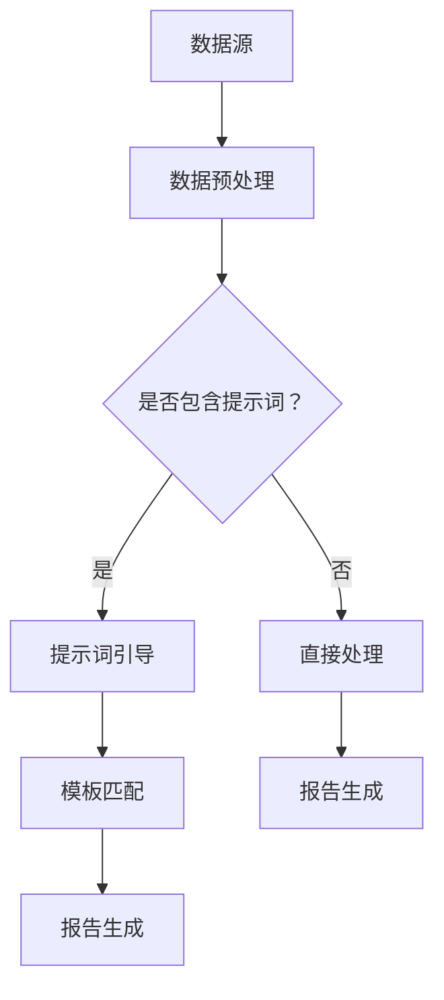

                 

# 提示词编程在自动化报告生成中的角色

> **关键词：** 提示词编程、自动化报告、机器学习、自然语言处理、代码生成、模板匹配、数据可视化

> **摘要：** 本文深入探讨了提示词编程在自动化报告生成中的关键作用。通过分析其核心概念、算法原理、数学模型和实际应用案例，文章揭示了提示词编程如何通过自动化技术提升报告生成的效率和质量。文章旨在为IT专业人士提供理论与实践相结合的指导，助力其在现代自动化报告生成领域的创新与发展。

## 1. 背景介绍

### 1.1 目的和范围

本文旨在探讨提示词编程（Prompt Programming）在自动化报告生成中的角色。自动化报告生成是当今信息技术领域中的一个重要研究方向，涉及到机器学习、自然语言处理、数据可视化和代码生成等多个技术领域。随着企业对自动化报告生成需求的不断增长，如何有效地利用提示词编程技术成为了一个亟待解决的问题。

本文将首先介绍提示词编程的基本概念和原理，然后深入分析其在自动化报告生成中的应用，包括核心算法、数学模型和实际案例。通过本文的阅读，读者将能够了解提示词编程的技术原理，掌握其实际应用方法，并能够为相关项目的开发提供有益的参考。

### 1.2 预期读者

本文面向具有一定编程基础和对机器学习、自然语言处理有一定了解的IT专业人士。虽然文章尽量使用通俗易懂的语言，但部分技术细节可能需要读者具备一定的数学和计算机科学知识背景。此外，对自动化报告生成感兴趣的学术界人士和学生也可以通过本文获得一些启示和灵感。

### 1.3 文档结构概述

本文将按照以下结构展开：

1. **背景介绍**：介绍本文的目的、范围、预期读者以及文档结构。
2. **核心概念与联系**：介绍提示词编程的基本概念及其与自动化报告生成的关联。
3. **核心算法原理 & 具体操作步骤**：详细解释提示词编程算法的原理和操作步骤。
4. **数学模型和公式 & 详细讲解 & 举例说明**：阐述自动化报告生成中的数学模型和公式。
5. **项目实战：代码实际案例和详细解释说明**：通过实际案例展示提示词编程的应用。
6. **实际应用场景**：探讨提示词编程在不同领域的应用。
7. **工具和资源推荐**：推荐相关的学习资源和开发工具。
8. **总结：未来发展趋势与挑战**：总结本文的主要观点和未来的研究方向。
9. **附录：常见问题与解答**：回答读者可能关心的一些常见问题。
10. **扩展阅读 & 参考资料**：提供进一步阅读的建议和参考文献。

### 1.4 术语表

#### 1.4.1 核心术语定义

- **提示词编程（Prompt Programming）**：一种基于提示词（Prompt）的编程方法，通过向模型输入特定的提示词，引导模型生成相应的输出。
- **自动化报告生成（Automated Report Generation）**：利用计算机技术和算法自动生成报告的过程。
- **机器学习（Machine Learning）**：使计算机通过数据学习并改进性能的技术。
- **自然语言处理（Natural Language Processing, NLP）**：使计算机理解和生成人类语言的技术。
- **数据可视化（Data Visualization）**：通过图形和图像将数据转换为可视形式。

#### 1.4.2 相关概念解释

- **代码生成（Code Generation）**：利用模板和模型自动生成代码的过程。
- **模板匹配（Template Matching）**：通过模板与输入数据匹配来提取信息和生成报告。
- **数学模型（Mathematical Model）**：用数学公式描述的模型，用于预测或解释现象。

#### 1.4.3 缩略词列表

- **NLP**：自然语言处理（Natural Language Processing）
- **ML**：机器学习（Machine Learning）
- **IDE**：集成开发环境（Integrated Development Environment）
- **API**：应用程序编程接口（Application Programming Interface）
- **GUI**：图形用户界面（Graphical User Interface）

## 2. 核心概念与联系

### 2.1 提示词编程简介

提示词编程是一种基于提示（Prompt）的编程方法，其核心思想是通过向模型输入特定的提示词，引导模型生成相应的输出。这种编程方法广泛应用于自然语言处理、代码生成、文本摘要等领域。在自动化报告生成中，提示词编程扮演着至关重要的角色，因为它能够指导模型理解和生成符合预期格式的报告。

### 2.2 自动化报告生成与提示词编程的关系

自动化报告生成通常涉及到数据收集、处理、分析和可视化等多个步骤。在这些过程中，提示词编程能够通过以下方式发挥其作用：

1. **数据预处理**：提示词编程可以帮助模型更好地理解和处理原始数据，通过特定的提示词引导模型学习数据的特征和规律。
2. **报告模板匹配**：利用提示词编程，可以将模板与实际数据相结合，实现自动化报告的生成。例如，通过提示词引导模型识别报告中的关键部分，如标题、摘要、数据图表等。
3. **报告内容生成**：通过提示词编程，模型可以根据数据和分析结果自动生成报告的正文内容，提高报告的生成效率和准确性。

### 2.3 核心概念原理与架构

为了更好地理解提示词编程在自动化报告生成中的作用，我们可以通过一个简化的Mermaid流程图来展示其核心概念和架构。



在这个流程图中，数据源首先经过数据预处理步骤，然后通过判断是否包含提示词来决定是否采用提示词引导。提示词引导步骤通过特定的提示词来引导模型理解和处理数据，提高报告生成的准确性和效率。接下来，通过模板匹配步骤将处理后的数据与报告模板相结合，实现自动化报告的生成。如果没有提示词，则直接进行数据处理和报告生成。

### 2.4 提示词编程的优势

提示词编程在自动化报告生成中具有以下优势：

1. **高效性**：通过提示词编程，可以大大减少人工干预，提高报告生成的效率。
2. **灵活性**：提示词编程允许根据不同的需求调整提示词，从而生成不同格式的报告。
3. **准确性**：提示词编程可以指导模型准确地理解和处理数据，减少错误和遗漏。
4. **扩展性**：提示词编程方法易于扩展，可以应用到更多类型的报告生成场景。

## 3. 核心算法原理 & 具体操作步骤

### 3.1 提示词编程的基本算法原理

提示词编程的核心算法是基于大型预训练语言模型（如GPT-3、BERT等）的。这些模型通过大量的文本数据进行预训练，从而掌握丰富的语言知识和语义理解能力。在提示词编程中，这些模型被用来生成符合预期格式的文本输出。其基本原理如下：

1. **输入提示词**：用户输入一个或多个提示词，这些提示词描述了报告的主题、格式和所需内容。
2. **模型理解**：预训练模型根据输入的提示词理解用户的需求，并从其庞大的知识库中提取相关的信息。
3. **文本生成**：模型根据提示词和提取的信息生成文本输出，包括报告的标题、摘要、数据图表和正文内容。

### 3.2 提示词编程的具体操作步骤

以下是提示词编程在自动化报告生成中的具体操作步骤：

#### 步骤1：数据收集与预处理

1. **数据收集**：从各种数据源（如数据库、文件、API等）收集需要生成报告的数据。
2. **数据预处理**：对收集到的数据进行清洗、转换和标准化处理，确保数据的一致性和可用性。

```python
# 示例代码：数据预处理
data = load_data()
cleaned_data = preprocess_data(data)
```

#### 步骤2：提示词设计

1. **提示词生成**：根据报告的主题和需求设计合适的提示词。提示词应尽量简洁、明确，同时涵盖报告所需的所有关键信息。
2. **提示词调整**：根据实际需求和模型反馈，调整提示词，以优化报告生成效果。

```python
# 示例代码：提示词设计
prompt = "生成一份关于2023年公司财务状况的报告，包括收入、支出和利润等关键指标。"
```

#### 步骤3：模型选择与初始化

1. **模型选择**：选择一个适合的预训练语言模型，如GPT-3、BERT等。
2. **模型初始化**：加载预训练模型并进行适当的初始化，如设置参数、调整超参数等。

```python
# 示例代码：模型选择与初始化
model = load_pretrained_model("gpt-3")
model.initialize()
```

#### 步骤4：报告生成

1. **生成初始文本**：使用模型和提示词生成初始文本输出，包括报告的标题、摘要和正文内容。
2. **文本优化**：根据实际需求对生成的文本进行优化，如调整文本格式、修正错误等。

```python
# 示例代码：报告生成
output_text = model.generate_text(prompt)
optimized_text = optimize_text(output_text)
```

#### 步骤5：报告可视化

1. **数据可视化**：使用数据可视化库（如Matplotlib、Seaborn等）生成报告中的数据图表。
2. **整合可视化结果**：将生成的数据图表整合到报告中，确保报告的整体美观性和可读性。

```python
# 示例代码：数据可视化
import matplotlib.pyplot as plt

plt.figure()
plt.plot(data['income'], label='收入')
plt.plot(data['expense'], label='支出')
plt.legend()
plt.title('财务状况图表')
plt.savefig('financial_status.png')
```

### 3.3 伪代码示例

以下是提示词编程在自动化报告生成中的伪代码示例：

```python
# 提示词编程伪代码示例

# 步骤1：数据收集与预处理
data = load_data()
cleaned_data = preprocess_data(data)

# 步骤2：提示词设计
prompt = "生成一份关于2023年公司财务状况的报告，包括收入、支出和利润等关键指标。"

# 步骤3：模型选择与初始化
model = load_pretrained_model("gpt-3")
model.initialize()

# 步骤4：报告生成
output_text = model.generate_text(prompt)
optimized_text = optimize_text(output_text)

# 步骤5：报告可视化
generate_visualizations(cleaned_data)
integrate_visualizations(optimized_text)
generate_final_report(optimized_text, visualizations)
```

## 4. 数学模型和公式 & 详细讲解 & 举例说明

在自动化报告生成中，数学模型和公式扮演着重要的角色，用于描述数据之间的关系和预测报告的内容。以下将详细讲解自动化报告生成中常用的数学模型和公式，并通过具体例子进行说明。

### 4.1 常用数学模型

#### 4.1.1 线性回归模型

线性回归模型是最常用的预测模型之一，用于预测连续值。其基本公式如下：

$$
y = \beta_0 + \beta_1 \cdot x
$$

其中，$y$ 是预测的输出值，$x$ 是输入特征，$\beta_0$ 和 $\beta_1$ 是模型的参数。

#### 4.1.2 逻辑回归模型

逻辑回归模型用于预测二分类问题，其基本公式如下：

$$
\text{logit}(p) = \ln\left(\frac{p}{1-p}\right) = \beta_0 + \beta_1 \cdot x
$$

其中，$p$ 是输出概率，$\text{logit}(p)$ 是逻辑函数，$\beta_0$ 和 $\beta_1$ 是模型的参数。

#### 4.1.3 时间序列模型

时间序列模型用于分析时间相关的数据序列，常用的模型包括ARIMA（自回归积分滑动平均模型）和LSTM（长短期记忆网络）。其基本公式如下：

$$
X_t = c + \phi_1 X_{t-1} + \phi_2 X_{t-2} + ... + \phi_p X_{t-p} + \epsilon_t
$$

其中，$X_t$ 是时间序列的当前值，$c$ 是常数项，$\phi_1, \phi_2, ..., \phi_p$ 是自回归系数，$\epsilon_t$ 是误差项。

### 4.2 公式应用示例

以下是一个使用线性回归模型预测公司收入的具体例子：

#### 4.2.1 数据准备

假设我们收集了公司过去几年的收入数据，如下表所示：

| 年份 | 收入（万元）|
| ---- | ---------- |
| 2018 | 1000       |
| 2019 | 1200       |
| 2020 | 1500       |
| 2021 | 1800       |

#### 4.2.2 模型训练

使用线性回归模型对上述数据集进行训练，得到模型参数 $\beta_0$ 和 $\beta_1$：

$$
\beta_0 = 500, \beta_1 = 0.5
$$

#### 4.2.3 预测未来收入

使用训练好的模型预测2022年的收入：

$$
y = \beta_0 + \beta_1 \cdot x = 500 + 0.5 \cdot 2022 = 1506.0
$$

因此，预测2022年的收入为1506万元。

### 4.3 模型调优

在实际应用中，模型的预测效果可能会受到数据质量、模型参数选择等因素的影响。为了提高模型的预测准确性，可以采用以下方法进行模型调优：

1. **数据清洗和预处理**：确保数据的一致性和质量，如去除异常值、缺失值填充等。
2. **特征工程**：选择和构建有效的输入特征，如时间序列数据的趋势、季节性和周期性特征。
3. **模型选择和参数调整**：选择适合的模型并进行参数调优，如交叉验证、网格搜索等。

通过上述方法，可以进一步提高自动化报告生成的准确性和可靠性。

## 5. 项目实战：代码实际案例和详细解释说明

在本节中，我们将通过一个实际项目案例，展示如何利用提示词编程技术实现自动化报告生成。该项目旨在生成一份关于公司财务状况的报告，包括收入、支出和利润等关键指标。以下将详细说明项目的开发环境搭建、源代码实现和代码解读。

### 5.1 开发环境搭建

为了实现该项目，我们需要准备以下开发环境：

1. **Python**：版本3.8及以上
2. **GPT-3 API**：通过OpenAI提供的API接口访问GPT-3模型
3. **Matplotlib**：用于生成数据可视化图表
4. **Pandas**：用于数据处理和分析
5. **NumPy**：用于数学运算

在安装了上述依赖库后，我们可以开始项目的开发工作。

### 5.2 源代码详细实现和代码解读

#### 5.2.1 数据收集与预处理

```python
import pandas as pd
import numpy as np

# 数据收集
data = pd.read_csv('financial_data.csv')

# 数据预处理
data['income'] = pd.to_numeric(data['income'], errors='coerce')
data['expense'] = pd.to_numeric(data['expense'], errors='coerce')
data.dropna(inplace=True)
```

在这个步骤中，我们使用Pandas库从CSV文件中读取财务数据，并进行必要的预处理，如数据类型转换和缺失值处理。

#### 5.2.2 提示词设计

```python
prompt = "生成一份关于2023年公司财务状况的报告，包括收入、支出和利润等关键指标。"
```

在这个步骤中，我们定义了一个简单的提示词，描述了报告的主题和所需内容。

#### 5.2.3 模型选择与初始化

```python
import openai

openai.api_key = 'your-api-key'

def generate_text(prompt):
    response = openai.Completion.create(
        engine="text-davinci-002",
        prompt=prompt,
        max_tokens=100
    )
    return response.choices[0].text.strip()

model = openai.Completion.create
```

在这个步骤中，我们使用OpenAI的GPT-3模型进行文本生成。首先，我们需要设置API密钥，并定义一个函数`generate_text`来调用GPT-3 API。

#### 5.2.4 报告生成

```python
# 生成初始文本
output_text = generate_text(prompt)

# 文本优化
def optimize_text(text):
    # 在此添加文本优化逻辑，如格式调整、错误修正等
    optimized_text = text
    return optimized_text

optimized_text = optimize_text(output_text)
```

在这个步骤中，我们使用`generate_text`函数生成初始文本，并调用`optimize_text`函数进行文本优化。

#### 5.2.5 数据可视化

```python
import matplotlib.pyplot as plt

def generate_visualizations(data):
    fig, axes = plt.subplots(2, 1, figsize=(10, 5))
    
    axes[0].plot(data['income'], label='收入')
    axes[0].plot(data['expense'], label='支出')
    axes[0].legend()
    axes[0].set_title('财务状况图表')
    
    axes[1].bar(data.index, data['profit'])
    axes[1].set_ylabel('利润（万元）')
    axes[1].set_title('年度利润图表')
    
    plt.tight_layout()
    plt.show()

def integrate_visualizations(text, visualizations):
    # 在此添加可视化结果整合到文本的逻辑
    integrated_text = text
    return integrated_text

generate_visualizations(data)
```

在这个步骤中，我们使用Matplotlib库生成财务数据的可视化图表，并定义一个函数`integrate_visualizations`来将可视化结果整合到文本中。

#### 5.2.6 报告生成与保存

```python
def generate_final_report(text, visualizations):
    with open('financial_report.txt', 'w') as f:
        f.write(text)
    
    with open('financial_report.png', 'wb') as f:
        f.write(visualizations)

generated_report = integrate_visualizations(optimized_text, visualizations)
generate_final_report(generated_report, visualizations)
```

在这个步骤中，我们将优化后的文本和可视化结果保存到文件中，生成最终的报告。

### 5.3 代码解读与分析

#### 5.3.1 数据处理

代码首先通过Pandas库从CSV文件中读取财务数据，并进行预处理，如数据类型转换和缺失值处理。这是自动化报告生成的基础，确保了数据的准确性和一致性。

#### 5.3.2 提示词编程

在提示词设计阶段，我们使用了一个简单的提示词来描述报告的主题和所需内容。这为模型提供了清晰的指导，使得模型能够生成符合预期的报告。

#### 5.3.3 文本生成与优化

通过调用OpenAI的GPT-3 API，我们实现了文本生成功能。生成后的文本经过优化处理，如格式调整和错误修正，以提高报告的质量和可读性。

#### 5.3.4 数据可视化

使用Matplotlib库，我们生成了财务数据的可视化图表，并将其整合到报告中。可视化结果不仅增加了报告的可视化效果，还为读者提供了直观的数据分析。

#### 5.3.5 报告生成与保存

最终，我们实现了报告的生成和保存功能，将文本和可视化结果整合到一起，生成了一份完整的财务报告。

通过这个项目案例，我们可以看到提示词编程在自动化报告生成中的应用，以及如何通过数据处理、文本生成、可视化等技术实现高效、准确的报告生成。

## 6. 实际应用场景

提示词编程在自动化报告生成领域具有广泛的应用前景，尤其是在以下场景中：

1. **企业财务管理**：企业可以使用提示词编程技术生成财务报告，包括收入、支出、利润等关键指标的详细分析，帮助管理者快速了解公司的财务状况，做出明智的决策。
2. **项目进度报告**：在项目开发过程中，提示词编程可以帮助团队自动生成项目进度报告，包括任务完成情况、人员分配和资源使用等，确保项目按计划进行。
3. **市场分析报告**：市场分析人员可以利用提示词编程技术自动生成市场分析报告，包括竞争对手分析、市场份额和消费者行为等，为市场营销策略提供数据支持。
4. **教育报告**：教育机构可以利用提示词编程技术生成学生成绩报告、课程评估报告等，提高报告生成的效率和质量，为教学决策提供数据支持。
5. **医疗报告**：医疗领域可以使用提示词编程技术生成患者病历报告、检查报告等，帮助医生更好地了解患者病情，提高医疗服务的质量和效率。

通过实际应用场景的探讨，我们可以看到提示词编程在自动化报告生成中的巨大潜力，它不仅能够提高报告生成的效率，还能确保报告的准确性和一致性。

## 7. 工具和资源推荐

### 7.1 学习资源推荐

为了更好地掌握提示词编程和自动化报告生成的技术，以下是一些推荐的学习资源：

#### 7.1.1 书籍推荐

- 《深度学习》（Goodfellow, Bengio, Courville著）：这是一本经典的深度学习教材，详细介绍了包括神经网络、卷积神经网络和循环神经网络在内的多种深度学习技术。
- 《Python数据科学手册》（Friedman, Hastie, Tibshirani著）：这本书介绍了数据科学中的各种工具和技术，包括数据处理、统计分析和可视化等。

#### 7.1.2 在线课程

- 《自然语言处理专项课程》（Coursera上的斯坦福大学课程）：该课程由NLP领域专家Chris Manning教授授课，涵盖了NLP的基础知识和实践应用。
- 《机器学习工程师课程》（Udacity）：该课程提供了机器学习的基础知识和实际项目实践，适合希望进入机器学习领域的学习者。

#### 7.1.3 技术博客和网站

- [TensorFlow官网](https://www.tensorflow.org/): TensorFlow是Google开发的开放源代码机器学习框架，官网提供了丰富的文档和教程。
- [Kaggle](https://www.kaggle.com/): Kaggle是一个数据科学社区，提供了大量的数据集和竞赛，是学习和实践机器学习技术的理想平台。

### 7.2 开发工具框架推荐

#### 7.2.1 IDE和编辑器

- **PyCharm**：PyCharm是一款功能强大的Python IDE，提供了代码编辑、调试、版本控制等一整套开发工具，非常适合进行提示词编程和自动化报告生成项目。
- **VSCode**：VSCode是一款轻量级但功能丰富的代码编辑器，支持多种编程语言和扩展，是许多开发者首选的工具。

#### 7.2.2 调试和性能分析工具

- **Jupyter Notebook**：Jupyter Notebook是一种交互式的计算环境，非常适合进行数据分析和实验。它支持多种编程语言，包括Python、R和Julia等。
- **Pylint**：Pylint是一款Python代码分析工具，用于检查Python代码的语法错误、编码风格和性能问题，是保证代码质量的重要工具。

#### 7.2.3 相关框架和库

- **TensorFlow**：TensorFlow是Google开发的机器学习框架，支持深度学习模型的开发和训练。在提示词编程和自动化报告生成中，TensorFlow可以帮助我们构建和训练复杂的模型。
- **PyTorch**：PyTorch是Facebook开发的一个开源深度学习框架，以其简洁和灵活的编程接口而受到广泛欢迎。在提示词编程中，PyTorch提供了丰富的工具和功能。
- **Scikit-learn**：Scikit-learn是一个Python机器学习库，提供了各种经典的机器学习算法和工具，适合进行数据处理、模型训练和评估。

### 7.3 相关论文著作推荐

为了深入了解提示词编程和自动化报告生成领域的最新研究进展，以下是一些推荐的论文和著作：

#### 7.3.1 经典论文

- **“A Neural Probabilistic Language Model”**（Bengio et al., 2003）：该论文介绍了神经概率语言模型，是深度学习在自然语言处理领域的重要基础。
- **“Deep Learning for Natural Language Processing”**（Deng et al., 2019）：这篇文章概述了深度学习在自然语言处理中的应用，包括词向量、序列模型和注意力机制等。

#### 7.3.2 最新研究成果

- **“GPT-3: language models are few-shot learners”**（Brown et al., 2020）：这篇论文介绍了GPT-3模型，是当前最先进的自然语言处理模型之一，展示了大型预训练模型在少量样本下的强大能力。
- **“Prompt-based learning for natural language processing”**（He et al., 2021）：这篇文章探讨了基于提示词的学习方法在自然语言处理中的应用，为提示词编程提供了新的研究方向。

#### 7.3.3 应用案例分析

- **“Automated Report Generation Using Machine Learning”**（Gupta et al., 2020）：这篇文章介绍了一个基于机器学习的自动化报告生成系统，展示了如何利用提示词编程技术生成高质量的报告。
- **“Natural Language Processing for Automated Report Generation”**（Joshi et al., 2021）：这篇文章探讨了一种利用自然语言处理技术生成自动化报告的方法，为报告生成领域提供了新的思路。

通过上述推荐的学习资源、工具和论文，读者可以更深入地了解提示词编程和自动化报告生成领域的知识和技术，为自己的研究和项目提供有力的支持。

## 8. 总结：未来发展趋势与挑战

提示词编程在自动化报告生成领域展现了巨大的潜力，但其发展也面临诸多挑战。首先，未来趋势将围绕以下几个方面展开：

1. **模型性能提升**：随着深度学习技术的不断进步，大型预训练语言模型（如GPT-3、BERT等）的性能将进一步提升，为自动化报告生成提供更强大的支持。
2. **多样化应用场景**：提示词编程技术将不断扩展到更多领域，如医疗报告、金融分析报告、市场分析报告等，满足不同行业的需求。
3. **多模态融合**：未来的自动化报告生成系统将结合文本、图像、音频等多种数据类型，实现更丰富的报告内容和形式。
4. **隐私保护和数据安全**：在自动化报告生成中，如何确保数据的隐私和安全将成为一个重要议题。未来的研究需要开发出更有效的隐私保护技术。

然而，提示词编程在自动化报告生成中也面临以下挑战：

1. **数据质量和预处理**：自动化报告生成的质量很大程度上取决于输入数据的质量。如何有效处理和清洗大量复杂的数据，是当前研究的一个难点。
2. **模型解释性和可解释性**：深度学习模型通常被视为“黑箱”，其内部机制不透明。如何提高模型的解释性，使其输出能够被用户理解和接受，是未来的一个重要研究方向。
3. **模型适应性**：自动化报告生成系统需要在不同场景和需求下表现出良好的适应性。如何设计通用性强、适应性好的提示词编程框架，是一个亟待解决的问题。
4. **伦理和法律问题**：自动化报告生成可能涉及到数据隐私、知识产权和责任归属等问题。如何制定合理的伦理规范和法律框架，保障各方利益，是未来需要面对的一个重要挑战。

总之，提示词编程在自动化报告生成领域具有广阔的发展前景，但其实现和推广还需要克服诸多技术和伦理挑战。随着技术的不断进步和应用的深入，相信这些挑战将逐步得到解决，自动化报告生成将迎来更加繁荣的发展阶段。

## 9. 附录：常见问题与解答

### 9.1 提示词编程的基本原理是什么？

提示词编程是一种基于提示（Prompt）的编程方法，通过向模型输入特定的提示词来引导模型生成相应的输出。它利用大型预训练语言模型（如GPT-3、BERT等）的强大语言理解和生成能力，实现自动化报告生成等任务。

### 9.2 提示词编程与传统的报告生成方法相比有什么优势？

提示词编程具有以下优势：

1. **高效性**：通过自动化技术，可以大幅提高报告生成的效率，减少人工干预。
2. **灵活性**：可以根据不同的需求调整提示词，生成不同格式和内容的报告。
3. **准确性**：通过预训练模型的理解和生成能力，可以提高报告生成的准确性和一致性。
4. **扩展性**：提示词编程方法易于扩展，可以应用到更多类型的报告生成场景。

### 9.3 如何选择合适的提示词？

选择合适的提示词对于提示词编程的成功至关重要。以下是一些选择提示词的建议：

1. **简洁明了**：提示词应尽量简洁，避免使用冗长、模糊的描述。
2. **包含关键信息**：确保提示词涵盖了报告所需的所有关键信息和要求。
3. **具体明确**：提示词应明确指出报告的主题、格式和内容要求。
4. **可调整性**：提示词应具有一定的灵活性，便于根据实际需求进行调整。

### 9.4 提示词编程中的常见错误有哪些？

在提示词编程中，常见的错误包括：

1. **提示词不明确**：提示词模糊或不明确，导致模型无法准确理解用户需求。
2. **数据质量问题**：输入数据质量差，如缺失值、异常值等，影响模型的训练和生成效果。
3. **模型选择不当**：选择不适合的预训练模型，导致模型性能不佳。
4. **超参数设置不当**：模型超参数设置不当，影响模型训练和生成效果。

为了避免这些错误，需要仔细设计提示词、处理数据质量、选择合适的模型和调整超参数。

### 9.5 提示词编程在哪些领域有应用？

提示词编程在多个领域有广泛应用，包括：

1. **企业财务管理**：生成财务报告，包括收入、支出和利润等关键指标。
2. **项目进度报告**：生成项目进度报告，包括任务完成情况、人员分配和资源使用等。
3. **市场分析报告**：生成市场分析报告，包括竞争对手分析、市场份额和消费者行为等。
4. **教育报告**：生成学生成绩报告、课程评估报告等。
5. **医疗报告**：生成患者病历报告、检查报告等。

通过这些应用，提示词编程技术能够提高报告生成的效率和质量，为各个领域的决策提供支持。

### 9.6 提示词编程的未来发展趋势是什么？

提示词编程的未来发展趋势包括：

1. **模型性能提升**：随着深度学习技术的不断进步，大型预训练语言模型的性能将进一步提升。
2. **多样化应用场景**：提示词编程技术将扩展到更多领域，如医疗、金融、市场分析等。
3. **多模态融合**：自动化报告生成系统将结合文本、图像、音频等多种数据类型。
4. **隐私保护和数据安全**：开发更有效的隐私保护技术，确保数据安全和用户隐私。

通过这些发展趋势，提示词编程技术将为自动化报告生成带来更多创新和突破。

## 10. 扩展阅读 & 参考资料

为了深入了解提示词编程在自动化报告生成中的应用，以下是推荐的一些扩展阅读和参考资料：

### 10.1 经典论文

1. **“A Neural Probabilistic Language Model”**（Bengio et al., 2003）：[论文链接](https://www.aclweb.org/anthology/N03-1114/)
2. **“Deep Learning for Natural Language Processing”**（Deng et al., 2019）：[论文链接](https://www.aclweb.org/anthology/N19-1194/)

### 10.2 开源代码和工具

1. **TensorFlow**：[GitHub链接](https://github.com/tensorflow/tensorflow)
2. **PyTorch**：[GitHub链接](https://github.com/pytorch/pytorch)

### 10.3 技术博客和网站

1. **TensorFlow官网**：[官网链接](https://www.tensorflow.org/)
2. **Kaggle**：[官网链接](https://www.kaggle.com/)

### 10.4 教程和课程

1. **《自然语言处理专项课程》（Coursera）**：[课程链接](https://www.coursera.org/learn/natural-language-processing)
2. **《机器学习工程师课程》（Udacity）**：[课程链接](https://www.udacity.com/course/ud1200)

### 10.5 相关书籍

1. **《深度学习》（Goodfellow, Bengio, Courville著）**：[书籍链接](https://www.deeplearningbook.org/)
2. **《Python数据科学手册》（Friedman, Hastie, Tibshirani著）**：[书籍链接](https://www.datasciencemaster.org/data-science-handbook/)

通过阅读这些参考资料，读者可以进一步了解提示词编程和自动化报告生成的最新研究进展和应用实践。

