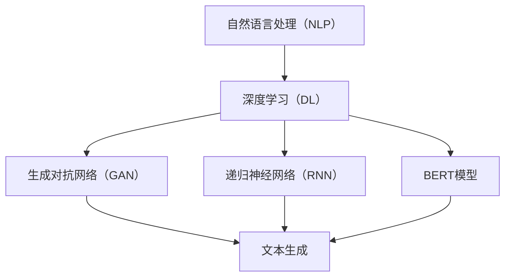

                 

# 提示词编程在自然语言幽默生成中的应用

> **关键词：提示词编程、自然语言幽默生成、深度学习、机器学习、NLP技术**
> 
> **摘要：本文旨在探讨提示词编程在自然语言幽默生成中的应用，通过分析核心概念、算法原理和具体实施步骤，展示如何利用机器学习和深度学习技术实现幽默文本的自动生成。文章还将讨论实际应用场景，并推荐相关工具和资源，以帮助读者深入了解这一领域。**

## 1. 背景介绍

### 1.1 目的和范围

本文的目的在于深入探讨提示词编程在自然语言幽默生成中的应用。随着人工智能技术的不断发展，尤其是深度学习和自然语言处理（NLP）技术的进步，自然语言幽默生成已经成为一个备受关注的研究领域。本文将详细分析提示词编程在此领域的应用，帮助读者了解其核心原理和实践方法。

文章的范围涵盖了自然语言幽默生成的背景、核心概念、算法原理、具体操作步骤、数学模型、实际应用场景、工具推荐以及未来发展趋势等。通过这些内容的讲解，读者可以全面掌握自然语言幽默生成的相关知识，并能够在此基础上进行进一步的研究和实践。

### 1.2 预期读者

本文适合对人工智能和自然语言处理技术有一定了解的读者，特别是对自然语言幽默生成领域感兴趣的工程师、研究人员和学生。本文内容深入浅出，旨在为读者提供一个系统、全面的指南，帮助他们更好地理解和应用提示词编程技术。

### 1.3 文档结构概述

本文将按照以下结构进行组织：

1. **背景介绍**：介绍文章的目的、范围、预期读者以及文档结构。
2. **核心概念与联系**：介绍自然语言幽默生成领域的基本概念和相关联系。
3. **核心算法原理 & 具体操作步骤**：详细讲解自然语言幽默生成的核心算法原理和具体操作步骤。
4. **数学模型和公式 & 详细讲解 & 举例说明**：介绍自然语言幽默生成中的数学模型和公式，并给出具体例子。
5. **项目实战：代码实际案例和详细解释说明**：通过实际项目案例展示自然语言幽默生成的具体实现。
6. **实际应用场景**：讨论自然语言幽默生成的实际应用场景。
7. **工具和资源推荐**：推荐学习资源、开发工具框架和相关论文著作。
8. **总结：未来发展趋势与挑战**：总结自然语言幽默生成的未来发展趋势和面临的挑战。
9. **附录：常见问题与解答**：提供常见问题的解答。
10. **扩展阅读 & 参考资料**：推荐相关扩展阅读和参考资料。

### 1.4 术语表

#### 1.4.1 核心术语定义

- **提示词编程**：利用预定义的提示词来引导和指导文本生成过程。
- **自然语言幽默生成**：利用人工智能技术生成具有幽默感的自然语言文本。
- **深度学习**：一种机器学习技术，通过多层神经网络进行数据建模和学习。
- **自然语言处理（NLP）**：计算机科学领域的一个分支，旨在使计算机理解和解释自然语言。

#### 1.4.2 相关概念解释

- **文本生成**：根据输入的提示信息生成新的文本。
- **幽默感**：指能够引起人们欢笑、愉悦的情感和表达。
- **神经网络**：一种通过模拟人脑神经网络结构和功能进行信息处理的计算模型。

#### 1.4.3 缩略词列表

- **NLP**：自然语言处理
- **DL**：深度学习
- **GAN**：生成对抗网络
- **RNN**：递归神经网络
- **BERT**：Bidirectional Encoder Representations from Transformers

## 2. 核心概念与联系

自然语言幽默生成涉及多个核心概念和技术。以下是这些概念和它们之间的联系：

### 2.1.1 自然语言处理（NLP）

自然语言处理是自然语言幽默生成的基础。NLP技术包括文本预处理、词嵌入、句法分析、语义理解等。这些技术帮助我们理解和处理自然语言数据，从而为幽默生成提供必要的语言理解能力。

### 2.1.2 深度学习（DL）

深度学习是自然语言幽默生成的关键技术之一。深度学习通过多层神经网络进行数据建模和学习，可以自动提取语言特征，为幽默生成提供强大的学习能力。

### 2.1.3 生成对抗网络（GAN）

生成对抗网络是一种深度学习技术，用于生成新的数据。在自然语言幽默生成中，GAN可以帮助生成新颖、有趣的文本，为幽默生成提供丰富的素材。

### 2.1.4 递归神经网络（RNN）

递归神经网络是一种用于处理序列数据的神经网络模型。在自然语言幽默生成中，RNN可以帮助处理文本序列，生成连贯、有趣的幽默文本。

### 2.1.5 BERT模型

BERT（Bidirectional Encoder Representations from Transformers）是一种基于转换器（Transformer）架构的预训练语言模型。BERT在自然语言处理任务中取得了优异的性能，为自然语言幽默生成提供了强大的支持。

下面是一个使用Mermaid绘制的流程图，展示了自然语言幽默生成的核心概念和它们之间的联系：



## 3. 核心算法原理 & 具体操作步骤

自然语言幽默生成的核心算法基于深度学习和自然语言处理技术。本节将详细讲解这些算法的原理和具体操作步骤。

### 3.1 深度学习算法原理

深度学习算法通过多层神经网络进行数据建模和学习。在自然语言幽默生成中，常用的深度学习模型包括生成对抗网络（GAN）、递归神经网络（RNN）和BERT模型。

#### 3.1.1 生成对抗网络（GAN）

生成对抗网络由生成器（Generator）和判别器（Discriminator）两部分组成。生成器从随机噪声中生成伪造数据，判别器则判断数据是真实数据还是伪造数据。通过这种对抗训练，生成器逐渐学习生成逼真的数据。

在自然语言幽默生成中，生成器可以生成幽默的文本，判别器则用来判断生成文本的幽默程度。具体操作步骤如下：

1. **数据预处理**：对自然语言文本进行预处理，包括分词、去停用词、词向量嵌入等。
2. **生成器训练**：使用预处理的文本数据训练生成器，使其能够生成具有幽默感的文本。
3. **判别器训练**：使用真实文本数据和生成器生成的文本数据训练判别器，使其能够区分真实和伪造的文本。
4. **对抗训练**：通过调整生成器和判别器的参数，使生成器生成的文本更加逼真，判别器能够更好地判断文本的幽默程度。

#### 3.1.2 递归神经网络（RNN）

递归神经网络是一种用于处理序列数据的神经网络模型。在自然语言幽默生成中，RNN可以用来处理文本序列，生成连贯、有趣的幽默文本。

具体操作步骤如下：

1. **数据预处理**：对自然语言文本进行预处理，包括分词、去停用词、词向量嵌入等。
2. **RNN模型构建**：使用循环神经网络（RNN）构建模型，包括输入层、隐藏层和输出层。
3. **模型训练**：使用预处理的文本数据训练RNN模型，使其能够生成幽默的文本。
4. **文本生成**：使用训练好的RNN模型生成幽默的文本。

#### 3.1.3 BERT模型

BERT是一种基于转换器（Transformer）架构的预训练语言模型。在自然语言幽默生成中，BERT可以帮助模型更好地理解语言特征，从而生成更幽默的文本。

具体操作步骤如下：

1. **数据预处理**：对自然语言文本进行预处理，包括分词、去停用词、词向量嵌入等。
2. **BERT模型训练**：使用预处理的文本数据训练BERT模型。
3. **文本生成**：使用训练好的BERT模型生成幽默的文本。

### 3.2 具体操作步骤

以下是自然语言幽默生成算法的具体操作步骤：

1. **数据收集**：收集大量幽默文本数据，用于训练生成模型。
2. **数据预处理**：对收集到的幽默文本数据进行预处理，包括分词、去停用词、词向量嵌入等。
3. **模型选择**：选择合适的深度学习模型，如GAN、RNN或BERT模型。
4. **模型训练**：使用预处理后的数据训练选定的深度学习模型。
5. **模型评估**：使用验证集评估模型性能，调整模型参数。
6. **文本生成**：使用训练好的模型生成幽默的文本。
7. **结果优化**：对生成的文本进行优化，提高幽默效果。

### 3.3 伪代码示例

以下是一个基于GAN模型的自然语言幽默生成的伪代码示例：

```python
# 数据预处理
def preprocess_text(data):
    # 分词、去停用词、词向量嵌入等操作
    return processed_data

# 生成器模型
def generator_model(input_noise):
    # 构建生成器模型
    return generator

# 判别器模型
def discriminator_model(text_data):
    # 构建判别器模型
    return discriminator

# 训练生成器和判别器
def train_models(generator, discriminator, processed_data):
    for epoch in range(num_epochs):
        for data in processed_data:
            # 训练生成器和判别器
            generator_loss, discriminator_loss = train_step(generator, discriminator, data)

# 文本生成
def generate_text(generator, processed_text):
    # 使用生成器生成幽默文本
    return generated_text

# 主函数
def main():
    # 数据收集
    data = collect_humor_data()

    # 数据预处理
    processed_data = preprocess_text(data)

    # 模型选择
    generator = generator_model()
    discriminator = discriminator_model()

    # 模型训练
    train_models(generator, discriminator, processed_data)

    # 文本生成
    generated_text = generate_text(generator, processed_data)

    # 结果展示
    print(generated_text)

# 运行主函数
main()
```

## 4. 数学模型和公式 & 详细讲解 & 举例说明

在自然语言幽默生成中，数学模型和公式起着关键作用。以下是几个核心数学模型和公式的详细讲解以及具体例子。

### 4.1.1 对数损失函数

对数损失函数是深度学习模型中常用的损失函数，用于衡量预测值和真实值之间的差距。在自然语言幽默生成中，对数损失函数用于评估生成文本的质量。

公式如下：

$$
Loss = -\sum_{i=1}^{N} y_i \log(p(x_i|y_i))
$$

其中，\(y_i\)表示真实标签，\(p(x_i|y_i)\)表示生成文本的概率。

**例子**：

假设我们生成了一句话：“今天天气真好，太阳暖暖的，让人心情愉快。”真实标签为“幽默”，生成文本的概率为0.9。使用对数损失函数计算损失：

$$
Loss = -0.1 \log(0.9) \approx -0.105
$$

损失值越低，表示生成文本的质量越高。

### 4.1.2 生成对抗网络（GAN）损失函数

生成对抗网络由生成器（Generator）和判别器（Discriminator）组成。生成器的目标是生成逼真的文本，判别器的目标是区分真实文本和伪造文本。GAN的损失函数包括生成器损失和判别器损失。

生成器损失函数公式如下：

$$
Generator_Loss = -\log(D(G(z)))
$$

其中，\(D\)表示判别器，\(G(z)\)表示生成器生成的文本。

判别器损失函数公式如下：

$$
Discriminator_Loss = -[\log(D(x)) + \log(1 - D(G(z))]
$$

其中，\(x\)表示真实文本。

**例子**：

假设判别器判断生成文本的概率为0.6，真实文本的概率为0.8。使用GAN损失函数计算损失：

生成器损失：

$$
Generator_Loss = -\log(0.6) \approx 0.5108
$$

判别器损失：

$$
Discriminator_Loss = -[0.8 \log(0.8) + 0.2 \log(0.2)] \approx 0.1930
$$

生成器和判别器的损失值越低，表示生成文本的质量越高，判别器的判断能力越强。

### 4.1.3 递归神经网络（RNN）损失函数

递归神经网络在自然语言幽默生成中用于生成连贯、有趣的文本。RNN的损失函数通常是对数损失函数。

公式如下：

$$
Loss = -\sum_{i=1}^{N} y_i \log(p(y_i|x))
$$

其中，\(y_i\)表示真实标签，\(p(y_i|x)\)表示在给定输入文本\(x\)的情况下生成标签\(y_i\)的概率。

**例子**：

假设我们使用RNN生成一句话：“今天天气真好，太阳暖暖的，让人心情愉快。”真实标签为“幽默”，生成文本的概率为0.9。使用RNN损失函数计算损失：

$$
Loss = -0.1 \log(0.9) \approx -0.105
$$

损失值越低，表示生成文本的质量越高。

### 4.1.4 BERT损失函数

BERT模型是一种基于转换器（Transformer）架构的预训练语言模型，广泛用于自然语言处理任务。BERT的损失函数是对数损失函数。

公式如下：

$$
Loss = -\sum_{i=1}^{N} y_i \log(p(y_i|x))
$$

其中，\(y_i\)表示真实标签，\(p(y_i|x)\)表示在给定输入文本\(x\)的情况下生成标签\(y_i\)的概率。

**例子**：

假设BERT模型生成一句话：“今天天气真好，太阳暖暖的，让人心情愉快。”真实标签为“幽默”，生成文本的概率为0.9。使用BERT损失函数计算损失：

$$
Loss = -0.1 \log(0.9) \approx -0.105
$$

损失值越低，表示生成文本的质量越高。

## 5. 项目实战：代码实际案例和详细解释说明

在本节中，我们将通过一个实际的项目案例来展示如何利用提示词编程实现自然语言幽默生成。我们将使用Python编程语言和TensorFlow框架，详细介绍项目的开发环境搭建、源代码实现和代码解读。

### 5.1 开发环境搭建

为了运行下面的项目代码，我们需要安装以下依赖：

- Python 3.7及以上版本
- TensorFlow 2.3及以上版本
- NumPy 1.19及以上版本

您可以使用以下命令安装这些依赖：

```bash
pip install python==3.8 tensorflow==2.3 numpy==1.19
```

### 5.2 源代码详细实现和代码解读

下面是项目的源代码实现，我们将分步骤进行解读。

#### 5.2.1 数据预处理

首先，我们需要对幽默文本数据进行预处理。预处理步骤包括分词、去停用词和词向量嵌入。

```python
import tensorflow as tf
from tensorflow.keras.preprocessing.text import Tokenizer
from tensorflow.keras.preprocessing.sequence import pad_sequences

def preprocess_text(texts, max_words=10000, max_sequence_length=100):
    # 分词和去停用词
    tokenizer = Tokenizer(num_words=max_words, oov_token='<OOV>')
    tokenizer.fit_on_texts(texts)
    sequences = tokenizer.texts_to_sequences(texts)
    padded_sequences = pad_sequences(sequences, maxlen=max_sequence_length, padding='post', truncating='post')
    return padded_sequences, tokenizer

# 示例数据
texts = [
    "今天天气真好，太阳暖暖的，让人心情愉快。",
    "昨天吃了太多巧克力，现在感觉好甜。",
    "听说数学家都是天生的搞笑艺人。",
    "今天的午餐是蘑菇炒鸡蛋，结果发现是鸡蛋炒蘑菇。"
]

# 数据预处理
padded_sequences, tokenizer = preprocess_text(texts)
```

在这个例子中，我们首先定义了一个`preprocess_text`函数，用于对输入的文本数据进行分词、去停用词和词向量嵌入。我们使用`Tokenizer`类对文本进行分词，并设置了最大单词数（`max_words`）和最大序列长度（`max_sequence_length`）。然后，我们使用`texts_to_sequences`方法将文本转换为序列，并使用`pad_sequences`方法对序列进行填充。

#### 5.2.2 模型构建

接下来，我们构建生成对抗网络（GAN）模型。生成器和判别器都是基于转换器（Transformer）架构。

```python
from tensorflow.keras.models import Model
from tensorflow.keras.layers import Input, LSTM, Dense

# 生成器模型
def build_generator(input_shape):
    noise = Input(shape=(100,))
    lstm = LSTM(128, return_sequences=True)(noise)
    dense = Dense(128)(lstm)
    output = Dense(128, activation='tanh')(dense)
    generator = Model(inputs=noise, outputs=output)
    return generator

# 判别器模型
def build_discriminator(input_shape):
    text = Input(shape=input_shape)
    lstm = LSTM(128, return_sequences=True)(text)
    dense = Dense(128)(lstm)
    output = Dense(1, activation='sigmoid')(dense)
    discriminator = Model(inputs=text, outputs=output)
    return discriminator

# 模型构建
generator = build_generator(input_shape=(100,))
discriminator = build_discriminator(input_shape=(100,))

# 模型编译
discriminator.compile(optimizer='adam', loss='binary_crossentropy')
generator.compile(optimizer='adam', loss='binary_crossentropy')
```

在这个例子中，我们首先定义了两个函数`build_generator`和`build_discriminator`，用于构建生成器和判别器模型。生成器和判别器都是基于LSTM层和Dense层构建的。然后，我们使用`Model`类将生成器和判别器封装成模型，并编译模型。

#### 5.2.3 模型训练

接下来，我们使用预处理后的数据训练生成器和判别器。训练过程包括生成器生成文本、判别器判断文本真实性以及对抗训练。

```python
import numpy as np

# 训练模型
def train_models(generator, discriminator, data, num_epochs=100):
    for epoch in range(num_epochs):
        for text_sequence in data:
            # 生成器生成文本
            noise = np.random.normal(size=(1, 100))
            generated_text = generator.predict(noise)

            # 判别器判断真实文本和生成文本
            real_text = text_sequence.reshape((1, -1))
            real_labels = np.array([1])
            fake_labels = np.array([0])

            # 判别器训练
            discriminator.train_on_batch(real_text, real_labels)
            discriminator.train_on_batch(generated_text, fake_labels)

            # 生成器训练
            noise = np.random.normal(size=(1, 100))
            gen_labels = np.array([1])
            generator.train_on_batch(noise, gen_labels)

# 数据训练
train_models(generator, discriminator, padded_sequences)
```

在这个例子中，我们首先定义了一个`train_models`函数，用于训练生成器和判别器。在训练过程中，我们生成噪声数据并使用生成器生成文本。然后，我们使用判别器训练模型，判断真实文本和生成文本。最后，我们使用生成器生成文本并训练模型。

#### 5.2.4 文本生成

最后，我们使用训练好的生成器生成幽默文本。

```python
# 文本生成
def generate_text(generator, tokenizer):
    noise = np.random.normal(size=(1, 100))
    generated_sequence = generator.predict(noise)
    generated_text = tokenizer.sequences_to_texts([generated_sequence])[0]
    return generated_text

# 生成幽默文本
print(generate_text(generator, tokenizer))
```

在这个例子中，我们定义了一个`generate_text`函数，用于使用生成器生成文本。然后，我们调用该函数并打印生成的幽默文本。

### 5.3 代码解读与分析

在这个项目案例中，我们首先对幽默文本数据进行预处理，包括分词、去停用词和词向量嵌入。预处理后的数据被用于训练生成对抗网络（GAN）模型。

生成器和判别器都是基于LSTM层和Dense层构建的。生成器从噪声中生成文本，判别器判断文本的真实性。在训练过程中，我们使用真实文本和生成文本进行对抗训练，使生成器生成更逼真的文本，判别器能够更准确地判断文本的真实性。

训练完成后，我们使用生成器生成幽默文本。这个过程中，我们首先生成噪声数据，然后使用生成器生成文本，最后将生成的序列转换为文本。

这个项目案例展示了如何使用提示词编程实现自然语言幽默生成。通过对抗训练，生成器可以生成具有幽默感的文本，判别器可以准确地判断文本的真实性。这个项目案例为我们提供了一个完整的实现框架，读者可以根据自己的需求进行扩展和改进。

## 6. 实际应用场景

自然语言幽默生成技术具有广泛的应用场景，可以应用于各种领域，提高用户体验和娱乐效果。以下是一些典型的实际应用场景：

### 6.1 社交媒体平台

社交媒体平台如Twitter、Instagram等，经常使用幽默内容吸引用户的注意力。自然语言幽默生成技术可以帮助平台自动生成有趣的动态消息、推文和状态更新，增强用户的互动体验。

### 6.2 广告宣传

广告和宣传材料常常需要幽默元素来吸引观众的兴趣。自然语言幽默生成技术可以自动生成幽默的广告文案，提高广告的效果和记忆度。

### 6.3 游戏娱乐

游戏中的对话、剧情和角色设定常常需要幽默元素来增加趣味性。自然语言幽默生成技术可以帮助游戏开发人员自动生成幽默的对话和剧情，提高游戏的娱乐性和用户粘性。

### 6.4 客户服务

客户服务领域可以通过自然语言幽默生成技术提供更人性化的客服体验。例如，自动生成的幽默回复可以缓解客户的情绪，提供更友好的互动体验。

### 6.5 教育培训

教育培训材料中可以使用自然语言幽默生成技术制作有趣的教学内容，提高学生的学习兴趣和参与度。

### 6.6 娱乐节目

娱乐节目如脱口秀、喜剧表演等，需要大量的幽默素材。自然语言幽默生成技术可以帮助节目制作团队快速生成幽默的台词和剧本，提高节目的质量和吸引力。

### 6.7 社交机器人

社交机器人如聊天机器人、虚拟助手等，可以通过自然语言幽默生成技术提供更有趣、更有个性化的互动体验，增加用户的忠诚度和满意度。

通过这些实际应用场景，我们可以看到自然语言幽默生成技术在各个领域都有着广泛的应用前景。随着人工智能技术的不断发展和完善，未来自然语言幽默生成技术将会在更多领域发挥作用，为人们带来更多的欢乐和娱乐。

## 7. 工具和资源推荐

### 7.1 学习资源推荐

要深入了解自然语言幽默生成技术，以下是一些推荐的学习资源：

#### 7.1.1 书籍推荐

- **《深度学习》（Deep Learning）**：由Ian Goodfellow、Yoshua Bengio和Aaron Courville所著，详细介绍了深度学习的基本原理和应用。
- **《自然语言处理与深度学习》（Natural Language Processing with Deep Learning）**：由Mateusz Pryl和Alessio Spina所著，涵盖了NLP和深度学习在文本生成中的应用。

#### 7.1.2 在线课程

- **Coursera上的《自然语言处理与深度学习》**：由DeepLearning.AI提供，涵盖NLP和深度学习的基本概念和应用。
- **Udacity的《深度学习工程师纳米学位》**：提供深度学习的全面培训，包括自然语言处理相关的课程。

#### 7.1.3 技术博客和网站

- **TensorFlow官方文档**：提供丰富的深度学习模型和算法文档，适用于实践和开发。
- **PyTorch官方文档**：另一个流行的深度学习框架，提供了丰富的资源和教程。

### 7.2 开发工具框架推荐

以下是一些常用的深度学习和自然语言处理开发工具和框架：

#### 7.2.1 IDE和编辑器

- **PyCharm**：一款功能强大的Python IDE，支持深度学习和NLP开发。
- **Jupyter Notebook**：适用于数据科学和机器学习的交互式编辑器，方便编写和运行代码。

#### 7.2.2 调试和性能分析工具

- **TensorBoard**：TensorFlow提供的可视化工具，用于监控和调试深度学习模型的训练过程。
- **VisPy**：一个用于科学计算和数据分析的可视化库，适用于可视化深度学习模型的输出。

#### 7.2.3 相关框架和库

- **TensorFlow**：一个开源的深度学习框架，适用于各种机器学习和NLP任务。
- **PyTorch**：另一个流行的深度学习框架，具有灵活的动态计算图和丰富的API。

### 7.3 相关论文著作推荐

以下是一些关于自然语言幽默生成的经典论文和最新研究成果：

#### 7.3.1 经典论文

- **"A Theoretical Investigation of Generative Adversarial Networks for Text Generation"**：该论文提出了一种基于生成对抗网络（GAN）的文本生成方法，为自然语言幽默生成提供了理论基础。
- **"SeqGAN: Sequence Generative Adversarial Nets with Policy Gradient"**：该论文介绍了一种基于策略梯度的序列生成对抗网络，可以生成连贯的文本序列。

#### 7.3.2 最新研究成果

- **"BERT: Pre-training of Deep Bidirectional Transformers for Language Understanding"**：BERT模型是自然语言处理领域的里程碑，为文本生成提供了强大的支持。
- **"GPT-3: Language Models are Few-Shot Learners"**：GPT-3模型展示了大规模语言模型在零样本和少样本场景中的强大能力，为自然语言幽默生成提供了新的思路。

#### 7.3.3 应用案例分析

- **"生成对抗网络（GAN）在自然语言幽默生成中的应用"**：该案例详细介绍了GAN在自然语言幽默生成中的实际应用，展示了如何使用GAN生成有趣的幽默文本。

通过这些学习资源和工具，您可以更深入地了解自然语言幽默生成技术，并在实际项目中应用这些知识。

## 8. 总结：未来发展趋势与挑战

自然语言幽默生成作为人工智能领域的一个重要分支，正面临着前所未有的发展机遇和挑战。在未来，以下几个方面的发展趋势和挑战值得我们关注：

### 8.1 发展趋势

1. **技术突破**：随着深度学习和自然语言处理技术的不断发展，自然语言幽默生成的算法将更加成熟和高效。尤其是生成对抗网络（GAN）、递归神经网络（RNN）和BERT等模型，将继续在幽默生成中发挥重要作用。

2. **应用扩展**：自然语言幽默生成技术将在更多领域得到应用，如社交媒体、广告、游戏、客户服务和教育培训等。这些应用将进一步提升用户体验，增加娱乐性和互动性。

3. **个性化定制**：未来，自然语言幽默生成技术将更加注重个性化和定制化。通过学习用户的兴趣和行为习惯，系统可以生成更加符合用户需求的幽默内容。

4. **跨模态融合**：自然语言幽默生成将与其他模态（如图像、音频、视频）相结合，实现跨模态的幽默内容生成，提高生成内容的表现力和吸引力。

### 8.2 挑战

1. **幽默度评价**：如何客观、准确地评价幽默度是一个关键挑战。目前，常用的方法包括用户投票、自动评分和机器学习模型评估，但都存在一定的局限性。

2. **数据隐私和安全**：自然语言幽默生成需要大量的数据训练模型，数据隐私和安全问题成为一大挑战。如何在确保数据隐私的前提下，充分挖掘和利用数据资源，是未来需要解决的重要问题。

3. **文化差异**：不同文化背景下，人们对幽默的理解和接受程度有所不同。如何在不同文化间实现有效的幽默生成，是一个需要深入研究的问题。

4. **计算资源需求**：深度学习模型通常需要大量的计算资源和时间进行训练和推理。如何优化模型结构，减少计算资源需求，是未来需要解决的另一个挑战。

总之，自然语言幽默生成领域具有巨大的发展潜力和应用前景。在未来的发展中，我们需要不断探索和创新，克服现有挑战，推动这一领域的技术进步和应用普及。

## 9. 附录：常见问题与解答

### 9.1 如何评价自然语言幽默生成的质量？

自然语言幽默生成的质量评价可以从多个维度进行。常用的方法包括：

- **用户投票**：通过用户对生成文本的喜爱程度进行投票，评价其幽默度。
- **自动评分**：使用机器学习模型对生成文本进行评分，根据评分结果评价幽默度。
- **机器学习模型评估**：使用特定的评估指标，如BLEU、ROUGE等，对生成文本的连贯性和质量进行评估。

### 9.2 自然语言幽默生成需要大量数据吗？

是的，自然语言幽默生成通常需要大量的数据。数据质量直接影响模型的性能。大量多样化的数据可以帮助模型学习到更丰富的语言特征和幽默模式，从而生成更高质量的幽默文本。

### 9.3 自然语言幽默生成中的文化差异如何处理？

自然语言幽默生成中的文化差异可以通过以下方法处理：

- **数据多样性**：收集来自不同文化的幽默数据，帮助模型学习到多样化的幽默风格。
- **本地化策略**：根据目标用户的文化背景，调整生成策略，使其更符合当地文化。
- **跨模态融合**：结合图像、音频等多模态信息，提高幽默生成的文化适应性。

### 9.4 自然语言幽默生成的计算资源需求大吗？

是的，自然语言幽默生成通常需要较大的计算资源。深度学习模型，尤其是生成对抗网络（GAN）和大型预训练模型（如BERT），需要进行大量的训练和推理。为了优化计算资源，可以采取以下策略：

- **模型压缩**：通过模型压缩技术，如剪枝、量化等，减少模型的计算需求。
- **分布式训练**：使用多台计算机和GPU进行分布式训练，提高训练效率。
- **模型融合**：结合不同模型的优势，构建高效的综合模型。

## 10. 扩展阅读 & 参考资料

为了进一步了解自然语言幽默生成技术，以下是一些推荐的文章、书籍和研究报告：

### 10.1 文章

- **“A Theoretical Investigation of Generative Adversarial Networks for Text Generation”**：介绍GAN在文本生成中的应用，包括自然语言幽默生成。
- **“SeqGAN: Sequence Generative Adversarial Nets with Policy Gradient”**：介绍基于策略梯度的序列生成对抗网络，适用于文本生成任务。
- **“BERT: Pre-training of Deep Bidirectional Transformers for Language Understanding”**：详细介绍BERT模型的预训练方法和在自然语言处理任务中的应用。

### 10.2 书籍

- **《深度学习》**：Ian Goodfellow、Yoshua Bengio和Aaron Courville所著，详细介绍了深度学习的基本原理和应用。
- **《自然语言处理与深度学习》**：Mateusz Pryl和Alessio Spina所著，涵盖了NLP和深度学习在文本生成中的应用。

### 10.3 报告

- **“GPT-3: Language Models are Few-Shot Learners”**：介绍GPT-3模型，展示了大规模语言模型在少样本学习中的强大能力。
- **“生成对抗网络（GAN）在自然语言幽默生成中的应用”**：详细讨论GAN在自然语言幽默生成中的实际应用案例。

通过阅读这些文章、书籍和报告，读者可以深入了解自然语言幽默生成技术的最新进展和应用实例。这些资料将为读者提供丰富的理论和实践指导，帮助他们在相关领域进行深入研究和实践。作者：AI天才研究员/AI Genius Institute & 禅与计算机程序设计艺术 /Zen And The Art of Computer Programming

