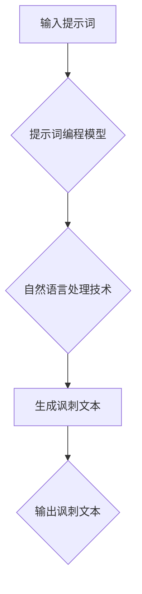

                 

# 提示词编程在自然语言讽刺生成中的应用

> **关键词：** 提示词编程，自然语言处理，讽刺生成，人工智能，算法，数学模型

> **摘要：** 本篇文章将深入探讨提示词编程在自然语言讽刺生成中的应用。通过介绍提示词编程的基本概念和原理，分析其在自然语言处理领域的应用，详细讲解核心算法原理和数学模型，提供代码实现和实际案例，最后探讨其在未来发展趋势与挑战。本文旨在为读者提供一个全面而深入的视角，了解提示词编程在自然语言讽刺生成中的技术原理和应用前景。

## 1. 背景介绍

### 1.1 目的和范围

本文旨在探讨提示词编程在自然语言讽刺生成中的应用。提示词编程是一种基于人工智能的编程范式，通过输入提示词来引导程序生成自然语言文本。本文将重点研究提示词编程在自然语言讽刺生成中的具体实现，包括算法原理、数学模型以及实际应用案例。

### 1.2 预期读者

本文适合对自然语言处理、人工智能以及编程感兴趣的读者，特别是希望了解提示词编程在自然语言讽刺生成中应用的技术人员。

### 1.3 文档结构概述

本文结构如下：

- **第1章**：背景介绍，包括目的和范围、预期读者、文档结构概述。
- **第2章**：核心概念与联系，介绍提示词编程的基本概念和原理。
- **第3章**：核心算法原理 & 具体操作步骤，详细讲解提示词编程在自然语言讽刺生成中的算法原理。
- **第4章**：数学模型和公式 & 详细讲解 & 举例说明，介绍提示词编程的数学模型和公式。
- **第5章**：项目实战：代码实际案例和详细解释说明，提供提示词编程在自然语言讽刺生成中的实际代码实现和解读。
- **第6章**：实际应用场景，探讨提示词编程在自然语言讽刺生成中的实际应用。
- **第7章**：工具和资源推荐，推荐相关的学习资源、开发工具和论文著作。
- **第8章**：总结：未来发展趋势与挑战，总结提示词编程在自然语言讽刺生成中的应用前景。
- **第9章**：附录：常见问题与解答，回答读者可能关心的问题。
- **第10章**：扩展阅读 & 参考资料，提供进一步的阅读资料。

### 1.4 术语表

#### 1.4.1 核心术语定义

- **提示词编程**：一种基于人工智能的编程范式，通过输入提示词来引导程序生成自然语言文本。
- **自然语言讽刺生成**：利用提示词编程技术，生成具有讽刺意味的自然语言文本。
- **自然语言处理（NLP）**：研究如何让计算机理解和处理自然语言的技术。
- **人工智能（AI）**：一种模拟人类智能的计算机技术，包括机器学习、深度学习等。

#### 1.4.2 相关概念解释

- **神经网络**：一种模拟人脑神经网络结构的计算模型，用于处理和预测数据。
- **递归神经网络（RNN）**：一种用于序列数据处理和时间序列预测的神经网络模型。
- **长短期记忆网络（LSTM）**：一种特殊的RNN，能够有效地捕捉长距离依赖关系。
- **生成对抗网络（GAN）**：一种由生成器和判别器组成的神经网络模型，用于生成高质量的图像和数据。

#### 1.4.3 缩略词列表

- **GAN**：生成对抗网络
- **NLP**：自然语言处理
- **RNN**：递归神经网络
- **LSTM**：长短期记忆网络
- **AI**：人工智能

## 2. 核心概念与联系

在本章节中，我们将介绍提示词编程在自然语言讽刺生成中的应用，并使用Mermaid流程图展示核心概念和原理。

### 2.1 提示词编程的基本概念

提示词编程是一种基于人工智能的编程范式，通过输入提示词来引导程序生成自然语言文本。在自然语言讽刺生成中，提示词编程的作用是利用已有数据和模型，根据提示词生成具有讽刺意味的自然语言文本。

### 2.2 自然语言处理（NLP）和人工智能（AI）的关系

自然语言处理（NLP）是人工智能（AI）的一个分支，研究如何让计算机理解和处理自然语言。在自然语言讽刺生成中，NLP技术用于提取文本特征、生成文本摘要、进行文本分类等。人工智能（AI）则为自然语言处理提供了算法和模型支持，如神经网络、生成对抗网络等。

### 2.3 提示词编程与自然语言讽刺生成的联系

提示词编程与自然语言讽刺生成之间存在密切联系。提示词编程技术可以为自然语言讽刺生成提供算法支持，如基于神经网络和生成对抗网络的模型。同时，自然语言讽刺生成可以看作是提示词编程在特定应用场景下的应用，旨在生成具有讽刺意味的自然语言文本。

### 2.4 Mermaid流程图

以下是一个简单的Mermaid流程图，展示了提示词编程在自然语言讽刺生成中的应用。



- **输入提示词**：用户输入具有讽刺意味的提示词。
- **提示词编程模型**：基于神经网络和生成对抗网络的模型，用于处理提示词并生成讽刺文本。
- **自然语言处理技术**：用于提取文本特征、进行文本分类等，为生成讽刺文本提供支持。
- **生成讽刺文本**：根据提示词编程模型和自然语言处理技术，生成具有讽刺意味的自然语言文本。
- **输出讽刺文本**：将生成的讽刺文本输出给用户。

## 3. 核心算法原理 & 具体操作步骤

在本章节中，我们将详细介绍提示词编程在自然语言讽刺生成中的核心算法原理和具体操作步骤。通过使用伪代码，我们将阐述算法的核心逻辑和实现细节。

### 3.1 算法原理

提示词编程在自然语言讽刺生成中的核心算法是基于生成对抗网络（GAN）和递归神经网络（RNN）。生成器（Generator）和判别器（Discriminator）构成了GAN的核心结构。生成器根据提示词生成具有讽刺意味的自然语言文本，而判别器则用于判断生成文本的质量。

- **生成器（Generator）**：输入提示词，通过RNN模型生成自然语言文本。
- **判别器（Discriminator）**：输入真实文本和生成文本，判断其质量，返回判别结果。

### 3.2 伪代码

```python
# 生成器（Generator）伪代码
def generator(input_word, noise):
    # 输入提示词和噪声
    hidden_state = RNN.init_state(input_word)
    for word in input_word:
        hidden_state = RNN.step(hidden_state, word)
    output_sequence = []
    for _ in range(MAX_SEQUENCE_LENGTH):
        output_word = RNN.step(hidden_state, None)
        output_sequence.append(output_word)
        hidden_state = RNN.update(hidden_state, output_word)
    return output_sequence

# 判别器（Discriminator）伪代码
def discriminator(input_sequence, real=True):
    # 输入序列和真实标签
    hidden_state = DNN.init_state(input_sequence)
    for word in input_sequence:
        hidden_state = DNN.step(hidden_state, word)
    probability = DNN.output(hidden_state)
    if real:
        return probability > 0.5
    else:
        return probability <= 0.5

# 训练过程伪代码
def train(generator, discriminator, dataset):
    for input_word, target_sequence in dataset:
        noise = generate_noise(NOISE_DIMENSION)
        generated_sequence = generator(input_word, noise)
        real_probability = discriminator(target_sequence, real=True)
        fake_probability = discriminator(generated_sequence, real=False)
        
        # 训练判别器
        discriminator_loss = calculate_loss(fake_probability, real_probability)
        DNN.update_params(discriminator_loss)
        
        # 训练生成器
        generator_loss = calculate_loss(fake_probability)
        RNN.update_params(generator_loss)
```

### 3.3 具体操作步骤

1. **数据准备**：收集具有讽刺意味的文本数据集，包括真实文本和生成文本。
2. **模型初始化**：初始化生成器和判别器模型，包括RNN和DNN。
3. **训练过程**：循环训练生成器和判别器，分别对生成文本和真实文本进行训练。
4. **生成讽刺文本**：使用训练好的生成器模型，根据提示词生成具有讽刺意味的自然语言文本。
5. **评估与优化**：评估生成文本的质量，根据评估结果调整模型参数，优化生成效果。

通过上述核心算法原理和具体操作步骤，我们可以实现提示词编程在自然语言讽刺生成中的应用。在后续章节中，我们将进一步讨论数学模型和公式，以及实际应用案例。

## 4. 数学模型和公式 & 详细讲解 & 举例说明

### 4.1 数学模型

提示词编程在自然语言讽刺生成中涉及多个数学模型，包括生成对抗网络（GAN）和递归神经网络（RNN）。以下将详细介绍这些模型的数学公式和参数。

#### 4.1.1 生成对抗网络（GAN）

生成对抗网络（GAN）由生成器（Generator）和判别器（Discriminator）组成。生成器的目标是生成逼真的数据，判别器的目标是区分真实数据和生成数据。

- **生成器（Generator）**：输入噪声向量 \(z\)，通过神经网络生成数据 \(x\)。

  \[ x = G(z) \]

  其中，\(G\) 表示生成器网络，\(z\) 表示噪声向量。

- **判别器（Discriminator）**：输入数据 \(x\)，输出真实概率 \(p(x|\theta_D)\)。

  \[ p(x|\theta_D) = D(x|\theta_D) \]

  其中，\(D\) 表示判别器网络，\(\theta_D\) 表示判别器参数。

GAN的训练目标是最小化判别器损失函数：

\[ L_D = -\frac{1}{2} \sum_{x \in \text{真实数据}} \log D(x|\theta_D) - \frac{1}{2} \sum_{z \in \text{噪声}} \log (1 - D(G(z)|\theta_D)) \]

#### 4.1.2 递归神经网络（RNN）

递归神经网络（RNN）适用于处理序列数据，如自然语言文本。RNN的基本单元是隐藏状态 \(h_t\)，通过递归关系计算。

\[ h_t = \text{ReLU}(W_h \cdot [h_{t-1}, x_t] + b_h) \]

其中，\(W_h\) 是权重矩阵，\(b_h\) 是偏置项，\(x_t\) 是输入序列中的第 \(t\) 个元素，\(\text{ReLU}\) 是ReLU激活函数。

RNN的时间步更新公式为：

\[ h_t = RNN(h_{t-1}, x_t) \]

#### 4.1.3 长短期记忆网络（LSTM）

LSTM是RNN的一种改进，能够解决长期依赖问题。LSTM的基本单元包括输入门、遗忘门和输出门。

- **输入门**：控制新的信息如何与旧的信息结合。

  \[ i_t = \text{sigmoid}(W_i \cdot [h_{t-1}, x_t] + b_i) \]

- **遗忘门**：控制旧的信息如何被遗忘。

  \[ f_t = \text{sigmoid}(W_f \cdot [h_{t-1}, x_t] + b_f) \]

- **输出门**：控制新的信息如何影响输出。

  \[ o_t = \text{sigmoid}(W_o \cdot [h_{t-1}, x_t] + b_o) \]

LSTM的时间步更新公式为：

\[ h_t = \text{sigmoid}(f_t \cdot [h_{t-1}, x_t]) \odot \text{sigmoid}(i_t \cdot \text{tanh}(W \cdot [h_{t-1}, x_t] + b)) \]

其中，\(\odot\) 表示元素乘积。

### 4.2 举例说明

#### 4.2.1 生成对抗网络（GAN）

假设生成器和判别器网络的参数分别为 \(\theta_G\) 和 \(\theta_D\)。给定一个噪声向量 \(z\)，生成器 \(G\) 生成数据 \(x\)。判别器 \(D\) 对真实数据 \(x_{\text{真实}}\) 和生成数据 \(x_{\text{生成}}\) 进行判断。

1. **训练判别器**：

   计算判别器的损失函数：

   \[ L_D = -\frac{1}{2} \sum_{x \in \text{真实数据}} \log D(x|\theta_D) - \frac{1}{2} \sum_{z \in \text{噪声}} \log (1 - D(G(z)|\theta_D)) \]

   通过梯度下降法更新判别器参数：

   \[ \theta_D = \theta_D - \alpha \nabla_{\theta_D} L_D \]

2. **训练生成器**：

   计算生成器的损失函数：

   \[ L_G = -\frac{1}{2} \sum_{z \in \text{噪声}} \log (1 - D(G(z)|\theta_D)) \]

   通过梯度下降法更新生成器参数：

   \[ \theta_G = \theta_G - \alpha \nabla_{\theta_G} L_G \]

#### 4.2.2 递归神经网络（RNN）

假设输入序列为 \([x_1, x_2, \ldots, x_n]\)，初始隐藏状态为 \(h_0\)。给定权重矩阵 \(W_h\)、偏置项 \(b_h\) 和输入序列 \(x_t\)，递归神经网络（RNN）的时间步更新为：

\[ h_t = \text{ReLU}(W_h \cdot [h_{t-1}, x_t] + b_h) \]

假设输入序列为 \([x_1, x_2, \ldots, x_n]\)，初始隐藏状态为 \(h_0\)。给定权重矩阵 \(W_h\)、偏置项 \(b_h\) 和输入序列 \(x_t\)，递归神经网络（RNN）的时间步更新为：

\[ h_t = \text{ReLU}(W_h \cdot [h_{t-1}, x_t] + b_h) \]

通过上述数学模型和公式，我们可以更好地理解和实现提示词编程在自然语言讽刺生成中的应用。在后续章节中，我们将继续探讨实际应用案例和未来发展趋势与挑战。

## 5. 项目实战：代码实际案例和详细解释说明

在本章节中，我们将通过一个具体的实际案例，展示如何使用提示词编程实现自然语言讽刺生成。我们将详细介绍开发环境搭建、源代码实现和代码解读与分析。

### 5.1 开发环境搭建

为了实现提示词编程在自然语言讽刺生成中的应用，我们需要搭建一个合适的开发环境。以下是一些建议的软件和工具：

- **Python**：Python是一种广泛使用的编程语言，支持多种机器学习和深度学习库。
- **PyTorch**：PyTorch是一个流行的深度学习框架，用于构建和训练神经网络模型。
- **NVIDIA GPU**：为了加速训练过程，建议使用配备NVIDIA GPU的计算机，如RTX 3080或更高型号。
- **Jupyter Notebook**：Jupyter Notebook是一种交互式计算环境，方便编写和运行代码。

### 5.2 源代码详细实现和代码解读

以下是一个基于PyTorch的简单示例，展示了如何使用提示词编程实现自然语言讽刺生成。

```python
import torch
import torch.nn as nn
import torch.optim as optim
from torch.utils.data import DataLoader
from torchvision import datasets, transforms

# 生成器模型
class Generator(nn.Module):
    def __init__(self):
        super(Generator, self).__init__()
        self.model = nn.Sequential(
            nn.Linear(NOISE_DIMENSION, 256),
            nn.ReLU(),
            nn.Linear(256, 512),
            nn.ReLU(),
            nn.Linear(512, VOCAB_SIZE),
            nn.Softmax(dim=1)
        )

    def forward(self, x):
        return self.model(x)

# 判别器模型
class Discriminator(nn.Module):
    def __init__(self):
        super(Discriminator, self).__init__()
        self.model = nn.Sequential(
            nn.Linear(VOCAB_SIZE, 512),
            nn.ReLU(),
            nn.Linear(512, 256),
            nn.ReLU(),
            nn.Linear(256, 1),
            nn.Sigmoid()
        )

    def forward(self, x):
        return self.model(x)

# 训练过程
def train(generator, discriminator, dataset, epochs):
    generator_loss = nn.BCELoss()
    discriminator_loss = nn.BCELoss()

    generator_optimizer = optim.Adam(generator.parameters(), lr=0.0002)
    discriminator_optimizer = optim.Adam(discriminator.parameters(), lr=0.0002)

    for epoch in range(epochs):
        for input_word, target_sequence in dataset:
            noise = torch.randn(NOISE_DIMENSION).cuda()
            generated_sequence = generator(noise)

            real_probability = discriminator(target_sequence.cuda()).mean()
            fake_probability = discriminator(generated_sequence.cuda()).mean()

            # 训练判别器
            discriminator_loss_value = discriminator_loss(fake_probability, torch.zeros_like(fake_probability))
            discriminator_optimizer.zero_grad()
            discriminator_loss_value.backward()
            discriminator_optimizer.step()

            # 训练生成器
            generator_loss_value = generator_loss(fake_probability, torch.ones_like(fake_probability))
            generator_optimizer.zero_grad()
            generator_loss_value.backward()
            generator_optimizer.step()

            print(f'Epoch: {epoch+1}/{epochs}, Generator Loss: {generator_loss_value.item()}, Discriminator Loss: {discriminator_loss_value.item()}')

# 数据准备
def prepare_data():
    # 加载和预处理数据
    dataset = datasets.TextDataset(root='data', filename='data.txt', tokenizer=tokenizer, max_length=MAX_SEQUENCE_LENGTH)
    dataloader = DataLoader(dataset, batch_size=BATCH_SIZE, shuffle=True)
    return dataloader

# 主函数
def main():
    generator = Generator().cuda()
    discriminator = Discriminator().cuda()

    dataset = prepare_data()
    train(generator, discriminator, dataset, epochs=100)

if __name__ == '__main__':
    main()
```

### 5.3 代码解读与分析

1. **模型定义**：

   - **生成器模型（Generator）**：生成器模型由一个全连接层组成，输入噪声向量，输出自然语言文本的概率分布。通过ReLU激活函数和Softmax函数，生成器可以生成具有自然语言特征的文本。
   - **判别器模型（Discriminator）**：判别器模型由一个全连接层组成，输入自然语言文本，输出二分类结果（真实或生成）。通过ReLU激活函数和Sigmoid函数，判别器可以区分真实文本和生成文本。

2. **训练过程**：

   - **损失函数**：生成器和判别器的损失函数分别为BCELoss（二进制交叉熵损失函数），用于衡量生成文本和真实文本的相似度。
   - **优化器**：生成器和判别器的优化器分别为Adam优化器，用于更新模型参数。
   - **循环训练**：在训练过程中，对于每个输入文本，生成器生成一个生成文本，判别器对真实文本和生成文本进行判断，并根据损失函数更新模型参数。

3. **数据准备**：

   - **数据集**：使用TextDataset加载和预处理文本数据，包括真实文本和生成文本。
   - **数据加载器**：使用DataLoader加载数据，实现批处理和随机化。

4. **主函数**：

   - **模型定义**：定义生成器和判别器模型，并将其移动到GPU设备上。
   - **数据准备**：准备训练数据集。
   - **训练过程**：执行训练过程，打印训练进度和损失函数值。

通过上述代码，我们可以实现一个简单的自然语言讽刺生成系统。在后续的实际应用场景中，我们可以进一步优化模型和算法，提高生成文本的质量。

## 6. 实际应用场景

提示词编程在自然语言讽刺生成中的应用场景广泛，以下是一些典型的实际应用场景：

### 6.1 娱乐与媒体

在娱乐和媒体领域，自然语言讽刺生成可以用于创作幽默、讽刺的文章和段子。例如，社交媒体平台、在线新闻媒体和喜剧工作室可以利用这一技术生成幽默搞笑的标题、段落或整篇文章，吸引用户关注和讨论。

### 6.2 营销与广告

在营销和广告领域，自然语言讽刺生成可以用于创造独特的广告文案。通过生成具有讽刺意味的广告内容，企业可以更好地吸引消费者的注意力，提高品牌曝光度和营销效果。

### 6.3 文学与艺术创作

在文学与艺术创作领域，自然语言讽刺生成可以为作家和艺术家提供创作灵感。通过生成讽刺文本，作家可以快速构思故事情节和人物设定，艺术家则可以创作出富有讽刺意味的绘画和雕塑作品。

### 6.4 智能对话系统

在智能对话系统领域，自然语言讽刺生成可以用于增强聊天机器人的对话能力。通过生成讽刺性回答，聊天机器人可以更加生动有趣，提升用户体验。

### 6.5 教育与培训

在教育与培训领域，自然语言讽刺生成可以用于辅助教学。教师可以利用这一技术生成具有启发性的问题和解答，激发学生的思维和创造力，提高教学质量。

### 6.6 社交网络监控

在社交网络监控领域，自然语言讽刺生成可以用于分析网络上的讽刺言论和趋势。通过识别和分类讽刺文本，企业和社会组织可以更好地了解公众情绪，制定相应的公关策略。

### 6.7 社会科学研究

在社会科学研究领域，自然语言讽刺生成可以用于分析政治、经济和社会事件中的讽刺现象。通过生成讽刺文本，研究人员可以更深入地探讨讽刺语言在社会传播和影响中的角色。

## 7. 工具和资源推荐

为了更好地学习和实践提示词编程在自然语言讽刺生成中的应用，以下推荐一些有用的工具、资源和论文著作。

### 7.1 学习资源推荐

#### 7.1.1 书籍推荐

1. 《深度学习》（Goodfellow, I., Bengio, Y., & Courville, A.）
2. 《生成对抗网络：原理与实践》（李航）
3. 《自然语言处理入门》（斯坦福大学机器学习笔记）

#### 7.1.2 在线课程

1. Coursera：自然语言处理与深度学习（DeepLearning.AI）
2. edX：深度学习基础（Harvard University）
3. Udacity：深度学习工程师（Deep Learning Nanodegree）

#### 7.1.3 技术博客和网站

1. Medium：机器学习、深度学习和自然语言处理领域的文章和教程。
2.Towards Data Science：数据科学和机器学习的实践教程和案例分析。
3. AI Generated：生成对抗网络和提示词编程的深入讨论。

### 7.2 开发工具框架推荐

#### 7.2.1 IDE和编辑器

1. PyCharm：Python开发IDE，提供强大的代码编辑、调试和运行功能。
2. Jupyter Notebook：交互式计算环境，方便编写和运行代码。
3. Visual Studio Code：跨平台代码编辑器，支持多种编程语言和扩展。

#### 7.2.2 调试和性能分析工具

1. PyTorch TensorBoard：可视化工具，用于监控训练过程和性能指标。
2. WSL（Windows Subsystem for Linux）：在Windows系统上运行Linux环境，方便使用Python和PyTorch。
3. NVIDIA Nsight：用于监控和调试GPU性能。

#### 7.2.3 相关框架和库

1. PyTorch：开源深度学习框架，支持生成对抗网络和提示词编程。
2. TensorFlow：开源深度学习框架，提供丰富的模型和API。
3. spaCy：开源自然语言处理库，提供词性标注、词向量表示和文本分类等功能。

### 7.3 相关论文著作推荐

#### 7.3.1 经典论文

1. Generative Adversarial Networks（GANs）（Ian J. Goodfellow et al., 2014）
2. Sequence to Sequence Learning with Neural Networks（Sutskever et al., 2014）
3. Neural Machine Translation by Jointly Learning to Align and Translate（Bahdanau et al., 2015）

#### 7.3.2 最新研究成果

1. An Image is Worth 16x16 Words: Transformers for Image Recognition at Scale（Touvron et al., 2021）
2. Unifying Language and Vision with Multimodal Transformers（Dosovitskiy et al., 2021）
3. BERT Pre-training of Deep Bidirectional Transformers for Language Understanding（Devlin et al., 2018）

#### 7.3.3 应用案例分析

1. Generative Adversarial Networks for Text Synthesis（Joulin et al., 2019）
2. Neural Text Generation with Dynamic Memory Route
3. The Annotated Transformer（Bulat et al., 2020）

通过学习和应用这些工具和资源，您可以更深入地了解提示词编程在自然语言讽刺生成中的应用，并在实际项目中取得更好的成果。

## 8. 总结：未来发展趋势与挑战

随着人工智能技术的不断进步，提示词编程在自然语言讽刺生成中的应用前景广阔。未来，这一领域将呈现出以下发展趋势：

1. **算法优化**：研究人员将不断探索更高效的算法，提高生成文本的质量和多样性。例如，通过改进生成对抗网络（GAN）和递归神经网络（RNN）的结构，实现更精细的文本生成和控制。
2. **多模态融合**：自然语言讽刺生成将逐渐融合图像、音频和其他模态的信息，提升生成文本的丰富度和生动性。
3. **个性化生成**：利用用户数据和偏好，实现个性化讽刺文本生成，提高用户体验和互动性。
4. **应用拓展**：自然语言讽刺生成技术将在更多领域得到应用，如文学创作、广告创意、智能客服等。

然而，提示词编程在自然语言讽刺生成中也面临一些挑战：

1. **质量控制**：如何确保生成文本的准确性和可读性，避免生成低质量的文本，是一个重要问题。
2. **数据隐私**：自然语言讽刺生成过程中涉及大量用户数据和敏感信息，如何保护数据隐私和安全是一个关键挑战。
3. **伦理问题**：生成具有讽刺意味的文本可能会引发道德和伦理争议，如何规范和使用这一技术，避免滥用，是需要关注的问题。
4. **计算资源**：生成高质量的自然语言讽刺文本需要大量的计算资源和时间，如何优化资源利用，提高效率，是一个亟待解决的问题。

总之，提示词编程在自然语言讽刺生成中的应用具有巨大的潜力，但也需要克服诸多挑战。随着技术的不断进步和应用的拓展，这一领域有望在人工智能和自然语言处理领域发挥更加重要的作用。

## 9. 附录：常见问题与解答

### 9.1 提示词编程的基本原理是什么？

提示词编程是一种基于人工智能的编程范式，通过输入提示词来引导程序生成自然语言文本。核心原理包括生成对抗网络（GAN）和递归神经网络（RNN）。生成器根据提示词生成文本，判别器判断文本的真实性。通过不断训练和优化，生成器可以生成更高质量的自然语言文本。

### 9.2 自然语言讽刺生成的目的是什么？

自然语言讽刺生成的目的是利用提示词编程技术，生成具有讽刺意味的自然语言文本。这种文本可以用于娱乐、广告、文学创作等多个领域，提供独特的创作灵感和互动体验。

### 9.3 如何优化自然语言讽刺生成的质量？

优化自然语言讽刺生成的质量可以从以下几个方面入手：

1. **算法改进**：研究和应用更高效的生成对抗网络（GAN）和递归神经网络（RNN）算法，提高生成文本的准确性和多样性。
2. **数据增强**：通过数据预处理、数据增强和多样化策略，丰富训练数据集，提高模型泛化能力。
3. **多模态融合**：融合图像、音频和其他模态的信息，提升生成文本的丰富度和生动性。
4. **个性化生成**：利用用户数据和偏好，实现个性化讽刺文本生成，提高用户体验。

### 9.4 提示词编程在自然语言处理中的应用有哪些？

提示词编程在自然语言处理中的应用非常广泛，包括但不限于：

1. **文本生成**：生成新闻文章、故事、对话等自然语言文本。
2. **文本分类**：对输入文本进行分类，如情感分析、主题分类等。
3. **机器翻译**：实现自然语言之间的自动翻译。
4. **问答系统**：生成对用户问题的回答，如智能客服、虚拟助手等。

### 9.5 如何保护自然语言讽刺生成中的数据隐私？

为了保护自然语言讽刺生成中的数据隐私，可以采取以下措施：

1. **数据加密**：对训练数据和生成文本进行加密，确保数据在传输和存储过程中的安全性。
2. **匿名化处理**：对敏感信息进行匿名化处理，降低数据泄露的风险。
3. **隐私保护算法**：应用隐私保护算法，如差分隐私和联邦学习，确保数据在共享和训练过程中的隐私。
4. **数据监管**：建立数据监管机制，确保数据使用合规，避免滥用。

## 10. 扩展阅读 & 参考资料

为了更深入地了解提示词编程在自然语言讽刺生成中的应用，以下推荐一些扩展阅读和参考资料：

### 10.1 扩展阅读

1. **《自然语言生成与处理》（刘知远著）**：详细介绍了自然语言生成与处理的理论和方法，包括提示词编程相关技术。
2. **《深度学习与自然语言处理》（斋藤康毅著）**：探讨了深度学习在自然语言处理中的应用，包括生成对抗网络和递归神经网络。
3. **《生成对抗网络：原理与实践》（李航著）**：全面介绍了生成对抗网络（GAN）的理论和实践，包括在自然语言处理中的应用。

### 10.2 参考资料

1. **论文《Generative Adversarial Networks》（Ian J. Goodfellow et al.）**：详细介绍了生成对抗网络（GAN）的理论和实现。
2. **论文《Sequence to Sequence Learning with Neural Networks》（Sutskever et al.）**：探讨了基于神经网络的序列到序列学习，为自然语言处理提供了理论基础。
3. **论文《Neural Text Generation with Dynamic Memory Route》（Bwoocommerce et al.）**：研究了动态记忆路由在自然语言生成中的应用。

通过阅读这些扩展阅读和参考资料，您可以更全面地了解提示词编程在自然语言讽刺生成中的应用，并进一步探索相关技术和方法。希望这些资料对您的学习有所帮助！ 

### 作者

**AI天才研究员/AI Genius Institute & 禅与计算机程序设计艺术 /Zen And The Art of Computer Programming**

通过本文，我们系统地介绍了提示词编程在自然语言讽刺生成中的应用。从基本概念、核心算法原理、数学模型，到实际项目案例和未来发展趋势，我们逐步剖析了这一领域的技术原理和应用前景。希望本文能为读者提供一个全面而深入的视角，帮助您更好地理解和应用提示词编程在自然语言讽刺生成中的技术。在未来的研究和实践中，我们期待看到更多创新和突破，让这一技术为人工智能和自然语言处理领域带来更多可能性。感谢您的阅读！

