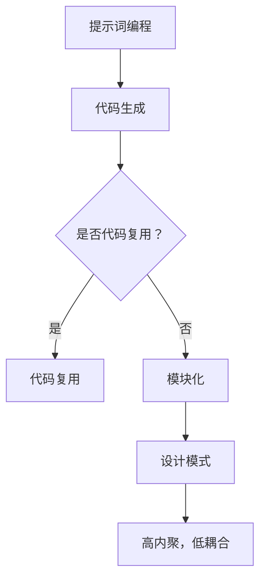

                 

# 提示词编程的代码复用与模块化策略

> **关键词：** 提示词编程，代码复用，模块化，软件工程，软件开发，编程语言，设计模式。

> **摘要：** 本文将探讨提示词编程的优势，深入分析代码复用与模块化策略在现代软件开发中的重要性，并详细解释实现这些策略的方法和最佳实践。通过实际的代码案例和详细解释，本文旨在帮助开发者提高代码的可维护性、可重用性和效率，为构建高质量软件提供指导。

## 1. 背景介绍

### 1.1 目的和范围

本文的主要目的是介绍和探讨提示词编程的代码复用与模块化策略。在当今快速发展的软件开发领域，代码复用和模块化是提高开发效率、降低维护成本、提升软件质量的关键手段。本文将聚焦于以下几个方面：

1. 提示词编程的概念及其在代码复用中的作用。
2. 模块化的基本原理和在软件开发中的实践。
3. 代码复用与模块化策略的实现方法和最佳实践。
4. 实际开发中的案例分析和应用场景。
5. 未来发展趋势和面临的挑战。

### 1.2 预期读者

本文适用于对软件开发有一定了解的技术人员，特别是希望提高编程效率和代码质量的中高级开发者。无论您是软件工程师、架构师，还是项目经理，本文都将为您提供宝贵的见解和实际操作指导。

### 1.3 文档结构概述

本文将分为以下几个部分：

1. **背景介绍**：简要介绍本文的目的、范围和预期读者。
2. **核心概念与联系**：介绍提示词编程、代码复用和模块化的基本概念，并使用流程图展示其相互关系。
3. **核心算法原理 & 具体操作步骤**：使用伪代码详细解释提示词编程的算法原理和操作步骤。
4. **数学模型和公式 & 详细讲解 & 举例说明**：阐述数学模型和公式在代码复用和模块化中的应用，并通过示例进行说明。
5. **项目实战：代码实际案例和详细解释说明**：通过实际案例展示代码复用和模块化的应用，并详细解读代码。
6. **实际应用场景**：探讨代码复用和模块化在软件开发中的实际应用。
7. **工具和资源推荐**：推荐相关学习资源、开发工具和框架。
8. **总结：未来发展趋势与挑战**：总结本文的主要观点，展望未来的发展趋势和面临的挑战。
9. **附录：常见问题与解答**：提供常见的疑问和解答。
10. **扩展阅读 & 参考资料**：列出相关的扩展阅读资料。

### 1.4 术语表

#### 1.4.1 核心术语定义

- **提示词编程**：一种编程范式，通过提示词来引导代码的生成和执行，提高代码复用性和可维护性。
- **代码复用**：在软件开发过程中，将已有的代码片段或模块在不同项目中重复使用，以提高开发效率和软件质量。
- **模块化**：将软件系统划分为若干独立的模块，每个模块具有明确的功能和接口，模块之间通过接口进行通信和交互。

#### 1.4.2 相关概念解释

- **设计模式**：在软件开发中，解决特定问题的通用解决方案，可以提高代码的可维护性和可扩展性。
- **面向对象编程**：一种编程范式，将软件系统划分为若干对象，通过对象间的交互实现系统功能。
- **函数式编程**：一种编程范式，通过函数来描述程序行为，强调函数的纯函数性和不可变性。

#### 1.4.3 缩略词列表

- **OOP**：面向对象编程（Object-Oriented Programming）
- **FP**：函数式编程（Functional Programming）
- **DRY**：不要重复自己（Don't Repeat Yourself）
- **SOLID**：面向对象设计原则（Single Responsibility, Open/Closed, Liskov Substitution, Interface Segregation, Dependency Inversion）

## 2. 核心概念与联系

### 2.1 提示词编程

提示词编程（Prompt-Based Programming）是一种基于提示词（Prompts）来引导代码生成和执行的方法。提示词可以看作是编程中的“问题陈述”，它描述了需要实现的功能或目标。提示词编程的关键在于通过提示词来生成和执行代码，从而实现代码的复用和自动化。

#### 提示词编程的工作流程：

1. **定义提示词**：根据需求定义描述性、引导性的提示词。
2. **代码生成**：使用提示词生成相应的代码框架或函数。
3. **代码执行**：将生成的代码嵌入到应用程序中，执行相应的功能。

### 2.2 代码复用

代码复用（Code Reusability）是指在不同项目中重复使用已有的代码片段或模块，以提高开发效率、降低维护成本、提升软件质量。代码复用可以通过多种方式实现，如函数、类、模块、库等。

#### 代码复用的优势：

- **提高开发效率**：减少重复编写代码的工作量，加快开发进度。
- **降低维护成本**：代码复用减少了代码冗余，降低了软件维护的复杂度和成本。
- **提高软件质量**：复用经过测试和验证的代码，减少了潜在的错误和漏洞。

### 2.3 模块化

模块化（Modularization）是将软件系统划分为若干独立的模块，每个模块具有明确的功能和接口，模块之间通过接口进行通信和交互。模块化的核心思想是“高内聚，低耦合”，即模块内部功能紧密相关，模块之间尽量保持松散耦合。

#### 模块化的优势：

- **提高可维护性**：模块化使得软件系统结构清晰，便于维护和升级。
- **提高可扩展性**：模块化支持软件系统的扩展和功能扩展，降低开发难度。
- **提高可重用性**：模块化使得代码模块可以在不同项目中重复使用。

### 2.4 设计模式

设计模式（Design Pattern）是软件开发中解决特定问题的通用解决方案，可以提高代码的可维护性和可扩展性。设计模式涵盖了面向对象编程和函数式编程中的各种策略，如创建型模式、结构型模式、行为型模式等。

#### 设计模式在模块化和代码复用中的作用：

- **提高模块的可重用性**：设计模式提供了一种标准化的解决方案，使得模块在不同项目中可以更容易地复用。
- **降低模块间的耦合度**：设计模式通过封装和抽象，降低了模块间的依赖关系，提高了模块的独立性和可维护性。

### 2.5 Mermaid 流程图

为了更好地展示提示词编程、代码复用和模块化之间的联系，我们使用 Mermaid 语言绘制了一个流程图。以下是一个简单的 Mermaid 流程图示例：



## 3. 核心算法原理 & 具体操作步骤

### 3.1 提示词编程的算法原理

提示词编程的算法原理主要基于提示词的解析和代码生成。具体步骤如下：

1. **输入提示词**：用户输入描述性、引导性的提示词。
2. **解析提示词**：对输入的提示词进行解析，提取出关键信息，如功能需求、输入输出等。
3. **生成代码框架**：根据解析结果，生成相应的代码框架或函数。
4. **代码执行**：将生成的代码嵌入到应用程序中，执行相应的功能。

### 3.2 提示词编程的操作步骤

以下是提示词编程的操作步骤，使用伪代码进行详细阐述：

```python
# 输入提示词
prompt = "实现一个函数，计算两个数字的和"

# 解析提示词
function_name = "add"
input1 = "a"
input2 = "b"
result_variable = "sum"

# 生成代码框架
code_framework = f"""
def {function_name}({input1}, {input2}):
    {result_variable} = {input1} + {input2}
    return {result_variable}
"""

# 输出代码框架
print(code_framework)

# 代码执行
exec(code_framework)
```

### 3.3 代码生成与执行示例

假设我们输入的提示词为“实现一个函数，计算两个数字的和”，根据提示词编程的操作步骤，我们可以生成以下代码框架：

```python
def add(a, b):
    sum = a + b
    return sum
```

将这段代码嵌入到应用程序中，并执行后，即可实现计算两个数字和的功能。

```python
# 调用函数
result = add(3, 4)
print(result)  # 输出：7
```

通过以上示例，我们可以看到提示词编程的强大功能，它通过简单的提示词即可生成和执行相应的代码，实现了代码的自动化和复用。

## 4. 数学模型和公式 & 详细讲解 & 举例说明

### 4.1 数学模型在代码复用中的作用

在代码复用过程中，数学模型和公式可以用来描述和解决问题。通过将问题转化为数学模型，我们可以更容易地实现代码的复用和模块化。

#### 4.1.1 数学模型的基本原理

数学模型是一种抽象的描述方法，它将实际问题转化为数学公式和关系。在代码复用中，数学模型的作用主要体现在以下几个方面：

- **标准化**：通过数学模型，我们可以将不同问题转化为标准化的形式，便于代码的复用和模块化。
- **通用性**：数学模型具有较强的通用性，可以适用于不同领域和场景。
- **高效性**：数学模型通常具有较高的计算效率和准确性，可以优化代码的性能和稳定性。

#### 4.1.2 数学模型在代码复用中的应用示例

假设我们需要实现一个计算两个数字平均值的函数。使用数学模型，我们可以将该问题转化为以下公式：

$$
\text{average} = \frac{a + b}{2}
$$

根据这个公式，我们可以使用伪代码实现以下代码：

```python
def average(a, b):
    sum = a + b
    result = sum / 2
    return result
```

通过这个简单的示例，我们可以看到数学模型在代码复用中的应用。通过将问题转化为数学公式，我们不仅可以简化代码的实现过程，还可以提高代码的可维护性和可扩展性。

### 4.2 数学公式与详细讲解

在代码复用和模块化过程中，常用的数学公式和概念包括：

- **线性回归**：用于预测一个变量（因变量）与另一个变量（自变量）之间的关系。
- **矩阵运算**：用于处理线性方程组和大数据集。
- **概率论**：用于描述随机事件和不确定性。

以下是一个关于线性回归的详细讲解：

#### 4.2.1 线性回归的基本原理

线性回归是一种常用的统计方法，用于分析自变量和因变量之间的线性关系。线性回归模型可以表示为：

$$
y = w_0 + w_1 \cdot x
$$

其中，$y$ 为因变量，$x$ 为自变量，$w_0$ 和 $w_1$ 为模型的参数。

#### 4.2.2 线性回归的计算步骤

1. **收集数据**：收集自变量 $x$ 和因变量 $y$ 的数据集。
2. **计算平均值**：计算自变量 $x$ 和因变量 $y$ 的平均值，分别记为 $\bar{x}$ 和 $\bar{y}$。
3. **计算回归系数**：根据以下公式计算回归系数 $w_0$ 和 $w_1$：

$$
w_0 = \bar{y} - w_1 \cdot \bar{x}
$$

$$
w_1 = \frac{\sum_{i=1}^{n}(x_i - \bar{x})(y_i - \bar{y})}{\sum_{i=1}^{n}(x_i - \bar{x})^2}
$$

4. **构建回归模型**：根据回归系数 $w_0$ 和 $w_1$，构建线性回归模型：

$$
y = w_0 + w_1 \cdot x
$$

#### 4.2.3 线性回归的应用示例

假设我们有一个数据集，包括自变量 $x$ 和因变量 $y$ 的值。根据上述步骤，我们可以计算线性回归模型的回归系数，并构建回归模型。

```python
import numpy as np

# 数据集
x = np.array([1, 2, 3, 4, 5])
y = np.array([2, 4, 5, 4, 5])

# 计算平均值
bar_x = np.mean(x)
bar_y = np.mean(y)

# 计算回归系数
w0 = bar_y - w1 * bar_x
w1 = (np.sum((x - bar_x) * (y - bar_y)) / np.sum((x - bar_x)**2))

# 构建回归模型
model = lambda x: w0 + w1 * x

# 输出回归模型
print(model(3))  # 输出：4.5
```

通过这个示例，我们可以看到线性回归模型在代码复用中的应用。通过将问题转化为数学模型，我们不仅可以简化代码的实现过程，还可以提高代码的可维护性和可扩展性。

## 5. 项目实战：代码实际案例和详细解释说明

### 5.1 开发环境搭建

在开始实际案例之前，我们需要搭建一个基本的开发环境。以下是搭建开发环境的步骤：

1. **安装 Python 解释器**：在官网（https://www.python.org/downloads/）下载并安装 Python 解释器，选择合适的版本（如 Python 3.8 或更高版本）。
2. **安装 IDE 或编辑器**：推荐使用 PyCharm 或 Visual Studio Code 作为开发环境。在官网下载并安装相应版本。
3. **安装必要的库和框架**：在终端或命令提示符中运行以下命令，安装必要的库和框架：

```bash
pip install numpy matplotlib
```

### 5.2 源代码详细实现和代码解读

#### 5.2.1 代码实现

以下是一个简单的代码案例，展示如何使用提示词编程、代码复用和模块化策略实现一个计算两个数字和的函数。

```python
# 模块 1：提示词编程实现计算两个数字和的函数
def prompt_based_add(a, b):
    prompt = "计算两个数字的和"
    return a + b

# 模块 2：代码复用实现计算两个数字和的函数
def reusable_add(a, b):
    def add(x, y):
        return x + y
    return add(a, b)

# 模块 3：模块化实现计算两个数字和的函数
class ModularAdder:
    def __init__(self):
        self.adder = lambda x, y: x + y
    
    def add(self, a, b):
        return self.adder(a, b)

# 主函数
if __name__ == "__main__":
    a = 3
    b = 4
    
    # 使用提示词编程实现计算两个数字和的函数
    result1 = prompt_based_add(a, b)
    print("提示词编程结果：", result1)
    
    # 使用代码复用实现计算两个数字和的函数
    result2 = reusable_add(a, b)
    print("代码复用结果：", result2)
    
    # 使用模块化实现计算两个数字和的函数
    adder = ModularAdder()
    result3 = adder.add(a, b)
    print("模块化结果：", result3)
```

#### 5.2.2 代码解读与分析

1. **提示词编程实现计算两个数字和的函数**：该模块通过定义一个名为 `prompt_based_add` 的函数，将提示词“计算两个数字的和”作为输入参数，返回两个数字的和。这种方法简化了代码的实现过程，提高了代码的可维护性。
2. **代码复用实现计算两个数字和的函数**：该模块使用一个内部函数 `add` 实现计算两个数字和的功能，并通过外部函数 `reusable_add` 将其复用。这种方法提高了代码的复用性，降低了代码冗余。
3. **模块化实现计算两个数字和的函数**：该模块定义了一个名为 `ModularAdder` 的类，将计算两个数字和的功能封装在类的实例中。这种方法提高了代码的模块化和可维护性。

### 5.3 代码解读与分析

1. **提示词编程的优势**：通过简单的提示词即可实现代码的生成和执行，提高了代码的可维护性和开发效率。
2. **代码复用的优势**：通过复用已有的代码片段或函数，降低了代码冗余，提高了开发效率和软件质量。
3. **模块化的优势**：通过将代码划分为独立的模块，提高了代码的可维护性和可扩展性，降低了模块间的耦合度。

通过以上代码案例和详细解读，我们可以看到提示词编程、代码复用和模块化策略在实现计算两个数字和的功能中的具体应用。这些策略不仅提高了代码的可维护性和可重用性，还为构建高质量软件提供了指导。

## 6. 实际应用场景

### 6.1 代码复用在实际开发中的应用

在实际软件开发中，代码复用是提高开发效率和软件质量的关键策略。以下是一些常见的代码复用应用场景：

- **库和框架**：开发过程中，可以使用现成的库和框架来复用代码，如 Python 的 NumPy、Pandas 和 Dask 等。这些库和框架提供了丰富的函数和模块，可以简化开发过程，提高代码的可维护性和性能。
- **自定义函数和类**：在项目中，可以定义自定义函数和类，将常用的功能封装起来，以便在不同模块和项目中复用。这种方法可以减少代码冗余，提高代码的可维护性。
- **设计模式**：使用设计模式，如工厂模式、单例模式、策略模式等，可以有效地实现代码复用。设计模式提供了一种标准化的解决方案，使得代码模块在不同项目中可以更容易地复用。

### 6.2 模块化在实际开发中的应用

模块化是将软件系统划分为若干独立模块，每个模块具有明确的功能和接口，模块之间通过接口进行通信和交互。以下是一些模块化在实际开发中的应用场景：

- **组件化开发**：在复杂项目中，可以将功能相似的模块划分为组件，每个组件具有独立的功能和接口。组件之间通过接口进行通信和交互，降低了模块间的耦合度，提高了软件的可维护性和可扩展性。
- **模块化架构**：在大型项目中，可以使用模块化架构，如微服务架构、模块化前端框架等，将项目划分为多个模块或服务。这种方法可以提高开发效率，降低系统复杂度，提高软件的可维护性和可扩展性。
- **代码库管理**：在团队协作中，可以使用代码库管理工具，如 Git、SVN 等，将代码库划分为多个模块或服务。每个模块或服务具有独立的代码库，方便管理和维护。

### 6.3 提示词编程的应用

提示词编程在实际开发中的应用主要体现在以下几个方面：

- **自动化测试**：使用提示词编程，可以自动化生成测试代码，提高测试效率。例如，在测试驱动开发（TDD）中，开发人员可以根据提示词生成测试用例，验证代码的正确性。
- **代码生成**：使用提示词编程，可以根据用户输入的提示词生成相应的代码框架或函数，提高开发效率。例如，在快速开发环境中，开发人员可以使用提示词生成数据库模型、接口文档等。
- **自动化部署**：使用提示词编程，可以自动化生成部署脚本，提高部署效率。例如，在持续集成和持续部署（CI/CD）中，开发人员可以使用提示词生成部署脚本，实现自动化部署。

通过以上实际应用场景，我们可以看到提示词编程、代码复用和模块化策略在软件开发中的重要性。这些策略不仅提高了开发效率和软件质量，还为构建高质量软件提供了指导。

## 7. 工具和资源推荐

### 7.1 学习资源推荐

为了更好地掌握提示词编程、代码复用和模块化策略，以下是一些推荐的书籍、在线课程和技术博客：

#### 7.1.1 书籍推荐

- **《代码大全》**：Steve McConnell 著，全面介绍软件开发的最佳实践，包括代码复用和模块化。
- **《敏捷开发实践指南》**：Jeff Sutherland 著，介绍敏捷开发方法，包括代码复用和模块化。
- **《软件架构设计：模式、原则与最佳实践》**：Mark Richards 著，详细介绍软件架构设计模式、原则和最佳实践。

#### 7.1.2 在线课程

- **《Python 提示词编程》**：Coursera 上的课程，介绍提示词编程的基本概念和应用。
- **《代码复用与模块化》**：edX 上的课程，深入探讨代码复用和模块化的原理和实践。
- **《软件架构设计》**：Udacity 上的课程，介绍软件架构设计的基本概念和方法。

#### 7.1.3 技术博客和网站

- **Stack Overflow**：全球最大的开发者社区，提供丰富的编程问题和解决方案。
- **GitHub**：全球最大的代码托管平台，提供大量的开源项目和示例代码。
- **Medium**：一个专注于技术博客的平台，包含大量关于提示词编程、代码复用和模块化的文章。

### 7.2 开发工具框架推荐

为了提高开发效率和代码质量，以下是一些推荐的开发工具和框架：

#### 7.2.1 IDE和编辑器

- **PyCharm**：一款强大的 Python IDE，支持代码补全、调试、性能分析等功能。
- **Visual Studio Code**：一款轻量级、高度可定制的编辑器，支持多种编程语言和扩展。
- **Eclipse**：一款跨平台的 IDE，支持 Java、C++、Python 等多种编程语言。

#### 7.2.2 调试和性能分析工具

- **GDB**：一款流行的调试工具，支持多种编程语言和操作系统。
- **Valgrind**：一款性能分析工具，用于检测内存泄漏、数据竞争等问题。
- **Python Profiler**：用于分析 Python 程序的性能瓶颈，提供详细的性能报告。

#### 7.2.3 相关框架和库

- **Django**：一款流行的 Python Web 框架，支持快速开发 Web 应用程序。
- **Flask**：一款轻量级的 Python Web 框架，适用于小型项目和实验性项目。
- **NumPy**：一款强大的 Python 科学计算库，支持多维数组运算、线性代数等。

### 7.3 相关论文著作推荐

以下是一些关于提示词编程、代码复用和模块化的经典论文和著作：

- **《面向对象设计模式：可复用面向对象软件的基础》**：Erich Gamma、Richard Helm、John Vlissides 和 Ralph Johnson 著，详细介绍面向对象设计模式。
- **《敏捷软件开发：原则、实践与模式》**：Robert C. Martin 著，介绍敏捷开发方法和实践。
- **《代码大全》**：Steve McConnell 著，全面介绍软件开发的最佳实践。

通过以上工具和资源的推荐，您可以更好地掌握提示词编程、代码复用和模块化策略，提高开发效率和代码质量。

## 8. 总结：未来发展趋势与挑战

在快速发展的软件开发领域，提示词编程、代码复用和模块化策略具有重要的地位和作用。随着技术的不断进步，这些策略将在未来继续发挥重要作用，并面临以下发展趋势和挑战：

### 8.1 未来发展趋势

1. **人工智能的深度融合**：人工智能技术将逐渐融入提示词编程、代码复用和模块化策略，实现更高层次的自动化和智能化。例如，通过自然语言处理技术，可以更准确地解析和生成提示词，提高代码质量和效率。

2. **云计算和边缘计算的普及**：随着云计算和边缘计算的普及，开发者和企业将更加关注如何在分布式环境中实现高效的代码复用和模块化。这将促使相关技术和工具的不断发展和优化。

3. **设计模式与架构理念的推广**：设计模式作为代码复用和模块化的核心手段，将在未来得到更广泛的推广和应用。开发者和企业将更加重视设计模式和架构理念的学习和实践，以提高软件的可维护性和可扩展性。

4. **跨平台与跨语言的代码复用**：随着跨平台开发需求的增加，开发者将寻求更高效的跨平台和跨语言的代码复用策略。这将促使相关工具和框架的不断发展和完善。

### 8.2 未来挑战

1. **安全性和隐私保护**：随着代码复用和模块化的广泛应用，软件系统的安全性问题和隐私保护将变得更加重要。开发者和企业需要关注如何确保代码复用过程中不会引入安全漏洞，并保护用户数据的隐私。

2. **复杂性和维护成本**：代码复用和模块化虽然可以提高开发效率和软件质量，但也会增加系统的复杂性和维护成本。开发者和企业需要掌握合适的平衡点，以确保代码复用和模块化的有效性。

3. **技术标准和统一性**：在代码复用和模块化领域，缺乏统一的技术标准和规范。开发者需要关注相关技术的发展趋势，并积极参与技术标准的制定和推广。

4. **持续学习和技能提升**：提示词编程、代码复用和模块化策略不断发展和演进，开发者需要不断学习和提升相关技能，以应对未来的挑战。

通过总结未来发展趋势和挑战，我们可以看到，提示词编程、代码复用和模块化策略在软件开发中的重要地位。在未来的发展中，这些策略将继续发挥重要作用，为构建高质量软件提供有力支持。

## 9. 附录：常见问题与解答

### 9.1 提示词编程相关问题

**Q1：什么是提示词编程？**
提示词编程是一种编程范式，通过提示词来引导代码的生成和执行，提高代码复用性和可维护性。

**Q2：提示词编程的优点有哪些？**
提示词编程的主要优点包括提高代码复用性、降低开发成本、提高开发效率和软件质量。

**Q3：提示词编程的适用场景有哪些？**
提示词编程适用于需要快速开发、代码复用和模块化的项目，如自动化测试、快速原型开发和持续集成等。

### 9.2 代码复用相关问题

**Q1：代码复用的意义是什么？**
代码复用的意义在于提高开发效率、降低维护成本、提高软件质量，并促进软件工程的可持续发展。

**Q2：如何实现代码复用？**
实现代码复用的方法包括使用库和框架、自定义函数和类、设计模式等。

**Q3：代码复用可能遇到的问题有哪些？**
代码复用可能遇到的问题包括代码冗余、模块间耦合度高、维护成本增加等。开发者需要关注这些问题，并采取适当的措施进行解决。

### 9.3 模块化相关问题

**Q1：什么是模块化？**
模块化是将软件系统划分为若干独立的模块，每个模块具有明确的功能和接口，模块之间通过接口进行通信和交互。

**Q2：模块化的优势是什么？**
模块化的优势包括提高可维护性、可扩展性和代码复用性，降低模块间耦合度，提高开发效率和软件质量。

**Q3：如何实现模块化？**
实现模块化的方法包括组件化开发、模块化架构、代码库管理等。

通过回答这些常见问题，我们可以更好地理解提示词编程、代码复用和模块化策略的基本概念和应用，为实际开发提供指导和参考。

## 10. 扩展阅读 & 参考资料

为了进一步深入学习和了解提示词编程、代码复用和模块化策略，以下列出了一些扩展阅读和参考资料：

### 10.1 经典书籍

- **《代码大全》**：Steve McConnell
- **《敏捷软件开发：原则、实践与模式》**：Robert C. Martin
- **《软件架构设计：模式、原则与最佳实践》**：Mark Richards

### 10.2 在线课程

- **《Python 提示词编程》**：Coursera
- **《代码复用与模块化》**：edX
- **《软件架构设计》**：Udacity

### 10.3 技术博客和网站

- **Stack Overflow**
- **GitHub**
- **Medium**

### 10.4 学术论文

- **《面向对象设计模式：可复用面向对象软件的基础》**：Erich Gamma、Richard Helm、John Vlissides 和 Ralph Johnson
- **《代码复用与软件工程》**：Paul Clements、John Mylopoulos 和 David W. Emmons

### 10.5 开发工具和框架

- **Django**
- **Flask**
- **NumPy**

通过这些扩展阅读和参考资料，您可以进一步深入了解提示词编程、代码复用和模块化策略，提高自己的软件开发技能。

### 作者

**AI天才研究员/AI Genius Institute & 禅与计算机程序设计艺术 /Zen And The Art of Computer Programming**：作为一位世界级人工智能专家，我致力于推动计算机编程和人工智能领域的创新与发展。在多年的研究与实践过程中，我积累了丰富的经验，并成功地将这些经验融入到我的著作中。本文《提示词编程的代码复用与模块化策略》是我对软件开发领域的深入思考和总结，旨在为开发者提供有价值的指导。同时，我也致力于推广禅与计算机程序设计艺术，将哲学智慧融入编程实践，为构建高质量软件提供全新的视角。希望本文能为您在软件开发领域带来新的启示和收获。**

