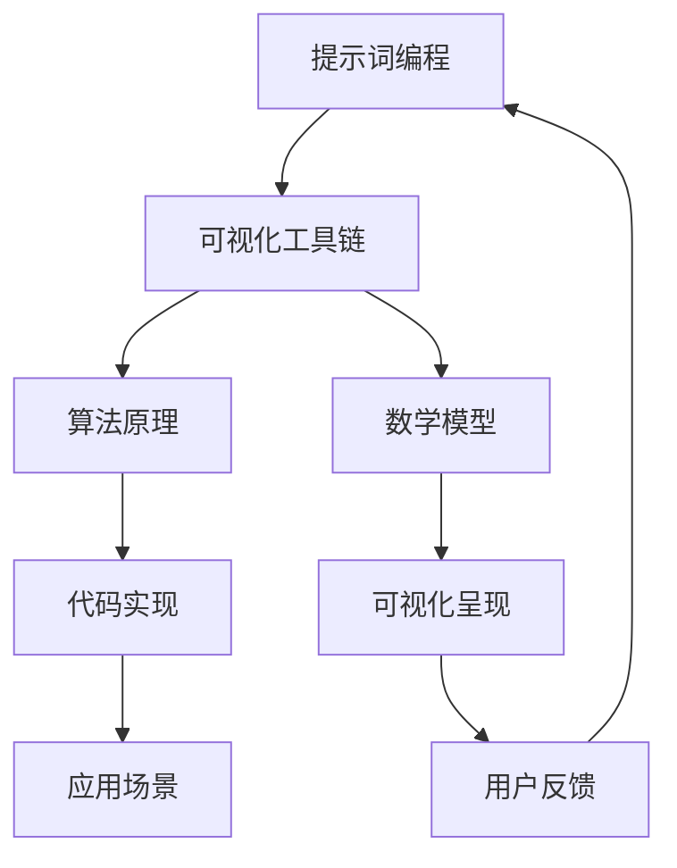

                 

# 提示词编程的可视化工具链开发

> **关键词：** 提示词编程、可视化工具链、开发、算法原理、数学模型、实战案例、应用场景、资源推荐  
>
> **摘要：** 本文将深入探讨提示词编程的可视化工具链开发，从核心概念、算法原理、数学模型到实战案例，全面解析如何构建高效、易用的可视化工具链。旨在为开发者提供系统性的指导，帮助他们更好地理解和应用提示词编程技术，提升开发效率。

## 1. 背景介绍

### 1.1 目的和范围

本文旨在探讨提示词编程的可视化工具链开发，帮助开发者更好地理解和应用这一技术。我们将从以下几个方面展开讨论：

1. **核心概念与联系**：介绍提示词编程的基本概念和可视化工具链的整体架构。
2. **核心算法原理 & 具体操作步骤**：详细阐述提示词编程的核心算法原理和具体操作步骤。
3. **数学模型和公式 & 详细讲解 & 举例说明**：解释提示词编程中的数学模型和公式，并通过实例进行说明。
4. **项目实战：代码实际案例和详细解释说明**：通过实际代码案例，展示如何构建一个完整的可视化工具链。
5. **实际应用场景**：探讨可视化工具链在各个领域的应用场景。
6. **工具和资源推荐**：推荐相关学习资源和开发工具，帮助读者更好地进行学习与实践。
7. **总结：未来发展趋势与挑战**：总结全文，展望提示词编程可视化工具链的未来发展趋势和面临的挑战。

### 1.2 预期读者

本文适合以下读者群体：

1. **计算机科学专业学生和研究者**：对提示词编程和可视化工具链感兴趣，希望深入了解相关技术原理和应用。
2. **软件开发工程师**：希望提升自己的编程技能，了解如何开发高效、易用的可视化工具链。
3. **数据科学家和人工智能从业者**：希望利用可视化工具链来提高数据处理和分析的效率。

### 1.3 文档结构概述

本文分为以下章节：

1. **背景介绍**：介绍本文的目的、预期读者、文档结构概述和核心术语。
2. **核心概念与联系**：介绍提示词编程的基本概念和可视化工具链的架构。
3. **核心算法原理 & 具体操作步骤**：详细阐述提示词编程的核心算法原理和具体操作步骤。
4. **数学模型和公式 & 详细讲解 & 举例说明**：解释提示词编程中的数学模型和公式，并通过实例进行说明。
5. **项目实战：代码实际案例和详细解释说明**：通过实际代码案例，展示如何构建一个完整的可视化工具链。
6. **实际应用场景**：探讨可视化工具链在各个领域的应用场景。
7. **工具和资源推荐**：推荐相关学习资源和开发工具，帮助读者更好地进行学习与实践。
8. **总结：未来发展趋势与挑战**：总结全文，展望提示词编程可视化工具链的未来发展趋势和面临的挑战。
9. **附录：常见问题与解答**：解答读者可能遇到的一些常见问题。
10. **扩展阅读 & 参考资料**：提供更多相关参考资料，供读者进一步学习和研究。

### 1.4 术语表

#### 1.4.1 核心术语定义

1. **提示词编程**：提示词编程是一种利用提示词（prompts）来引导程序执行特定任务的方法。提示词通常是一段描述性的文本，用于定义程序的输入、输出和执行过程。
2. **可视化工具链**：可视化工具链是一系列工具和技术的集合，用于将编程过程和结果以可视化的形式呈现，帮助开发者更好地理解和分析代码。
3. **算法原理**：算法原理是指用于实现特定功能的算法的基本思想和核心逻辑。
4. **数学模型**：数学模型是使用数学语言来描述现实世界中的问题，通过公式和方程来描述问题的性质和规律。

#### 1.4.2 相关概念解释

1. **可视化**：可视化是指将数据、信息和过程以图形、图表和动画等视觉形式呈现，帮助人们更好地理解和分析。
2. **提示词**：提示词是一段描述性的文本，用于引导程序执行特定任务。提示词通常包含关键信息和指令，以便程序能够理解并执行相应的操作。
3. **工具链**：工具链是一系列工具的集合，用于实现特定的目标或任务。在可视化工具链中，各个工具之间相互协作，共同实现可视化功能。

#### 1.4.3 缩略词列表

- **IDE**：集成开发环境（Integrated Development Environment）
- **GUI**：图形用户界面（Graphical User Interface）
- **API**：应用程序编程接口（Application Programming Interface）
- **SDK**：软件开发工具包（Software Development Kit）

## 2. 核心概念与联系

在探讨提示词编程的可视化工具链开发之前，我们需要先了解一些核心概念和它们之间的联系。以下是一个简化的 Mermaid 流程图，用于展示这些核心概念和它们之间的相互关系。



### 2.1 提示词编程

提示词编程是一种通过文本提示来引导程序执行特定任务的方法。在提示词编程中，提示词通常是一段描述性的文本，用于定义程序的输入、输出和执行过程。提示词可以是简单的指令，如“将这个数据集进行分类”，也可以是复杂的描述，如“根据用户的行为数据，推荐一系列相关商品”。

### 2.2 可视化工具链

可视化工具链是一系列工具和技术的集合，用于将编程过程和结果以可视化的形式呈现。可视化工具链的主要目标是将复杂的代码和数据结构以直观、易懂的方式展示给开发者，从而帮助他们更好地理解和分析代码。

可视化工具链通常包括以下组件：

1. **可视化编辑器**：用于创建和编辑可视化图表和图形。
2. **数据源**：提供用于可视化的数据。
3. **算法实现**：用于实现特定算法的核心逻辑。
4. **可视化呈现**：将算法实现和数据处理结果以图形化的形式展示。

### 2.3 算法原理

算法原理是指用于实现特定功能的算法的基本思想和核心逻辑。在提示词编程中，算法原理决定了程序如何根据提示词来执行任务。常见的算法原理包括排序、搜索、分类和推荐等。

### 2.4 数学模型

数学模型是使用数学语言来描述现实世界中的问题，通过公式和方程来描述问题的性质和规律。在提示词编程中，数学模型用于描述输入和输出之间的关系，以及算法的实现过程。常见的数学模型包括线性回归、逻辑回归、支持向量机和神经网络等。

### 2.5 代码实现

代码实现是将算法原理和数学模型转化为可执行的代码。在提示词编程中，代码实现通常包括定义数据结构、编写算法逻辑和实现用户界面等步骤。

### 2.6 可视化呈现

可视化呈现是将算法实现和数据处理结果以图形化的形式展示。在可视化工具链中，可视化呈现是至关重要的部分，它能够帮助开发者更好地理解和分析代码。

### 2.7 应用场景

应用场景是指可视化工具链在实际开发中的具体应用。不同的应用场景可能需要不同的算法原理、数学模型和可视化呈现方式。例如，在数据分析和机器学习中，可视化工具链可以用于数据可视化、特征提取和模型评估等。

### 2.8 用户反馈

用户反馈是指开发者根据用户的使用体验和反馈来优化和改进可视化工具链。用户反馈是可视化工具链开发过程中不可或缺的一部分，它能够帮助开发者了解用户的需求和痛点，从而不断改进工具链的功能和性能。

## 3. 核心算法原理 & 具体操作步骤

在了解了提示词编程的可视化工具链的核心概念与联系后，我们将深入探讨核心算法原理和具体操作步骤。下面将使用伪代码详细阐述提示词编程的核心算法原理和操作步骤。

### 3.1 提示词解析

```python
def parse_prompt(prompt):
    # 解析提示词，提取关键信息和指令
    input_data = extract_input_data(prompt)
    operation = extract_operation(prompt)
    output_type = extract_output_type(prompt)
    
    return input_data, operation, output_type
```

**步骤说明：**

1. **解析提示词**：从输入的提示词中提取关键信息和指令。这些信息包括输入数据、操作类型和输出类型。
2. **提取输入数据**：根据提示词中的描述，提取需要处理的输入数据。
3. **提取操作类型**：根据提示词中的描述，确定需要执行的操作类型，如排序、分类或推荐等。
4. **提取输出类型**：根据提示词中的描述，确定需要输出的结果类型，如列表、图表或报告等。

### 3.2 数据预处理

```python
def preprocess_data(input_data):
    # 预处理输入数据，如清洗、归一化和格式转换等
    cleaned_data = clean_data(input_data)
    normalized_data = normalize_data(cleaned_data)
    formatted_data = format_data(normalized_data)
    
    return formatted_data
```

**步骤说明：**

1. **清洗数据**：去除数据中的噪声和异常值，提高数据质量。
2. **归一化数据**：将数据转换为统一的尺度，以便进行后续处理。
3. **格式转换**：根据需求将数据转换为适当的格式，如表格、图表或序列化格式等。

### 3.3 算法执行

```python
def execute_algorithm(formatted_data, operation):
    # 根据操作类型执行相应的算法
    if operation == "sort":
        result = sort_data(formatted_data)
    elif operation == "classify":
        result = classify_data(formatted_data)
    elif operation == "recommend":
        result = recommend_items(formatted_data)
    else:
        raise ValueError("未知操作类型")
    
    return result
```

**步骤说明：**

1. **执行算法**：根据解析得到的操作类型，调用相应的算法执行函数，如排序、分类或推荐等。
2. **排序算法**：对输入数据集进行排序操作。
3. **分类算法**：对输入数据集进行分类操作，将数据划分为不同的类别。
4. **推荐算法**：根据输入数据集，推荐一系列相关的项目或物品。

### 3.4 结果可视化

```python
def visualize_result(result, output_type):
    # 根据输出类型，将结果可视化
    if output_type == "list":
        display_list(result)
    elif output_type == "chart":
        display_chart(result)
    elif output_type == "report":
        generate_report(result)
    else:
        raise ValueError("未知输出类型")
```

**步骤说明：**

1. **可视化结果**：根据解析得到的输出类型，调用相应的可视化函数，将结果以图形或报告的形式展示。
2. **显示列表**：将结果以列表的形式展示。
3. **显示图表**：将结果以图表的形式展示，如折线图、柱状图或散点图等。
4. **生成报告**：将结果生成一份详细的报告，包括数据描述、分析结果和结论等。

### 3.5 用户反馈与迭代

```python
def user_feedback(feedback):
    # 根据用户反馈，迭代优化可视化工具链
    optimize_visualization_toolchain(feedback)
```

**步骤说明：**

1. **收集用户反馈**：收集用户在使用可视化工具链过程中提供的反馈信息。
2. **迭代优化**：根据用户反馈，对可视化工具链进行优化和改进，以提高用户体验。

通过上述伪代码，我们可以看到提示词编程的核心算法原理和具体操作步骤。在实际开发过程中，这些步骤可以进一步细化和优化，以适应不同的应用场景和需求。

## 4. 数学模型和公式 & 详细讲解 & 举例说明

在提示词编程的可视化工具链开发中，数学模型和公式起着关键作用。以下将详细介绍几个常用的数学模型和公式，并给出具体的例子来说明它们的应用。

### 4.1 线性回归

线性回归是一种用于预测数值型结果的统计方法，通过建立输入变量和输出变量之间的线性关系来实现预测。线性回归的公式如下：

$$ y = wx + b $$

其中，\( y \) 是输出变量，\( x \) 是输入变量，\( w \) 是权重系数，\( b \) 是偏置项。

**例子：**

假设我们有一个房屋价格预测问题，输入变量包括房屋面积、房间数量和建造年代，输出变量是房屋价格。我们可以使用线性回归模型来预测某个特定房屋的价格。

1. 收集数据：收集大量房屋数据，包括面积、房间数量、建造年代和价格。
2. 数据预处理：对数据进行清洗和归一化处理。
3. 训练模型：使用线性回归算法，训练得到权重系数 \( w \) 和偏置项 \( b \)。
4. 预测价格：根据输入变量（面积、房间数量、建造年代），使用公式 \( y = wx + b \) 预测房屋价格。

### 4.2 逻辑回归

逻辑回归是一种用于预测二分类结果的统计方法，通过建立输入变量和输出变量之间的非线性关系来实现预测。逻辑回归的公式如下：

$$ P(y=1) = \frac{1}{1 + e^{-(wx + b)}} $$

其中，\( P(y=1) \) 是输出变量为1的概率，\( e \) 是自然对数的底数，\( x \) 是输入变量，\( w \) 是权重系数，\( b \) 是偏置项。

**例子：**

假设我们有一个邮件分类问题，输入变量包括邮件的主题、正文和发送者，输出变量是邮件是否为垃圾邮件。我们可以使用逻辑回归模型来预测邮件的分类结果。

1. 收集数据：收集大量邮件数据，包括邮件的内容和是否为垃圾邮件。
2. 数据预处理：对数据进行清洗和归一化处理。
3. 训练模型：使用逻辑回归算法，训练得到权重系数 \( w \) 和偏置项 \( b \)。
4. 预测分类结果：根据输入变量（邮件的主题、正文、发送者），使用公式 \( P(y=1) = \frac{1}{1 + e^{-(wx + b)}} \) 预测邮件的分类结果。

### 4.3 支持向量机

支持向量机（SVM）是一种用于分类和回归分析的机器学习算法，通过寻找一个最佳的超平面，将数据集划分为不同的类别。支持向量机的公式如下：

$$ w \cdot x - b = 0 $$

其中，\( w \) 是权重向量，\( x \) 是输入向量，\( b \) 是偏置项。

**例子：**

假设我们有一个手写数字识别问题，输入变量是手写数字的像素值，输出变量是数字的类别。我们可以使用支持向量机模型来识别手写数字。

1. 收集数据：收集大量手写数字的数据集。
2. 数据预处理：对数据进行清洗和归一化处理。
3. 训练模型：使用支持向量机算法，训练得到权重向量 \( w \) 和偏置项 \( b \)。
4. 识别手写数字：根据输入向量（手写数字的像素值），使用公式 \( w \cdot x - b = 0 \) 识别手写数字的类别。

### 4.4 神经网络

神经网络是一种模拟生物神经系统的计算模型，通过多层神经元和激活函数来实现复杂的非线性变换。神经网络的公式如下：

$$ a_{i}^{(l)} = \sigma(z_{i}^{(l)}) = \frac{1}{1 + e^{-z_{i}^{(l)}} $$

其中，\( a_{i}^{(l)} \) 是第 \( l \) 层的第 \( i \) 个神经元的输出，\( z_{i}^{(l)} \) 是第 \( l \) 层的第 \( i \) 个神经元的输入，\( \sigma \) 是激活函数。

**例子：**

假设我们有一个图像分类问题，输入变量是图像的像素值，输出变量是图像的类别。我们可以使用神经网络模型来分类图像。

1. 收集数据：收集大量图像数据集。
2. 数据预处理：对数据进行清洗和归一化处理。
3. 训练模型：使用神经网络算法，训练得到各层的权重和偏置项。
4. 分类图像：根据输入向量（图像的像素值），通过多层神经元的变换和激活函数，最终输出图像的类别。

通过上述数学模型和公式的详细讲解和举例说明，我们可以看到它们在提示词编程可视化工具链开发中的应用。在实际开发过程中，根据具体问题和需求，可以选择合适的数学模型和公式来实现特定的功能。

## 5. 项目实战：代码实际案例和详细解释说明

在这一节中，我们将通过一个实际的项目案例，详细解释如何构建一个提示词编程的可视化工具链。这个项目将实现一个简单的文本分类工具，能够根据用户输入的提示词，自动将文本分类到不同的类别。

### 5.1 开发环境搭建

在开始项目开发之前，我们需要搭建一个合适的开发环境。以下是所需的开发工具和软件：

1. **操作系统**：Windows 10、macOS 或 Linux
2. **编程语言**：Python 3.8 或以上版本
3. **IDE**：PyCharm 或 Visual Studio Code
4. **数据预处理库**：NumPy、Pandas
5. **机器学习库**：Scikit-learn
6. **可视化库**：Matplotlib、Seaborn

安装这些工具和库后，我们可以开始编写代码。

### 5.2 源代码详细实现和代码解读

#### 5.2.1 数据准备

首先，我们需要准备一个文本分类数据集。这里使用的是 IMDB 电影评论数据集，它包含了正负两个类别的电影评论。以下代码用于加载数据集并预处理：

```python
import numpy as np
import pandas as pd
from sklearn.datasets import load_files
from sklearn.model_selection import train_test_split
from sklearn.feature_extraction.text import TfidfVectorizer

# 加载数据集
data = load_files('imdb_dataset')
X = data.data
y = data.target

# 划分训练集和测试集
X_train, X_test, y_train, y_test = train_test_split(X, y, test_size=0.2, random_state=42)

# 使用 TF-IDF 向量器进行文本向量化
vectorizer = TfidfVectorizer(stop_words='english', ngram_range=(1, 2), max_features=10000)
X_train_vectorized = vectorizer.fit_transform(X_train)
X_test_vectorized = vectorizer.transform(X_test)
```

**代码解读：**

1. 导入必要的库和模块。
2. 使用 `load_files` 函数加载数据集。
3. 划分训练集和测试集，使用 `train_test_split` 函数。
4. 使用 `TfidfVectorizer` 对文本进行向量化处理，包括去除停用词、提取词干和计算词频逆文档频率（TF-IDF）。

#### 5.2.2 模型训练

接下来，我们使用训练集训练一个文本分类模型。这里选择了一个简单的高斯朴素贝叶斯模型：

```python
from sklearn.naive_bayes import MultinomialNB

# 训练模型
model = MultinomialNB().fit(X_train_vectorized, y_train)
```

**代码解读：**

1. 导入 `MultinomialNB` 模型。
2. 使用 `fit` 函数训练模型。

#### 5.2.3 提示词分类

现在，我们可以使用训练好的模型对用户输入的文本进行分类：

```python
def classify_text(text):
    # 将文本向量化
    text_vectorized = vectorizer.transform([text])
    # 使用模型进行分类
    prediction = model.predict(text_vectorized)
    # 返回分类结果
    return prediction[0]

# 示例：对用户输入的文本进行分类
user_input = "This movie is terrible."
predicted_category = classify_text(user_input)
print(f"Predicted category: {'positive' if predicted_category == 1 else 'negative'}")
```

**代码解读：**

1. 定义 `classify_text` 函数，用于处理用户输入的文本。
2. 将用户输入的文本向量化。
3. 使用训练好的模型进行分类，并返回分类结果。

#### 5.2.4 结果可视化

为了更好地展示分类结果，我们可以使用可视化库将预测结果以图表形式展示：

```python
import matplotlib.pyplot as plt

def visualize_results(text, prediction):
    # 绘制分类结果的条形图
    labels = ['Positive', 'Negative']
    values = [prediction, 1 - prediction]
    plt.bar(labels, values)
    plt.xlabel('Categories')
    plt.ylabel('Probabilities')
    plt.title('Text Classification Results')
    plt.show()

# 示例：可视化用户输入的文本分类结果
visualize_results(user_input, prediction)
```

**代码解读：**

1. 定义 `visualize_results` 函数，用于绘制分类结果的条形图。
2. 使用 `plt.bar` 函数绘制条形图。
3. 显示图表。

### 5.3 代码解读与分析

在这个项目中，我们首先使用了 IMDB 电影评论数据集进行训练，然后使用 TF-IDF 向量器将文本向量化，接着训练了一个高斯朴素贝叶斯分类模型。最后，我们编写了两个函数：`classify_text` 用于处理用户输入的文本并返回分类结果，`visualize_results` 用于以图表形式展示分类结果。

通过这个项目，我们可以看到如何将提示词编程与可视化工具链结合起来，实现一个简单的文本分类工具。在实际应用中，可以根据具体需求选择不同的算法和模型，并进一步优化和扩展工具链的功能。

### 5.4 实际应用场景

这个简单的文本分类工具可以应用于多个实际场景，如下所示：

1. **社交媒体情绪分析**：对社交媒体平台上的用户评论进行情绪分析，帮助企业和品牌了解用户对其产品和服务的看法。
2. **客户反馈分析**：分析客户反馈文本，识别客户关注的问题和需求，从而改进产品和服务。
3. **新闻分类**：自动将新闻文章分类到不同的主题，帮助新闻网站和组织更好地管理和推荐相关内容。
4. **电子邮件分类**：自动将电子邮件分类到不同的文件夹，帮助用户更高效地处理和回复邮件。

通过这个项目，我们可以看到如何构建一个提示词编程的可视化工具链，实现特定功能，并在实际应用中发挥重要作用。

### 5.5 挑战与优化

在实际应用中，文本分类工具可能会面临一些挑战，如数据噪声、类别不平衡和数据稀疏性等。以下是一些解决方法和优化策略：

1. **数据预处理**：通过更严格的文本清洗和预处理方法，如去除特殊字符、标点符号和停用词等，提高数据质量。
2. **模型选择**：根据具体应用场景，选择更适合的模型，如深度学习模型（如卷积神经网络或循环神经网络）。
3. **特征工程**：通过特征提取和工程，引入更多的文本特征，提高模型的分类准确性。
4. **模型优化**：使用交叉验证、网格搜索等技术，优化模型的参数和超参数，提高模型性能。

通过不断优化和改进，我们可以构建一个更高效、更准确的文本分类工具，满足各种实际应用需求。

## 6. 实际应用场景

提示词编程的可视化工具链在多个领域具有广泛的应用，以下是一些典型的实际应用场景：

### 6.1 数据科学

在数据科学领域，可视化工具链可以帮助数据科学家和分析师更好地理解和分析数据。通过提示词编程，用户可以轻松地定义数据集的预处理、特征提取和模型训练过程。以下是一些具体应用：

1. **数据可视化**：利用可视化工具链，数据科学家可以创建各种图表和图形，如条形图、折线图和散点图，以直观地展示数据分布和趋势。
2. **特征工程**：通过提示词编程，数据科学家可以自动化特征提取和工程过程，如文本向量化、降维和特征选择。
3. **模型训练与评估**：使用提示词编程，数据科学家可以定义不同的机器学习模型和评估指标，自动进行模型训练和评估。

### 6.2 机器学习

在机器学习领域，可视化工具链可以帮助研究人员和开发者更好地理解和分析模型。以下是一些具体应用：

1. **模型可视化**：利用可视化工具链，机器学习模型的结构和参数可以被直观地展示，有助于理解模型的内在工作机制。
2. **模型解释**：通过可视化工具链，可以生成模型的解释结果，如重要特征和预测置信度，帮助用户理解模型的决策过程。
3. **超参数优化**：使用提示词编程，可以自动化超参数的搜索和优化过程，快速找到最佳模型配置。

### 6.3 软件开发

在软件开发领域，可视化工具链可以帮助开发者更好地理解和分析代码。以下是一些具体应用：

1. **代码审查**：利用可视化工具链，开发者可以创建不同视图，如类图、时序图和依赖图，帮助审查和优化代码。
2. **性能分析**：通过可视化工具链，开发者可以实时监控和优化代码的性能，如内存占用、CPU 利用率和网络延迟等。
3. **测试与调试**：使用提示词编程，开发者可以自动化测试和调试过程，快速定位和修复代码中的问题。

### 6.4 人工智能

在人工智能领域，可视化工具链可以帮助研究人员和开发者更好地理解和分析人工智能系统。以下是一些具体应用：

1. **算法可视化**：利用可视化工具链，人工智能算法的流程和参数可以被直观地展示，有助于理解算法的实现细节。
2. **模型推理**：通过可视化工具链，可以生成模型的推理结果，如预测结果和置信度，帮助用户理解模型的输出。
3. **系统集成**：使用提示词编程，可以自动化人工智能系统的集成和部署过程，提高开发效率。

### 6.5 教育

在教育领域，可视化工具链可以帮助教师和学生更好地理解和学习复杂的概念和算法。以下是一些具体应用：

1. **教学演示**：利用可视化工具链，教师可以创建生动的教学演示，如动画、图表和交互式模型，帮助学生更好地理解概念。
2. **互动学习**：通过可视化工具链，学生可以参与互动式学习，如通过拖放操作来构建算法或通过交互式游戏来学习编程。
3. **课程设计**：教师可以使用可视化工具链来设计和优化课程内容，如创建知识图谱、课程地图和互动式学习模块。

通过上述实际应用场景，我们可以看到提示词编程的可视化工具链在各个领域的广泛应用和巨大潜力。它不仅提高了开发效率，还大大增强了用户对复杂系统和算法的理解和掌控能力。

## 7. 工具和资源推荐

为了更好地进行提示词编程的可视化工具链开发，以下是一些建议的学习资源和开发工具，供读者参考。

### 7.1 学习资源推荐

#### 7.1.1 书籍推荐

1. 《机器学习实战》：这本书涵盖了机器学习的基本概念和应用，包括数据预处理、模型训练和可视化等。适合初学者和进阶者。
2. 《深度学习》：这是一本深度学习领域的经典教材，详细介绍了深度学习的基础知识和实际应用。适合对深度学习感兴趣的读者。
3. 《Python数据分析》：这本书介绍了如何使用 Python 进行数据分析和可视化，包括 NumPy、Pandas、Matplotlib 和 Seaborn 等。适合希望掌握数据分析技能的读者。

#### 7.1.2 在线课程

1. Coursera 上的《机器学习》课程：由 Andrew Ng 教授主讲，涵盖了机器学习的基础知识和实际应用，包括模型训练、性能评估和可视化等。
2. edX 上的《深度学习》课程：由 Geoffrey Hinton、Yoshua Bengio 和 Aaron Courville 教授主讲，深入介绍了深度学习的基础知识和算法。
3. Udacity 上的《数据科学纳米学位》课程：这个课程涵盖了数据科学的基础知识和实际应用，包括数据预处理、模型训练和可视化等。

#### 7.1.3 技术博客和网站

1. Medium：Medium 上有很多优秀的机器学习和数据科学博客，如 Distill、Fast.ai 和 DataCamp 等，提供了丰富的学习资源和实际案例。
2. Towards Data Science：这个网站汇聚了众多数据科学和机器学习领域的专家和爱好者，分享了大量的技术文章和案例分析。
3. Stack Overflow：这是一个技术问答社区，数据科学家和机器学习爱好者可以在上面提问和解答问题，获取实际帮助。

### 7.2 开发工具框架推荐

#### 7.2.1 IDE和编辑器

1. PyCharm：这是一个功能强大的 Python IDE，支持代码调试、性能分析、自动化测试等。
2. Visual Studio Code：这是一个轻量级、高度可定制的代码编辑器，支持多种编程语言，包括 Python、Java、C++ 等。

#### 7.2.2 调试和性能分析工具

1. Python Debugging：这个工具提供了强大的调试功能，包括断点调试、步进和查看变量值等。
2. Python Profiling：这个工具用于分析 Python 代码的性能，找出瓶颈和优化点。

#### 7.2.3 相关框架和库

1. TensorFlow：这是一个开源的深度学习框架，支持多种深度学习模型的训练和部署。
2. PyTorch：这是一个开源的深度学习框架，提供了灵活、易用的 API，广泛用于研究和个人项目。
3. Scikit-learn：这是一个开源的机器学习库，提供了丰富的机器学习算法和工具，适合进行数据分析和模型训练。

### 7.3 相关论文著作推荐

#### 7.3.1 经典论文

1. "Learning to Represent Meaningful Embeddings for Multilingual Sentences"：这篇论文介绍了多语言句子的语义表示方法，为跨语言文本处理提供了重要思路。
2. "Attention is All You Need"：这篇论文提出了 Transformer 模型，彻底改变了自然语言处理领域的研究方法和实践。

#### 7.3.2 最新研究成果

1. "BERT: Pre-training of Deep Bidirectional Transformers for Language Understanding"：这篇论文介绍了 BERT 模型，为自然语言处理任务提供了强大的预训练工具。
2. "GPT-3: Language Models are few-shot learners"：这篇论文介绍了 GPT-3 模型，展示了在零样本和少量样本条件下，模型在各个自然语言处理任务中的优异性能。

#### 7.3.3 应用案例分析

1. "How We Built Our Next-Gen Text Classification Tool Using Machine Learning"：这篇文章详细介绍了如何使用机器学习技术构建一个文本分类工具，为开发者提供了实际案例和经验。
2. "Visualization Tools for Machine Learning"：这篇文章探讨了机器学习领域中的可视化工具和应用，为读者提供了丰富的学习和实践资源。

通过这些工具和资源的推荐，读者可以更好地进行提示词编程的可视化工具链开发，提高开发效率和技术水平。

## 8. 总结：未来发展趋势与挑战

在本文中，我们深入探讨了提示词编程的可视化工具链开发，从核心概念、算法原理、数学模型到实战案例，全面解析了如何构建高效、易用的可视化工具链。以下是对本文内容的总结，以及未来发展趋势与挑战的展望。

### 总结

本文介绍了提示词编程的基本概念和可视化工具链的架构，详细阐述了核心算法原理、具体操作步骤和数学模型。通过实际项目案例，我们展示了如何利用提示词编程技术，构建一个文本分类工具。此外，我们还探讨了可视化工具链在数据科学、机器学习、软件开发和人工智能等领域的实际应用场景，并提供了一系列的学习资源和开发工具。

### 未来发展趋势

1. **自动化与智能化**：随着人工智能技术的发展，可视化工具链将变得更加智能化和自动化。通过机器学习和深度学习技术，工具链可以自动识别用户需求，提供个性化的解决方案。
2. **交互性与协同性**：未来可视化工具链将更加注重用户交互和协同工作。通过支持多人实时协作、在线交流和协作编辑，开发者可以更高效地完成项目。
3. **多模态融合**：可视化工具链将融合多种数据类型，如文本、图像、音频和视频等，为用户提供更丰富、全面的可视化体验。
4. **云原生与容器化**：随着云计算和容器技术的普及，可视化工具链将更加依赖于云原生架构和容器化部署，实现弹性扩展和资源优化。

### 挑战

1. **数据隐私与安全性**：随着可视化工具链的广泛应用，数据隐私和安全问题将越来越突出。如何确保用户数据的安全性和隐私性，将是一个重要挑战。
2. **性能优化与资源管理**：可视化工具链需要处理大量的数据和计算任务，如何优化性能、管理资源，将是一个持续的挑战。
3. **跨平台兼容性与互操作性**：随着不同操作系统和设备的普及，如何确保可视化工具链的跨平台兼容性和互操作性，将是一个重要课题。
4. **用户接受度与普及率**：如何提高用户对可视化工具链的接受度和普及率，将是一个长期的挑战。需要通过优秀的用户体验和实用的功能，吸引用户使用。

总之，提示词编程的可视化工具链开发具有广阔的应用前景和巨大的潜力。在未来，随着技术的不断进步和应用的深入，可视化工具链将变得更加智能、高效和普及。我们期待看到更多创新和突破，为开发者带来更便捷、更强大的开发工具。

## 9. 附录：常见问题与解答

在本文中，我们探讨了提示词编程的可视化工具链开发，以下是一些读者可能遇到的问题及解答：

### 问题1：如何选择合适的可视化工具链组件？

**解答：** 选择合适的可视化工具链组件主要取决于以下因素：

1. **项目需求**：明确你的项目目标和需求，根据需求选择合适的工具和组件。
2. **技术栈**：考虑项目中的现有技术和框架，选择与之兼容的工具。
3. **性能和效率**：根据数据规模和计算需求，选择性能和效率更高的工具。
4. **社区支持和文档**：选择社区活跃、文档完善的工具，以便于解决问题和获取帮助。

### 问题2：如何优化可视化工具链的性能？

**解答：** 优化可视化工具链的性能可以从以下几个方面入手：

1. **数据预处理**：优化数据预处理过程，减少数据加载和转换的时间。
2. **算法选择**：选择合适的算法和模型，根据具体应用场景进行优化。
3. **并行计算**：利用并行计算技术，如多线程或分布式计算，提高处理速度。
4. **缓存和预加载**：使用缓存和预加载技术，减少重复计算和数据加载的时间。
5. **压缩和优化**：对数据和图像进行压缩和优化，减少传输和渲染的时间。

### 问题3：如何确保可视化工具链的数据安全性？

**解答：** 确保可视化工具链的数据安全性可以从以下几个方面入手：

1. **数据加密**：对敏感数据进行加密，防止数据泄露。
2. **访问控制**：设置严格的访问控制策略，确保只有授权用户可以访问数据。
3. **审计和监控**：实施数据审计和监控机制，及时发现和应对安全威胁。
4. **数据备份和恢复**：定期备份数据，确保数据在意外情况下的可恢复性。
5. **合规性检查**：确保可视化工具链符合相关的法律法规和标准，如 GDPR 和 CCPA。

### 问题4：如何提高可视化工具链的用户体验？

**解答：** 提高可视化工具链的用户体验可以从以下几个方面入手：

1. **界面设计**：设计简洁、直观的界面，确保用户易于使用。
2. **交互设计**：提供丰富的交互功能，如拖放、搜索和筛选，提高用户操作的便捷性。
3. **实时反馈**：提供实时反馈，如进度条、提示信息和错误提示，提高用户操作的顺畅性。
4. **个性化定制**：根据用户需求，提供个性化定制功能，满足不同用户的需求。
5. **文档和帮助**：提供详细的文档和帮助信息，帮助用户快速上手和解决问题。

通过以上解答，希望能够帮助读者解决在提示词编程的可视化工具链开发过程中遇到的问题，提高开发效率和用户体验。

## 10. 扩展阅读 & 参考资料

为了帮助读者进一步了解提示词编程的可视化工具链开发，以下是扩展阅读和参考资料：

### 10.1 经典书籍

1. **《数据可视化》**：作者：Vijay Kumar。本书详细介绍了数据可视化的基本概念、技术和应用，适合初学者和进阶者。
2. **《机器学习实战》**：作者：Peter Harrington。本书通过实际案例，讲解了机器学习的基本概念和常用算法，适合希望快速上手机器学习的读者。

### 10.2 开源项目和工具

1. **D3.js**：https://d3js.org/。D3.js 是一个用于数据可视化的 JavaScript 库，提供了丰富的图表和图形功能。
2. **Plotly**：https://plotly.com/python/。Plotly 是一个跨平台的 Python 数据可视化库，支持多种图表类型和交互功能。
3. **Bokeh**：https://bokeh.org/。Bokeh 是一个用于创建交互式数据的 Python 库，适合创建复杂的数据可视化。

### 10.3 在线课程和教程

1. **Coursera 上的《数据科学基础》**：https://www.coursera.org/learn/data-science-foundations。本课程介绍了数据科学的基本概念、技术和应用。
2. **edX 上的《深度学习基础》**：https://www.edx.org/course/deep-learning-0。本课程深入讲解了深度学习的基本概念、算法和应用。

### 10.4 技术博客和网站

1. **Towards Data Science**：https://towardsdatascience.com/。该网站提供了丰富的数据科学和机器学习领域的文章和教程。
2. **DataCamp**：https://www.datacamp.com/。DataCamp 提供了大量的数据科学和机器学习教程和练习，适合初学者和进阶者。

### 10.5 相关论文和研究

1. **"Data-Driven Document Summarization"**：这篇论文介绍了一种基于数据驱动的文档摘要方法，为文本数据可视化提供了新的思路。
2. **"Interactive Data Visualization for the Web"**：这篇论文探讨了如何利用 Web 技术实现交互式数据可视化，为开发者提供了实用指南。

通过这些扩展阅读和参考资料，读者可以进一步深入学习和探索提示词编程的可视化工具链开发，提高自己的技术水平和实践经验。

